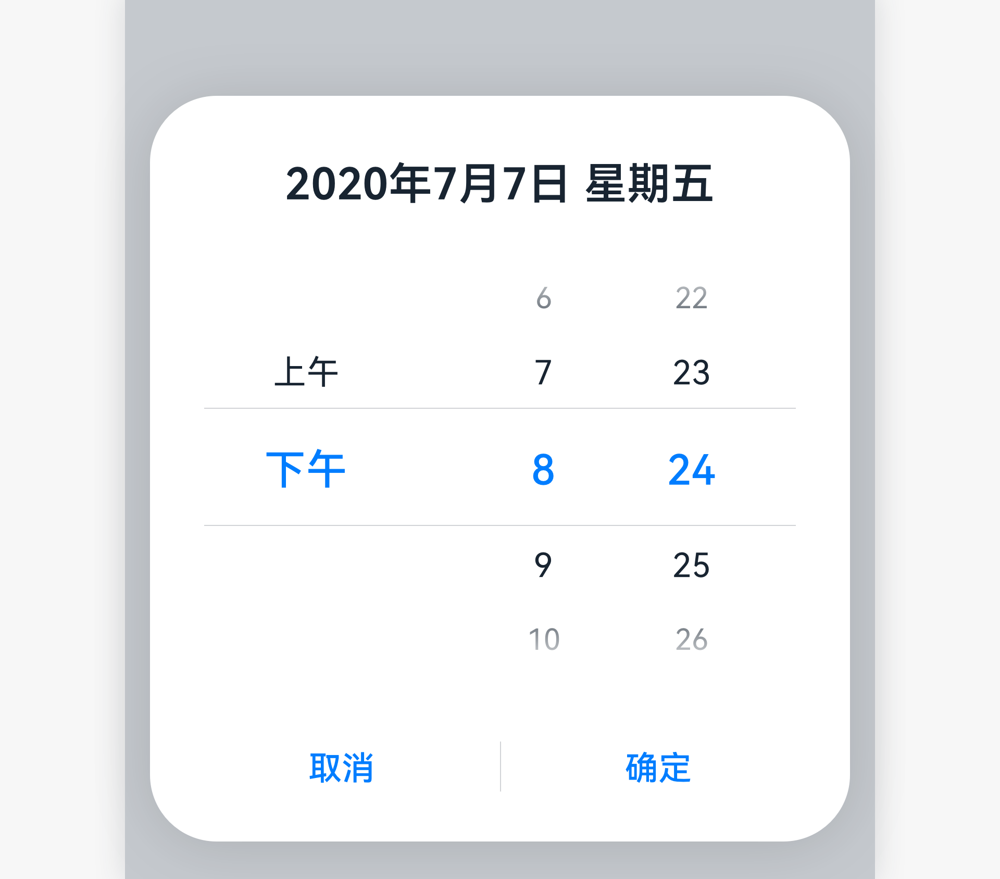
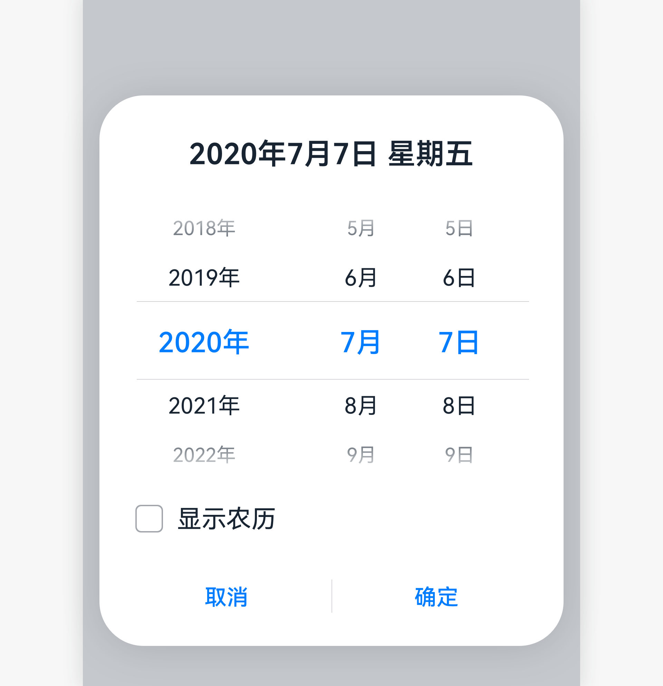

# 滑动选择器

滑动选择器是可以从单个维度或多个维度帮助用户进行单选或组合选择的控件。

## 如何使用

- 滑动选择器常用于时间选择器场景，用来选择年、月、日、星期、小时、分的一项或几项的组合。

- 用来选择某个具体时间。

- 时间选择器使用弹出框或者内嵌的方式，在移动设备上选择单个时间（小时:分钟 的格式）。其格式可根据用户的时间设置自动调整。例如 12 小时或 24 小时格式。

## 时间选择器

- 内容区：显示小时分。可跟随系统设置切换 12/24 小时显示小时分。

- 操作区：操作为“取消”、“确定”。
    | |
  | -------- |
  |  | 

  有关时间选择器的软件实现，请参阅[“TimePicker”](https://gitee.com/openharmony/docs/blob/master/zh-cn/application-dev/reference/arkui-ts/ts-basic-components-timepicker.md)。

## 日期选择器

- 标题：显示年月日星期。可由应用根据实际场景来定义。

- 内容区：根据业务场景显示所有年份 还是 不显示今年以后的年份(最多显示到今年，及带一个--，表示不选择年）。例如生日场景，年份可以不选。开发可自定义是否有农历开关。当界面上显示农历开关时，农历开关打开的时候，显示农历日期。农历开关关闭的时候，显示公历日期。当界面上没有显示农历开关时，可定义界面是显示公历还是农历。

- 操作区：操作为“取消”、“确定”。
  

  有关日期选择器的软件实现，请参阅[“DatePicker”](https://gitee.com/openharmony/docs/blob/master/zh-cn/application-dev/reference/arkui-ts/ts-basic-components-datepicker.md)。

## 资源

滑动选择器相关的开发者文档详见基础组件[“TextPicker”](https://gitee.com/openharmony/docs/blob/master/zh-cn/application-dev/reference/arkui-ts/ts-basic-components-textpicker.md)、[“TimePicker”](https://gitee.com/openharmony/docs/blob/master/zh-cn/application-dev/reference/arkui-ts/ts-basic-components-timepicker.md)和[“DatePicker”](https://gitee.com/openharmony/docs/blob/master/zh-cn/application-dev/reference/arkui-ts/ts-basic-components-datepicker.md)。
