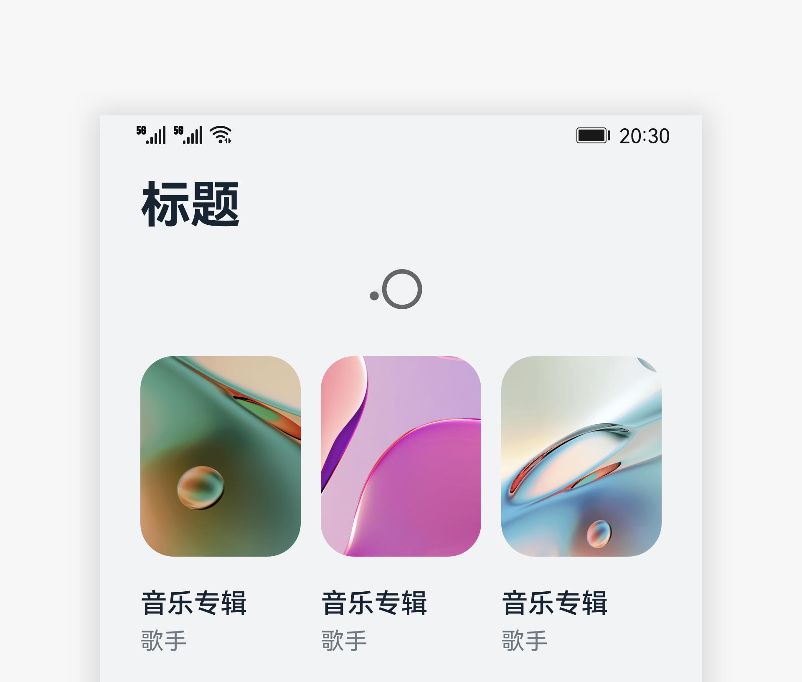

# 下拉刷新

下拉刷新是用户通过下拉手势快捷获取最新内容的控件。

 

## 如何使用

- 下拉刷新用于内容更新快，需要用户不断刷新页面，进行内容更新时。

- 下拉过程中显示loading转圈动画。

- 下拉小于规定距离时，松手后页面直接回弹。

- 下拉超过规定距离时并松手，触发刷新动画，仅显示loading转圈动画，不显示文字。

## 资源

下拉刷新相关开发文档详见容器组件[“Refresh”](https://gitee.com/openharmony/docs/blob/master/zh-cn/application-dev/reference/arkui-ts/ts-container-refresh.md)。
