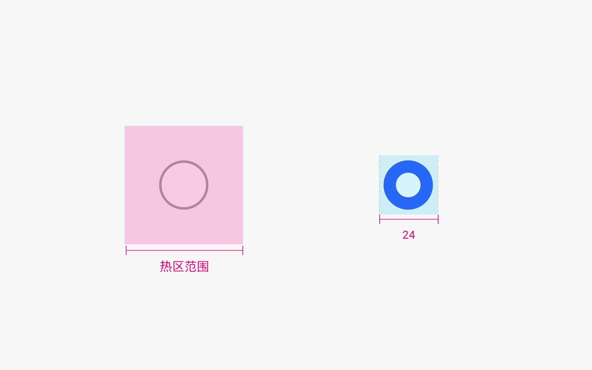

# 单选框

单选框是允许用户从多个互斥选项中选择单个选项，仅该选项选中生效的控件。

## 如何使用

- 单选框用于有多个选项的单选列表中。在用户仅能选择一个选项的情况下，需要使用单选框而不是多选框。

- 单选框所在的选项不会单独使用，而是需要和其他单选项成组使用，且展示出来的所有可选项处于平等的位置。

- 建议将默认选择项作为最佳选择项推荐给用户，且需确保选中项默认被用户看到。

- 如果为用户提供默认情况下，单选列表中有一项会被选中，作为默认值，用户无法清除默认值。

- 对于开关形式的选择，例如开，关。请考虑使用开关控件而不是单选列表。

- 某个单选项被选中后，其他单选项会被取消选中状态。

## 资源

单选框相关的开发者文档详见基础组件[“Radio”](https://gitee.com/openharmony/docs/blob/master/zh-cn/application-dev/reference/arkui-ts/ts-basic-components-radio.md)。
