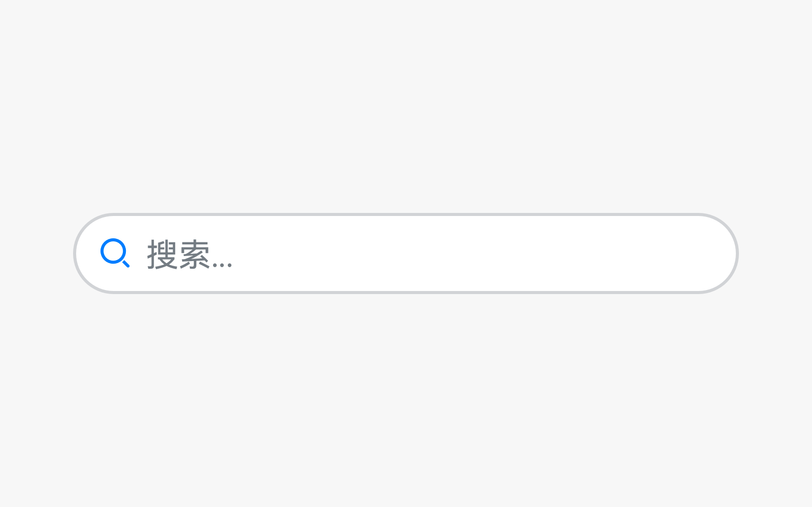

# 搜索框

搜索框是提供给用户进行内容搜索的控件。通过搜索，可以帮助用户快速的找到并定位到想要的内容。

## 如何使用

- 搜索框用于用户需要通过搜索功能来找到想要的内容，且该页面需要突出搜索功能时，使用搜索框（该页面不需要突出搜索功能时，使用搜索图标）。

- 搜索框可以结合搜索历史记录，输入自动补全，语音输入等功能，方便用户快速输入查询。

- 在搜索框有输入内容的时候，可以点击搜索框内的清除按钮，一键清除输入。

## 界面写作原则

显示的水印文字需要帮助用户了解可搜索什么内容

无运营需求的应用：水印文字采用动宾结构，中文为“搜索XXX、XXX、XXX...”或“搜索XXX”

有运营需求的应用：水印文字直接显示运营文案，常见于应用市场、视频、阅读等内容类应用。直接将水印文字作为搜索关键词进行搜索

## 资源

搜索框相关的开发者文档详见基础组件[“Search”](https://gitee.com/openharmony/docs/blob/master/zh-cn/application-dev/reference/arkui-ts/ts-basic-components-search.md)。
