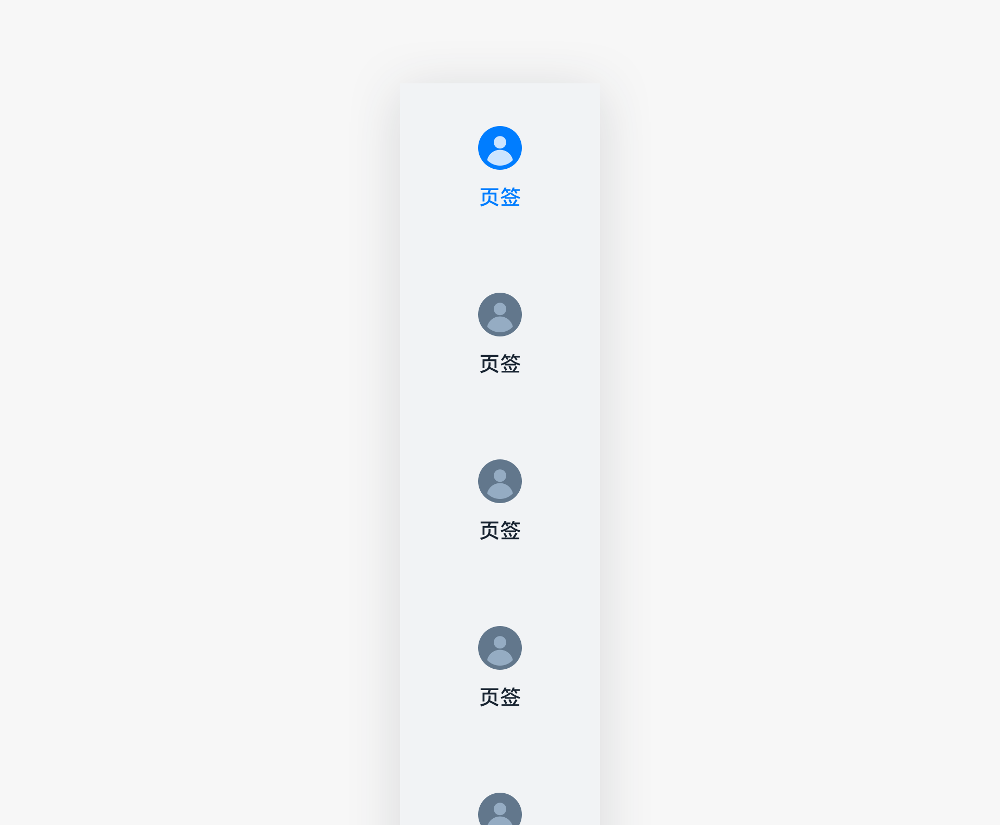
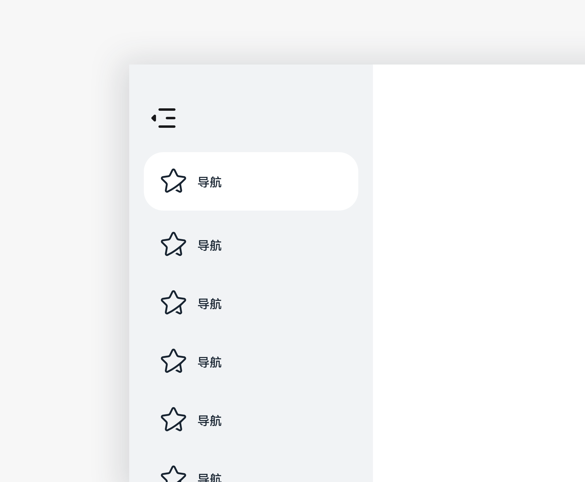
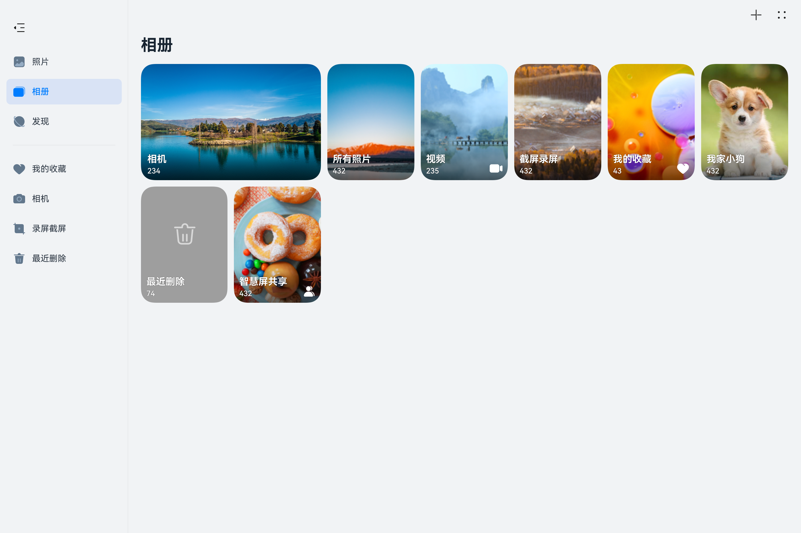

# 侧边导航栏

侧边导航栏是在平板横屏界面时，用于对应用进行导航操作的控件。在平板横屏界面时，使用侧边导航栏，切换页签或入口效率更高。

## 如何使用

- 侧边导航栏常用于一级界面。

- 侧边导航栏根据产品需要，使用合适的侧边导航栏样式。

## 分类

- 侧边页签

- 侧边入口列表
    |   | |
  | -------- | -------- |
  | 侧边页签 | 侧边入口列表 | 

### 侧边页签

通常在一级界面上使用，用于快速切换不同页签的内容。

### 侧边入口列表

通常在一级界面上使用。适用：效率型应用。

- 支持将较深层级的内容作为侧边入口。

- 支持用户自定义侧边入口。

- 支持侧边列表的编辑，例如删除、排序等。

- 支持拖拽内容到侧边导航栏上生成快捷访问的列表项。

- 点击“隐藏“图标，隐藏侧边栏。点击“显示“图标，显示侧边导航栏。

## 资源

侧边导航栏相关的开发者文档，侧边页签详见容器组件[“Tabs”](https://gitee.com/openharmony/docs/blob/master/zh-cn/application-dev/reference/arkui-ts/ts-container-tabs.md)和[“TabContent”](https://gitee.com/openharmony/docs/blob/master/zh-cn/application-dev/reference/arkui-ts/ts-container-tabcontent.md)，侧边入口列表详见容器组件[“SideBarContainer”](https://gitee.com/openharmony/docs/blob/master/zh-cn/application-dev/reference/arkui-ts/ts-container-sidebarcontainer.md)。
