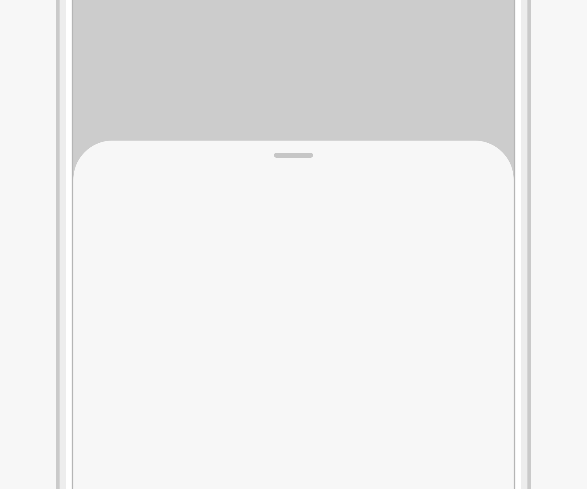

# 可滑动面板

可滑动面板是一种轻量的内容展示的窗口控件。

## 如何使用

- 可滑动面板常用于界面的底部，方便用户单手操作。

- 在折叠屏展开的情况下以及平板的情况下，由于设备不适合单手操作，可滑动面板的位置和显示形式会根据场景进行调整。例如分享界面会居中显示在屏幕中间。

- 可滑动面板展示的内容跟当前场景相关。可以用来持续展示需要显示的内容，例如在智慧识屏界面，可滑动面板用来展示识屏的结果。也可以用来展示临时需要显示的内容，例如查单词的时候，可滑动面板用来临时显示单词的解释。

- 内容永久展示，内容展示类有小、中（类半屏）、大（类全屏）三种尺寸状态，初始状态通常为中尺寸状态。

|    |    |  |
|  --------  |  --------  |  --------  |
| 小      | 中      | 大      | 

**滑动**

- 小尺寸状态向上滑切换为类半屏状态，继续上滑切换为类全屏状态。

- 类全屏状态向下滑切换为类半屏状态，继续向下滑切换为小尺寸状态。面板顶部短横杠随着状态的变化而变化。

**点击**

- 点击小尺寸面板的箭头所在区域（向上箭头），切换为半屏面板。

- 点击类全屏面板向下箭头所在区域（向下箭头），切换为半屏面板。

- 点击半屏面板横条所在区域，无响应。

## 资源

可滑动面板相关的开发者文档详见容器组件[“Panel”](https://gitee.com/openharmony/docs/blob/master/zh-cn/application-dev/reference/arkui-ts/ts-container-panel.md)。
