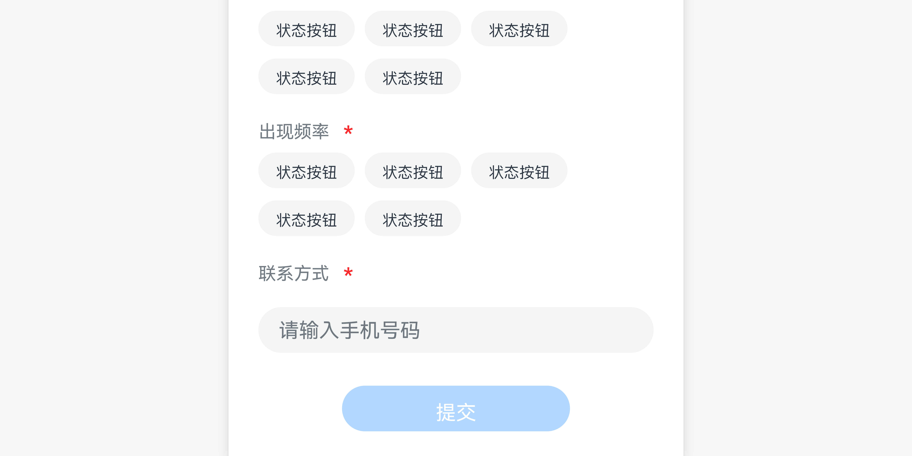
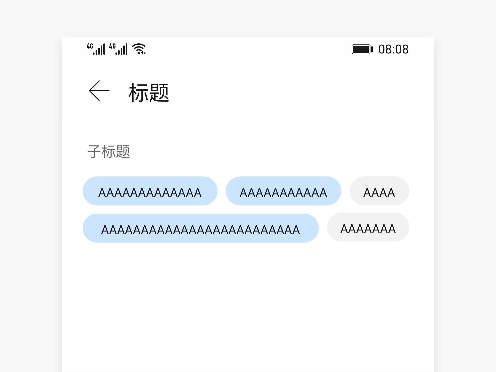

# 状态按钮

状态按钮是指从一组选项中进行选择，并可能在界面上实时显示选择后的结果。通常这一组选项都是由状态按钮构成。

## 如何使用

- 状态按钮用于当用户需要从一组选项中进行单选或多选，可以使用状态按钮将选择项作为筛选条件，在界面上实时显示筛选出来的结果或将选择项作为选择结果提交。

- 状态按钮有已选择和未选择两种状态。

- 状态按钮不单独使用，通常由多个状态按钮组成一组选择项。

- 可以用于单项选择。当多个状态按钮作为单选选择时，只能有一个状态按钮处于选择状态，并作为当前的选择。即选择一个后，另一个状态按钮就自动设置为未选择状态。

- 可以用于多项选择。当多个状态按钮组成多选选项，每个状态按钮都可以被选择。

## 界面写作原则

- 每个状态按钮使用名词词组，不加标点。
  

## 资源

状态按钮相关的开发者文档详见基础组件[“Toggle”](https://gitee.com/openharmony/docs/blob/master/zh-cn/application-dev/reference/arkui-ts/ts-basic-components-toggle.md)。
