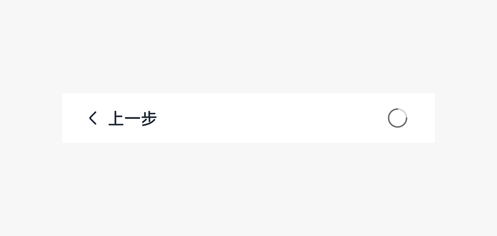

# 步骤导航器

步骤导航器是用户需要进行多个步骤完成任务时所使用的组件，步骤导航器可以展示当前的进展。

## 如何使用

- 步骤导航器用于当任务较复杂需要将任务分解成多个合理的步骤时。

- 为了保证步骤清晰，每个步骤都需要聚焦一个特定的小任务，通过页面标题来呈现小任务的名称。

- 为了给用户带来良好的体验，要确保每个小任务都清晰易懂，名称简洁，保持界面布局一致性。

- 为了不遮挡内容，应当将操作按钮固定在底部显示。

- 当需要显示输入键盘时，步骤导航按钮可以固定在输入键盘上方。

- 底部操作区可以采用“文本按钮 + 箭头”形式，文本按钮可点击。

- 如果当前步骤无法返回到上一界面，那么该文本按钮左侧不加箭头。

- 如果当前步骤前往的下一界面无法返回，那么该文本按钮右侧不加箭头，文字可以更换成下一个任务的开始介绍例如“跳过”，“开始”等。

- 在步骤导航流程中，如果某个操作耗时，请在操作的地方进行等待反馈，例如使用等待按钮，尽量不要弹出一个等待弹出框。

## 资源

步骤导航器相关的开发者文档详见基础组件[“Stepper”](https://gitee.com/openharmony/docs/blob/master/zh-cn/application-dev/reference/arkui-ts/ts-basic-components-stepper.md)。
