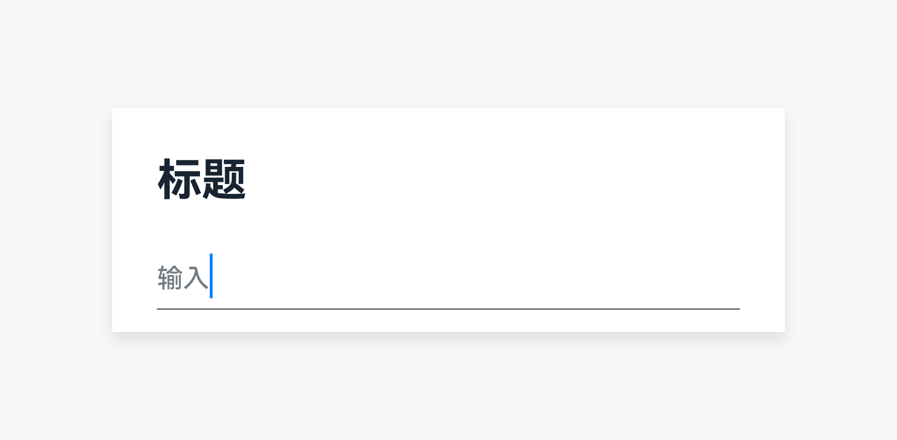

# 文本框

文本框是支持用户输入文本、数字或者混合数据，同时也支持用户选择文本的控件。

## 如何使用

- 文本框用于需要用户进行文本输入、文本选择的界面。

- 按钮可以显示在文本框右侧并直接作用于文本框内的文字。

- 右侧最多放置1个图标。

- 只可输入一行文本。

- 用户输入错误时，系统给出实时提示，帮助用户修正错误。

 

错误出现后，禁止提交输入的内容。若系统无法实时给出提示，则在内容提交后给出。输入存在错误时，可在输入框下方显示错误信息，说明如何修复。

## 资源

文本框相关的开发者文档详见基础组件[“TextInput”](https://gitee.com/openharmony/docs/blob/6e831661fb6f714a9492084baa552a4af4617c65/zh-cn/application-dev/reference/arkui-ts/ts-basic-components-textinput.md)和[“TextArea”](https://gitee.com/openharmony/docs/blob/6e831661fb6f714a9492084baa552a4af4617c65/zh-cn/application-dev/reference/arkui-ts/ts-basic-components-textarea.md)。
