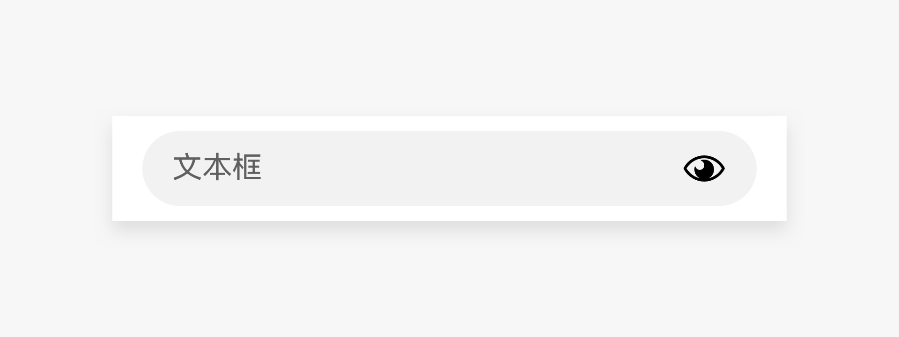
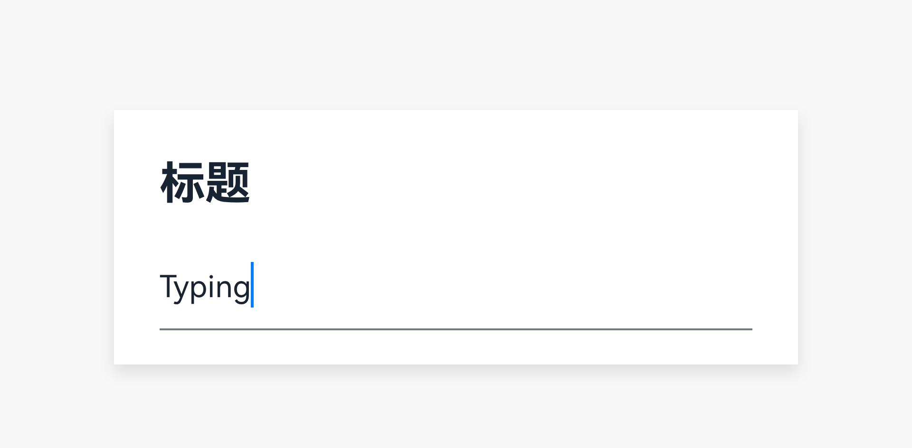
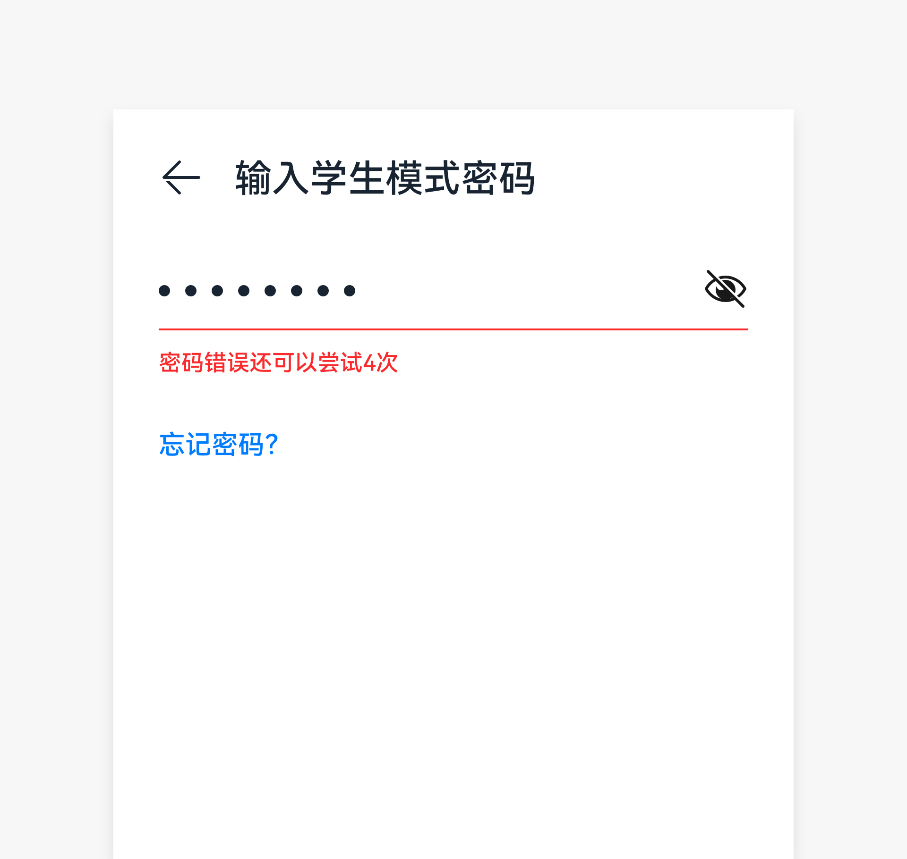
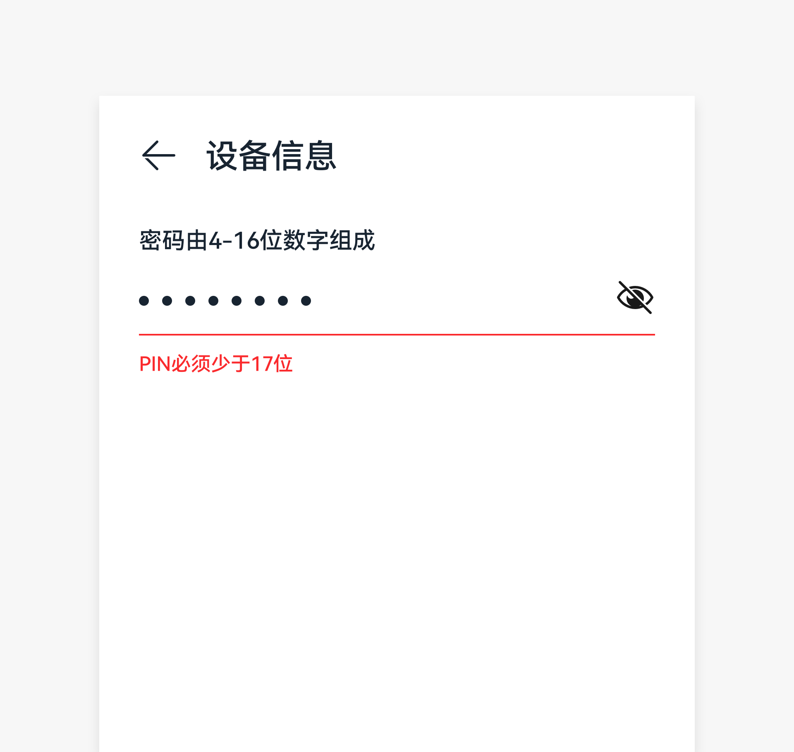

# 文本框

文本框是支持用户输入文本、数字或者混合数据，同时也支持用户选择文本的控件。

## 如何使用

- 输入小文本块使用单行文本框，支持显示带图标、带单位、带号标记必填项、带自动推荐、带帮助文本、带错误信息、字符计数器、格式化输入功能等样式。

- 当文本输入光标到达输入区域最右边，框中内容会自动向左推挤。

- 当文本长度超过文本框宽度时，可在输入框横滑文本，不出现光标。

- 进行有默认推荐文本的操作时（新建文件夹、另存、重命名等），初始状态文本全选，方便删除。若直接保存导致名称重复，使用错误提示。

- 用户输入错误时，系统给出实时提示，帮助用户修正错误。

|  |  |
|  --------  |  --------  |
|密码错误  |密码超长     |

错误出现后，禁止提交输入的内容。若系统无法实时给出提示，则在内容提交后给出。输入存在错误时，可在输入框下方显示错误信息，说明如何修复。

## 资源

文本框相关的开发者文档详见基础组件[“TextInput”](https://gitee.com/openharmony/docs/blob/6e831661fb6f714a9492084baa552a4af4617c65/zh-cn/application-dev/reference/arkui-ts/ts-basic-components-textinput.md)和[“TextArea”](https://gitee.com/openharmony/docs/blob/6e831661fb6f714a9492084baa552a4af4617c65/zh-cn/application-dev/reference/arkui-ts/ts-basic-components-textarea.md)。
