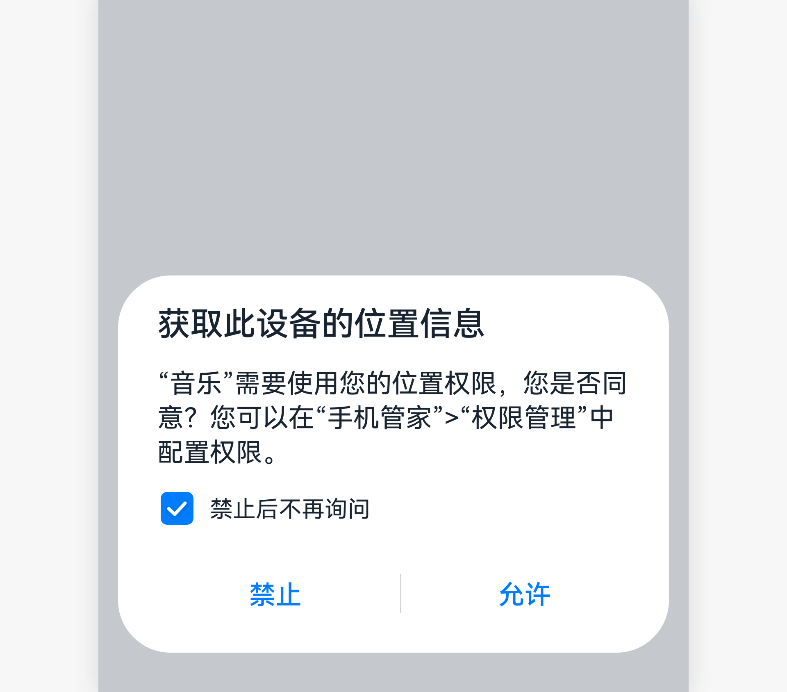

# 勾选

勾选表示用户决定是否同意某项描述的控件。

## 如何使用

- 勾选常用于USB连接界面的“不再提示”、获取位置信息界面的“禁止后不再询问”。

- 勾选项是否默认开启，需要考虑勾选项对用户所带来的影响，默认状态不应该对用户带来负面影响。

- 勾选项是界面中主要内容或操作的一个附加选项。

- 不要通过默认勾选这种方式，诱导用户或趁用户不注意开启或关闭某个功能，如果跟用户意愿违背，用户会有强烈的欺骗感。

## 资源

勾选相关的开发者文档详见基础组件[“Checkbox”](https://gitee.com/openharmony/docs/blob/master/zh-cn/application-dev/reference/arkui-ts/ts-basic-components-checkbox.md)。
