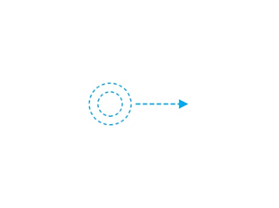
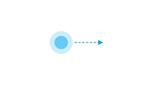

# 常见输入方式

## 输入类型

**基于触控的交互**

很多设备都拥有支持多点触控的屏幕，允许用户使用手指和/或手写笔进行交互。它们与屏幕的接触状态、数量以及运动行为被识别成触控手势和操作，可以支持多种交互功能和体验（例如点击、滑动、缩放、旋转）。在多数情况下，应将触控交互作为用户首要的交互方式。

以下是基础的手势操作：

  | **手势操作** | **功能描述** | **图示** | 
| -------- | -------- | -------- |
| 点击 | 用户通过点击某个元素触发功能或访问界面。 |  | 
| 长按 | 用户通过长按某个元素触发菜单或特定模式或进入界面。长按手势发现性差，常用功能不要使用长按来触发。 场景： -&nbsp;长按操作显示弹出菜单。例如，在联系人列表中长按某个联系人。 -&nbsp;长按操作显示快捷菜单。例如，长按某个桌面图标。 -&nbsp;长按操作进入多选。一般用于列表或宫格界面。例如，长按信息的列表界面，长按图库的宫格界面。 -&nbsp;长按操作进入编辑模式或可排序模式，并伴随振动。例如，长按闹钟的列表界面，长按桌面的空白处。 -&nbsp;长按操作选择文本。例如，在文本框中长按已经输入的文字。 -&nbsp;长按图标进入该图标对应的功能详情。例如，在通知面板上长按功能开关图标。 |  | 
| 滑动 | 用户通过滑动来滚动列表或平移界面内容。 场景： -&nbsp;通过滑动滚动列表。 -&nbsp;在内容区横向滑动切换页签。 -&nbsp;通过滑动平移地图。 |  | 
| 拖动 | 用户将元素从一个位置移动到另外一个位置。 |  | 
| 双击 | 用户快速点击两下以放大/缩小内容、选择文字或触发特定的功能。 |  | 
| 捏合 | 用户使用两个手指按住屏幕向外展开以放大内容。 使用两个手指按住屏幕向内收拢以缩小内容。 场景： -&nbsp;放大/缩小图片。例如，在查看图片界面。 -&nbsp;放大/缩小内容。例如，浏览页面或者相机取景界面。 |  | 

**基于光标的交互**

当用户使用指向设备（鼠标、触摸板、AR/VR手柄、隔空手势等）与应用程序进行间接交互时，光标指向的对象和光标本身应提供适当的视觉反馈以表达对象的可交互性和到达的准确性。同时，应考虑利用光标支持精细化操作和悬浮状态的特性（相比手指触摸），以提升应用生产力、简化交互任务和增强信息展示。

基于光标的交互设计亦可推广至AR/VR手柄和隔空手势等空间交互场景。

**基于焦点的交互**

当用户使用键盘、智慧屏遥控器、车机摇杆/旋钮等非指向性输入方式与应用程序进行间接交互时，基于焦点的导航和交互是重要的输入手段。

## 典型输入方式

**鼠标**

鼠标是一种典型的基于光标的、具备像素级精度的指向型输入方式，最为适用于对用户交互具有较高精度要求的生产力应用和高密度UI的场景。

一般地，鼠标由左键、右键和滚轮键组成，这些按键的交互应遵循业界标准的规范功能和用户的既有使用习惯。鼠标也可以通过和不同的键盘按键进行结合，提供额外的快捷操作体验。

**触控板**

触控板同时具备多指触控手势输入（触屏）和精细化指向型输入（鼠标）的特性，使得触控板既适合用于基于触摸交互优化的用户界面，也适合用于对指点精度有较高要求的生产力应用。

**键盘**

键盘是一种重要的生产力输入方式，优秀的键盘使用体验应允许用户快速准确地进行文本输入、双手无需离开键盘即可在系统和应用内进行导航、访问所有的功能、以及支持无障碍体验。

**手写笔**

在触屏上，手写笔是手指精细化操作的延伸，是一种像素级精度的指点设备。手写笔提供了一种直接的、自然的方式来进行数字内容书写、绘图和标注。

**隔空手势**

隔空手势（非接触手势）是一种人与设备交互的新方式，用户可以在无需手持或接触设备的情况下与设备进行便捷的交互。随着技术的发展，隔空手势在默认设备、平板、车机、智慧屏、音箱、AR/VR等设备上都有一定的应用。通常情况下，隔空手势通常是符合用户直觉、文化习惯或者容易操作的动作。
