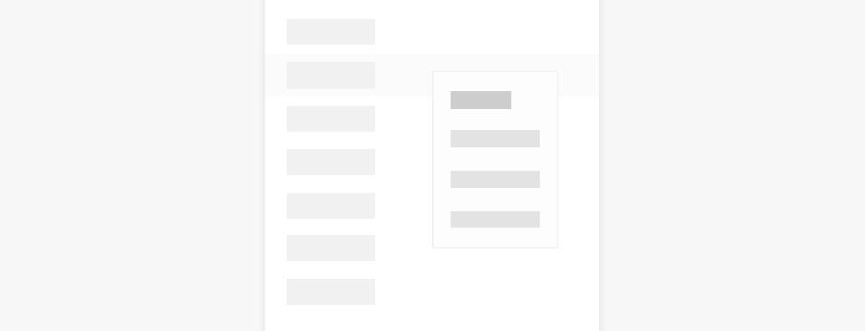
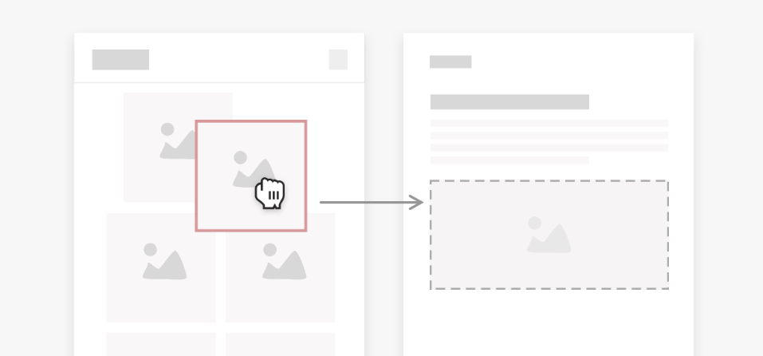

# 交互事件归一

本章节描述了在多种交互任务或场景下，应用在常用的输入设备（例如触控屏、鼠标、触控板、键盘）上分别对应的正确的交互规则。**设计师和开发者应保证在当前输入方式（设备）下应用能够以正确的、符合用户习惯的交互规则进行响应。**

## 悬浮

应用场景 
用户通过在某个元素上悬浮可以预览到更多信息或功能。

| **输入设备/方式** | **交互行为**  |
| -------- | -------- | 
| 触屏 | N/A | 
| 鼠标 | 光标移动到物体上。 |
| 触摸板 | 光标移动到物体上。 | 
| 键盘 | N/A | 

手写笔的悬浮交互需要手写笔硬件支持悬浮能力。
## 单击

应用场景 
用户通过点击某些元素激活控件、访问新页面、或改变自身状态。

| **输入设备/方式** | **交互行为**  |
| -------- | -------- | 
| 触屏 | 单指单击。 | 
| 鼠标 | 按压鼠标左键。 |
| 触摸板 | 单指轻点/单指按压。 | 
| 键盘 | 走焦状态下，移动焦点到对象上后按下空格键。 | 

一般地，触屏手指的按下/抬起行为对应光标的按下/抬起行为。 
在一些特殊场景，可能会存在使用鼠标/触摸双击打开对象的交互方案，例如电脑模式下打开桌面应用或文件。此类情况需由应用单独特殊处理，且同一功能不能同时支持单击和双击两种交互方式。
## 双击

应用场景 
用户通过双击进行某些快捷操作，如快速放大图片、点赞等。

| **输入设备/方式** | **交互行为**  |
| -------- | -------- | 
| 触屏 | 单指点击两下。 | 
| 鼠标 | 快速点击鼠标左键两下。 |
| 触摸板 | 单指轻点两下/单指按压两下。 | 
| 键盘 | 走焦状态下，移动焦点到对象上后按压两次空格键。 | 

## 长按
应用场景 
用户通过长按进行某些快捷操作，如长按视频倍速播放等。

| **输入设备/方式** | **交互行为**  |
| -------- | -------- | 
| 触屏 | 单指长按。 | 
| 鼠标 | 长按左键。 |
| 触摸板 | 单指长按。 | 
| 键盘 | 走焦状态下，移动到对象上长按空格。 | 

## 上下文菜单
应用场景 
某个元素上显示弹出菜单或快捷方式菜单。

| **输入设备/方式** | **交互行为** |
| -------- | -------- |
| 触屏 | 单指长按  |
| 鼠标 | 右键单击 |
| 触摸板 | 双指轻点/按压（与PC一致）,  单击/单指长按（保留触屏习惯）。 |
| 键盘 | shift+F10 或 LOGO+M。 |

这里的菜单指的是广义的菜单，即用于展示用户可执行的操作的临时性弹出窗口。 
凡是在触屏上通过长按显示的菜单，都需要支持鼠标右键单击和触摸板双指单击的触发方式。

## 拖拽

应用场景 
移动某个元素位置或者移动某个元素用于发送等。

  | **输入设备/方式** | **交互行为** | 
| -------- | -------- |
| 触屏 | 长按并移动。 | 
| 鼠标| 按压左键并移动鼠标（无需长按等待）。 | 
| 触摸板 | 按压左键并移动。 | 
| 键盘 | N/A | 

## 滚动/平移
应用场景 
滚动列表或页面。

| **输入设备/方式** | **交互行为**  |
| -------- | -------- | 
| 触屏 | 单指接触屏幕后滑动。 | 
| 鼠标 | 上下滚动滚轮/shift+上下滚动滚轮可以实现上下/左右滚动，指针不动。 有上下滚动时，通过shift+滚轮左右滚动。无上下滚动时，滚轮可响应左右滚动。 自然滚动时， 滚轮向上滚动，页面向上滚动。 滚轮向下滚动，页面向下滚动。 滚轮每滚动1个刻痕，页面相应滚动一段距离，默认为64vp，应用也可自行设定。|
| 触摸板 | 自然滚动时，触摸板上双指滑动行为与触屏上单指滑动行为一致。 双指向上滑动，页面向下滚动。 双指向下滑动，页面向上滚动。 双指滑动时，页面进行精细、连续的滚动；当双指离开触摸板时，页面根据离手速度继续进行减速滑动直到停止。 若列表是横向列表，则双指向左滑动，页面向右滚动；双指向右滑动，页面向左滚动。 | 
| 键盘 | N/A | 

在鼠标、触控板滚动过程中，仅页面元素发生变化，光标不发生移动。

## 轻扫
应用场景 
将一个页面切换至下一个页面或快速滚动页面。

| **输入设备/方式** | **交互行为**  |
| -------- | -------- | 
| 触屏 | 	单指快速滑动。 | 
| 鼠标 | 滚动一格或快速滚动后停止。 |
| 触摸板 | 双指快速移动。 | 
| 键盘 | N/A| 

在鼠标、触控板轻扫过程中，仅页面元素发生变化，光标不发生移动。

## 缩放对象
应用场景 
查看图片或浏览页面时调整对象大小。

| **输入设备/方式** | **交互行为**  |
| -------- | -------- | 
| 触屏   | 	双指张开为放大，双指捏合为缩小。 | 
| 鼠标 | 按下 Ctrl 键同时滚动鼠标滚轮，可按照光标位置放大或缩小内容。  - 鼠标滚轮上滚，每滚动1个刻痕，以光标位置作为中心对象放大N%。  - 鼠标滚轮下滚，每滚动1个刻痕，对象缩小N%。 |
| 触摸板 | 触摸板上双指捏合行为与触屏上双指捏合行为一致，当光标移动到对象上后：  - 触摸板双指向外扩展以放大内容。  - 触摸板双指向内收拢以缩小内容。  优化显控比，以使用户能够轻松、快速、准确地调节到目标尺寸。 | 
| 键盘 |Ctrl+加号键：以对象的中心点使对象放大N%。 Ctrl+减号键：以对象的中心点使对象缩N%。| 

## 旋转对象
应用场景 
编辑图片时旋转图片。

| **输入设备/方式** | **交互行为**  |
| -------- | -------- | 
| 触屏   | 	两个手指在屏幕旋转，对象跟随旋转。 | 
| 鼠标 | N/A |
| 触摸板 | 触摸板上双指旋转行为与触屏上双指旋转行为一致，当光标移动到对象上后：  - 触摸板双顺时针旋转，对象跟手顺时针旋转。  - 触摸板双逆时针旋转，对象跟手逆时针旋转。 | 
| 键盘 |	N/A| 

有些场景中触屏上双指可以同时进行缩放和旋转操作（如图片/地图浏览），触摸板应同步支持。

## 交互事件归一接口
为了保障用户在不同交互设备上的交互体验一致，同时又尽量减少不同输出设备适配工作，建议使用交互事件归一接口。该接口涵盖用户基础的交互任务，并遵循了用户在触控、鼠标、触控板等设备的交互习惯。
