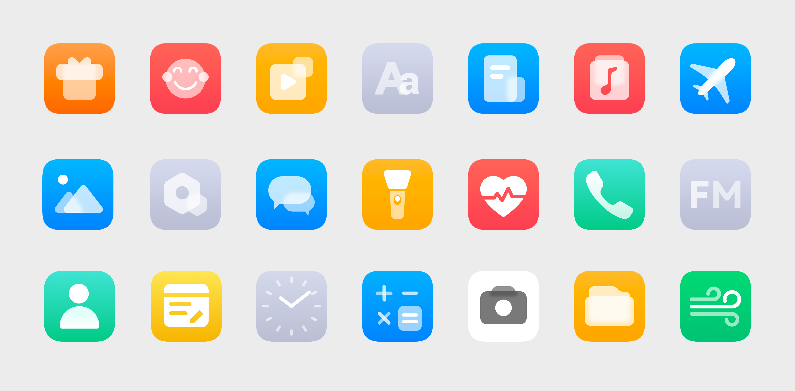
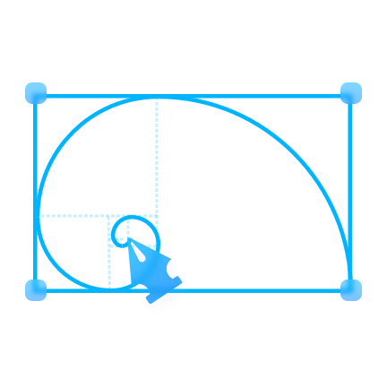
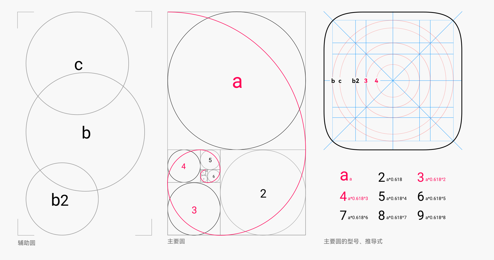
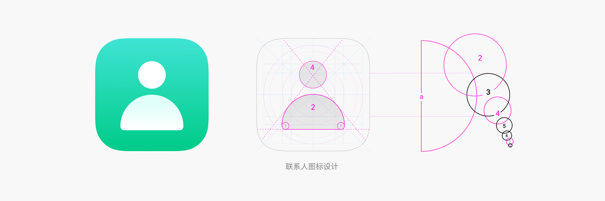
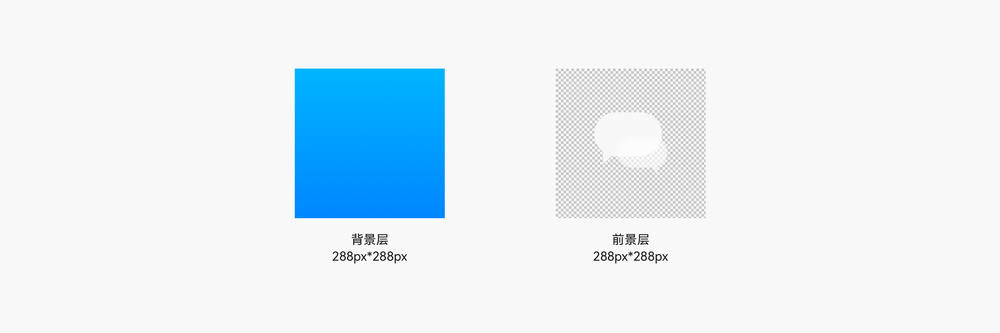
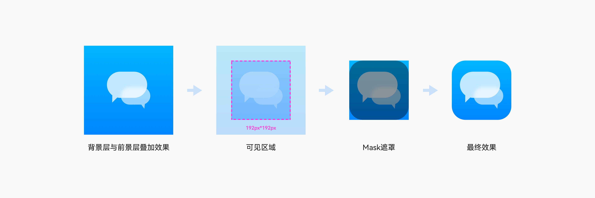
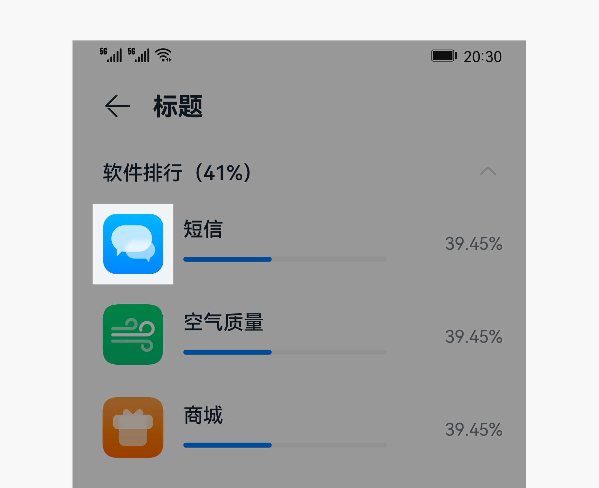
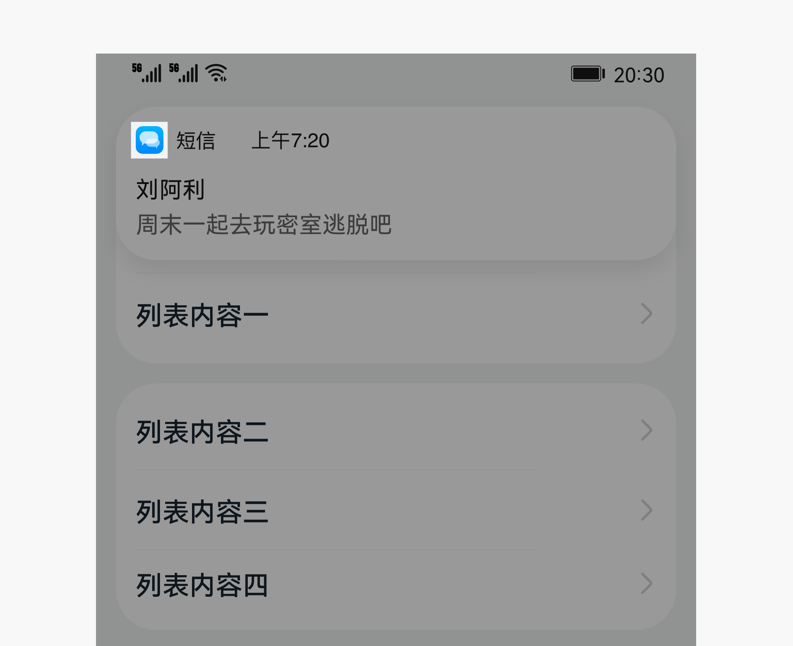

# 应用图标

OpenHarmony应用图标设计旨在通过现代化的语义表达，准确传达功能、服务和品牌。

OpenHarmony图标示例  

## 设计原则

OpenHarmony应用图标设计应遵循以下原则：

  | | |  |
| -------- | -------- | -------- |
| **简洁优雅** 元素图标简洁，线条表现优雅，传递设计美学。 | **极速达意**  图标图形准确传达其功能、服务和品牌。具有易读性和识别性。| **情感表达** 通过图形和色彩概括表达情感，传达品牌视觉形象。  | 

## 图形设计

遵循基本原则和设计方法。

### 基本原则

图标的主体应该是一个完整的元素，其图形能够隐喻并涵盖该应用的功能或业务。整体图形线条过渡平滑，比例自然和谐，色彩运用恰当。

### 设计方法

OpenHarmony官方主题图标在设计方法上主要引入了黄金分割比例，以确保图标图形的一致性与和谐性。

#### 黄金分割比例的推导

#### 黄金分割比例的运用

下图是黄金分割比在应用图标图形设计中的运用：

## 图标交付

OpenHarmony应用图标都采用Adaptive Icon进行实现交付，所以需要提供的图标交付件具体内容如下：

  | 属性 | 要求 | 
| -------- | -------- |
| 格式 | png | 
| 尺寸 | 288px\*288px | 
| 内容 | 一张前景层+一张背景层 | 

请提供正方形图片资源，需要提供的具体内容，如下图所示：

### Adaptive Icon实现过程

提供正确的图片资源后，系统会应用自适应遮罩对图标进行统一处理，确保所有图标在桌面显示的一致性。如下图所示：

- 可见区域：前景层和背景层叠加后，取中间2/3区域显示，尺寸为   192px\*192px

- Mask遮罩：取Mask区域进行遮罩

为了确保图标在任何使用场景下能够保持最佳显示结果，请参考以下尺寸测试图标显示效果。

  |  | |
| -------- | -------- |
| 设置界面图标 | 通知界面图标 | 

  | 应用界面 | 图标尺寸 | 
| -------- | -------- |
| 设置界面 | 40vp\*40vp（120px\*120px） | 
| 通知界面 | 16vp\*16vp（48px\*48px） | 

关于OpenHarmony默认提供的应用图标设计模板，详见[资源](design-resources.md)
