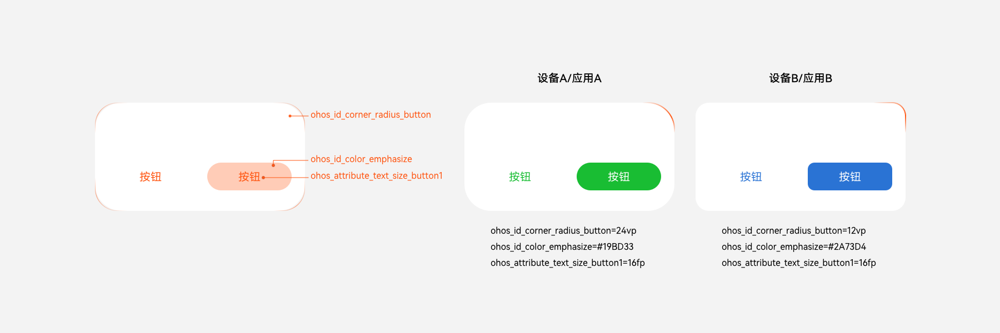

# 视觉基础

**虚拟像素单位：vp**

虚拟像素(virtual pixel)是一台设备针对应用而言所具有的虚拟尺寸（区别于屏幕硬件本身的像素单位）。它提供了一种灵活的方式来适应不同屏幕密度的显示效果。

相同的vp，在不同像素密度的屏幕上，对应不同px，一般称px/vp为像素密度比。像素密度比为当前设备屏幕的dpi/160。

在dpi为160的OpenHarmony设备上，像素密度比为1，则1vp等于1px。

以vp为尺寸标注单位，可使相同元素在不同密度的设备上具有一致的视觉体量，使用px则容易导致体量不一致的问题。

**8vp网格系统**

基于 8vp 为网格的基本单位可以对界面上元素的大小、位置、对齐方式进行更好的规划，构建更有层次感、秩序感，以及多设备上一致的布局效果。一些更小的控件（例如图标）大小也可以对齐 4vp 的网格大小。

**字体像素单位：fp**

字体像素(font pixel) 大小默认情况下与 vp 相同，即默认情况下 1 fp = 1vp。如果用户在设置中选择了更大的字体，字体的实际显示大小就会在 vp 的基础上乘以 scale 系数，即 1 fp = 1 vp \* scale。

**视觉属性：分层参数**

分层参数是根据使用场景定义的视觉属性ID，通过在不同色彩主题、多种设备上配置不同的数值，实现多设备适配的效果。OpenHarmony的分层参数包含色彩、字体、圆角、间距、阴影、模糊、缩放，并提供了默认实现。设备、应用、服务均可在此基础上管理并自定义不同场景的视觉属性。

例如，对于不同场景的主色调定义了对应的ID与默认实现

| **主色调**  |**色值**|**ID**|
|  --------  |  --------  |  --------  |
| 高亮色 | \#007DFF | ohos_id_color_emphasize | 
| 高亮色反色 | \#006CDE | ohos_id_color_emphasize_contrary | 
| 警告色 | \#FA2A2D | ohos_id_color_warning | 
| 警示色 | \#FF7500 | ohos_id_color_alert | 
| 通讯色 | \#E84826 | ohos_id_color_handup | 
| 通讯色 | \#00CB87 | ohos_id_color_connected | 

关于OpenHarmony默认提供的所有分层参数，详见：[资源](design-resources.md)
