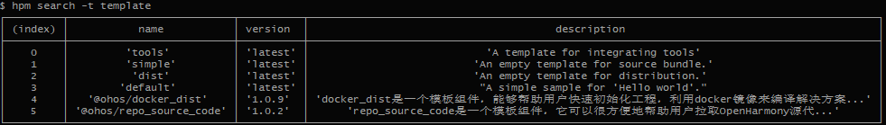

# 开发Bundle<a name="ZH-CN_TOPIC_0000001051690861"></a>

-   [创建Bundle](#section717481119145)
-   [将现有工程定义为Bundle](#section102861955201410)
-   [发布Bundle到HPM平台](#section1318574233211)
-   [引用Bundle](#section57959284315)
-   [全局安装Bundle](#section647375516313)
-   [编译Bundle](#section7972161715325)
-   [定义编译脚本](#section10274147111610)
-   [执行编译](#section879301916172)
-   [定义发行版](#section127388393326)
-   [定义脚本](#section11503171219190)
-   [编译发行版](#section4694125521912)
-   [烧录](#section2061514431039)

创建OpenHarmonyBundle有如下几种方式：

-   从头创建一个全新的Bundle。
-   将一个现有的源码项目定义为Bundle。

## 创建Bundle<a name="section717481119145"></a>

通常情况下，[HPM网站](https://hpm.harmonyOS.com)上能找到您开发常用的Bundle，如果现有的Bundle不能完全满足开发，这时可以自己动手开发一个Bundle。

如果您愿意，可以将Bundle发布到HPM的仓库中供其他用户使用。

假设要在D:/source目录下新建一个全新的Bundle：my-bundle，可以使用hpm init 创建该Bundle的脚手架代码，例如，进入D:/source目录，执行如下命令：

```
hpm init -t default  -d demo mybundle
```

将使用'default' 模板 在当前目录下的demo路径下，创建一个名为mybundle的Bundle：

```
demo
├── headers            # 头文件（样例）
│   └── main.h
└── src                # 源代码（样例）
│    └─ main.c
├── bundle.json        # 元数据声明文件
└── LICENSE            # 许可协议文本
└── Makefile           # 编译描述文件（样例）
└── README.md          # Bundle的自述文件

```

接下来根据您的业务需要，实现Bundle内部的功能代码，以及编译脚本，完成代码开发后，通过git将代码（包括bundle.json文件）提交到组件代码托管仓库中（如gitee）。

> **说明：** 
>```
>hpm init -t {templatename} -d {dir} {name}
>```
>-   -t \{templatename\} ：指的是模板名称。
>-   -d \{dir\}：是要创建的Bundle所存放的路径。
>-   name：为要创建的Bundle名称。

hpm 除了提供了少量默认模板之外，其他模板均存储在服务器端，可以使用命令hpm search -t template 从服务器端搜索模板。



## 将现有工程定义为Bundle<a name="section102861955201410"></a>

如果您已经有了代码工程，需要分发的HPM平台，只需要在当前工程目录下（例如mybundle2），执行如下命令，会引导您输入组件名称和版本等信息。

```
hpm init
```

1.  输入名称后回车（如mybundle2）。
2.  接下来依次输入版本、描述等信息后，会在当前目录下会生成一个bundle.json文件。
3.  也可以打开bundle.json文件。

    ```
    $ hpm init
    Your bundle will be created in directory ~\demo\mybundle2
    ? bundle name mybundel2
    ? version 1.0.0
    ...
    Initialization finished.
    ```


1.  打开bundle.json文件修改其他信息（如作者，代码仓库，代码目录，命令脚本，依赖组件等）,如下（仅示意）：

    ```
    {
    "name": "mybundle2",
    "version": "1.0.0",
    "publishAs": "code-segment",
    "dirs":{
        ".":["README.md"],
        "src":["test.c"],
        "header":["header/test.h" ],    
        "src/common":["src/common/foobar.txt"]
      },
    "scripts": {
        "build": "make -${args}"
      },
    "dependencies": {
        "@ohos/cjson": "^1.0.0",
        "@ohos/foobar": "^1.2.0"
      }
    }
    ```


## 发布Bundle到HPM平台<a name="section1318574233211"></a>

要在发布Bundle到HPM，你需要先具备账号，并创建组织，创建组织的条件及详细步骤请参考hpm网站上的帮助说明。

完成账号申请和组织创建（或者加入一个现有的组织）后，您需要根据个人的邀请码（在HPM网站的个人中心页查看），在本机生成公钥，并在HPM网站的个人中心配置。

```
hpm config set loginUser {your-invitation-code}
hpm gen-keys
```

生成的文件将会存放在 \~\\Users\\yourname\\.hpm\\key 下，将公钥文件\(publicKey\_your-accout.pem\)中内容拷贝到 HPM 个人中心的 SSH 公钥中。

完成上述操作后，你就具备了在您的组织内发布Bundle的权限了。

在bundle所在目录，执行命令hpm publish，将会完成组件的打包发布操作。

```
hpm publish
```

> **说明：** 
>-   为避免Bundle名称冲突，发布的Bundle的名称需限定在组织范围内，即命名为@org\_name/bundle\_name的格式。
>-   你的账号也必须是org\_name内的成员，才可以发布或更新组织内的Bundle。
>-   发布的组件，需要通过安全及内容审核，才能正式生效。

## 引用Bundle<a name="section57959284315"></a>

通常开发一个项目，需要引用其他的组件以加快特定功能的开发，可以采用安装依赖的方式。

首先去HPM网站，根据关键字去搜索满足您的需求的组件，找到合适的组件后，将其引入到您的工程。

在您的bundle工程中（工程目录中必须包含bundle.json文件）执行如下命令：

```
$ hpm install @scope/the_bundle
```

引用的bundle将会被安装到你的工程所在的目录的  ohos\_bundle下

```
project
├── ohos_bundle            
│   └── scope
│    └─ the_bundle     # <---引用的组件将会出现在这
└── src                
│    └─ main.c
├── bundle.json        # 元数据声明文件
└── LICENSE            
└── Makefile           
└── README.md          
```

打开bundle.json文件，可以看到bundle已经被引入到您的工程的依赖中。

```
{
"dependencies": {
    "@scope/the_bundle": "^1.0.0"
  }
}
```

您也可以一次性在此文件中编辑多个Bundle的依赖

```
{
"dependencies": {
    "@scope/the_bundle1": "^1.0.0",
    "@scope/the_bundle2": "^2.0.0",
    "@scope/the_bundle3": "^3.0.0",
    "@scope/the_bundle4": "^1.1.0"
  }
}
```

再执行hpm install命令，将会一次性将所有未安装的Bundle一次性全部下载并安装完成。

## 全局安装Bundle<a name="section647375516313"></a>

如果引用的Bundle是多个项目共用的组件（如编译工具链），你可以全局安装

在您的bundle工程中（工程目录中必须包含bundle.json文件）执行如下命令：

```
$ hpm install -g @scope/the_tool
```

引用的bundle将会被安装到你在hpm config中设置的globalRepo所指定的目录下：

```
~\.hpm\global            
│   └── scope
│    └─ the_tool     # <---引用的组件将会出现在这
```

> **说明：** 
>-   在项目安装的Bundle，在执行hpm编译命令时可以通过引用环境变量 DEP\_SCOPE\_bundle\_name，例如：
>通过 hpm i @opensource/gn 安装后，可以编辑bundle.json中的编译脚本，如下：
>```
>"scripts": {
>    "build": "${DEP_OPENSOURCE_gn}/gn  --version"
>  },
>```
>然后就可以通过执行hpm build将调用gn的功能。
>-   在全局安装的Bundle，可以通过设置系统环境变量，直接调用，或者hpm config set key value的方式，通过 $\{key\}/tool\_name 的方式 引用，例如：
>```
>hpm i -g @ohos/opensource/gn
>hpm config BUILD_SYS_GN ~/.hpm/global/ohos_bundles/opensource/gn
>```
>可以编辑bundle.json中的编译脚本，如下：
>```
>"scripts": {
>    "build": "${BUILD_SYS_GN}/gn  --version"
>  },
>```
>然后就可以通过执行hpm build将调用gn的功能。

## 编译Bundle<a name="section7972161715325"></a>

完成代码开发后，如果Bundle的代码是可以独立编译的，可以配置编译工具和脚本以完成二进制的生成。

hpm具备命令集成的能力，您可以选择任意的适合项目所采用的语言编译工具（如make，gcc，gn等等）。只需在当前项目的bundle.json文件中定义scripts脚本中的build命令，就可以通过执行hpm build执行编译。

## 定义编译脚本<a name="section10274147111610"></a>

以编译一个app目录下helloworld可执行文件为例：

```
app
├── BUILD.gn
├── include
│   └── helloworld.h
└── src
    └── helloworld.c
```

在helloworld.c同级目录下新建一个BUILD.gn

```
touch BUILD.gn
vim BUILD.gn
```

以下是BUILD.gn的样例，仅供参考

```
executable("hello_world") {
    sources = [
        "src/helloworld.c"
    ]

    include_dirs = [
        "include"
    ]
}
```

> **说明：** 
>-   “executable”是gn内置模板，可以用“gn help executable ”查看使用方法。
>-   “sources ”是源码路径，“include\_dirs ”是头文件路径。

## 执行编译<a name="section879301916172"></a>

在当前文件夹下，执行编译命令：

```
hpm build
```

在完成一系列的编译动作后，显示build succeed。检查编译的输出结果：


## 定义发行版<a name="section127388393326"></a>

发行版的元数据文件中定义了其依赖的Bundles，以及如何编译、链接这些bundles，生成镜像文件。

示例如下（以下示例的编译命令dist，采用hb编译框架描述）

## 定义脚本<a name="section11503171219190"></a>

bundle.json中定义如下（示例）

```
{
"name": "@your/dist_name",
"version": "2.2.0",
"publishAs": "distribution",
"description": "describe it",
"scripts": {
"config_hb": "hb set -root $DEP_BUNDLE_BASE",
"dist": "PATH=/root/.local/bin:${DEP_OHOS_gn}:${DEP_OHOS_ninja}/ninja:${DEP_OHOS_llvm}/llvm/bin:${DEP_OHOS_hc_gen}/hc-gen:${PATH} && ./scripts/dist.sh"
},
"envs": {
"debug": false
},
"dirs": {
"scripts": "scripts/*"
},
"dependencies": {
"@ohos/build_lite": "2.2.0",
"@ohos/gn": "1.1.1",
"@ohos/llvm": "1.1.1",
"@ohos/hc_gen": "1.1.0",
"@ohos/ninja": "1.1.0",
......
},
"ohos": {
"os": "2.2-Beta",
"board": "hi3516",
"kernel": "liteos-a"
},
"keywords": [ "hispark", "hi3516"   ],
"repository": "https://gitee.com/openharmony/your-project",
"license": "Apache V2"
}
```

## 编译发行版<a name="section4694125521912"></a>

在当前发行版根目录下，执行如下命令。

```
hpm dist
```

hpm-cli工具会自动执行编译，生成镜像文件，如：

```
out
|-xxdist.img
|-xx.file
```

## 烧录<a name="section2061514431039"></a>

发行版的编译结果可以烧录到设备中运行，例如使用hiburn工具进行烧录。在发行版的bundle.json文件配置烧录参数。

```
"scripts": {
   "flash": "{$DEP_HIBURN}/hiburn"
},
```

设置烧录命令行工具的所在路径，配置烧录相关的参数（参考烧录工具的说明进行配置）。

```
hpm config set DEP_HIBURN {hiburn_path}
hpm run flash
```

> **说明：** 
>上述仅描述如何定义bundle.json的样例，烧录工具取决于实际开发板所需的工具。

