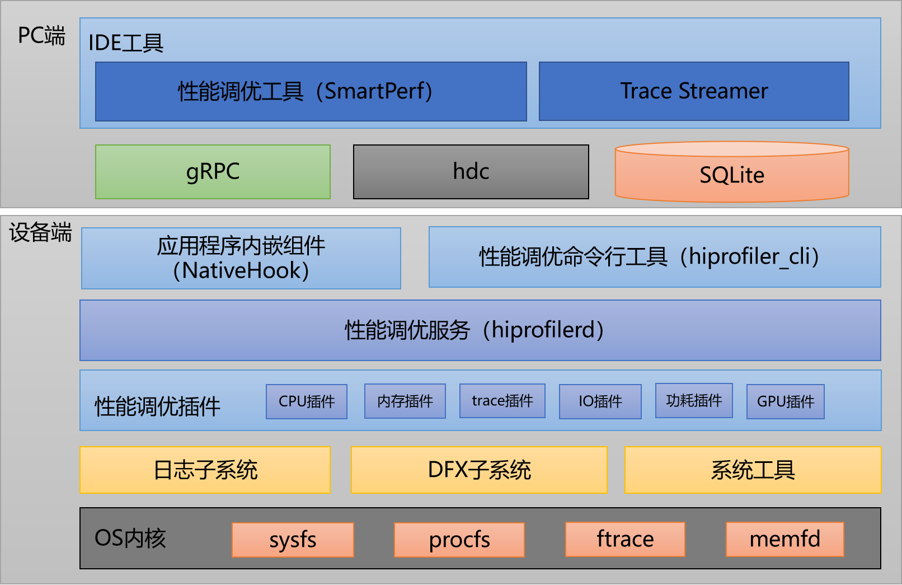

# Smartperf-Host
## 简介
Smartperf-Host是一款深入挖掘数据、细粒度地展示数据的性能功耗调优工具，旨在为开发者提供一套性能调优平台，支持对CPU调度、频点、进程线程时间片、堆内存、帧率等数据进行采集和展示，展示方式为泳道图，支持GUI（图形用户界面）操作进行详细数据分析。
## 架构图


该组件整体分为设备端和PC端两部分，设备端和PC端基于gRPC（Remote Procedure Call）通信框架进行数据交互。

设备端内部分为应用程序内嵌组件、命令行工具、性能调优服务、性能调优插件集合、部分系统工具及部分系统内核等模块。设备端提供了插件扩展能力，对外提供了插件接口，基于该扩展能力可以按需定义自己的能力，并集成到框架中来，目前基于插件能力已经完成了native内存插件、trace插件等，详细介绍见[性能调优组件](https://gitee.com/openharmony/developtools_profiler)。

PC端以Smartperf-Host网站的形式进行发布，内部分为Trace Streamer数据解析、SQLite数据存储、hdc设备管理、数据导入、UI绘制、数据分析等模块。下文会重点对Smartperf-Host提供的各项能力进行介绍。
## 项目目录
```
/smartperf_host
├── host                          # Smartperf-Host 相关代码
│   ├── doc                       # Smartperf-Host 相关使用文档
│   ├── ide                       # Smartperf-Host IDE 模块目录
│   │    └── src                  # 主机测调优模块代码
│   │    │   ├── base-ui          # 基础组件目录
│   │    │   └── Trace            # 业务逻辑目录
│   ├── trace_streamer            # 解析模块代码目录
│   │    ├── base                 # 基础功能
│   │    ├── cfg                  # 配置目录
│   │    ├── filter               # Filter 功能
│   │    ├── include              # Include 头文件
│   │    ├── multi_platform       # 平台适配
│   │    ├── parser               # 解析业务逻辑
│   │    │   ├── bytrace_parser   # byTrace 解析业务逻辑
│   │    │   └── htrace_parser    # hTrace 解析业务逻辑
│   │    ├── table                # 表结构
│   │    ├── trace_data           # trace 结构
│   │    ├── trace_streamer       # traceStreamer 结构
│   │    │   └── kits             # js/napi 接口存放目录
```
## 功能介绍
- 网页加载trace

  使用Smartperf-Host加载保存在本地的trace文件（htrace、ftrace等）并显示数据到泳道图中，trace数据分析详见《[网页加载trace说明](https://gitee.com/openharmony-sig/developtools_smartperf_host/blob/master/ide/src/doc/md/quickstart_systemtrace.md)》。
- 网页抓取trace

  使用Smartperf-Host在线抓取trace，可以自定义抓取内容、抓取时长、trace保存路径，详见《[网页抓取trace说明](https://gitee.com/openharmony-sig/developtools_smartperf_host/blob/master/ide/src/doc/md/quickstart_web_record.md)》。
- 设备抓取trace

  在设备端抓取trace，可以自定义抓取内容、抓取时长、trace保存路径，详见《[设备端抓取trace说明](https://gitee.com/openharmony-sig/developtools_smartperf_host/blob/master/ide/src/doc/md/quickstart_device_record.md)》。
- Ability Monitor抓取

  使用Smartperf-Host抓取应用的CPU、内存、磁盘IO和网络的使用情况，详见《[Ability Monitor抓取和展示说明](https://gitee.com/openharmony-sig/developtools_smartperf_host/blob/master/ide/src/doc/md/quickstart_ability_monitor.md)》。
- Native Memory抓取

  使用Smartperf-Host抓取应用的Native Memory（C和C++部分）的分配和释放情况，详见《[Native Memory抓取和展示说明](https://gitee.com/openharmony-sig/developtools_smartperf_host/blob/master/ide/src/doc/md/quickstart_native_memory.md)》。
- Hiperf抓取
  
  使用Smartperf-Host抓取应用的cpu使用量、方法的调用栈等，详见《[HiPerf的抓取和展示说明](https://gitee.com/openharmony-sig/developtools_smartperf_host/blob/master/ide/src/doc/md/quickstart_hiperf.md)》。
- HiSystemEvent抓取

  使用Smartperf-Host抓取应用的各个子类别功耗占比（CPU、网络、定位等）、应用的资源申请使用记录（WorkScheduler、Runninglock、Alarm、Location Request）、应用功耗异常事件显示、功耗关联系统状态显示（电池电量、屏幕状态），详见《[HiSystemEvent的抓取和展示说明](https://gitee.com/openharmony-sig/developtools_smartperf_host/blob/master/ide/src/doc/md/quickstart_hisystemevent.md)》。
- FileSystem抓取

  使用Smartperf-Host抓取所有文件系统系统调用信息、读写调用次数等，详见《[FileSystem的抓取和展示说明](https://gitee.com/openharmony-sig/developtools_smartperf_host/blob/master/ide/src/doc/md/quickstart_filesystem.md)》。
- 页内存抓取

  使用Smartperf-Host抓取页内存相关事件的开始时间、持续时间、触发进程、触发线程、事件类型、内存地址、内存大小等，详见《[页内存的抓取和展示说明](https://gitee.com/openharmony-sig/developtools_smartperf_host/blob/master/ide/src/doc/md/quickstart_page_fault.md)》。
- Bio抓取

  使用Smartperf-Host抓取每次IO访问的起始时间、总延迟、进程、每4k数据的平均延迟、线程、操作（写数据、页面换入、Metadata）、访问量、路径等、Block number、优先级、Backtrace调用栈，详见《[Bio的抓取和展示说明](https://gitee.com/openharmony-sig/developtools_smartperf_host/blob/master/ide/src/doc/md/quickstart_bio.md)》。
- 进程Smaps抓取

  使用Smartperf-Host抓取单个进程的smaps数据（类别、Pss、Rss、Vss等），数据源为/proc/$pid/smaps，详见《[进程smaps的抓取和展示说明](https://gitee.com/openharmony-sig/developtools_smartperf_host/blob/master/ide/src/doc/md/quickstart_smaps.md)》。
- Sql分析和Metrics说明

  Smartperf-Host网站trace解析完成后在线数据库使用说明，详见《[Sql分析和Metrics说明](https://gitee.com/openharmony-sig/developtools_smartperf_host/blob/master/ide/src/doc/md/quickstart_sql_metrics.md)》。
## 编译指南
项目编译主要包括两部分，Trace Streamer编译和Smartperf-Host编译部署。
### 构建约束
- C++ 11版本或以上
- node 16.15.1版本或以上
- npm  8.13.2版本或以上
- TypeScript  4.2.3版本或以上
- golang 版本  1.13.8版本或以上
### Trace Streamer编译 
搭建Smartperf-Host网站需要编译出trace_streamer的wasm版本供网页端进行原始trace数据解析工作，具体的编译过程参考《[如何独立编译Trace Streamer](https://gitee.com/openharmony-sig/developtools_smartperf_host/blob/master/trace_streamer/doc/compile_trace_streamer.md)》。
### Smartperf-Host编译部署
具体的编译部署过程参考《[SmartPerf 编译部署指导](https://gitee.com/openharmony-sig/developtools_smartperf_host/blob/master/ide/README_zh.md)》，部署成功后通过浏览器访问页面 https://[部署机器ip地址]:9000/application/ 即可使用Smartperf-Host的全部功能。
