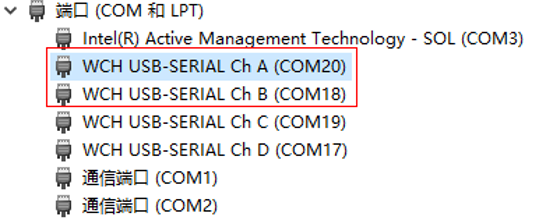
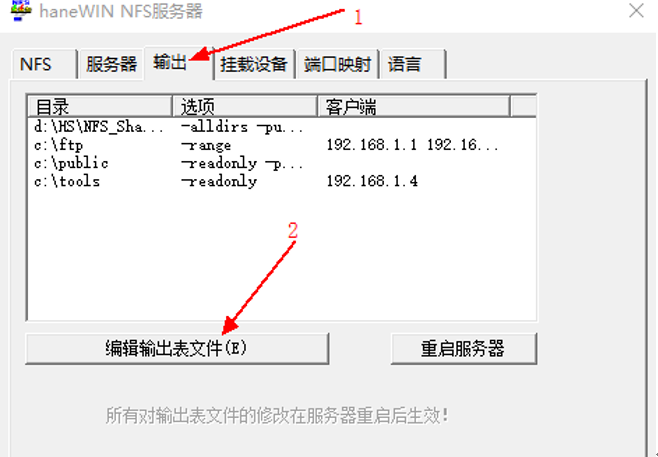
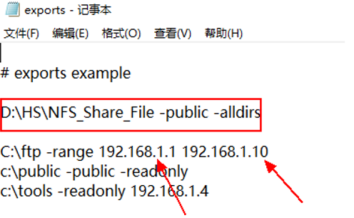
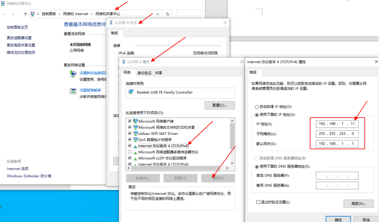
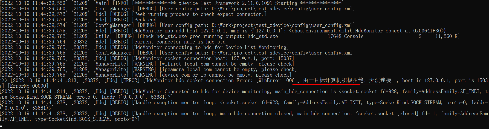

# xDevice测试调度执行框架使用指南


## 概述

OpenHarmony开源操作系统有众多芯片场景基于其之上进行开发版本等相关产品的开发，为了保障OpenHarmony生态的兼容性，OpenHarmony提供了[兼容性测试测评服务](https://www.openharmony.cn/certification/document/guid)，其中针对产品需要进行接口相关的测试执行验证，但是大量自动化用例的执行需要一套调度执行框架，并且支持生成可视化的测试报告等能力，故我们设计并开发了xdevice测试调度框架来支持该场景。

### 简介

xDevice测试调度框架是OpenHarmony中测试基础设施的核心组件，提供调度自动化用例执行所依赖的相关服务，支持大量自动化用例的调度执行能力，并可自带生成可视化测试报告。而xDevice二进制包会跟踪随OpenHarmony的XTS套件编译，开发者可以从XTS套件归档路径中获取xDevice工具。

根据设备类型的不同，xDevice主要测试的任务场景有以下三个：

- 对轻量系统设备进行XTS测试。（如：Hi3861开发板)
- 对小型系统设备进行XTS测试。（如：Hi3516开发板)
- 对标准系统设备进行XTS测试。（如：RK3568开发板)

### 实现原理

xDevice包括以下功能模块：

- command：用户与测试平台命令行交互模块，提供用户输入命令解析，命令处理。
- config：测试框架配置模块，提供测试平台串口连接方式和USB连接方式的不同配置选项。
- driver：测试用例执行器，提供测试用例分发，执行，结果收集等主要测试步骤定义。
- report：测试报告模块，提供测试结果解析和测试报告生成。
- scheduler：测试框架调度模块，提供不同类型的测试执行器调度的调度功能。
- environment：测试框架的环境配置模块，提供设备发现，设备管理的功能。
- testkit：测试框架工具模块，提供json解析，网络文件挂载等操作。
- log：测试框架日志模块，提供记录任务日志以及设备日志的功能。

除了上述功能模块之外，测试调度框架还依赖了用户自定义配置文件，配置文件主要分为两类。

**测试任务配置文件**

user_config.xml是框架提供的测试任务配置文件，用户可以根据自身环境信息配置相关内容，主要包括以下配置内容。

environment环境相关配置，详解介绍如下。

```xml
<environment>

 <!-- 富设备配置 -->
<device type="usb-hdc">  <!-- type：设备连接方式,usb-hdc表示使用hdc控制设备(默认),当前框架只支持设置一个usb设备 -->
    <ip></ip>        <!-- ip: 远端设备地址,ip和port为空时使用本地设备,非空时使用远端设备 -->
    <port></port>    <!-- port: 远端设备端口号 -->
    <sn></sn>        <!-- sn: 设备串号列表，串号之间使用分号;分隔，sn为空时使用本地所有设备，非空时使用指定的sn设备 -->
</device>

<!-- 轻量系统设备配置 -->
<device type="com" label="wifiiot">    <!-- type: 设备连接方式，com表示连接方式是串口; label: 表示设备种类，如wifiiot -->
    <serial>                           <!-- serial:  表示一个串口定义 -->
        <com></com>                    <!-- com: 表示本地连接的串口，如COM20 -->
        <type>cmd</type>               <!-- type 表示串口类型，cmd是命令串口 -->
        <baud_rate>115200</baud_rate>  <!-- baud_rate、data_bits、stop_bits、timeout: 为串口波特率等串口参数 ，一般采用默认值即可 -->
        <data_bits>8</data_bits>    
        <stop_bits>1</stop_bits>
        <timeout>20</timeout>
    </serial>
    <serial>                        
        <com></com>
        <type>deploy</type>            <!-- type 表示串口类型，deploy是刷机串口 -->  
        <baud_rate>115200</baud_rate>
    </serial>
</device>

<!-- 小型系统设备本地连接配置 -->
<device type="com" label="ipcamera">
    <serial>
        <com></com>                       
        <type>cmd</type>
        <baud_rate>115200</baud_rate>
        <data_bits>8</data_bits>
        <stop_bits>1</stop_bits>
        <timeout>1</timeout>
    </serial>
</device>

<!-- 小型系统设备远端连接配置,可配置多个 -->
<device type="com" label="ipcamera">
    <ip></ip>
    <port></port>
</device>
</environment>
```

测试用例目录设置。

```xml
<testcases>
  <!-- dir标签和server标签同时配置时只有一个会起作用 -->
  <!-- 指定测试用例目录,为空则默认设置为当前项目下的testcase文件夹 -->
  <dir></dir> 

  <!-- nfs挂载配置，label取值为NfsServer -->
  <server label="NfsServer">
      <ip></ip>             <!-- 挂载环境IP地址 -->
      <port></port>         <!-- 挂载环境端口 -->
      <dir></dir>           <!-- 对应挂载的外部路径 -->
      <username></username> <!-- 登录用户名 -->
      <password></password> <!-- 登录用户密码 -->
      <remote></remote>     <!-- nfs服务器与xDevice执行机不在同一台机器时,remote配置为true,否则为false -->
  </server>
</testcases>
```

资源目录设置。

```xml
<resource>
  <!-- 指定资源目录,为空则默认设置为当前项目下的resource文件夹 -->
  <dir></dir>
</resource>
```

日志打印级别设置。

```xml
<!-- 默认为INFO,如需更加详细的信息可切换为DEBUG -->
<loglevel>INFO</loglevel>
```

**测试套配置文件**

设备执行的测试支撑套件是由测试配置文件所指定。

每个测试套都都有一个测试配置文件，主要配置了需要使用的测试支撑套件（kits）等信息，并支持配置执行预制和清理操作。

以下为配置文件样例。

```json
{
    // 测试支撑套件描述。
    "description": "Configuration for aceceshi Tests",
    
    // 指定执行当前测试支撑套的设备。
    "environment": {
        "type": "device", 
        "label": "wifiiot"
    },

    // 指定设备执行的驱动。
    "driver": {
        "type": "OHJSUnitTest", 
        "test-timeout": "700000",
        "bundle-name": "com.open.harmony.acetestfive",
        "package-name": "com.open.harmony.acetestfive",
        "shell-timeout": "700000"
    },
    // kit的作用主要是为了支撑测试执行活动，在测试前执行预制操作(Setup)，在测试后执行清理操作(Teardown)。
    "kits": [
       {
            "type": "ShellKit",
            "run-command": [
                "remount",
                "mkdir /data/data/resource",
                "chmod -R 777 /data/data/resource",
                "settings put secure adb_install_need_confirm 0"
            ],
            "teardown-command": [
                "remount",
                "rm -rf /data/data/resource"
            ]
        },
    ]
}
```

### 测试命令

测试命令可以分为三组：help、list、run。在指令序列中，以run为最常用的执行指令。

------

输入help指令可以查询框架指令帮助信息。

```text
help:
     use help to get information.  
usage:
     run:  Display a list of supported run command.
     list: Display a list of supported device and task record.  
Examples:
     help run
     help list
```

**说明：** 

help run：展示run指令相关说明。

help list：展示 list指令相关说明。

------

list指令用来展示设备和相关的任务信息。

```text
list:
     This command is used to display device list and task record.  
usage:
      list
      list history
      list \<id\>  
Introduction:
     list:         display device list
     list history: display history record of a serial of tasks
     list \<id\>:    display history record about task what contains specific id  
Examples:
     list
     list history
     list 6e****90
```

 **说明：**

 list: 展示设备信息。

 list history: 展示任务历史信息。

 list \<id\>: 展示特定id的任务其历史信息。

------

run指令主要用于执行测试任务。

```text
run:
     This command is used to execute the selected testcases.
     It includes a series of processes such as use case compilation, execution, and result collection.  
usage: run [-l TESTLIST [TESTLIST ...] | -tf TESTFILE
            [TESTFILE ...]] [-tc TESTCASE] [-c CONFIG] [-sn DEVICE_SN]
            [-rp REPORT_PATH [REPORT_PATH ...]]
            [-respath RESOURCE_PATH [RESOURCE_PATH ...]]
            [-tcpath TESTCASES_PATH [TESTCASES_PATH ...]]
            [-ta TESTARGS [TESTARGS ...]] [-pt]
            [-env TEST_ENVIRONMENT [TEST_ENVIRONMENT ...]]
            [-e EXECTYPE] [-t [TESTTYPE [TESTTYPE ...]]]
            [-td TESTDRIVER] [-tl TESTLEVEL] [-bv BUILD_VARIANT]
            [-cov COVERAGE] [--retry RETRY] [--session SESSION]
            [--dryrun] [--reboot-per-module] [--check-device]
            [--repeat REPEAT]
            action task  
Specify tests to run.
  positional arguments:
   action                Specify action
   task                  Specify task name,such as "ssts", "acts", "hits"
```

run指令基本使用方法如下。

| xDevice命令  |                             功能                             |                             示例                             |
| :----------: | :----------------------------------------------------------: | :----------------------------------------------------------: |
|   run xts    |       运行所有指定类型的XTS模块，如acts，hits，ssys等。        |                           run acts                           |
|  run -l xxx  |            运行指定的模块测试套，模块间用分号隔离。            |           run -l ActsWifiServiceTest;ActsLwipTest            |
|   run -sn    |            指定运行设备的SN号，多个SN号用分号隔离。            | run acts -sn 10.117.183.37:17001<br/>run acts -sn 88Y02******57723;VEG02******16642 |
|   run -rp    | 指定报告生成的路径，默认会在工作目录的reports下用时间戳或任务ID建立子目录。 | run acts -rp /suites/hits/xdevice_reports/2020.09.28-14.21.26 |
| run -respath |             指定测试资源路径，默认为resource目录。             | run acts -respath /cloud/zidane/xts/release/suites/resource  |
|   run -ta    | 指定模块运行参数，可以指定运行模块用例中指定的用例，多个用例用逗号隔离，目前支持JS驱动测试套。 | run acts -ta class:ohos.hardware.soundtrigger.SoundTriggerTest#testKeyphraseParcelUnparcel_noUsers |
| run --retry  |        重新运行上一次任务的失败用例，生成新的测试报告。        | run –retryrun --retry --session 2020-10-30-17-15-11（任务目录名） |

### 测试报告

框架执行run指令，控制台会输出对应的log打印，还会生成对应的执行结果报告。如果使用了-rp参数指定报告路径，那么报告就会生成在指定的路径下。否则报告会存放在默认目录。

```text
当前报告目录（默认目录/指定目录）
    ├── result(模块执行结果存放目录)
    │     ├── <模块名>.xml
    │     ├──  ... ... 
    │      
    ├── log (设备和任务运行log存放目录)
    │     ├── <设备1>.log
    │     ├── ... ...
    │     ├── <任务>.log
    ├── summary_report.xml(任务汇总数据报告)
    ├── summary_report.html(任务汇总可视化报告)
    ├── details_report.html(用例执性可视化报告)
    ├── failures_report.html(失败用例可视化报告,无失败用例时不生成)
    ├── summary.ini(记录测试类型,使用的设备,开始和结束时间等信息)
    ├── task_info.record(记录执行命令，失败用例清单等信息)
    ├── xxxx.zip(对上述文件进行压缩得到的压缩文件)
    ├── summary_report.hash(对压缩文件进行sha256加密得到的文件)
    └── ... ...
```


## 环境准备


### 环境要求

- python版本>=3.7
- pyserial>=3.3
- paramiko>=2.7.1
- rsa>=4.0


### 安装xDevice

- 安装基础框架xDevice。

  1. 进入xDevice根目录。

     ```bash
     cd testfwk_xdevice
     ```

  2. 打开控制台，执行如下命令。

     ```bash
     python setup.py install
     ```

- 安装OpenHarmony驱动插件ohos。

  1. 进行plugin/ohos目录。

     ```bash
     cd testfwk_xdevice/plugin/ohos
     ```
  
  2. 打开控制台，当前用户下执行如下命令。
  
     ```bash
     python setup.py install
     ```

### 检验环境是否搭建成功

检验xDevice是否安装成功。

1. 进入xDevice根目录。

   ```bash
   cd testfwk_xdevice
   ```

2. 打开控制台，执行如下命令。

   ```bash
   python -m pip list
   ```

3. 查看是否已经成功安装**xdevice**以及**xdevice-ohos**两个库。

   ```text
   xdevice                 0.0.0
   xdevice-ohos            0.0.0
   ```

查看xDevice工具是否能够正常运行。

1. 进入xDevice根目录。

   ```bash
   cd testfwk_xdevice
   ```

2. 打开控制台，执行如下命令。

   ```bash
   python -m xdevice
   ```

3. 查看控制台是否正常输出如下信息。

   ```text
   [2022-10-13 15:43:31,284] [30076] [Main] [INFO] [*************** xDevice Test Framework 2.11.0.1091 Starting ***************]
   [2022-10-13 15:43:31,286] [30076] [ManagerLite] [WARNING] [wifiiot local com cannot be empty, please check]
   [2022-10-13 15:43:31,286] [30076] [ManagerLite] [WARNING] [ipcamera local com cannot be empty, please check]
   [2022-10-13 15:43:31,287] [30076] [ManagerLite] [WARNING] [device com or ip cannot be empty, please check]
   >>>
   ```


## 轻量系统设备XTS测试指导（wifiiot）

1. 识别串口用途，修改根目录中的user_config.xml文件。

   type为cmd的com口对应板子上的AT命令串口，用于对设备发送指令，示例中配置为ChA(COM20)串口号。

   type为deploy的com口对应板子上的日志输出串口，用于镜像烧录和日志打印，示例中配置为ChB(COM18)串口号。

   若AT命令串口和日志输出串口共用，可以配置为相同，即user_config中的type为cmd的com口与type为deploy的com口可配置为一样的端口，如COM18。

   

   user_config.xml的修改示例如下。

   ```xml
   <user_config>
       <environment>
           <device type="com" label="wifiiot">
               <serial>
                   <com>com20</com>
                   <type>cmd</type>
                   <baud_rate>115200</baud_rate>
                   <data_bits>8</data_bits>
                   <stop_bits>1</stop_bits>
                   <timeout>20</timeout>
               </serial>
               <serial>
                   <com>com18</com>
                   <type>deploy</type>
                   <baud_rate>115200</baud_rate>
               </serial>
           </device>
       </environment>
       <testcases>
           <dir></dir>
           <server label="NfsServer">
               <ip></ip>
               <port></port>
               <dir></dir>
               <username></username>
               <password></password>
               <remote></remote>
           </server>
       </testcases>
       <resource>
           <dir></dir>
       </resource>
       <loglevel>DEBUG</loglevel>
   </user_config>
   ```

2. 在xDevice根目录下新建testcase文件夹用于存放测试套文件，具体XTS测试套从系统构建的每日构建中获取。

   每日构建：http://ci.openharmony.cn/dailys/dailybuilds

   测试套测试配置文件json，示例如下。

   ```json
   {
   	"description": "Config for ActsAllTest test cases",
   	"environment": [
   		{
   			"type": "device",
   			"label": "wifiiot"
   		}
   	],
   	"kits": [
   		{
   			"type": "DeployKit",
   			"timeout": "20000",
   			"burn_file": "acts/Hi3861_wifiiot_app_allinone.bin"
   		}
   	],
   	"driver": {
   		"type": "CTestLite"
   	}
   }
   ```

3. 执行用例。

   进入xDevice根目录；打开控制台进入xDevice控制台，执行如下命令。

   ```bash
   python -m xdevice
   ```

   执行测试套命令。

   ```text
   run -l ActsAllTest
   ```

   执行结果如下。

   

## 小型系统设备XTS测试指导（ipcamera）

1. 识别串口用途。

   type为cmd的com口对应板子上的AT命令串口，用于对设备发送指令，示例中配置为ChA(COM20)串口号。

   

   ipcamera设备有两种连接方式，一种是本地串口连接，一种是通过局域网ip连接。

2. 配置NFS服务器。

   NFS挂载方式有两种，一种是远程PC挂载方式，一种是本地局域网挂载方式。

   本地局域网NFS服务的配置方法如下。

   1. 下载安装NFS服务器。下载地址：https://www.hanewin.net/nfs-e.htm

   2. 配置输出->编辑输出表文件。

      

   3. 添加路径NFS共享路径（如：D:\HS\NFS_Share_File -public –alldirs），这里要注意ftp的IP地址192.168.1.10为开发板的IP。

      

   4. 停止NFS服务器->重启运行NFS服务器使刚才添加的共享路径生效。

   5. 找到ipcamera设备在PC上面映射的网口：控制面板->网络和Internet->网络共享中心->以太网状态->以太网属性->手动设置IP地址为:192.168.1.11。

      

3. 修改根目录中的user_config.xml文件，示例如下。

   ```xml
   <user_config>
       <environment>
           <device type="com" label="ipcamera">     <!--两种方式二选一：本地连接方式-->
               <serial>
                   <com>com20</com>
                   <type>cmd</type>
                   <baud_rate>115200</baud_rate>
                   <data_bits>8</data_bits>
                   <stop_bits>1</stop_bits>
                   <timeout>1</timeout>
               </serial>
           </device>
           <device type="com" label="ipcamera">     <!--两种方式二选一：局域网连接方式-->
               <ip>10.176.49.47</ip>
               <port>10003</port>
           </device>
       </environment>
       <testcases>
           <dir></dir>
           <server label="NfsServer">               <!--两种方式二选一：远程挂载方式-->
               <ip>10.176.48.202</ip>
               <port>1022</port>
               <dir>/data/data/local/</dir>
               <username>root</username>
               <password>xxx</password>
               <remote>true</remote>                
           </server>
           <server label="NfsServer">               <!--两种方式二选一：局域网挂载方式-->
               <ip>192.168.1.11</ip>
               <port>2049</port>
               <dir>D:\test</dir>
               <remote>false</remote>                
           </server>
       </testcases>
       <resource>
           <dir></dir>
       </resource>
       <loglevel>DEBUG</loglevel>
   </user_config>
   ```

4. 在xDevice根目录下新建testcase文件夹用于存放测试套文件，具体XTS测试套从系统构建的每日构建。

   每日构建：http://ci.openharmony.cn/dailys/dailybuilds

   测试套测试配置文件json，示例如下。

   ```json
   {
   	"description": "Config for kernel test cases",
   	"environment": [
   		{
   			"type": "device",
   			"label": "ipcamera"
   		}
   	],
   	"kits": [
   		{
   			"type": "MountKit",
               "server": "NfsServer",
               "mount": [
                   {
                       "source": "testcases/kernel",
                       "target": "/test_root/kernel"
                   }
               ]
   		}
   	],
   	"driver": {
   		"type": "CppTestLite",
           "excute": "/test_root/kernel/ActsKernelIPCTest.bin"
   	}
   }
   ```

5. 执行用例。

   进入xDevice根目录，打开控制台进入xDevice控制台，执行如下命令。

   ```bash
   python -m xdevice
   ```

   执行测试套命令。

   ```text
   run -l kernel
   ```

   执行结果如下。

   

## 标准系统设备XTS测试指导（RK3568）

1. 配置hdc工具，从每日构建上下载ohos_sdk最新版本即可。

   每日构建地址：http://ci.openharmony.cn/dailys/dailybuilds

   下载工具后，把hdc配置到环境变量中，配置方法：右键单击我的电脑->属性->高级系统设置->环境变量->Path。

2. 执行如下命令查看设备是否正常连接。

   ```bash
   hdc_std list targets
   ```

3. 修改user_config.xml文件，示例如下。

   ```xml
   <user_config>
       <environment>
           <device type="usb-hdc">
               <ip></ip>
               <port></port>
               <sn>xxx;xxx</sn>                          <!--连接多个设备的SN号用分号分割-->
           </device>
       </environment>
       <testcases>
           <dir></dir>
       </testcases>
       <resource>
           <dir></dir>
       </resource>
       <loglevel>DEBUG</loglevel>
   </user_config>
   ```

4. 在xDevice根目录下新建testcase文件夹用于存放测试套文件，具体XTS测试套从系统构建的每日构建中获取。

   每日构建：http://ci.openharmony.cn/dailys/dailybuilds

   测试套测试配置文件json，示例如下。

   ```json
   {
       "description": "Configuration for hjunit demo Tests",
       "driver": {
           "type": "OHJSUnitTest",
           "test-timeout": "180000",
           "bundle-name": "ohos.acts.bundle.stage.test",
           "module-name": "phone",
           "shell-timeout": "600000",
           "testcase-timeout": 70000
       },
       "kits": [
           {
               "test-file-name": [
                   "ActBmsStageEtsTest.hap"
               ],
               "type": "AppInstallKit",
               "cleanup-apps": true
           },
           {
               "type": "ShellKit",
               "teardown-command":[
                   "bm uninstall -n ohos.acts.bundle.stage.test"
               ]
           }
       ] 
   }
   ```

5. 执行用例。

   进入xDevice根目录，打开控制台进入xDevice控制台，执行如下命令。

   ```bash
   python -m xdevice
   ```

   执行测试套命令。

   ```text
   run -l ActBmsStageEtsTest
   ```

   执行结果如下。

   

## 常见问题

### hdc list targets能查找到设备，但xDevice识别不到设备。

**问题描述**

出现如下错误。



**可能原因**

环境变量中曾设置过HDC_SERVER_PORT变量修改过hdc的端口，由于xDevice默认需要使用8710端口，若曾修改过该端口会导致xDevice框架无法识别设备。

**解决方法**

检查是否有设置HDC_SERVER_PROT变量，若有设置，请把该端口的值修改为8710，然后重启xDevice即可。

