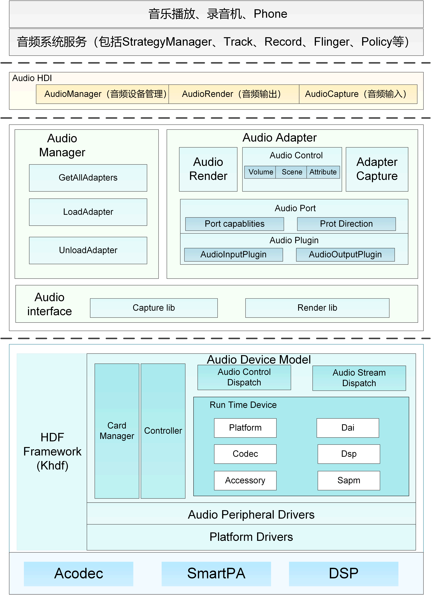
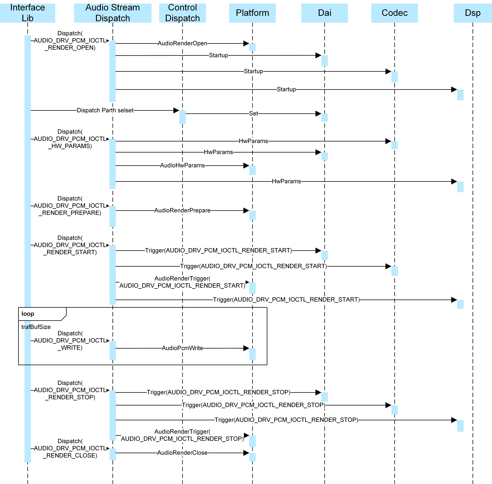
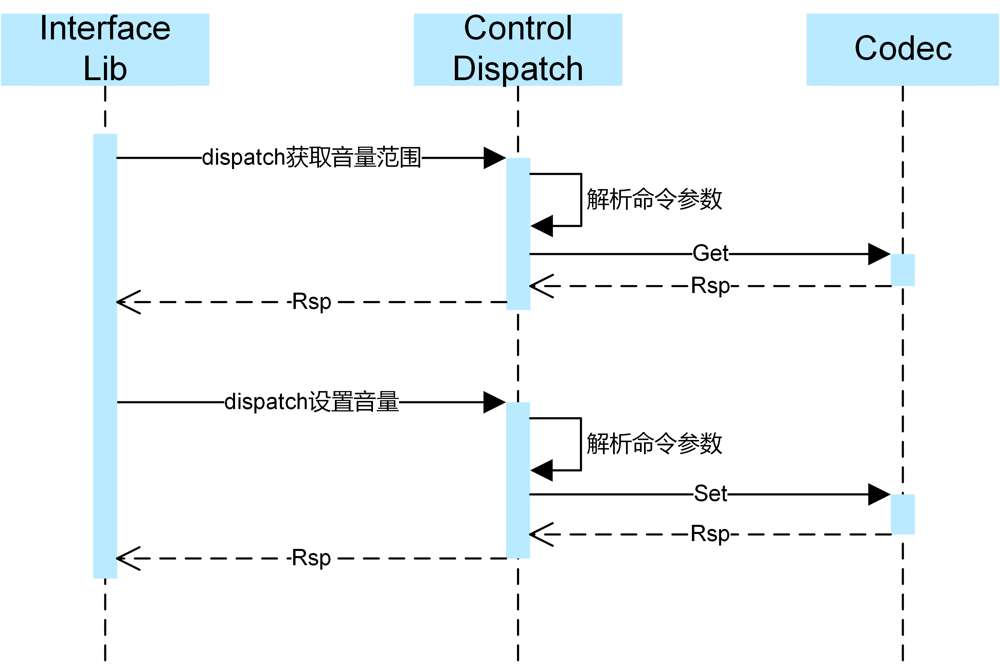
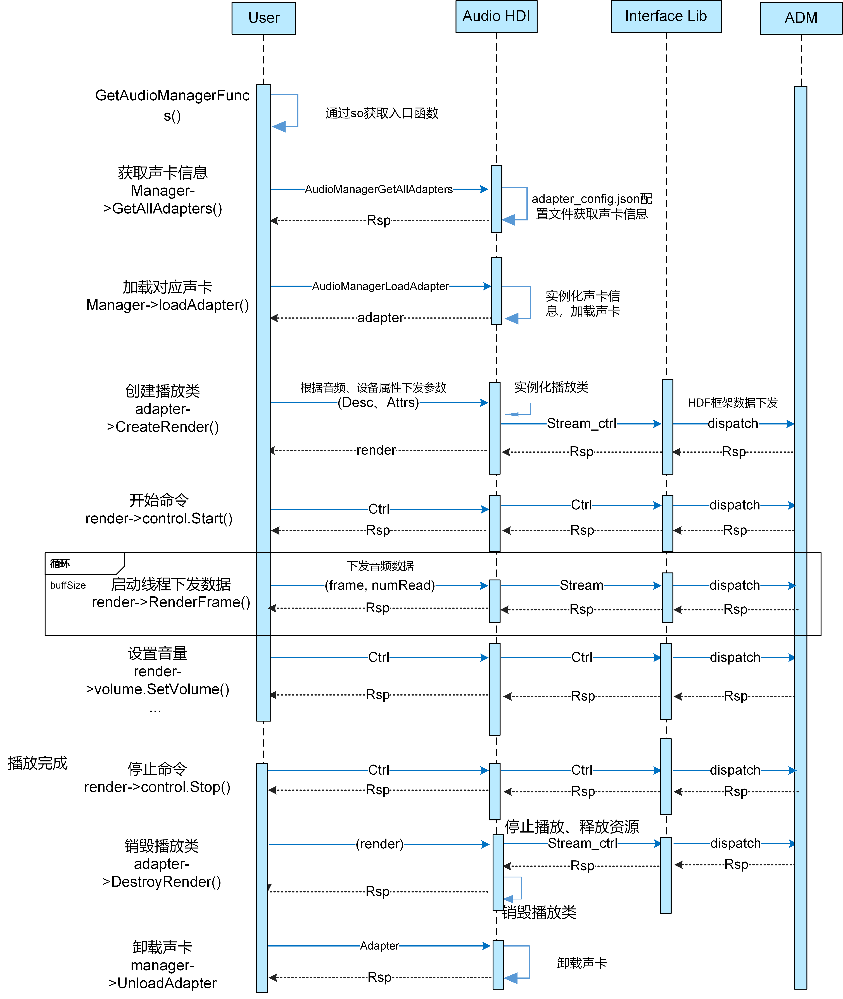

# Audio


## Audio驱动概述

多媒体系统是物联网设备开发中不可缺少的一部分，Audio作为其中重要的一个模块，Audio驱动模型的构建显得尤为重要。

本文主要介绍基于HDF（Hardware Driver Foundation）驱动框架开发的Audio驱动，包括Audio驱动的架构组成和功能部件。芯片厂商可以根据此驱动架构，进行各自驱动的开发及HAL层接口的调用。


## Audio驱动框架介绍

Audio驱动框架基于[HDF驱动框架](driver-overview-foundation.md)实现。Audio驱动架构组成：



驱动架构主要由以下几部分组成。
- HDI adapter：实现Audio HAL层驱动（HDI接口适配），给Audio服务（frameworks）提供所需的音频硬件驱动能力接口。包含 Audio Manager、Audio Adapter、Audio Control、Audio Capture、Audio Render等接口对象。 
- Audio Interface Lib：配合内核中的Audio Driver Model使用，实现音频硬件的控制、录音数据的读取、播放数据的写入。它里面包括Stream_ctrl_common 通用层，主要是为了和上层的Audio HDI Adapter层进行对接。
- ADM（Audio Driver Model）：音频驱动框架模型，向上服务于多媒体音频子系统，便于系统开发者能够更便捷的根据场景来开发应用。向下服务于具体的设备厂商，对于Codec和DSP设备厂商来说，可根据ADM模块提供的向下统一接口适配各自的驱动代码，就可以实现快速开发和适配OpenHarmony系统。
- Audio Control Dispatch: 接收lib层的控制指令并将控制指令分发到驱动层。
- Audio Stream Dispatch: 接收lib层的数据并将数据分发到驱动层。

- Card Manager: 多声卡管理模块。每个声卡含有Dai、Platform、Codec、Dsp、SAPM模块。
- Platform Drivers: 驱动适配层。
- SAPM（Smart Audio Power Manager）：电源管理模块，对整个ADM电源进行功耗策略优化。

## Audio驱动开发

以下将基于Audio驱动框架，并以Hi3516DV300平台为例，介绍相关驱动开发的具体步骤。

### Audio ADM模块框架介绍

Audio驱动对HDI层提供三个服务hdf_audio_render、hdf_audio_capture、hdf_audio_control。开发板dev目录下驱动服务节点如下：

```shell
# ls -l hdf_audio*
crw-rw---- 1 system system 247,   6 1970-01-01 00:00 hdf_audio_capture             // 音频数据录音流服务。
crw-rw---- 1 root   root   247,   4 1970-01-01 00:00 hdf_audio_codec_primary_dev0  // 音频声卡设备0名称。
crw-rw---- 1 root   root   247,   4 1970-01-01 00:00 hdf_audio_codec_primary_dev11 // 音频声卡设备1名称。
crw-rw---- 1 system system 247,   5 1970-01-01 00:00 hdf_audio_control             // 音频控制流服务。
crw-rw---- 1 system system 247,   7 1970-01-01 00:00 hdf_audio_render              // 音频数据播放流务。
```

音频声卡设备包括的驱动服务：

hdf_audio_codec_primary_dev0

- dma_service_0 : dma服务
- dai_service : CPU dai服务
- codec_service_0 : codec服务（可以是smartPA）
- dsp_service_0 : dsp 服务（可选项）

hdf_audio_codec_primary_dev11

- dma_service_0 : dma服务
- dai_service : CPU dai服务
- codec_service_1 : codec服务（可以是smartPA）
- dsp_service_0 : dsp服务（可选项）

#### 启动流程


1. 系统启动时Audio模块的Platform、Codec、Dsp、Dai各个驱动首先被加载，各驱动从各自私有配置文件中获取配置信息，并将获取的配置信息保存到各驱动的Data数据结构中。

2. 各驱动模块调用ADM注册接口将自己添加到各驱动模块的链表中。

3. ADM模块读取hdf_audio_driver_0和hdf_audio_driver_1配置信息，加载各模块的具体设备。

4. ADM模块调用各模块的初始化函数对各模块设备进行初始化。

5. 将初始化成功的音频设备添加到cardManager链表。

#### 播放流程



1. 播放音频时，Interface Lib层通过播放流服务下发Render Open指令，Audio Stream Dispatch服务收到指令后分别调用各模块的函数接口对指令进行下发。

2. Interface Lib层通过控制服务下发通路选择指令，Control Dispatch控制服务收到指令后调用Dai模块接口设置通路。

3. Interface Lib层通过播放流服务下发硬件参数，Audio Stream Dispatch服务收到参数后分别调用各模块参数设置接口，对硬件参数进行设置。

4. Interface Lib层通过播放流服务下发播放启动指令，Audio Stream Dispatch服务收到指令后分别调用各模块启动接口，对各模块进行启动设置。

5. Interface Lib层通过播放流服务下发音频数据，Audio Stream Dispatch服务收到数据后调用Platform AudioPcmWrite接口将音频数据传给Dma。

6. Interface Lib层通过播放流服务下发播放停止指令，Audio Stream Dispatch服务收到指令后分别调用各模块停止接口，对各模块进行停止设置。

7. Interface Lib层通过播放流服务下发Render Close指令，Audio Stream Dispatch服务收到指令后调用Platform AudioRenderClose对已申请资源进行释放。

#### 控制流程



1. 设置音量，首先Interface Lib层通过控制服务下发获取音量范围指令，Control Dispatch控制服务收到指令后进行解析，并调用Codec模块Get函数，获取可设置音量的范围。
2. Interface Lib层通过控制服务下发设置音量指令，Control Dispatch控制服务收到指令后进行解析，并调用Codec模块Set函数设置音量。

### Audio驱动公共函数介绍

| 函数名                         | 功能                                        |
| ------------------------------ | ------------------------------------------- |
| CodecDeviceReadReg             | codec寄存器读函数                           |
| CodecDeviceWriteReg            | codec寄存器写函数                           |
| CodecDaiRegI2cRead             | codec dai通过I2C接口读寄存器函数            |
| CodecDaiRegI2cWrite            | codec dai通过I2C接口写寄存器函数            |
| CodecDeviceRegI2cRead          | codec通过I2C接口读寄存器函数                |
| CodecDeviceRegI2cWrite         | codec通过I2C接口写寄存器函数                |
| CodecDeviceInitRegConfig       | codec初始化函数                             |
| CodecDaiDeviceStartupRegConfig | codec启动函数                               |
| CodecSetCtlFunc                | codec设置set和get接口实现函数               |
| CodecSetConfigInfoOfControls   | codec设置控制功能函数接口和寄存器信息的函数 |
| CodecGetConfigInfo             | codec获取HCS配置信息函数                    |
| CodecGetDaiName                | codec获取HCS配置dai名称函数                 |
| CodecGetServiceName            | codec获取HCS配置服务名称函数                |
| DaiDeviceReadReg               | dai读寄存器函数                             |
| DaiDeviceWriteReg              | dai写寄存器函数                             |
| DaiSetConfigInfoOfControls     | dai设置控制功能函数接口和寄存器信息的函数   |
| DaiGetConfigInfo               | dai获取HCS配置信息函数                      |


### Audio驱动开发步骤

#### 已有平台开发

ADM适配已有平台（Hi3516DV300）Codec或Smart PA的驱动开发流程：


- 根据芯片说明将相关寄存器信息配置到Codec或Smart PA的私有HCS中。

- 如果新添加Codec或Smart PA和已适配Codec或Smart PA的工作流程相同则不需要实现Codec或Smart PA的操作函数集和配置编译文件。

- 进行编译调试验证。

#### 新平台开发

ADM适配新平台Audio驱动开发流程：


Audio驱动需要将Audio相关的Codec（可选）、Dai、DMA、DSP（可选）、Smart PA（可选）驱动进行适配。

- 根据芯片说明将各模块驱动的寄存器信息配置到各模块的私有配置文件中。

- 实现各模块的操作函数集。

- 修改配置Audio模块编译文件。

- 进行编译调试验证。

## Audio驱动开发实例

代码路径：device/board/hisilicon/hispark_taurus/audio_drivers

下面以Hi3516DV300为例，介绍Audio的Codec驱动、Dai驱动、Platform驱动开发步骤。

### Audio的Codec驱动开发实例

代码路径：device/board/hisilicon/hispark_taurus/audio_drivers/codec/hi3516

codec驱动开发主要包含如下几个重要步骤：

1. 定义填充一个具体的codec。
2. 实现codec回调函数。
3. 注册绑定到HDF框架。
4. 配置HCS和Makefile。

#### Codec数据结构填充

Codec模块需要填充如下3个结构体：

- g_codecData：codec设备的操作函数集和私有数据集。

- g_codecDaiDeviceOps：codecDai的操作函数集，包括启动传输和参数配置等函数接口。

- g_codecDaiData：codec的数字音频接口的操作函数集和私有数据集。

```c
struct CodecData g_codecData = {
  .Init = CodecDeviceInit,      // codec设备初始化（适配新平台需重新实现）
  .Read = AudioDeviceReadReg,   // 读寄存器（现有框架已实现可使用）
  .Write = AudioDeviceWriteReg, // 写寄存器（现有框架已实现可使用）
};

struct AudioDaiOps g_codecDaiDeviceOps = {
  .Startup = CodecDaiStartup,   // 启动传输（适配新平台需重新实现）
  .HwParams = CodecDaiHwParams, // 参数配置（适配新平台需重新实现）
};

struct DaiData g_codecDaiData = {
  .DaiInit = CodecDaiDeviceInit, // codecdai设备初始化（适配新平台需重新实现）
  .ops = &g_codecDaiDeviceOps,   // codecdai操作函数
};
```

#### codecDevice和codecDai设备初始化

CodecDeviceInit将完成AIAO的设置、寄存器默认值初始化、g_audioControls插入到controls链、电源管理初始化、通路选择设置等。

```c
int32_t CodecDeviceInit(struct AudioCard *audioCard, struct CodecDevice *codec)
{
    ...
    /* hi3516平台AIAO的Set和Get注册 */
    CodecSetCtlFunc(codec->devData, AudioCodecAiaoGetCtrlOps, AudioCodecAiaoSetCtrlOps)
    ...
    /* hi3516平台codec寄存器IoRemap */
    CodecHalSysInit();
    ...
    /* hi3516平台codec寄存器默认值初始化 */
    CodecRegDefaultInit(codec->devData->regCfgGroup);
    ...
    /* hi3516平台g_audioControls挂到Control链表上 */
    AudioAddControls(audioCard, codec->devData->controls, codec->devData->numControls);
    ...
    /* hi3516平台codec加载到sapm */
    AudioSapmNewComponents(audioCard, codec->devData->sapmComponents, codec->devData->numSapmComponent);
    ...
    /* hi3516平台codec加挂到通路选择链表上 */
    AudioSapmAddRoutes(audioCard, g_audioRoutes, HDF_ARRAY_SIZE(g_audioRoutes);
    ...
    AudioSapmNewControls(audioCard);
    ...
    /* hi3516平台codec电源管理 */
    AudioSapmSleep(audioCard);
    ...
    return HDF_SUCCESS;
}
```

CodecDaiDeviceInit将完成codecDai侧初始化，hi3516此处未涉及，接口保留：

```c
int32_t CodecDaiDeviceInit(struct AudioCard *card, const struct DaiDevice *device)

{
    ...
    AUDIO_DRIVER_LOG_DEBUG("codec dai device name: %s\n", device->devDaiName);
    (void)card;
    return HDF_SUCCESS;
}
```

#### Codec操作函数集实现

codec模块当前封装了OSAL读写寄存器的Read、Write函数。

如新增平台无法使用OSAL的Read、Write函数来操作寄存器，则此Read、Write函数接口需自行实现。

```c
int32_t AudioDeviceReadReg(unsigned long virtualAddress, uint32_t reg, uint32_t *val)
{
  ...
  *val = OSAL_READL((void *)((uintptr_t)(virtualAddress + reg)));
  return HDF_SUCCESS;
}

int32_t AudioDeviceWriteReg(unsigned long virtualAddress, uint32_t reg, uint32_t value)
{
  OSAL_WRITEL(value, (void *)((uintptr_t)(virtualAddress + reg)));
  return HDF_SUCCESS;
}
```

CodecDaiStartup为启动时的一些设置。

```c
int32_t CodecDaiStartup(const struct AudioCard *card, const struct DaiDevice *device)
{
  int32_t ret;
  ...
  (void)card;
  ret = CodecSetAdcTuneEnable(device->devData->regCfgGroup);
  ...
  return HDF_SUCCESS;
}
```

CodecDaiHwParams为参数配置，包括采样率、位宽等。

```c
int32_t CodecDaiHwParams(const struct AudioCard *card, const struct AudioPcmHwParams *param)
{
  unsigned int bitWidth;
  struct CodecDaiParamsVal codecDaiParamsVal;
  ...
  int ret = AudioFormatToBitWidth(param->format, &bitWidth);
  ...
  codecDaiParamsVal.frequencyVal = param->rate;
  codecDaiParamsVal.formatVal = bitWidth;
  ret = CodecDaiParamsUpdate(card->rtd->codecDai->devData->regCfgGroup, codecDaiParamsVal);
  ...
  return HDF_SUCCESS;
}
```

#### Codec注册绑定到HDF

此处依赖HDF框架的驱动实现方式，具体流程可参考[HDF驱动框架](driver-overview-foundation.md)指导。

填充g_codecDriverEntry结构体，moduleName与device_info.hcs中的moduleName匹配，实现Bind、Init、Release函数指针。 

device/board/hisilicon/hispark_taurus/audio_drivers/codec/hi3516/src/hi3516_codec_adapter.c

```c
struct HdfDriverEntry g_codecDriverEntry = {
   .moduleVersion = 1,
   .moduleName = "CODEC_HI3516",
   .Bind = CodecDriverBind,
   .Init = CodecDriverInit,
   .Release = CodecDriverRelease,
};
HDF_INIT(g_codecDriverEntry);
```

CodecDriverBind：将HDF中device绑定到codec，将codec service注册到HDF框架。

```c
static int32_t CodecDriverBind(struct HdfDeviceObject *device)
{
  struct CodecHost *codecHost = (struct CodecHost *)OsalMemCalloc(sizeof(*codecHost));
  ...
  codecHost->device = device;
  device->service = &codecHost->service;
  return HDF_SUCCESS;
}
```

CodecDriverInit：获取codecService名字和私有寄存器配置，并通过AudioRegisterCodec插入到链表中。

```c
static int32_t CodecDriverInit(struct HdfDeviceObject *device)
{
  ...
  CodecGetConfigInfo(device, &g_codecData);
  CodecSetConfigInfo(&g_codecData, &g_codecDaiData);
  CodecGetServiceName(device, &g_codecData.drvCodecName);
  CodecGetDaiName(device, &g_codecDaiData.drvDaiName);
  AudioRegisterCodec(device, &g_codecData, &g_codecDaiData);
  ...
  return HDF_SUCCESS;
}
```

CodecDriverRelease：释放驱动资源。

```c
static void CodecDriverRelease(struct HdfDeviceObject *device)
{
   codecHost = (struct CodecHost *)device->service;
   OsalMemFree(codecHost);
}
```

#### HCS配置流程<a name="section4115"></a>

hcs中配置驱动节点、加载顺序、服务名称等。hcs语法可参考HDF框架的[配置管理](driver-hdf-manage.md)。

标准系统配置文件路径：

vendor/hisilicon/hispark_taurus_standard/hdf_config/khdf/

小型系统配置文件路径：

vendor/hisilicon/hispark_taurus/hdf_config/

**device_info.hcs中配置Codec设备信息**

添加Codec节点配置。修改如下配置中的moduleName，该名字会与HdfDriverEntry结构体中moduleName进行匹配，一般情况需体现出硬件平台名称。例：moduleName = "CODEC_HI3516"。

代码片段如下：

```c
     audio :: host {
      device_codec :: device {
         device0 :: deviceNode {
           policy = 1;   // codec模块只对内核提供服务
           priority = 50;  // codec模块需在HDF_AUDIO模块之前加载
           preload = 0;
           permission = 0666;
           moduleName = "CODEC_HI3516"; // 名字会与HdfDriverEntry结构体中moduleName进行匹配
           serviceName = "codec_service_0"; // 对外提供的服务名称
           deviceMatchAttr = "hdf_codec_driver"; // 私有配置属性名称，通过此名称匹配对应的私有数据（包含寄存器配置）
         }
       }
```

**audio_config.hcs中配置私有依赖**

配置audio_card设备依赖的Codec、Platform、Dai、Dsp之间的依赖关系。

代码片段如下：

```c
root {
    platform {
        ...
        controller_0x120c1001 :: card_controller {
            // 配置私有数据属性名称，与device_info.hcs中的deviceMatchAttr对应
            match_attr = "hdf_audio_driver_1"; 
            serviceName = "hdf_audio_codec_primary_dev11"; // 对外提供的服务名称
            codecName = "codec_service_1"; // codec服务名称
            platformName = "dma_service_0"; // dma服务
            cpuDaiName = "dai_service"; // CPU dai服务
            codecDaiName = "tfa9879_codec_dai"; // codec dai服务
            dspName = "dsp_service_0"; // dsp服务名称
            dspDaiName = "dsp_dai"; // dsp dai
        }
    }
}
```

**codec_config.hcs中配置私有寄存器**

与配置在device_info.hcs中codec的deviceMatchAttr匹配，目前配置中包含寄存器配置。

绑定控制功能配置主要是将控制功能及其寄存器参数按统一的结构规范，配置在HCS文件中并获取与解析后增加到控制链表中。

- regConfig：寄存器与控制功能配置组名称。

- ctrlParamsSeqConfig：控制功能寄存器配置组名称，其中item与controlsConfig组中的item位置顺序一一对应，表示某一功能对应的寄存器配置。

- daiStartupSeqConfig：Dai启动配置配置组名称。

- daiParamsSeqConfig：播放参数配置组名称。

- resetSeqConfig：重置过程寄存器配置组名称。

- initSeqConfig：初始化过程寄存器配置组名称。

- controlsConfig：控制功能配置组名称，其中array index（具体业务场景）和iface（与HAL保持一致）为固定的值。

- sapmConfig：电源管理控制功能配置组名称，其中array index（具体业务场景）和iface（与HAL保持一致）为固定的值。

- ctrlSapmParamsSeqConfig：电源管理控制功能寄存器配置组名称。

- sapmComponent：电源管理组件配置组名称。

- array index：

  controlsConfig配置组的array index是audio_codec_base.c文件中g_audioCodecControlsList数组的元素标号。

  sapmConfig配置组的array index是audio_codec_base.c文件中g_audioSapmCfgNameList数组的元素标号。

  sapmComponent配置组的compNameIndex是audio_codec_base.c文件中g_audioSapmCompNameList数组元素标号。

- iface：虚拟混合器设备配置为2。

```c
 root {
    platform {
        template codec_controller {
            match_attr = "";
            serviceName = "";
            codecDaiName = "";
        }
        controller_0x120c1030 :: codec_controller {
            match_attr = "hdf_codec_driver";
            serviceName = "codec_service_0";
            codecDaiName = "codec_dai";
            
            /* hi3516寄存器基地址 */
            idInfo {
                chipName = "hi3516";        // codec名字
                chipIdRegister = 0x113c0000;  // codec基地址
                chipIdSize = 0x1000;         // codec地址偏移
            }
            
           /* 寄存器配置，包含各种寄存器配置信息 */
            regConfig {                
               /*   reg: register address
                    rreg: register address
                    shift: shift bits
                    rshift: rshift bits
                    min: min value
                    max: max value
                    mask: mask of value
                    invert: enum InvertVal 0-uninvert 1-invert
                    value: value
                */

                /* reg, value */
                initSeqConfig = [
                    0x14,    0x04000002,
                    0x18,    0xFD200004,
                    0x1C,    0x00180018,
                    0x20,    0x83830028,
                    0x24,    0x00005C5C,
                    0x28,    0x00130000,
                    0x30,    0xFF035A00,
                    0x34,    0x08000001,
                    0x38,    0x06062424,
                    0x3C,    0x1E1EC001,
                    0x14,    0x04000002
                ];            
                
                /* control function config 
                    array index, iface, mixer/mux, enable, */
                    0,  2,  0,  0,
                    1,  2,  0,  1,
                    2,  2,  0,  1,
                    3,  2,  0,  1,
                    4,  2,  0,  1,
                    5,  2,  0,  1,
                    8,  2,  0,  0,
                    9,  2,  0,  0,
                ];                
                /* control function register config 
                   reg, rreg, shift, rshift, min, max, mask, invert, value */
                ctrlParamsSeqConfig = [
                    0x3c, 0x3c, 24, 24, 0x0, 0x57, 0x7F, 1, 0,   // "Main Capture Volume"
                    0x38, 0x38, 31, 31, 0x0, 0x1, 0x1, 0, 0,     // "Playback Mute"
                    0x3c, 0x3c, 31, 31, 0x0, 0x1, 0x1, 0, 0,      // "Capture Mute"
                    0x20, 0x20, 16, 16, 0x0, 0xF, 0x1F, 0, 0,     // "Mic Left Gain"
                    0x20, 0x20, 24, 24, 0x0, 0xF, 0x1F, 0, 0,     // "Mic Right Gain"
                    0x2000, 0x2000, 16, 16, 0x0, 0x7, 0x7, 0, 0,  // "Render Channel Mode"
                    0x1000, 0x1000, 16, 16, 0x0, 0x7, 0x7, 0, 0  // "Capture Channel Mode"
                ];

                /* 上层下发参数后，写入音频相关信息的寄存器 
                   reg, rreg, shift, rshift, min, max, mask, invert, value */
                daiParamsSeqConfig = [  
                    0x30, 0x30, 13, 13, 0x0, 0x1F, 0x1F, 0, 0x0,    // i2s_frequency
                    0x1C, 0x1C, 6, 6, 0x0, 0x3, 0x3, 0, 0x0,       // adc_mode_sel
                    0x30, 0x30, 22, 22, 0x0, 0x3, 0x3, 0, 0x0,     // i2s_datawith
                ];

                /* 电源管理功能寄存器配置 
                   reg, rreg, shift, rshift, min, max, mask, invert, value */
                ctrlSapmParamsSeqConfig = [  
                    0x20, 0x20, 23, 23, 0x0, 0x1, 0x1, 0, 0,  // LPGA MIC 0 -- connect MIC
                    0x20, 0x20, 31, 31, 0x0, 0x1, 0x1, 0, 0,  // RPGA MIC 0 -- connect MIC
                    0x30, 0x30, 27, 27, 0x0, 0x1, 0x1, 0, 0,  // dacl to dacr mixer
                    0x30, 0x30, 26, 26, 0x0, 0x1, 0x1, 0, 0  // dacr to dacl mixer
                ];

                /*
                 电源管理组件配置
                 sapmType, compNameIndex, reg, mask, shift, invert, kcontrolNews, kcontrolsNum
                 reg = 0xFFFF: component has no sapm register bit
                */
                sapmComponent = [ 
                    10, 0,    0x20,    0x1, 15,  1, 0, 0, // ADCL
                    10, 1,    0x20,    0x1, 14,  1, 0, 0, // ADCR
                    11, 2,    0x14,    0x1, 11,  1, 0, 0, // DACL
                    11, 3,    0x14,    0x1, 12,  1, 0, 0, // DACR
                    17, 4,    0x20,    0x1, 13,  1, 1, 1, // LPGA
                    17, 5,    0x20,    0x1, 12,  1, 2, 1, // RPGA
                    15, 6,  0xFFFF, 0xFFFF,  0,  0, 0, 0, // SPKL
                    15, 7,  0xFFFF, 0xFFFF,  0,  0, 0, 0, // SPKR
                    17, 52, 0xFFFF, 0xFFFF,  0,  0, 3, 1, // SPKL PGA
                    17, 53, 0xFFFF, 0xFFFF,  0,  0, 4, 1, // SPKR PGA
                    13, 40, 0xFFFF, 0xFFFF,  0,  0, 0, 0, // MIC1
                    13, 41, 0xFFFF, 0xFFFF,  0,  0, 0, 0  // MIC2
                ];
                
              /* 电源管理功能配置 
                   array index, iface, mixer/mux, enable
              */ 
                sapmConfig = [
                    0,    2,    0,    1,
                    1,    2,    0,    1,
                    2,    2,    0,    1,
                    3,    2,    0,    1
                ];
            }
        }
    }
}
```

在C代码中读取HCS配置文件来寄存器配置。

```c
static int32_t CodecDriverInit(struct HdfDeviceObject *device)
{
  ...
  CodecGetConfigInfo(device, &g_codecData) ;
  CodecSetConfigInfo(&g_codecData, &g_codecDaiData);
  ...
  return HDF_SUCCESS;
} 
```

Codec注册时入参device中已有controller_0x120c1030的节点信息，只需要解析其中的节点就可以获取配置信息。

```c
int32_t CodecGetConfigInfo(const struct HdfDeviceObject *device, struct CodecData *codecData)
{
  codecData->regConfig = (struct AudioRegCfgData *)OsalMemCalloc(sizeof(*(codecData->regConfig)));
  CodecGetRegConfig(device, codecData->regConfig);
  return HDF_SUCCESS;
}
```

配置信息获取，配置节点。

```c
int32_t CodecGetRegConfig(const struct HdfDeviceObject *device, struct AudioRegCfgData *configData)
{
    ...
    drsOps = DeviceResourceGetIfaceInstance(HDF_CONFIG_SOURCE);
    ...
    idNode = drsOps->GetChildNode(root, "idInfo");
    ParseAudioAttr(drsOps, idNode, &configData->audioIdInfo);
    regCfgNode = drsOps->GetChildNode(root, "regConfig");
    ...
    DEV_RES_NODE_FOR_EACH_ATTR(regCfgNode, regAttr) {
    ...
    return HDF_SUCCESS;
}
```

regConfig节点中子项的配置信息获取并使用。在框架进行配置文件解析后，可直接替换代码中的寄存器信息。

```c
int32_t CodecDeviceInit(struct AudioCard *audioCard, struct CodecDevice *codec)
{
...
    if (CodecRegDefaultInit(codec->devData->regCfgGroup) != HDF_SUCCESS) {
        AUDIO_DRIVER_LOG_ERR("CodecRegDefaultInit failed.");
        return HDF_FAILURE;
    }
...
    return HDF_SUCCESS;
}
```

### SmartPA驱动开发实例

代码路径：device/board/hisilicon/hispark_taurus/audio_drivers/codec/tfa9879

SmartPA归属于codec驱动的一种，其开发流程为：

1. 定义填充一个具体的codec。
2. 实现codec回调函数。
3. 注册绑定到HDF框架。
4. 配置HCS和Makefile。

#### SmartPA的codec数据结构填充

codec模块需要填充如下3个结构体：

- g_tfa9879Data：codec设备操作函数集，其中包含HCS文件中的配置信息，且定义与映射了codec设备的初始化、读写寄存器的方法函数。

- g_tfa9879DaiDeviceOps：codec设备DAI的数据集，其中定义与映射了codec设备DAI的操作集。

- g_tfa9879DaiData：codec设备DAI的数据集，其中定义与映射了codec设备的数据访问接口的驱动名、初始化和操作集。

```c
struct CodecData g_tfa9879Data = {
    .Init = Tfa9879DeviceInit,
    .Read = CodecDeviceRegI2cRead,
    .Write = CodecDeviceRegI2cWrite,
};

struct AudioDaiOps g_tfa9879DaiDeviceOps = {
    .Startup = Tfa9879DaiStartup,
    .HwParams = Tfa9879DaiHwParams,
};

struct DaiData g_tfa9879DaiData = {
    .drvDaiName = "tfa9879_codec_dai",
    .DaiInit = Tfa9879DaiDeviceInit,
    .ops = &g_tfa9879DaiDeviceOps,
    .Read = CodecDaiRegI2cRead,
    .Write = CodecDaiRegI2cWrite,
};
```

#### codecDevice和codecDai设备初始化

设备初始化入口函数为Tfa9879DeviceInit，其中主要包括设置SmartPA I2C设备地址，获取配置数据、初始化（含重置）设备寄存器和绑定控制功能配置到控制链表中，当前Demo实现中也包括了Hi3516DV300设备的相关寄存器初始化，如初始化GPIO引脚等。

```c
int32_t Tfa9879DeviceInit(struct AudioCard *audioCard, const struct CodecDevice *device)
{
    int32_t ret;
    ...
    // 初始化GPIO引脚
    ret = Hi35xxGpioPinInit();
    ...
    // 配置I2C参数
    g_transferParam.i2cBusNumber = TFA9879_I2C_BUS_NUMBER;
    g_transferParam.i2cDevAddr = TFA9879_I2C_DEV_ADDR;
    g_transferParam.i2cRegDataLen = TFA9879_I2C_REG_DATA_LEN;
    device->devData->privateParam = &g_transferParam;
    ...
    // 初始化设备寄存器
    ret = CodecDeviceInitRegConfig(device);
    ...
    // 绑定功能控制配置
    if (AudioAddControls(audioCard, device->devData->controls, device->devData->numControls) !=
        HDF_SUCCESS) {
        AUDIO_DRIVER_LOG_ERR("add controls failed.");
        return HDF_FAILURE;
    }
    ...
}
```

I2C读写寄存器公用函数：

```c
int32_t CodecDeviceRegI2cRead(const struct CodecDevice *codec, uint32_t reg, uint32_t *val)
{
    int32_t ret;
    struct AudioAddrConfig regAttr;
    struct I2cTransferParam *i2cTransferParam = NULL;
    ...
    i2cTransferParam = (struct I2cTransferParam *)codec->devData->privateParam;
    ...
    regAttr.addr = (uint8_t)reg;
    regAttr.value = 0;
    ret = CodecI2cTransfer(i2cTransferParam, &regAttr, I2C_FLAG_READ);
    ...
    *val = regAttr.value;
    return HDF_SUCCESS;
}

int32_t CodecDeviceRegI2cWrite(const struct CodecDevice *codec, uint32_t reg, uint32_t value)
{
    int32_t ret;
    struct AudioAddrConfig regAttr;
    struct I2cTransferParam *i2cTransferParam = NULL;
    ...
    i2cTransferParam = (struct I2cTransferParam *)codec->devData->privateParam;
    ...
    regAttr.addr = (uint8_t)reg;
    regAttr.value = (uint16_t)value;
    ret = CodecI2cTransfer(i2cTransferParam, &regAttr, 0);
    ...
    return HDF_SUCCESS;
}

int32_t CodecDaiRegI2cRead(const struct DaiDevice *dai, uint32_t reg, uint32_t *value)
{
    ...
    ret = CodecI2cTransfer(i2cTransferParam, &regAttr, I2C_FLAG_READ);
    ...
    return HDF_SUCCESS;
}

int32_t CodecDaiRegI2cWrite(const struct DaiDevice *dai, uint32_t reg, uint32_t value)
{
    ...
    ret = CodecI2cTransfer(i2cTransferParam, &regAttr, 0);
    ...
    return HDF_SUCCESS;
}
```

#### Codec操作函数集实现

Tfa9879DaiStartup为启动时的一些设置，代码片段如下：

```c
int32_t Tfa9879DaiStartup(const struct AudioCard *card, const struct DaiDevice *device)
{
    int ret;
    (void)card;
    (void)device;
    // 设置SmartPA的启动的寄存器配置
    ret = CodecDaiDeviceStartupRegConfig(device);
    ...
    return HDF_SUCCESS;
}

```

Tfa9879DaiHwParams为下发播放参数接口函数，代码片段如下：

```c
int32_t Tfa9879DaiHwParams(const struct AudioCard *card, const struct AudioPcmHwParams *param)
{
    int32_t ret;
    uint16_t frequency, bitWidth;
    struct DaiParamsVal daiParamsVal;
    (void)card;
    ...
    // 匹配采样率
    ret = Tfa9879FrequencyParse(param->rate, &frequency);
    ...
    // 匹配位宽
    ret = Tfa9879FormatParse(param->format, &bitWidth);
    ...
    daiParamsVal.frequencyVal = frequency;
    daiParamsVal.formatVal = bitWidth;
    daiParamsVal.channelVal = param->channels;  // 匹配声道
    ret = Tfa9879DaiParamsUpdate(card->rtd->codecDai, daiParamsVal);
    ...
    return HDF_SUCCESS;
}
```

#### Codec注册绑定到HDF

此处依赖HDF框架的驱动实现方式，具体流程可参考[HDF驱动框架](driver-overview-foundation.md)。

填充g_tfa9879DriverEntry结构体，moduleName与device_info.hcs中的moduleName匹配，实现Bind、Init、Release函数指针。

device/board/hisilicon/hispark_taurus/audio_drivers/codec/tfa9879/src/tfa9879_accessory_adapter.c

```c
static int32_t Tfa9879DriverBind(struct HdfDeviceObject *device)
{
    (void)device;
    AUDIO_DRIVER_LOG_INFO("success!");
    return HDF_SUCCESS;
}

static int32_t Tfa9879DriverInit(struct HdfDeviceObject *device)
{
    int32_t ret;
    ...
    // 获取HCS中的配置数据
    ret = CodecGetConfigInfo(device, &g_tfa9879Data);
    ...
    // 设置codec控制相关的接口函数和寄存器信息
    ret = CodecSetConfigInfoOfControls(&g_tfa9879Data, &g_tfa9879DaiData);
    ...
    ret = CodecGetServiceName(device, &g_tfa9879Data.drvCodecName);
    ...
    ret = CodecGetDaiName(device, &g_tfa9879DaiData.drvDaiName);
    ...
    // 注册codec到声卡
    ret = AudioRegisterCodec(device, &g_tfa9879Data, &g_tfa9879DaiData);
    ....
    return HDF_SUCCESS;
}

/* HdfDriverEntry definitions */
struct HdfDriverEntry g_tfa9879DriverEntry = {
    .moduleVersion = 1,
    .moduleName = "CODEC_TFA9879",
    .Bind = Tfa9879DriverBind,
    .Init = Tfa9879DriverInit,
    .Release = NULL,
};
HDF_INIT(g_tfa9879DriverEntry);
```

#### HCS配置流程

配置过程可参考Codec驱动开发实例[HCS配置流程](#section4115)章节。

### Platform驱动开发实例

代码路径：device/board/hisilicon/hispark_taurus/audio_drivers/soc

在Audio驱动开发中，platform为DMA驱动的适配。platform驱动开发主要包含如下几个重要步骤：

1. 定义填充一个具体的platform
2. 实现platform回调函数
3. 注册绑定到HDF框架
4. 配置HCS和Makefile

#### Platform数据结构填充

Platform模块需要填充如下2个结构体：

- g_platformData ：platform设备私有配置，其中包含platform设备的初始化和操作函数。

- g_dmaDeviceOps ：Dma设备操作函数集，包含了DMA一些通用接口的封装。

```c
struct AudioDmaOps g_dmaDeviceOps = {
    .DmaBufAlloc = Hi3516DmaBufAlloc,             // dma内存申请函数接口
    .DmaBufFree = Hi3516DmaBufFree,               // dma内存释放函数接口
    .DmaRequestChannel = Hi3516DmaRequestChannel, // dma申请通道函数接口
    .DmaConfigChannel = Hi3516DmaConfigChannel,   // dma通道配置函数接口
    .DmaPrep = Hi3516DmaPrep,                     // dma准备函数接口
    .DmaSubmit = Hi3516DmaSubmit,                 // dma submit函数接口
    .DmaPending = Hi3516DmaPending,               // dma pending函数接口
    .DmaPause = Hi3516DmaPause,                   // dma暂停、停止函数接口
    .DmaResume = Hi3516DmaResume,                 // dma恢复函数接口
    .DmaPointer = Hi3516DmaPointer,               // dma获取当前播放或录音位置函数接口
};

struct PlatformData g_platformData = {
    .PlatformInit = AudioDmaDeviceInit, // dma设备初始化接口
    .ops = &g_dmaDeviceOps,
};
```

#### dmaDevice设备初始化

设备初始化入口函数为AudioDmaDeviceInit，其中主要包括设置3516平台特有的AIAO初始化等。

```c
int32_t AudioDmaDeviceInit(const struct AudioCard *card, const struct PlatformDevice *platformDevice)
{
... 
    AiaoHalSysInit();
    /* PIN MUX */
    AiaoSysPinMux();
    /* CLK reset */
    AiaoClockReset();
    /* aiao init */
    AiaoDeviceInit(chnId);
...
    return HDF_SUCCESS;
}
```

#### DMA操作函数集实现

Dma设备操作函数集，包含了DMA通用接口的封装。如通用接口不能满足开发要求，可自行实现新的DMA回调函数。

```c
int32_t AudioDmaDeviceInit(const struct AudioCard *card, const struct PlatformDevice *platform);
int32_t Hi3516DmaBufAlloc(struct PlatformData *data, const enum AudioStreamType streamType);
int32_t Hi3516DmaBufFree(struct PlatformData *data, const enum AudioStreamType streamType);
int32_t Hi3516DmaRequestChannel(const struct PlatformData *data, const enum AudioStreamType streamType);
int32_t Hi3516DmaConfigChannel(const struct PlatformData *data, const enum AudioStreamType streamType);
int32_t Hi3516DmaPrep(const struct PlatformData *data, const enum AudioStreamType streamType);
int32_t Hi3516DmaSubmit(const struct PlatformData *data, const enum AudioStreamType streamType);
int32_t Hi3516DmaPending(struct PlatformData *data, const enum AudioStreamType streamType);
int32_t Hi3516DmaPause(struct PlatformData *data, const enum AudioStreamType streamType);
int32_t Hi3516DmaResume(const struct PlatformData *data, const enum AudioStreamType streamType);
int32_t Hi3516DmaPointer(struct PlatformData *data, const enum AudioStreamType streamType, uint32_t *pointer);
```

#### Platform注册绑定到HDF

此处依赖HDF框架的驱动实现方式，具体流程可参考[HDF驱动框架](driver-overview-foundation.md)。

- 填充g_platformDriverEntry结构体
- moduleName与device_info.hcs中的moduleName匹配
- 实现Bind、Init、Release函数指针 

device/board/hisilicon/hispark_taurus/audio_drivers/soc/src/hi3516_dma_adapter.c

```c
static int32_t Hi3516DmaDriverInit(struct HdfDeviceObject *device)
{
...
    OsalMutexInit(&g_platformData.renderBufInfo.buffMutex);
    OsalMutexInit(&g_platformData.captureBufInfo.buffMutex);
    g_platformData.platformInitFlag = false;
    ret = AudioSocRegisterPlatform(device, &g_platformData);
...
    return HDF_SUCCESS;
}

static void Hi3516DmaDriverRelease(struct HdfDeviceObject *device)
{
    struct PlatformHost *platformHost = NULL;
...
    platformHost = (struct PlatformHost *)device->service;
...
    OsalMutexDestroy(&g_platformData.renderBufInfo.buffMutex);
    OsalMutexDestroy(&g_platformData.captureBufInfo.buffMutex);
    OsalMemFree(platformHost);
}

/* HdfDriverEntry definitions */
struct HdfDriverEntry g_platformDriverEntry = {
    .moduleVersion = 1,
    .moduleName = "DMA_HI3516",
    .Bind = Hi3516DmaDriverBind,
    .Init = Hi3516DmaDriverInit,
    .Release = Hi3516DmaDriverRelease,
};
HDF_INIT(g_platformDriverEntry);
```

#### HCS配置流程

配置过程可参考Codec驱动开发实例[HCS配置流程](#section4115)章节。

### Dai驱动开发实例

代码路径：device/board/hisilicon/hispark_taurus/audio_drivers/soc

Dai驱动开发主要包含如下几个重要步骤：

1. 定义填充一个具体的dai
2. 实现dai回调函数
3. 注册绑定到HDF框架
4. 配置HCS和Makefile

#### Dai数据结构填充

Dai模块需要填充如下2个结构体：

- g_daiData：dai设备私有配置，其中包含dai设备的初始化、读写寄存器、操作函数。

- g_daiDeviceOps：dai设备操作函数集，包含了dai的参数设置、触发、启动。

```c
struct AudioDaiOps g_daiDeviceOps = {
    .HwParams = DaiHwParams,
    .Trigger = DaiTrigger,
    .Startup = DaiStartup,
};

struct DaiData g_daiData = {
    .DaiInit = DaiDeviceInit,
    .Read = AudioDeviceReadReg,
    .Write = AudioDeviceWriteReg,
    .ops = &g_daiDeviceOps,
};
```

#### daiDevice设备初始化

设备初始化入口函数为DaiDeviceInit，其中主要包括设置dai的配置信息初始化，添加到Controls等。

```c
int32_t DaiDeviceInit(struct AudioCard *audioCard, const struct DaiDevice *dai)
{
...
    struct DaiData *data = dai->devData;
    struct AudioRegCfgData *regConfig = dai->devData->regConfig;
...
    g_regCodecBase = OsalIoRemap(CODEC_REG_BASE, CODEC_MAX_REG_SIZE);
...
    data->regVirtualAddr = (uintptr_t)g_regCodecBase;
    DaiSetConfigInfo(data);
    AudioAddControls(audioCard, data->controls, data->numControls);
    I2c6PinInit();
...
    data->daiInitFlag = true;
    return HDF_SUCCESS;
}
```

#### Dai操作函数集实现

AudioDeviceReadReg和AudioDeviceWriteReg在3516平台均未使用，作为接口预留。

DaiHwParams中主要完成一些pcm流信息的设置。

```c
int32_t DaiHwParams(const struct AudioCard *card, const struct AudioPcmHwParams *param)
{
    uint32_t bitWidth;
    struct DaiDevice *device = card->rtd->cpuDai;
...
    DaiCheckSampleRate(param->rate);
    struct DaiData *data = DaiDataFromCard(card);
    data->pcmInfo.channels = param->channels;
...
    AudioFormatToBitWidth(param->format, &bitWidth);
...
    data->pcmInfo.bitWidth = bitWidth;
    data->pcmInfo.rate = param->rate;
    data->pcmInfo.streamType = param->streamType;
    data->regVirtualAddr = (uintptr_t)g_regDaiBase;
...
    DaiParamsUpdate(device);
    data->regVirtualAddr = (uintptr_t)g_regCodecBase;
    return HDF_SUCCESS;
}
```

DaiTrigger在3516平台也未使用，作为接口预留。

DaiStartup为dai的启动函数，主要包括更新初始化寄存器配置、配置I2S等。

```c
int32_t DaiStartup(const struct AudioCard *card, const struct DaiDevice *device)
{
    struct AudioMixerControl *regCfgItem = NULL;
...
    regCfgItem = device->devData->regConfig->audioRegParams[AUDIO_DAI_STARTUP_PATAM_GROUP]->regCfgItem;
    itemNum = device->devData->regConfig->audioRegParams[AUDIO_DAI_STARTUP_PATAM_GROUP]->itemNum;

    device->devData->regVirtualAddr = (uintptr_t)g_regDaiBase;
    for (int i = 0; i < itemNum; i++) {
        int ret = AudioUpdateDaiRegBits(device, &regCfgItem[i], regCfgItem[i].value);
        if (ret != HDF_SUCCESS) {
            AUDIO_DRIVER_LOG_ERR("set frequency fail.");
            return HDF_FAILURE;
        }
    }
    device->devData->regVirtualAddr = (uintptr_t)g_regCodecBase;

    if (I2sPinInit() != HDF_SUCCESS) {
        AUDIO_DRIVER_LOG_ERR("I2sPinInit fail.");
    }

    return HDF_SUCCESS;
}
```

#### Dai注册绑定到HDF

此处依赖HDF框架的驱动实现方式，具体流程可参考[HDF驱动框架](driver-overview-foundation.md)。

- 填充g_daiDriverEntry结构体
- moduleName与device_info.hcs中的moduleName匹配
- 实现Bind、Init、Release函数指针

device/board/hisilicon/hispark_taurus/audio_drivers/soc/src/hi3516_dai_adapter.c

```c
static int32_t DaiDriverBind(struct HdfDeviceObject *device)
{
...
    struct DaiHost *daiHost = (struct DaiHost *)OsalMemCalloc(sizeof(*daiHost));
...
    daiHost->device = device;
    device->service = &daiHost->service;
    g_daiData.daiInitFlag = false;
...
    return HDF_SUCCESS;
}

static int32_t DaiDriverInit(struct HdfDeviceObject *device)
{
...
    DaiGetConfigInfo(device, &g_daiData);
    DaiGetServiceName(device);
...
    OsalMutexInit(&g_daiData.mutex);
    AudioSocRegisterDai(device, &g_daiData);
...
    return HDF_SUCCESS;
}

static void DaiDriverRelease(struct HdfDeviceObject *device)
{
...
    OsalMutexDestroy(&g_daiData.mutex);
...
    struct DaiHost *daiHost = (struct DaiHost *)device->service;
...
    OsalMemFree(daiHost);
}

/* HdfDriverEntry definitions */
struct HdfDriverEntry g_daiDriverEntry = {
    .moduleVersion = 1,
    .moduleName = "DAI_HI3516",
    .Bind = DaiDriverBind,
    .Init = DaiDriverInit,
    .Release = DaiDriverRelease,
};
HDF_INIT(g_daiDriverEntry);
```

#### HCS配置流程

配置过程可参考Codec驱动开发实例[HCS配置流程](#section4115)章节。

### Makefile中添加编译配置

添加新增文件到对应的Makefile中，将其编译链接到内核镜像。

标准系统（linux）：device/board/hisilicon/hispark_taurus/audio_drivers/Makefile

```makefile
obj-$(CONFIG_DRIVERS_HDF_AUDIO_HI3516CODEC) += \
        codec/tfa9879/src/tfa9879_codec_adapter.o \
        codec/tfa9879/src/tfa9879_codec_ops.o \
        codec/hi3516/src/hi3516_codec_adapter.o \
        codec/hi3516/src/hi3516_codec_impl.o \
        codec/hi3516/src/hi3516_codec_ops.o \
        dsp/src/dsp_adapter.o \
        dsp/src/dsp_ops.o \
        soc/src/hi3516_dai_adapter.o \
        soc/src/hi3516_dai_ops.o \
        soc/src/hi3516_aiao_impl.o \
        soc/src/hi3516_dma_ops.o \
        soc/src/hi3516_dma_adapter.o
```

小型系统（liteOS）：drivers/hdf_core/adapter/khdf/liteos/model/audio/Makefile

```makefile
LOCAL_SRCS += \
    $(KHDF_AUDIO_HI3516DV300_DIR)/codec/tfa9879/src/tfa9879_codec_adapter.c \
    $(KHDF_AUDIO_HI3516DV300_DIR)/codec/tfa9879/src/tfa9879_codec_ops.c \
    $(KHDF_AUDIO_HI3516DV300_DIR)/codec/hi3516/src/hi3516_codec_adapter.c \
    $(KHDF_AUDIO_HI3516DV300_DIR)/codec/hi3516/src/hi3516_codec_impl.c \
    $(KHDF_AUDIO_HI3516DV300_DIR)/codec/hi3516/src/hi3516_codec_ops.c \
    $(KHDF_AUDIO_HI3516DV300_DIR)/dsp/src/dsp_adapter.c \
    $(KHDF_AUDIO_HI3516DV300_DIR)/dsp/src/dsp_ops.c \
    $(KHDF_AUDIO_HI3516DV300_DIR)/soc/src/hi3516_dai_adapter.c \
    $(KHDF_AUDIO_HI3516DV300_DIR)/soc/src/hi3516_dai_ops.c \
    $(KHDF_AUDIO_HI3516DV300_DIR)/soc/src/hi3516_aiao_impl.c \
    $(KHDF_AUDIO_HI3516DV300_DIR)/soc/src/hi3516_dma_ops.c \
    $(KHDF_AUDIO_HI3516DV300_DIR)/soc/src/hi3516_dma_adapter.c
```

### 源码结构与目录

实现驱动接口头文件中的函数。以Hi3516为例，目录架构如下：

驱动实现示例代码路径：device/board/hisilicon/hispark_taurus/audio_drivers/

```shell
.
├── codec
│   ├── hi3516
│   │   ├── include
│   │   │   ├── hi3516_codec_impl.h
│   │   │   └── hi3516_codec_ops.h
│   │   └── src
│   │       ├── hi3516_codec_adapter.c    // codec驱动入口
│   │       ├── hi3516_codec_impl.c       // codec硬件相关操作实现
│   │       └── hi3516_codec_ops.c        // codec驱动函数接口实现
│   └── tfa9879
│       ├── include
│       │   └── tfa9879_codec_ops.h
│       └── src
│           ├── tfa9879_codec_adapter.c
│           └── tfa9879_codec_ops.c
├── dsp
│   ├── include
│   │   └── dsp_ops.h
│   └── src
│       ├── dsp_adapter.c                 // dsp驱动入口
│       └── dsp_ops.c
├── LICENSE
├── Makefile
└── soc
    ├── include
    │   ├── hi3516_aiao_impl.h
    │   ├── hi3516_dai_ops.h
    │   └── hi3516_dma_ops.h
    └── src
        ├── hi3516_aiao_impl.c
        ├── hi3516_dai_adapter.c          // dai驱动入口
        ├── hi3516_dai_ops.c
        ├── hi3516_dma_adapter.c          // dma驱动入口
        └── hi3516_dma_ops.c
```

hcs文件与目录

```shell
标准系统：
vendor/hisilicon/hispark_taurus_standard/
└── hdf_config
    └── khdf
        ├── audio
        │   ├── audio_config.hcs
        │   ├── codec_config.hcs
        │   ├── dai_config.hcs
        │   ├── dma_config.hcs
        │   └── dsp_config.hcs
        ├── device_info
        │   └── device_info.hcs
        └── hdf.hcs

小型系统：
vendor/hisilicon/hispark_taurus/
├── config.json
└── hdf_config
    ├── audio
    │   ├── audio_config.hcs
    │   ├── codec_config.hcs
    │   ├── dai_config.hcs
    │   ├── dma_config.hcs
    │   └── dsp_config.hcs
    ├── device_info
    │   └── device_info.hcs
    └── hdf.hcs
```

## 使用HAL的开发步骤与实例

HAL（Hardware Abstraction Layer）的核心功能说明如下:

1. 提供Audio HDI接口供北向音频服务调用，实现音频服务的基本功能。
2. 作为标准南向接口，保证南向OEM产商实现HDI-adapter的规范性，保证生态良性演进。

代码路径：drivers_interface/audio/v1_0

### HAL模块使用步骤



1. 使用入口函数IAudioManagerGet()获取函数方法。

2. 使用GetAllAdapters()获取所支持的声卡信息，调用LoadAdapter()加载对应的声卡。

3. 创建播放类CreateRender()或者录音类，下发音频文件音频相关属性。

4. 调用创建好的播放类中挂载的方法，例如开始播放时调用render->Start()，音频数据循环下发时调用render->RenderFrame()。

5. 播放过程中可调用其他控制命令对播放业务进行控制操作，例如调节音量render->SetVolume()、暂停render->Pause()、恢复render->Resume()等。

6. 播放业务完成后，下发停止命令render->Stop()、销毁播放类adapter->DestroyRender()、卸载声卡audioManagerIns->UnloadAdapter()。

### HAL使用示例

```c
#include <string.h>
#include <stdio.h>
#include <pthread.h>
#include "v1_0/audio_types.h"
#include "v1_0/iaudio_manager.h"

struct IAudioRender *g_render = NULL;
struct IAudioAdapter *g_adapter = NULL;
struct AudioDeviceDescriptor g_devDesc;
struct AudioSampleAttributes g_attrs;
struct AudioHeadInfo g_wavHeadInfo;
bool g_isDirect = false;  //IPC Loading
uint32_t g_renderId = 0;

static int32_t FrameStart(const struct StrPara *param)
{
...
    /* 初始化参数 */
    char *frame = param->frame;
    int32_t bufferSize = param->bufferSize;
    size_t remainingDataSize = g_wavHeadInfo.riffSize;

    /* 循环进行下发音频数据 */
    do {
        uint64_t replyBytes = 0;
        size_t readSize = (remainingDataSize > bufferSize) ? (size_t)bufferSize : remainingDataSize;
        numRead = fread(frame, 1, readSize, g_file);
        if (numRead > 0) {
            int32_t ret = render->RenderFrame(render, (int8_t *)frame, numRead, &replyBytes);
            if (ret == HDF_ERR_INVALID_OBJECT) {
                AUDIO_FUNC_LOGE("Render already stop!");
                break;
            }
            remainingDataSize -= numRead;
        }
        /* 暂停等待函数 */
        while (g_waitSleep) {
            printf("music pause now.\n");
            pthread_cond_wait(&g_functionCond, &g_mutex);
            printf("music resume now.\n");
        }
    } while (!g_closeEnd && numRead > 0 && remainingDataSize > 0);
...
}

static void *hal_main()
{
    int32_t adapterIndex = 0;
    struct AudioPort *renderPort;

    /* 通过IAudioManagerGet()获取入口函数 */
    struct IAudioManager *audioManagerIns = IAudioManagerGet(g_isDirect);
    if (audioManagerIns == NULL) {
        AUDIO_FUNC_LOGE("Get Audio Manager Fail");
        return HDF_FAILURE;
    }
    
    /* 获取声卡列表 */
    struct AudioAdapterDescriptor *descs = (struct AudioAdapterDescriptor *)OsalMemCalloc(
        sizeof(struct AudioAdapterDescriptor) * (MAX_AUDIO_ADAPTER_DESC));
    uint32_t adapterNum = MAX_AUDIO_ADAPTER_DESC;

    int32_t ret = audioManagerIns->GetAllAdapters(audioManagerIns, descs, &adapterNum);

    /* 根据用户指定的声卡名称和端口描述进行匹配声卡及端口 */
    SelectAudioCard(descs, adapterNum, &adapterIndex);
    strcpy_s(g_adapterName, PATH_LEN, descs[adapterIndex - 1].adapterName);
    SwitchAudioPort(&descs[adapterIndex - 1], PORT_OUT, renderPort);  // 端口类型为OUT，放音

    /* 根据匹配到的声卡信息进行加载声卡 */
    audioManagerIns->LoadAdapter(audioManagerIns, &descs[adapterIndex - 1], &g_adapter);                                               // 加载声卡，获取声卡方法实例

    /* 创建播放类 */
    uint32_t portId = renderPort->portId;
    InitDevDesc(&g_devDesc, portId);                       // 初始化设置设备参数
    InitAttrs(&g_attrs);                                   // 初始化音频属性参数
    CheckWavFileHeader(g_file, &g_wavHeadInfo, &g_attrs);  // 解析音频文件及设置Attributes
    g_adapter->CreateRender(g_adapter, &g_devDesc, &g_attrs, &g_render, &g_renderId);

    /* 下发音频数播放 */
    g_render->Start((void *)g_render);                                  // 下发控制命令start，准备动作
    pthread_create(&g_tids, &tidsAttr, (void *)(&FrameStart), &g_str);  // 拉起线程进行播放

    /* 控制命令 */
    g_render->Pause((void *)g_render);           // 下发暂停操作
    g_render->Resume((void *)g_render);          // 下发恢复操作
    g_render->SetVolume((void *)g_render, 0.5);  // 设置音量

     /* 停止播放，销毁播放类 */
    g_render->Stop((void *)g_render);
    g_adapter->DestroyRender(g_adapter, g_renderId);
     /* 卸载声卡 */
    audioManagerIns->UnloadAdapter(audioManagerIns, g_adapterName);
}
```


## 总结

以上就是基于Audio驱动框架进行移植开发过程中，所涉及的所有关键适配点。重点介绍了 Audio驱动适配方法、HDI层接口使用方法。开发者可以根据不同芯片进行适配，方便简单。希望通过本次的文档，您能初步掌握基于HDF框架的Audio驱动开发。
