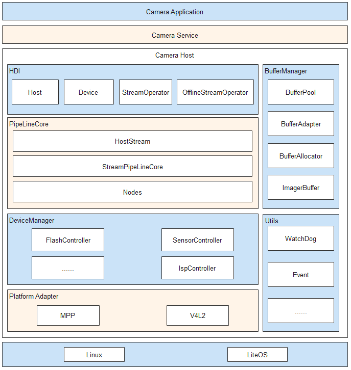

# Camera

## 概述<a name="1"></a>
### 功能简介<a name="2"></a>

OpenHarmony相机驱动框架模型对上实现相机HDI（Hardware Device Interface）接口，对下实现相机Pipeline模型，管理相机各个硬件设备。
该驱动框架模型内部分为三层，依次为HDI实现层、框架层和设备适配层。各层基本概念如下：

+ HDI实现层：实现OHOS（OpenHarmony Operation System）相机标准南向接口。
+ 框架层：对接HDI实现层的控制、流的转发，实现数据通路的搭建，管理相机各个硬件设备等功能。
+ 设备适配层：屏蔽底层芯片和OS（Operation System）差异，支持多平台适配。

### 运作机制<a name="3"></a>

Camera模块主要包含服务、设备的初始化，数据通路的搭建，流的配置、创建、下发、捕获等，具体运作机制参考以下图文解析：

**图 1**  基于HDF驱动框架的Camera驱动模型　

　　　　　　　　

1. 系统启动时创建camera_host进程。进程创建后，首先枚举底层设备，创建（也可以通过配置表创建）管理设备树的DeviceManager类及其内部各个底层设备的对象，创建对应的CameraHost类实例并且将其注册到UHDF（用户态HDF驱动框架）服务中，方便相机服务层通过UHDF服务获取底层CameraDeviceHost的服务，从而操作硬件设备。

2. Service通过CameraDeviceHost服务获取CameraHost实例，CameraHost可以获取底层的Camera能力，开启闪光灯、调用Open接口打开Camera创建连接、创建DeviceManager（负责底层硬件模块上电）、创建CameraDevice（向上提供设备控制接口）。创建CameraDevice时会实例化PipelineCore的各个子模块，其中StreamPipelineCore负责创建Pipeline，MetaQueueManager负责上报metaData。

3. Service通过CameraDevice模块配置流、创建Stream类。StreamPipelineStrategy模块通过上层下发的模式和查询配置表创建对应流的Node连接方式，StreamPipelineBuilder模块创建Node实例并且连接返回该Pipeline给StreamPipelineDispatcher。StreamPipelineDispatcher提供统一的Pipeline调用管理。

4. Service通过Stream控制整个流的操作，AttachBufferQueue接口将从显示模块申请的BufferQueue下发到底层，由CameraDeviceDriverModel自行管理buffer，当Capture接口下发命令后，底层开始向上传递buffer。Pipeline的IspNode依次从BufferQueue获取指定数量buffer，然后下发到底层ISP（Image Signal Processor，图像信号处理器）硬件，ISP填充完之后将buffer传递给CameraDeviceDriverModel，CameraDeviceDriverModel通过循环线程将buffer填充到已经创建好的Pipeline中，各个Node处理后通过回调传递给上层，同时buffer返回BufferQueue等待下一次下发。

5. Service通过Capture接口下发拍照命令。ChangeToOfflineStream接口查询拍照buffer位置，如果ISP已经出图，并且图像数据已经送到IPP node，可以将普通拍照流转换为离线流，否则直接走关闭流程。ChangeToOfflineStream接口通过传递StreamInfo使离线流获取到普通流的流信息，并且通过配置表确认离线流的具体Node连接方式，创建离线流的Node连接（如果已创建则通过CloseCamera释放非离线流所需的Node），等待buffer从底层Pipeline回传到上层再释放持有的Pipeline相关资源。

6. Service通过CameraDevice的UpdateSettings接口向下发送CaptureSetting参数，CameraDeviceDriverModel通过StreamPipelineDispatcher模块向各个Node转发，StartStreamingCapture和Capture接口携带的CaptureSetting通过StreamPipelineDispatcher模块向该流所属的Node转发。

7. Service通过EnableResult和DisableResult接口控制底层metaData的上报。如果需要底层metaData上报，pipeline会创建CameraDeviceDriverModel内部的一个Bufferqueue用来收集和传递metaData，根据StreamPipelineStrategy模块查询配置表并通过StreamPipelineBuilder创建和连接Node，MetaQueueManager下发buffer至底层，底层相关Node填充数据，MetaQueueManager模块再调用上层回调传递给上层。

8. Service调用CameraDevice的Close接口，CameraDevice调用对应的DeviceManager模块对各个硬件下电；如果此时在Ipp的SubPipeline中存在OfflineStream，则需要保留OfflineStream，直到执行完毕。

9. 动态帧率控制。在StreamOperator中起一个CollectBuffer线程，CollectBuffer线程从每一路stream的BufferQueue中获取buffer，如果某一路流的帧率需要控制（为sensor出帧帧率的1/n），可以根据需求控制每一帧的buffer打包，并决定是否collect此路流的buffer（比如sensor出帧帧率为120fps，预览流的帧率为30fps，CollectBuffer线程collect预览流的buffer时，每隔4fps collect一次）。

   

## 开发指导<a name="4"></a>


### 场景介绍<a name="5"></a>

Camera模块主要针对相机预览、拍照、视频流等场景，对这些场景下的相机操作进行封装，使开发者更易操作相机硬件，提高开发效率。

### 接口说明<a name="6"></a>

注：以下接口列举的为IDL接口描述生成的对应C++语言函数接口，接口声明见idl文件`/drivers/interface/camera/v1_1/`，获取路径为：[https://gitee.com/openharmony/drivers_interface/tree/master/camera](https://gitee.com/openharmony/drivers_interface/tree/master/camera)。
在HDI使用中下发的配置参数不能超出GetCameraAbility上报的能力范围。即使通过UpdateSettings、CommitStreams、Capture等接口可以下发超出该范围的配置参数，且接口调用不会返回失败，但设置后的行为是不确定的。
- icamera_device.h

  | 功能描述                     | 接口名称                                                     |
  | ---------------------------- | ------------------------------------------------------------ |
  | 获取流控制器                 | int32_t GetStreamOperator_V1_1(<br>const sptr\<OHOS::HDI::Camera::V1_0::IStreamOperatorCallback\>& callbackObj,<br>sptr\<OHOS::HDI::Camera::V1_1::IStreamOperator\>& streamOperator<br>) |

- icamera_host.h

  | 功能描述                       | 接口名称                                                     |
  | ------------------------------ | ------------------------------------------------------------ |
  | 打开Camera设备                 | int32_t OpenCamera_V1_1(<br>const std::string& cameraId, <br>const sptr\<OHOS::HDI::Camera::V1_0::ICameraDeviceCallback\>& callbackObj, <br>sptr\<OHOS::HDI::Camera::V1_1::ICameraDevice\>& device<br>) |
  | 预启动摄像头设备               | int32_t PreLaunch(const PrelaunchConfig& config) |

- istream_operator.h

  | 功能描述                         | 接口名称                                                     |
  | -------------------------------- | ------------------------------------------------------------ |
  | 查询是否支持添加参数对应的流     | int32_t IsStreamsSupported_V1_1(<br>OperationMode mode,<br>const std::vector<uint8_t>& modeSetting,<br>const std::vector<StreamInfo_V1_1>& infos,<br>StreamSupportType& type<br>) |
  | 创建流                           | int32_t CreateStreams_V1_1(const std::vector<StreamInfo_V1_1>& streamInfos) |


### 开发步骤<a name="7"></a>
Camera驱动的开发过程主要包含以下步骤：

1. 注册CameraHost

    定义Camera的HdfDriverEntry结构体，该结构体中定义了CameraHost初始化的方法（代码目录drivers/peripheral/camera/interfaces/hdi_ipc/camera_host_driver.cpp）。
    ```c++
   struct HdfDriverEntry g_cameraHostDriverEntry = {
       .moduleVersion = 1,
       .moduleName = "camera_service",
       .Bind = HdfCameraHostDriverBind,
       .Init = HdfCameraHostDriverInit,
       .Release = HdfCameraHostDriverRelease,
   };
   HDF_INIT(g_cameraHostDriverEntry); // 将Camera的HdfDriverEntry结构体注册到HDF上
   ```

2. 初始化Host服务

    步骤1中提到的HdfCameraHostDriverBind接口提供了CameraServiceDispatch和CameraHostStubInstance的注册。CameraServiceDispatch接口是远端调用CameraHost的方法，如OpenCamera()，SetFlashlight()等，CameraHostStubInstance接口是Camera设备的初始化，在开机时被调用。

   ```c++
   static int HdfCameraHostDriverBind(struct HdfDeviceObject *deviceObject)
   {
       HDF_LOGI("HdfCameraHostDriverBind enter");
    
       auto *hdfCameraHostHost = new (std::nothrow) HdfCameraHostHost;
       if (hdfCameraHostHost == nullptr) {
           HDF_LOGE("%{public}s: failed to create HdfCameraHostHost object", __func__);
           return HDF_FAILURE;
       }
    
       hdfCameraHostHost->ioService.Dispatch = CameraHostDriverDispatch; // 提供远端CameraHost调用方法
       hdfCameraHostHost->ioService.Open = NULL;
       hdfCameraHostHost->ioService.Release = NULL;
    
       auto serviceImpl = ICameraHost::Get(true);
       if (serviceImpl == nullptr) {
           HDF_LOGE("%{public}s: failed to get of implement service", __func__);
           delete hdfCameraHostHost;
           return HDF_FAILURE;
       }
    
       hdfCameraHostHost->stub = OHOS::HDI::ObjectCollector::GetInstance().GetOrNewObject(serviceImpl,
           ICameraHost::GetDescriptor()); // 初始化Camera设备
       if (hdfCameraHostHost->stub == nullptr) {
           HDF_LOGE("%{public}s: failed to get stub object", __func__);
           delete hdfCameraHostHost;
           return HDF_FAILURE;
       }
    
       deviceObject->service = &hdfCameraHostHost->ioService;
       return HDF_SUCCESS;
   }
   ```

   下面的函数是远端CameraHost调用的方法：

   ```c++
   int32_t CameraHostStub::CameraHostServiceStubOnRemoteRequest(int cmdId, MessageParcel &data,
       MessageParcel &reply, MessageOption &option)
   {
       switch(cmdId) {
           case CMD_CAMERA_HOST_SET_CALLBACK: {
               return CameraHostStubSetCallback(data, reply, option);
           }
           case CMD_CAMERA_HOST_GET_CAMERAID: {
               return CameraHostStubGetCameraIds(data, reply, option);
           }
           case CMD_CAMERA_HOST_GET_CAMERA_ABILITY: {
               return CameraHostStubGetCameraAbility(data, reply, option);
           }
           case CMD_CAMERA_HOST_OPEN_CAMERA: {
               return CameraHostStubOpenCamera(data, reply, option);
           }
           case CMD_CAMERA_HOST_SET_FLASH_LIGHT: {
               return CameraHostStubSetFlashlight(data, reply, option);
           }
           default: {
               HDF_LOGE("%s: not support cmd %d", __func__, cmdId);
               return HDF_ERR_INVALID_PARAM;
           }
       }
       return HDF_SUCCESS;
   }
   ```

   CameraHostStubInstance()接口最终调用CameraHostImpl::Init()方法，该方法会获取物理Camera，并对DeviceManager和PipelineCore进行初始化。

3. 获取Host服务

   调用Get()接口从远端CameraService中获取CameraHost对象。get()方法如下：

   ```c++
   sptr<ICameraHost> ICameraHost::Get(const char *serviceName)
   {
       do {
           using namespace OHOS::HDI::ServiceManager::V1_0;
           auto servMgr = IServiceManager::Get();
           if (servMgr == nullptr) {
               HDF_LOGE("%s: IServiceManager failed!", __func__);
               break;
           }
           auto remote = servMgr->GetService(serviceName);  // 根据serviceName名称获取CameraHost
           if (remote != nullptr) {
               sptr<CameraHostProxy> hostSptr = iface_cast<CameraHostProxy>(remote); // 将CameraHostProxy对象返回给调用者，该对象中包含OpenCamera()等方法。
               return hostSptr;
           }
           HDF_LOGE("%s: GetService failed! serviceName = %s", __func__, serviceName);
       } while(false);
       HDF_LOGE("%s: get %s failed!", __func__, serviceName);
       return nullptr;
   }
   ```

4. 打开设备

   CameraHostProxy对象中有五个方法，分别是SetCallback、GetCameraIds、GetCameraAbility、OpenCamera和SetFlashlight。下面着重描述OpenCamera接口。
   CameraHostProxy的OpenCamera()接口通过CMD_CAMERA_HOST_OPEN_CAMERA调用远端CameraHostStubOpenCamera()接口并获取ICameraDevice对象。

   ```c++
   int32_t CameraHostProxy::OpenCamera(const std::string& cameraId, const sptr<ICameraDeviceCallback>& callbackObj,
       sptr<ICameraDevice>& device)
   {
       MessageParcel cameraHostData;
       MessageParcel cameraHostReply;
       MessageOption cameraHostOption(MessageOption::TF_SYNC);
    
       if (!cameraHostData.WriteInterfaceToken(ICameraHost::GetDescriptor())) {
           HDF_LOGE("%{public}s: failed to write interface descriptor!", __func__);
           return HDF_ERR_INVALID_PARAM;
       }
    
       if (!cameraHostData.WriteCString(cameraId.c_str())) {
           HDF_LOGE("%{public}s: write cameraId failed!", __func__);
           return HDF_ERR_INVALID_PARAM;
       }
    
       if (!cameraHostData.WriteRemoteObject(OHOS::HDI::ObjectCollector::GetInstance().GetOrNewObject(callbackObj, 
           ICameraDeviceCallback::GetDescriptor()))) {
           HDF_LOGE("%{public}s: write callbackObj failed!", __func__);
           return HDF_ERR_INVALID_PARAM;
       }
    
       int32_t cameraHostRet = Remote()->SendRequest(CMD_CAMERA_HOST_OPEN_CAMERA, cameraHostData, cameraHostReply, cameraHostOption);
       if (cameraHostRet != HDF_SUCCESS) {
           HDF_LOGE("%{public}s failed, error code is %{public}d", __func__, cameraHostRet);
           return cameraHostRet;
       }
    
       device = hdi_facecast<ICameraDevice>(cameraHostReply.ReadRemoteObject());
    
       return cameraHostRet;
   }
   ```

   Remote()->SendRequest调用上文提到的CameraHostServiceStubOnRemoteRequest()，根据cmdId进入CameraHostStubOpenCamera()接口，最终调用CameraHostImpl::OpenCamera()，该接口获取了CameraDevice并对硬件进行上电等操作。

   ```c++
   int32_t CameraHostImpl::OpenCamera(const std::string& cameraId, const sptr<ICameraDeviceCallback>& callbackObj,
       sptr<ICameraDevice>& device)
   {
       CAMERA_LOGD("OpenCamera entry");
       DFX_LOCAL_HITRACE_BEGIN;
       if (CameraIdInvalid(cameraId) != RC_OK || callbackObj == nullptr) {
           CAMERA_LOGW("open camera id is empty or callback is null.");
           return INVALID_ARGUMENT;
       }
    
       auto itr = cameraDeviceMap_.find(cameraId);
       if (itr == cameraDeviceMap_.end()) {
           CAMERA_LOGE("camera device not found.");
           return INSUFFICIENT_RESOURCES;
       }
       CAMERA_LOGD("OpenCamera cameraId find success.");
    
       std::shared_ptr<CameraDeviceImpl> cameraDevice = itr->second;
       if (cameraDevice == nullptr) {
           CAMERA_LOGE("camera device is null.");
           return INSUFFICIENT_RESOURCES;
       }
    
       CamRetCode ret = cameraDevice->SetCallback(callbackObj);
       CHECK_IF_NOT_EQUAL_RETURN_VALUE(ret, HDI::Camera::V1_0::NO_ERROR, ret);
    
       CameraHostConfig *config = CameraHostConfig::GetInstance();
       CHECK_IF_PTR_NULL_RETURN_VALUE(config, INVALID_ARGUMENT);
    
       std::vector<std::string> phyCameraIds;
       RetCode rc = config->GetPhysicCameraIds(cameraId, phyCameraIds);
       if (rc != RC_OK) {
           CAMERA_LOGE("get physic cameraId failed.");
           return DEVICE_ERROR;
       }
       if (CameraPowerUp(cameraId, phyCameraIds) != RC_OK) { // 对Camera硬件上电
           CAMERA_LOGE("camera powerup failed.");
           CameraPowerDown(phyCameraIds);
           return DEVICE_ERROR;
       }
    
       auto sptrDevice = deviceBackup_.find(cameraId);
       if (sptrDevice == deviceBackup_.end()) {
   #ifdef CAMERA_BUILT_ON_OHOS_LITE
           deviceBackup_[cameraId] = cameraDevice;
   #else
           deviceBackup_[cameraId] = cameraDevice.get();
   #endif
       }
       device = deviceBackup_[cameraId];
       cameraDevice->SetStatus(true);
       CAMERA_LOGD("open camera success.");
       DFX_LOCAL_HITRACE_END;
       return HDI::Camera::V1_0::NO_ERROR;
   }
   ```

5. 获取流

   CameraDeviceImpl定义了GetStreamOperator、UpdateSettings、SetResultMode和GetEnabledResult等方法，获取流操作方法如下：

   ```c++
   int32_t CameraDeviceImpl::GetStreamOperator(const sptr<IStreamOperatorCallback>& callbackObj,
       sptr<IStreamOperator>& streamOperator)
   {
       HDI_DEVICE_PLACE_A_WATCHDOG;
       DFX_LOCAL_HITRACE_BEGIN;
       if (callbackObj == nullptr) {
           CAMERA_LOGW("input callback is null.");
           return INVALID_ARGUMENT;
       }
    
       spCameraDeciceCallback_ = callbackObj;
       if (spStreamOperator_ == nullptr) {
   #ifdef CAMERA_BUILT_ON_OHOS_LITE
           // 这里创建一个spStreamOperator_ 对象传递给调用者，以便对stream进行各种操作
           spStreamOperator_ = std::make_shared<StreamOperator>(spCameraDeciceCallback_, shared_from_this());
   #else
           spStreamOperator_ = new(std::nothrow) StreamOperator(spCameraDeciceCallback_, shared_from_this());
   #endif
           if (spStreamOperator_ == nullptr) {
               CAMERA_LOGW("create stream operator failed.");
               return DEVICE_ERROR;
           }
           spStreamOperator_->Init();
           ismOperator_ = spStreamOperator_;
       }
       streamOperator = ismOperator_;
   #ifndef CAMERA_BUILT_ON_OHOS_LITE
       CAMERA_LOGI("CameraDeviceImpl %{public}s: line: %{public}d", __FUNCTION__, __LINE__);
       pipelineCore_->GetStreamPipelineCore()->SetCallback(
           [this](const std::shared_ptr<CameraMetadata> &metadata) {
           OnMetadataChanged(metadata);
       });
   #endif
       DFX_LOCAL_HITRACE_END;
       return HDI::Camera::V1_0::NO_ERROR;
   }
   ```

6. 创建流

   调用CreateStreams创建流前需要填充StreamInfo结构体，具体内容如下：

   ```c++
   using StreamInfo = struct _StreamInfo {
       int streamId_; 
       int width_;  // 数据流宽
       int height_; // 数据流高
       int format_; // 数据流格式，如PIXEL_FMT_YCRCB_420_SP
       int dataSpace_; 
       StreamIntent intent_; // StreamIntent 如PREVIEW
       bool tunneledMode_;
       BufferProducerSequenceable bufferQueue_; // 数据流bufferQueue可用streamCustomer->CreateProducer()接口创建
       int minFrameDuration_;
       EncodeType encodeType_;
   };
   ```

   CreateStreams()接口是StreamOperator（StreamOperatorImpl类是StreamOperator的基类）类中的方法，该接口的主要作用是创建一个StreamBase对象，通过StreamBase的Init方法初始化CreateBufferPool等操作。

   ```c++
   int32_t StreamOperator::CreateStreams(const std::vector<StreamInfo>& streamInfos)
   {
       PLACE_A_NOKILL_WATCHDOG(requestTimeoutCB_);
       DFX_LOCAL_HITRACE_BEGIN;
       for (const auto& it : streamInfos) {
           CHECK_IF_NOT_EQUAL_RETURN_VALUE(CheckStreamInfo(it), true, INVALID_ARGUMENT);
           CAMERA_LOGI("streamId:%{public}d and format:%{public}d and width:%{public}d and height:%{public}d",
               it.streamId_, it.format_, it.width_, it.height_);
           if (streamMap_.count(it.streamId_) > 0) {
               CAMERA_LOGE("stream [id = %{public}d] has already been created.", it.streamId_);
               return INVALID_ARGUMENT;
           }
           std::shared_ptr<IStream> stream = StreamFactory::Instance().CreateShared( // 创建Stream实例
               IStream::g_availableStreamType[it.intent_], it.streamId_, it.intent_, pipelineCore_, messenger_);
           if (stream == nullptr) {
               CAMERA_LOGE("create stream [id = %{public}d] failed.", it.streamId_);
               return INSUFFICIENT_RESOURCES;
           }
           StreamConfiguration scg;
           StreamInfoToStreamConfiguration(scg, it);
           RetCode rc = stream->ConfigStream(scg);
           if (rc != RC_OK) {
               CAMERA_LOGE("configure stream %{public}d failed", it.streamId_);
               return INVALID_ARGUMENT;
           }
           if (!scg.tunnelMode && (it.bufferQueue_)->producer_ != nullptr) {
               CAMERA_LOGE("stream [id:%{public}d] is not tunnel mode, can't bind a buffer producer", it.streamId_);
               return INVALID_ARGUMENT;
           }
           if ((it.bufferQueue_)->producer_ != nullptr) {
               auto tunnel = std::make_shared<StreamTunnel>();
               CHECK_IF_PTR_NULL_RETURN_VALUE(tunnel, INSUFFICIENT_RESOURCES);
               rc = tunnel->AttachBufferQueue((it.bufferQueue_)->producer_);
               CHECK_IF_NOT_EQUAL_RETURN_VALUE(rc, RC_OK, INVALID_ARGUMENT);
               if (stream->AttachStreamTunnel(tunnel) != RC_OK) {
                   CAMERA_LOGE("attach buffer queue to stream [id = %{public}d] failed", it.streamId_);
                   return INVALID_ARGUMENT;
               }
           }
           {
               std::lock_guard<std::mutex> l(streamLock_);
               streamMap_[stream->GetStreamId()] = stream;
           }
           CAMERA_LOGI("create stream success [id:%{public}d] [type:%{public}s]", stream->GetStreamId(),
                       IStream::g_availableStreamType[it.intent_].c_str());
       }
       DFX_LOCAL_HITRACE_END;
       return HDI::Camera::V1_0::NO_ERROR;
    }
   ```

7. 配置流

   CommitStreams()是配置流的接口，必须在创建流之后调用，其主要作用是初始化Pipeline和创建Pipeline。

   ```c++
   int32_t StreamOperator::CommitStreams(OperationMode mode, const std::vector<uint8_t>& modeSetting)
   {
       CAMERA_LOGV("enter");
       CHECK_IF_PTR_NULL_RETURN_VALUE(streamPipeline_, DEVICE_ERROR);
       PLACE_A_NOKILL_WATCHDOG(requestTimeoutCB_);
       if (modeSetting.empty()) {
           CAMERA_LOGE("input vector is empty");
           return INVALID_ARGUMENT;
       }
       DFX_LOCAL_HITRACE_BEGIN;
   
       std::vector<StreamConfiguration> configs = {};
       {
           std::lock_guard<std::mutex> l(streamLock_);
           std::transform(streamMap_.begin(), streamMap_.end(), std::back_inserter(configs),
               [](auto &iter) { return iter.second->GetStreamAttribute(); });
       }
    
       std::shared_ptr<CameraMetadata> setting;
       MetadataUtils::ConvertVecToMetadata(modeSetting, setting);
       DynamicStreamSwitchMode method = streamPipeline_->CheckStreamsSupported(mode, setting, configs);
       if (method == DYNAMIC_STREAM_SWITCH_NOT_SUPPORT) {
           return INVALID_ARGUMENT;
       }
       if (method == DYNAMIC_STREAM_SWITCH_NEED_INNER_RESTART) {
           std::lock_guard<std::mutex> l(streamLock_);
           for (auto it : streamMap_) {
               it.second->StopStream();
           }
       }
       {
           std::lock_guard<std::mutex> l(streamLock_);
           for (auto it : streamMap_) {
               if (it.second->CommitStream() != RC_OK) {
                   CAMERA_LOGE("commit stream [id = %{public}d] failed.", it.first);
                   return DEVICE_ERROR;
               }
           }
       }
       RetCode rc = streamPipeline_->PreConfig(setting); // 设备流配置
       if (rc != RC_OK) {
           CAMERA_LOGE("prepare mode settings failed");
           return DEVICE_ERROR;
       }
       rc = streamPipeline_->CreatePipeline(mode); // 创建一个pipeline
       if (rc != RC_OK) {
           CAMERA_LOGE("create pipeline failed.");
           return INVALID_ARGUMENT;
       }
    
       DFX_LOCAL_HITRACE_END;
       return HDI::Camera::V1_0::NO_ERROR;
   }
   ```

8. 捕获图像

   在调用Capture()接口前需要先填充CaptureInfo结构体，具体内容如下：

   ```c++
   using CaptureInfo = struct _CaptureInfo {
       int[] streamIds_; // 需要Capture的streamIds
       unsigned char[]  captureSetting_; // 这里填充camera ability 可通过CameraHost 的GetCameraAbility()接口获取
       bool enableShutterCallback_;
   };
   ```

   StreamOperator中的Capture方法主要是捕获数据流：

   ```c++
   int32_t StreamOperator::Capture(int32_t captureId, const CaptureInfo& info, bool isStreaming)
   {
       CHECK_IF_EQUAL_RETURN_VALUE(captureId < 0, true, INVALID_ARGUMENT);
       PLACE_A_NOKILL_WATCHDOG(requestTimeoutCB_);
       DFX_LOCAL_HITRACE_BEGIN;
    
       for (auto id : info.streamIds_) {
           std::lock_guard<std::mutex> l(streamLock_);
           auto it = streamMap_.find(id);
           if (it == streamMap_.end()) {
               return INVALID_ARGUMENT;
           }
       }
    
       {
           std::lock_guard<std::mutex> l(requestLock_);
           auto itr = requestMap_.find(captureId);
           if (itr != requestMap_.end()) {
               return INVALID_ARGUMENT;
           }
       }
    
       std::shared_ptr<CameraMetadata> captureSetting;
       MetadataUtils::ConvertVecToMetadata(info.captureSetting_, captureSetting);
       CaptureSetting setting = captureSetting;
       auto request =
           std::make_shared<CaptureRequest>(captureId, info.streamIds_.size(), setting,
                                             info.enableShutterCallback_, isStreaming);
       for (auto id : info.streamIds_) {
           RetCode rc = streamMap_[id]->AddRequest(request);
           if (rc != RC_OK) {
               return DEVICE_ERROR;
           }
       }
    
       {
           std::lock_guard<std::mutex> l(requestLock_);
           requestMap_[captureId] = request;
       }
       return HDI::Camera::V1_0::NO_ERROR;
   }  
   ```

9. 取消捕获和释放离线流

   StreamOperator类中的CancelCapture()接口的主要作用是根据captureId取消数据流的捕获。

   ```c++
   int32_t StreamOperator::CancelCapture(int32_t captureId)
   {
       CHECK_IF_EQUAL_RETURN_VALUE(captureId < 0, true, INVALID_ARGUMENT);
       PLACE_A_NOKILL_WATCHDOG(requestTimeoutCB_);
       DFX_LOCAL_HITRACE_BEGIN;
    
       std::lock_guard<std::mutex> l(requestLock_);
       auto itr = requestMap_.find(captureId); // 根据captureId 在Map中查找对应的CameraCapture对象
       if (itr == requestMap_.end()) {
           CAMERA_LOGE("can't cancel capture [id = %{public}d], this capture doesn't exist", captureId);
           return INVALID_ARGUMENT;
       }
    
       RetCode rc = itr->second->Cancel(); // 调用CameraCapture中Cancel方法结束数据捕获
       if (rc != RC_OK) {
           return DEVICE_ERROR;
       }
       requestMap_.erase(itr); // 擦除该CameraCapture对象
    
       DFX_LOCAL_HITRACE_END;
       return HDI::Camera::V1_0::NO_ERROR;
   }
   ```

   StreamOperator类中的ReleaseStreams接口的主要作用是释放之前通过CreateStream()和CommitStreams()接口创建的流，并销毁Pipeline。

   ```c++
   int32_t StreamOperator::ReleaseStreams(const std::vector<int32_t>& streamIds)
   {
       PLACE_A_NOKILL_WATCHDOG(requestTimeoutCB_);
       DFX_LOCAL_HITRACE_BEGIN;
       for (auto id : streamIds) {
           std::lock_guard<std::mutex> l(streamLock_);
           auto it = streamMap_.find(id);
           if (it == streamMap_.end()) {
               continue;
           }
           if (it->second->IsRunning()) {
               it->second->StopStream();
           }
           it->second->DumpStatsInfo();
           streamMap_.erase(it);
       }
    
       for (auto id : streamIds) {
           CHECK_IF_EQUAL_RETURN_VALUE(id < 0, true, INVALID_ARGUMENT);
       }
    
       DFX_LOCAL_HITRACE_END;
       return HDI::Camera::V1_0::NO_ERROR;
   }
   ```

10. 关闭Camera设备
    
    调用CameraDeviceImpl中的Close()来关闭CameraDevice，该接口调用deviceManager中的PowerDown()来给设备下电。     

### 开发实例<a name = "8"></a>

在/drivers/peripheral/camera/test/demo目录下有一个关于Camera的demo，开机后会在/vendor/bin下生成可执行文件ohos_camera_demo，该demo可以完成Camera的预览，拍照等基础功能。下面我们就以此demo为例讲述怎样用HDI接口去编写预览PreviewOn()和拍照CaptureON()的用例，可参考[ohos_camera_demo](https://gitee.com/openharmony/drivers_peripheral/tree/master/camera/test/demo)。

1. 在main函数中构造一个CameraDemo 对象，该对象中有对Camera初始化、启停流、释放等控制的方法。下面mainDemo->InitSensors()函数为初始化CameraHost，mainDemo->InitCameraDevice()函数为初始化CameraDevice。

   ```c++
   int main(int argc, char** argv)
   {
       RetCode rc = RC_OK;
       auto mainDemo = std::make_shared<CameraDemo>();
       rc = mainDemo->InitSensors(); // 初始化CameraHost
       if (rc == RC_ERROR) {
           CAMERA_LOGE("main test: mainDemo->InitSensors() error\n");
           return -1;
       }
   
       rc = mainDemo->InitCameraDevice(); // 初始化CameraDevice
       if (rc == RC_ERROR) {
           CAMERA_LOGE("main test: mainDemo->InitCameraDevice() error\n");
           return -1;
       }
   
       rc = PreviewOn(0, mainDemo); // 配流和启流
       if (rc != RC_OK) {
           CAMERA_LOGE("main test: PreviewOn() error demo exit");
           return -1;
       }
   
       ManuList(mainDemo, argc, argv); // 打印菜单到控制台
   
       return RC_OK;
   }
   ```

   初始化CameraHost函数实现如下，这里调用了HDI接口ICameraHost::Get()去获取demoCameraHost，并对其设置回调函数。

   ```c++
   RetCode OhosCameraDemo::InitSensors()
   {
       int rc = 0;
   
       CAMERA_LOGD("demo test: InitSensors enter");
    
       if (demoCameraHost_ != nullptr) {
           return RC_OK;
       }
   #ifdef CAMERA_BUILT_ON_OHOS_LITE
       demoCameraHost_ = OHOS::Camera::CameraHost::CreateCameraHost();
   #else
       constexpr const char *DEMO_SERVICE_NAME = "camera_service";
       demoCameraHost_ = ICameraHost::Get(DEMO_SERVICE_NAME, false);
   #endif
       if (demoCameraHost_ == nullptr) {
           CAMERA_LOGE("demo test: ICameraHost::Get error");
           return RC_ERROR;
       }
    
   #ifdef CAMERA_BUILT_ON_OHOS_LITE
       hostCallback_ = std::make_shared<DemoCameraHostCallback>();
   #else
       hostCallback_ = new DemoCameraHostCallback();
   #endif
       rc = demoCameraHost_->SetCallback(hostCallback_);
       if (rc != HDI::Camera::V1_0::NO_ERROR) {
           CAMERA_LOGE("demo test: demoCameraHost_->SetCallback(hostCallback_) error");
           return RC_ERROR;
       }
    
       CAMERA_LOGD("demo test: InitSensors exit");
    
       return RC_OK;
   }
   ```

   初始化CameraDevice函数实现如下，这里调用了GetCameraIds(cameraIds_)，GetCameraAbility(cameraId, ability_)，OpenCamera(cameraIds_.front(), callback, demoCameraDevice_)等接口实现了demoCameraHost的获取。

   ```c++
   RetCode OhosCameraDemo::InitCameraDevice()
   {
       int rc = 0;
    
       CAMERA_LOGD("demo test: InitCameraDevice enter");
    
       if (demoCameraHost_ == nullptr) {
           CAMERA_LOGE("demo test: InitCameraDevice demoCameraHost_ == nullptr");
           return RC_ERROR;
       }
    
       (void)demoCameraHost_->GetCameraIds(cameraIds_);
       if (cameraIds_.empty()) {
           return RC_ERROR;
       }
       const std::string cameraId = cameraIds_.front();
       demoCameraHost_->GetCameraAbility(cameraId, cameraAbility_);
    
       MetadataUtils::ConvertVecToMetadata(cameraAbility_, ability_);
    
       GetFaceDetectMode(ability_);
       GetFocalLength(ability_);
       GetAvailableFocusModes(ability_);
       GetAvailableExposureModes(ability_);
       GetExposureCompensationRange(ability_);
       GetExposureCompensationSteps(ability_);
       GetAvailableMeterModes(ability_);
       GetAvailableFlashModes(ability_);
       GetMirrorSupported(ability_);
       GetStreamBasicConfigurations(ability_);
       GetFpsRange(ability_);
       GetCameraPosition(ability_);
       GetCameraType(ability_);
       GetCameraConnectionType(ability_);
       GetFaceDetectMaxNum(ability_);
    
   #ifdef CAMERA_BUILT_ON_OHOS_LITE
       std::shared_ptr<CameraDeviceCallback> callback = std::make_shared<CameraDeviceCallback>();
   #else
       sptr<DemoCameraDeviceCallback> callback = new DemoCameraDeviceCallback();
   #endif
       rc = demoCameraHost_->OpenCamera(cameraIds_.front(), callback, demoCameraDevice_);
       if (rc != HDI::Camera::V1_0::NO_ERROR || demoCameraDevice_ == nullptr) {
           CAMERA_LOGE("demo test: InitCameraDevice OpenCamera failed");
           return RC_ERROR;
       }
    
       CAMERA_LOGD("demo test: InitCameraDevice exit");
    
       return RC_OK;
   }   
   ```

2. PreviewOn()接口包含配置流、开启预览流和启动Capture动作。该接口执行完成后Camera预览通路已经开始运转并开启了两路流，一路流是preview，另外一路流是capture或者video，两路流中仅对preview流进行capture动作。

   ```c++
   static RetCode PreviewOn(int mode, const std::shared_ptr<OhosCameraDemo>& mainDemo)
   {
       RetCode rc = RC_OK;
       CAMERA_LOGD("main test: PreviewOn enter");
    
       rc = mainDemo->StartPreviewStream(); // 配置preview流
       if (rc != RC_OK) {
           CAMERA_LOGE("main test: PreviewOn StartPreviewStream error");
           return RC_ERROR;
       }
    
       if (mode == 0) {
           rc = mainDemo->StartCaptureStream(); // 配置capture流
           if (rc != RC_OK) {
               CAMERA_LOGE("main test: PreviewOn StartCaptureStream error");
               return RC_ERROR;
           }
       } else {
           rc = mainDemo->StartVideoStream(); // 配置video流
           if (rc != RC_OK) {
               CAMERA_LOGE("main test: PreviewOn StartVideoStream error");
               return RC_ERROR;
           }
       }
    
       rc = mainDemo->CaptureON(STREAM_ID_PREVIEW, CAPTURE_ID_PREVIEW, CAPTURE_PREVIEW);
       if (rc != RC_OK) {
           CAMERA_LOGE("main test: PreviewOn mainDemo->CaptureON() preview error");
           return RC_ERROR;
       }
    
       CAMERA_LOGD("main test: PreviewOn exit");
       return RC_OK;
   }           
   ```

   StartCaptureStream()、StartVideoStream()和StartPreviewStream()接口都会调用CreateStream()接口，只是传入的参数不同。

   CreateStream()方法调用HDI接口去配置和创建流，首先调用HDI接口去获取StreamOperation对象，然后创建一个StreamInfo。调用CreateStreams()和CommitStreams()实际创建流并配置流。

   ```c++
   RetCode OhosCameraDemo::CreateStream(const int streamId, std::shared_ptr<StreamCustomer> &streamCustomer,
       StreamIntent intent)
   {
       int rc = 0;
       CAMERA_LOGD("demo test: CreateStream enter");
    
       GetStreamOpt(); // 获取StreamOperator对象
       if (streamOperator_ == nullptr) {
           CAMERA_LOGE("demo test: CreateStream GetStreamOpt() is nullptr\n");
           return RC_ERROR;
       }
    
       StreamInfo streamInfo = {0};
    
       SetStreamInfo(streamInfo, streamCustomer, streamId, intent); // 填充StreamInfo流
       if (streamInfo.bufferQueue_->producer_ == nullptr) {
           CAMERA_LOGE("demo test: CreateStream CreateProducer(); is nullptr\n");
           return RC_ERROR;
       }
    
       std::vector<StreamInfo> streamInfos;
       streamInfos.push_back(streamInfo);
    
       rc = streamOperator_->CreateStreams(streamInfos); // 创建流
       if (rc != HDI::Camera::V1_0::NO_ERROR) {
           CAMERA_LOGE("demo test: CreateStream CreateStreams error\n");
           return RC_ERROR;
       }

       rc = streamOperator_->CommitStreams(NORMAL, cameraAbility_);
       if (rc != HDI::Camera::V1_0::NO_ERROR) {
           CAMERA_LOGE("demo test: CreateStream CommitStreams error\n");
           std::vector<int> streamIds;
           streamIds.push_back(streamId);
           streamOperator_->ReleaseStreams(streamIds);
           return RC_ERROR;
       }

       CAMERA_LOGD("demo test: CreateStream exit");
    
       return RC_OK;
   }
   ```

   CaptureON()接口调用streamOperator的Capture()方法获取Camera数据并轮转buffer，拉起一个线程接收相应类型的数据。

   ```c++
   RetCode OhosCameraDemo::CaptureON(const int streamId,
       const int captureId, CaptureMode mode)
   {
       CAMERA_LOGI("demo test: CaptureON enter streamId == %{public}d and captureId == %{public}d and mode == %{public}d",
           streamId, captureId, mode);
       std::lock_guard<std::mutex> l(metaDatalock_);
       if (mode == CAPTURE_SNAPSHOT) {
           constexpr double latitude = 27.987500; // dummy data: Qomolangma latitde
           constexpr double longitude = 86.927500; // dummy data: Qomolangma longituude
           constexpr double altitude = 8848.86; // dummy data: Qomolangma altitude
           constexpr size_t entryCapacity = 100;
           constexpr size_t dataCapacity = 2000;
           captureSetting_ = std::make_shared<CameraSetting>(entryCapacity, dataCapacity);
           captureQuality_ = OHOS_CAMERA_JPEG_LEVEL_HIGH;
           captureOrientation_ = OHOS_CAMERA_JPEG_ROTATION_270;
           mirrorSwitch_ = OHOS_CAMERA_MIRROR_ON;
           gps_.push_back(latitude);
           gps_.push_back(longitude);
           gps_.push_back(altitude);
           captureSetting_->addEntry(OHOS_JPEG_QUALITY, static_cast<void*>(&captureQuality_),
               sizeof(captureQuality_));
           captureSetting_->addEntry(OHOS_JPEG_ORIENTATION, static_cast<void*>(&captureOrientation_),
               sizeof(captureOrientation_));
           captureSetting_->addEntry(OHOS_CONTROL_CAPTURE_MIRROR, static_cast<void*>(&mirrorSwitch_),
               sizeof(mirrorSwitch_));
           captureSetting_->addEntry(OHOS_JPEG_GPS_COORDINATES, gps_.data(), gps_.size());
       }
    
       std::vector<uint8_t> setting;
       MetadataUtils::ConvertMetadataToVec(captureSetting_, setting);
       captureInfo_.streamIds_ = {streamId};
       if (mode == CAPTURE_SNAPSHOT) {
           captureInfo_.captureSetting_ = setting;
       } else {
           captureInfo_.captureSetting_ = cameraAbility_;
       }
       captureInfo_.enableShutterCallback_ = false;
    
       int rc = streamOperator_->Capture(captureId, captureInfo_, true); // 实际capture开始，buffer轮转开始
       if (rc != HDI::Camera::V1_0::NO_ERROR) {
           CAMERA_LOGE("demo test: CaptureStart Capture error\n");
           streamOperator_->ReleaseStreams(captureInfo_.streamIds_);
           return RC_ERROR;
       }
    
       if (mode == CAPTURE_PREVIEW) {
           streamCustomerPreview_->ReceiveFrameOn(nullptr); // 创建预览线程接收传递上来的buffer
       } else if (mode == CAPTURE_SNAPSHOT) {
           streamCustomerCapture_->ReceiveFrameOn([this](void* addr, const uint32_t size) { // 创建capture线程通过StoreImage回调接收传递上来的buffer
               StoreImage(addr, size);
           });
       } else if (mode == CAPTURE_VIDEO) {
           OpenVideoFile();
    
           streamCustomerVideo_->ReceiveFrameOn([this](void* addr, const uint32_t size) { // 创建video线程通过StoreImage回调接收传递上来的buffer
               StoreVideo(addr, size);
           });
       }
       CAMERA_LOGD("demo test: CaptureON exit");
    
       return RC_OK;
   }
   ```

3. ManuList()函数从控制台通过fgets()接口获取字符，不同字符所对应demo支持的功能不同，并打印出该demo所支持功能的菜单。

   ```c++
   static void ManuList(const std::shared_ptr<OhosCameraDemo>& mainDemo,
       const int argc, char** argv)
   {
       int idx, c;
       bool isAwb = true;
       const char *shortOptions = "h:cwvaeqof:";
       c = getopt_long(argc, argv, shortOptions, LONG_OPTIONS, &idx);
       while (1) {
           switch (c) {
               case 'h':
                   c = PutMenuAndGetChr(); // 打印菜单
                   break;
               case 'f':
                   FlashLightTest(mainDemo); // 手电筒功能测试
                   c = PutMenuAndGetChr();
                   break;
               case 'o':
                   OfflineTest(mainDemo); // Offline功能测试
                   c = PutMenuAndGetChr();
                   break;
               case 'c':
                   CaptureTest(mainDemo); // Capture功能测试
                   c = PutMenuAndGetChr();
                   break;
               case 'w': // AWB功能测试
                   if (isAwb) {
                       mainDemo->SetAwbMode(OHOS_CAMERA_AWB_MODE_INCANDESCENT);
                   } else {
                       mainDemo->SetAwbMode(OHOS_CAMERA_AWB_MODE_OFF);
                   }
                   isAwb = !isAwb;
                   c = PutMenuAndGetChr();
                   break;
               case 'a': // AE功能测试
                   mainDemo->SetAeExpo();
                   c = PutMenuAndGetChr();
                   break;
               case 'e': // Metadata测试
                   mainDemo->SetMetadata();
                   c = PutMenuAndGetChr();
                   break;
               case 'v': // VIDEO功能测试
                   VideoTest(mainDemo);
                   c = PutMenuAndGetChr();
                   break;
               case 'q': // 退出demo
                   PreviewOff(mainDemo);
                   mainDemo->QuitDemo();
                   return;
               default:
                   CAMERA_LOGE("main test: command error please retry input command");
                   c = PutMenuAndGetChr();
                   break;
           }
       }
   }
   ```

   PutMenuAndGetChr()接口打印了demo程序的菜单，并调用fgets()等待从控制台输入命令，内容如下：

   ```c++
   static int PutMenuAndGetChr(void)
   {
       constexpr uint32_t inputCount = 50;
       int c = 0;
       char strs[inputCount];
       Usage(stdout);
       CAMERA_LOGD("pls input command(input -q exit this app)\n");
       fgets(strs, inputCount, stdin);
   
       for (int i = 0; i < inputCount; i++) {
           if (strs[i] != '-') {
               c = strs[i];
               break;
           }
       }
       return c;
   }
   ```

   控制台输出菜单详情如下：

   ```c++
   "Options:\n"
   "-h | --help          Print this message\n"
   "-o | --offline       stream offline test\n"
   "-c | --capture       capture one picture\n"
   "-w | --set WB        Set white balance Cloudy\n"
   "-v | --video         capture Video of 10s\n"
   "-a | --Set AE        Set Auto exposure\n"
   "-e | --Set Metadeta  Set Metadata\n"
   "-f | --Set Flashlight        Set flashlight ON 5s OFF\n"
   "-q | --quit          stop preview and quit this app\n");
   ```

4. 编译用例         
   在drivers/peripheral/camera/BUILD.gn文件中的deps中添加“init:ohos_camera_demo”，示例代码如下：
   ```
   deps = [
       "vdi_base/common/buffer_manager:camera_buffer_manager",
       "vdi_base/common/device_manager:camera_device_manager",
       "vdi_base/common/hdi_impl:camera_host_service_1.0",
       "vdi_base/common/pipeline_core:camera_pipeline_core",
       "vdi_base/common/utils:camera_utils",
       "test/common:ohos_camera_demo",
       ]
   ```

   以RK3568为例：        
   1. 执行全量编译命令./build.sh --product-name rk3568 --ccache，生成可执行二进制文件ohos_camera_demo，路径为：out/rk3568/packages/phone/vendor/bin/。        
   2. 将可执行文件ohos_camera_demo导入开发板，修改权限直接运行即可。

## 参考<a name="4"></a>

### HCS配置文件说明

针对Camera模块0penHarmony提供了默认的HCS配置。开发者若有特殊需求可自行修改相关的HCS配置文件。Camera模块HCS配置文件路径：`/vendor/hihope/rk3568/hdf_config/uhdf/camera`，其中：

-  `./hdi_impl/camera_host_config.hcs` 相机静态能力:包括镜头位置、镜头类型、连接类型、支持的曝光模式等，需要根据产品的具体规格来配置
-  `./pipeline_core/config.hcs` 主要是pipeline的连接方式，pipeline配置中包含支持的pipeline类型，每一种pipeline中包含的节点以及节点之间的连接关系

    编译后在`/drivers/periphera/camra/vdi_base/common/pipeline_core/pipeline_impl/src/strategy/config`目录下生产`congfig.c`和`congfig.h`文件
-  `./pipeline_core/ipp_algo_config.hcs` 算法配置文件
-  `./pipeline_core/params.hcs` 场景、流类型名及其id定义，pipeline内部是以流id区分流类型的，所以此处需要添加定义

    编译后在`/drivers/periphera/camra/vdi_base/common/pipeline_core/pipeline_impl/src/strategy/config`目录下生产`params.c`和`params.h`文件

### Camera Dump使用指导

#### 功能简介
Camera Dump功能为Camera相关功能的开发提供测试保障，根据需要配置开关文件即可开启此功能。
* 在流程的不同阶段提供buffer Dump功能，可帮助开发者快速定位图像问题点和数据，清晰直观地判断图像数据在哪个处理节点中出现问题。
* 对metadata的Dump可以判断metadata参数设置是否正确，还能确定不同参数对图像画质的影响。

#### 源码目录说明


```
/drivers/peripheral/camera/vdi_base/common/dump
├── include
│   └── camera_dump.h    #Dump头文件
└── src
    └── camera_dump.cpp  #Dump核心源码
```


#### Dump配置文件说明

Dump配置文件为dump.config，存放在开发设备 /data/local/tmp 目录中。

  **表1** Dump开关说明

| 开关 | **取值** | **描述** | **适用场景** | **输出数据格式**|
| -------- | -------- | -------- | -------- | -------- |
| enableDQBufDump | true/false | 开启开关，可以Dump v4l2_buffer.cpp文件中DequeueBuffer函数中的数据 | 预览、拍照、录像 | 板载相机：YUV420<br>USB相机：YUV422 |
| enableUVCNodeBufferDump | true/false | 开启开关，可以Dump uvc_node.cpp文件中YUV422To420函数转换前的数据 | 预览、拍照、录像 | USB相机：YUV422 |
| enableUVCNodeConvertedBufferDump | true/false | 开启开关，可以Dump uvc_node.cpp文件中YUV422To420函数转换后的数据 | 预览、拍照、录像 | USB相机：YUV420 |
| enableExifNodeConvertedBufferDump | true/false | 开启开关，可以Dump exif_node.cpp文件中DeliverBuffer函数中的数据 | 拍照 | JPEG |
| enableFaceNodeConvertedBufferDump | true/false | 开启开关，可以Dump face_node.cpp文件中DeliverBuffer函数中的数据 | 无（预留给后期使用） | 无 |
| enableForkNodeConvertedBufferDump | true/false | 开启开关，可以Dump fork_node.cpp文件中DeliverBuffer函数中的数据 | 预览、拍照、录像 | YUV422 |
| enableRKFaceNodeConvertedBufferDump | true/false | 开启开关，可以Dump rk_face_node.cpp文件中DeliverBuffer函数中的数据 | 无（预留给后期使用） | 无 |
| enableRKExifNodeConvertedBufferDump | true/false | 开启开关，可以Dump rk_exif_node.cpp文件中DeliverBuffer函数中的数据 | 拍照 | JPEG |
| enableCodecNodeConvertedBufferDump | true/false | 开启开关，可以Dump codec_node.cpp文件中DeliverBuffer函数中的数据 | 预览、拍照、录像 | JPEG、YUV420、RGBA8888 |
| enableRKCodecNodeConvertedBufferDump | true/false | 开启开关，可以Dump rk_codec_node.cpp文件中DeliverBuffer函数中的数据 | 预览、拍照、录像 | JPEG、H264、RGBA8888 |
| enableSreamTunnelBufferDump | true/false | 开启开关，可以Dump stream_tunnel.cpp文件中PutBuffer函数中的数据 | 预览、拍照、录像 | JPEG、H264、YUV420、RGBA8888 |
| enableMetadataDump | true/false | 开启Dump metadata 数据开关 | 预览、拍照、录像 | .meta |


除了上述开关，还可以配置Dump的采样间隔，如表2所示。

  **表2** Dump采样间隔

| Dump采样间隔 | **取值** | **描述** |
| -------- | -------- | -------- |
| previewInterval | int(大于等于1) | Dump预览间隔，默认1，每帧都Dump |
| videoInterval | int(大于等于1) | Dump录像间隔，默认1，每帧都Dump |

#### 配置示例

在本地计算机任意位置新建一个文件，命名为dump.config，根据以上开关，将要Dump的位置对应的开关写入文件中，值指定为true。

完整配置：

>__enableDQBufDump=true__<br/>
>enableUVCNodeBufferDump=false<br/>
>enableUVCNodeConvertedBufferDump=false<br/>
>enableExifNodeConvertedBufferDump=false<br/>
>enableFaceNodeConvertedBufferDump=false<br/>
>enableForkNodeConvertedBufferDump=false<br/>
>enableRKFaceNodeConvertedBufferDump=false<br/>
>enableRKExifNodeConvertedBufferDump=false<br/>
>enableCodecNodeConvertedBufferDump=false<br/>
>enableRKCodecNodeConvertedBufferDump=false<br/>
>enableSreamTunnelBufferDump=false<br/>
>**enableMetadataDump=true**<br/>
>**previewInterval=3**<br/>
>videoInterval=1<br/>


配置示例：

例如，要Dump DequeueBuffer和metadata的数据，并且将Dump采样间隔设置为3，可以按上面加粗的配置修改。

#### 开启Dump功能
1. 将配置文件发送到开发设备的目录 /data/local/tmp 中。

   ```
   hdc file send dump.config /data/local/tmp
   ```

2. 修改Dump目录权限。

   ```
   hdc shell mount -o rw,remount /data
   hdc shell chmod 777 /data/ -R
   ```

3. 打开Dump。

   ```
   hdc shell "hidumper -s 5100 -a '-host camera_host -o'"
   ```

   * -s 5100  获取id为5100的元能力的全部信息，这里指Camera。
   * -a '-host camera_host -o'" 导出指定的系统元能力信息。
   * 详细的hidumper说明，请参考[HiDumper使用指导](https://gitee.com/openharmony/docs/blob/master/zh-cn/device-dev/subsystems/subsys-dfx-hidumper.md)。


4. 打开相机，进行预览、拍照和录像等操作。

#### Dump结果
打开Dump后，会在设备的 /data/local/tmp 目录中生成Dump调测数据文件，将数据文件发送到本地电脑中后即可查看。
```
hdc file recv /data/local/tmp/xxxx.yuv ~/
```


