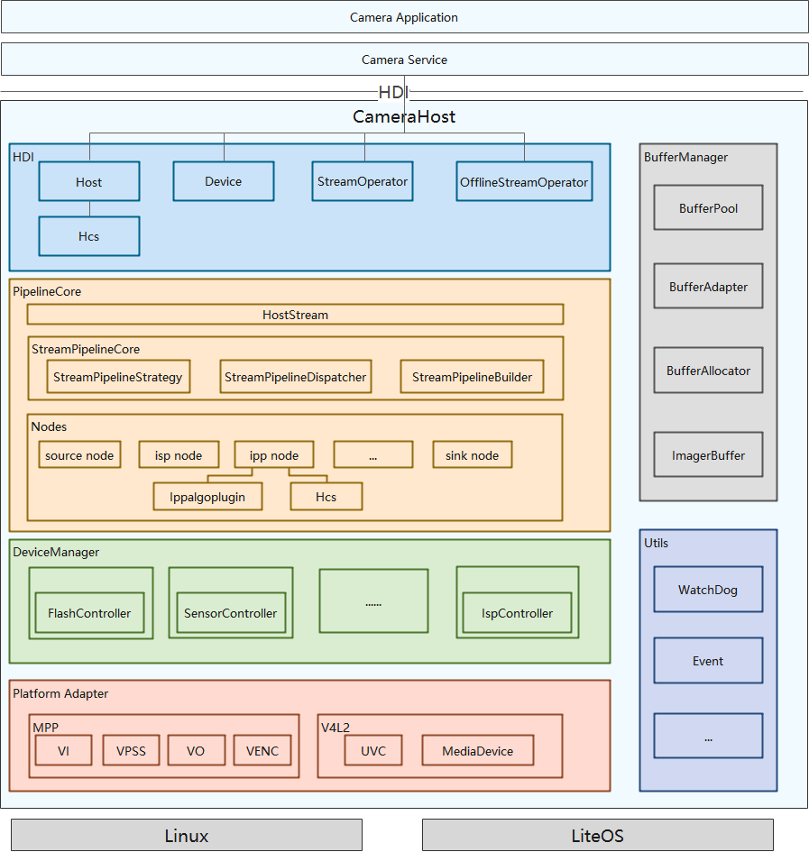

# Camera

-   [概述](#section11660541593)
-   [开发指导](#section161941989596)
    -   [接口说明](#section1551164914237)
    -   [开发步骤](#section19806524151819)
-   [开发实例](#section1564411661810)

## 概述

OpenHarmony相机驱动框架模型对上实现相机HDI（Hardware Driver Interface）接口，对下实现相机Pipeline模型，管理相机各个硬件设备。
该驱动框架模型内部分为三层，依次为HDI实现层、框架层和适配层，各层基本概念如下：
+ **HDI实现层**：对上实现OHOS（OpenHarmony Operation System）相机标准南向接口。
  
+ **框架层**：对接HDI实现层的控制、流的转发，实现数据通路的搭建，管理相机各个硬件设备等功能。

+ **适配层**：屏蔽底层芯片和OS（Operation System）差异，支持多平台适配。

****
**图 1**  基于HDF驱动框架的Camera驱动模型

1. 系统启动时创建CameraDeviceHost进程。进程创建后，首先枚举底层设备，创建（也可以通过配置表创建）管理设备树的DeviceManager类及其内部各个底层设备的对象，创建对应的CameraHost类实例并且将其注册到UHDF服务中，方便上层通过UHDF服务获取底层CameraDeviceHost的服务，从而操作底层设备。

2. Service通过CameraDeviceHost服务获取CameraHost实例，CameraHost可以获取底层的Camera能力，打开手电筒、调用Open接口打开Camera创建连接、创建DeviceManager（负责底层硬件模块上电）、创建CameraDevice（向上提供设备控制接口）。创建CameraDevice时会实例化PipelineCore的各个子模块，其中StreamPiplineCore负责创建Pipeline，MetaQueueManager负责上报meta。
   
3. Service通过底层的CameraDevice配置流、创建Stream类。StreamPipelineStrategy模块通过上层下发的模式和查询配置表创建对应流的Node连接方式，StreamPipelineBuilder模块创建Node实例并且连接返回该Pipline给StreamPipelineDispatcher。StreamPipelineDispatcher提供统一的Pipline调用管理。

4. Service通过Stream控制整个流的操作，AttachBufferQueue将从显示模块申请的BufferQueue下发到底层，由CameraDeviceDriverModel自行管理buffer，Capture接口下发命令，底层开始向上传递buffer。Pipeline的IspNode依次从BufferQueue获取指定数量buffer，然后下发到底层ISP（Image Signal Processor，图像信号处理器）硬件，ISP填充完之后将buffer传递给CameraDeviceDriverModel，CameraDeviceDriverModel通过循环线程将buffer填充到已经创建好的Pipeline中，各个Node处理后通过回调传递给上层，同时buffer返回BufferQueue等待下一次下发。

5. Service通过Capture接口下发拍照命令。ChangeToOfflineStream查询拍照buffer位置，如果ISP已经出图，并且图像数据已经送到IPP node，可以将普通拍照流转换为离线流，否则直接走关闭流程。通过传递StreamInfo使离线流获取到普通流的流信息，并且通过配置表确认离线流的具体Node连接方式，创建离线流的Node连接（如果已创建则通过CloseCamera释放非离线流所需的Node），等待buffer从底层Pipeline回传到上层再释放持有的Pipeline相关资源。

6. Service通过CameraDevice的UpdateSettings接口向下发送CaptureSetting参数，CameraDeviceDriverModel通过StreamPipelineDispatcher模块向各个Node转发，StartStreamingCapture和Capture接口携带的CaptureSetting通过StreamPipelineDispatcher模块向该流所属的Node转发。

7. Service通过EnableResult和DisableResult接口控制底层meta的上报。如果需要底层meta上报，pipeline会创建CameraDeviceDriverModel内部的一个Bufferqueue用来收集和传递meta，根据StreamPipelineStrategy模块查询配置表并通过StreamPipelineBuilder创建和连接Node，MetaQueueManager下发buffer至底层，底层相关Node填充数据，MetaQueueManager模块再调用上层回调传递给上层。

8. Service调用CameraDevice的Close接口，CameraDevice调用对应的DeviceManager模块对各个硬件下电；如果此时在Ipp的SubPipeline中存在OfflineStream，则需要保留OfflineStream，直到执行完毕。

9.  动态帧率控制。在StreamOperator中起一个CollectBuffer线程，CollectBuffer线程从每一路stream的BufferQueue中获取buffer，如果某一路流的帧率需要控制（为sensor出帧帧率的1/n），可以根据需求控制每一帧的buffer打包，并决定是否collect此路流的buffer（比如sensor出帧帧率为120fps，预览流的帧率为30fps，CollectBuffer线程collect预览流的buffer时，每隔4fps collect一次）。

## 开发指导

### HDI接口说明
旨在了解HDI接口的作用及函数参数的传递规则，详情可见[Camera驱动子系统HDI使用说明](https://gitee.com/openharmony/drivers_peripheral/blob/master/camera/README_zh.md)

### 开发步骤

下面分步骤描述了Camera驱动框架的主要接口，包括注册、检测到如何创建、捕获、销毁流、打开和关闭设备等接口（为了更清晰的展示和描述主要功能的实现部分，该章节删除了部分判错和LOG源码）。
#### 步骤1 注册CameraHost

定义Camera的HdfDriverEntry结构体，该结构体中定义了CameraHost初始化的方法。

    struct HdfDriverEntry g_cameraHostDriverEntry = {
        .moduleVersion = 1,
        .moduleName = "camera_service",
        .Bind = HdfCameraHostDriverBind,
        .Init = HdfCameraHostDriverInit,
        .Release = HdfCameraHostDriverRelease,
    };
    HDF_INIT(g_cameraHostDriverEntry); // 将Camera的HdfDriverEntry结构体注册到HDF上

#### 步骤2 CameraHost初始化
步骤1中提到的HdfCameraHostDriverBind接口提供了CameraServiceDispatch和CameraHostStubInstance的注册。这两个接口一个是远端调用CameraHost的方法，如OpenCamera()，SetFlashlight()等，另外一个是Camera设备的初始化，在开机时被调用。

    int HdfCameraHostDriverBind(HdfDeviceObject *deviceObject)
    {
        HDF_LOGI("HdfCameraHostDriverBind enter!");
        if (deviceObject == nullptr) {
            HDF_LOGE("HdfCameraHostDriverBind: HdfDeviceObject is NULL !");
            return HDF_FAILURE;
        }
        HdfCameraService *hdfCameraService = reinterpret_cast<HdfCameraService *>(OsalMemAlloc(sizeof(HdfCameraService)));
        if (hdfCameraService == nullptr) {
            HDF_LOGE("HdfCameraHostDriverBind OsalMemAlloc HdfCameraService failed!");
            return HDF_FAILURE;
        }
        hdfCameraService->ioservice.Dispatch = CameraServiceDispatch; // 提供远端CameraHost调用方法
        hdfCameraService->ioservice.Open = nullptr;
        hdfCameraService->ioservice.Release = nullptr;
        hdfCameraService->instance = CameraHostStubInstance(); // 初始化Camera设备
        deviceObject->service = &hdfCameraService->ioservice;
        return HDF_SUCCESS;
    }

下面的函数是远端CameraHost调用的方法：

    int32_t CameraHostStub::CameraHostServiceStubOnRemoteRequest(int cmdId, MessageParcel &data,
        MessageParcel &reply, MessageOption &option)
    {
        switch(cmdId) {
            case CMD_CAMERA_HOST_SET_CALLBACK: {
                return CameraHostStubSetCallback(data, reply, option);
            }
            case CMD_CAMERA_HOST_GET_CAMERAID: {
                return CameraHostStubGetCameraIds(data, reply, option);
            }
            case CMD_CAMERA_HOST_GET_CAMERA_ABILITY: {
                return CameraHostStubGetCameraAbility(data, reply, option);
            }
            case CMD_CAMERA_HOST_OPEN_CAMERA: {
                return CameraHostStubOpenCamera(data, reply, option);
            }
            case CMD_CAMERA_HOST_SET_FLASH_LIGHT: {
                return CameraHostStubSetFlashlight(data, reply, option);
            }
            default: {
                HDF_LOGE("%s: not support cmd %d", __func__, cmdId);
                return HDF_ERR_INVALID_PARAM;
            }
        }
        return HDF_SUCCESS;
    }

CameraHostStubInstance()接口最终调用CameraHostImpl::Init()方法，该方法会获取物理Camera，并对DeviceManager和PipelineCore进行初始化。

#### 步骤3 获取CamerHost
调用Get()接口从远端CameraService中获取CameraHost对象。get()方法如下：

    sptr<ICameraHost> ICameraHost::Get(const char *serviceName)
    {
        do {
            using namespace OHOS::HDI::ServiceManager::V1_0;
            auto servMgr = IServiceManager::Get();
            if (servMgr == nullptr) {
                HDF_LOGE("%s: IServiceManager failed!", __func__);
                break;
            }
            auto remote = servMgr->GetService(serviceName);  // 根据serviceName名称获取CameraHost
            if (remote != nullptr) {
                sptr<CameraHostProxy> hostSptr = iface_cast<CameraHostProxy>(remote); // 将CameraHostProxy对象返回给调用者，该对象中包含OpenCamera()等方法。
                return hostSptr;
            }
            HDF_LOGE("%s: GetService failed! serviceName = %s", __func__, serviceName);
        } while(false);
        HDF_LOGE("%s: get %s failed!", __func__, serviceName);
        return nullptr;
    }

#### 步骤4 OpenCamera()接口
获取CameraHost对象，该对象中有五个方法，分别是SetCallback、GetCameraIds、GetCameraAbility、OpenCamera和SetFlashlight。下面着重描述OpenCamera接口。
CameraHostProxy的OpenCamera()接口通过CMD_CAMERA_HOST_OPEN_CAMERA调用远端CameraHostStubOpenCamera()接口并获取ICameraDevice对象。

    CamRetCode CameraHostProxy::OpenCamera(const std::string &cameraId, const OHOS::sptr<ICameraDeviceCallback> &callback, OHOS::sptr<ICameraDevice> &pDevice)
    {
        int32_t ret = Remote()->SendRequest(CMD_CAMERA_HOST_REMOTE_OPEN_CAMERA, data, reply, option);
        if (ret != HDF_SUCCESS) {
            HDF_LOGE("%{public}s: SendRequest failed, error code is %{public}d", __func__, ret);
            return INVALID_ARGUMENT;
        }
        CamRetCode retCode = static_cast<CamRetCode>(reply.ReadInt32());
        bool flag = reply.ReadBool();
        if (flag) {
            sptr<IRemoteObject> remoteCameraDevice = reply.ReadRemoteObject();
            if (remoteCameraDevice == nullptr) {
                HDF_LOGE("%{public}s: CameraHostProxy remoteCameraDevice is null", __func__);
            }
            pDevice = OHOS::iface_cast<ICameraDevice>(remoteCameraDevice);
        }
        return retCode;
    }

Remote()->SendRequest调用上文提到的CameraHostServiceStubOnRemoteRequest()，根据cmdId进入CameraHostStubOpenCamera()接口，最终调用CameraHostImpl::OpenCamera()，该接口获取了
CameraDevice并对硬件进行上电等操作。

    CamRetCode CameraHostImpl::OpenCamera(const std::string &cameraId, const OHOS::sptr<ICameraDeviceCallback> &callback, OHOS::sptr<ICameraDevice> &device)
    {
        std::shared_ptr<CameraDeviceImpl> cameraDevice = std::static_pointer_cast<CameraDeviceImpl>(itr->second);
        if (cameraDevice == nullptr) {
            CAMERA_LOGE("camera device is null.");
            return INSUFFICIENT_RESOURCES;
        }
        CamRetCode ret = cameraDevice->SetCallback(callback);
        if (ret != NO_ERROR) {
            CAMERA_LOGW("set camera device callback faild.");
            return ret;
        }
        CameraHostConfig *config = CameraHostConfig::GetInstance();
        if (config == nullptr) {
            return INVALID_ARGUMENT;
        }
        std::vector<std::string> phyCameraIds;
        RetCode rc = config->GetPhysicCameraIds(cameraId, phyCameraIds);
        if (rc != RC_OK) {
            CAMERA_LOGE("get physic cameraId failed.");
            return DEVICE_ERROR;
        }
        if (CameraPowerUp(cameraId, phyCameraIds) != RC_OK) { // 对Camera硬件上电
            CAMERA_LOGE("camera powerup failed.");
            CameraPowerDown(phyCameraIds);
            return DEVICE_ERROR;
        }
    
        auto sptrDevice = deviceBackup_.find(cameraId);
        if (sptrDevice == deviceBackup_.end()) {
            deviceBackup_[cameraId] = cameraDevice.get();
        }
        device = deviceBackup_[cameraId]; // 将ICameraDevice带出。
        cameraDevice->SetStatus(true);
        return NO_ERROR;
    }

#### 步骤5 获取GetStreamOperator对象
IStreamOperator定义了一系列对流控制和操作的接口，主要有CreateStreams、CommitStreams、Capture、CancelCapture等。

    CamRetCode CameraDeviceImpl::GetStreamOperator(const OHOS::sptr<IStreamOperatorCallback> &callback,
     OHOS::sptr<IStreamOperator> &streamOperator)
    {
        if (callback == nullptr) {
            CAMERA_LOGW("input callback is null.");
            return INVALID_ARGUMENT;
        }
        spCameraDeciceCallback_ = callback;
        if (spStreamOperator_ == nullptr) {
            // 这里new了一个spStreamOperator对象传递给调用者，以便对stream进行各种操作。
            spStreamOperator_ = new(std::nothrow) StreamOperatorImpl(spCameraDeciceCallback_, shared_from_this());
            if (spStreamOperator_ == nullptr) {
                CAMERA_LOGW("create stream operator failed.");
                return DEVICE_ERROR;
            }
            ismOperator_ = spStreamOperator_;
        }
        streamOperator = ismOperator_;
    
        spStreamOperator_->SetRequestCallback([this](){
            cameraDeciceCallback_->OnError(REQUEST_TIMEOUT, 0);
        });
    }

#### 步骤6 创建流
调用CreateStreams创建流前需要填充StreamInfo结构体，具体内容如下：

    using StreamInfo = struct _StreamInfo {
        int streamId_; 
        int width_;  // 数据流宽
        int height_; // 数据流高
        int format_; // 数据流格式，如PIXEL_FMT_YCRCB_420_SP
        int datasapce_; 
        StreamIntent intent_; // StreamIntent 如PREVIEW
        bool tunneledMode_;
        OHOS::sptr<OHOS::IBufferProducer> bufferQueue_; // 数据流bufferQueue可用streamCustomer->CreateProducer()接口创建
        int minFrameDuration_;
        EncodeType encodeType_;
    };

CreateStreams()接口是StreamOperatorImpl类中的方法，该接口的主要作用是创建一个StreamBase对象，通过StreamBase的Init方法初始化CreateBufferPool等操作。

    RetCode StreamOperatorImpl::CreateStream(const std::shared_ptr<StreamInfo>& streamInfo)
    {
        static std::map<StreamIntent, std::string> typeMap = {
            {PREVIEW, "PREVIEW"},
            {VIDEO, "VIDEO"},
            {STILL_CAPTURE, "STILL_CAPTURE"},
            {POST_VIEW, "POST_VIEW"}, {ANALYZE, "ANALYZE"},
            {CUSTOM, "CUSTOM"}
        };
    
        auto itr = typeMap.find(streamInfo->intent_);
        if (itr == typeMap.end()) {
            CAMERA_LOGE("do not support stream type. [type = %{public}d]", streamInfo->intent_);
            return RC_ERROR;
        }
        std::shared_ptr<StreamBase> stream = StreamFactory::Instance().CreateShared(itr->second); // 创建StreamBase实例
        RetCode rc = stream->Init(streamInfo); // 调用StreamBase Init方法，CreateBufferPool
        return RC_OK;
    }

#### 步骤7 配置流
CommitStreams()是配置流的接口，必须在创建流之后调用，其主要作用是初始化Pipeline和创建Pipeline。

    CamRetCode StreamOperatorImpl::CommitStreams(OperationMode mode, const std::shared_ptr<CameraStandard::CameraMetadata>& modeSetting)
    {
        auto cameraDevice = cameraDevice_.lock();
        if (cameraDevice == nullptr) {
            CAMERA_LOGE("camera device closed.");
            return CAMERA_CLOSED;
        }
        std::shared_ptr<IPipelineCore> PipelineCore =
            std::static_pointer_cast<CameraDeviceImpl>(cameraDevice)->GetPipelineCore();
        if (PipelineCore == nullptr) {
            CAMERA_LOGE("get pipeline core failed.");
            return CAMERA_CLOSED;
        }
    
        streamPipeCore_ = PipelineCore->GetStreamPipelineCore();
        if (streamPipeCore_ == nullptr) {
            CAMERA_LOGE("get stream pipeline core failed.");
            return DEVICE_ERROR;
        }
    
        RetCode rc = streamPipeCore_->Init(); // 对pipelinecore的初始化
        if (rc != RC_OK) {
            CAMERA_LOGE("stream pipeline core init failed.");
            return DEVICE_ERROR;
        }
        rc = streamPipeCore_->CreatePipeline(mode); // 创建一个pipeline
        if (rc != RC_OK) {
            CAMERA_LOGE("create pipeline failed.");
            return INVALID_ARGUMENT;
        }
        return NO_ERROR;
    }

#### 步骤8 捕获图像
在调用Capture()接口前需要先填充CaptureInfo结构体，具体内容如下：

    using CaptureInfo = struct _CaptureInfo {
          std::vector<int> streamIds_; //需要Capture的streamIds
          std::shared_ptr<CameraStandard::CameraMetadata> captureSetting_; // 这里填充camera ability 可通过CameraHost 的GetCameraAbility()接口获取
         bool enableShutterCallback_;
    };

StreamOperatorImpl中的Capture方法主要调用CreateCapture()接口去捕获数据流：

    CamRetCode StreamOperatorImpl::Capture(int captureId, const std::shared_ptr<CaptureInfo>& captureInfo, bool isStreaming)
    {
         if (!ValidCaptureInfo(captureId, captureInfo)) {
            CAMERA_LOGE("capture streamIds is empty. [captureId = %d]", captureId);
            return INVALID_ARGUMENT;
        }
        std::shared_ptr<CameraCapture> cameraCapture = nullptr;
        RetCode rc = CreateCapture(captureId, captureInfo, isStreaming, cameraCapture);
        if (rc != RC_OK) {
            CAMERA_LOGE("create capture is failed.");
            return DEVICE_ERROR;
        }
    
        {
            std::unique_lock<std::mutex> lock(captureMutex_);
            camerCaptureMap_.insert(std::make_pair(captureId, cameraCapture));
        }
    
        rc = StartThread();
        if (rc != RC_OK) {
            CAMERA_LOGE("preview start failed.");
            return DEVICE_ERROR;
        }
        return NO_ERROR;
    }  

#### 步骤9 取消捕获和释放离线流
StreamOperatorImpl类中的CancelCapture()接口的主要作用是根据captureId取消数据流的捕获。
    
    CamRetCode StreamOperatorImpl::CancelCapture(int captureId)
    {
          auto itr = camerCaptureMap_.find(captureId); //根据captureId 在Map中查找对应的CameraCapture对象
          RetCode rc = itr->second->Cancel(); //调用CameraCapture中Cancel方法结束数据捕获
          std::unique_lock<std::mutex> lock(captureMutex_);
          camerCaptureMap_.erase(itr); //擦除该CameraCapture对象
          return NO_ERROR;
    }

StreamOperatorImpl类中的ReleaseStreams接口的主要作用是释放之前通过CreateStream()和CommitStreams()接口创建的流，并销毁Pipeline。

    CamRetCode StreamOperatorImpl::ReleaseStreams(const std::vector<int>& streamIds)
    {
        RetCode rc = DestroyStreamPipeline(streamIds); //销毁该streamIds 的pipeline
        rc = DestroyHostStreamMgr(streamIds);
        rc = DestroyStreams(streamIds); //销毁该streamIds 的 Stream
        return NO_ERROR;
    }

#### 步骤10 关闭Camera设备
调用CameraDeviceImpl中的Close()来关闭CameraDevice，该接口调用deviceManager中的PowerDown()来给设备下电。

## 开发实例

在/drivers/peripheral/camera/hal/init目录下有一个关于Camera的demo，开机后会在/system/bin下生成可执行文件ohos_camera_demo，该demo可以完成camera的预览，拍照等基础功能。下面我们就以此demo为例讲述怎样用HDI接口去编写预览和拍照的用例。

1.在main函数中构造一个Hos3516Demo对象，该对象中有对camera初始化、启停流、释放等控制的方法。下面mainDemo->InitSensors()函数为初始化CameraHost，mainDemo->InitCameraDevice()函数为初始化CameraDevice。

    int main(int argc, char** argv)
    {
        RetCode rc = RC_OK;
        auto mainDemo = std::make_shared<Hos3516Demo>();
        rc = mainDemo->InitSensors(); // 初始化CmaeraHost
        if (rc == RC_ERROR) {
            CAMERA_LOGE("main test: mainDemo->InitSensors() error\n");
            return -1;
        }

        rc = mainDemo->InitCameraDevice(); //初始化CameraDevice
        if (rc == RC_ERROR) {
            CAMERA_LOGE("main test: mainDemo->InitCameraDevice() error\n");
            return -1;
        }
    
        rc = PreviewOn(0, mainDemo); // 配流和启流
        if (rc != RC_OK) {
            CAMERA_LOGE("main test: PreviewOn() error demo exit");
            return -1;
        }
    
        ManuList(mainDemo, argc, argv); // 打印菜单到控制台
    
        return RC_OK;
    }

初始化CameraHost函数实现如下，这里调用了HDI接口ICameraHost::Get()去获取demoCameraHost。
    
    RetCode Hos3516Demo::InitSensors()
    {
        demoCameraHost_ = ICameraHost::Get(DEMO_SERVICE_NAME);
        if (demoCameraHost_ == nullptr) {
            CAMERA_LOGE("demo test: ICameraHost::Get error");
            return RC_ERROR;
        }
    
        hostCallback_ = new CameraHostCallback();
        rc = demoCameraHost_->SetCallback(hostCallback_);
        return RC_OK;
    }

初始化CameraDevice函数实现如下，这里调用了GetCameraIds(cameraIds_)，GetCameraAbility(cameraId, ability_)，OpenCamera(cameraIds_.front(), callback, demoCameraDevice_)等接口实现了demoCameraHost的获取。

    RetCode Hos3516Demo::InitCameraDevice()
    {
        (void)demoCameraHost_->GetCameraIds(cameraIds_);
        const std::string cameraId = cameraIds_.front();
        demoCameraHost_->GetCameraAbility(cameraId, ability_);
    
        sptr<CameraDeviceCallback> callback = new CameraDeviceCallback();
        rc = demoCameraHost_->OpenCamera(cameraIds_.front(), callback, demoCameraDevice_);
        return RC_OK;
    }   

2.PreviewOn()接口包含配置流、开启预览流和启动Capture动作。该接口执行完成后Camera预览通路已经开始运转并开启了两路流，一路流是preview，另外一路流是capture或者video，两路流中仅对preview流进行capture动作。

    static RetCode PreviewOn(int mode, const std::shared_ptr<Hos3516Demo>& mainDemo)
    {
         rc = mainDemo->StartPreviewStream(); // 配置preview流
         if (mode == 0) {
            rc = mainDemo->StartCaptureStream(); // 配置capture流
          } else {
            rc = mainDemo->StartVideoStream(); // 配置video流
          }
    
        rc = mainDemo->CaptureON(STREAM_ID_PREVIEW, CAPTURE_ID_PREVIEW, CAPTURE_PREVIEW); // 将preview流capture
        return RC_OK;
    }           

StartCaptureStream()、StartVideoStream()和StartPreviewStream()接口都会调用CreatStream()接口，只是传入的参数不同。

    RetCode Hos3516Demo::StartVideoStream()
    {
        RetCode rc = RC_OK;
        if (isVideoOn_ == 0) {
            isVideoOn_ = 1;
            rc = CreatStream(STREAM_ID_VIDEO, streamCustomerVideo_, VIDEO); // 如需启preview或者capture流更改该接口参数即可。
        }
        return RC_OK;
    }

CreatStream()方法调用HDI接口去配置和创建流，首先调用HDI接口去获取StreamOperation对象，然后创建一个StreamInfo。调用CreateStreams()和CommitStreams()实际创建流并配置流。

    RetCode Hos3516Demo::CreatStreams(const int streamIdSecond, StreamIntent intent)
    {
        std::vector<std::shared_ptr<StreamInfo>> streamInfos;
        std::vector<std::shared_ptr<StreamInfo>>().swap(streamInfos);
        GetStreamOpt(); // 获取StreamOperator对象
        std::shared_ptr<StreamInfo> previewStreamInfo = std::make_shared<StreamInfo>();
        SetStreamInfo(previewStreamInfo, streamCustomerPreview_, STREAM_ID_PREVIEW, PREVIEW); // 填充StreamInfo
        if (previewStreamInfo->bufferQueue_ == nullptr) {
            CAMERA_LOGE("demo test: CreatStream CreateProducer(); is nullptr\n");
            return RC_ERROR;
        }
        streamInfos.push_back(previewStreamInfo);
    
        std::shared_ptr<StreamInfo> secondStreamInfo = std::make_shared<StreamInfo>();
        if (streamIdSecond == STREAM_ID_CAPTURE) {
            SetStreamInfo(secondStreamInfo, streamCustomerCapture_, STREAM_ID_CAPTURE, intent);
        } else {
            SetStreamInfo(secondStreamInfo, streamCustomerVideo_, STREAM_ID_VIDEO, intent);
        }
    
        if (secondStreamInfo->bufferQueue_ == nullptr) {
            CAMERA_LOGE("demo test: CreatStreams CreateProducer() secondStreamInfo is nullptr\n");
            return RC_ERROR;
        }
        streamInfos.push_back(secondStreamInfo);
    
        rc = streamOperator_->CreateStreams(streamInfos); // 创建流
        if (rc != Camera::NO_ERROR) {
            CAMERA_LOGE("demo test: CreatStream CreateStreams error\n");
            return RC_ERROR;
        }
    
        rc = streamOperator_->CommitStreams(Camera::NORMAL, ability_); // commit配置流
        if (rc != Camera::NO_ERROR) {
            CAMERA_LOGE("demo test: CreatStream CommitStreams error\n");
            std::vector<int> streamIds = {STREAM_ID_PREVIEW, streamIdSecond};
            streamOperator_->ReleaseStreams(streamIds);
            return RC_ERROR;
        }
        return RC_OK;
    }

CaptureON()接口调用streamOperator的Capture()方法获取camera数据并轮转buffer，拉起一个线程接收相应类型的数据。

    RetCode Hos3516Demo::CaptureON(const int streamId, const int captureId, CaptureMode mode)
    {
        std::shared_ptr<Camera::CaptureInfo> captureInfo = std::make_shared<Camera::CaptureInfo>(); // 创建并填充CaptureInfo
        captureInfo->streamIds_ = {streamId};
        captureInfo->captureSetting_ = ability_;
        captureInfo->enableShutterCallback_ = false;
    
        int rc = streamOperator_->Capture(captureId, captureInfo, true); // 实际capture开始，buffer轮转开始
        if (mode == CAPTURE_PREVIEW) {
            streamCustomerPreview_->ReceiveFrameOn(nullptr); // 创建预览线程接收递上来的buffer
        } else if (mode == CAPTURE_SNAPSHOT) {
            streamCustomerCapture_->ReceiveFrameOn([this](void* addr, const uint32_t size) { // 创建capture线程通过StoreImage回调接收递上来的buffer
                StoreImage(addr, size);
            });
        } else if (mode == CAPTURE_VIDEO) {
            OpenVideoFile();
            streamCustomerVideo_->ReceiveFrameOn([this](void* addr, const uint32_t size) {// 创建Video线程通过StoreVideo回调接收递上来的buffer
                StoreVideo(addr, size);
            });
        }
        return RC_OK;
    }

3.ManuList()函数从控制台通过fgets()接口获取字符，不同字符所对应demo支持的功能不同，并打印出该demo所支持功能的菜单。
    
    static void ManuList(const std::shared_ptr<Hos3516Demo>& mainDemo,
        const int argc, char** argv)
    {
        int idx, c;
        int awb = 1;
        constexpr char shortOptions[] = "h:cwvaqof:";
        c = getopt_long(argc, argv, shortOptions, longOptions, &idx);
        while(1) {
            switch (c) {
                case 'h':
                    c = PutMenuAndGetChr(); // 打印菜单
                    break;
                    
                    case 'f':
                    FlashLightTest(mainDemo); // 手电筒功能测试
                    c = PutMenuAndGetChr();
                    break;
                case 'o':
                    OfflineTest(mainDemo); // Offline功能测试
                    c = PutMenuAndGetChr();
                    break;
                case 'c':
                    CaptureTest(mainDemo); // Capture功能测试
                    c = PutMenuAndGetChr();
                    break;
                case 'w': // AWB功能测试
                    if (awb) {
                        mainDemo->SetAwbMode(OHOS_CAMERA_AWB_MODE_INCANDESCENT);
                    } else {
                        mainDemo->SetAwbMode(OHOS_CAMERA_AWB_MODE_OFF);
                    }
                    awb = !awb;
                    c = PutMenuAndGetChr();
                    break;
                case 'a': // AE功能测试
                    mainDemo->SetAeExpo();
                    c = PutMenuAndGetChr();
                    break;
                case 'v': // Video功能测试
                    VideoTest(mainDemo);
                    c = PutMenuAndGetChr();
                    break;
                case 'q': // 退出demo
                    PreviewOff(mainDemo);
                    mainDemo->QuitDemo();
                    exit(EXIT_SUCCESS);
    
                default:
                    CAMERA_LOGE("main test: command error please retry input command");
                    c = PutMenuAndGetChr();
                    break;
            }
        }
    }

PutMenuAndGetChr()接口打印了demo程序的菜单，并调用fgets()等待从控制台输入命令，内容如下：

    static int PutMenuAndGetChr(void)
    {
        constexpr uint32_t inputCount = 50;
        int c = 0;
        char strs[inputCount];
        Usage(stdout);
        CAMERA_LOGD("pls input command(input -q exit this app)\n");
        fgets(strs, inputCount, stdin);
    
        for (int i = 0; i < inputCount; i++) {
            if (strs[i] != '-') {
                c = strs[i];
                break;
            }
        }
        return c;
    }

控制台输出菜单详情如下：

    "Options:\n"
    "-h | --help          Print this message\n"
    "-o | --offline       stream offline test\n"
    "-c | --capture       capture one picture\n"
    "-w | --set WB        Set white balance Cloudy\n"
    "-v | --video         capture Viedeo of 10s\n"
    "-a | --Set AE        Set Auto exposure\n"
    "-f | --Set Flashlight        Set flashlight ON 5s OFF\n"
    "-q | --quit          stop preview and quit this app\n");

demo中其他功能会调用不同的HDI接口去实现，与PreviewOn()接口类似，这里不再赘述，具体详情可以参见[ohos_camera_demo](https://gitee.com/openharmony/drivers_peripheral/tree/master/camera/hal/init)。

