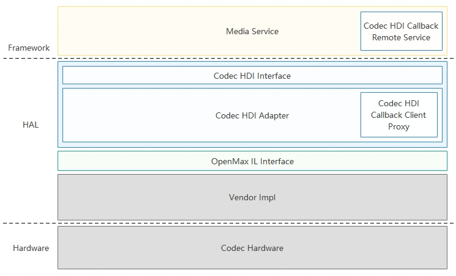

# Codec

## 概述
### 功能简介

OpenHarmony Codec HDI（Hardware Device Interface）驱动框架基于OpenMax实现了视频硬件编解码驱动，提供Codec基础能力接口给上层媒体服务调用，包括获取组件编解码能力、创建组件、参数设置、数据的轮转和控制、以及销毁组件等功能，实现对视频数据的编解码处理（可以将YUV/RGB等格式的视频数据编码成H264/H265等编码格式，也可以将H264/H265等裸流数据解码成YUV/RGB等格式数据）。本文主要介绍基于HDF（Hardware Driver Foundation）驱动框架开发的Codec编解码功能。

Codec HDI驱动框架基于HDF驱动框架实现。Codec HDI驱动架构组成：

**图 1**  Codec HDI驱动框架



- Codec HDI Callback Remote Service：匿名Callback服务，通过该服务，可以处理回调。
- Codec HDI Interface：提供了基于OpenMax的标准接口，上层可通过这些接口来实现硬件的编解码。
- Codec HDI Adapter：HDI 实现层，实现了HDI Interface接口，并与OpenMax IL 对接。
- OpenMax IL Interface：OpenMax IL接口，Codec HDI驱动直接对接OpenMax IL层。
- Vendor Impl：厂商适配层，各大厂商适配的OpenMax 实现层。
- Codec Hardware：硬件解码设备。

### 基本概念
在进行开发前，开发者应了解以下基本概念：

- 采样率

    采样率就是每秒从连续信号中提取并组成离散信号的采样个数，用赫兹（Hz）来表示。

- OpenMax IL

    OpenMax IL定义了硬件或软件编解码的标准，使得应用程序和媒体框架能够以统一的方式与多媒体编解码器和支持的组件进行交互。

- 帧率

    帧率就是每秒内传输的图片的帧数，也可以理解为图形处理器每秒能够刷新几次。帧率越大，画面越流畅；帧率越小，画面越有跳动感。

- 码率

    视频的码率是指在单位时间内传输的视频数据数量，一般用kbps作为单位。码率越高，视频就越清晰，反之则画面粗糙而且多马赛克。

- 组件

    组件就是指的OpenMax IL 组件，是对视频流中模块的抽象，本文中的组件指的是编解码组件，专门处理视频的编解码。

### 约束与限制

Codec HDI只针对标准系统，其它系统暂不支持。

接口约束和限制参考[OpenMax IL标准](https://www.khronos.org/api/openmax/il)。

## 开发指导

### 场景介绍
Codec模块主要完成对视频数据的硬件编解码，将H264等裸流数据转化成图形支持的YUV或者RGB数据，也支持将图形的YUV或RGB数据编码成H264等数据格式。

### 接口说明

- icodec_component_manager.h

  | 接口名称                                                                                                                                                       | 功能描述                      |
  | -------------------------------------------------------------------------------------------------------------------------------------------------------------- | ------------------------------|
  | int32_t CreateComponent(sptr<ICodecComponent>& component, uint32_t& componentId,<br />const std::string& compName, int64_t appData, const sptr<ICodecCallback>& callbacks) | 创建Codec组件实例             |
  | int32_t DestoryComponent(uint32_t componentId)                                                                | 销毁Codec组件实例                  |

- icodec_component.h

  | 接口名称                                                     | 功能描述               |
  | ------------------------------------------------------------ | ---------------------- |
  | int32_t SendCommand(CodecCommandType cmd, uint32_t param, const std::vector<int8_t>& cmdData) | 发送命令给组件         |
  | int32_t GetParameter(uint32_t index, const std::vector<int8_t>& inParamStruct, std::vector<int8_t>& outParamStruct) | 获取组件参数设置       |
  | int32_t SetParameter(uint32_t index, const std::vector<int8_t>& paramStruct) | 设置组件需要的参数     |
  | int32_t GetState(CodecStateType& state)                      | 获取组件的状态         |
  | int32_t UseBuffer(uint32_t portIndex, const OmxCodecBuffer& inBuffer, OmxCodecBuffer& outBuffer) | 指定组件端口的buffer   |
  | int32_t FreeBuffer(uint32_t portIndex, const OmxCodecBuffer& buffer) | 释放buffer             |
  | int32_t EmptyThisBuffer(const OmxCodecBuffer& buffer)        | 编解码输入待处理buffer |
  | int32_t FillThisBuffer(const OmxCodecBuffer& buffer)         | 编解码输出填充buffer   |

- icodec_callback.h

  | 接口名称                                                     | 功能描述                           |
  | ------------------------------------------------------------ | ---------------------------------- |
  | int32_t EventHandler(CodecEventType event, const EventInfo& info) | 事件上报                           |
  | int32_t EmptyBufferDone(int64_t appData, const OmxCodecBuffer& buffer) | 上报输入buffer编码或者解码处理完毕 |
  | int32_t FillBufferDone(int64_t appData, const OmxCodecBuffer& buffer) | 上报输出buffer填充完毕             |

更多接口请参考[Codec驱动仓](https://gitee.com/openharmony/drivers_peripheral/tree/master/codec)。

### 开发步骤
Codec HDI驱动的开发过程主要包含以下步骤：

#### Driver的注册及初始化
定义Codec HDI的HdfDriverEntry结构体，该结构体中定义了Driver初始化的方法，填充g_codeccomponentmanagerDriverEntry结构体，实现Bind、Init、Release函数指针。 

```c
static struct HdfDriverEntry g_codeccomponentmanagerDriverEntry = {
    .moduleVersion = 1,
    .moduleName = "codec_component_manager_service",
    .Bind = HdfCodecComponentManagerDriverBind,
    .Init = HdfCodecComponentManagerDriverInit,
    .Release = HdfCodecComponentManagerDriverRelease,
}; // 将Codec HDI的HdfDriverEntry结构体注册到HDF上
```

- HdfCodecComponentManagerDriverBind：将HDF中device绑定到HdfCodecComponentManagerHost，将codec service注册到HDF框架。

    ```c
    static int HdfCodecComponentManagerDriverBind(struct HdfDeviceObject *deviceObject)
    {
        CODEC_LOGI("HdfCodecComponentManagerDriverBind enter");
    
        auto *hdfCodecComponentManagerHost = new (std::nothrow) HdfCodecComponentManagerHost;
        if (hdfCodecComponentManagerHost == nullptr) {
            CODEC_LOGE("failed to create create HdfCodecComponentManagerHost object");
            return HDF_FAILURE;
        }
    
        hdfCodecComponentManagerHost->ioService.Dispatch = CodecComponentManagerDriverDispatch;
        hdfCodecComponentManagerHost->ioService.Open = NULL;
        hdfCodecComponentManagerHost->ioService.Release = NULL;
    
        auto serviceImpl = ICodecComponentManager::Get(true);
        if (serviceImpl == nullptr) {
            CODEC_LOGE("failed to get of implement service");
            delete hdfCodecComponentManagerHost;
            return HDF_FAILURE;
        }
    
        hdfCodecComponentManagerHost->stub =
            OHOS::HDI::ObjectCollector::GetInstance().GetOrNewObject(serviceImpl, ICodecComponentManager::GetDescriptor());
        if (hdfCodecComponentManagerHost->stub == nullptr) {
            CODEC_LOGE("failed to get stub object");
            delete hdfCodecComponentManagerHost;
            return HDF_FAILURE;
        }
    
        deviceObject->service = &hdfCodecComponentManagerHost->ioService;
        return HDF_SUCCESS;
    }
    ```

- HdfCodecComponentManagerDriverInit：加载HCS（HDF Configuration Source）中的属性配置。

    ```c
    static int HdfCodecComponentManagerDriverInit(struct HdfDeviceObject *deviceObject)
    {
        CODEC_LOGI("HdfCodecComponentManagerDriverInit enter");
        if (DevHostRegisterDumpHost(CodecDfxService::DevCodecHostDump) != HDF_SUCCESS) {
            CODEC_LOGE("DevHostRegisterDumpHost error!");
        }
        return HDF_SUCCESS;
    }
    ```
    
- HdfCodecComponentTypeDriverRelease：释放驱动实例。

    ```c
    static void HdfCodecComponentManagerDriverRelease(struct HdfDeviceObject *deviceObject)
    {
        CODEC_LOGI("HdfCodecComponentManagerDriverRelease enter");
        if (deviceObject->service == nullptr) {
            CODEC_LOGE("HdfCodecComponentManagerDriverRelease not initted");
            return;
        }
    
        auto *hdfCodecComponentManagerHost =
            CONTAINER_OF(deviceObject->service, struct HdfCodecComponentManagerHost, ioService);
        delete hdfCodecComponentManagerHost;
    }
    ```

#### Driver的HCS配置
HCS配置包括两部分：

- device相关配置。
- 支持的组件相关配置。

HCS配置内容包括：驱动节点、加载顺序、服务名称等。HCS语法可参考[配置管理](driver-hdf-manage.md)。

以RK3568开发板为例，标准系统配置文件路径（其它系统暂不涉及）：
vendor/hihope/rk3568/hdf_config/uhdf/

1. device相关配置

    在device_info.hcs的codec_host中增加codec_component_manager_service配置，具体配置如下：
    ```c
    codec :: host {
        hostName = "codec_host";
        priority = 50;
        gid = ["codec_host", "uhdf_driver", "vendor_mpp_driver"];
        codec_omx_idl_device :: device {
            device0 :: deviceNode {
                policy = 2;                                       // 自动加载，非延迟加载
                priority = 100;                                   // 优先级
                moduleName = "libcodec_driver.z.so";              // 驱动的动态库
                serviceName = "codec_component_manager_service";  // 配置驱动的服务名
                deviceMatchAttr = "media_codec_capabilities";     // 属性配置
            }
        }
    }
    ```

2. 支持的组件相关配置

    在media_codec\media_codec_capabilities.hcs中增加组件配置，具体配置如下：
    ```c
    /* node name explanation -- HDF_video_hw_enc_avc_rk：
    **
    **    HDF____________video__________________hw____________________enc____________avc_______rk
    **     |               |                    |                      |              |        |
    ** HDF or OMX    video or audio    hardware or software    encoder or decoder    mime    vendor
    */
    HDF_video_hw_enc_avc_rk {
        role = 1;                                           // AvCodecRole配置
        type = 1;                                           // CodecType配置
        name = "OMX.rk.video_encoder.avc";                  // 组件名配置
        supportProfiles = [1, 32768, 2, 32768, 8, 32768];   // 支持的profile配置
        maxInst = 4;                                        // 最大实例数量配置
        isSoftwareCodec = false;                            // 硬件/软件
        processModeMask = [];                               // CodecProcessMode配置
        capsMask = [0x01];                                  // CodecCapsMask配置
        minBitRate = 1;                                     // 最小比特率
        maxBitRate = 40000000;                              // 最大比特率
        minWidth = 176;                                     // 视频最小宽
        minHeight = 144;                                    // 视频最小高
        maxWidth = 1920;                                    // 视频最大宽
        maxHeight = 1088;                                   // 视频最大高
        widthAlignment = 16;                                // 水平对齐
        heightAlignment = 8;                                // 垂直对齐
        minBlockCount = 0xFFFFFFFF;
        maxBlockCount = 0xFFFFFFFF;
        minBlocksPerSecond = 0xFFFFFFFF;
        maxBlocksPerSecond = 0xFFFFFFFF;
        blockSizeWidth = 0xFFFFFFFF;
        blockSizeHeight = 0xFFFFFFFF;
        supportPixelFmts = [28, 24, 20, 12];                // 支持的颜色列表，Display支持的颜色列表
        measuredFrameRate = [320, 240, 165, 165, 720, 480, 149, 149, 1280, 720, 73, 73, 1920, 1080, 18, 18];
        bitRateMode = [1, 2];                               // 比特率模式，BitRateMode
        minFrameRate = 0;                                   // 帧率配置
        maxFrameRate = 0;
    }
    ```

### 使用实例
在按照开发步骤进行相关操作后，Codec模块完成了基本的驱动适配，用户可使用Codec模块提供的HDI接口进行下一步的开发。Codec HDI核心功能如下：

1. 提供Codec HDI接口供北向视频服务调用，实现视频服务的基本编解码。
2. 作为标准南向接口，保证南向OEM产商实现HDI-adapter的规范性，保证生态良性演进。

用户开发步骤如下所示：

1. 初始化，包括接口实例、回调的初始化和对应的组件的初始化；
2. 设置编解码参数和配置信息，如视频宽、高和码率等；
3. 输入输出Buffer申请；
4. 编解码Buffer流转，使组件进入CODEC_STATE_EXECUTING状态，并处理相应的回调；
5. 接口去初始化，销毁buffer，关闭组件并释放所有的接口对象；

#### 初始化
初始化过程包括接口的初始化，回调的初始化以及组件的创建。
```cpp
// 初始化Codec HDI ComponentManager实例
omxMgr_ = ICodecComponentManager::Get(false);
if ((omxMgr_ == nullptr)) {
    HDF_LOGE("%{public}s omxMgr_ is null", __func__);
    return false;
}
// 初始化回调
callback_ = new CodecHdiCallback(shared_from_this());
if ((callback_ == nullptr)) {
    HDF_LOGE("%{public}s callback_ is null", __func__);
    return false;
}
// 新建组件实例
err = omxMgr_->CreateComponent(client_, componentId_, compName, reinterpret_cast<int64_t>(this), callback_);
if (err != HDF_SUCCESS) {
    HDF_LOGE("%{public}s failed to CreateComponent", __func__);
    return false;
}
```

#### 设置编解码参数和配置信息
Codec HDI编解码参数配置，包括输入输出数据的宽和高，输入数据格式和输出数据格式。
```cpp
// 设置输入端口图片的宽高
OMX_PARAM_PORTDEFINITIONTYPE param;
if (util_->InitParam(param) != HDF_SUCCESS) {
    return HDF_FAILURE;
}
param.nPortIndex = static_cast<uint32_t>(PortIndex::PORT_INDEX_INPUT);

std::vector<int8_t> inVec, outVec;
util_->ObjectToVector(param, inVec);
auto err = client_->GetParameter(OMX_IndexParamPortDefinition, inVec, outVec);
if (err != HDF_SUCCESS) {
    HDF_LOGE("%{public}s failed  PortIndex::PORT_INDEX_INPUT, index is OMX_IndexParamPortDefinition", __func__);
    return err;
}
util_->VectorToObject(outVec, param);

HDF_LOGI("PortIndex::PORT_INDEX_INPUT: eCompressionFormat = %{public}d, eColorFormat = %{public}d ",
         param.format.video.eCompressionFormat, param.format.video.eColorFormat);
util_->setParmValue(param, width_, height_, stride_);
util_->ObjectToVector(param, inVec);
err = client_->SetParameter(OMX_IndexParamPortDefinition, inVec);
if (err != HDF_SUCCESS) {
    HDF_LOGE("%{public}s failed with PortIndex::PORT_INDEX_INPUT, index is OMX_IndexParamPortDefinition", __func__);
    return err;
}
// 输出宽、高和格式设置
if (util_->InitParam(param) != HDF_SUCCESS) {
    return HDF_FAILURE;
}
param.nPortIndex = static_cast<uint32_t>(PortIndex::PORT_INDEX_OUTPUT);
util_->ObjectToVector(param, inVec);
err = client_->GetParameter(OMX_IndexParamPortDefinition, inVec, outVec);
if (err != HDF_SUCCESS) {
    HDF_LOGE("%{public}s failed with PortIndex::PORT_INDEX_OUTPUT, index is OMX_IndexParamPortDefinition",
             __func__);
    return err;
}
util_->VectorToObject(outVec, param);

HDF_LOGI("PortIndex::PORT_INDEX_OUTPUT eCompressionFormat = %{public}d, eColorFormat=%{public}d",
         param.format.video.eCompressionFormat, param.format.video.eColorFormat);
util_->setParmValue(param, width_, height_, stride_);
param.format.video.eColorFormat = AV_COLOR_FORMAT;  // 输出数据格式设置为YUV420SP
err = client_->SetParameter(OMX_IndexParamPortDefinition, inVec);
if (err != HDF_SUCCESS) {
    HDF_LOGE("%{public}s failed  with PortIndex::PORT_INDEX_OUTPUT, index is OMX_IndexParamPortDefinition",
             __func__);
    return err;
}
// 设置输入数据为H264/H265格式数据
OMX_VIDEO_PARAM_PORTFORMATTYPE param;
if (util_->InitParam(param) != HDF_SUCCESS) {
    return false;
}
param.nPortIndex = (uint32_t)PortIndex::PORT_INDEX_INPUT;
std::vector<int8_t> inVec, outVec;
util_->ObjectToVector(param, inVec);
auto err = client_->GetParameter(OMX_IndexParamVideoPortFormat, inVec, outVec);
if (err != HDF_SUCCESS) {
    HDF_LOGE("%{public}s failed with PortIndex::PORT_INDEX_INPUT", __func__);
    return false;
}
util_->VectorToObject(outVec, param);

HDF_LOGI("set Format PortIndex::PORT_INDEX_INPUT eCompressionFormat = %{public}d, eColorFormat=%{public}d",
         param.eCompressionFormat, param.eColorFormat);
param.xFramerate = FRAME  // 30帧
if (codecMime_ == codecMime::AVC) {
    param.eCompressionFormat = OMX_VIDEO_CodingAVC;  // H264
} else {
    param.eCompressionFormat = (OMX_VIDEO_CODINGTYPE)CODEC_OMX_VIDEO_CodingHEVC;  // H265
}

util_->ObjectToVector(param, inVec);
err = client_->SetParameter(OMX_IndexParamVideoPortFormat, inVec);
if (err != HDF_SUCCESS) {
    HDF_LOGE("%{public}s failed  with PortIndex::PORT_INDEX_INPUT", __func__);
    return false;
}
```

#### 申请输入输出Buffer
此处讲解输入输出buffer的申请的整个过程，我们需要按照下面的步骤依次执行：

1. 用户通过UseBuffer申请输入输出Buffer，并保存bufferId，后续buffer轮转可以直接通过bufferId来操作。
2. 用户需要判断对应的端口是否是使能状态，如果不是，需要先将对应的端口设置为使能状态。
3. 用户通过SendCommand将组件的状态为修改为CODEC_STATE_IDLE，需要等待其结果通知。
```cpp
// 输入端口buffer申请
auto err = UseBufferOnPort(PortIndex::PORT_INDEX_INPUT);
if (err != HDF_SUCCESS) {
    HDF_LOGE("%{public}s UseBufferOnPort PortIndex::PORT_INDEX_INPUT error", __func__);
    return false;
}
// 输出端口buffer申请
err = UseBufferOnPort(PortIndex::PORT_INDEX_OUTPUT);
if (err != HDF_SUCCESS) {
    HDF_LOGE("%{public}s UseBufferOnPort PortIndex::PORT_INDEX_OUTPUT error", __func__);
    return false;
}
// 发送命令使组件进入OMX_StateIdle状态
std::vector<int8_t> cmdData;
auto err = client_->SendCommand(CODEC_COMMAND_STATE_SET, CODEC_STATE_IDLE, cmdData);
if (err != HDF_SUCCESS) {
    HDF_LOGE("%{public}s failed to SendCommand with CODEC_COMMAND_STATE_SET:CODEC_STATE_IDLE", __func__);
    return false;
}
```

UseBufferOnPort实现如下：

```cpp
int32_t CodecHdiDecode::UseBufferOnPort(PortIndex portIndex)
{
    HDF_LOGI("%{public}s enter, portIndex = %{public}d", __func__, portIndex);
    int bufferSize = 0;
    int bufferCount = 0;
    bool PortEnable = false;
    // 获取端口buffer参数
    OMX_PARAM_PORTDEFINITIONTYPE param;
    if (util_->InitParam(param) != HDF_SUCCESS) {
        return HDF_FAILURE;
    }
    param.nPortIndex = static_cast<OMX_U32>(portIndex);

    std::vector<int8_t> inVec, outVec;
    util_->ObjectToVector(param, inVec);
    auto err = client_->GetParameter(OMX_IndexParamPortDefinition, inVec, outVec);
    if (err != HDF_SUCCESS) {
        HDF_LOGE("%{public}s failed to GetParameter with OMX_IndexParamPortDefinition : portIndex[%{public}d]",
                 __func__, portIndex);
        return err;
    }
    util_->VectorToObject(outVec, param);

    bufferSize = param.nBufferSize;
    bufferCount = param.nBufferCountActual;
    portEnable = param.bEnabled;
    HDF_LOGI("buffer index [%{public}d], buffer size [%{public}d], "
             "buffer count [%{public}d], portEnable[%{public}d], ret [%{public}d]",
             portIndex, bufferSize, bufferCount, portEnable, err);
    // 设置端口buffer
    if (useBufferHandle_ && portIndex == PortIndex::PORT_INDEX_OUTPUT) {
        err = UseBufferHandle(bufferCount, bufferSize);
    } else {
        err = UseBufferOnPort(portIndex, bufferCount, bufferSize);
    }
    // 检查端口是否可用状态
    if (!portEnable) {
        err = client_->SendCommand(CODEC_COMMAND_PORT_ENABLE, static_cast<uint32_t>(portIndex), {});
        if (err != HDF_SUCCESS) {
            HDF_LOGE("%{public}s SendCommand OMX_CommandPortEnable::PortIndex::PORT_INDEX_INPUT error", __func__);
            return err;
        }
    }
    return HDF_SUCCESS;
}

int32_t CodecHdiDecode::UseBufferOnPort(PortIndex portIndex, int bufferCount, int bufferSize)
{
    if (bufferCount <= 0 || bufferSize <= 0) {
        HDF_LOGE("UseBufferOnPort bufferCount <= 0 or bufferSize <= 0");
        return HDF_ERR_INVALID_PARAM;
    }
    for (int i = 0; i < bufferCount; i++) {
        std::shared_ptr<OmxCodecBuffer> omxBuffer = std::make_shared<OmxCodecBuffer>();
        omxBuffer->size = sizeof(OmxCodecBuffer);
        omxBuffer->version.s.nVersionMajor = 1;
        omxBuffer->bufferType = CODEC_BUFFER_TYPE_AVSHARE_MEM_FD;
        int fd = AshmemCreate(0, bufferSize);
        shared_ptr<Ashmem> sharedMem = make_shared<Ashmem>(fd, bufferSize);
        omxBuffer->fd = fd;
        omxBuffer->bufferhandle = nullptr;
        omxBuffer->allocLen = bufferSize;
        omxBuffer->fenceFd = -1;
        omxBuffer->pts = 0;
        omxBuffer->flag = 0;

        if (portIndex == PortIndex::PORT_INDEX_INPUT) {
            omxBuffer->type = READ_ONLY_TYPE;  // ReadOnly
            sharedMem->MapReadAndWriteAshmem();
        } else {
            omxBuffer->type = READ_WRITE_TYPE;
            sharedMem->MapReadOnlyAshmem();
        }
        OmxCodecBuffer outBuffer;
        auto err = client_->UseBuffer((uint32_t)portIndex, *omxBuffer.get(), outBuffer);
        if (err != HDF_SUCCESS) {
            HDF_LOGE("%{public}s failed to UseBuffer with  portIndex[%{public}d]", __func__, portIndex);
            sharedMem->UnmapAshmem();
            sharedMem->CloseAshmem();
            sharedMem = nullptr;
            return err;
        }
        omxBuffer->bufferId = outBuffer.bufferId;
        omxBuffer->fd = -1;
        HDF_LOGI("UseBuffer returned bufferID [%{public}d]", omxBuffer->bufferId);

        std::shared_ptr<BufferInfo> bufferInfo = std::make_shared<BufferInfo>();
        bufferInfo->omxBuffer = omxBuffer;
        bufferInfo->avSharedPtr = sharedMem;
        bufferInfo->portIndex = portIndex;
        omxBuffers_.emplace(std::make_pair(omxBuffer->bufferId, bufferInfo));
        if (portIndex == PortIndex::PORT_INDEX_INPUT) {
            unUsedInBuffers_.push_back(omxBuffer->bufferId);
        } else {
            unUsedOutBuffers_.push_back(omxBuffer->bufferId);
        }
    }

    return HDF_SUCCESS;
}
```

#### 编解码Buffer流转
用户需要先将组件设置为CODEC_STATE_EXECUTING状态，然后填充输入buffer，读取输出buffer，进行buffer的轮转。

```cpp
// 设置组件进入OMX_StateExecuting状态并开始buffer的轮转
HDF_LOGI("...command to CODEC_STATE_EXECUTING....");
auto err = client_->SendCommand(CODEC_COMMAND_STATE_SET, CODEC_STATE_EXECUTING, {});
if (err != HDF_SUCCESS) {
    HDF_LOGE("%{public}s failed to SendCommand with CODEC_COMMAND_STATE_SET:CODEC_STATE_IDLE", __func__);
    return;
}
// 设置输出buffer填充
if (!FillAllTheBuffer()) {
    HDF_LOGE("%{public}s FillAllTheBuffer error", __func__);
    return;
}
// 填充输入buffer
auto t1 = std::chrono::system_clock::now();
bool eosFlag = false;
while (!eosFlag) {
    if (this->exit_) {
        break;
    }
    int bufferID = GetFreeBufferId();
    if (bufferID < 0) {
        usleep(10000);  // 10000 for wait 10ms
        continue;
    }
    auto iter = omxBuffers_.find(bufferID);
    if (iter == omxBuffers_.end()) {
        continue;
    }
    auto bufferInfo = iter->second;
    void *sharedAddr = const_cast<void *>(bufferInfo->avSharedPtr->ReadFromAshmem(0, 0));
    eosFlag = this->ReadOnePacket(fpIn_, static_cast<char *>(sharedAddr), bufferInfo->omxBuffer->filledLen);
    bufferInfo->omxBuffer->offset = 0;
    if (eosFlag) {
        bufferInfo->omxBuffer->flag = OMX_BUFFERFLAG_EOS;
    }
    err = client_->EmptyThisBuffer(*bufferInfo->omxBuffer.get());
    if (err != HDF_SUCCESS) {
        HDF_LOGE("%{public}s EmptyThisBuffer error", __func__);
        return;
    }
}
// wait
while (!this->exit_) {
    usleep(10000);  // 10000 for wait 10ms
}
// 解码完成后使组件进入OMX_StateIdle状态
auto t2 = std::chrono::system_clock::now();
std::chrono::duration<double> diff = t2 - t1;
HDF_LOGI("cost %{public}f, count=%{public}d", diff.count(), count_);
(void)client_->SendCommand(CODEC_COMMAND_STATE_SET, CODEC_STATE_IDLE, {});
return;
}
```

当在rk开发板上进行解码时，由于其OMX的实现不支持数据的分帧，所以需要手动分帧，目前简单实现按照起始码0x000001或0x00000001分帧发送到服务端处理。分帧代码如下：

```cpp
// 文件分帧读取实现
bool CodecHdiDecode::ReadOnePacket(FILE *fp, char *buf, uint32_t &filledCount)
{
    // 读取起始码
    size_t t = fread(buf, 1, START_CODE_SIZE_FRAME, fp);
    if (t < START_CODE_SIZE_FRAME) {
        return true;
    }
    char *temp = buf;
    temp += START_CODE_SIZE_FRAME;
    bool ret = true;
    while (!feof(fp)) {
        (void)fread(temp, 1, 1, fp);
        if (*temp != START_CODE) {
            temp++;
            continue;
        }
        // 检查起始码
        if ((temp[START_CODE_OFFSET_ONE] == 0) && (temp[START_CODE_OFFSET_SEC] == 0) &&
            (temp[START_CODE_OFFSET_THIRD] == 0)) {
            fseek(fp, -START_CODE_SIZE_FRAME, SEEK_CUR);
            temp -= (START_CODE_SIZE_FRAME - 1);
            ret = false;
            break;
            }
        if ((temp[START_CODE_OFFSET_ONE] == 0) && (temp[START_CODE_OFFSET_SEC] == 0)) {
            fseek(fp, -START_CODE_SIZE_SLICE, SEEK_CUR);
            temp -= (START_CODE_SIZE_SLICE - 1);
            ret = false;
            break;
        }
        temp++;
    }
    filledCount = (temp - buf);
    return ret;
}
```

Codec HDI提供3个回调函数：EventHandler，EmptyBufferDone和FillBufferDone。

- EventHandler：主要命令完成后的通知，例如：CODEC_STATE_IDLE转为CODEC_STATE_EXECUTING的命令执行成功通知等。
- EmptyBufferDone：输入数据消费完毕，客户端需要重新填入待编解码数据，再次调用EmptyThisBuffer。
- FillBufferDone：输出数据填充完毕，客户端需要读取已编码/解码数据，再次调用FillThisBuffer。

```cpp
// EmptyBufferDone回调处理示例
int32_t CodecHdiDecode::OnEmptyBufferDone(const struct OmxCodecBuffer &buffer)
{
    HDF_LOGI("OnEmptyBufferDone, bufferId [%{public}d]", buffer.bufferId);
    unique_lock<mutex> ulk(lockInputBuffers_);
    unUsedInBuffers_.push_back(buffer.bufferId);
    return HDF_SUCCESS;
}
// FillBufferDone回调处理示例
int32_t CodecHdiDecode::OnFillBufferDone(const struct OmxCodecBuffer &buffer)
{
    HDF_LOGI("OnFillBufferDone, bufferId [%{public}d]", buffer.bufferId);
    if (exit_) {
        return HDF_SUCCESS;
    }

    auto iter = omxBuffers_.find(buffer.bufferId);
    if ((iter == omxBuffers_.end()) || (iter->second == nullptr)) {
        return HDF_SUCCESS;
    }
    count_++;
    // read buffer
    auto bufferInfo = iter->second;
    if (bufferInfo->avSharedPtr != nullptr) {
        const void *addr = bufferInfo->avSharedPtr->ReadFromAshmem(buffer.filledLen, buffer.offset);
        (void)fwrite(addr, 1, buffer.filledLen, fpOut_);
    } else if (bufferInfo->bufferHandle != nullptr && gralloc_ != nullptr) {
        gralloc_->Mmap(*bufferInfo->bufferHandle);
        (void)fwrite(bufferInfo->bufferHandle->virAddr, 1, buffer.filledLen, fpOut_);
        gralloc_->Unmap(*bufferInfo->bufferHandle);
    }

    (void)fflush(fpOut_);
    if (buffer.flag == OMX_BUFFERFLAG_EOS) {
        // end
        exit_ = true;
        HDF_LOGI("OnFillBufferDone the END coming");
        return HDF_SUCCESS;
    }
    // call fillthisbuffer again
    auto err = client_->FillThisBuffer(*bufferInfo->omxBuffer.get());
    if (err != HDF_SUCCESS) {
        HDF_LOGE("%{public}s FillThisBuffer error", __func__);
        return HDF_SUCCESS;
    }
    return HDF_SUCCESS;
}
// EventHandler示例
int32_t CodecHdiDecode::EventHandler(CodecEventType event, const EventInfo &info)
{
    switch (event) {
        case CODEC_EVENT_CMD_COMPLETE: {
            CodecCommandType cmd = (CodecCommandType)info.data1;
            if (CODEC_COMMAND_STATE_SET == cmd) {
                HDF_LOGI("CODEC_COMMAND_STATE_SET reached, status is %{public}d", info.data2);
                this->OnStatusChanged();
            }
            break;
        }
        case OMX_EventPortSettingsChanged: {
            HDF_LOGI("OMX_EventPortSeetingsChanged reached");
            this->HandleEventPortSettingsChanged(info.data1, info.data2);
        }

        default:
            break;
    }

    return HDF_SUCCESS;
}
```

#### 接口去初始化
组件关闭前，需要将组件状态修改为CODEC_STATE_IDLE，然后开始释放输入输出Buffer，再将组件状态修改为CODEC_STATE_LOADED，最后再调用DestoryComponent去关闭组件。

##### Buffer释放示例

```cpp
// 发送命令使组件进入OMX_StateLoaded状态
client_->SendCommand(CODEC_COMMAND_STATE_SET, CODEC_STATE_LOADED, {});

// 释放所有申请的buffer
auto iter = omxBuffers_.begin();
while (iter != omxBuffers_.end()) {
    auto bufferInfo = iter->second;
    iter = omxBuffers_.erase(iter);
    (void)client_->FreeBuffer((uint32_t)bufferInfo->portIndex, *bufferInfo->omxBuffer.get());
    bufferInfo = nullptr;
}

unUsedInBuffers_.clear();
unUsedOutBuffers_.clear();

// buffer释放后组件即进入OMX_StateLoaded状态
CodecStateType status = CODEC_STATE_INVALID;
int32_t err = HDF_SUCCESS;
int32_t tryCount = 3;
do {
    err = client_->GetState(status);
    if (err != HDF_SUCCESS) {
        HDF_LOGE("%s GetState error [%{public}x]", __func__, err);
        break;
    }
    if (status != CODEC_STATE_LOADED) {
        HDF_LOGI("Wait for OMX_StateLoaded status");
        this->WaitForStatusChanged();
    }
    tryCount--;
} while ((status != CODEC_STATE_LOADED) && (tryCount > 0));
```

##### 组件实例释放示例

```cpp
// 组件实例释放
void CodecHdiDecode::Release()
{
    omxMgr_->DestoryComponent(componentId_);
    client_ = nullptr;
    callback_ = nullptr;
    omxMgr_ = nullptr;
}
```

# 常见问题

## 解码过程中部分绿屏

**现象描述**

解码过程中，开始能正常解码，后续绿屏比较多。

**可能原因**

OpenMax不支持分帧。

**解决办法**

上层在调用EmptyThisBuffer时，需要按照每次一帧的方式传入。

## 解码过程中全是绿屏

**现象描述**

解码过程中，解码失败全部播放不了。

**可能原因**

OpenMax对AVCC格式的数据处理，第一帧一定要是extra_data，可能没有正常输入extra_data导致AVCC格式解码失败。

**解决办法**

将sps和pps按照extrea_data格式写入buffer，并设置好buffer的flag为OMX_BUFFERFLAG_EXTRADATA。

## 编码输出播放不了

**现象描述**

编码输出视频不正确，将生成的视频流（如H264流）写入文件后，通过ffplay工具播放不了。

**可能原因**

1. 输出端口的xFramerate参数未正常设置。
2. 如果设置了参数OMX_VIDEO_PARAM_AVCTYPE，请检查此参数是否正确。

**解决办法**

请看编码时codec_host的日志，搜索“encode params init settings”，确认是否出现异常的参数。如果是framerate为0，则是原因1，需要将正常的framerate左移16位；如果是其它参数异常，可能是原因2，需要检查其相应的参数。


# 参考

如果您想了解更多关于Codec特性的源码及使用信息，请参考[Codec驱动代码仓](https://gitee.com/openharmony/drivers_peripheral/tree/master/codec)。