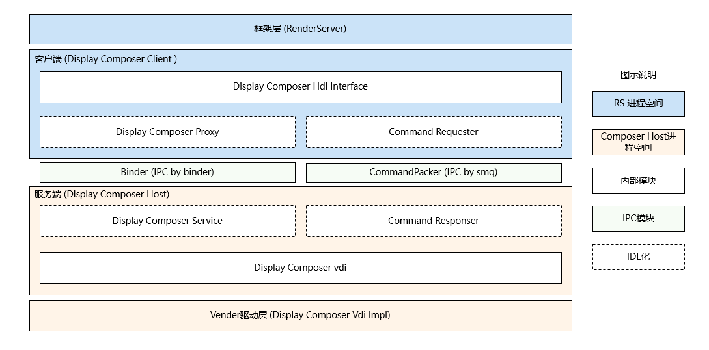
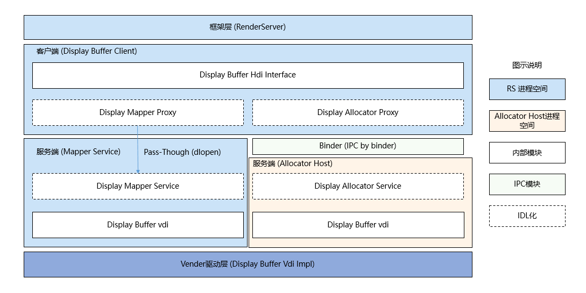

# Display VDI 接入指南

## 概述
显示VDI（Vendor Device Interface）接口是为了方便芯片厂商接入OpenHarmony显示驱动框架模型而提供的接口。
显示VDI接口分为Composer和Buffer部分：
- Composer：负责图层（Layer）合成和显示。
- Buffer：负责申请和释放SurfaceBuffer。

### Composer部分

**图 1**  Display Composer HDI架构　

　　　　　　　　

该框架模型内部分为三层，依次为框架层、HDI实现层、和Vendor驱动层。各层基本概念如下：

+ 框架层：对接HDI实现层的控制、图层的显示和合成，管理显示模块各个硬件设备等功能。
+ HDI实现层：实现OHOS（OpenHarmony Operation System）Composer HDI接口。
+ Vendor驱动层：屏蔽底层芯片和OS（Operation System）差异，支持多平台适配。

### Buffer部分

**图 2**  Display Buffer HDI架构　

　　　　　　　　

该框架模型内部分为三层，依次为框架层、HDI实现层、和Vendor驱动层。各层基本概念如下：

+ 框架层：对接HDI实现层的控制、图形buffer的申请和释放。
+ HDI实现层：实现OHOS（OpenHarmony Operation System）Buffer HDI接口。
+ Vendor驱动层：屏蔽底层芯片和OS（Operation System）差异，支持多平台适配。


## 开发指导

### Composer部分

#### 接口说明

注：以下接口列举的为VDI接口，接口声明见文件`/drivers/peripheral/display/composer/hdi_service/include/idisplay_composer_vdi.h`，获取路径为：[https://gitee.com/openharmony/drivers_peripheral/tree/master/display/composer](https://gitee.com/openharmony/drivers_peripheral/tree/master/display/composer)。
- idisplay_composer_vdi.h

  | 功能描述                     | 接口名称                                                     |
  | ---------------------------- | ------------------------------------------------------------ |
  | 注册热插拔事件回调                   | int32_t RegHotPlugCallback(HotPlugCallback cb, void* data) |
  | 获取显示设备能力集                   | int32_t GetDisplayCapability(uint32_t devId, DisplayCapability& info) |
  | 获取显示设备支持的显示模式信息         | int32_t GetDisplaySupportedModes(uint32_t devId, std::vector\<DisplayModeInfo\>& modes) |
  | 获取显示设备当前的显示模式            | int32_t GetDisplayMode(uint32_t devId, uint32_t& modeId) |
  | 设置显示设备的显示模式               | int32_t SetDisplayMode(uint32_t devId, uint32_t modeId) |
  | 获取显示设备当前的电源状态            | int32_t GetDisplayPowerStatus(uint32_t devId, DispPowerStatus& status) |
  | 设置显示设备当前的电源状态            | int32_t SetDisplayPowerStatus(uint32_t devId, DispPowerStatus status) |
  | 获取显示设备当前的背光值              | int32_t GetDisplayBacklight(uint32_t devId, uint32_t& level) |
  | 设置显示设备当前的背光值              | int32_t SetDisplayBacklight(uint32_t devId, uint32_t level) |
  | 获取显示设备属性值                   | int32_t GetDisplayProperty(uint32_t devId, uint32_t id, uint64_t& value) |
  | 获取显示设备合成类型有变化的layer      | int32_t GetDisplayCompChange(uint32_t devId, std::vector\<uint32_t\>& layers, std::vector\<int32_t\>& types) |
  | 设置显示设备的裁剪区域               | int32_t SetDisplayClientCrop(uint32_t devId, const IRect& rect) |
  | 设置显示设备的显示缓存               | int32_t SetDisplayClientBuffer(uint32_t devId, const BufferHandle& buffer, int32_t fence) |
  | 设置显示设备的显示脏区               | int32_t SetDisplayClientDamage(uint32_t devId, std::vector\<IRect\>& rects) |
  | 使能垂直同步信号                    | int32_t SetDisplayVsyncEnabled(uint32_t devId, bool enabled) |
  | 注册VBlank事件回调                 | int32_t RegDisplayVBlankCallback(uint32_t devId, VBlankCallback cb, void* data) |
  | 获取显示图层fence                  | int32_t GetDisplayReleaseFence(uint32_t devId, std::vector\<uint32_t\>& layers, std::vector\<int32_t\>& fences) |
  | 创建虚拟显示设备                    | int32_t CreateVirtualDisplay(uint32_t width, uint32_t height, int32_t& format, uint32_t& devId) |
  | 销毁虚拟显示设备                    | int32_t DestroyVirtualDisplay(uint32_t devId) |
  | 设置虚拟屏的输出缓存                 | int32_t SetVirtualDisplayBuffer(uint32_t devId, const BufferHandle& buffer, const int32_t fence) |
  | 设置显示设备属性值                  | int32_t SetDisplayProperty(uint32_t devId, uint32_t id, uint64_t value) |
  | 提交合成送显请求                   | int32_t Commit(uint32_t devId, int32_t& fence) |
  | 打开图层                          | int32_t CreateLayer(uint32_t devId, const LayerInfo& layerInfo, uint32_t& layerId) |
  | 关闭图层                          | int32_t DestroyLayer(uint32_t devId, uint32_t layerId) |
  | 准备要送显的图层                    | int32_t PrepareDisplayLayers(uint32_t devId, bool& needFlushFb) |
  | 设置图层alpha值                    | int32_t SetLayerAlpha(uint32_t devId, uint32_t layerId, const LayerAlpha& alpha) |
  | 设置图层区域                       | int32_t SetLayerRegion(uint32_t devId, uint32_t layerId, const IRect& rect) |
  | 设置图层裁剪区域                   | int32_t SetLayerCrop(uint32_t devId, uint32_t layerId, const IRect& rect) |
  | 设置图层Z轴次序                    | int32_t SetLayerZorder(uint32_t devId, uint32_t layerId, uint32_t zorder) |
  | 设置图层预乘                      | int32_t SetLayerPreMulti(uint32_t devId, uint32_t layerId, bool preMul) |
  | 设置图层转换模式                   | int32_t SetLayerTransformMode(uint32_t devId, uint32_t layerId, TransformType type) |
  | 设置图层刷新区域                   | int32_t SetLayerDirtyRegion(uint32_t devId, uint32_t layerId, const std::vector\<IRect\>& rects) |
  | 设置一个图层的可见区域               | int32_t SetLayerVisibleRegion(uint32_t devId, uint32_t layerId, std::vector\<IRect\>& rects) |
  | 设置一个层的缓冲区                  | int32_t SetLayerBuffer(uint32_t devId, uint32_t layerId, const BufferHandle& buffer, int32_t fence) |
  | 设置客户端期望的组合类型             | int32_t SetLayerCompositionType(uint32_t devId, uint32_t layerId, CompositionType type) |
  | 设置混合类型                       | int32_t SetLayerBlendType(uint32_t devId, uint32_t layerId, BlendType type) |
  | 设置图层蒙版信息                    | int32_t SetLayerMaskInfo(uint32_t devId, uint32_t layerId, const MaskInfo maskInfo) |
  | 设置纯色图层                        | int32_t SetLayerColor(uint32_t devId, uint32_t layerId, const LayerColor& layerColor) |

#### 开发步骤
下面以rk3568为例说明，Composer接入VDI开发过程主要包含以下步骤：

1. 实现Composer VDI接口

芯片厂商应实现idisplay_composer_vdi.h中定义的接口，接口定义如下：

```c++
  class DisplayComposerVdiImpl : public IDisplayComposerVdi {
  public:
      DisplayComposerVdiImpl();
      virtual ~DisplayComposerVdiImpl();
      virtual int32_t RegHotPlugCallback(HotPlugCallback cb, void* data) override;
      virtual int32_t GetDisplayCapability(uint32_t devId, DisplayCapability& info) override;
      virtual int32_t GetDisplaySupportedModes(uint32_t devId, std::vector<DisplayModeInfo>& modes) override;
      virtual int32_t GetDisplayMode(uint32_t devId, uint32_t& modeId) override;
      virtual int32_t SetDisplayMode(uint32_t devId, uint32_t modeId) override;
      virtual int32_t GetDisplayPowerStatus(uint32_t devId, DispPowerStatus& status) override;
      virtual int32_t SetDisplayPowerStatus(uint32_t devId, DispPowerStatus status) override;
      virtual int32_t GetDisplayBacklight(uint32_t devId, uint32_t& level) override;
      virtual int32_t SetDisplayBacklight(uint32_t devId, uint32_t level) override;
      virtual int32_t GetDisplayProperty(uint32_t devId, uint32_t id, uint64_t& value) override;
      virtual int32_t GetDisplayCompChange(uint32_t devId, std::vector<uint32_t>& layers,
          std::vector<int32_t>& types) override;
      virtual int32_t SetDisplayClientCrop(uint32_t devId, const IRect& rect) override;
      virtual int32_t SetDisplayClientBuffer(uint32_t devId, const BufferHandle& buffer, int32_t fence) override;
      virtual int32_t SetDisplayClientDamage(uint32_t devId, std::vector<IRect>& rects) override;
      virtual int32_t SetDisplayVsyncEnabled(uint32_t devId, bool enabled) override;
      virtual int32_t RegDisplayVBlankCallback(uint32_t devId, VBlankCallback cb, void* data) override;
      virtual int32_t GetDisplayReleaseFence(uint32_t devId, std::vector<uint32_t>& layers,
          std::vector<int32_t>& fences) override;
      virtual int32_t CreateVirtualDisplay(uint32_t width, uint32_t height, int32_t& format, uint32_t& devId) override;
      virtual int32_t DestroyVirtualDisplay(uint32_t devId) override;
      virtual int32_t SetVirtualDisplayBuffer(uint32_t devId, const BufferHandle& buffer, const int32_t fence) override;
      virtual int32_t SetDisplayProperty(uint32_t devId, uint32_t id, uint64_t value) override;
      virtual int32_t Commit(uint32_t devId, int32_t& fence) override;
      virtual int32_t CreateLayer(uint32_t devId, const LayerInfo& layerInfo, uint32_t& layerId) override;
      virtual int32_t DestroyLayer(uint32_t devId, uint32_t layerId) override;
      virtual int32_t PrepareDisplayLayers(uint32_t devId, bool& needFlushFb) override;
      virtual int32_t SetLayerAlpha(uint32_t devId, uint32_t layerId, const LayerAlpha& alpha) override;
      virtual int32_t SetLayerRegion(uint32_t devId, uint32_t layerId, const IRect& rect) override;
      virtual int32_t SetLayerCrop(uint32_t devId, uint32_t layerId, const IRect& rect) override;
      virtual int32_t SetLayerZorder(uint32_t devId, uint32_t layerId, uint32_t zorder) override;
      virtual int32_t SetLayerPreMulti(uint32_t devId, uint32_t layerId, bool preMul) override;
      virtual int32_t SetLayerTransformMode(uint32_t devId, uint32_t layerId, TransformType type) override;
      virtual int32_t SetLayerDirtyRegion(uint32_t devId, uint32_t layerId, const std::vector<IRect>& rects) override;
      virtual int32_t SetLayerVisibleRegion(uint32_t devId, uint32_t layerId, std::vector<IRect>& rects) override;
      virtual int32_t SetLayerBuffer(uint32_t devId, uint32_t layerId,
          const BufferHandle& buffer, int32_t fence) override;
      virtual int32_t SetLayerCompositionType(uint32_t devId, uint32_t layerId, CompositionType type) override;
      virtual int32_t SetLayerBlendType(uint32_t devId, uint32_t layerId, BlendType type) override;
      virtual int32_t SetLayerMaskInfo(uint32_t devId, uint32_t layerId, const MaskInfo maskInfo) override;
      virtual int32_t SetLayerColor(uint32_t devId, uint32_t layerId, const LayerColor& layerColor) override;
  };
  using CreateComposerVdiFunc = IDisplayComposerVdi* (*)();
  using DestroyComposerVdiFunc = void (*)(IDisplayComposerVdi* vdi);
  extern "C" IDisplayComposerVdi* CreateComposerVdi();
  extern "C" void DestroyComposerVdi(IDisplayComposerVdi* vdi);
```

2. 编译共享库

实现上述接口后，编译一个名为libdisplay_composer_vdi_impl.z.so的共享库。参考如下编译，BUILD.gn文件见`device/soc/rockchip/rk3568/hardware/display/BUILD.gn`，获取路径为：[https://gitee.com/openharmony/device_soc_rockchip/blob/master/rk3568/hardware/display/BUILD.gn](https://gitee.com/openharmony/device_soc_rockchip/blob/master/rk3568/hardware/display/BUILD.gn)。

```
  ohos_shared_library("libdisplay_composer_vdi_impl") {
    sources = [ "src/display_device/display_composer_vdi_impl.cpp" ]

    include_dirs = [
      "src/display_device",
      "${root_path}/drivers/peripheral/display/utils/include",
      "${root_path}/drivers/interface/display/composer",
      "${root_path}/drivers/peripheral/display/composer/hdi_service/include",
      "${root_path}/drivers/interface/display/composer/hdifd_parcelable",
    ]

    deps = [ ":display_composer_vendor" ]

    external_deps = [
      "c_utils:utils",
      "drivers_interface_display:display_composer_idl_headers",
      "graphic_chipsetsdk:buffer_handle",
      "hilog:libhilog",
      "ipc:ipc_single",
    ]

    install_enable = true
    install_images = [ chipset_base_dir ]
    subsystem_name = "hdf"
    part_name = "rockchip_products"
  }
```
BUILD.gn文件编写好后，可以在项目的根目录执行如下命令进行编译：

```
  ./build.sh -p rk3568 -T display_composer_model
```
执行完成后，即可在目录out/rk3568/hdf/rockchip_products中找到名为libdisplay_composer_vdi_impl.z.so的共享库。

#### 开发实例

OpenHarmony中有一个默认VDI实现，芯片厂商可参考此实现。见`drivers/peripheral/display/composer/vdi_base`，获取路径为：[https://gitee.com/openharmony/drivers_peripheral/tree/master/display/composer/vdi_base](https://gitee.com/openharmony/drivers_peripheral/tree/master/display/composer/vdi_base)。

### Buffer部分

#### 接口说明

注：以下接口列举的为VDI接口，接口声明见文件`/drivers/peripheral/display/buffer/hdi_service/include/idisplay_buffer_vdi.h`，获取路径为：[https://gitee.com/openharmony/drivers_peripheral/tree/master/display/buffer](https://gitee.com/openharmony/drivers_peripheral/tree/master/display/buffer)。
- idisplay_composer_vdi.h

  | 功能描述                     | 接口名称                                                     |
  | ---------------------------- | ------------------------------------------------------------ |
  | 申请Buffer                    | int32_t AllocMem(const AllocInfo& info, BufferHandle*& handle) |
  | 释放Buffer                    | void FreeMem(const BufferHandle& handle) |
  | 将Buffer映射到内存             | void* Mmap(const BufferHandle& handle) |
  | 解除Buffer内存映射             | int32_t Unmap(const BufferHandle& handle) |
  | 刷新Buffer缓存                 | int32_t FlushCache(const BufferHandle& handle) |
  | 废弃Buffer缓存                 | int32_t InvalidateCache(const BufferHandle& handle) |
  | 判断是否能申请请求的buffer       | int32_t IsSupportedAlloc(const std::vector<VerifyAllocInfo>& infos, std::vector<bool>& supporteds) |
  | 注册Buffer                    | int32_t RegisterBuffer(const BufferHandle& handle) |
  | 获取Buffer的元数据              | int32_t GetMetadata(const BufferHandle& handle, uint32_t key, std::vector<uint8_t>& value) |
  | 列出所有元数据的key             | int32_t ListMetadataKeys(const BufferHandle& handle, std::vector<uint32_t>& keys) |
  | 清除指定key的元数据信息          | int32_t EraseMetadataKey(const BufferHandle& handle, uint32_t key) |

#### 开发步骤
下面以rk3568为例说明，Buffer接入VDI开发过程主要包含以下步骤：

1. 实现Buffer VDI接口

芯片厂商应实现idisplay_buffer_vdi.h中定义的接口，接口定义如下：

```c++
  class DisplayBufferVdiImpl : public IDisplayBufferVdi {
  public:
      DisplayBufferVdiImpl();
      virtual ~DisplayBufferVdiImpl();

      virtual int32_t AllocMem(const AllocInfo& info, BufferHandle*& handle) const override;
      virtual void FreeMem(const BufferHandle& handle) const override;
      virtual void *Mmap(const BufferHandle& handle) const override;
      virtual int32_t Unmap(const BufferHandle& handle) const override;
      virtual int32_t FlushCache(const BufferHandle& handle) const override;
      virtual int32_t InvalidateCache(const BufferHandle& handle) const override;
      virtual int32_t IsSupportedAlloc(const std::vector<VerifyAllocInfo>& infos,
          std::vector<bool>& supporteds) const override;
      virtual int32_t RegisterBuffer(const BufferHandle& handle) override;
      virtual int32_t SetMetadata(const BufferHandle& handle, uint32_t key, const std::vector<uint8_t>& value) override;
      virtual int32_t GetMetadata(const BufferHandle& handle, uint32_t key, std::vector<uint8_t>& value) override;
      virtual int32_t ListMetadataKeys(const BufferHandle& handle, std::vector<uint32_t>& keys) override;
      virtual int32_t EraseMetadataKey(const BufferHandle& handle, uint32_t key) override;
  };
  using CreateDisplayBufferVdiFunc = IDisplayBufferVdi* (*)();
  using DestroyDisplayBufferVdiFunc = void (*)(IDisplayBufferVdi* vdi);
  extern "C" IDisplayBufferVdi* CreateDisplayBufferVdi();
  extern "C" void DestroyDisplayBufferVdi(IDisplayBufferVdi* vdi);
```

2. 编译共享库

实现上述接口后，编译一个名为libdisplay_buffer_vdi_impl.z.so的共享库。参考如下编译，BUILD.gn文件见`device/soc/rockchip/rk3568/hardware/display/BUILD.gn`，获取路径为：[https://gitee.com/openharmony/device_soc_rockchip/blob/master/rk3568/hardware/display/BUILD.gn](https://gitee.com/openharmony/device_soc_rockchip/blob/master/rk3568/hardware/display/BUILD.gn)。

```
  ohos_shared_library("libdisplay_buffer_vdi_impl") {
    sources = [ "src/display_gralloc/display_buffer_vdi_impl.cpp" ]

    public_configs = [ ":libdisplay_buffer_vdi_impl_config" ]

    include_dirs = [
      "./src/display_gralloc",
      "${root_path}/drivers/peripheral/base",
      "${root_path}/drivers/interface/display/composer/hdifd_parcelable",
      "${root_path}/drivers/interface/display/buffer",
      "${root_path}/drivers/peripheral/display/utils/include",
      "${root_path}/drivers/peripheral/display/buffer/hdi_service/include",
    ]

    output_name = "libdisplay_buffer_vdi_impl"
    cflags = [
      "-DGRALLOC_GBM_SUPPORT",
      "-Wno-macro-redefined",
    ]
    deps = [ ":libdisplay_buffer_vendor" ]

    external_deps = [
      "c_utils:utils",
      "drivers_interface_display:display_buffer_idl_headers",
      "drivers_interface_display:display_composer_idl_headers",
      "hdf_core:libhdf_utils",
      "hilog:libhilog",
      "ipc:ipc_single",
    ]

    install_enable = true
    install_images = [ chipset_base_dir ]
    innerapi_tags = [ "passthrough" ]
    subsystem_name = "hdf"
    part_name = "rockchip_products"
  }
```

BUILD.gn文件编写好后，可以在项目的根目录执行如下命令进行编译：

```
  ./build.sh -p rk3568 -T display_buffer_model
```
执行完成后，即可在目录out/rk3568/hdf/rockchip_products中找到名为libdisplay_buffer_vdi_impl.z.so的共享库。

#### 开发实例

OpenHarmony中有一个默认VDI实现，芯片厂商可参考此实现。见`drivers/peripheral/display/buffer/vdi_base`，获取路径为：[https://gitee.com/openharmony/drivers_peripheral/tree/master/display/buffer/vdi_base](https://gitee.com/openharmony/drivers_peripheral/tree/master/display/buffer/vdi_base)。