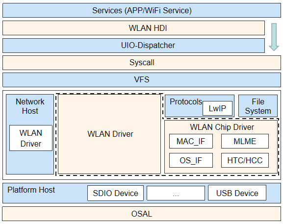
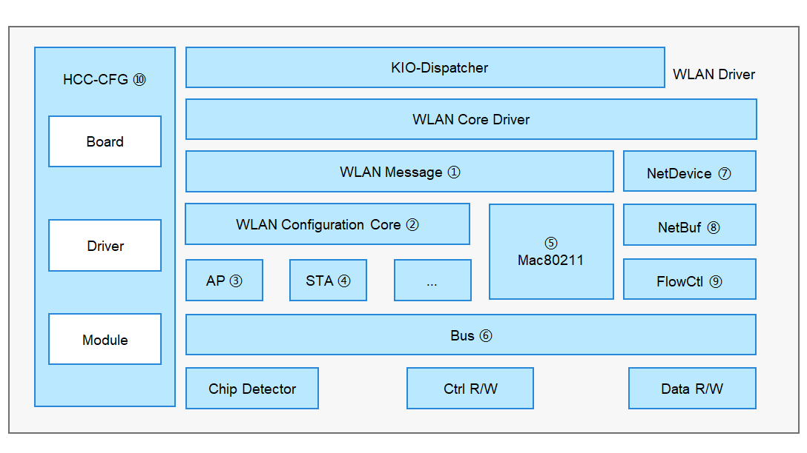

# WLAN


## 概述

### 功能简介

WLAN（Wireless Local Area Network）作为网络设备的一个重要特性，其驱动的开发也是设备开发过程中不可忽略的一部分。
在OpenHarmony架构中，基于HDF（Hardware Driver Foundation）驱动框架开发的WLAN驱动模块，具备跨操作系统迁移、自适应器件差异、模块化拼装编译等特性。

### 运作机制

各WLAN设备厂商的驱动开发人员可根据WLAN模块提供的向下、向上的统一接口适配各自的驱动代码：

- 向下统一接口实现的能力包括：建立/关闭WLAN热点、扫描、关联WLAN热点等。
- 对HDI层向上提供能力包括：设置MAC地址、设置发射功率、获取设备的MAC地址等。

WLAN框架如图1所示，其中WLAN Driver模块主要提供启动加载、配置文件解析、提供总线抽象接口等能力，WLAN Chip Driver模块主要提供MAC子层管理实体等。

  **图1** WLAN框架

  

  WLAN Driver框架如图2所示。

  **图2** WLAN Driver框架

  

WLAN Driver框架主要由如下模块组成：

1. WLAN Message：该部件为每个服务单独提供业务接口，每个服务也可依赖其他服务形成组合业务接口，此模块支持在用户态、内核态和MCU环境运行，实现组件间的充分解耦。

2. WLAN Configuration Core：WLAN相关的配置文件进行解析。

3. AP：AP（Access Point）为WLAN终端提供外部接入入口的设备。

4. STA：STA（Station）为接入WLAN系统的终端。

5. Mac80211：定义底层驱动相关的MAC层接口。

6. Bus：该驱动模块向上提供统一的总线抽象接口。通过向下调用Platform层提供的SDIO接口和封装适配USB、PCIE接口，屏蔽不同内核的差异；通过对不同类型的总线操作进行统一封装，屏蔽不同芯片差异，能够对不同芯片厂商提供完备的总线驱动能力，不同厂商共用此模块接口，从而使厂商的开发更为便捷和统一。

7. NetDevice：用于建立专属网络设备，屏蔽不同OS的差异，对WiFi驱动提供统一接口，提供统一的HDF NetDevice数据结构，及其统一管理、注册、去注册能力；对接轻设备及富设备上的Linux的网络设备层。

8. NetBuf：该部件为WLAN驱动提供Linux或者LiteOS原生的网络数据缓冲的统一数据结构的封装以及对网络数据的操作接口的封装。

9. FlowCtl：流控模块。

10. HCC-CFG：WLAN相关参数配置其中包括板级配置、驱动配置、Module配置。

其中主要模块关系如下：

1. WLAN Driver通过HCC-CFG模块和WLAN Configuration Core模块进行配置文件的解析与加载。

2. WLAN Message将用户态的消息按组件分发至AP、STA等模块。

3. 对于命令字段则下发至Mac80211，再通过Bus模块发送到WLAN芯片固件侧。

4. 协议栈与NetDevice模块、NetBuf模块、FlowCtl模块共同协同完成数据流交互。

## 开发指导

### 接口说明

WLAN模块有三部分对外开放的API接口，如下图所示：

1. 驱动直接调用WLAN模块能力接口。

2. 提供给各厂商实现的能力接口。

3. 对HDI层提供的能力接口


  **图3** WLAN驱动接口框架图

  

- WLAN驱动模块提供给驱动开发人员可直接调用的能力接口，主要功能有：创建/释放WifiModule、关联/取消关联、申请/释放NetBuf、lwip的pbuf和NetBuf的相互转换等。

  可直接调用的接口如表1、表2和表3所示。

    **表1** wifi_module.h

  | 接口名称 | 功能描述 | 
  | -------- | -------- |
  | struct&nbsp;WifiModule&nbsp;\*WifiModuleCreate(const&nbsp;struct&nbsp;HdfConfigWifiModuleConfig&nbsp;\*config) | 基于HDF开发WLAN驱动时，创建一个WifiModule。 | 
  | void&nbsp;WifiModuleDelete(struct&nbsp;WifiModule&nbsp;\*module) | 基于HDF开发WLAN驱动时，删除并释放WifiModule所有数据。 | 
  | int32_t&nbsp;DelFeature(struct&nbsp;WifiModule&nbsp;\*module,&nbsp;uint16_t&nbsp;featureType) | 基于HDF开发WLAN驱动时，从WifiModule删除一个功能组件。 | 
  | int32_t&nbsp;AddFeature(struct&nbsp;WifiModule&nbsp;\*module,&nbsp;uint16_t&nbsp;featureType,<br>&nbsp;struct&nbsp;WifiFeature&nbsp;\*featureData) | 基于HDF开发WLAN驱动时，注册一个功能组件到WifiModule。 | 

    **表2** wifi_mac80211_ops.h

  | 接口名称 | 功能描述 | 
  | -------- | -------- |
  | int32_t&nbsp;(\*startAp)(NetDevice&nbsp;\*netDev) | 启动AP。 | 
  | int32_t&nbsp;(\*stopAp)(NetDevice&nbsp;\*netDev) | 停止AP。 | 
  | int32_t&nbsp;(\*connect)(NetDevice&nbsp;\*netDev,&nbsp;WifiConnectParams&nbsp;\*param) | 开始关联。 | 
  | int32_t&nbsp;(\*disconnect)(NetDevice&nbsp;\*netDev,&nbsp;uint16_t&nbsp;reasonCode) | 取消关联。 | 

    **表3** hdf_netbuf.h

  | 接口名称 | 功能描述 | 
  | -------- | -------- |
  | static&nbsp;inline&nbsp;void&nbsp;NetBufQueueInit(struct&nbsp;NetBufQueue&nbsp;\*q) | 初始化NetBuf队列。 | 
  | struct&nbsp;NetBuf&nbsp;\*NetBufAlloc(uint32_t&nbsp;size) | 申请NetBuf。 | 
  | void&nbsp;NetBufFree(struct&nbsp;NetBuf&nbsp;\*nb) | 释放NetBuf | 
  | struct&nbsp;NetBuf&nbsp;\*Pbuf2NetBuf(const&nbsp;struct&nbsp;NetDevice&nbsp;\*netdev,&nbsp;struct&nbsp;pbuf&nbsp;\*lwipBuf) | lwip的pbuf转换为NetBuf。 | 
  | struct&nbsp;pbuf&nbsp;\*NetBuf2Pbuf(const&nbsp;struct&nbsp;NetBuf&nbsp;\*nb) | NetBuf转换为lwip的pbuf。 | 

- WLAN驱动模块也提供了需要驱动开发人员自行去填充具体实现内容的能力接口，主要功能有：初始化/注销NetDevice、打开/关闭NetDevice、获取NetDevice的状态等。提供的部分接口说明如表4所示：

    **表4** net_device.h

  | 接口名称 | 功能描述 | 
  | -------- | -------- |
  | int32_t&nbsp;(\*init)(struct&nbsp;NetDevice&nbsp;\*netDev) | 初始化NetDevice。 | 
  | struct&nbsp;NetDevStats&nbsp;\*(\*getStats)(struct&nbsp;NetDevice&nbsp;\*netDev) | 获取NetDevice的状态。 | 
  | int32_t&nbsp;(\*setMacAddr)(struct&nbsp;NetDevice&nbsp;\*netDev,&nbsp;void&nbsp;\*addr) | 设置Mac地址。 | 
  | void&nbsp;(\*deInit)(struct&nbsp;NetDevice&nbsp;\*netDev) | 注销NetDevice。 | 
  | int32_t&nbsp;(\*open)(struct&nbsp;NetDevice&nbsp;\*netDev) | 打开NetDevice。 | 
  | int32_t&nbsp;(\*stop)(struct&nbsp;NetDevice&nbsp;\*netDev) | 关闭NetDevice。 | 

- WLAN驱动模块对HDI层提供的能力接口，主要功能有：创建/销毁 IWiFi对象、设置MAC地址等。提供的部分接口说明如表5、表6所示：

    **表5** wifi_hal.h

  | 接口名称 | 功能描述 | 
  | -------- | -------- |
  | int32_t&nbsp;WifiConstruct(struct&nbsp;IWiFi&nbsp;\*\*wifiInstance) | 创建IWiFi对象，提供IWiFi基本能力。 | 
  | int32_t&nbsp;WifiDestruct(struct&nbsp;IWiFi&nbsp;\*\*wifiInstance) | 销毁IWiFi对象。 | 
  | int32_t&nbsp;(\*start)(struct&nbsp;IWiFi&nbsp;\*) | 创建HAL和驱动之间的通道及获取驱动支持的网卡信息。 | 
  | int32_t&nbsp;(\*stop)(struct&nbsp;IWiFi&nbsp;\*) | 销毁通道。 | 

    **表6** wifi_hal_base_feature.h

  | 接口名称 | 功能描述 | 
  | -------- | -------- |
  | int32_t&nbsp;(\*getFeatureType)(const&nbsp;struct&nbsp;IWiFiBaseFeature&nbsp;\*) | 获取特性的类型。 | 
  | int32_t&nbsp;(\*setMacAddress)(const&nbsp;struct&nbsp;IWiFiBaseFeature&nbsp;\*,&nbsp;unsigned&nbsp;char&nbsp;\*,&nbsp;uint8_t) | 设置MAC地址。 | 
  | int32_t&nbsp;(\*getDeviceMacAddress)(const&nbsp;struct&nbsp;IWiFiBaseFeature&nbsp;\*,&nbsp;unsigned&nbsp;char&nbsp;\*,&nbsp;uint8_t) | 获取设备持久化的MAC地址。 | 
  | int32_t&nbsp;(\*setTxPower)(const&nbsp;struct&nbsp;IWiFiBaseFeature&nbsp;\*,&nbsp;int32_t) | 设置发射功率。 | 


### 开发步骤

WLAN驱动基于HDF框架和PLATFORM框架开发，不区分OS和芯片平台，为不同厂商的WLAN模组提供统一的驱动模型，各WLAN模组厂商根据如下指导适配WLAN驱动框架。


1. 通过wifi_config.hcs文件，配置硬件（例如module、芯片等）相关的参数。此配置文件通过HDF框架中对应的接口解析后，生成全量配置的结构体对象。

2. Module初始化，创建Module。

3. 挂接Chip，初始化Chip。

4. 挂接上层WPA（Wi-Fi Protected Access）业务。

### 开发实例

本例程提供WLAN模块初始化过程的完整使用流程。示例如下（以Hi3881WLAN芯片为例）：

  1、根据硬件，修改配置参数。

```
/* 根据硬件参数，通过wlan_platform.hcs配置相关参数，以下是WLAN平台配置的示例 */
hisi :& deviceList {
    device0 :: deviceInst {
        deviceInstId = 0;
        powers {
            power0 {
                powerSeqDelay = 0;  /* 电源序列延时 */
                powerType = 1;      /* 电源类型：0--总是打开；1--GPIO */
                gpioId = 1;         /* GPIO管脚号 */
                activeLevel=1;      /* 有效电平：0--低；1--高 */
            }
            power1 {
                powerSeqDelay = 0;  /* 电源序列延时 */
                powerType = 0;      /* 电源类型：0--总是打开；1--GPIO */
            }
        }
        reset {
            resetType = 0;         /* 复位类型：0--不管理；1--GPIO */
            gpioId = 2;            /* GPIO管脚号 */
            activeLevel=1;         /* 有效电平：0--低；1--高 */
            resetHoldTime = 30;    /* 复位配置后的等待时间（ms） */
        }
        bootUpTimeout = 30;  /* 启动超时时间（ms） */
        bus {
            busType = 0;     /* 总线类型：0-sdio */
            busId = 2;      /* 总线号 */
            funcNum = [1];   /* SDIO功能号 */
            timeout = 1000;  /* 读/写数据的超时时间 */
            blockSize = 512; /* 读/写数据的块大小 */
        }
    }
}
/* 每一块芯片添加配置文件wlan_chip_<芯片名>.hcs（如：wlan_chip_hi3881.hcs），配置相关参数。以下是hi3881的配置示例 */
root {
    wlan_config {
        hi3881 :& chipList {
            chipHi3881 :: chipInst {
                match_attr = "hdf_wlan_chips_hi3881";  /* 配置匹配标识 */
                chipName = "hi3881";                   /* WLAN芯片的名称 */
                sdio {
                    vendorId = 0x0296;    /* 厂商Id */
                    deviceId = [0x5347];  /* 设备Id */
                }
            }
        }
    }
}
```

  2、适配挂接WLAN芯片的初始化和去初始化、WLAN芯片驱动的初始化和去初始化。

```
/* WLAN初始化挂接流程 */
#include "hdf_device_desc.h"
#include "hdf_wifi_product.h"
#include "hdf_log.h"
#include "osal_mem.h"
#include "hdf_wlan_chipdriver_manager.h"
#include "securec.h"
#include "wifi_module.h"
#include "hi_wifi_api.h"
#include "hi_types_base.h"

#define HDF_LOG_TAG Hi3881Driver

/* WLAN芯片的初始化和去初始化函数 */
int32_t InitHi3881Chip(struct HdfWlanDevice *device);
int32_t DeinitHi3881Chip(struct HdfWlanDevice *device);
/* WLAN芯片驱动的初始化和去初始化函数 */
int32_t Hi3881Deinit(struct HdfChipDriver* chipDriver, struct NetDevice *netDevice);
int32_t Hi3881Init(struct HdfChipDriver* chipDriver, struct NetDevice *netDevice);

/* 初始化mac80211与芯片侧的函数挂接 */
hi_void HiMac80211Init(struct HdfChipDriver *chipDriver);

static const char* const HI3881_DRIVER_NAME = "hisi";

/* WLAN芯片驱动挂接以及mac80211与芯片侧的函数挂接 */
static struct HdfChipDriver *BuildHi3881Driver(struct HdfWlanDevice *device, uint8_t ifIndex)
{
    struct HdfChipDriver *specificDriver = NULL;
    if (device == NULL) {
        HDF_LOGE("%s fail : channel is NULL", __func__);
        return NULL;
    }
    (void)device;
    (void)ifIndex;
    specificDriver = (struct HdfChipDriver *)OsalMemCalloc(sizeof(struct HdfChipDriver));
    if (specificDriver == NULL) {
        HDF_LOGE("%s fail: OsalMemCalloc fail!", __func__);
        return NULL;
    }
    if (memset_s(specificDriver, sizeof(struct HdfChipDriver), 0, sizeof(struct HdfChipDriver)) != EOK) {
        HDF_LOGE("%s fail: memset_s fail!", __func__);
        OsalMemFree(specificDriver);
        return NULL;
    }

    if (strcpy_s(specificDriver->name, MAX_WIFI_COMPONENT_NAME_LEN, HI3881_DRIVER_NAME) != EOK) {
        HDF_LOGE("%s fail : strcpy_s fail", __func__);
        OsalMemFree(specificDriver);
        return NULL;
    }
    specificDriver->init = Hi3881Init;
    specificDriver->deinit = Hi3881Deinit;

    HiMac80211Init(specificDriver);

    return specificDriver;
}

/* 释放WLAN芯片驱动 */
static void ReleaseHi3881Driver(struct HdfChipDriver *chipDriver)
{
    if (chipDriver == NULL) {
        return;
    }
    if (strcmp(chipDriver->name, HI3881_DRIVER_NAME) != 0) {
        HDF_LOGE("%s:Not my driver!", __func__);
        return;
    }
    OsalMemFree(chipDriver);
}

static uint8_t GetHi3881GetMaxIFCount(struct HdfChipDriverFactory *factory) {
    (void)factory;
    return 1;
}

/* WLAN芯片相关函数的注册 */
static int32_t HDFWlanRegHisiDriverFactory(void)
{
    static struct HdfChipDriverFactory tmpFactory = { 0 };
    struct HdfChipDriverManager *driverMgr = NULL;
    driverMgr = HdfWlanGetChipDriverMgr();
    if (driverMgr == NULL && driverMgr->RegChipDriver != NULL) {
        HDF_LOGE("%s fail: driverMgr is NULL!", __func__);
        return HDF_FAILURE;
    }
    tmpFactory.driverName = HI3881_DRIVER_NAME;
    tmpFactory.GetMaxIFCount = GetHi3881GetMaxIFCount;
    tmpFactory.InitChip = InitHi3881Chip;
    tmpFactory.DeinitChip = DeinitHi3881Chip;
    tmpFactory.Build = BuildHi3881Driver;
    tmpFactory.Release = ReleaseHi3881Driver;
    tmpFactory.ReleaseFactory = NULL;
    if (driverMgr->RegChipDriver(&tmpFactory) != HDF_SUCCESS) {
        HDF_LOGE("%s fail: driverMgr is NULL!", __func__);
        return HDF_FAILURE;
    }

    return HDF_SUCCESS;
}

static int32_t HdfWlanHisiChipDriverInit(struct HdfDeviceObject *device)
{
    (void)device;
    return HDFWlanRegHisiDriverFactory();
}

struct HdfDriverEntry g_hdfHisiChipEntry = {
    .moduleVersion = 1,
    .Init = HdfWlanHisiChipDriverInit,
    .moduleName = "HDF_WLAN_CHIPS"
};

HDF_INIT(g_hdfHisiChipEntry);
```


```
#include "hdf_wifi_product.h"
#include "hi_wifi_api.h"
#if (_PRE_OS_VERSION_LINUX == _PRE_OS_VERSION)
#include "oal_thread.h"
#include "osal_time.h"
#endif
#include "wifi_mac80211_ops.h"
#include "wal_cfg80211.h"
#include "net_adapter.h"
#include "hdf_wlan_utils.h"

#define HDF_LOG_TAG Hi3881Driver

/* WLAN芯片的初始化函数 */
int32_t InitHi3881Chip(struct HdfWlanDevice *device)
{
    uint8_t maxPortCount = 1;
    int32_t ret = HI_SUCCESS;
    uint8_t maxRetryCount = 2;
    if (device == NULL) {
        HDF_LOGE("%s:NULL ptr!", __func__);
        return HI_FAIL;
    }

    do {
        if (ret != HI_SUCCESS) {
            if (device->reset != NULL && device->reset->Reset != NULL) {
                device->reset->Reset(device->reset);
            }
            HDF_LOGE("%s:Retry init hi3881!last ret=%d", __func__, ret);
        }
        ret = hi_wifi_init(maxPortCount);
    } while (ret != 0 && --maxRetryCount > 0);

    if (ret != 0) {
        HDF_LOGE("%s:Init hi3881 driver failed!", __func__);
        return ret;
    }
    return HI_SUCCESS;
}

/* WLAN芯片的去初始化函数 */
int32_t DeinitHi3881Chip(struct HdfWlanDevice *device)
{
    (void)device;
    int32_t ret = hi_wifi_deinit();
    if (ret != 0) {
        HDF_LOGE("%s:Deinit failed!ret=%d", __func__, ret);
    }
    return ret;
}

/* WLAN芯片驱动的初始化函数 */
int32_t Hi3881Init(struct HdfChipDriver *chipDriver, struct NetDevice *netDevice)
{
    HDF_LOGI("%s: start...", __func__);
    hi_u16 mode = wal_get_vap_mode();
    int32_t ret;
    nl80211_iftype_uint8 type;
    (void)chipDriver;

    if (mode >= WAL_WIFI_MODE_BUTT) {
        oam_error_log1(0, 0, "wal_init_drv_netdev:: invalid mode[%d]", mode);
        return HI_FAIL;
    }

    if (mode == WAL_WIFI_MODE_STA) {
        type = NL80211_IFTYPE_STATION;
    } else if (mode == WAL_WIFI_MODE_AP) {
        type = NL80211_IFTYPE_AP;
    } else {
        oam_error_log1(0, 0, "wal_init_drv_netdev:: invalid mode[%d]", mode);
        return HI_FAIL;
    }

    ret = wal_init_drv_wlan_netdev(type, WAL_PHY_MODE_11N, netDevice);
    if (ret != HI_SUCCESS) {
        oam_error_log2(0, OAM_SF_ANY, "wal_init_drv_netdev %s failed.l_return:%d\n", netDevice->name, ret);
    }
    return ret;
}

/* WLAN芯片驱动的去初始化函数 */
int32_t Hi3881Deinit(struct HdfChipDriver *chipDriver, struct NetDevice *netDevice)
{
    (void)chipDriver;
    int32_t ret = wal_deinit_drv_wlan_netdev(netDevice);
    if (ret != HDF_SUCCESS) {
        return ret;
    }
    return ReleasePlatformNetDevice(netDevice);
}
```

  3、在芯片侧初始化过程中调用netdev的init和add接口进行初始化netdev，并挂接netdev的一些函数指针。

```
hi_s32 wal_init_drv_wlan_netdev(nl80211_iftype_uint8 type, wal_phy_mode mode, hi_char* ifname, hi_u32* len)
{
    oal_net_device_stru *netdev          = HI_NULL;

    ......
    /* 初始化网络设备，获取对应的实例 */
    netdev = NetDeviceInit(ifname, *len, LITE_OS);
    oal_wireless_dev *wdev = (oal_wireless_dev *)oal_mem_alloc(OAL_MEM_POOL_ID_LOCAL, sizeof(oal_wireless_dev));
    ret = wal_init_netif(type, netdev, wdev);

    ......

    return HI_SUCCESS;
}
/* 挂接netdev的一些函数指针，详细挂接函数{@link NetDeviceInterFace} */
oal_net_device_ops_stru g_wal_net_dev_ops =
{
    .getStats          = wal_netdev_get_stats,
    .open               = wal_netdev_open,
    .stop               = wal_netdev_stop,
    .xmit         = hmac_bridge_vap_xmit,
    .ioctl           = wal_net_device_ioctl,
    .changeMtu         = oal_net_device_change_mtu,
    .init              = oal_net_device_init,
    .deInit            = oal_net_free_netdev,
#if (defined(_PRE_WLAN_FEATURE_FLOWCTL) || defined(_PRE_WLAN_FEATURE_OFFLOAD_FLOWCTL))
    .selectQueue       = wal_netdev_select_queue,
#endif
    .setMacAddr    = wal_netdev_set_mac_addr,
#if (_PRE_OS_VERSION_LITEOS == _PRE_OS_VERSION)
    .netifNotify       = HI_NULL,
#endif
    .specialEtherTypeProcess = SpecialEtherTypeProcess,
};

hi_s32 wal_init_netif(nl80211_iftype_uint8 type, oal_net_device_stru *netdev, const oal_wireless_dev *wdev)
{
    /* 添加网络设备到协议栈 */
    hi_u32 ret = NetDeviceAdd(netdev, (Protocol80211IfType)type);

    ......

    return HI_SUCCESS;
}
```

4、WifiMac80211Ops中的函数挂接实现。


```
/* 挂接mac80211的一些函数指针 */

/* 驱动需要实现的MAC层基本能力的控制接口 */
static struct HdfMac80211BaseOps g_baseOps = {
    .SetMode = WalSetMode,
    .AddKey = WalAddKey,
    .DelKey = WalDelKey,
    .SetDefaultKey = WalSetDefaultKey,
    .GetDeviceMacAddr = WalGetDeviceMacAddr,
    .SetMacAddr = WalSetMacAddr,
    .SetTxPower = WalSetTxPower,
    .GetValidFreqsWithBand = WalGetValidFreqsWithBand,
    .GetHwCapability = WalGetHwCapability
};

/* 驱动需要实现的MAC层STA能力的控制接口 */
static struct HdfMac80211STAOps g_staOps = {
    .Connect = WalConnect,
    .Disconnect = WalDisconnect,
    .StartScan = WalStartScan,
    .AbortScan = WalAbortScan,
    .SetScanningMacAddress = WalSetScanningMacAddress,
};

/* 驱动需要实现的MAC层AP能力的控制接口 */
static struct HdfMac80211APOps g_apOps = {
    .ConfigAp = WalConfigAp,
    .StartAp = WalStartAp,
    .StopAp = WalStopAp,
    .ConfigBeacon = WalChangeBeacon,
    .DelStation = WalDelStation,
    .SetCountryCode = WalSetCountryCode,
    .GetAssociatedStasCount = WalGetAssociatedStasCount,
    .GetAssociatedStasInfo = WalGetAssociatedStasInfo
};

/* 初始化mac80211与芯片侧的函数挂接 */
hi_void HiMac80211Init(struct HdfChipDriver *chipDriver)
{
    if (chipDriver == NULL) {
        oam_error_log(0, OAM_SF_ANY, "%s:input is NULL!", __func__);
        return;
    }
    chipDriver->ops = &g_baseOps;
    chipDriver->staOps = &g_staOps;
    chipDriver->apOps = &g_apOps;
}
```
## 参考

- 代码仓库如下：

  [drivers\_hdf\_core](https://gitee.com/openharmony/drivers_hdf_core)

  [drivers\_peripheral](https://gitee.com/openharmony/drivers_peripheral)

- 代码路径如下：

  WLAN模块流控组件liteos适配：//drivers/hdf_core/adapter/khdf/liteos/model/network/wifi

  HDF网络模型liteos适配：//drivers/hdf_core/adapter/khdf/liteos/model/network

  WLAN模块流控组件Linux适配、HDF WLAN模型及VENDOR WLAN驱动编译：

  //drivers/hdf_core/adapter/khdf/linux/model/network/wifi

  WLAN模块实现核心代码：//drivers/hdf_core/framework/model/network/wifi

  WLAN模块对外接口：//drivers/hdf_core/framework/include/wifi

  HDF网络模型接口：//drivers/hdf_core/framework/include/net

  WLAN HDI接口及具体实现：//drivers/peripheral/wlan
