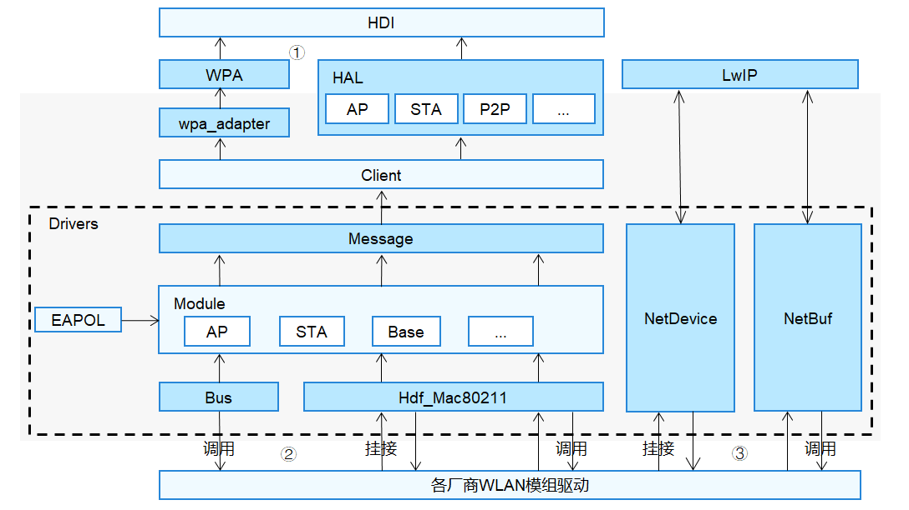

# WLAN


## 概述

### 功能简介

无线局域网数据传输是端侧设备不可或缺的一部分，用户可以方便地接入到无线网络进行数据传输和共享，并且在无线网络覆盖区域自由移动，彻底摆脱有线的束缚。基于HDF（Hardware Driver Foundation）驱动框架开发的WLAN驱动，能够屏蔽硬件器件差异，为上层WLAN服务提供稳定的基础能力接口，包括启动扫描、关联/取消关联热点、获取MAC地址、设置MAC地址、获取链路信息等。

### 基本概念

开发前，开发者应了解以下WLAN涉及的基本概念：

- AP
  
  无线接入点（Access Point，简称AP），是网络的中心节点，提供无线接入服务。其它无线设备接入后，可以进行数据访问。

- STA
  
  站点（Station，简称STA），是无线局域网的最基本组成单元。每一个连接到无线网络中的终端（如笔记本电脑、PDA及其它可以联网的用户设备）都可称为一个站点。

- ssid
  
  无线网络的名称，用来标识一个无线网络，每个无线网络都有自己的ssid。

- bssid
  
  用于标识WLAN中的基本服务集，是唯一的48位MAC地址。
  
- Scan

  终端设备扫描环境中的无线网络，获取到周围的无线网络信息。包括热点名称（ssid）、工作频带和信号强度等。

- Associate

  终端设备指定有效的热点进行连接，成功后即可与AP端数据通信。终端同一时刻只可以和一个AP建立链路。

### 运作机制

本文主要介绍基于HDF（Hardware Driver Foundation）驱动框架开发的WLAN功能。WLAN整体框架：



1. 上层服务基于业务需要调用HDI接口，将用户态消息通过WPA层或HAL层下发至Client层。WPA层接口提供设置加密方式、关联热点、设置信道、隐藏热点等功能，HAL层接口作为WPA接口的补充，提供设置国家码、设置MAC地址、获取信道信息等功能。
   
2. Message模块将用户态的消息按组件分发至AP、STA等模块。
   
3. Hdf_Mac80211定义底层驱动相关的MAC层接口。命令字段下发至Hdf_Mac80211，再通过Bus模块发送到WLAN芯片固件侧。
   
4. Bus模块向上提供统一的总线抽象接口。通过向下调用Platform层提供的SDIO接口和封装适配USB、PCIE接口，屏蔽不同内核的差异；通过对不同类型的总线操作进行统一封装，屏蔽不同芯片差异，能够对不同芯片厂商提供完备的总线驱动能力，不同厂商共用此模块接口，从而使厂商的开发更为便捷和统一。
   
5. EAPOL（Extensible Authentication Protocol Over LAN），基于局域网的扩展认证协议，主要用于在客户端和设备（接入设备、服务器）之间传送EAP协议报文，以允许EAP协议报文在LAN上传送，完成认证流程，实现设备上线功能。
   
6. NetDevice用于建立专属网络设备，屏蔽不同OS的差异，对WiFi驱动提供统一接口，提供统一的HDF NetDevice数据结构，及其统一管理、注册、去注册能力；对接轻设备及富设备上的Linux的网络设备层。
   
7. NetBuf为WLAN驱动提供Linux或者LiteOS原生的网络数据缓冲的统一数据结构的封装以及对网络数据的操作接口的封装。
   
8. 协议栈与NetDevice模块、NetBuf模块共同协同完成数据流交互。

### 约束与限制

WLAN驱动为上层WLAN服务提供稳定的基础能力接口，HDI接口适用于标准系统，HAL接口适用于小型系统及轻量系统。

## 开发指导

### 场景介绍

WLAN驱动的主要工作是为上层WLAN服务提供稳定的基础能力接口，保证用户可以方便地接入到无线网络，实现数据传输和共享。不同WLAN模组需要适配OpenHarmony时，请参考如下的接口说明和开发步骤。

### 接口说明

WLAN模块有三部分对外开放的API接口：

1. 对上层服务提供HDI以及HAL能力接口。

2. 提供给各厂商实现的能力接口。

3. 驱动直接调用WLAN模块能力接口。

- WLAN驱动模块对上层服务提供的能力接口，主要功能有：创建/销毁IWiFi对象、设置MAC地址、设置发射功率等。以下接口列举的为IDL接口描述生成的对应C语言函数接口，如表1、表2所示。接口声明见idl文件（/drivers/interface/wlan/v1_1/）。

    **表1** wifi_hal.h

  | 接口名称 | 功能描述 | 
  | -------- | -------- |
  | int32_t&nbsp;WifiConstruct(struct&nbsp;IWiFi&nbsp;\*\*wifiInstance) | 创建IWiFi对象，提供IWiFi基本能力。 | 
  | int32_t&nbsp;WifiDestruct(struct&nbsp;IWiFi&nbsp;\*\*wifiInstance) | 销毁IWiFi对象。 | 
  | int32_t&nbsp;(\*start)(struct&nbsp;IWiFi&nbsp;\*) | 创建HAL和驱动之间的通道及获取驱动支持的网卡信息。 | 
  | int32_t&nbsp;(\*stop)(struct&nbsp;IWiFi&nbsp;\*) | 销毁通道。 | 

    **表2** wifi_hal_base_feature.h

  | 接口名称 | 功能描述 | 
  | -------- | -------- |
  | int32_t&nbsp;(\*getFeatureType)(const&nbsp;struct&nbsp;IWiFiBaseFeature&nbsp;\*) | 获取特性的类型。 | 
  | int32_t&nbsp;(\*setMacAddress)(const&nbsp;struct&nbsp;IWiFiBaseFeature&nbsp;\*,&nbsp;unsigned&nbsp;char&nbsp;\*,&nbsp;uint8_t) | 设置MAC地址。 | 
  | int32_t&nbsp;(\*getDeviceMacAddress)(const&nbsp;struct&nbsp;IWiFiBaseFeature&nbsp;\*,&nbsp;unsigned&nbsp;char&nbsp;\*,&nbsp;uint8_t) | 获取设备持久化的MAC地址。 | 
  | int32_t&nbsp;(\*setTxPower)(const&nbsp;struct&nbsp;IWiFiBaseFeature&nbsp;\*,&nbsp;int32_t) | 设置发射功率。 |

- WLAN驱动模块提供了需要驱动开发人员自行去填充具体实现内容的能力接口，主要功能有：初始化/注销NetDevice、打开/关闭NetDevice、获取NetDevice的状态等。提供的部分接口说明如表3所示：

    **表3** net_device.h

  | 接口名称 | 功能描述 | 
  | -------- | -------- |
  | int32_t&nbsp;(\*init)(struct&nbsp;NetDevice&nbsp;\*netDev) | 初始化NetDevice。 | 
  | struct&nbsp;NetDevStats&nbsp;\*(\*getStats)(struct&nbsp;NetDevice&nbsp;\*netDev) | 获取NetDevice的状态。 | 
  | int32_t&nbsp;(\*setMacAddr)(struct&nbsp;NetDevice&nbsp;\*netDev,&nbsp;void&nbsp;\*addr) | 设置Mac地址。 | 
  | void&nbsp;(\*deInit)(struct&nbsp;NetDevice&nbsp;\*netDev) | 注销NetDevice。 | 
  | int32_t&nbsp;(\*open)(struct&nbsp;NetDevice&nbsp;\*netDev) | 打开NetDevice。 | 
  | int32_t&nbsp;(\*stop)(struct&nbsp;NetDevice&nbsp;\*netDev) | 关闭NetDevice。 | 

- WLAN驱动模块提供给驱动开发人员可直接调用的能力接口，主要功能有：创建/释放WifiModule、关联/取消关联、申请/释放NetBuf、lwip的pbuf和NetBuf的相互转换等。

  可直接调用的接口如表4、表5和表6所示。

    **表4** wifi_module.h

  | 接口名称 | 功能描述 | 
  | -------- | -------- |
  | struct&nbsp;WifiModule&nbsp;\*WifiModuleCreate(const&nbsp;struct&nbsp;HdfConfigWifiModuleConfig&nbsp;\*config) | 基于HDF开发WLAN驱动时，创建一个WifiModule。 | 
  | void&nbsp;WifiModuleDelete(struct&nbsp;WifiModule&nbsp;\*module) | 基于HDF开发WLAN驱动时，删除并释放WifiModule所有数据。 | 
  | int32_t&nbsp;DelFeature(struct&nbsp;WifiModule&nbsp;\*module,&nbsp;uint16_t&nbsp;featureType) | 基于HDF开发WLAN驱动时，从WifiModule删除一个功能组件。 | 
  | int32_t&nbsp;AddFeature(struct&nbsp;WifiModule&nbsp;\*module,&nbsp;uint16_t&nbsp;featureType,<br>&nbsp;struct&nbsp;WifiFeature&nbsp;\*featureData) | 基于HDF开发WLAN驱动时，注册一个功能组件到WifiModule。 | 

    **表5** wifi_mac80211_ops.h

  | 接口名称 | 功能描述 | 
  | -------- | -------- |
  | int32_t&nbsp;(\*startAp)(NetDevice&nbsp;\*netDev) | 启动AP。 | 
  | int32_t&nbsp;(\*stopAp)(NetDevice&nbsp;\*netDev) | 停止AP。 | 
  | int32_t&nbsp;(\*connect)(NetDevice&nbsp;\*netDev,&nbsp;WifiConnectParams&nbsp;\*param) | 开始关联。 | 
  | int32_t&nbsp;(\*disconnect)(NetDevice&nbsp;\*netDev,&nbsp;uint16_t&nbsp;reasonCode) | 取消关联。 | 

    **表6** hdf_netbuf.h

  | 接口名称 | 功能描述 | 
  | -------- | -------- |
  | static&nbsp;inline&nbsp;void&nbsp;NetBufQueueInit(struct&nbsp;NetBufQueue&nbsp;\*q) | 初始化NetBuf队列。 | 
  | struct&nbsp;NetBuf&nbsp;\*NetBufAlloc(uint32_t&nbsp;size) | 申请NetBuf。 | 
  | void&nbsp;NetBufFree(struct&nbsp;NetBuf&nbsp;\*nb) | 释放NetBuf。 | 
  | struct&nbsp;NetBuf&nbsp;\*Pbuf2NetBuf(const&nbsp;struct&nbsp;NetDevice&nbsp;\*netdev,&nbsp;struct&nbsp;pbuf&nbsp;\*lwipBuf) | lwip的pbuf转换为NetBuf。 | 
  | struct&nbsp;pbuf&nbsp;\*NetBuf2Pbuf(const&nbsp;struct&nbsp;NetBuf&nbsp;\*nb) | NetBuf转换为lwip的pbuf。 |

### 开发步骤

WLAN驱动基于HDF框架和Platform框架开发，不区分OS和芯片平台，为不同厂商的WLAN模组提供统一的驱动模型，各WLAN模组厂商根据如下开发流程适配WLAN驱动框架。示例以Hi3881WLAN芯片为例。

#### 配置Driver的HCS文件

   HCS文件配置包括：device相关配置和组件配置。

   - device相关配置

     配置文件内容包括：电源配置、复位配置和总线配置。

     配置文件路径：vendor/<厂商名>/<设备名>/hdf_config/khdf/wifi。

     根据硬件具体情况，在wlan_platform.hcs中配置相关参数，以下是WLAN平台配置的示例：
        ```text
        hisi :& deviceList {
            device0 :: deviceInst {
                deviceInstId = 0;
                powers {
                    power0 {
                        powerSeqDelay = 0;  /* 电源序列延时 */
                        powerType = 1;      /* 电源类型，0表示总是打开；1表示GPIO */
                        gpioId = 1;         /* GPIO管脚号 */
                        activeLevel=1;      /* 有效电平，0表示低电平有效；1表示高电平有效 */
                    }
                    power1 {
                        powerSeqDelay = 0;  /* 电源序列延时 */
                        powerType = 0;      /* 电源类型，0表示总是打开；1表示GPIO */
                    }
                }
                reset {
                    resetType = 0;         /* 复位类型，0表示不管理；1表示GPIO */
                    gpioId = 2;            /* GPIO管脚号 */
                    activeLevel=1;         /* 有效电平，0表示低电平有效；1表示高电平有效 */
                    resetHoldTime = 30;    /* 复位配置后的等待时间（ms） */
                }
                bootUpTimeout = 30;  /* 启动超时时间（ms） */
                bus {
                    busEnable = 1;   /* bus总线是否初始化，0-表示不初始化; 1表示初始化 */
                    busType = 0;     /* 总线类型，0表示sdio */
                    busId = 2;       /* 总线号 */
                    funcNum = [1];   /* SDIO功能号 */
                    timeout = 1000;  /* 读/写数据的超时时间 */
                    blockSize = 512; /* 读/写数据的块大小 */
                }
            }
        }
        ```
   - 组件配置

     每一块芯片添加配置文件wlan_chip_<芯片名>.hcs（如：wlan_chip_hi3881.hcs），配置相关参数。以下是hi3881的配置示例：
        ```text
        root {
            wlan_config {
                hi3881 :& chipList {
                    chipHi3881 :: chipInst {
                        match_attr = "hdf_wlan_chips_hi3881";  /* 配置匹配标识 */
                        chipName = "hi3881";                   /* WLAN芯片的名称 */
                        bus {
                            vendorId = 0x0296;    /* 厂商ID */
                            deviceId = [0x5347];  /* 设备ID */
                        }
                    }
                }
            }
        }
        ```

#### 初始化和去初始化WLAN芯片、WLAN芯片驱动

   - 驱动适配入口函数实现

     根据各自的芯片定义一个HdfDriverEntry类型的变量，主要实现Bind、Init、Release接口的函数挂接。调用HDF_INIT将驱动入口注册到HDF框架中，在加载驱动时HDF框架会先调用Bind函数，再调用Init函数加载该驱动。当Init调用异常时，HDF框架会调用Release释放驱动资源。
     ```c
     struct HdfDriverEntry g_hdfHisiChipEntry = {
        .moduleVersion = 1,
        .Bind = HdfWlanHisiDriverBind,
        .Init = HdfWlanHisiChipDriverInit,
        .Release = HdfWlanHisiChipRelease,
        .moduleName = "HDF_WLAN_CHIPS"
     };

     HDF_INIT(g_hdfHisiChipEntry);
     ```

   - 芯片初始化，芯片驱动初始化函数的注册
     
     InitChip/DeinitChip接口挂接芯片初始化、去初始化的函数实现。

     Build/Release接口挂接芯片驱动的初始化、去初始化函数实现。

     ```c
     /* WLAN芯片相关函数的注册 */
     static int32_t HDFWlanRegHisiDriverFactory(void)
     {
         static struct HdfChipDriverFactory tmpFactory = { 0 };
         struct HdfChipDriverManager *driverMgr = NULL;
         driverMgr = HdfWlanGetChipDriverMgr();
         if (driverMgr == NULL) {
             HDF_LOGE("%s fail: driverMgr is NULL!", __func__);
             return HDF_FAILURE;
         }
         tmpFactory.driverName = HI3881_DRIVER_NAME;
         tmpFactory.GetMaxIFCount = GetHi3881GetMaxIFCount;
         tmpFactory.InitChip = InitHi3881Chip;
         tmpFactory.DeinitChip = DeinitHi3881Chip;
         tmpFactory.Build = BuildHi3881Driver;
         tmpFactory.Release = ReleaseHi3881Driver;
         tmpFactory.ReleaseFactory = NULL;
         if (driverMgr->RegChipDriver(&tmpFactory) != HDF_SUCCESS) {
             HDF_LOGE("%s fail: driverMgr is NULL!", __func__);
             return HDF_FAILURE;
         }

         return HDF_SUCCESS;
     }

     static int32_t HdfWlanHisiChipDriverInit(struct HdfDeviceObject *device)
     {
         (void)device;
         return HDFWlanRegHisiDriverFactory();
     }
     ```

     1. 芯片的初始化和去初始化

      ```c
      /* WLAN芯片的初始化函数 */
      int32_t InitHi3881Chip(struct HdfWlanDevice *device)
      {
          uint8_t maxPortCount = 3;
          int32_t ret = HI_SUCCESS;
          uint8_t maxRetryCount = 3;
          if (device == NULL || device->bus == NULL) {
              HDF_LOGE("%s:NULL ptr!", __func__);
              return HI_FAIL;
          }

          do {
              if (ret != HI_SUCCESS) {
                  if (device->reset != NULL && device->reset->Reset != NULL) {
                      device->reset->Reset(device->reset);
                  }
                  HDF_LOGE("%s:Retry init hi3881!last ret=%d", __func__, ret);
              }
              ret = hi_wifi_init(maxPortCount, device->bus);
          } while (ret != 0 && --maxRetryCount > 0);

          if (ret != 0) {
              HDF_LOGE("%s:Init hi3881 driver failed!", __func__);
              return ret;
          }
          return HI_SUCCESS;
      }

      /* WLAN芯片的去初始化函数 */
      int32_t DeinitHi3881Chip(struct HdfWlanDevice *device)
      {
          (void)device;
          int32_t ret = hi_wifi_deinit();
          if (ret != 0) {
              HDF_LOGE("%s:Deinit failed!ret=%d", __func__, ret);
          }
          return ret;
      }
      ```

     2. 芯片驱动的初始化和去初始化
   
      ```c
      /* WLAN芯片驱动挂接以及Mac80211与芯片侧的函数挂接 */
      static struct HdfChipDriver *BuildHi3881Driver(struct HdfWlanDevice *device, uint8_t ifIndex)
      {
          struct HdfChipDriver *specificDriver = NULL;
          if (device == NULL) {
              HDF_LOGE("%s fail: channel is NULL!", __func__);
              return NULL;
          }
          (void)ifIndex;
          specificDriver = (struct HdfChipDriver *)OsalMemCalloc(sizeof(struct HdfChipDriver));
          if (specificDriver == NULL) {
              HDF_LOGE("%s fail: OsalMemCalloc fail!", __func__);
              return NULL;
          }
          if (memset_s(specificDriver, sizeof(struct HdfChipDriver), 0, sizeof(struct HdfChipDriver)) != EOK) {
              HDF_LOGE("%s fail: memset_s fail!", __func__);
              OsalMemFree(specificDriver);
              return NULL;
          }

          if (strcpy_s(specificDriver->name, MAX_WIFI_COMPONENT_NAME_LEN, HI3881_DRIVER_NAME) != EOK) {
              HDF_LOGE("%s fail: strcpy_s fail!", __func__);
              OsalMemFree(specificDriver);
              return NULL;
          }
          specificDriver->init = Hi3881Init;
          specificDriver->deinit = Hi3881Deinit;

          HiMac80211Init(specificDriver);

          return specificDriver;
      }

      /* 释放WLAN芯片驱动 */
      static void ReleaseHi3881Driver(struct HdfChipDriver *chipDriver)
      {
          if (chipDriver == NULL) {
              return;
          }
          if (strcmp(chipDriver->name, HI3881_DRIVER_NAME) != 0) {
              HDF_LOGE("%s:Not my driver!", __func__);
              return;
          }
          OsalMemFree(chipDriver);
      }

      /* WLAN芯片驱动的初始化函数 */
      int32_t Hi3881Init(struct HdfChipDriver *chipDriver, struct NetDevice *netDevice)
      {
          hi_u16 mode;
          int32_t ret;
          nl80211_iftype_uint8 type;
          (void)chipDriver;
          HDF_LOGI("%s: start...", __func__);
          mode = wal_get_vap_mode();
          if (mode >= WAL_WIFI_MODE_BUTT) {
              oam_error_log1(0, 0, "wal_init_drv_netdev:: invalid mode[%d]", mode);
              return HI_FAIL;
          }
          if (mode == WAL_WIFI_MODE_STA) {
              type = NL80211_IFTYPE_STATION;
      #ifdef _PRE_WLAN_FEATURE_P2P
               if (InitNetdev(netDevice, NL80211_IFTYPE_P2P_DEVICE) != HI_SUCCESS) {
                  return HI_FAIL;
              }
      #endif
          } else if (mode == WAL_WIFI_MODE_AP) {
              type = NL80211_IFTYPE_AP;
          } else {
              oam_error_log1(0, 0, "wal_init_drv_netdev:: invalid mode[%d]", mode);
              return HI_FAIL;
          }
          ret = wal_init_drv_wlan_netdev(type, WAL_PHY_MODE_11N, netDevice);
          if (ret != HI_SUCCESS) {
              oam_error_log2(0, OAM_SF_ANY, "wal_init_drv_netdev %s failed.l_return:%d\n", netDevice->name, ret);
          }
          return ret;
      }

      /* WLAN芯片驱动的去初始化函数 */
      int32_t Hi3881Deinit(struct HdfChipDriver *chipDriver, struct NetDevice *netDevice)
      {
          int32_t ret;
          (void)chipDriver;
          ret = DeinitNetdev(NL80211_IFTYPE_P2P_DEVICE);
          if (ret != HI_SUCCESS) {
              oam_error_log1(0, OAM_SF_ANY, "Hi3881Deinit: DeinitNetdev p2p device fail, ret = %d\n",  ret);
              return ret;
          }
          return wal_deinit_drv_wlan_netdev(netDevice);
      }

      ```

      在芯片驱动初始化过程中调用netdev的init和add接口进行初始化netdev，并挂接netdev的一些函数指针。

      ```c
      hi_s32 wal_init_drv_wlan_netdev(nl80211_iftype_uint8 type, wal_phy_mode mode, oal_net_device_stru *netdev)
      {
          hi_char *ac_mode_str = NULL;
          hi_s32 ret;
          if (oal_unlikely(netdev == HI_NULL)) {
              oam_error_log0(0, OAM_SF_ANY, "{netdev is null!}");
              return HI_ERR_CODE_PTR_NULL;
          }

          do {
              /* 初始化网络设备。 */
              ret = wal_init_netdev(type, netdev);
              if (ret != HI_SUCCESS) {
                  break;
              }

              ret = wal_init_netif(type, netdev);
              if (ret != HI_SUCCESS) {
                  break;
              }
              ac_mode_str = "11bgn";
              if (mode == WAL_PHY_MODE_11G) {
                  ac_mode_str = "11bg";
              } else if (mode == WAL_PHY_MODE_11B) {
                  ac_mode_str = "11b";
              }

              ret = wal_ioctl_set_mode(netdev, ac_mode_str);
          } while (false);

          if (ret != HI_SUCCESS) {
              wal_deinit_wlan_vap(netdev);
              oal_net_unregister_netdev(netdev);
              oal_net_clear_netdev(netdev);
              return HI_FAIL;
          }

          return HI_SUCCESS;
      }

      /* 挂接netdev的一些函数指针，详细挂接函数请参考NetDeviceInterFace */
      oal_net_device_ops_stru g_wal_net_dev_ops =
      {
         .getStats          = wal_netdev_get_stats,
         .open               = wal_netdev_open,
         .stop               = wal_netdev_stop,
         .xmit         = hmac_bridge_vap_xmit,
         .ioctl           = wal_net_device_ioctl,
         .changeMtu         = oal_net_device_change_mtu,
         .init              = oal_net_device_init,
         .deInit            = oal_net_free_netdev,
    
         ......

      };

      hi_s32 wal_init_netif(nl80211_iftype_uint8 type, oal_net_device_stru *netdev, const oal_wireless_dev *wdev)
      {
          /* 添加网络设备到协议栈 */
          hi_u32 ret = NetDeviceAdd(netdev, (Protocol80211IfType)type);

          ......

          return HI_SUCCESS;
      }
      ```

#### 适配MAC层能力接口

   用户态消息下发到驱动后，驱动会调用相应的MAC层能力接口。

   ```c
   /* 驱动需要实现的MAC层基本能力的控制接口 */
   static struct HdfMac80211BaseOps g_baseOps = {
       .SetMode = WalSetMode,
       .AddKey = WalAddKey,
       .DelKey = WalDelKey,
       .SetDefaultKey = WalSetDefaultKey,
       .GetDeviceMacAddr = WalGetDeviceMacAddr,
       .SetMacAddr = WalSetMacAddr,
       .SetTxPower = WalSetTxPower,
       .GetValidFreqsWithBand = WalGetValidFreqsWithBand,
       .GetHwCapability = WalGetHwCapability
   };

   /* 驱动需要实现的MAC层STA能力的控制接口 */
   static struct HdfMac80211STAOps g_staOps = {
       .Connect = WalConnect,
       .Disconnect = WalDisconnect,
       .StartScan = WalStartScan,
       .AbortScan = WalAbortScan,
       .SetScanningMacAddress = WalSetScanningMacAddress,
   };

   /* 驱动需要实现的MAC层AP能力的控制接口 */
   static struct HdfMac80211APOps g_apOps = {
       .ConfigAp = WalConfigAp,
       .StartAp = WalStartAp,
       .StopAp = WalStopAp,
       .ConfigBeacon = WalChangeBeacon,
       .DelStation = WalDelStation,
       .SetCountryCode = WalSetCountryCode,
       .GetAssociatedStasCount = WalGetAssociatedStasCount,
       .GetAssociatedStasInfo = WalGetAssociatedStasInfo
   };

   static struct HdfMac80211P2POps g_p2pOps = {
       .RemainOnChannel = WalRemainOnChannel,
       .CancelRemainOnChannel = WalCancelRemainOnChannel,
       .ProbeReqReport = WalProbeReqReport,
       .AddIf = WalAddIf,
       .RemoveIf = WalRemoveIf,
       .SetApWpsP2pIe = WalSetApWpsP2pIe,
       .GetDriverFlag = WalGetDriverFlag
   };

   /* 初始化Mac80211与芯片侧的函数挂接 */
   void HiMac80211Init(struct HdfChipDriver *chipDriver)
   {
       if (chipDriver == NULL) {
           HDF_LOGE("%s:input is NULL!", __func__);
           return;
       }
       chipDriver->ops = &g_baseOps;
       chipDriver->staOps = &g_staOps;
       chipDriver->apOps = &g_apOps;
       chipDriver->p2pOps = &g_p2pOps;
   }
   ```

#### 适配event事件上报
   
   WLAN框架提供了event事件的上报接口，详情见hdf_wifi_event.c，例：调用HdfWiFiEventNewSta AP上报新关联的某个STA的情况。

   ```c
   hi_u32 oal_cfg80211_new_sta(oal_net_device_stru *net_device, const hi_u8 *mac_addr, hi_u8 addr_len,
       oal_station_info_stru *station_info, oal_gfp_enum_uint8 en_gfp)
   {
   #if (_PRE_OS_VERSION_LINUX == _PRE_OS_VERSION) && !defined(_PRE_HDF_LINUX)
       cfg80211_new_sta(net_device, mac_addr, station_info, en_gfp);
       hi_unref_param(addr_len);
   #elif (_PRE_OS_VERSION_LITEOS == _PRE_OS_VERSION) || defined(_PRE_HDF_LINUX)
       struct StationInfo info = { 0 };
       info.assocReqIes = station_info->assoc_req_ies;
       info.assocReqIesLen = station_info->assoc_req_ies_len;
       HdfWifiEventNewSta(net_device, mac_addr, WLAN_MAC_ADDR_LEN, &info);
       hi_unref_param(en_gfp);
       hi_unref_param(addr_len);
   #endif

       return HI_SUCCESS;
   }
   ```

### 调测验证

#### 驱动适配验证

驱动开发完成后，在WLAN模块单元测试里面开发自测试用例以及验证WLAN模块基本功能。测试环境采用开发者自测试平台（这里以Hi3516DV300标准系统为例）。

1. 测试验证环境准备。

   - 新建hostapd.conf文件（启动AP配置文件）并将以下内容复制到该文件中。

        ```text
        interface=wlan0
        driver=hdf wifi
        ctrl_interface=udp
        #WiFi名称
        ssid=test
        hw_mode=g
        channel=1
        ignore_broadcast_ssid=0
        wpa=2
        rsn_pairwise=CCMP
        # WiFi密码
        wpa_passphrase=12345678
        ```

    - 新建wpa_supplicant.conf文件（启动STA配置文件）并将以下内容复制到该文件中。

        ```text
        country=GB

        network={
            #热点名称
            ssid="test"
            #热点密码
            psk="12345678" 
        }
        ```

    - 新建dhcpc.sh文件（将UDHCPC分配的IP地址等写入到设备中）并将以下内容复制到该文件中。

        ```shell
        #!/system/bin/sh
        [ -z "$1" ] && echo "Error: should be called from udhcpc" && exit 1

        RESOLV_CONF="/etc/resolv.conf"
        [ -n "$broadcast" ] && BROADCAST="broadcast $broadcast"
        [ -n "$subnet" ] && NETMASK="netmask $subnet"

        case "$1" in
            deconfig)
            /system/bin/ifconfig $interface 0.0.0.0
            ;;

            renew|bound)
            /system/bin/ifconfig $interface $ip $BROADCAST $NETMASK

            if [ -n "$router" ] ; then
                echo "deleting routers"
                while busybox route del default gw 0.0.0.0 dev $interface ; do
                :
                done

                for i in $router ; do
                busybox route add default gw $i dev $interface
                done
            fi

            echo -n > $RESOLV_CONF
            [ -n "$domain" ] && echo search $domain >> $RESOLV_CONF
            for i in $dns ; do
                echo adding dns $i
                echo nameserver $i >> $RESOLV_CONF
            done
            ;;
        esac

        exit 0
        ```

    - 新建udhcpd.conf文件（启动UDHCPD配置文件）并将以下内容（其中opt dns x.x.x.x x.x.x.x配置了两个DNS服务器地址，开发者可按照实际情况自行配置）复制到该文件中。

        ```text
        start 192.168.12.2
        end 192.168.12.100
        interface wlan0 #default: eth0
        max_leases 20 #default: 254
        remaining yes #default: yes
        auto_time 7200 #default: 7200 (2 hours)
        decline_time 3600 #default: 3600 (1 hour)
        conflict_time 3600 #default: 3600 (1 hour)
        offer_time 60 #default: 60 (1 minute)
        min_lease 60 #defult: 60
        lease_file /vendor/etc/udhcpd.leases
        opt dns x.x.x.x x.x.x.x
        option subnet 255.255.255.0
        opt router 192.168.12.1
        ```

    - 执行下列命令将测试所需文件推送到开发板。

        ```shell
        hdc shell "mount -o rw,remount /"
        timeout /T 1
        hdc file send dhcpc.sh /system/lib/
        hdc shell "chmod 777 /system/lib/dhcpc.sh"
        hdc file send wpa_supplicant.conf /
        hdc shell "mount -o rw,remount /vendor"
        hdc file send hostapd.conf /
        hdc file send udhcpd.conf /vendor/etc
        hdc shell "touch /vendor/etc/udhcpd.leases"
        hdc shell "chmod 777 /vendor/etc/udhcpd.leases"
        ```

2. 验证WiFi基本功能。

   - 验证AP基本功能

     1. 开发板启动AP，测试终端（例如手机）打开WiFi开关（设置 -> WLAN -> 打开WiFi开关）。

     2. 使用cmd窗口输入如下命令。
        ```shell
        hdc shell
        hostapd ./hostapd.conf
        ```

     3. 使用另一个cmd窗口执行下列命令。

        ```shell
        hdc shell
        ifconfig wlan0 192.168.12.1 netmask 255.255.255.0
        busybox udhcpd /vendor/etc/udhcpd.conf
        ```

     4. 在手机的WiFi列表中找到对应名称为test的网络，并输入密码（网络名称及密码均在在hostapd.conf中进行配置，成功连接后，手机上可看到已连接）。

     5. 使用开发板ping测试终端。

        ```shell
        busybox ping xxx.xxx.xxx.xxx
        ```

        上述xxx.xxx.xxx.xxx为当前测试终端的IP地址，若测试能够ping通测试终端则表示，WLAN驱动基本功能正常。

   - 验证STA基本功能

     1. 开发板启动STA，测试终端（例如手机）打开热点（网络名称及密码均在在hostapd.conf中进行配置，热点名称为test，密码为12345678）。

     2. 使用cmd窗口输入如下命令。

        ```shell
        hdc shell
        wpa_supplicant -i wlan0 -d -c wpa_supplicant.conf
        ```

     3. 使用另一个cmd窗口执行下列命令。

        ```shell
        hdc shell
        mount -o rw,remount /
        mount -o rw,remount /vendor
        busybox udhcpc -i wlan0 -s system/lib/dhcpc.sh
        ```
        上述命令执行成功后，回显信息中可以看到单板及测试终端IP地址。

     4. 使用开发板ping测试终端。

        ```shell
        busybox ping xxx.xxx.xxx.xxx
        ```

        上述xxx.xxx.xxx.xxx为当前测试终端的IP地址，若测试能够ping通测试终端则表示，WLAN驱动基本功能正常。

#### 接口使用实例

WLAN驱动模块向上层提供两种能力接口：HDI接口和HAL接口。
- HDI接口调用

   HDI接口调用开发步骤（以GetSupportFeature为例）：

   1. 使用WlanInterfaceGetInstance获取WLAN服务对象。

   2. 使用Start创建HAL和驱动之间的通道及获取驱动网卡信息。

   3. 通过GetSupportFeature获取该设备支持的WLAN特性。

   4. 调用Stop，销毁HAL和驱动之间的通道。

   5. 执行WlanInterfaceRelease销毁WLAN服务对象。

   HDI接口调用开发实例：
   ```c
   #include "v1_0/iwlan_interface.h"
   #include "wlan_callback_impl.h"
   #include "wlan_impl.h"
   
   #define PROTOCOL_80211_IFTYPE_NUM 11
   #define HDF_SUCCESS 0
   #define HDF_FAILURE (-1)

   static int32_t hdi_main()
   {
       int32_t rc;
       const char *WLAN_SERVICE_NAME = "wlan_hal_c_service";
       static struct IWlanInterface *g_wlanObj = NULL;
       uint8_t supType[PROTOCOL_80211_IFTYPE_NUM + 1] = {0};
       uint32_t supTypeLen = PROTOCOL_80211_IFTYPE_NUM + 1;
   
        /* 获取WLAN服务对象。*/
        g_wlanObj = WlanInterfaceGetInstance(WLAN_SERVICE_NAME);
        if (g_wlanObj == NULL)
        {
            return HDF_FAILURE;
        }
   
        /* 创建HAL和驱动之间的通道及获取驱动网卡信息。 */
        rc = g_wlanObj->Start(g_wlanObj);
        if (rc != HDF_SUCCESS)
        {
            return HDF_FAILURE;
        }
   
        /* 获取该设备支持的WLAN特性（不考虑当前的使用状态）。 */
        rc = g_wlanObj->GetSupportFeature(g_wlanObj, supType, &supTypeLen);
        if (rc != HDF_SUCCESS)
        {
            return HDF_FAILURE;
        }
   
        /* 销毁HAL和驱动之间的通道。 */
        rc = g_wlanObj->Stop(g_wlanObj);
        if (rc != HDF_SUCCESS)
        {
            return HDF_FAILURE;
        }
   
        /* 销毁WLAN服务对象。 */
        rc = WlanInterfaceRelease(g_wlanObj);
        if (rc != HDF_SUCCESS)
        {
            return HDF_FAILURE;
        }
        return rc;
    }
   
   ```
   
   HDI接口调用编译：

   1. 编译脚本中添加依赖的库文件：
      
      ```text
      deps = [
        "//drivers/peripheral/wlan/hdi_service:hdi_wlan_service",
      ]
      ```
   2. 编译脚本中添加依赖的头文件：
      ```text
      include_dirs = [
        "//drivers/peripheral/wlan/interfaces/include",
        "//drivers/peripheral/wlan/hdi_service",
        "//drivers/peripheral/wlan/client/include",
        "//drivers/peripheral/wlan/hal/include",
      ]
      ```
   3. 执行编译脚本，确认是否编译OK。

- HAL接口调用

   HAL接口调用开发步骤（需要测试HAL模块指定接口时，可采用下列步骤）：

   1. 使用WifiConstruct创建一个WiFi实体。

   2. 用创建的WiFi实体调用start开启HAL和驱动之间的通道，获得驱动网卡的信息。

   3. 通过createFeature创建一个apFeature或者staFeature。后面可通过这些Feature去调用具体的实现接口，下面基于创建的apFeature为例进行介绍。

   4. 调用和使用相关接口：如setMacAddress设置MAC地址、getDeviceMacAddress获取设备的MAC地址等。

   5. 调用destroyFeature，销毁掉创建的apFeature。

   6. 调用stop销毁创建的通道。

   7. 执行WifiDestruct销毁创建的WiFi实体。

   HAL接口调用开发实例：

   ```c
    #include "wifi_hal.h"
    #include "wifi_hal_sta_feature.h"
    #include "wifi_hal_ap_feature.h"
    #include "wifi_hal_cmd.h"
   
    #define MAC_LEN 6
    #define HDF_SUCCESS 0
    #define HDF_FAILURE (-1)

    static int32_t hal_main()
    {
        int32_t ret;
        struct IWiFi *wifi;
        struct IWiFiAp *apFeature;
    
        /* 创建一个wifi实体。 */
        ret = WifiConstruct(&wifi);
        if (ret != HDF_SUCCESS || wifi == NULL) {
            return HDF_FAILURE;
        }

        /* 开启HAL和驱动之间的通道，获得驱动网卡的信息。 */
        ret = wifi->start(wifi);
        if (ret != HDF_SUCCESS) {
            return HDF_FAILURE;
        }

        /* 创建apFeature。 */
        ret = wifi->createFeature(PROTOCOL_80211_IFTYPE_AP, (struct IWiFiBaseFeature **)&apFeature);
        if (ret != HDF_SUCCESS) {
            return HDF_FAILURE;
        }

        /* 获取设备MAC地址。 */
        unsigned char mac[MAC_LEN] = {0};
        ret = apFeature->baseFeature.getDeviceMacAddress((struct IWiFiBaseFeature *)apFeature, mac, MAC_LEN);
        if (ret != HDF_SUCCESS) {
            return HDF_FAILURE;
        }

        /* 销毁创建的apFeature。 */
        ret = wifi->destroyFeature((struct IWiFiBaseFeature *)apFeature);
        if (ret != HDF_SUCCESS) {
            return HDF_FAILURE;
        }

        /* 销毁HAL和驱动之间的通道。 */
        ret = wifi->stop(wifi);
        if (ret != HDF_SUCCESS) {
            return HDF_FAILURE;
        }

        /* 销毁创建的WiFi实体。 */
        ret = WifiDestruct(&wifi);
        if (ret != HDF_SUCCESS) {
            return HDF_FAILURE;
        }
        return ret;
    }
   ```
   HAL接口调用编译：
   1. 编译脚本中添加依赖的库文件：
          
      ```text
      deps = [
        "//drivers/peripheral/wlan/client:wifi_driver_client",
        "//drivers/peripheral/wlan/hal:wifi_hal",
      ]
      ```

   2. 编译脚本中添加依赖的头文件：
      ```text
      include_dirs = [
        "//drivers/peripheral/wlan/interfaces/include",
        "//drivers/peripheral/wlan/hdi_service",
        "//drivers/peripheral/wlan/client/include",
        "//drivers/peripheral/wlan/hal/include",
      ]
      ```
   3. 执行编译脚本，确认是否编译OK。
      
   


## 参考

- 代码仓库如下：

  **[drivers\_hdf\_core](https://gitee.com/openharmony/drivers_hdf_core)**

  [drivers\_peripheral](https://gitee.com/openharmony/drivers_peripheral)

  [drivers\_interface](https://gitee.com/openharmony/drivers_interface)

- 代码路径如下：

  WLAN模块流控组件liteos适配：//drivers/hdf_core/adapter/khdf/liteos/model/network/wifi

  HDF网络模型liteos适配：//drivers/hdf_core/adapter/khdf/liteos/model/network

  WLAN模块流控组件Linux适配、HDF WLAN模型、VENDOR WLAN驱动编译：

  //drivers/hdf_core/adapter/khdf/linux/model/network/wifi

  WLAN模块实现核心代码：//drivers/hdf_core/framework/model/network/wifi

  WLAN模块对外接口：//drivers/hdf_core/framework/include/wifi

  HDF网络模型接口：//drivers/hdf_core/framework/include/net

  WLAN HDI服务端实现：//drivers/peripheral/wlan

