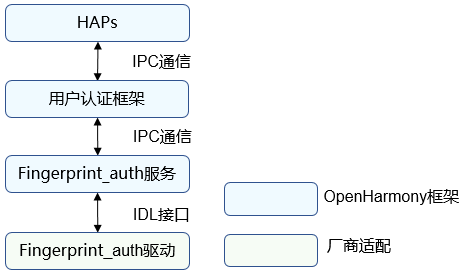
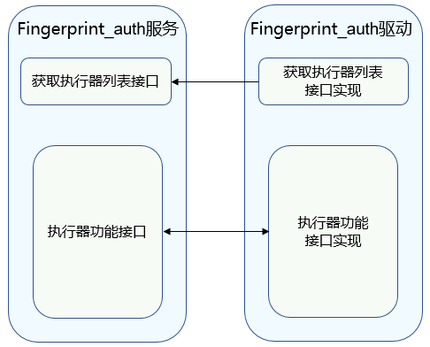

# Fingerprint_auth

## 概述

### 功能简介

指纹认证是端侧设备不可或缺的功能，为设备提供用户认证能力，可应用于设备解锁、支付、应用登录等身份认证场景。用户注册指纹后，指纹认证模块就可为设备提供指纹认证的功能。指纹认证功能整体框架如图1。

基于HDF（Hardware Driver Foundation）驱动框架开发的Fingerprint_auth驱动，能够屏蔽硬件器件差异，为上层用户认证框架和Fingerprint_auth服务提供稳定的指纹认证基础能力接口，包括指纹认证执行器列表查询、执行器信息查询、指定指纹模板ID查询模板信息、用户认证框架和执行器间的指纹模板信息对账、指纹的录入、删除、认证和识别等。

**图1** 指纹认证功能整体框架



### 基本概念

用户认证框架与各基础认证服务组成的身份认证系统支持用户认证凭据设置、删除、认证等基础功能。系统支持用户身份认证，需要提供数据采集、处理、存储及比对能力。
- 执行器

  执行器是能够提供以上能力的处理模块，各基础认证服务提供执行器能力，被身份认证框架调度完成各项基础能力。

- 执行器安全等级

  执行器提供能力时所在运行环境达到的安全级别。

- 执行器角色

  - 全功能执行器：执行器可独立处理一次凭据注册和身份认证请求，即可提供用户认证数据采集、处理、储存及比对能力。

  - 采集器：执行器提供用户认证时的数据采集能力，需要和认证器配合完成用户认证。

  - 认证器：认证器提供用户认证时数据处理能力，读取存储的凭据模板与当前认证信息完成比对。

- 执行器类型

  同一种身份认证类型的不同认证方式会产生认证算法差异，设备器件差异也会导致算法差异，执行器根据支持的算法类型差异或对接的器件差异，会定义不同的执行器类型。

- 用户认证框架公钥 & 执行器公钥

  用户身份认证处理需要保证用户数据安全以及认证结果的准确性，用户认证框架与基础认证服务间的关键交互信息需要做数据完整性保护，各基础认证服务将提供的执行器能力对接到用户认证框架时，需要交换各自的公钥，其中：

    1）执行器通过用户认证框架公钥校验调度指令的准确性。

    2）执行器公钥可被用户认证框架用于校验认证结果的准确性，同时用于执行器交互认证时的校验交互信息的完整性。

- 认证凭据

  在用户设置认证凭据时认证服务会产生并存储认证凭据，每个模板有一个ID，用于索引模板信息文件，在认证时读取模板信息并用于与当次认证过程中产生的认证数据做对比，完成身份认证。

- 执行器对账

  用户认证框架统一管理用户身份和凭据ID的映射关系，执行器对接到用户认证框架时，会读取用户身份认证框架内保存的该执行器的模板ID列表，执行器需要与自己维护的模板ID列表进行比对，并删除冗余信息。

- HAPs

  HAPs（Harmony Ability Packages），广义上指可以安装在OpenHarmony上的应用包，本章节中仅代表Fingerprint_auth驱动的上层应用。

- IDL接口

  接口定义语言（Interface Definition Language）通过IDL编译器编译后，能够生成与编程语言相关的文件：客户端桩文件，服务器框架文件。本文主要是通过IDL接口生成的客户端和服务端来实现Fingerprint_auth服务和驱动的通信，详细使用方法可参考[IDL简介](https://gitee.com/openharmony/ability_idl_tool/blob/master/README.md)。

- IPC通信

  IPC（Inter Process Communication），进程间通信是指两个进程的数据之间产生交互，详细原理可参考[IPC通信简介](https://gitee.com/openharmony/communication_ipc/blob/master/README_zh.md)。

- HDI

  HDI（Hardware Device Interface），硬件设备接口，位于基础系统服务层和设备驱动层之间，是提供给硬件系统服务开发者使用的、统一的硬件设备功能抽象接口，其目的是为系统服务屏蔽底层硬件设备差异，具体可参考[HDI规范](../../design/hdi-design-specifications.md)。

### 运作机制

Fingerprint_auth驱动的主要工作是为上层用户认证框架和Fingerprint_auth服务提供稳定的指纹认证基础能力，保证设备上指纹认证功能可以正常运行。如图2，Fingerprint_auth服务通过执行器列表接口获取执行器信息后，向用户认证框架注册执行器。Fingerprint_auth服务通过执行器功能接口实现和Fingerprint_auth驱动的认证、识别、查询等功能的信息交互。
开发者可基于HDF框架对不同芯片进行各自驱动的开发及HDI层接口的调用。

**图2** Fingerprint_auth服务和Fingerprint_auth驱动交互



### 约束与限制

要求设备上具有可信执行环境TEE（Trusted Execution Environment），指纹特征信息高强度加密保存在可信执行环境中。

## 开发指导

### 场景介绍

Fingerprint_auth驱动的主要工作是为上层用户认证框架和Fingerprint_auth服务提供稳定的指纹认证基础能力，保证设备上指纹认证功能可以正常运行。为实现上述场景的功能，开发者首先需要基于HDF驱动框架，完成Fingerprint_auth驱动开发，其次实现获取执行器列表接口和认证、识别查询等功能接口。

### 接口说明

注：以下接口列举的为IDL接口描述生成的对应C++语言函数接口，接口声明见idl文件（/drivers/interface/fingerprint_auth）。
在本文中，指纹凭据的录入、认证、识别和删除相关的HDI接口如表1所示，表2中的回调函数分别用于指纹执行器返回操作结果给框架和返回操作过程中的提示信息给上层应用。

**表1** 接口功能介绍

| 接口名称        | 功能介绍         |
| -------------------------------- | ----------------------------------- |
| GetExecutorList(std::vector\<sptr\<IAllInOneExecutor>>& allInOneExecutors) | 获取V2_0版本执行器列表。 |
| GetExecutorInfo(ExecutorInfo &executorInfo) | 获取执行器信息，包括执行器类型、执行器角色、认证类型、安全等级、执行器公钥等信息，用于向用户认证框架注册执行器。 |
| OnRegisterFinish(const std::vector\<uint64_t>& templateIdList,<br/>        const std::vector\<uint8_t>& frameworkPublicKey, const std::vector\<uint8_t>& extraInfo) | 执行器注册成功后，获取用户认证框架的公钥信息；获取用户认证框架的模板列表用于对账。 |
| Enroll(uint64_t scheduleId, const std::vector\<uint8_t>& extraInfo,<br/>        const sptr\<IExecutorCallback>& callbackObj) | 录入指纹模板。                                               |
| Authenticate(uint64_t scheduleId, const std::vector\<uint64_t>& templateIdList, bool endAfterFirstFail,<br/>const std::vector\<uint8_t>& extraInfo, const sptr\<IExecutorCallback>& callbackObj) | 认证指纹模板(V2_0版本)。         |
| Identify(uint64_t scheduleId, const std::vector\<uint8_t>& extraInfo,<br/>        const sptr\<IExecutorCallback>& callbackObj) | 识别指纹模板。           |
| Delete(const std::vector\<uint64_t>& templateIdList)          | 删除指纹模板。        |
| Cancel(uint64_t scheduleId)     | 通过scheduleId取消指定录入、认证、识别操作。     |
| SendCommand(int32_t commandId, const std::vector\<uint8_t>& extraInfo,<br/>        const sptr\<IExecutorCallback>& callbackObj) | 指纹认证服务向Fingerprint_auth驱动传递参数的通用接口。       |
| GetProperty(const std::vector\<uint64_t>& templateIdList,<br/>const std::vector\<int32_t>& propertyTypes, Property& property) | 获取执行器属性信息。 |
| SetCachedTemplates(const std::vector\<uint64_t\> &templateIdList) | 设置需缓存模板列表。 |
| RegisterSaCommandCallback(const sptr\<ISaCommandCallback\> &callbackObj) | 注册SA命令回调。 |

**表2** 回调函数介绍

| 接口名称                                                       | 功能介绍                 |
| ------------------------------------------------------------ | ------------------------ |
| IExecutorCallback::OnResult(int32_t result, const std::vector\<uint8_t>& extraInfo) | 返回操作的最终结果。     |
| IExecutorCallback::OnTip(int32_t tip, const std::vector\<uint8_t>& extraInfo) | 返回操作的过程交互信息。 |
| ISaCommandCallback::OnSaCommands(const std::vector\<SaCommand>& commands) | 发送命令列表。 |

### 开发步骤

以Hi3516DV300平台为例，我们提供了Fingerprint_auth驱动DEMO实例，以下是目录结构及各部分功能简介。

```undefined
// drivers/peripheral/fingerprint_auth
├── BUILD.gn     # 编译脚本
├── bundle.json  # 组件描述文件
└── hdi_service  # Fingerprint_auth驱动实现
    ├── BUILD.gn    # 编译脚本
    ├── include     # 头文件
    └── src         # 源文件
        ├── executor_impl.cpp                       # 认证、录入等功能接口实现
        ├── fingerprint_auth_interface_driver.cpp   # Fingerprint_auth驱动入口
        └── fingerprint_auth_interface_service.cpp  # 获取执行器列表接口实现
```

下面结合DEMO实例介绍驱动开发的具体步骤。

1. Fingerprint_auth驱动是基于HDF驱动框架设计，所以开发者需要按照驱动Driver Entry程序，完成Fingerprint_auth驱动框架开发，主要由Bind、Init、Release、Dispatch函数接口实现。关键代码如下，详细代码请参见[fingerprint_auth_interface_driver.cpp](https://gitee.com/openharmony/drivers_peripheral/blob/master/fingerprint_auth/hdi_service/src/fingerprint_auth_interface_driver.cpp)文件。

   ```c++
   // 通过自定义的HdfFingerprintAuthInterfaceHost对象包含ioService对象和真正的HDI Service实现IRemoteObject对象
   struct HdfFingerprintAuthInterfaceHost {
       struct IDeviceIoService ioService;
       OHOS::sptr<OHOS::IRemoteObject> stub;
   };

   // 服务接口调用响应接口
   static int32_t FingerprintAuthInterfaceDriverDispatch(struct HdfDeviceIoClient *client, int cmdId, struct HdfSBuf *data,
       struct HdfSBuf *reply)
   {
       auto *hdfFingerprintAuthInterfaceHost = CONTAINER_OF(client->device->service, struct HdfFingerprintAuthInterfaceHost, ioService);

       OHOS::MessageParcel *dataParcel = nullptr;
       OHOS::MessageParcel *replyParcel = nullptr;
       OHOS::MessageOption option;

       if (SbufToParcel(data, &dataParcel) != HDF_SUCCESS) {
           HDF_LOGE("%{public}s: invalid data sbuf object to dispatch", __func__);
           return HDF_ERR_INVALID_PARAM;
       }
       if (SbufToParcel(reply, &replyParcel) != HDF_SUCCESS) {
           HDF_LOGE("%{public}s: invalid reply sbuf object to dispatch", __func__);
           return HDF_ERR_INVALID_PARAM;
       }

       return hdfFingerprintAuthInterfaceHost->stub->SendRequest(cmdId, *dataParcel, *replyParcel, option);
   }

   // 初始化接口
   static int HdfFingerprintAuthInterfaceDriverInit(struct HdfDeviceObject *deviceObject)
   {
       HDF_LOGI("%{public}s: driver init start", __func__);
       return HDF_SUCCESS;
   }

   // Fingerprint_auth驱动对外提供的服务绑定到HDF框架
   static int HdfFingerprintAuthInterfaceDriverBind(struct HdfDeviceObject *deviceObject)
   {
       HDF_LOGI("%{public}s: driver bind start", __func__);
       auto *hdfFingerprintAuthInterfaceHost = new (std::nothrow) HdfFingerprintAuthInterfaceHost;
       if (hdfFingerprintAuthInterfaceHost == nullptr) {
           HDF_LOGE("%{public}s: failed to create create HdfFingerprintAuthInterfaceHost object", __func__);
           return HDF_FAILURE;
       }

       hdfFingerprintAuthInterfaceHost->ioService.Dispatch = FingerprintAuthInterfaceDriverDispatch;
       hdfFingerprintAuthInterfaceHost->ioService.Open = NULL;
       hdfFingerprintAuthInterfaceHost->ioService.Release = NULL;

       auto serviceImpl = OHOS::HDI::FingerprintAuth::V2_0::IFingerprintAuthInterface::Get(true);
       if (serviceImpl == nullptr) {
           HDF_LOGE("%{public}s: failed to get of implement service", __func__);
           delete hdfFingerprintAuthInterfaceHost;
           return HDF_FAILURE;
       }

       hdfFingerprintAuthInterfaceHost->stub = OHOS::HDI::ObjectCollector::GetInstance().GetOrNewObject(serviceImpl,
           OHOS::HDI::FingerprintAuth::V2_0::IFingerprintAuthInterface::GetDescriptor());
       if (hdfFingerprintAuthInterfaceHost->stub == nullptr) {
           HDF_LOGE("%{public}s: failed to get stub object", __func__);
           delete hdfFingerprintAuthInterfaceHost;
           return HDF_FAILURE;
       }

       deviceObject->service = &hdfFingerprintAuthInterfaceHost->ioService;
       return HDF_SUCCESS;
   }

   // 释放Fingerprint_auth驱动中的资源
   static void HdfFingerprintAuthInterfaceDriverRelease(struct HdfDeviceObject *deviceObject)
   {
       HDF_LOGI("%{public}s: driver release start", __func__);
       if (deviceObject->service == nullptr) {
           return;
       }
       auto *hdfFingerprintAuthInterfaceHost = CONTAINER_OF(deviceObject->service, struct HdfFingerprintAuthInterfaceHost, ioService);
       if (hdfFingerprintAuthInterfaceHost != nullptr) {
           delete hdfFingerprintAuthInterfaceHost;
       }
   }

   // 注册Fingerprint_auth驱动入口数据结构体对象
   struct HdfDriverEntry g_fingerprintAuthInterfaceDriverEntry = {
       .moduleVersion = 1,
       .moduleName = "drivers_peripheral_fingerprint_auth",
       .Bind = HdfFingerprintAuthInterfaceDriverBind,
       .Init = HdfFingerprintAuthInterfaceDriverInit,
       .Release = HdfFingerprintAuthInterfaceDriverRelease,
   };

   // 调用HDF_INIT将驱动入口注册到HDF框架中。在加载驱动时HDF框架会先调用Bind函数，再调用Init函数加载该驱动。当Init调用异常时，HDF框架会调用Release释放驱动资源并退出
   HDF_INIT(g_fingerprintAuthInterfaceDriverEntry);
   ```

2. Fingerprint_auth驱动框架开发完成后，Fingerprint_auth驱动需要向Fingerprint_auth服务和统一身份认证注册执行器，所以需要实现获取执行器列表接口。关键代码如下，详细代码请参见[fingerprint_auth_interface_service.cpp](https://gitee.com/openharmony/drivers_peripheral/blob/master/fingerprint_auth/hdi_service/src/fingerprint_auth_interface_service.cpp)文件。

   ```c++
   // 执行器实现类
   class AllInOneExecutorImpl : public IAllInOneExecutor {
   public:
       AllInOneExecutorImpl(struct ExecutorInfo executorInfo);
       virtual ~AllInOneExecutorImpl() {}

   private:
       struct ExecutorInfo executorInfo_; // 执行器信息
   };

   static constexpr uint16_t SENSOR_ID = 123; // 执行器sensorID
   static constexpr uint32_t EXECUTOR_TYPE = 123; // 执行器类型
   static constexpr size_t PUBLIC_KEY_LEN = 32; // 执行器32字节公钥

   // 创建HDI服务对象
   extern "C" IFingerprintAuthInterface *FingerprintAuthInterfaceImplGetInstance(void)
   {
       auto fingerprintAuthInterfaceService = new (std::nothrow) FingerprintAuthInterfaceService();
       if (fingerprintAuthInterfaceService == nullptr) {
           IAM_LOGE("fingerprintAuthInterfaceService is nullptr");
           return nullptr;
       }
       return fingerprintAuthInterfaceService;
   }

   // 获取V2_0执行器列表实现
   int32_t FingerprintAuthInterfaceService::GetExecutorList(std::vector<sptr<IAllInOneExecutor>> &executorList)
   {
       IAM_LOGI("interface mock start");
       for (auto executor : executorList_) {
           executorList.push_back(executor);
       }
       IAM_LOGI("interface mock success");
       return HDF_SUCCESS;
   }
   ```

3. 步骤1、2完成后基本实现了Fingerprint_auth驱动和Fingerprint_auth服务对接。接下来需实现执行器每个功能接口，来完成指纹认证基础能力。关键代码如下，详细代码请参见[all_in_one_executor_impl.cpp](https://gitee.com/openharmony/drivers_peripheral/blob/master/fingerprint_auth/hdi_service/src/all_in_one_executor_impl.cpp)文件。

   ```c++
   // 实现获取执行器信息接口
   int32_t AllInOneExecutorImpl::GetExecutorInfo(ExecutorInfo &executorInfo)
   {
       IAM_LOGI("interface mock start");
       executorInfo = executorInfo_;
       IAM_LOGI("get executor information success");
       return HDF_SUCCESS;
   }

   // 实现执行器注册成功后，获取用户认证框架的公钥信息、获取用户认证框架的模板列表接口。将公钥信息保持，模板列表用于和本地的模板做对账
   int32_t AllInOneExecutorImpl::OnRegisterFinish(const std::vector<uint64_t> &templateIdList,
       const std::vector<uint8_t> &frameworkPublicKey, const std::vector<uint8_t> &extraInfo)
   {
       IAM_LOGI("interface mock start");
       static_cast<void>(templateIdList);
       static_cast<void>(extraInfo);
       static_cast<void>(frameworkPublicKey);
       IAM_LOGI("register finish");
       return HDF_SUCCESS;
   }

   // 实现指纹录入接口
   int32_t AllInOneExecutorImpl::Enroll(
       uint64_t scheduleId, const std::vector<uint8_t> &extraInfo, const sptr<IExecutorCallback> &callbackObj)
   {
       IAM_LOGI("interface mock start");
       static_cast<void>(scheduleId);
       static_cast<void>(extraInfo);
       if (callbackObj == nullptr) {
           IAM_LOGE("callbackObj is nullptr");
           return HDF_ERR_INVALID_PARAM;
       }
       IAM_LOGI("enroll, result is %{public}d", ResultCode::OPERATION_NOT_SUPPORT);
       int32_t ret = callbackObj->OnResult(ResultCode::OPERATION_NOT_SUPPORT, {});
       if (ret != HDF_SUCCESS) {
           IAM_LOGE("callback result is %{public}d", ret);
           return HDF_FAILURE;
       }
       return HDF_SUCCESS;
   }

   // 实现指纹认证接口
   int32_t AllInOneExecutorService::Authenticate(uint64_t scheduleId, const std::vector<uint64_t> &templateIdList,
       const std::vector<uint8_t> &extraInfo, const sptr<IExecutorCallback> &callbackObj)
   {
       IAM_LOGI("interface mock start");
       static_cast<void>(scheduleId);
       static_cast<void>(templateIdList);
       static_cast<void>(extraInfo);
       if (callbackObj == nullptr) {
           IAM_LOGE("callbackObj is nullptr");
           return HDF_ERR_INVALID_PARAM;
       }
       IAM_LOGI("authenticate, result is %{public}d", ResultCode::NOT_ENROLLED);
       int32_t ret = callbackObj->OnResult(ResultCode::NOT_ENROLLED, {});
       if (ret != HDF_SUCCESS) {
           IAM_LOGE("callback result is %{public}d", ret);
           return HDF_FAILURE;
       }
       return HDF_SUCCESS;
   }

   // 实现指纹识别接口
   int32_t AllInOneExecutorService::Identify(
       uint64_t scheduleId, const std::vector<uint8_t> &extraInfo, const sptr<IExecutorCallback> &callbackObj)
   {
       IAM_LOGI("interface mock start");
       static_cast<void>(scheduleId);
       static_cast<void>(extraInfo);
       if (callbackObj == nullptr) {
           IAM_LOGE("callbackObj is nullptr");
           return HDF_ERR_INVALID_PARAM;
       }
       IAM_LOGI("identify, result is %{public}d", ResultCode::OPERATION_NOT_SUPPORT);
       int32_t ret = callbackObj->OnResult(ResultCode::OPERATION_NOT_SUPPORT, {});
       if (ret != HDF_SUCCESS) {
           IAM_LOGE("callback result is %{public}d", ret);
           return HDF_FAILURE;
       }
       return HDF_SUCCESS;
   }

   // 实现删除指纹模板接口
   int32_t AllInOneExecutorService::Delete(const std::vector<uint64_t> &templateIdList)
   {
       IAM_LOGI("interface mock start");
       static_cast<void>(templateIdList);
       IAM_LOGI("delete success");
       return HDF_SUCCESS;
   }

   // 实现通过scheduleId取消指定操作接口
   int32_t AllInOneExecutorService::Cancel(uint64_t scheduleId)
   {
       IAM_LOGI("interface mock start");
       static_cast<void>(scheduleId);
       IAM_LOGI("cancel success");
       return HDF_SUCCESS;
   }

   // 实现指纹认证服务向Fingerprint_auth驱动传递参数的通用接口，当前需要实现冻结与解锁模板命令
   int32_t AllInOneExecutorService::SendCommand(
       int32_t commandId, const std::vector<uint8_t> &extraInfo, const sptr<IExecutorCallback> &callbackObj)
   {
       IAM_LOGI("interface mock start");
       static_cast<void>(extraInfo);
       if (callbackObj == nullptr) {
           IAM_LOGE("callbackObj is nullptr");
           return HDF_ERR_INVALID_PARAM;
       }
       int32_t ret;
       switch (commandId) {
           case DriverCommandId::LOCK_TEMPLATE:
               IAM_LOGI("lock template, result is %{public}d", ResultCode::SUCCESS);
               ret = callbackObj->OnResult(ResultCode::SUCCESS, {});
               if (ret != HDF_SUCCESS) {
                   IAM_LOGE("callback result is %{public}d", ret);
                   return HDF_FAILURE;
               }
               break;
           case DriverCommandId::UNLOCK_TEMPLATE:
               IAM_LOGI("unlock template, result is %{public}d", ResultCode::SUCCESS);
               ret = callbackObj->OnResult(ResultCode::SUCCESS, {});
               if (ret != HDF_SUCCESS) {
                   IAM_LOGE("callback result is %{public}d", ret);
                   return HDF_FAILURE;
               }
               break;
           case DriverCommandId::INIT_ALGORITHM:
               IAM_LOGI("init algorithm, result is %{public}d", ResultCode::SUCCESS);
               ret = callbackObj->OnResult(ResultCode::SUCCESS, {});
               if (ret != HDF_SUCCESS) {
                   IAM_LOGE("callback result is %{public}d", ret);
                   return HDF_FAILURE;
               }
               break;
           default:
               IAM_LOGD("not support DriverCommandId : %{public}d", commandId);
               ret = callbackObj->OnResult(ResultCode::OPERATION_NOT_SUPPORT, {});
               if (ret != HDF_SUCCESS) {
                   IAM_LOGE("callback result is %{public}d", ret);
                   return HDF_FAILURE;
               }
       }
       return HDF_SUCCESS;
   }

   // 实现获取执行器属性接口
   int32_t AllInOneExecutorService::GetProperty(
       const std::vector<uint64_t> &templateIdList, const std::vector<int32_t> &propertyTypes, Property &property)
   {
       IAM_LOGI("interface mock start");
       property = {};
       IAM_LOGI("get property success");
       return HDF_SUCCESS;
   }

   // 实现设置需缓存模板列表接口
   int32_t AllInOneExecutorService::SetCachedTemplates(const std::vector<uint64_t> &templateIdList)
   {
       IAM_LOGI("interface mock start");
       IAM_LOGI("set cached templates success");
       return HDF_SUCCESS;
   }

   // 实现注册SA命令回调接口
   int32_t AllInOneExecutorService::RegisterSaCommandCallback(const sptr<ISaCommandCallback> &callbackObj)
   {
       IAM_LOGI("interface mock start");
       IAM_LOGI("register sa command callback success");
       return HDF_SUCCESS;
   }
   ```

4. 用户身份认证框架支持多driver，当增加driver或者修改driver信息，需要修改如下文件中serviceName2Config。

   ```c++
   // base/user_iam/fingerprint_auth/services/src/fingerprint_auth_service.cpp
   void FingerprintAuthService::StartDriverManager()
   {
       IAM_LOGI("start");
       int32_t ret = UserAuth::IDriverManager::Start(HDI_NAME_2_CONFIG);
       if (ret != UserAuth::ResultCode::SUCCESS) {
           IAM_LOGE("start driver manager failed");
       }
   }
   ```

### 调测验证

驱动开发完成后，开发者可以通过[用户认证API接口](../../application-dev/reference/apis-user-authentication-kit/js-apis-useriam-userauth.md)开发HAP应用，基于RK3568平台验证。认证和取消功能验证的测试代码如下：

1.发起认证并获取认证结果的测试代码如下：

```ts
  // API version 10
  import type {BusinessError} from '@ohos.base';
  import userIAM_userAuth from '@ohos.userIAM.userAuth';
  
  // 设置认证参数
  const authParam: userIAM_userAuth.AuthParam = {
    challenge: new Uint8Array([49, 49, 49, 49, 49, 49]),
    authType: [userIAM_userAuth.UserAuthType.PIN, userIAM_userAuth.UserAuthType.FINGERPRINT],
    authTrustLevel: userIAM_userAuth.AuthTrustLevel.ATL3,
  };

  // 配置认证界面
  const widgetParam: userIAM_userAuth.WidgetParam = {
    title: '请进行身份认证',
  };

  try {
    // 获取认证对象
    let userAuthInstance = userIAM_userAuth.getUserAuthInstance(authParam, widgetParam);
    console.info('get userAuth instance success');
    // 订阅认证结果
    userAuthInstance.on('result', {
      onResult(result) {
        console.info(`userAuthInstance callback result: ${JSON.stringify(result)}`);
        // 可在认证结束或其他业务需要场景，取消订阅认证结果
        userAuthInstance.off('result');
      }
    });
    console.info('auth on success');
    userAuthInstance.start();
    console.info('auth start success');
  } catch (error) {
    const err: BusinessError = error as BusinessError;
    console.error(`auth catch error. Code is ${err?.code}, message is ${err?.message}`);
  }
```
    
2.取消认证的测试代码如下：

```ts
  // API version 10
  import type {BusinessError} from '@ohos.base';
  import userIAM_userAuth from '@ohos.userIAM.userAuth';
  
  const authParam: userIAM_userAuth.AuthParam = {
    challenge: new Uint8Array([49, 49, 49, 49, 49, 49]),
    authType: [userIAM_userAuth.UserAuthType.PIN, userIAM_userAuth.UserAuthType.FINGERPRINT],
    authTrustLevel: userIAM_userAuth.AuthTrustLevel.ATL3,
  };

  const widgetParam: userIAM_userAuth.WidgetParam = {
    title: '请进行身份认证',
  };
  
  try {
    // 获取认证对象
    let userAuthInstance = userIAM_userAuth.getUserAuthInstance(authParam, widgetParam);
    console.info('get userAuth instance success');
    // 开始认证
    userAuthInstance.start();
    console.info('auth start success');
    // 取消认证
    userAuthInstance.cancel();
    console.info('auth cancel success');
  } catch (error) {
    const err: BusinessError = error as BusinessError;
    console.error(`auth catch error. Code is ${err?.code}, message is ${err?.message}`);
  }
```