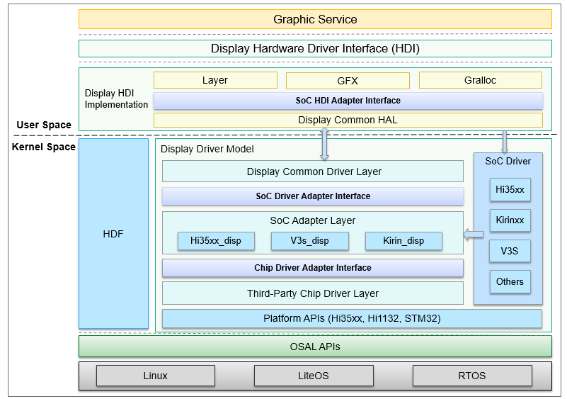
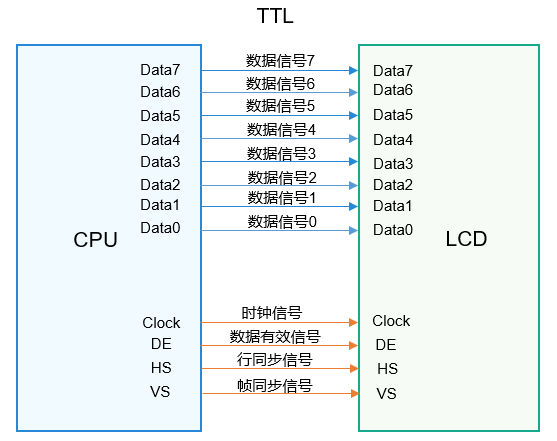

# LCD

## 概述

### 功能简介

LCD（Liquid Crystal Display）驱动编程，通过对显示器上电、初始化显示器驱动IC（Integrated Circuit）内部寄存器等操作，使其可以正常工作。

基于HDF（Hardware Driver Foundation）[驱动框架](driver-overview-foundation.md)构建的Display驱动模型作用如下：

- 为LCD器件驱动开发提供了基础驱动框架，提升驱动开发效率。

- 便于开发的器件驱动实现跨OS、跨芯片平台迁移。

基于HDF驱动框架的Display驱动模型如下所示：


  **图1** 基于HDF驱动框架的Display驱动模型

  

Display驱动模型主要由平台驱动层、芯片平台适配层、LCD器件驱动层三部分组成。驱动模型基于HDF驱动框架开发，通过Platform层和OSAL层提供的接口，屏蔽内核形态的差异，使得器件驱动可以便利的迁移到不同OS及芯片平台。模型向上对接Display公共HAL层，支撑HDI（Hardware Device Interface）接口的实现，通过Display-HDI对图形服务提供各类驱动能力接口。

- Display平台驱动层：通过HDF提供的IOService数据通道，与公共HAL层对接，集中接收并处理各类上层调用指令。

- SoC平台驱动适配层：借助此SoC适配层，实现Display驱动和SoC侧驱动解耦，主要完成芯片平台相关的参数配置，并传递平台驱动层的调用到器件驱动层。

- LCD器件驱动层：在器件驱动层中，主要实现和器件自身强相关的驱动适配接口，例如发送初始化序列、上下电、背光设置等。

基于Display驱动模型开发LCD驱动，可以借助平台提供的各种能力及接口，较大程度的降低器件驱动的开发周期和难度，提升开发效率。

### 基本概念 

LCD接口通常可分为MIPI DSI接口、TTL接口和LVDS接口，常用的是MIPI DSI接口和TTL接口，下面对常用的MIPI DSI接口和TTL接口作简要介绍。

- MIPI DSI接口

    **图2** MIPI DSI接口

    

    MIPI DSI接口是MIPI（Mobile Industry Processor Interface）联盟定义的显示接口，主要用于移动终端显示屏接口，接口数据传输遵循MIPI协议，MIPI DSI接口为数据接口，传输图像数据，通常情况下MIPI DSI接口的控制信息以MIPI包形式通过MIPI DSI接口发送到对端IC，不需要额外的外设接口。

- TTL接口

    **图3** TTL接口

    

    ​TTL（Transistor Transistor Logic）即晶体管-晶体管逻辑，TTL电平信号由TTL器件产生，TTL器件是数字集成电路的一大门类，它采用双极型工艺制造，具有高速度、低功耗和品种多等特点。

    TTL接口是并行方式传输数据的接口，有数据信号、时钟信号和控制信号（行同步、帧同步、数据有效信号等），在控制信号控制下完成数据传输。通常TTL接口的LCD，内部寄存器读写需要额外的外设接口，比如SPI接口、I2C接口等。

### 约束与限制

开发者在进行LCD驱动编程过程中，除了要关注IC的型号，还要关注LCD外围电路设计、基带芯片的LCD接口单元、背光IC的控制等多个方面，同时包括软件的上层程序。这些都是影响开发者在调试LCD驱动的影响因素。

## 开发指导

### 场景介绍

LCD驱动模型属于驱动基础适配模块，第三方需要适配OpenHarmony系统时，需要进行LCD驱动适配。LCD驱动适配基于HDF驱动框架、Platform接口及OSAL接口开发，可以做到不区分OS（LiteOS、Linux）和芯片平台（Hi35xx、Hi38xx、V3S等），为LCD器件提供统一的驱动模型。

### 接口说明

为了能够调整液晶显示屏的各项参数，与display建立显示通道，实现显示器的显示效果，LCD驱动需要通过`display :: host`注册PanelInfo结构体、接口信息，添加描述设备；LcdResetOn读取的pin脚信息，由SampleEntryInit初始化入口函数，并注册器件驱动接口，供平台驱动调用。

表1 LCD驱动适配所需接口 

| 接口名                                                  | 描述                |
| :------------------------------------------------------ | ------------------- |
| static int32_t MipiDsiInit(struct PanelInfo *info)      | 适配对应的芯片平台驱动 |
| static int32_t LcdResetOn(void)                         | 设置Reset Pin脚状态 |
| int32_t SampleEntryInit(struct HdfDeviceObject *object) | 器件驱动入口函数    |

### 开发步骤


1. 添加LCD驱动相关的设备描述配置。

2. 在SoC平台驱动适配层中适配对应的芯片平台驱动。

3. 添加器件驱动，并在驱动入口函数Init中注册Panel驱动数据，驱动数据接口主要实现下述特性：
   - LCD上下电

      根据LCD硬件连接，使用Platform接口层提供的GPIO操作接口操作对应LCD管脚，例如复位管脚、IOVCC管脚，上电时序参考LCD供应商提供的SPEC。

   - 发送初始化序列

      根据LCD硬件接口，使用Platform接口层提供的I2C、SPI、MIPI等接口，下载LCD初始化序列，初始化参数序列可以参考LCD供应商提供的SPEC。

4. （可选）根据需求实现HDF框架其他接口。

5. （可选）根据需求使用HDF框架可创建其他设备节点，用于业务逻辑或者调试功能。

### 开发实例

以Hi35xx系列芯片为例，根据开发步骤所述，介绍LCD驱动的详细适配过程。 

1. 添加设备描述配置（vendor/bearpi/bearpi_hm_micro/hdf_config/device_info/device_info.hcs）

   ```c++
   /* Display驱动相关的设备描述配置 */
   display :: host {
       hostName = "display_host";
       /* Display平台驱动设备描述 */
       device_hdf_disp :: device {
           device0 :: deviceNode {
               policy = 2;
               priority = 200;
               permission = 0660;
               moduleName = "HDF_DISP";
               serviceName = "hdf_disp";
           }
       }
       /* SoC适配层驱动设备描述 */
       device_hi35xx_disp :: device {
           device0 :: deviceNode {
               policy = 0;
               priority = 199;
               moduleName = "HI351XX_DISP";
           }
       }
       /* LCD器件驱动设备描述 */
       device_lcd :: device {
           device0 :: deviceNode {
               policy = 0;
               priority = 100;
               preload = 0;
               moduleName = "LCD_Sample";
           }
           device1 :: deviceNode {
               policy = 0;
               priority = 100;
               preload = 2;
               moduleName = "LCD_SampleXX";
           }
       }
   }
   ```

2. SoC平台驱动适配层中适配对应的芯片平台驱动（drivers/hdf_core/framework/model/display/driver/adapter_soc/hi35xx_disp.c）

   ```c++
   /* Display驱动适配MIPI等和芯片平台相关的配置 */
   static int32_t MipiDsiInit(struct PanelInfo *info)
   {
       int32_t ret;
       struct DevHandle *mipiHandle = NULL;
       struct MipiCfg cfg;
   
       mipiHandle = MipiDsiOpen(0);
       if (mipiHandle == NULL) {
           HDF_LOGE("%s: MipiDsiOpen failure", __func__);
           return HDF_FAILURE;
       }
       cfg.lane = info->mipi.lane;
       cfg.mode = info->mipi.mode;
       cfg.format = info->mipi.format;
       cfg.burstMode = info->mipi.burstMode;
       cfg.timing.xPixels = info->width;
       cfg.timing.hsaPixels = info->hsw;
       cfg.timing.hbpPixels = info->hbp;
       cfg.timing.hlinePixels = info->width + info->hbp + info->hfp + info->hsw;
       cfg.timing.vsaLines = info->vsw;
       cfg.timing.vbpLines = info->vbp;
       cfg.timing.vfpLines = info->vfp;
       cfg.timing.ylines = info->height;
       /* 0 : no care */
       cfg.timing.edpiCmdSize = 0;
       cfg.pixelClk = CalcPixelClk(info);
       cfg.phyDataRate = CalcDataRate(info);
       /* config mipi device */
       ret = MipiDsiSetCfg(mipiHandle, &cfg);
       if (ret != HDF_SUCCESS) {
           HDF_LOGE("%s:MipiDsiSetCfg failure", __func__);
       }
       MipiDsiClose(mipiHandle);
       HDF_LOGI("%s:pixelClk = %d, phyDataRate = %d\n", __func__,
           cfg.pixelClk, cfg.phyDataRate);
       return ret;
   }
   ```

3. 添加器件

   - 驱动定义相关接口信息（drivers/hdf_core/framework/model/display/driver/panel/mipi_icn9700.c）

     ```c++
     #define RESET_GPIO                5
     #define MIPI_DSI0                 0
     #define BLK_PWM1                  1
     #define PWM_MAX_PERIOD            100000
     /* backlight setting */
     #define MIN_LEVEL                 0
     #define MAX_LEVEL                 255
     #define DEFAULT_LEVEL             100
     #define WIDTH                     480
     #define HEIGHT                    960
     #define HORIZONTAL_BACK_PORCH     20
     #define HORIZONTAL_FRONT_PORCH    20
     #define HORIZONTAL_SYNC_WIDTH     10
     #define VERTICAL_BACK_PORCH       14
     #define VERTICAL_FRONT_PORCH      16
     #define VERTICAL_SYNC_WIDTH       2
     #define FRAME_RATE                60
     ```

   - 定义PanelInfo结构体（drivers/hdf_core/framework/model/display/driver/hdf_disp.h）

     ```c++
     struct PanelInfo {
         uint32_t width;	     // 水平尺寸
         uint32_t height;	     // 垂直尺寸
         uint32_t hbp;		     // 水平同步信号的后肩
         uint32_t hfp;		     // 水平同步信号的前肩
         uint32_t hsw;		     // 水平同步信号的脉宽
         uint32_t vbp;		     // 垂直同步信号的后肩
         uint32_t vfp;		     // 垂直同步信号的前肩
         uint32_t vsw;		     // 垂直同步信号的脉宽
         uint32_t frameRate;	     // 帧率
         enum LcdIntfType intfType;  // LCD接口类型
         enum IntfSync intfSync;     // 用户时序参数
         struct MipiDsiDesc mipi;
         struct BlkDesc blk;
         struct PwmCfg pwm;
     };
     ```

   - 初始化LCD屏（drivers/hdf_core/framework/model/display/driver/panel/mipi_icn9700.c）

     ```c++
     static uint8_t g_payLoad0[] = { 0xF0, 0x5A, 0x5A };
     static uint8_t g_payLoad1[] = { 0xF1, 0xA5, 0xA5 };
     static uint8_t g_payLoad2[] = { 0xB3, 0x03, 0x03, 0x03, 0x07, 0x05, 0x0D, 0x0F, 0x11, 0x13, 0x09, 0x0B };
     static uint8_t g_payLoad3[] = { 0xB4, 0x03, 0x03, 0x03, 0x06, 0x04, 0x0C, 0x0E, 0x10, 0x12, 0x08, 0x0A };
     static uint8_t g_payLoad4[] = { 0xB0, 0x54, 0x32, 0x23, 0x45, 0x44, 0x44, 0x44, 0x44, 0x60, 0x00, 0x60, 0x1C };
     static uint8_t g_payLoad5[] = { 0xB1, 0x32, 0x84, 0x02, 0x87, 0x12, 0x00, 0x50, 0x1C };
     static uint8_t g_payLoad6[] = { 0xB2, 0x73, 0x09, 0x08 };
     static uint8_t g_payLoad7[] = { 0xB6, 0x5C, 0x5C, 0x05 };
     static uint8_t g_payLoad8[] = { 0xB8, 0x23, 0x41, 0x32, 0x30, 0x03 };
     static uint8_t g_payLoad9[] = { 0xBC, 0xD2, 0x0E, 0x63, 0x63, 0x5A, 0x32, 0x22, 0x14, 0x22, 0x03 };
     static uint8_t g_payLoad10[] = { 0xb7, 0x41 };
     static uint8_t g_payLoad11[] = { 0xC1, 0x0c, 0x10, 0x04, 0x0c, 0x10, 0x04 };
     static uint8_t g_payLoad12[] = { 0xC2, 0x10, 0xE0 };
     static uint8_t g_payLoad13[] = { 0xC3, 0x22, 0x11 };
     static uint8_t g_payLoad14[] = { 0xD0, 0x07, 0xFF };
     static uint8_t g_payLoad15[] = { 0xD2, 0x63, 0x0B, 0x08, 0x88 };
     static uint8_t g_payLoad16[] = { 0xC6, 0x08, 0x15, 0xFF, 0x10, 0x16, 0x80, 0x60 };
     static uint8_t g_payLoad17[] = { 0xc7, 0x04 };
     static uint8_t g_payLoad18[] = {
         0xC8, 0x7C, 0x50, 0x3B, 0x2C, 0x25, 0x16, 0x1C, 0x08, 0x27, 0x2B, 0x2F, 0x52, 0x43, 0x4C, 0x40,
         0x3D, 0x30, 0x1E, 0x06, 0x7C, 0x50, 0x3B, 0x2C, 0x25, 0x16, 0x1C, 0x08, 0x27, 0x2B, 0x2F, 0x52,
         0x43, 0x4C, 0x40, 0x3D, 0x30, 0x1E, 0x06
     };
     static uint8_t g_payLoad19[] = { 0x11 };
     static uint8_t g_payLoad20[] = { 0x29 };
     static DevHandle g_mipiHandle = NULL;
     static DevHandle g_pwmHandle = NULL;
     ```

   - 设置Reset Pin脚状态（/drivers_hdf_core/framework/model/display/driver/panel/mipi_icn9700.c）

     ```c++
     static int32_t LcdResetOn(void)
     {
         int32_t ret;
	 /*设置管脚方向*/
         ret = GpioSetDir(RESET_GPIO, GPIO_DIR_OUT);
         if (ret != HDF_SUCCESS) {
             HDF_LOGE("GpioSetDir failure, ret:%d", ret);
             return HDF_FAILURE;
         }
	 /*写入管脚*/
         ret = GpioWrite(RESET_GPIO, GPIO_VAL_HIGH);
         if (ret != HDF_SUCCESS) {
             HDF_LOGE("GpioWrite failure, ret:%d", ret);
             return HDF_FAILURE;
         }
         /* delay 20ms */
         OsalMSleep(20);
         return HDF_SUCCESS;
     }
     ```

   - 器件驱动入口函数（/drivers_hdf_core/framework/model/display/driver/panel/mipi_icn9700.c）

     ```c++
     /*初始化入口函数*/
     int32_t SampleEntryInit(struct HdfDeviceObject *object)
     {
         HDF_LOGI("%s: enter", __func__);
         if (object == NULL) {
             HDF_LOGE("%s: param is null!", __func__);
             return HDF_FAILURE;
         }
         /* 器件驱动接口注册，ops提供给平台驱动调用 */
         if (PanelDataRegister(&g_panelData) != HDF_SUCCESS) {
             HDF_LOGE("%s: PanelDataRegister error!", __func__);
             return HDF_FAILURE;
         }
         return HDF_SUCCESS;
     }
     
     /*实现驱动*/
     struct HdfDriverEntry g_sampleDevEntry = {
         .moduleVersion = 1,
         .moduleName = "LCD_SAMPLE",
         .Init = SampleEntryInit,
     };
     
     HDF_INIT(g_sampleDevEntry);
     ```
