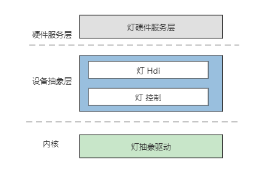
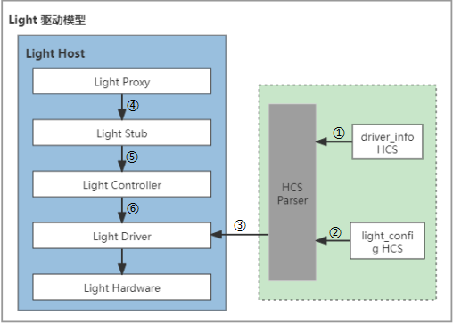

# Light


## 概述

### 功能简介

Light驱动模型为上层Light硬件服务层提供稳定的灯控制能力接口，包括获取灯类型、配置点灯模式、配置灯闪烁效果、点灯、熄灯等。基于HDF（Hardware Driver Foundation）驱动框架开发的Light驱动模型，实现跨操作系统迁移，器件差异配置等功能。实现Light驱动“一次开发，多系统部署”的目标。Light驱动模型如图1所示：

**图 1**  Light驱动模型图



### 运作机制

通过介绍Light驱动模型的加载以及运行流程，对模型内部关键组件以及关联组件之间的关系进行了划分，整体加载流程如图2所示：

**图 2**  Light驱动运行图



以标准系统RK3568为例，介绍Light模块驱动加载及运行流程：

1. Device Manager从device_info.hcs配置文件中读取Light设备管理配置信息。
2. Device Manager从light_config.hcs配置文件中读取Light数据配置信息。
3. HCS Parser解析Light设备管理配置信息，加载对应的Light Host，并控制Host完成驱动的加载。
4. Light Proxy获取到Light HDI接口服务实例后，通过IPC（Inter-Process Communication）调用到Light Stub。
5. Light Stub主要处理与IPC相关的业务逻辑，完成参数反序列化后调用Light Controller。
6. Light Controller中是HDI接口的真正实现，通过IPC调用Light抽象驱动接口，进一步操作Light硬件设备。

## 开发指导

### 场景介绍

灯设备的控制，在实际生活中比比皆是，例如短信通知时闪灯、终端电量不足时预警、充电时根据充电进度变换灯的颜色等等。这些动作的实现，都需要使用Light驱动模型提供的接口，动态配置点灯模式、配置灯闪烁效果、点灯、熄灯等。

### 接口说明

Light驱动模型支持获取系统中所有灯的信息、动态配置闪烁模式和闪烁时间的能力。Light硬件服务调用GetLightInfo获取Light设备的基本信息，调用TurnOnLight接口启动配置的闪烁效果，调用TurnOffLight接口关闭Light设备。Light驱动模型对外开放的API接口能力，参考表1。

**表1**  Light驱动模型对外API接口能力介绍

注：以下接口列举的为C接口，接口声明见文件[/drivers/peripheral/light/interfaces/include](https://gitee.com/openharmony/drivers_peripheral/tree/master/light/interfaces/include)。

| 接口名                                                       | 功能描述                                                     |
| ------------------------------------------------------------ | ------------------------------------------------------------ |
| int32_t (*GetLightInfo)(struct LightInfo **lightInfo, uint32_t *count) | 获取当前系统中所有类型的灯信息，lightInfo表示指向灯信息的二级指针，count表示指向灯数量的指针。 |
| int32_t (*TurnOnLight)(uint32_t lightId,  struct LightEffect *effect) | 根据指定的灯类型ID打开列表中的可用灯，lightId表示灯类型ID，effect表示指向灯效果的指针。 |
| int32_t (*TurnOffLight)(uint32_t lightId)                    | 根据指定的灯类型ID关闭列表中的可用灯。                       |
| int32_t (*TurnOnMultiLights)(uint32_t lightId, const struct LightColor *colors, const uint32_t count); | 根据指定的灯类型ID打开相应灯光中包含的多个子灯光。           |

### 开发步骤
基于HDF驱动框架，按照驱动Driver Entry程序，完成Light驱动开发，资源配置及HCS配置文件解析。

1. 灯驱动在Light Host中的配置信息。

   - Light HCS文件代码路径：vendor\hihope\rk3568\hdf_config\khdf\device_info\device_info.hcs。

   - 具体代码实现如下：

     ```c
     /* Light设备HCS配置 */
     light :: host {
         hostName = "light_host";
         device_light :: device {
             device0 :: deviceNode {
                 policy = 2;                           // 驱动服务发布的策略（0：不提供服务，1：对内核态发布服务；2：对内核态和用户态都发布服务）
                 priority = 100;                       // Light驱动启动优先级（0-200），值越大优先级越低，建议配置为100，优先级相同则不保证device的加载顺序
                 preload = 0;                          // 驱动按需加载字段，0：加载；2：不加载
                 permission = 0664;                    // 驱动创建设备节点权限
                 moduleName = "HDF_LIGHT";             // Light驱动名称，该字段的值必须和驱动入口结构的moduleName值一致
                 serviceName = "hdf_light";            // Light驱动对外发布服务的名称，必须唯一
                 deviceMatchAttr = "hdf_light_driver"; // 驱动私有数据匹配的关键字，必须和驱动私有数据配置表中的match_attr值相等
             }
         }
     }
     ```

2. 灯驱动私有HCS配置：

   - 代码实现路径：vendor\hihope\rk3568\hdf_config\khdf\light\light_config.hcs。

   - 具体代码实现如下：

     ```c
     root {
         lightConfig {
             boardConfig {
                 match_attr = "hdf_light_driver";
                 lightAttr {
                     light01 {
                         lightId = [1];    // Lightid可以包含多个逻辑灯光ID，例如：1表示电源指示灯。
                         lightName = "battery";
                         lightNumber = 1;
                         busRNum = 147;    // Light的效果颜色红色对应GPIO值。
                         busGNum = 146;    // Light的效果颜色绿色对应GPIO值。
                         busBNum = 149;    // Light的效果颜色蓝色对应GPIO值。
                         defaultBrightness = 0X00FFFFFF;    // 系统默认亮度值，B：0-7位，R：8-15位，G：16-23，扩展位24-31位。
                         onTime = 50;    // 当闪光灯亮起时，系统支持的最短持续时间（以毫秒为单位）。
                         offTime = 50;    // 当闪光灯熄灭时，系统支持的最短持续时间（以毫秒为单位）。
                     }
                 }
             }
         }
     }
     ```

3. 灯驱动代码实现路径为： drivers\hdf_core\framework\model\misc\light\driver\src\light_driver.c。

   - 灯驱动对应的HdfDriverEntry对象，其中，Driver Entry入口函数定义如下：

     ```c
     /* 注册灯入口数据结构体对象 */
     struct HdfDriverEntry g_lightDriverEntry = {
         .moduleVersion = 1,            // 灯模块版本号
         .moduleName = "HDF_LIGHT",     // 灯模块名，要与device_info.hcs文件里灯moduleName字段值一样
         .Bind = BindLightDriver,       // 灯绑定函数
         .Init = InitLightDriver,       // 灯初始化函数
         .Release = ReleaseLightDriver, // 灯资源释放函数
     };
     /* 调用HDF_INIT将驱动入口注册到HDF框架中，在加载驱动时HDF框架会先调用Bind函数，再调用Init函数加载该驱动。当Init调用异常时，HDF框架会调用Release释放驱动资源并退出 */
     HDF_INIT(g_lightDriverEntry);
     ```

   - 灯驱动Bind接口实现示例如下：

     ```c
     /* Light驱动对外提供的服务绑定到HDF框架 */
     int32_t BindLightDriver(struct HdfDeviceObject *device)
     {
         struct LightDriverData *drvData = NULL;
     
         CHECK_LIGHT_NULL_PTR_RETURN_VALUE(device, HDF_FAILURE);
     	/* 私有接口分配资源 */
         drvData = (struct LightDriverData *)OsalMemCalloc(sizeof(*drvData));
         CHECK_LIGHT_NULL_PTR_RETURN_VALUE(drvData, HDF_ERR_MALLOC_FAIL);
     	/* 需要发布的接口函数 */
         drvData->ioService.Dispatch = DispatchLight;
         drvData->device = device;
         device->service = &drvData->ioService;
         g_lightDrvData = drvData;
     
         return HDF_SUCCESS;
     }
     ```

   - 灯驱动Init接口实现示例如下：

     ```c
     /* Light驱动初始化入口函数*/
     int32_t InitLightDriver(struct HdfDeviceObject *device)
     {
         struct LightDriverData *drvData = NULL;
     
         drvData = (struct LightDriverData *)device->service;
     
         if (OsalMutexInit(&drvData->mutex) != HDF_SUCCESS) {
             return HDF_FAILURE;
         }
     	/* 工作队列初始化 */
         if (HdfWorkQueueInit(&drvData->workQueue, LIGHT_WORK_QUEUE_NAME) != HDF_SUCCESS) {
             return HDF_FAILURE;
         }
     	/* 工作项初始化 */
         if (HdfWorkInit(&drvData->work, LightWorkEntry, (void*)drvData) != HDF_SUCCESS) {
             return HDF_FAILURE;
         }
     	/* 解析HCS配置文件 */
         if (GetLightConfigData(device->property) != HDF_SUCCESS) {
             return HDF_FAILURE;
         }
     	/* 设置GPIO引脚方向 */
         if (SetLightGpioDir(drvData) != HDF_SUCCESS) {
             return HDF_FAILURE;
         }
     
         return HDF_SUCCESS;
     }
     ```

   - 灯驱动Release接口在驱动卸载或者Init执行失败时，会调用此接口释放资源，具体实现如下：

     ```c
     /* 释放Light驱动初始化时分配的资源 */
     void ReleaseLightDriver(struct HdfDeviceObject *device)
     {
         int32_t i;
         struct LightDriverData *drvData = NULL;
         /* 释放已分配资源 */
         for (i = LIGHT_ID_NONE; i < LIGHT_ID_BUTT; ++i) {
             if (drvData->info[i] != NULL) {
                 OsalMemFree(drvData->info[i]);
                 drvData->info[i] = NULL;
             }
         }
     	/* 器件在位，销毁工作队列资源 */
         HdfWorkDestroy(&drvData->work);
         HdfWorkQueueDestroy(&drvData->workQueue);
         (void)OsalMutexDestroy(&drvData->mutex);
         OsalMemFree(drvData);
         g_lightDrvData = NULL;
     }
     ```

   - 灯驱动从HCS文件中解析Light设备管理配置信息。

     ```c
     /* 从HCS文件中获取Light基础配置 */
     static int32_t GetLightBaseConfigData(const struct DeviceResourceNode *node, const struct DeviceResourceIface *parser,
         uint32_t lightId)
     {
         int32_t ret;
         uint32_t *defaultBrightness = NULL;
         struct LightDriverData *drvData = NULL;
         const char *name = NULL;
     
         drvData = GetLightDrvData();
         CHECK_LIGHT_NULL_PTR_RETURN_VALUE(drvData, HDF_ERR_INVALID_PARAM);
         CHECK_LIGHT_NULL_PTR_RETURN_VALUE(node, HDF_ERR_INVALID_PARAM);
         CHECK_LIGHT_NULL_PTR_RETURN_VALUE(parser, HDF_ERR_INVALID_PARAM);
     	/* 类型作为下标开辟空间 */
         drvData->info[lightId] = (struct LightDeviceInfo *)OsalMemCalloc(sizeof(struct LightDeviceInfo));
         if (drvData->info[lightId] == NULL) {
             HDF_LOGE("%s: malloc fail", __func__);
             return HDF_FAILURE;
         }
     	 /* 将Light设备信息进行填充 */
         ret = parser->GetUint32(node, "busRNum", (uint32_t *)&drvData->info[lightId]->busRNum, 0);
         if (ret != HDF_SUCCESS) {
             drvData->info[lightId]->busRNum = LIGHT_INVALID_GPIO;
         }
     
         ret = parser->GetUint32(node, "busGNum", (uint32_t *)&drvData->info[lightId]->busGNum, 0);
         if (ret != HDF_SUCCESS) {
             drvData->info[lightId]->busGNum = LIGHT_INVALID_GPIO;
         }
     
         ret = parser->GetUint32(node, "busBNum", (uint32_t *)&drvData->info[lightId]->busBNum, 0);
         if (ret != HDF_SUCCESS) {
             drvData->info[lightId]->busBNum = LIGHT_INVALID_GPIO;
         }
     
         ret = parser->GetString(node, "lightName", &name, NULL);
         if (ret != HDF_SUCCESS) {
             HDF_LOGE("%s:get lightName failed!", __func__);
             return HDF_FAILURE;
         }
     
         if (strcpy_s(drvData->info[lightId]->lightInfo.lightName, NAME_MAX_LEN, name) != EOK) {
             HDF_LOGE("%s:copy lightName failed!", __func__);
             return HDF_FAILURE;
         }
     
         ret = parser->GetUint32(node, "lightNumber", (uint32_t *)&drvData->info[lightId]->lightInfo.lightNumber, 0);
         if (ret != HDF_SUCCESS) {
             HDF_LOGE("%s:get lightNumber failed!", __func__);
             return HDF_FAILURE;
         }
     
         defaultBrightness = (uint32_t *)&drvData->info[lightId]->defaultBrightness;
         ret = parser->GetUint32(node, "defaultBrightness", defaultBrightness, 0);
         CHECK_LIGHT_PARSER_RESULT_RETURN_VALUE(ret, "defaultBrightness");
         ret = parser->GetUint32(node, "onTime", &drvData->info[lightId]->onTime, 0);
         CHECK_LIGHT_PARSER_RESULT_RETURN_VALUE(ret, "onTime");
         ret = parser->GetUint32(node, "offTime", &drvData->info[lightId]->offTime, 0);
         CHECK_LIGHT_PARSER_RESULT_RETURN_VALUE(ret, "offTime");
     
         drvData->info[lightId]->lightBrightness = 0;
         drvData->info[lightId]->lightState = LIGHT_STATE_STOP;
     
         return HDF_SUCCESS;
     }
     ```

   - 分配资源，解析灯HCS配置信息实现如下：

     ```c
     /* 分配资源，解析灯HCS配置 */
     static int32_t ParseLightInfo(const struct DeviceResourceNode *node, const struct DeviceResourceIface *parser)
     {
         int32_t ret;
         uint32_t i;
         uint32_t temp;
         struct LightDriverData *drvData = NULL;
     
         drvData = GetLightDrvData();
         CHECK_LIGHT_NULL_PTR_RETURN_VALUE(drvData, HDF_ERR_INVALID_PARAM);
         CHECK_LIGHT_NULL_PTR_RETURN_VALUE(node, HDF_ERR_INVALID_PARAM);
         CHECK_LIGHT_NULL_PTR_RETURN_VALUE(parser, HDF_ERR_INVALID_PARAM);
     	 /* 从HCS配置获取支持的灯类型个数 */
         drvData->lightNum = (uint32_t)parser->GetElemNum(node, "lightId");
         if (drvData->lightNum > LIGHT_ID_NUM) {
             HDF_LOGE("%s: lightNum cross the border", __func__);
             return HDF_FAILURE;
         }
     
         ret = memset_s(drvData->info, sizeof(drvData->info[LIGHT_ID_NONE]) * LIGHT_ID_BUTT, 0,
             sizeof(drvData->info[LIGHT_ID_NONE]) * LIGHT_ID_BUTT);
         CHECK_LIGHT_PARSER_RESULT_RETURN_VALUE(ret, "memset_s");
     
         for (i = 0; i < drvData->lightNum; ++i) {
             /* 获取灯的类型 */
             ret = parser->GetUint32ArrayElem(node, "lightId", i, &temp, 0);
             CHECK_LIGHT_PARSER_RESULT_RETURN_VALUE(ret, "lightId");
     
             if (temp >= LIGHT_ID_BUTT) {
                 HDF_LOGE("%s: light id invalid para", __func__);
                 return HDF_FAILURE;
             }
     
             ret = GetLightBaseConfigData(node, parser, temp);
             if (ret != HDF_SUCCESS) {
                 HDF_LOGE("%s: get light base config fail", __func__);
                 return HDF_FAILURE;
             }
         }
     
         return HDF_SUCCESS;
     }
     ```

   - 灯驱动的内部接口完成了灯类型获取、闪烁模式设置和停止的接口开发，并支持根据闪烁模式创建和销毁定时器。

     - GetAllLightInfo接口实现如下：

       ```c
       /* Light驱动服务调用GetAllLightInfo接口获取灯类型信息 */
       static int32_t GetAllLightInfo(struct HdfSBuf *data, struct HdfSBuf *reply)
       {
           (void)data;
           uint32_t i;
           struct LightInfo lightInfo;
           struct LightDriverData *drvData = NULL;
       
           drvData = GetLightDrvData();
           CHECK_LIGHT_NULL_PTR_RETURN_VALUE(drvData, HDF_ERR_INVALID_PARAM);
           CHECK_LIGHT_NULL_PTR_RETURN_VALUE(reply, HDF_ERR_INVALID_PARAM);
       
           if (!HdfSbufWriteUint32(reply, drvData->lightNum)) {
               HDF_LOGE("%s: write sbuf failed", __func__);
               return HDF_FAILURE;
           }
       
           for (i = 0; i < LIGHT_ID_BUTT; ++i) {
               if (drvData->info[i] == NULL) {
                   continue;
               }
               lightInfo.lightId = i;
       
               if (!HdfSbufWriteUint32(reply, lightInfo.lightId)) {
                   HDF_LOGE("%s: write lightId failed", __func__);
                   return HDF_FAILURE;
               }
       
               if (strcpy_s(lightInfo.lightName, NAME_MAX_LEN, drvData->info[i]->lightInfo.lightName) != EOK) {
                   HDF_LOGE("%s:copy lightName failed!", __func__);
                   return HDF_FAILURE;
               }
       
               if (!HdfSbufWriteString(reply, (const char *)lightInfo.lightName)) {
                   HDF_LOGE("%s: write lightName failed", __func__);
                   return HDF_FAILURE;
               }
       
               lightInfo.lightNumber = drvData->info[i]->lightInfo.lightNumber;
               if (!HdfSbufWriteUint32(reply, lightInfo.lightNumber)) {
                   HDF_LOGE("%s: write lightNumber failed", __func__);
                   return HDF_FAILURE;
               }
       
               lightInfo.lightType = HDF_LIGHT_TYPE_RGB_COLOR;
               if (!HdfSbufWriteUint32(reply, lightInfo.lightType)) {
                   HDF_LOGE("%s: write lightType failed", __func__);
                   return HDF_FAILURE;
               }
           }
       
           return HDF_SUCCESS;
       }
       ```

     - TurnOnLight接口的实现如下：

       ```c
       /* 按照指定的类型和用户传入的参数使能灯 */
       static int32_t TurnOnLight(uint32_t lightId, struct HdfSBuf *data, struct HdfSBuf *reply)
       {
           (void)reply;
           uint32_t len;
           struct LightEffect *buf = NULL;
           struct LightDriverData *drvData = NULL;
       
           drvData = GetLightDrvData();
           CHECK_LIGHT_NULL_PTR_RETURN_VALUE(drvData, HDF_ERR_INVALID_PARAM);
       
           if (drvData->info[lightId] == NULL) {
               HDF_LOGE("%s: light id info is null", __func__);
               return HDF_FAILURE;
           }
       
           if (!HdfSbufReadBuffer(data, (const void **)&buf, &len)) {
               HDF_LOGE("%s: light read data failed", __func__);
               return HDF_FAILURE;
           }
       	/* 接收用户传入的亮度值。24-31bit表示扩展位，16-23bit表示红色，8-15bit表示绿色，0-7bit表示蓝色。如果字段不等于0，表示使能相应颜色的灯。
              如果支持亮度设置，则通过0-255设置不同的亮度。 */
           if (buf->lightColor.colorValue.rgbColor.r != 0) {
               drvData->info[lightId]->lightBrightness |= 0X00FF0000;
           }
       
           if (buf->lightColor.colorValue.rgbColor.g != 0) {
               drvData->info[lightId]->lightBrightness |= 0X0000FF00;
           }
       
           if (buf->lightColor.colorValue.rgbColor.b != 0) {
               drvData->info[lightId]->lightBrightness |= 0X000000FF;
           }
       	/* 常亮模式 */
           if (buf->flashEffect.flashMode == LIGHT_FLASH_NONE) {
               return UpdateLight(lightId, LIGHT_STATE_START);
           }
       	/* 闪烁模式 */
           if (buf->flashEffect.flashMode == LIGHT_FLASH_BLINK) {
               drvData->info[lightId]->onTime = (buf->flashEffect.onTime < drvData->info[lightId]->onTime) ?
               drvData->info[lightId]->onTime : buf->flashEffect.onTime;
               drvData->info[lightId]->offTime = (buf->flashEffect.offTime < drvData->info[lightId]->offTime) ?
               drvData->info[lightId]->offTime : buf->flashEffect.offTime;
       		/* 创建定时器 */
               if (OsalTimerCreate(&drvData->timer, LIGHT_WAIT_TIME, LightTimerEntry, (uintptr_t)lightId) != HDF_SUCCESS) {
                   HDF_LOGE("%s: create light timer fail!", __func__);
                   return HDF_FAILURE;
               }
       		/* 启动定时器 */
               if (OsalTimerStartLoop(&drvData->timer) != HDF_SUCCESS) {
                   HDF_LOGE("%s: start light timer fail!", __func__);
                   return HDF_FAILURE;
               }
           }
       
           return HDF_SUCCESS;
       }
       ```

     - TurnOffLight接口的实现如下：

       ```c
       /* 按照指定的类型关闭灯 */
       static int32_t TurnOffLight(uint32_t lightId, struct HdfSBuf *data, struct HdfSBuf *reply)
       {
           (void)data;
           (void)reply;
           struct LightDriverData *drvData = NULL;
       
           drvData = GetLightDrvData();
           CHECK_LIGHT_NULL_PTR_RETURN_VALUE(drvData, HDF_ERR_INVALID_PARAM);
       
           if (drvData->info[lightId] == NULL) {
               HDF_LOGE("%s: light id info is null", __func__);
               return HDF_FAILURE;
           }
       
           if (UpdateLight(lightId, LIGHT_STATE_STOP) != HDF_SUCCESS) {
               HDF_LOGE("%s: gpio write failed", __func__);
               return HDF_FAILURE;
           }
       
           drvData->info[lightId]->lightState = LIGHT_STATE_STOP;
           drvData->info[lightId]->lightBrightness = 0;
       	/* 销毁定时器 */
           if (drvData->timer.realTimer != NULL) {
               if (OsalTimerDelete(&drvData->timer) != HDF_SUCCESS) {
                   HDF_LOGE("%s: delete light timer fail!", __func__);
                   return HDF_FAILURE;
               }
           }
       
           return HDF_SUCCESS;
       }
       ```

5. Light Controller中是HDI接口的实现。

   - 代码实现路径：drivers\peripheral\light\hal\src\light_controller.c。

   - GetLightInfo接口的实现如下：

     ```c
     /* 将Light抽象驱动中写入HdfSBuf中的灯类型信息读取到LightInfo中 */
     static int32_t ReadLightInfo(struct HdfSBuf *reply, struct LightDevice *priv)
     {
         struct LightInfo *pos = NULL;
         const char *name = NULL;
     
         if (!HdfSbufReadUint32(reply, &priv->lightNum)) {
             HDF_LOGE("%s: sbuf read lightNum failed", __func__);
             return HDF_FAILURE;
         }
     
         if (priv->lightInfoEntry != NULL) {
             OsalMemFree(priv->lightInfoEntry);
             priv->lightInfoEntry = NULL;
         }
     
         priv->lightInfoEntry = (struct LightInfo *)OsalMemCalloc(sizeof(*priv->lightInfoEntry) * priv->lightNum);
         if (priv->lightInfoEntry == NULL) {
             HDF_LOGE("%s: malloc fail", __func__);
             return HDF_FAILURE;
         }
     
         pos = priv->lightInfoEntry;
     
         for (uint32_t i = 0; i < priv->lightNum; ++i) {
             if (!HdfSbufReadUint32(reply, &pos->lightId)) {
                 HDF_LOGE("%{public}s:read lightId failed!", __func__);
                 return HDF_FAILURE;
             }
     
             name = HdfSbufReadString(reply);
             if (strcpy_s(pos->lightName, NAME_MAX_LEN, name) != EOK) {
                 HDF_LOGE("%{public}s:copy lightName failed!", __func__);
                 return HDF_FAILURE;
             }
     
             if (!HdfSbufReadUint32(reply, &pos->lightNumber)) {
                 HDF_LOGE("%{public}s:read lightNumber failed!", __func__);
                 return HDF_FAILURE;
             }
     
             if (!HdfSbufReadInt32(reply, &pos->lightType)) {
                 HDF_LOGE("%{public}s:read lightType failed!", __func__);
                 return HDF_FAILURE;
             }
             pos++;
         }
     
         return HDF_SUCCESS;
     }
     /* GetLightInfo接口实现 */
     static int32_t GetLightInfo(struct LightInfo **lightInfo, uint32_t *count)
     {
         if ((lightInfo == NULL) || (count == NULL)) {
             HDF_LOGE("%s:line:%{public}d pointer is null and return ret", __func__, __LINE__);
             return HDF_FAILURE;
         }
     
         struct LightDevice *priv = GetLightDevicePriv();
     
         if (priv->lightNum > 0) {
             *count = priv->lightNum;
             *lightInfo = priv->lightInfoEntry;
             return HDF_SUCCESS;
         }
     
         (void)OsalMutexLock(&priv->mutex);
         struct HdfSBuf *reply = HdfSbufObtainDefaultSize();
         if (reply == NULL) {
             HDF_LOGE("%s: get sbuf failed", __func__);
             (void)OsalMutexUnlock(&priv->mutex);
             return HDF_FAILURE;
         }
     
         int32_t ret = SendLightMsg(LIGHT_IO_CMD_GET_INFO_LIST, NULL, reply);
         if (ret != HDF_SUCCESS) {
             HDF_LOGE("%{public}s: Light send cmd failed, ret[%{public}d]", __func__, ret);
             HdfSbufRecycle(reply);
             (void)OsalMutexUnlock(&priv->mutex);
             return ret;
         }
     
         if (ReadLightInfo(reply, priv) != HDF_SUCCESS) {
             HdfSbufRecycle(reply);
             (void)OsalMutexUnlock(&priv->mutex);
             return HDF_FAILURE;
         }
     
         HdfSbufRecycle(reply);
         (void)OsalMutexUnlock(&priv->mutex);
     
         *count = priv->lightNum;
         *lightInfo = priv->lightInfoEntry;
     
         return HDF_SUCCESS;
     }
     ```

   - OnLight接口的实现如下：

     ```c
     static int32_t OnLight(uint32_t lightId, struct LightEffect *effect)
     {
         int32_t ret;
     
         if (effect == NULL) {
             HDF_LOGE("%{public}s: effect is NULL", __func__);
             return HDF_FAILURE;
         }
     
         ret = OnLightValidityJudgment(lightId, effect);
         if (ret != HDF_SUCCESS) {
             HDF_LOGE("%{public}s: effect is false", __func__);
             return ret;
         }
     
         struct LightDevice *priv = GetLightDevicePriv();
         (void)OsalMutexLock(&priv->mutex);
     
         struct HdfSBuf *msg = HdfSbufObtainDefaultSize();
         if (msg == NULL) {
             HDF_LOGE("%{public}s: Failed to obtain sBuf size", __func__);
             (void)OsalMutexUnlock(&priv->mutex);
             return HDF_FAILURE;
         }
     
         if (!HdfSbufWriteInt32(msg, lightId)) {
             HDF_LOGE("%{public}s: Light write id failed", __func__);
             HdfSbufRecycle(msg);
             (void)OsalMutexUnlock(&priv->mutex);
             return HDF_FAILURE;
         }
     
         if (!HdfSbufWriteInt32(msg, LIGHT_OPS_IO_CMD_ENABLE)) {
             HDF_LOGE("%{public}s: Light write enable failed", __func__);
             HdfSbufRecycle(msg);
             (void)OsalMutexUnlock(&priv->mutex);
             return HDF_FAILURE;
         }
     
         if (!HdfSbufWriteBuffer(msg, effect, sizeof(*effect))) {
             HDF_LOGE("%{public}s: Light write enable failed", __func__);
             HdfSbufRecycle(msg);
             (void)OsalMutexUnlock(&priv->mutex);
             return HDF_FAILURE;
         }
     
         ret = SendLightMsg(LIGHT_IO_CMD_OPS, msg, NULL);
         if (ret != HDF_SUCCESS) {
             HDF_LOGE("%{public}s: Light enable failed, ret[%{public}d]", __func__, ret);
         }
         HdfSbufRecycle(msg);
         (void)OsalMutexUnlock(&priv->mutex);
     
         if (memcpy_s(&g_lightEffect, sizeof(g_lightEffect), effect, sizeof(*effect)) != EOK) {
             HDF_LOGE("%{public}s: Light effect cpy faild", __func__);
             return HDF_FAILURE;
         }
     
         g_lightState[lightId] = LIGHT_ON;
     
         return ret;
     }
     ```

   - OffLight接口的实现 如下：

     ```c
     static int32_t OffLight(uint32_t lightId)
     {
         if (lightId >= LIGHT_ID_BUTT) {
             HDF_LOGE("%{public}s: id not supported", __func__);
             return HDF_FAILURE;
         }
     
         struct LightDevice *priv = GetLightDevicePriv();
         (void)OsalMutexLock(&priv->mutex);
     
         struct HdfSBuf *msg = HdfSbufObtainDefaultSize();
         if (msg == NULL) {
             HDF_LOGE("%{public}s: Failed to obtain sBuf", __func__);
             (void)OsalMutexUnlock(&priv->mutex);
             return HDF_FAILURE;
         }
     
         if (!HdfSbufWriteInt32(msg, lightId)) {
             HDF_LOGE("%{public}s: Light write id failed", __func__);
             HdfSbufRecycle(msg);
             (void)OsalMutexUnlock(&priv->mutex);
             return HDF_FAILURE;
         }
     
         if (!HdfSbufWriteInt32(msg, LIGHT_OPS_IO_CMD_DISABLE)) {
             HDF_LOGE("%{public}s: Light write disable failed", __func__);
             HdfSbufRecycle(msg);
             (void)OsalMutexUnlock(&priv->mutex);
             return HDF_FAILURE;
         }
     
         int32_t ret = SendLightMsg(LIGHT_IO_CMD_OPS, msg, NULL);
         if (ret != HDF_SUCCESS) {
             HDF_LOGE("%{public}s: Light disable failed, ret[%{public}d]", __func__, ret);
         }
         HdfSbufRecycle(msg);
         (void)OsalMutexUnlock(&priv->mutex);
     
         g_lightState[lightId] = LIGHT_OFF;
     
         return ret;
     }
     ```

   - OnMultiLights接口的实现如下：

     ```c
     static int32_t OnMultiLights(uint32_t lightId, const struct LightColor *colors, const uint32_t count)
     {
         int32_t ret;
         struct HdfSBuf *sbuf = NULL;
     
         ret = OnMultiLightsValidityJudgment(lightId, colors, count);
         if (ret != HDF_SUCCESS) {
             return ret;
         }
     
         struct LightDevice *priv = GetLightDevicePriv();
         (void)OsalMutexLock(&priv->mutex);
         sbuf = HdfSbufObtain(sizeof(struct LightColor) * count);
         if (sbuf == NULL) {
             return HDF_DEV_ERR_NO_MEMORY;
         }
     
         if (!HdfSbufWriteInt32(sbuf, lightId)) {
             ret = HDF_FAILURE;
             goto EXIT;
         }
     
         if (!HdfSbufWriteInt32(sbuf, LIGHT_OPS_IO_CMD_ENABLE_MULTI_LIGHTS)) {
             ret = HDF_FAILURE;
             goto EXIT;
         }
     
         if (!HdfSbufWriteBuffer(sbuf, colors, sizeof(*colors))) {
             ret = HDF_FAILURE;
             goto EXIT;
         }
     
         if (!HdfSbufWriteInt32(sbuf, count)) {
             ret = HDF_FAILURE;
             goto EXIT;
         }
     
         ret = SendLightMsg(LIGHT_IO_CMD_OPS, sbuf, NULL);
         if (ret != HDF_SUCCESS) {
         }
     	return ret;
     
     EXIT:
         HdfSbufRecycle(sbuf);
         (void)OsalMutexUnlock(&priv->mutex);
     }
     ```

### 调测验证

驱动开发完成后，在灯单元测试里面开发自测试用例，验证驱动基本功能。测试环境采用开发者自测试平台。

- 参考测试代码如下：

  ```c
  #include <cmath>
  #include <cstdio>
  #include <gtest/gtest.h>
  #include <securec.h>
  #include "hdf_base.h"
  #include "osal_time.h"
  #include "osal_mem.h"
  #include "light_if.h"
  #include "light_type.h"
  
  using namespace testing::ext;
  const struct LightInterface *g_lightDev = nullptr;
  static struct LightInfo *g_lightInfo = nullptr;
  static uint32_t g_count = 0;
  /* 用例执行前，初始化Light接口实例。 */
  class HdfLightTest : public testing::Test {
  public:
      static void SetUpTestCase();
      static void TearDownTestCase();
      void SetUp();
      void TearDown();
  };
  
  void HdfLightTest::SetUpTestCase()
  {
      g_lightDev = NewLightInterfaceInstance();
      if (g_lightDev == nullptr) {
          printf("test light get Module instance fail\n\r");
      }
      int32_t ret = g_lightDev->GetLightInfo(&g_lightInfo, &g_count);
      if (ret == -1) {
          printf("get light informations fail\n\r");
      }
  }
  
  /* 用例执行后，释放用例资源。 */
  void HdfLightTest::TearDownTestCase()
  {
      if(g_lightDev != nullptr){
          FreeLightInterfaceInstance();
          g_lightDev = nullptr;
      }
  }
  
  void HdfLightTest::SetUp()
  {
  }
  
  void HdfLightTest::TearDown()
  {
  }
  
  /* 获取测试灯类型 */
  HWTEST_F(HdfLightTest, GetLightList001, TestSize.Level1)
  {
      struct LightInfo *info = nullptr;
  
      if (g_lightInfo == nullptr) {
          EXPECT_NE(nullptr, g_lightInfo);
          return;
      }
  
      printf("get light list num[%u]\n\r", g_count);
      info = g_lightInfo;
  
      for (uint32_t i = 0; i < g_count; ++i) {
          printf("get lightId[%u]\n\r", info->lightId);
          EXPECT_GE(info->lightId, 0);
          EXPECT_LE(info->lightId, 4);
          info++;
      }
  }
  
  /* 测试灯常亮模式 */
  HWTEST_F(HdfLightTest, EnableLight001, TestSize.Level1)
  {
      uint32_t i;
      struct LightEffect effect;
      effect.flashEffect.flashMode = 0;
      effect.flashEffect.onTime = 0;
      effect.flashEffect.offTime = 0;
  
      for (i = 0; i < g_count; ++i) {
          effect.lightColor.colorValue.rgbColor.r = 255;
          effect.lightColor.colorValue.rgbColor.g = 0;
          effect.lightColor.colorValue.rgbColor.b = 0;
          int32_t ret = g_lightDev->TurnOnLight(g_lightInfo[i].lightId, &effect);
          EXPECT_EQ(0, ret);
  
     OsalSleep(2);
  
     ret = g_lightDev->TurnOffLight(g_lightInfo[i].lightId);
          EXPECT_EQ(0, ret);
  
          effect.lightColor.colorValue.rgbColor.r = 0;
          effect.lightColor.colorValue.rgbColor.g = 255;
          effect.lightColor.colorValue.rgbColor.b = 0;
          ret = g_lightDev->TurnOnLight(g_lightInfo[i].lightId, &effect);
          EXPECT_EQ(0, ret);
  
          OsalSleep(2);
  
          ret = g_lightDev->TurnOffLight(g_lightInfo[i].lightId);
          EXPECT_EQ(0, ret);
      }
  }
  ```

- 编译文件BUILD.gn参考代码如下：

  ```c
  import("//build/test.gni")
  import("//drivers/hdf_core/adapter/uhdf2/uhdf.gni")
  
  module_output_path = "drivers_peripheral_light/light"
  ohos_unittest("light_test") {
    module_out_path = module_output_path
    sources = [ "light_test.cpp" ]
    include_dirs = [
      "//drivers/peripheral/light/interfaces/include",
    ]
    deps = [ "//drivers/peripheral/light/hal:hdi_light" ]
  
    external_deps = [
      "c_utils:utils",
      "hdf_core:libhdf_utils",
   	"hiviewdfx_hilog_native:libhilog",
    ]
  
    cflags = [
      "-Wall",
      "-Wextra",
      "-Werror",
      "-Wno-format",
      "-Wno-format-extra-args",
    ]
  
    install_enable = true
    install_images = [ "vendor" ]
    module_install_dir = "bin"
    part_name = "unionman_products"
  }
  ```


