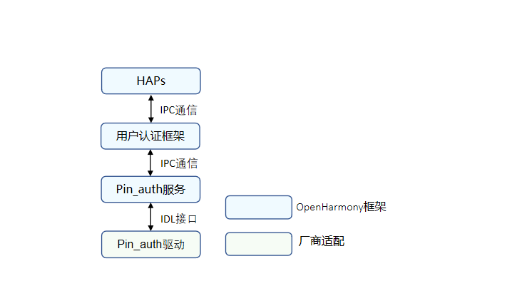
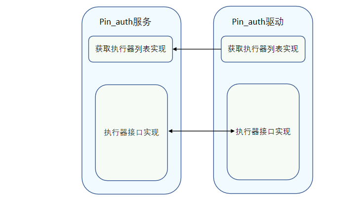

# Pin_auth

## 概述

### 功能简介

口令认证是端侧设备不可或缺的一部分，为设备提供一种用户认证能力，可应用于设备解锁、支付、应用登录等身份认证场景。用户注册口令后，口令认证模块就可为设备提供密码解锁的功能，保证设备的安全使用。口令识别的整体架构如图1。

基于HDF（Hardware Driver Foundation）驱动框架开发的Pin_auth驱动，Pin_auth驱动模型屏蔽硬件差异，为上层用户IAM子系统基础框架和口令认证SA提供稳定的口令认证基础能力，包括口令认证执行器列表查询、执行器信息查询、指定模板防暴信息查询、用户认证和执行器间的模板信息对账，以及口令的录入、认证、删除。

**图1** 口令认证架构图



### 基本概念
用户认证框架与各个基础认证服务（包含口令认证、人脸识别等）组成的身份认证系统，支持用户认证凭据设置、删除、认证等基础功能。

- 执行器

  执行器是能够提供数据采集、处理、存储及比对能力的模块，各基础认证服务提供执行器能力，被身份认证框架调度完成各项基础能力。

- 执行器安全等级

  执行器提供能力时运行环境所达到的安全级别。

- 执行器角色

  - ​    全功能执行器：执行器可独立处理一次凭据注册和身份认证请求，即可提供用户认证数据采集、处理、储存及比对能力。

  - ​    采集器：执行器提供用户认证时的数据采集能力，需要和认证器配合完成用户认证。

  - ​    认证器：认证器提供用户认证时的数据处理能力，读取存储的凭据模板与当前认证信息完成对比。

- 执行器类型

  同一种身份认证类型的不同认证方式会产生认证算法差异，设备器件差异也会导致算法差异，执行器根据支持的算法类型差异或对接的器件差异，会定义不同的执行器类型。

- 用户认证框架公钥 & 执行器公钥

  用户身份认证处理需要保证用户数据安全以及认证结果的准确性，用户认证框架与基础认证服务间的关键交互信息需要做数据完整性保护，各基础认证服务将提供的执行器能力对接到用户认证框架时，需要交换各自的公钥，其中：

    - 执行器通过用户认证框架公钥校验调度指令的准确性。

    - 执行器公钥可被用户认证框架用于校验认证结果的准确性，同时用于执行器交互认证时的校验交互信息的完整性。


- 口令认证凭据模板

  认证凭据是在用户设置认证凭据时由认证服务产生并存储，每个模板有一个ID，用于索引模板信息文件，在认证时读取模板信息并用于与当次认证过程中产生的认证数据做对比，完成身份认证。

- 执行器对账

  用户认证框架统一管理用户身份和凭据ID的映射关系，执行器对接到用户认证框架时，会读取用户身份认证框架内保存的该执行器的模板ID列表，执行器需要与自己维护的模板ID列表进行比对，并删除冗余信息。

### 运作机制

Pin_auth驱动的主要工作是为上层用户认证框架和Pin_auth服务提供稳定的口令认证的基础能力，保证口令认证的功能可以正常运行。开发者可基于HDF框架对不同芯片进行各自驱动的开发以及HDI层接口的调用。

**图2** Pin_auth服务和pin_auth驱动接口



### 约束与限制
口令认证的实现需要在TEE安全环境中实现，口令凭据等数据的保密信息需要在安全环境中存储。
## 开发指导

### 场景介绍
Pin_auth驱动的主要工作是为上层用户认证框架和Pin_auth服务提供稳定的口令认证基础能力，保证设备上口令认证功能可以正常运行。

### 接口说明

**表1** 接口功能介绍

| 接口名                                                       | 功能介绍                                                     |
| ------------------------------------------------------------ | ------------------------------------------------------------ |
| GetExecutorList(std::vector<sptr<IExecutor>>& executorList)  | 获取执行器列表。                                             |
| GetExecutorInfo(ExecutorInfo& info)                          | 获取执行器信息。                                             |
| GetTemplateInfo(uint64_t templateId, TemplateInfo& info)     | 获取指定templateId的模板信息。                               |
| OnRegisterFinish(const std::vector<uint64_t>& templateIdList,<br/>const std::vector<uint8_t>& frameworkPublicKey,<br/>const std::vector<uint8_t>&  extraInfo) | 执行器注册成功后，获取用户认证框架的公钥信息；获取用户认证框架的template 列表用于对账。 |
| OnSetData(uint64_t scheduleId, uint64_t authSubType, <br/>const std::vector<uint8_t> &data) | 用于回调传pin码认证的子类型和脱敏数据。                      |
| Enroll(uint64_t scheduleId, const std::vector<uint8_t>& extraInfo,<br/>const sptr<IExecutorCallback>& callbackObj) | 录入pin码。                                              |
| Authenticate(uint64_t scheduleId, uint64_t templateId, const std::vector<uint8_t>& extraInfo, const sptr<IExecutorCallback>& callbackObj) | pin码认证。                                              |
| Delete(uint64_t templateId)                                  | 删除pin码模板。                                              |
| Cancel(uint64_t scheduleId)                                  | 通过scheduleId取消指定操作。                                 |
| SendCommand(int32_t commandId, const std::vector<uint8_t>& extraInfo,<br/>const sptr<IExecutorCallback>& callbackObj) | 预留接口。                                              |

**表2** 回调函数介绍

| 接口名                                                       | 功能介绍             |
| ------------------------------------------------------------ | -------------------- |
| IExecutorCallback::OnResult(int32_t code, const std::vector<uint8_t>& extraInfo) | 返回操作的最终结果。 |
| IExecutorCallback::OnGetData(uint64_t scheduleId, const std::vector<uint8_t>& salt,<br/> uint64_t authSubType)| 返回获取pin码数据信息。  |

### 开发步骤

以RK3568平台为例，我们提供了Pin_auth驱动DEMO实例，以下是目录结构及各部分功能简介。

```text
// drivers/peripheral/pin_auth
├── BUILD.gn # 编译脚本
├── bundle.json # 组件描述文件
├── test # 测试用例
└── hdi_service # Pin_auth驱动实现
    ├── BUILD.gn # 编译脚本
    ├── adaptor # 相关算法实现
    ├── common # 公共接口实现
    ├── database # 数据库实现
    ├── main # 口令相关功能实现入口
    └── service # Pin_auth驱动实现入口
        ├── inc # 头文件
        └── src
            ├── executor_impl.cpp # 认证、录入等功能接口实现
            ├── pin_auth_interface_driver.cpp # Pin_auth驱动入口
            └── pin_auth_interface_service.cpp # 获取执行器列表接口实现
```

下面结合DEMO实例介绍驱动开发的具体步骤。

1. 基于HDF驱动框架，按照驱动Driver Entry程序，完成pin_auth驱动开发，主要由Bind、Init、Release、Dispatch函数接口实现，详细代码参见[pin_auth_interface_driver.cpp](https://gitee.com/openharmony/drivers_peripheral/blob/master/pin_auth/hdi_service/service/src/pin_auth_interface_driver.cpp)文件。

   ```c++
   // 通过自定义的HdfPinAuthInterfaceHost对象包含IoService对象和真正的HDI Service实现PinAuthInterfaceService对象
   struct HdfPinAuthInterfaceHost {
       struct IDeviceIoService ioService;
       OHOS::sptr<OHOS::IRemoteObject> stub;
   };
   
   // 服务接口调用响应接口
   static int32_t PinAuthInterfaceDriverDispatch(struct HdfDeviceIoClient *client, int cmdId, struct HdfSBuf *data,  struct HdfSBuf *reply)
   {
       IAM_LOGI("start");
       auto *hdfPinAuthInterfaceHost = CONTAINER_OF(client->device->service,
           struct HdfPinAuthInterfaceHost, ioService);
   
       OHOS::MessageParcel *dataParcel = nullptr;
       OHOS::MessageParcel *replyParcel = nullptr;
       OHOS::MessageOption option;
   
       if (SbufToParcel(data, &dataParcel) != HDF_SUCCESS) {
           IAM_LOGE("%{public}s:invalid data sbuf object to dispatch", __func__);
           return HDF_ERR_INVALID_PARAM;
       }
       if (SbufToParcel(reply, &replyParcel) != HDF_SUCCESS) {
           IAM_LOGE("%{public}s:invalid reply sbuf object to dispatch", __func__);
           return HDF_ERR_INVALID_PARAM;
       }
   
       return hdfPinAuthInterfaceHost->stub->SendRequest(cmdId, *dataParcel, *replyParcel, option);
   }
   
   // 初始化接口
   static int HdfPinAuthInterfaceDriverInit(struct HdfDeviceObject *deviceObject)
   {
       IAM_LOGI("start");
       std::shared_ptr<OHOS::UserIAM::PinAuth::PinAuth> pinHdi =
           OHOS::UserIAM::Common::MakeShared<OHOS::UserIAM::PinAuth::PinAuth>();
       constexpr uint32_t SUCCESS = 0;
       if (pinHdi == nullptr || pinHdi->Init() != SUCCESS) {
           IAM_LOGE("Pin hal init failed");
           return HDF_FAILURE;
       }
       return HDF_SUCCESS;
   }
   
   // PinAuth驱动对外提供的服务绑定到HDF框架
   static int HdfPinAuthInterfaceDriverBind(struct HdfDeviceObject *deviceObject)
   {
       IAM_LOGI("start");
       auto *hdfPinAuthInterfaceHost = new (std::nothrow) HdfPinAuthInterfaceHost;
       if (hdfPinAuthInterfaceHost == nullptr) {
           IAM_LOGE("%{public}s: failed to create create HdfPinAuthInterfaceHost object", __func__);
           return HDF_FAILURE;
       }
   
       hdfPinAuthInterfaceHost->ioService.Dispatch = PinAuthInterfaceDriverDispatch;
       hdfPinAuthInterfaceHost->ioService.Open = NULL;
       hdfPinAuthInterfaceHost->ioService.Release = NULL;
   
       auto serviceImpl = IPinAuthInterface::Get(true);
       if (serviceImpl == nullptr) {
           IAM_LOGE("%{public}s: failed to get of implement service", __func__);
           return HDF_FAILURE;
       }
   
       hdfPinAuthInterfaceHost->stub = OHOS::HDI::ObjectCollector::GetInstance().GetOrNewObject(serviceImpl,
           IPinAuthInterface::GetDescriptor());
       if (hdfPinAuthInterfaceHost->stub == nullptr) {
           IAM_LOGE("%{public}s: failed to get stub object", __func__);
           return HDF_FAILURE;
       }
   
       deviceObject->service = &hdfPinAuthInterfaceHost->ioService;
       IAM_LOGI("success");
       return HDF_SUCCESS;
   }
   
   // 释放PinAuth驱动中的资源
   static void HdfPinAuthInterfaceDriverRelease(struct HdfDeviceObject *deviceObject)
   {
       IAM_LOGI("start");
       auto *hdfPinAuthInterfaceHost = CONTAINER_OF(deviceObject->service,
           struct HdfPinAuthInterfaceHost, ioService);
       delete hdfPinAuthInterfaceHost;
       IAM_LOGI("success");
   }
   
   static struct HdfDriverEntry g_pinAuthInterfaceDriverEntry = {
       .moduleVersion = 1,
       .moduleName = "pinauth_interface_service",
       .Bind = HdfPinAuthInterfaceDriverBind,
       .Init = HdfPinAuthInterfaceDriverInit,
       .Release = HdfPinAuthInterfaceDriverRelease,
   };
   
   // 调用HDF_INIT将驱动入口注册到HDF框架中，在加载驱动时HDF框架会先调用Bind函数,再调用Init函数加载该驱动，当Init调用异常时，HDF框架会调用Release释放驱动资源并退出
   HDF_INIT(g_pinauthinterfaceDriverEntry);
   ```

   
   
1. 完成获取执行器列表接口实现，详细代码参见[pin_auth_interface_service.cpp](https://gitee.com/openharmony/drivers_peripheral/blob/master/pin_auth/hdi_service/service/src/pin_auth_interface_service.cpp)文件。

   ```c++
   // 执行器实现类
   class ExecutorImpl : public IExecutor, public NoCopyable {
   public:
       explicit ExecutorImpl(std::shared_ptr<OHOS::UserIAM::PinAuth::PinAuth> pinHdi);
       virtual ~ExecutorImpl() {}
       int32_t GetExecutorInfo(ExecutorInfo &info) override;
       int32_t GetTemplateInfo(uint64_t templateId, TemplateInfo &info) override;
       int32_t OnRegisterFinish(const std::vector<uint64_t> &templateIdList,
           const std::vector<uint8_t> &frameworkPublicKey, const std::vector<uint8_t> &extraInfo) override;
       int32_t OnSetData(uint64_t scheduleId, uint64_t authSubType, const std::vector<uint8_t> &data) override;
       int32_t Enroll(uint64_t scheduleId, const std::vector<uint8_t> &extraInfo,
           const sptr<IExecutorCallback> &callbackObj) override;
       int32_t Authenticate(uint64_t scheduleId, uint64_t templateId, const std::vector<uint8_t> &extraInfo,
           const sptr<IExecutorCallback> &callbackObj) override;
       int32_t Delete(uint64_t templateId) override;
       int32_t Cancel(uint64_t scheduleId) override;
       int32_t SendCommand(int32_t commandId, const std::vector<uint8_t> &extraInfo,
           const sptr<IExecutorCallback> &callbackObj) override;
   
   private:
       class ScheduleMap {
       public:
           uint32_t AddScheduleInfo(const uint64_t scheduleId, const uint32_t commandId,
               const sptr<IExecutorCallback> callback, const uint64_t templateId, const std::vector<uint8_t> salt);
           uint32_t GetScheduleInfo(const uint64_t scheduleId, uint32_t &commandId, sptr<IExecutorCallback> &callback,
               uint64_t &templateId, std::vector<uint8_t> &salt);
           uint32_t DeleteScheduleId(const uint64_t scheduleId);
   
       private:
           struct ScheduleInfo {
               uint32_t commandId;
               sptr<IExecutorCallback> callback;
               uint64_t templateId;
               std::vector<uint8_t> salt;
           };
   
           std::mutex mutex_;
           std::map<uint64_t, struct ScheduleInfo> scheduleInfo_;
       };
   
   private:
       uint32_t NewSalt(std::vector<uint8_t> &salt);
       void CallError(const sptr<IExecutorCallback> &callbackObj, const uint32_t errorCode);
       std::shared_ptr<OHOS::UserIAM::PinAuth::PinAuth> pinHdi_;
       ScheduleMap scheduleMap_;
   };
   
   // 获取执行器列表实现，创建执行器（仅作示例）
   int32_t PinAuthInterfaceService::GetExecutorList(std::vector<sptr<IExecutor>> &executorList)
   {
       IAM_LOGI("start");
       std::shared_ptr<OHOS::UserIAM::PinAuth::PinAuth> pinHdi =
           OHOS::UserIAM::Common::MakeShared<OHOS::UserIAM::PinAuth::PinAuth>();
       if (pinHdi == nullptr) {
           IAM_LOGE("Generate pinHdi failed");
           return HDF_FAILURE;
       }
       sptr<IExecutor> executor = new (std::nothrow) ExecutorImpl(pinHdi);
       if (executor == nullptr) {
           IAM_LOGE("Generate executor failed");
           return HDF_FAILURE;
       }
       executorList.push_back(executor);
       IAM_LOGI("end");
       return HDF_SUCCESS;
   }
   ```
   
   
   
1. 完成执行器每个功能接口实现，详细代码参见[executor_impl.cpp](https://gitee.com/openharmony/drivers_peripheral/blob/master/pin_auth/hdi_service/service/src/executor_impl.cpp)文件。

   ```c++
   // 实现获取执行器信息接口（仅作示例）
   int32_t ExecutorImpl::GetExecutorInfo(ExecutorInfo &info)
   {
       IAM_LOGI("start");
       constexpr unsigned short SENSOR_ID = 1;
       info.sensorId = SENSOR_ID;
       info.executorType = EXECUTOR_TYPE;
       info.executorRole = ExecutorRole::ALL_IN_ONE;
       info.authType = AuthType::PIN;
       if (pinHdi_ == nullptr) {
           IAM_LOGE("pinHdi_ is nullptr");
           return HDF_FAILURE;
       }
       uint32_t eslRet = 0;
       int32_t result = pinHdi_->GetExecutorInfo(info.publicKey, eslRet);
       if (result != SUCCESS) {
           IAM_LOGE("Get ExecutorInfo failed, fail code : %{public}d", result);
           return result;
       }
       info.esl = static_cast<ExecutorSecureLevel>(eslRet);
   
       return HDF_SUCCESS;
   }
   
   // 实现获取指定templateId的模板信息接口
   int32_t ExecutorImpl::GetTemplateInfo(uint64_t templateId, TemplateInfo &info)
   {
       IAM_LOGI("start");
       if (pinHdi_ == nullptr) {
           IAM_LOGE("pinHdi_ is nullptr");
           return HDF_FAILURE;
       }
       OHOS::UserIAM::PinAuth::PinCredentialInfo infoRet = {};
       int32_t result = pinHdi_->QueryPinInfo(templateId, infoRet);
       if (result != SUCCESS) {
           IAM_LOGE("Get TemplateInfo failed, fail code : %{public}d", result);
           return result;
       }
       /* subType is stored in extraInfo */
       info.extraInfo.resize(infoRet.subType);
       if (memcpy_s(&(info.extraInfo[0]), sizeof(infoRet.subType), &(infoRet.subType), sizeof(infoRet.subType)) != EOK) {
           IAM_LOGE("copy subType to extraInfo fail!");
           return HDF_FAILURE;
       }
   
       info.executorType = EXECUTOR_TYPE;
       info.remainAttempts = infoRet.remainTimes;
       info.lockoutDuration = infoRet.freezingTime;
   
       return HDF_SUCCESS;
   }
   
   // 实现执行器注册成功后，获取用户认证框架的公钥信息、获取用户认证框架的template 列表接口，将公钥信息保存，template列表用于和本地的template做对账
   int32_t ExecutorImpl::OnRegisterFinish(const std::vector<uint64_t> &templateIdList,
       const std::vector<uint8_t> &frameworkPublicKey, const std::vector<uint8_t> &extraInfo)
   {
       IAM_LOGI("start");
       static_cast<void>(frameworkPublicKey);
       static_cast<void>(extraInfo);
       if (pinHdi_ == nullptr) {
           IAM_LOGE("pinHdi_ is nullptr");
           return HDF_FAILURE;
       }
       int32_t result = pinHdi_->VerifyTemplateData(templateIdList);
       if (result != SUCCESS) {
           IAM_LOGE("Verify templateData failed");
           return result;
       }
   
       return HDF_SUCCESS;
   }
   
   // 实现口令录入接口
   int32_t ExecutorImpl::Enroll(uint64_t scheduleId, const std::vector<uint8_t> &extraInfo,
       const sptr<IExecutorCallback> &callbackObj)
   {
       IAM_LOGI("start");
       if (callbackObj == nullptr) {
           IAM_LOGE("callbackObj is nullptr");
           return HDF_FAILURE;
       }
       static_cast<void>(extraInfo);
       std::vector<uint8_t> salt;
       if (NewSalt(salt) != HDF_SUCCESS) {
           IAM_LOGE("new salt failed");
           CallError(callbackObj, HDF_FAILURE);
           return HDF_FAILURE;
       }
       int32_t result = scheduleMap_.AddScheduleInfo(scheduleId, ENROLL_PIN, callbackObj, 0, salt);
       if (result != HDF_SUCCESS) {
           IAM_LOGE("Add scheduleInfo failed, fail code : %{public}d", result);
           CallError(callbackObj, HDF_FAILURE);
           return result;
       }
       result = callbackObj->OnGetData(scheduleId, salt, 0);
       if (result != SUCCESS) {
           IAM_LOGE("Enroll Pin failed, fail code : %{public}d", result);
           // If the enroll fails, delete scheduleId of scheduleMap
           if (scheduleMap_.DeleteScheduleId(scheduleId) != HDF_SUCCESS) {
               IAM_LOGI("delete scheduleId failed");
           }
           return result;
       }
   
       return HDF_SUCCESS;
   }
   
   // 实现回调数据获取的接口
   int32_t ExecutorImpl::OnSetData(uint64_t scheduleId, uint64_t authSubType, const std::vector<uint8_t> &data)
   {
       IAM_LOGI("start");
       if (pinHdi_ == nullptr) {
           IAM_LOGE("pinHdi_ is nullptr");
           return HDF_FAILURE;
       }
       std::vector<uint8_t> resultTlv;
       int32_t result = SUCCESS;
       constexpr uint32_t INVALID_ID = 2;
       uint32_t commandId = INVALID_ID;
       sptr<IExecutorCallback> callback = nullptr;
       uint64_t templateId = 0;
       std::vector<uint8_t> salt(0, 0);
       if (scheduleMap_.GetScheduleInfo(scheduleId, commandId, callback, templateId, salt) != HDF_SUCCESS) {
           IAM_LOGE("Get ScheduleInfo failed, fail code : %{public}d", result);
           return HDF_FAILURE;
       }
       switch (commandId) {
           case ENROLL_PIN:
               result = pinHdi_->EnrollPin(scheduleId, authSubType, salt, data, resultTlv);
               if (result != SUCCESS) {
                   IAM_LOGE("Enroll Pin failed, fail code : %{public}d", result);
               }
               break;
           case AUTH_PIN:
               result = pinHdi_->AuthPin(scheduleId, templateId, data, resultTlv);
               if (result != SUCCESS) {
                   IAM_LOGE("Auth Pin failed, fail code : %{public}d", result);
               }
               break;
           default:
               IAM_LOGE("Error commandId");
       }
   
       if (callback->OnResult(result, resultTlv) != SUCCESS) {
           IAM_LOGE("callbackObj Pin failed");
       }
       // Delete scheduleId from the scheduleMap_ when the enroll and authentication are successful
       if (scheduleMap_.DeleteScheduleId(scheduleId) != HDF_SUCCESS) {
           IAM_LOGI("delete scheduleId failed");
       }
   
       return HDF_SUCCESS;
   }
   // 实现口令认证接口
   int32_t ExecutorImpl::Authenticate(uint64_t scheduleId, uint64_t templateId, const std::vector<uint8_t> &extraInfo,
       const sptr<IExecutorCallback> &callbackObj)
   {
       IAM_LOGI("start");
       if (callbackObj == nullptr) {
           IAM_LOGE("callbackObj is nullptr");
           return HDF_FAILURE;
       }
       if (pinHdi_ == nullptr) {
           IAM_LOGE("pinHdi_ is nullptr");
           CallError(callbackObj, HDF_FAILURE);
           return HDF_FAILURE;
       }
       static_cast<void>(extraInfo);
       std::vector<uint8_t> salt;
       int32_t result = pinHdi_->GetSalt(templateId, salt);
       if (result  != SUCCESS) {
           IAM_LOGE("get salt failed, fail code : %{public}d", result);
           CallError(callbackObj, HDF_FAILURE);
           return result;
       }
       result = scheduleMap_.AddScheduleInfo(scheduleId, AUTH_PIN, callbackObj, templateId, salt);
       if (result != HDF_SUCCESS) {
           IAM_LOGE("Add scheduleInfo failed, fail code : %{public}d", result);
           CallError(callbackObj, HDF_FAILURE);
           return result;
       }
       result = callbackObj->OnGetData(scheduleId, salt, 0);
       if (result != SUCCESS) {
           IAM_LOGE("Authenticate Pin failed, fail code : %{public}d", result);
           // If the authentication fails, delete scheduleId of scheduleMap
           if (scheduleMap_.DeleteScheduleId(scheduleId) != HDF_SUCCESS) {
               IAM_LOGI("delete scheduleId failed");
           }
           return result;
       }
   
       return HDF_SUCCESS;
   }
   
   // 实现删除口令模板接口
   int32_t ExecutorImpl::Delete(uint64_t templateId)
   {
       IAM_LOGI("start");
       if (pinHdi_ == nullptr) {
           IAM_LOGE("pinHdi_ is nullptr");
           return HDF_FAILURE;
       }
       int32_t result = pinHdi_->DeleteTemplate(templateId);
       if (result != SUCCESS) {
           IAM_LOGE("Verify templateData failed, fail code : %{public}d", result);
           return result;
       }
   
       return HDF_SUCCESS;
   }
   
   // 实现通过scheduleId取消指定操作接口
   int32_t ExecutorImpl::Cancel(uint64_t scheduleId)
   {
       IAM_LOGI("start");
       if (scheduleMap_.DeleteScheduleId(scheduleId) != HDF_SUCCESS) {
           IAM_LOGE("scheduleId is not found");
           return HDF_FAILURE;
       }
       return HDF_SUCCESS;
   }
   
   // 口令预留接口
   int32_t ExecutorImpl::SendCommand(int32_t commandId, const std::vector<uint8_t> &extraInfo,
       const sptr<IExecutorCallback> &callbackObj)
   {
       IAM_LOGI("Extension interface, temporarily useless");
       static_cast<void>(commandId);
       static_cast<void>(extraInfo);
       static_cast<void>(callbackObj);
       return HDF_SUCCESS;
   }
   ```
   

### 调测验证
驱动开发完成后，可基于RK3568平台验证, 通过设备的设置和锁屏功能验证口令认证功能是否正常，测试步骤如下：

1.  点击设备的 “ 设置 > 生物识别和密码 > 锁屏密码" 后，录入锁屏密码。
2.  按设备电源键进行锁屏，再次按设备的电源键进行解锁，输入锁屏密码进行解锁验证，至此就完成了口令的录入和认证功能。
3.  进入设置中的生物识别和密码，点击关闭锁屏密码或者更改锁屏密码，来验证口令的删除和更新功能是否正常。
4.  在步骤1完成后，进行步骤2的输入锁屏密码时，输入错误密码达到一定的次数来验证，防暴力破解能力是否正常（例如：连续输入5次错误密码，设备将被冻结60s）。
