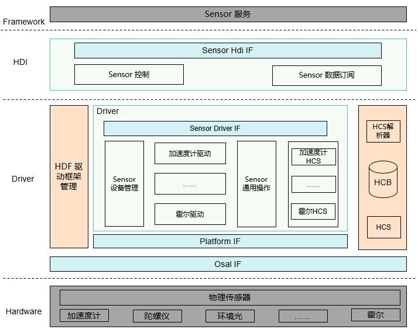
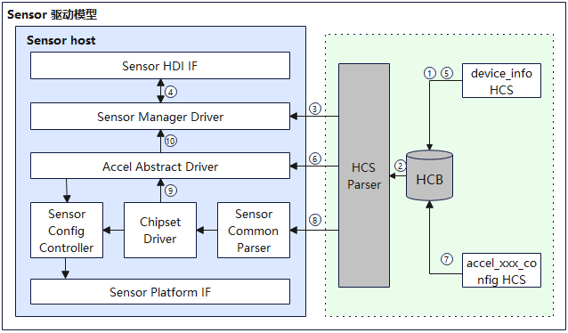

# Sensor


## 概述

### 功能简介

Sensor驱动模型屏蔽硬件器件差异，为上层Sensor服务系统提供稳定的Sensor基础能力接口，包括Sensor列表查询、Sensor启停、Sensor订阅及取消订阅，Sensor参数配置等功能。Sensor设备驱动的开发是基于HDF驱动框架基础上，结合操作系统适配层（OSAL）和平台驱动接口（比如I2C/SPI/UART总线等平台资源）能力，屏蔽不同操作系统和平台总线资源差异，实现Sensor驱动“一次开发，多系统部署”的目标。Sensor驱动模型如图1所示。

**图 1**  Sensor驱动模型图



### 基本概念

目前根据sensorId将Sensor分为医学类Sensor、传统类Sensor两种。

- 医学类Sensor：已订阅的sensorId枚举值在128-160范围的为医学类Sensor。

- 传统类Sensor：已订阅的sensorId枚举值不在128-160范围的为传统类Sensor。

### 运作机制

通过介绍Sensor驱动模型的加载以及运行流程，对模型内部关键组件以及关联组件之间的关系进行了划分，整体加载流程如图2所示：

**图 2** Sensor驱动运行图



Sensor驱动模型以标准系统RK3568产品中的加速度传感器驱动为例，介绍整个驱动加载及运行流程：

1. 从device_info.hcs配置文件中的Sensor Host读取到Sensor设备管理配置信息。
2. HDF配置框架从HCB数据库中解析Sensor设备管理配置信息，并关联对应设备驱动。
3. 加载并初始化Sensor设备管理驱动。
4. Sensor设备管理驱动向HDI发布Sensor基础能力接口。
5. 从device_info.hcs配置文件中的Sensor Host读取到加速度传感器驱动配置信息。
6. 加载加速度传感器抽象驱动，调用初始化接口，完成Sensor器件的驱动资源分配和数据处理队列的创建。
7. 从accel_xxx_config.hcs配置文件中读取到加速度传感器差异化驱动配置和私有化配置信息。
8. 加速度传感器芯片差异化驱动，调用通用配置解析接口，完成器件属性信息解析，器件寄存器解析。
9. 加速度传感器芯片差异化驱动完成器件的探测，并分配加速度传感器配置资源和加速度传感器差异化接口注册。
10. 加速度传感器成功探测到器件之后，加速度传感器芯片差异化驱动通知加速度传感器抽象驱动，注册加速度传感器设备到Sensor设备管理中。

## 开发指导

### 场景介绍

- 通过重力和陀螺仪传感器数据，能感知设备倾斜和旋转量，提高用户在游戏场景中的体验。
- 通过接近光传感器数据，感知距离遮挡物的距离，使设备能够自动亮灭屏，达到防误触目的。例如，手机通话时，如屏幕距离人脸过近，则自动关闭屏幕，防止误触的同时降低功耗。
- 通过气压计传感器数据，可以准确的判断设备当前所处的海拔。
- 通过环境光传感器数据，设备能够实现背光自动调节。
- 通过霍尔传感器数据，设备可以实现皮套功能，皮套合上，手机上开一个小窗口，可降低功耗。

### 接口说明

Sensor驱动模型对外开放的API接口能力如下：

- 提供Sensor HDI（Hardware Device Interface）能力接口，简化服务开发。
- 提供Sensor驱动模型能力接口：
  - 依赖HDF驱动框架实现Sensor器件驱动的加载、器件探测、注册和去注册等能力。
  - 提供同一类型Sensor器件驱动归一接口、寄存器配置解析操作接口、总线访问抽象接口和平台抽象接口。
- 提供开发者实现的能力接口：依赖HDF驱动框架的HCS（HDF Configuration Source）配置管理，根据同类型Sensor差异化配置，实现Sensor器件参数序列化配置和器件部分操作接口，简化Sensor器件驱动开发。

Sensor驱动模型对外开放的API接口能力的具体实现请参考：

**表 1**  Sensor驱动模型对外API接口功能介绍

注：以下接口列举的为C接口，接口声明见文件[/drivers/peripheral/sensor/interfaces/include](https://gitee.com/openharmony/drivers_peripheral/tree/master/sensor/interfaces/include)。

| 接口名 | 功能描述 |
| ----- | -------- |
| int32_t GetAllSensors(struct SensorInformation **sensorInfo, int32_t *count) | 获取系统中注册的所有传感器信息，一组完整传感器信息包括传感器名字、设备厂商、固件版本号、硬件版本号、传感器类型编号、传感器标识、最大量程、精度、功耗。 |
| int32_t Enable(int32_t sensorId) | 使能指定传感器设备，只有数据订阅者使能传感器后，才能获取订阅的传感器数据。 |
| int32_t Disable(int32_t sensorId) | 去使能指定传感器设备。 |
| int32_t SetBatch(int32_t sensorId, int64_t samplingInterval, int64_t reportInterval) | 设置指定传感器的数据采样间隔和数据上报间隔。 |
| int32_t SetMode(int32_t sensorId, int32_t mode) | 设置指定传感器的工作模式，不同的工作模式，上报数据方式不同。 |
| int32_t SetOption(int32_t sensorId, uint32_t option) | 设置指定传感器量程，精度等可选配置。 |
| int32_t Register(int32_t groupId, RecordDataCallback cb) | 订阅者根据不同groupId注册传感器数据回调函数，系统会将获取到的传感器数据上报给订阅者。 |
| int32_t Unregister(int32_t groupId, RecordDataCallback cb) | 订阅者根据groupId和回调函数注销对应订阅者的传感器数据回调函数。 |

Sensor驱动模型对驱动开发者开放的功能接口，驱动开发者无需实现，直接使用，请参考：

 **表2** Sensor驱动模型对驱动开发者开放的功能接口列表

| 接口名 | 功能描述 |
| ----- | -------- |
| int32_t AddSensorDevice(const struct SensorDeviceInfo *deviceInfo) | 添加当前类型的传感器设备到传感器设备管理。 |
| int32_t DeleteSensorDevice(const struct SensorBasicInfo *sensorBaseInfo) | 删除传感器设备管理里指定的传感器设备。 |
| int32_t ReportSensorEvent(const struct SensorReportEvent *events) | 上报指定类型传感器的数据到用户侧。 |
| int32_t ReadSensor(struct SensorBusCfg *busCfg, uint16_t regAddr, uint8_t *data, uint16_t dataLen) | 按照配置的总线方式，读取传感器寄存器配置数据。 |
| int32_t WriteSensor(struct SensorBusCfg *busCfg, uint8_t *writeData, uint16_t len) | 按照配置的总线方式，将传感器配置数据写入寄存器。 |
| int32_t SetSensorRegCfgArray(struct SensorBusCfg *busCfg, const struct SensorRegCfgGroupNode *group); | 根据传感器总线类型信息，下发寄存器分组配置。 |
| int32_t GetSensorBaseConfigData(const struct DeviceResourceNode *node, struct SensorCfgData *config) | 根据传感器设备HCS资源配置，获取传感器信息，总线配置信息，属性配置等基本配置信息，并初始化对应的基本配置数据结构体。 |
| int32_t ParseSensorRegConfig(struct SensorCfgData *config) | 根据传感器设备HCS资源配置，解析寄存器分组信息，并初始化配置数据结构体。 |
| void ReleaseSensorAllRegConfig(struct SensorCfgData *config) | 释放传感器配置数据结构体里分配的资源。 |
| int32_t GetSensorBusHandle(struct SensorBusCfg *busCfg) | 获取传感器总线句柄信息。 |
| int32_t ReleaseSensorBusHandle(struct SensorBusCfg *busCfg) | 释放传感器句柄信息。 |

Sensor驱动模型要求驱动开发者实现的接口功能，请参考：

**表 3**  Sensor驱动模型要求驱动开发者实现的接口列表

| 接口名 | 功能描述 |
| ----- | -------- |
| int32_t init(void) | 传感器设备探测成功后，需要对传感器设备初始化配置。 |
| int32_t Enable(void) | 根据当前传感器设备的HCS配置，下发传感器设备使能操作组的寄存器配置。 |
| int32_t Disable(void) | 根据当前传感器设备的HCS配置，下发传感器设备去使能操作组的寄存器配置。 |
| int32_t SetBatch(int64_t samplingInterval, int64_t reportInterval) | 根据数据采样率和数据上报间隔，配置当前传感器设备的数据上报线程处理时间。 |
| int32_t SetMode(int32_t mode) | 配置当前传感器设备数据上报方式。 |
| int32_t SetOption(uint32_t option) | 根据可选配置、下发量程和精度等寄存器配置。 |
| void ReadSensorData(void) | 读取传感器数据。                                             |


接口实现参考[开发步骤](#开发步骤)章节。

### 开发步骤
基于HDF驱动框架，按照驱动Driver Entry程序，以加速度传感器驱动为例，介绍传感器驱动的开发。传感器的驱动开发包括抽象驱动开发和差异化驱动开发两部分。传感器的抽象驱动开发包括同一个传感器id中不同器件的公共接口实现；传感器的差异化驱动开发包括不同器件差异化接口的实现。

1. 开发加速度传感器抽象驱动。

   - 加速度传感器抽象驱动在Sensor Host中的配置信息，代码实现路径如下：vendor\hihope\rk3568\hdf_config\khdf\device_info\device_info.hcs。

     具体代码实现如下：

     ```c
     /* 加速度计传感器设备HCS配置 */
     device_sensor_accel :: device {
         device0 :: deviceNode {
             policy = 1;                                  // 驱动服务发布的策略
             priority = 110;                              // 驱动启动优先级（0-200），值越大优先级越低，建议配置为100，优先级相同则不保证device的加载顺序
             preload = 0;                                 // 驱动按需加载字段，0表示加载，2表示不加载
             permission = 0664;                           // 驱动创建设备节点权限
             moduleName = "HDF_SENSOR_ACCEL";             // 驱动名称，该字段的值必须和驱动入口结构的moduleName值一致
             serviceName = "sensor_accel";                // 驱动对外发布服务的名称，必须唯一
             deviceMatchAttr = "hdf_sensor_accel_driver"; // 驱动私有数据匹配的关键字，必须和驱动私有数据配置表中的match_attr值相等
         }
     } 
     ```

   - 加速度传感器抽象驱动代码实现路径为：drivers\hdf_core\framework\model\sensor\driver\accel\sensor_accel_driver.c。

     - 加速度传感器抽象驱动对应的HdfDriverEntry对象，其中，Driver Entry入口函数定义如下：

       ```c
       struct HdfDriverEntry g_sensorAccelDevEntry = {
           .moduleVersion = 1,                // 加速度计传感器模块版本号
           .moduleName = "HDF_SENSOR_ACCEL",  // 加速度计传感器模块名，要与device_info.hcs文件里的加速度计moduleName字段值一样
           .Bind = BindAccelDriver,           // 加速度计传感器绑定函数
           .Init = InitAccelDriver,           // 加速度计传感器初始化函数
           .Release = ReleaseAccelDriver,     // 加速度计传感器资源释放函数
       };
       
       /* 调用HDF_INIT将驱动入口注册到HDF框架中。在加载驱动时HDF框架会先调用Bind函数，再调用Init函数加载该驱动。当Init调用异常时，HDF框架会调用Release释放驱动资源并退出 */
       HDF_INIT(g_sensorAccelDevEntry);
       ```

     - 加速度传感器抽象驱动Bind接口实现如下：

       ```c
       int32_t AccelBindDriver(struct HdfDeviceObject *device)
       {
           CHECK_NULL_PTR_RETURN_VALUE(device, HDF_ERR_INVALID_PARAM);
       
           struct AccelDrvData *drvData = (struct AccelDrvData *)OsalMemCalloc(sizeof(*drvData));
           if (drvData == NULL) {
               HDF_LOGE("%s: Malloc accel drv data fail!", __func__);
               return HDF_ERR_MALLOC_FAIL;
           }
       
           drvData->ioService.Dispatch = DispatchAccel;
           drvData->device = device;
           device->service = &drvData->ioService;
           g_accelDrvData = drvData;
           return HDF_SUCCESS;
       }
       ```

     - 加速度传感器抽象驱动Init接口实现如下：

       ```c
       int32_t AccelInitDriver(struct HdfDeviceObject *device)
       {
           CHECK_NULL_PTR_RETURN_VALUE(device, HDF_ERR_INVALID_PARAM);
           struct AccelDrvData *drvData = (struct AccelDrvData *)device->service;
           CHECK_NULL_PTR_RETURN_VALUE(drvData, HDF_ERR_INVALID_PARAM);
       	 /* 工作队列资源初始化 */
           if (InitAccelData(drvData) != HDF_SUCCESS) {
               HDF_LOGE("%s: Init accel config failed", __func__);
               return HDF_FAILURE;
           }
       	/* 分配加速度配置信息资源 */
           drvData->accelCfg = (struct SensorCfgData            *)OsalMemCalloc(sizeof(*drvData->accelCfg));
           if (drvData->accelCfg == NULL) {
               HDF_LOGE("%s: Malloc accel config data failed", __func__);
               return HDF_FAILURE;
           }
       	/* 注册寄存器分组信息 */
           drvData->accelCfg->regCfgGroup = &g_regCfgGroup[0];
           drvData->cb = NULL;
       	
           HDF_LOGI("%s: Init accel driver success", __func__);
           return HDF_SUCCESS;
       }
       ```

     - 加速度抽象传感器驱动Release接口在驱动卸载或者Init执行失败时，会调用此接口释放资源，具体实现如下：

       ```c
       void AccelReleaseDriver(struct HdfDeviceObject *device)
       {
           CHECK_NULL_PTR_RETURN(device);
       
           struct AccelDrvData *drvData = (struct AccelDrvData *)device->service;
           CHECK_NULL_PTR_RETURN(drvData);
       	/* 器件在位，释放已分配资源 */
           if (drvData->detectFlag && drvData->accelCfg != NULL) {
               AccelReleaseCfgData(drvData->accelCfg);
           }
       
           OsalMemFree(drvData->accelCfg);
           drvData->accelCfg = NULL;
       	/* 器件在位，销毁工作队列资源 */
           HdfWorkDestroy(&drvData->accelWork);
           HdfWorkQueueDestroy(&drvData->accelWorkQueue);
           OsalMemFree(drvData);
       }
       ```

     - 加速度传感器抽象驱动内部接口代码实现如下：

       - 提供给差异化驱动的初始化接口，完成加速度传感器器件的基本配置信息解析（加速度传感器信息，加速度传感器总线配置，加速度传感器器件探测寄存器配置），器件探测，器件寄存器解析，具体实现如下：

         ```c
         static int32_t InitAccelAfterDetected(struct SensorCfgData *config)
         {
             struct SensorDeviceInfo deviceInfo;
             CHECK_NULL_PTR_RETURN_VALUE(config, HDF_ERR_INVALID_PARAM);
         	/* 初始化加速度计接口函数 */
             if (InitAccelOps(config, &deviceInfo) != HDF_SUCCESS) {
                 HDF_LOGE("%s: Init accel ops failed", __func__);
                 return HDF_FAILURE;
             }
         	/* 注册加速度计器件到传感器设备管理模块 */
             if (AddSensorDevice(&deviceInfo) != HDF_SUCCESS) {
                 HDF_LOGE("%s: Add accel device failed", __func__);
                 return HDF_FAILURE;
             }
         	/* 器件寄存器解析 */
             if (ParseSensorDirection(config) != HDF_SUCCESS) {
                 HDF_LOGE("%s: Parse accel direction failed", __func__);
                 (void)DeleteSensorDevice(&config->sensorInfo);
                 return HDF_FAILURE;
             }
         
             if (ParseSensorRegConfig(config) != HDF_SUCCESS) {
                 HDF_LOGE("%s: Parse sensor register failed", __func__);
                 (void)DeleteSensorDevice(&config->sensorInfo);
                 ReleaseSensorAllRegConfig(config);
                 ReleaseSensorDirectionConfig(config);
                 return HDF_FAILURE;
             }
             return HDF_SUCCESS;
         }
         
         struct SensorCfgData *AccelCreateCfgData(const struct DeviceResourceNode *node)
         {
             struct AccelDrvData *drvData = AccelGetDrvData();
         	/* 如果器件不在位，返回进行下个器件探测 */
             if (drvData == NULL || node == NULL) {
                 HDF_LOGE("%s: Accel node pointer NULL", __func__);
                 return NULL;
             }
         
             if (drvData->detectFlag) {
                 HDF_LOGE("%s: Accel sensor have detected", __func__);
                 return NULL;
             }
         
             if (drvData->accelCfg == NULL) {
                 HDF_LOGE("%s: Accel accelCfg pointer NULL", __func__);
                 return NULL;
             }
         	/* 设备基本配置信息解析 */
             if (GetSensorBaseConfigData(node, drvData->accelCfg) != HDF_SUCCESS) {
                 HDF_LOGE("%s: Get sensor base config failed", __func__);
                 goto BASE_CONFIG_EXIT;
             }
         	/* 如果器件不在位（存在器件ID的情况），返回进行下个器件探测 */
             if (DetectSensorDevice(drvData->accelCfg) != HDF_SUCCESS) {
                 HDF_LOGI("%s: Accel sensor detect device no exist", __func__);
                 drvData->detectFlag = false;
                 goto BASE_CONFIG_EXIT;
             }
         	/* 器件寄存器解析 */
             drvData->detectFlag = true;
             if (InitAccelAfterDetected(drvData->accelCfg) != HDF_SUCCESS) {
                 HDF_LOGE("%s: Accel sensor detect device no exist", __func__);
                 goto INIT_EXIT;
             }
             return drvData->accelCfg;
         
         INIT_EXIT:
             (void)ReleaseSensorBusHandle(&drvData->accelCfg->busCfg);
         BASE_CONFIG_EXIT:
             drvData->accelCfg->root = NULL;
             (void)memset_s(&drvData->accelCfg->sensorInfo, sizeof(struct SensorBasicInfo), 0, sizeof(struct SensorBasicInfo));
             (void)memset_s(&drvData->accelCfg->busCfg, sizeof(struct SensorBusCfg), 0, sizeof(struct SensorBusCfg));
             (void)memset_s(&drvData->accelCfg->sensorAttr, sizeof(struct SensorAttr), 0, sizeof(struct SensorAttr));
             return drvData->accelCfg;
         }
         ```

       - Enable接口的代码实现如下：

         ```c
         static int32_t SetAccelEnable(void)
         {
             int32_t ret;
             struct AccelDrvData *drvData = AccelGetDrvData();
         
             CHECK_NULL_PTR_RETURN_VALUE(drvData, HDF_ERR_INVALID_PARAM);
             CHECK_NULL_PTR_RETURN_VALUE(drvData->accelCfg, HDF_ERR_INVALID_PARAM);
         
             if (drvData->enable) {
                 HDF_LOGE("%s: Accel sensor is enabled", __func__);
                 return HDF_SUCCESS;
             }
         	/* 设置寄存器 */
             ret = SetSensorRegCfgArray(&drvData->accelCfg->busCfg, drvData->accelCfg->regCfgGroup[SENSOR_ENABLE_GROUP]);
             if (ret != HDF_SUCCESS) {
                 HDF_LOGE("%s: Accel sensor enable config failed", __func__);
                 return ret;
             }
         	/* 创建定时器 */
             ret = OsalTimerCreate(&drvData->accelTimer, SENSOR_TIMER_MIN_TIME, AccelTimerEntry, (uintptr_t)drvData);
             if (ret != HDF_SUCCESS) {
                 HDF_LOGE("%s: Accel create timer failed[%d]", __func__, ret);
                 return ret;
             }
         	/* 开启定时器进行数据上报 */
             ret = OsalTimerStartLoop(&drvData->accelTimer);
             if (ret != HDF_SUCCESS) {
                 HDF_LOGE("%s: Accel start timer failed[%d]", __func__, ret);
                 return ret;
             }
             drvData->enable = true;
         
             return HDF_SUCCESS;
         }
         ```

       - Disable接口的代码实现如下：

         ```c
         static int32_t SetAccelDisable(void)
         {
             int32_t ret;
             struct AccelDrvData *drvData = AccelGetDrvData();
         
             CHECK_NULL_PTR_RETURN_VALUE(drvData, HDF_ERR_INVALID_PARAM);
             CHECK_NULL_PTR_RETURN_VALUE(drvData->accelCfg, HDF_ERR_INVALID_PARAM);
         
             if (!drvData->enable) {
                 HDF_LOGE("%s: Accel sensor had disable", __func__);
                 return HDF_SUCCESS;
             }
         	/* 设置寄存器 */
             ret = SetSensorRegCfgArray(&drvData->accelCfg->busCfg, drvData->accelCfg->regCfgGroup[SENSOR_DISABLE_GROUP]);
             if (ret != HDF_SUCCESS) {
                 HDF_LOGE("%s: Accel sensor disable config failed", __func__);
                 return ret;
             }
         	/* 删除定时器 */
             ret = OsalTimerDelete(&drvData->accelTimer);
             if (ret != HDF_SUCCESS) {
                 HDF_LOGE("%s: Accel delete timer failed", __func__);
                 return ret;
             }
             drvData->enable = false;
         
             return HDF_SUCCESS;
         }
         ```

       - SetBatch接口的代码实现如下：

         ```c
         static int32_t SetAccelBatch(int64_t samplingInterval, int64_t interval)
         {
             (void)interval;
         
             struct AccelDrvData *drvData = NULL;
         
             drvData = AccelGetDrvData();
             CHECK_NULL_PTR_RETURN_VALUE(drvData, HDF_ERR_INVALID_PARAM);
         	/* 给定时器设置采样率 */
             drvData->interval = samplingInterval;
         
             return HDF_SUCCESS;
         }
         ```

       - SetMode接口的代码实现如下：

         ```c
         static int32_t SetAccelMode(int32_t mode)
         {
             if (mode <= SENSOR_WORK_MODE_DEFAULT || mode >= SENSOR_WORK_MODE_MAX) {
                 HDF_LOGE("%s: The current mode is not supported", __func__);
                 return HDF_FAILURE;
             }
         
             return HDF_SUCCESS;
         }
         ```

       - SetOption接口的代码实现如下：

         ```c
         static int32_t SetAccelOption(uint32_t option)
         {
             (void)option;
             return HDF_SUCCESS;
         }
         ```

2. 开发加速度传感器差异化驱动。

   - 加速度传感器差异化驱动在Sensor Host中的配置信息，代码实现路径如下：vendor\hihope\rk3568\hdf_config\khdf\device_info\device_info.hcs。

     具体代码实现如下：

     ```c
     device_sensor_mxc6655xa :: device {
         device0 :: deviceNode {
             policy = 1;		// policy字段是驱动服务发布的策略
             priority = 120; // 驱动启动优先级（0-200），值越大优先级越低，建议配置为100，优先级相同则不保证device的加载顺序 
             preload = 0;    // 驱动按需加载字段，0表示加载，2表示不加载
             permission = 0664; // 驱动创建设备节点权限
             moduleName = "HDF_SENSOR_ACCEL_MXC6655XA"; // 驱动名称，该字段的值必须和驱动入口结构的moduleName值一致
             serviceName = "hdf_accel_mxc6655xa"; // 加速度mxc6655xa对外发布服务的名称，必须唯一
             deviceMatchAttr = "hdf_sensor_accel_mxc6655xa_driver"; // 加速度差异化驱动私有数据匹配的关键字，必须和驱动私有数据配置表中的match_attr值相等
         }
     }
     ```

   - 加速度传感器差异化驱动私有HCS配置：

     - 代码实现路径：vendor\hihope\rk3568\hdf_config\khdf\sensor\accel\mxc6655xa_config.hcs。

     - 具体代码实现如下：

       ```c
       #include "../sensor_common.hcs"
       root {
           accel_mxc6655xa_chip_config : sensorConfig {
               match_attr = "hdf_sensor_accel_mxc6655xa_driver";
               sensorInfo :: sensorDeviceInfo {
                   sensorName = "accelerometer";
                   vendorName = "memsi_mxc6655xa"; // max string length is 16 bytes
                   sensorTypeId = 1; // enum SensorTypeTag
                   sensorId = 1; // user define sensor id
                   power = 230;
                   minDelay = 5000000; // nanosecond
                   maxDelay = 200000000; // nanosecond
               }
               sensorBusConfig :: sensorBusInfo {
                   busType = 0; // 0:i2c 1:spi
                   busNum = 5;
                   busAddr = 0x15;
                   regWidth = 1; // 1byte
               }
               sensorIdAttr :: sensorIdInfo {
                   chipName = "mxc6655xa";
                   chipIdRegister = 0x0f;
                   chipIdValue = 0x05; // 根据器件ID寄存器，读取的值，或查看相关芯片datasheet手册确认该值
               }
               sensorDirection {
                   direction = 1; // chip direction range of value:0-7
                   /* <sign> 1:negative  0:positive
                      <map> 0:AXIS_X  1:AXIS_Y  2:AXIS_Z
                   */
                   /* sign[AXIS_X], sign[AXIS_Y], sign[AXIS_Z], map[AXIS_X], map[AXIS_Y], map[AXIS_Z] */
                   convert = [
                       0, 0, 0, 0, 1, 2,
                       1, 0, 0, 1, 0, 2,
                       0, 0, 1, 0, 1, 2,
                       0, 1, 0, 1, 0, 2,
                       1, 0, 1, 0, 1, 2,
                       0, 0, 1, 1, 0, 2,
                       0, 1, 1, 0, 1, 2,
                       1, 1, 1, 1, 0, 2
                   ];
               }
               sensorRegConfig {
                   /*  regAddr: register address
                       value: config register value
                       len: size of value
                       mask: mask of value
                       delay: config register delay time (ms)
                       opsType: enum SensorOpsType 0-none 1-read 2-write 3-read_check 4-update_bit
                       calType: enum SensorBitCalType 0-none 1-set 2-revert 3-xor 4-left shift 5-right shift
                       shiftNum: shift bits
                       debug: 0-no debug 1-debug
                       save: 0-no save 1-save
                   */
                   /* regAddr, value, mask, len, delay, opsType, calType, shiftNum, debug, save */
                   initSeqConfig = [
                       0x7e,    0xb6, 0xff,   1,     5,       2,       0,        0,     0,    0,
                       0x7e,    0x10, 0xff,   1,     5,       2,       0,        0,     0,    0
                   ];
                   enableSeqConfig = [
                       0x7e,    0x11, 0xff,   1,     5,       2,       0,        0,     0,    0,
                       0x41,    0x03, 0xff,   1,     0,       2,       0,        0,     0,    0,
                       0x40,    0x08, 0xff,   1,     0,       2,       0,        0,     0,    0
                   ];
                   disableSeqConfig = [
                       0x7e,    0x10, 0xff,   1,     5,       2,       0,        0,     0,    0
                   ];
               }
           }
       }
       ```

   - 加速度差异化驱动的代码实现路径：drivers\peripheral\sensor\chipset\accel\accel_mxc6655xa.c

     - 加速度传感器差异化驱动对应的HdfDriverEntry对象，其中，Driver Entry入口函数定义如下：

       ```c
       /* 注册加速度mxc6655xa传感器入口数据结构体对象 */
       struct HdfDriverEntry g_accelMxc6655xaDevEntry = {
           .moduleVersion = 1, // 加速度mxc6655xa传感器模块版本号
           .moduleName = "HDF_SENSOR_ACCEL_MXC6655XA", // 加速度mxc6655xa传感器模块名，要与device_info.hcs文件里加速度mxc6655xa传感器moduleName字段值一致
           .Bind = Mxc6655xaBindDriver, // 加速度mxc6655xa传感器的绑定函数
           .Init = Mxc6655xaInitDriver, // 加速度mxc6655xa传感器的初始化函数
           .Release = Mxc6655xaReleaseDriver, // 加速度mxc6655xa传感器资源释放函数
       };
       /* 调用HDF_INIT将驱动入口注册到HDF框架中，在加载驱动时HDF框架会先调用Bind函数,再调用Init函数加载该驱动，当Init调用异常时，HDF框架会调用Release释放驱动资源并退出 */
       HDF_INIT(g_accelMxc6655xaDevEntry);
       ```

     - 加速度传感器差异化驱动Bind接口实现如下：

       ```c
       int32_t Mxc6655xaBindDriver(struct HdfDeviceObject *device)
       {
           CHECK_NULL_PTR_RETURN_VALUE(device, HDF_ERR_INVALID_PARAM);
       
           struct Mxc6655xaDrvData *drvData = (struct Mxc6655xaDrvData *)OsalMemCalloc(sizeof(*drvData));
           if (drvData == NULL) {
               HDF_LOGE("%s: Malloc MXC6655XA drv data fail", __func__);
               return HDF_ERR_MALLOC_FAIL;
           }
       
           drvData->ioService.Dispatch = DispatchMXC6655xa;
           drvData->device = device;
           device->service = &drvData->ioService;
           g_mxc6655xaDrvData = drvData;
       
           return HDF_SUCCESS;
       }
       ```

     - 加速度传感器差异化驱动Init接口实现如下：

       ```c
       int32_t Mxc6655xaInitDriver(struct HdfDeviceObject *device)
       {
           int32_t ret;
           struct AccelOpsCall ops;
       
           CHECK_NULL_PTR_RETURN_VALUE(device, HDF_ERR_INVALID_PARAM);
           struct Mxc6655xaDrvData *drvData = (struct Mxc6655xaDrvData *)device->service;
           CHECK_NULL_PTR_RETURN_VALUE(drvData, HDF_ERR_INVALID_PARAM);
       
           drvData->sensorCfg = AccelCreateCfgData(device->property);
           if (drvData->sensorCfg == NULL || drvData->sensorCfg->root == NULL) {
               HDF_LOGD("%s: Creating accelcfg failed because detection failed", __func__);
               return HDF_ERR_NOT_SUPPORT;
           }
       
           ops.Init = NULL;
           ops.ReadData = ReadMxc6655xaData;
           ret = AccelRegisterChipOps(&ops);
           if (ret != HDF_SUCCESS) {
               HDF_LOGE("%s: Register MXC6655XA accel failed", __func__);
               return HDF_FAILURE;
           }
       
           ret = InitMxc6655xa(drvData->sensorCfg);
           if (ret != HDF_SUCCESS) {
               HDF_LOGE("%s: Init MXC6655XA accel failed", __func__);
               return HDF_FAILURE;
           }
       
           return HDF_SUCCESS;
       }
       ```

     - 加速度传感器差异化驱动Release接口实现如下：

       ```c
       void Mxc6655xaReleaseDriver(struct HdfDeviceObject *device)
       {
           CHECK_NULL_PTR_RETURN(device);
       
           struct Mxc6655xaDrvData *drvData = (struct Mxc6655xaDrvData *)device->service;
           CHECK_NULL_PTR_RETURN(drvData);
       
           if (drvData->sensorCfg != NULL) {
               AccelReleaseCfgData(drvData->sensorCfg);
               drvData->sensorCfg = NULL;
           }
           OsalMemFree(drvData);
       }
       ```

     - 加速度传感器差异化驱动内部接口实现。

       需要开发者实现的ReadMxc6655xaData接口函数，在 Mxc6655xaInitDriver函数里面注册此函数，具体实现如下：

       ```c
       static int32_t ReadMxc6655xaRawData(struct SensorCfgData *data, struct AccelData *rawData, uint64_t *timestamp)
       {
           uint8_t status = 0;
           uint8_t reg[ACCEL_AXIS_BUTT];
           OsalTimespec time;
           int32_t x;
           int32_t y;
           int32_t z;
       
           (void)memset_s(&time, sizeof(time), 0, sizeof(time));
           (void)memset_s(reg, sizeof(reg), 0, sizeof(reg));
       
           CHECK_NULL_PTR_RETURN_VALUE(data, HDF_ERR_INVALID_PARAM);
       
           if (OsalGetTime(&time) != HDF_SUCCESS) {
               HDF_LOGE("%s: Get time failed", __func__);
               return HDF_FAILURE;
           }
           *timestamp = time.sec * SENSOR_SECOND_CONVERT_NANOSECOND + time.usec * SENSOR_CONVERT_UNIT; /* unit nanosecond */
       
           int32_t ret = ReadSensor(&data->busCfg, MXC6655XA_STATUS_ADDR, &status, sizeof(uint8_t));
           if (ret != HDF_SUCCESS) {
               HDF_LOGE("%s: data status [%u] ret [%d]", __func__, status, ret);
               return HDF_FAILURE;
           }
       
           ret = ReadSensor(&data->busCfg, MXC6655XA_ACCEL_X_LSB_ADDR, &reg[ACCEL_X_AXIS_LSB], sizeof(uint8_t));
           CHECK_PARSER_RESULT_RETURN_VALUE(ret, "read data");
       
           ret = ReadSensor(&data->busCfg, MXC6655XA_ACCEL_X_MSB_ADDR, &reg[ACCEL_X_AXIS_MSB], sizeof(uint8_t));
           CHECK_PARSER_RESULT_RETURN_VALUE(ret, "read data");
       
           ret = ReadSensor(&data->busCfg, MXC6655XA_ACCEL_Y_LSB_ADDR, &reg[ACCEL_Y_AXIS_LSB], sizeof(uint8_t));
           CHECK_PARSER_RESULT_RETURN_VALUE(ret, "read data");
       
           ret = ReadSensor(&data->busCfg, MXC6655XA_ACCEL_Y_MSB_ADDR, &reg[ACCEL_Y_AXIS_MSB], sizeof(uint8_t));
           CHECK_PARSER_RESULT_RETURN_VALUE(ret, "read data");
       
           ret = ReadSensor(&data->busCfg, MXC6655XA_ACCEL_Z_LSB_ADDR, &reg[ACCEL_Z_AXIS_LSB], sizeof(uint8_t));
           CHECK_PARSER_RESULT_RETURN_VALUE(ret, "read data");
       
           ret = ReadSensor(&data->busCfg, MXC6655XA_ACCEL_Z_MSB_ADDR, &reg[ACCEL_Z_AXIS_MSB], sizeof(uint8_t));
           CHECK_PARSER_RESULT_RETURN_VALUE(ret, "read data");
       
           x = SensorConvertData(reg[ACCEL_X_AXIS_MSB], reg[ACCEL_X_AXIS_LSB]);
           y = SensorConvertData(reg[ACCEL_Y_AXIS_MSB], reg[ACCEL_Y_AXIS_LSB]);
           z = SensorConvertData(reg[ACCEL_Z_AXIS_MSB], reg[ACCEL_Z_AXIS_LSB]);
           rawData->x = x;
           rawData->y = y;
           rawData->z = z;
       
           return HDF_SUCCESS;
       }
       /* 读取加速度的event数据，在 Mxc6655xaInitDriver函数里面注册此函数，将数据传给加速度抽象驱动 */
       int32_t ReadMxc6655xaData(struct SensorCfgData *cfg, struct SensorReportEvent *event)
       {
           int32_t ret;
           struct AccelData rawData = { 0, 0, 0 };
           static int32_t tmp[ACCEL_AXIS_NUM];
       
           CHECK_NULL_PTR_RETURN_VALUE(cfg, HDF_ERR_INVALID_PARAM);
           CHECK_NULL_PTR_RETURN_VALUE(event, HDF_ERR_INVALID_PARAM);
       
           ret = ReadMxc6655xaRawData(cfg, &rawData, &event->timestamp);
           if (ret != HDF_SUCCESS) {
               HDF_LOGE("%s: MXC6655XA read raw data failed", __func__);
               return HDF_FAILURE;
           }
       
           event->sensorId = SENSOR_TAG_ACCELEROMETER;
           event->option = 0;
           event->mode = SENSOR_WORK_MODE_REALTIME;
       
           rawData.x = rawData.x * MXC6655XA_ACC_SENSITIVITY_2G;
           rawData.y = rawData.y * MXC6655XA_ACC_SENSITIVITY_2G;
           rawData.z = rawData.z * MXC6655XA_ACC_SENSITIVITY_2G;
       
           tmp[ACCEL_X_AXIS] = (rawData.x * SENSOR_CONVERT_UNIT) / SENSOR_CONVERT_UNIT;
           tmp[ACCEL_Y_AXIS] = (rawData.y * SENSOR_CONVERT_UNIT) / SENSOR_CONVERT_UNIT;
           tmp[ACCEL_Z_AXIS] = (rawData.z * SENSOR_CONVERT_UNIT) / SENSOR_CONVERT_UNIT;
       
           ret = SensorRawDataToRemapData(cfg->direction, tmp, sizeof(tmp) / sizeof(tmp[0]));
           if (ret != HDF_SUCCESS) {
               HDF_LOGE("%s: MXC6655XA convert raw data failed", __func__);
               return HDF_FAILURE;
           }
       
           event->dataLen = sizeof(tmp);
           event->data = (uint8_t *)&tmp;
       
           return ret;
       }
       ```

### 调测验证

驱动开发完成后，在传感器单元测试里面开发自测试用例，验证驱动基本功能。测试环境采用开发者自测试平台。

- 参考测试代码如下：

  ```c
  #include <cmath>
  #include <cstdio>
  #include <unistd.h>
  #include <gtest/gtest.h>
  #include <securec.h>
  #include "hdf_base.h"
  #include "osal_mem.h"
  #include "osal_time.h"
  #include "sensor_if.h"
  #include "sensor_type.h"
  
  using namespace testing::ext;
  const struct SensorInterface *g_sensorDev = nullptr;
  /* 创建回调函数 */
  static int32_t SensorDataCallback(const struct SensorEvents *event)
  {
      if (event == NULL) {
          return HDF_FAILURE;
      }
  
      float *data = (float*)event->data;
      printf("time [%lld] sensor id [%d] x-[%f] y-[%f] z-[%f]\n\r", event->timestamp,
          event->sensorId, (*data), *(data + 1), *(data + 2));
  
      return HDF_SUCCESS;
  }
  
  class HdfSensorTest : public testing::Test {
  public:
      static void SetUpTestCase();
      static void TearDownTestCase();
      void SetUp();
      void TearDown();
  };
  
  /* 用例执行前，初始化传感器接口实例 */
  void HdfSensorTest::SetUpTestCase()
  {
      g_sensorDev = NewSensorInterfaceInstance();
      if (g_sensorDev == nullptr) {
          printf("test sensor get module instance failed\n\r");
      }
  }
  /* 用例资源释放 */
  void HdfSensorTest::TearDownTestCase()
  {
      if (g_sensorDev != nullptr) {
          FreeSensorInterfaceInstance();
          g_sensorDev = nullptr;
      }
  }
  
  void HdfSensorTest::SetUp()
  {
  }
  
  void HdfSensorTest::TearDown()
  {
  }
  
  HWTEST_F(HdfSensorTest,TestAccelDriver_001, TestSize.Level0)
  {
      int ret;
      struct SensorInformation *sensorInfo = NULL;
      int32_t count = 0;
      int32_t sensorInterval = 200000000; /* 数据采样率设置200毫秒，单位纳秒 */
      int32_t reportInterval = 400000000;
  
      /* 2.订阅者注册传感器数据回调处理函数 */
      ret = g_sensorDev->Register(TRADITIONAL_SENSOR_TYPE, SensorDataCallback);
      if (ret != 0) {
          return;
      }
      printf("Register success\n");
  
      /* 3.获取设备支持的Sensor列表 */
      ret = g_sensorDev->GetAllSensors(&sensorInfo, &count);
      if (ret != 0) {
          return;
      }
  
      printf("GetAllSensors count: %d\n", count);
  
      for (int i = 0; i < count; i++)
      {
          printf("sensor [%d]: sensorName: %s, vendorName: %s, sensorTypeId: %d, sensorId: %d\n", i,
                 sensorInfo[i].sensorName, sensorInfo[i].vendorName, sensorInfo[i].sensorTypeId, sensorInfo[i].sensorId);
      }
  
      for (int i = 0; i < count; i++)
      {
          /* 4.设置传感器采样率 */
          ret = g_sensorDev->SetBatch(sensorInfo[i].sensorId, sensorInterval, reportInterval);
          if (ret != 0) {
              printf("SetBatch failed\n ,ret: %d",ret);
              continue;
          }
          printf("SetBatch success\n");
  
          /* 5.使能传感器 */
          ret = g_sensorDev->Enable(sensorInfo[i].sensorId);
          if (ret != 0) {
              continue;
          }
       printf("Enable success\n");
  
       usleep(1000 * 1000);
  
          /* 6.去使能传感器 */
          ret = g_sensorDev->Disable(sensorInfo[i].sensorId);
          if (ret != 0) {
              continue;
          }
          printf("Disable success\n");
      }
  
      /* 7.取消传感器数据订阅函数 */
      ret = g_sensorDev->Unregister(TRADITIONAL_SENSOR_TYPE, SensorDataCallback);
      if (ret != 0) {
          return;
      }
      printf("Unregister success\n");
  }
  ```

- 编译文件gn参考代码如下：

  ```
  import("//build/ohos.gni")
  import("//build/test.gni")
  import("//drivers/hdf_core/adapter/uhdf2/uhdf.gni")
  
  module_output_path = "drivers_peripheral_sensor/sensor"
  ohos_unittest("sensor_test") {
    module_out_path = module_output_path
    sources = [ "sensor_test.cpp" ]
    include_dirs = [
      "//drivers/peripheral/sensor/interfaces/include",
    ]
    deps = [ "//drivers/peripheral/sensor/hal:hdi_sensor" ]
  
    external_deps = [
      "c_utils:utils",
      "hdf_core:libhdf_utils",
      "hiviewdfx_hilog_native:libhilog",
    ]
  
    cflags = [
      "-Wall",
      "-Wextra",
      "-Werror",
      "-Wno-format",
      "-Wno-format-extra-args",
    ]
  
    install_enable = true
    install_images = [ "vendor" ]
    module_install_dir = "bin"
    part_name = "unionman_products"
  }
  ```

