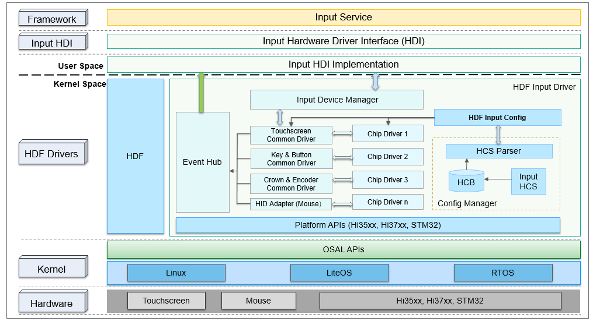
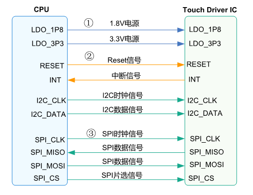

# Touchscreen


## 概述

### 功能简介

Touchscreen驱动用于驱动触摸屏使其正常工作，该驱动主要完成如下工作：对触摸屏驱动IC进行上电、配置硬件管脚并初始化其状态、注册中断、配置通信接口（I2C或SPI）、设定Input相关配置、下载及更新固件等操作。

在HDF（Hardware Driver Foundation）[驱动管理框架](driver-overview-foundation.md)的基础上，Input驱动模型通过调用OSAL接口层和Platform接口层提供的基础接口进行开发，涉及的接口包括bus通信接口、操作系统原生接口（memory、lock、thread、timer等）。由于OSAL接口和Platform接口屏蔽了芯片平台的差异，所以基于Input驱动模型实现的Touchscreen驱动可以进行跨平台、跨OS迁移，从而实现驱动的一次开发、多端部署。

### 运作机制

Input模型整体的框架如图1所示。Input驱动模型基于HDF驱动框架、Platform接口、OSAL接口进行开发，向上对接规范化的驱动接口HDI（Hardware Device Interface）层，通过Input-HDI层对外提供硬件能力，即上层Input Service可以通过HDI接口层获取相应的驱动能力，进而操控Touchscreen等输入设备。

**图1** 基于HDF驱动框架的Input驱动模型



Input驱动模型核心部分由设备管理层、公共驱动层、器件驱动层组成。器件产生的数据借助平台数据通道能力从内核传递到用户态，驱动模型通过配置文件适配不同器件及硬件平台，提高开发者对器件驱动的开发效率。如下为模型各部分的说明：

- Input设备管理：为各类输入设备驱动提供Input设备的注册、注销接口，同时对Input设备列表进行统一管理。
- Input平台驱动：指各类Input设备的公共抽象驱动（例如触摸屏的公共驱动），该部分主要负责对板级硬件进行初始化、硬件中断处理、向manager注册Input设备等。
- Input器件驱动：指各器件厂家的差异化驱动，开发者可以通过适配平台驱动预留的差异化接口进行器件驱动开发，实现器件驱动开发量最小化。
- Input数据通道：提供一套通用的数据上报通道，各类别的Input设备驱动均可用此通道上报Input事件。
- Input配置解析：负责对Input设备的板级配置及器件私有配置进行解析及管理。


## 开发指导

### 场景介绍

Input模块主要完成如下工作：对触摸屏驱动IC进行上电、配置硬件管脚并初始化其状态、注册中断、配置通信接口（I2C或SPI）、设定Input相关配置、下载及更新固件等操作。

### 接口说明

#### 硬件接口

Touchscreen器件的硬件接口相对简单，根据PIN脚的属性，可以简单分为如下三类：

- 电源接口

- IO控制接口

- 通信接口

**图2** Touchscreen器件常用管脚



对于上图所示的三类接口，简要说明如下：

1. **电源接口**

   - LDO_1P8：1.8V数字电路
   - LDO_3P3：3.3V模拟电路

     通常情况下，Touchscreen驱动IC和LCD驱动IC是相互分离的，这种情况下，Touchscreen驱动IC一般同时需要1.8V和3.3V两路供电。随着芯片的演进，业内已有将Touchscreen驱动IC和LCD驱动IC集成在一颗IC中的案例，对Touchscreen而言，只需要关注1.8V供电即可，其内部需要的3.3V电源，会在驱动IC内部从LCD的VSP电源（典型值5.5V）中分出来。

2. **IO控制接口**

   - Reset：reset管脚，用于在系统休眠、唤醒时，由主机侧对驱动IC进行复位操作。
   - INT：中断管脚，需要在驱动初始化时，配置为输入上拉状态。在驱动IC检测到外部触摸信号后，通过操作中断管脚来触发中断，器件驱动则会在中断处理函数中进行报点数据读取等操作。

3. **通信接口**

   - I2C：由于Touchscreen的报点数据量相对较少，所以一般选用I2C方式传输数据。I2C的具体协议及对应操作接口，可以参考Platform接口层中的[I2C使用指南](../driver/driver-platform-i2c-des.md#概述)。
   - SPI：在需要传递的数据不止包含报点坐标，还包含基础容值的情况下，由于需要传递的数据量较大，所以部分厂商会选用SPI通信方式。SPI的具体协议及对应操作接口，可以参考Platform接口层中的[SPI使用指南](../driver/driver-platform-spi-des.md#概述)。

#### 软件接口

Input HDF驱动提供给系统服务Input Service调用的HDI驱动能力接口，按照业务范围可以分为三大模块：Input设备管理模块、Input数据上报模块、Input业务控制模块，具体的接口如下表所示，包括：输入设备打开及关闭接口、注册设备监听的回调接口、设备信息查询接口、电源状态控制接口等。

- input_manager.h

  | 接口名称                                                                               | 功能描述           |
  | ------------------------------------------------------------------------------------- | -------------------|
  | int32_t (*OpenInputDevice)(uint32_t devIndex);                                        | 打开Input设备       |
  | int32_t (*CloseInputDevice)(uint32_t devIndex);                                       | 关闭Input设备       |
  | int32_t (*GetInputDevice)(uint32_t devIndex, DeviceInfo **devInfo);                   | 获取指定ID的设备信息 |
  | int32_t (*GetInputDeviceList)(uint32_t *devNum, DeviceInfo **devList, uint32_t size); | 获取所有设备列表信息 |

- input_reporter.h

  | 接口名称                                                                             | 功能描述            |
  | ----------------------------------------------------------------------------------- | ------------------ |
  | int32_t (*RegisterReportCallback)(uint32_t devIndex, InputReportEventCb *callback); | 注册Input设备的回调 |
  | int32_t (*UnregisterReportCallback)(uint32_t devIndex);                             | 注销Input设备的回调 |
  | void (*ReportEventPkgCallback)(const EventPackage **pkgs, uint32_t count);          | 上报数据的回调函数   |

- input_controller.h

  | 接口名称                                                                                             | 功能描述       | 
  | --------------------------------------------------------------------------------------------------- |--------------- | 
  | int32_t (*SetPowerStatus)(uint32_t devIndex, uint32_t status);                                      | 设置电源状态    | 
  | int32_t (*GetPowerStatus)(uint32_t devIndex, uint32_t *status);                                     | 获取电源状态    | 
  | int32_t (*GetDeviceType)(uint32_t devIndex, uint32_t *deviceType);                                  | 获取设备类型    | 
  | int32_t (*GetChipInfo)(uint32_t devIndex, char *chipInfo, uint32_t length);                         | 获取器件编码信息 | 
  | int32_t (*GetVendorName)(uint32_t devIndex, char *vendorName, uint32_t length);                     | 获取模组厂商名   | 
  | int32_t (*GetChipName)(uint32_t devIndex, char *chipName, uint32_t length);                         | 获取芯片厂商名   | 
  | int32_t (*SetGestureMode)(uint32_t devIndex, uint32_t gestureMode);                                 | 设置手势模式     | 
  | int32_t (*RunCapacitanceTest)(uint32_t devIndex, uint32_t testType, char *result, uint32_t length); | 执行容值自检测试 | 
  | int32_t (*RunExtraCommand)(uint32_t devIndex, InputExtraCmd *cmd);                                  | 执行拓展指令     | 

更多接口请参考[Input驱动仓](https://gitee.com/openharmony/drivers_peripheral/tree/master/input)。

### 开发步骤

以Touchscreen器件驱动为例，Input驱动模型的完整加载流程可以分为六步：

1. 设备描述配置：由开发者参考已有模板进行设备描述配置，配置的信息包括驱动加载顺序、板级硬件信息、器件私有数据信息等。

2. 加载Input设备管理驱动：由HDF驱动加载Input设备管理驱动，完成设备manager的创建并对其初始化。

3. 加载平台驱动：平台驱动由HDF框架加载，主要完成板级配置解析及硬件初始化，并提供器件注册接口。

4. 加载器件驱动：器件驱动也由HDF框架加载，完成器件设备的实例化，包括器件私有配置解析和平台预留的差异化接口适配。

5. 器件设备向平台驱动注册：将实例化的器件设备注册到平台驱动，实现设备和驱动的绑定，并完成中断注册、上下电等器件初始化工作。

6. Input设备注册：在器件初始化完成后，实例化Input设备，并将其注册到Input manager进行管理。


根据Input驱动模型的加载流程可知，Touchscreen器件驱动的开发过程主要包含以下三个步骤：

1. 设备描述配置：目前Input驱动基于HDF驱动框架编写，驱动的加载启动由HDF驱动管理框架统一处理。首先需要在对应的配置文件中，将驱动信息注册进去，如是否加载、加载优先级，此后HDF驱动框架会逐一启动注册过的驱动模块。驱动的相关配置请参考[HDF驱动开发流程](driver-hdf-manage.md)。

2. 板级配置及Touchscreen器件私有配置：配置对应的IO管脚功能，例如对单板上为Touchscreen设计预留的I2C Pin脚，需设置对应的寄存器，使其选择I2C的通信功能。

3. 实现器件差异化适配接口：根据硬件单板设计的通信接口，使用Platform接口层提供的管脚操作接口配置对应的复位管脚、中断管脚以及电源操作，对于GPIO的操作，可参考[GPIO操作接口指导](../driver/driver-platform-gpio-des.md#概述)。


### 开发实例

下面以RK3568开发板的Input模块为例，说明Touchscreen器件的适配和接口使用方法。

1. 设备描述配置

   如下配置主要包含Input驱动模型各模块层级信息，配置文件路径为vendor/hihope/rk3568/hdf_config/khdf/device_info/device_info.hcs。具体原理可参考[HDF驱动开发流程](driver-hdf-manage.md)，HDF框架依据该配置信息实现对Input模型各模块的依次加载等。

   ```c
   input :: host {
       hostName = "input_host";
       priority = 100;
       device_input_manager :: device {
           device0 :: deviceNode {
               policy = 2;        // 向外发布服务
               priority = 100;    // 加载优先级，在input模块内，manager模块优先级应为最高
               preload = 0;       // 加载该驱动，0：加载；1：不加载
               permission = 0660;
               moduleName = "HDF_INPUT_MANAGER";
               serviceName = "input_dev_manager";
               deviceMatchAttr = "";
           }
       }
       device_hdf_touch :: device {
           device0 :: deviceNode {
               policy = 2;
               priority = 120;
               preload = 0;
               permission = 0660;
               moduleName = "HDF_TOUCH";
               serviceName = "event1";
               deviceMatchAttr = "touch_device1";
           }
       }

       device_touch_chip :: device {
           device0 :: deviceNode {
               policy = 0;
               priority = 130;
               preload = 0;
               permission = 0660;
               moduleName = "HDF_TOUCH_SAMPLE";
               serviceName = "hdf_touch_sample_service";
               deviceMatchAttr = "zsj_sample_5p5";
           }
       }
   }
   ```

2. 板级配置及器件私有配置

   如下配置包含板级硬件配置及器件私有数据配置，配置文件路径为vendor/hihope/rk3568/hdf_config/khdf/input/input_config.hcs。实际业务开发时，可根据具体需求增删及修改如下配置文件信息。

   ```c
   root {
       input_config {
           touchConfig {
               touch0 {
                   boardConfig {
                       match_attr = "touch_device1";
                       inputAttr {
                           inputType = 0;           // 0代表触摸屏
                           solutionX = 480; 
                           solutionY = 960;
                           devName = "main_touch";  // 设备名称
                       }
                       busConfig {
                           busType = 0;             // 0代表I2C
                           busNum = 6;
                           clkGpio = 86;
                           dataGpio = 87;
                           i2cClkIomux = [0x114f0048, 0x403];  // i2c_clk对应pin的寄存器配置
                           i2cDataIomux = [0x114f004c, 0x403]; // i2c_data对应pin的寄存器配置
                       }
                       pinConfig {
                           rstGpio = 3;
                           intGpio = 4;
                           rstRegCfg = [0x112f0094, 0x400];  // reset对应pin的寄存器配置
                           intRegCfg = [0x112f0098, 0x400];  // interrupt对应pin的寄存器配置
                       }
                       powerConfig {
                           vccType = 2;       // 1代表LDO、2代表GPIO、3代表PMIC
                           vccNum = 20;       // GPIO号为20
                           vccValue = 1800;   // 电压幅值为1800mV
                           vciType = 1;
                           vciNum = 12;
                           vciValue = 3300;
                       }
                       featureConfig {
                           capacitanceTest = 0;
                           gestureMode = 0;
                           gloverMOde = 0;
                           coverMode = 0;
                           chargerMode = 0;
                           knuckleMode = 0;
                       }
                   }
                   chipConfig {
                       template touchChip {
                           match_attr = "";
                           chipName = "sample";
                           vendorName = "zsj";
                           chipInfo = "AAAA11222";  // 1~4字符代表产品名，5~6字符代表IC型号，7~9字符代表模型型号
                           busType = 0;
                           deviceAddr = 0x5D;
                           irqFlag = 2;             // 1代表上升沿触发，2代表下降沿触发，4代表高电平触发，8代表低电平触发
                           maxSpeed = 400;
                           chipVersion = 0;
                           powerSequence {
                               /* 上电时序的配置含义说明：
                                 [类型, 状态, 方向 , 延时]
                                 <type> 0代表空，1代表vcc电源（1.8V），2代表VCI电源（3.3V），3代表复位管脚，4代表中断管脚
                                 <status> 0代表下电或拉低，1代表上电或拉高，2代表无操作
                                 <dir> 0代表输入方向，1代表输出方向，2代表无操作
                                 <delay> 代表延时多少毫秒, 例如20代表延时20ms
                               */
                               powerOnSeq = [4, 0, 1, 0,
                                           3, 0, 1, 10,
                                           3, 1, 2, 60,
                                           4, 2, 0, 0];
                               suspendSeq = [3, 0, 2, 10];
                               resumeSeq = [3, 1, 2, 10];
                               powerOffSeq = [3, 0, 2, 10,
                                             1, 0, 2, 20];
                           }
                       }
                       chip0 :: touchChip {
                           match_attr = "zsj_sample_5p5";
                           chipInfo = "ZIDN45100";
                           chipVersion = 0;
                       }
                   }
               }
           }
       }
   }
   ```

3. 添加器件驱动

   在器件驱动中，主要实现了平台预留的差异化接口，以器件数据获取及解析进行示例说明，代码路径为drivers/hdf_core/framework/model/input/driver/touchscreen/touch_gt911.c。具体开发过程，需要根据实际使用的单板及器件进行适配。

   ```c
   /* 将从器件中读取到的报点数据解析为坐标 */
   static void ParsePointData(ChipDevice *device, FrameData *frame, uint8_t *buf, uint8_t pointNum)
   {
       int32_t resX = device->driver->boardCfg->attr.resolutionX;
       int32_t resY = device->driver->boardCfg->attr.resolutionY;

       for (int32_t i = 0; i < pointNum; i++) {
           frame->fingers[i].y = (buf[GT_POINT_SIZE * i + GT_X_LOW] & ONE_BYTE_MASK) |
                                 ((buf[GT_POINT_SIZE * i + GT_X_HIGH] & ONE_BYTE_MASK) << ONE_BYTE_OFFSET);
           frame->fingers[i].x = (buf[GT_POINT_SIZE * i + GT_Y_LOW] & ONE_BYTE_MASK) |
                                 ((buf[GT_POINT_SIZE * i + GT_Y_HIGH] & ONE_BYTE_MASK) << ONE_BYTE_OFFSET);
           frame->fingers[i].valid = true;
       }
   }
   /* 从器件中获取报点数据 */
   static int32_t ChipDataHandle(ChipDevice *device)
   {
       int32_t ret;
       uint8_t touchStatus = 0;
       uint8_t pointNum;
       uint8_t buf[GT_POINT_SIZE * MAX_SUPPORT_POINT] = {0};
       InputI2cClient *i2cClient = &device->driver->i2cClient;
       uint8_t reg[GT_ADDR_LEN] = {0};
       FrameData *frame = &device->driver->frameData;
       reg[0] = (GT_BUF_STATE_ADDR >> ONE_BYTE_OFFSET) & ONE_BYTE_MASK;
       reg[1] = GT_BUF_STATE_ADDR & ONE_BYTE_MASK;
       ret = InputI2cRead(i2cClient, reg, GT_ADDR_LEN, &touchStatus, 1);
       if (ret < 0 || touchStatus == GT_EVENT_INVALID) {
           return HDF_FAILURE;
       }
       OsalMutexLock(&device->driver->mutex);
       (void)memset_s(frame, sizeof(FrameData), 0, sizeof(FrameData));
       if (touchStatus == GT_EVENT_UP) {
           frame->realPointNum = 0;
           frame->definedEvent = TOUCH_UP;
           goto exit;
       }
       reg[0] = (GT_X_LOW_BYTE_BASE >> ONE_BYTE_OFFSET) & ONE_BYTE_MASK;
       reg[1] = GT_X_LOW_BYTE_BASE & ONE_BYTE_MASK;
       pointNum = touchStatus & GT_FINGER_NUM_MASK;
       if (pointNum <= 0 || pointNum > MAX_SUPPORT_POINT) {
           HDF_LOGE("%s: pointNum is invalid, %d", __func__, pointNum);
           (void)ChipCleanBuffer(i2cClient);
           OsalMutexUnlock(&device->driver->mutex);
           return HDF_FAILURE;
       }
       frame->realPointNum = pointNum;
       frame->definedEvent = TOUCH_DOWN;
       /* 从寄存器中读取报点值 */
       (void)InputI2cRead(i2cClient, reg, GT_ADDR_LEN, buf, GT_POINT_SIZE * pointNum);
       /* 解析报点值 */
       ParsePointData(device, frame, buf, pointNum);
   exit:
       OsalMutexUnlock(&device->driver->mutex);
       if (ChipCleanBuffer(i2cClient) != HDF_SUCCESS) {
           return HDF_FAILURE;
       }
       return HDF_SUCCESS;
   }

   static struct TouchChipOps g_sampleChipOps = {
       .Init = ChipInit,
       .Detect = ChipDetect,
       .Resume = ChipResume,
       .Suspend = ChipSuspend,
       .DataHandle = ChipDataHandle,
   };

   static TouchChipCfg *ChipConfigInstance(struct HdfDeviceObject *device)
   {
       TouchChipCfg *chipCfg = (TouchChipCfg *)OsalMemAlloc(sizeof(TouchChipCfg));
       if (chipCfg == NULL) {
           HDF_LOGE("%s: instance chip config failed", __func__);
           return NULL;
       }
       (void)memset_s(chipCfg, sizeof(TouchChipCfg), 0, sizeof(TouchChipCfg));
       /* 解析器件私有配置 */
       if (ParseTouchChipConfig(device->property, chipCfg) != HDF_SUCCESS) {
           HDF_LOGE("%s: parse chip config failed", __func__);
           OsalMemFree(chipCfg);
           chipCfg = NULL;
       }
       return chipCfg;
   }

   static ChipDevice *ChipDeviceInstance(void)
   {
       ChipDevice *chipDev = (ChipDevice *)OsalMemAlloc(sizeof(ChipDevice));
       if (chipDev == NULL) {
           HDF_LOGE("%s: instance chip device failed", __func__);
           return NULL;
       }
       (void)memset_s(chipDev, sizeof(ChipDevice), 0, sizeof(ChipDevice));
       return chipDev;
   }

   static void FreeChipConfig(TouchChipCfg *config)
   {
       if (config->pwrSeq.pwrOn.buf != NULL) {
           OsalMemFree(config->pwrSeq.pwrOn.buf);
       }
       if (config->pwrSeq.pwrOff.buf != NULL) {
           OsalMemFree(config->pwrSeq.pwrOff.buf);
       }
       OsalMemFree(config);
   }

   static int32_t HdfSampleChipInit(struct HdfDeviceObject *device)
   {
       TouchChipCfg *chipCfg = NULL;
       ChipDevice *chipDev = NULL;
       HDF_LOGE("%s: enter", __func__);
       if (device == NULL) {
           return HDF_ERR_INVALID_PARAM;
       }
       /* 器件私有配置解析 */
       chipCfg = ChipConfigInstance(device);
       if (chipCfg == NULL) {
           return HDF_ERR_MALLOC_FAIL;
       }
       /* 器件设备实例化 */
       chipDev = ChipDeviceInstance();
       if (chipDev == NULL) {
           goto freeCfg;
       }
       chipDev->chipCfg = chipCfg;
       chipDev->ops = &g_sampleChipOps;
       chipDev->chipName = chipCfg->chipName;
       chipDev->vendorName = chipCfg->vendorName;

     /* 器件设备注册到平台驱动 */
       if (RegisterChipDevice(chipDev) != HDF_SUCCESS) {
           goto freeDev;
       }
       HDF_LOGI("%s: exit succ, chipName = %s", __func__, chipCfg->chipName);
       return HDF_SUCCESS;

   freeDev:
       OsalMemFree(chipDev);
   freeCfg:
       FreeChipConfig(chipCfg);
       return HDF_FAILURE;
   }

   struct HdfDriverEntry g_touchSampleChipEntry = {
       .moduleVersion = 1,
       .moduleName = "HDF_TOUCH_SAMPLE",
       .Init = HdfSampleChipInit,
   };

   HDF_INIT(g_touchSampleChipEntry);
   ```

4. 调用Input HDI接口

   下面通过示例代码说明上层输入系统服务调用Input HDI的步骤。

   ```c
   #include "input_manager.h"
   #define DEV_INDEX 1

   IInputInterface *g_inputInterface;
   InputReportEventCb g_callback;

   /* 定义数据上报的回调函数 */
   static void ReportEventPkgCallback(const EventPackage **pkgs, uint32_t count)
   {
       if (pkgs == NULL || count > MAX_PKG_NUM) {
           return;
       }
       for (uint32_t i = 0; i < count; i++) {
           HDF_LOGI("%s: pkgs[%d] = 0x%x, 0x%x, %d", __func__, i, pkgs[i]->type, pkgs[i]->code, pkgs[i]->value);
       }
   }

   int InputServiceSample(void)
   {
       uint32_t devType = INIT_DEFAULT_VALUE;

       /* 获取Input驱动能力接口 */
       int ret = GetInputInterface(&g_inputInterface);
       if (ret != INPUT_SUCCESS) {
           HDF_LOGE("%s: get input interfaces failed, ret = %d", __func__, ret);
           return ret;
       }

       INPUT_CHECK_NULL_POINTER(g_inputInterface, INPUT_NULL_PTR);
       INPUT_CHECK_NULL_POINTER(g_inputInterface->iInputManager, INPUT_NULL_PTR);
       /* 打开特定的Input设备 */
       ret = g_inputInterface->iInputManager->OpenInputDevice(DEV_INDEX);
       if (ret) {
           HDF_LOGE("%s: open input device failed, ret = %d", __func__, ret);
         return ret;
       }

       INPUT_CHECK_NULL_POINTER(g_inputInterface->iInputController, INPUT_NULL_PTR);
       /* 获取对应Input设备的类型 */
       ret = g_inputInterface->iInputController->GetDeviceType(DEV_INDEX, &devType);
       if (ret) {
           HDF_LOGE("%s: get device type failed, ret: %d", __FUNCTION__, ret);
           return ret;
       }
       HDF_LOGI("%s: device1's type is %u\n", __FUNCTION__, devType);

       /* 给特定的Input设备注册数据上报回调函数 */
       g_callback.ReportEventPkgCallback = ReportEventPkgCallback;
       INPUT_CHECK_NULL_POINTER(g_inputInterface->iInputReporter, INPUT_NULL_PTR);
       ret  = g_inputInterface->iInputReporter->RegisterReportCallback(DEV_INDEX, &g_callback);
       if (ret) {
           HDF_LOGE("%s: register callback failed, ret: %d", __FUNCTION__, ret);
         return ret;
       }
       HDF_LOGI("%s: wait 10s for testing, pls touch the panel now", __FUNCTION__);
       OsalMSleep(KEEP_ALIVE_TIME_MS);

       /* 注销特定Input设备上的回调函数 */
       ret = g_inputInterface->iInputReporter->UnregisterReportCallback(DEV_INDEX);
       if (ret) {
           HDF_LOGE("%s: unregister callback failed, ret: %d", __FUNCTION__, ret);
           return ret;
       }

       /* 关闭特定的Input设备 */
       ret = g_inputInterface->iInputManager->CloseInputDevice(DEV_INDEX);
       if (ret) {
           HDF_LOGE("%s: close device failed, ret: %d", __FUNCTION__, ret);
         return ret;
       }
       return 0;
   }
   ```
