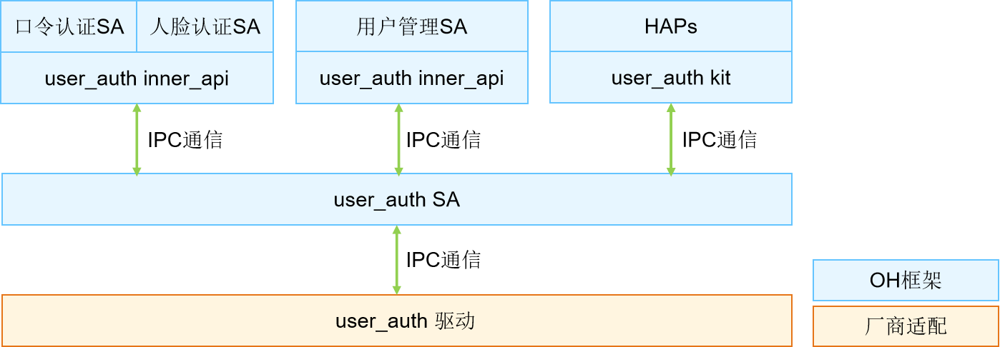
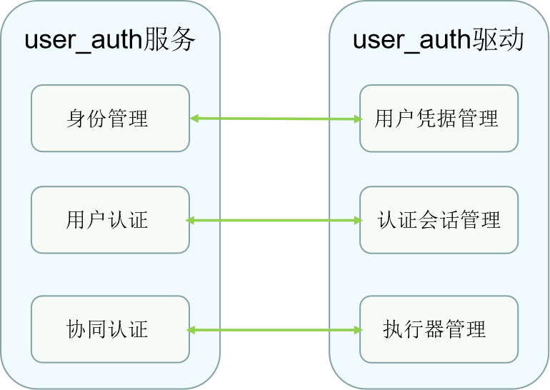

# User_auth

## 概述

### 功能简介

用户认证功能是端侧设备不可或缺的一部分，可应用于设备解锁、支付、应用登录等身份认证场景。用户认证（User_auth）框架统一管理用户身份与认证凭据模板的映射关系，通过调度各认证基础服务（包含口令认证、人脸识别等）实现的执行器完成用户认证凭据注册、凭据删除、身份认证及相关信息查询。用户认证的整体架构如图1。

基于HDF（Hardware Driver Foundation）驱动框架开发的User_auth驱动，能够屏蔽硬件器件差异，为上层应用（设置、锁屏等）和账号管理SA（System Ability）提供稳定的用户身份认证能力，支持用户凭据管理、认证信息录入、认证方案生成以及认证执行器信息管理能力。

**图1** 用户认证功能整体框架



### 基本概念
用户认证框架与各个基础认证服务（包含口令认证、人脸识别等）组成的身份认证系统，支持用户认证凭据设置、删除、认证等基础功能。

- 认证凭据信息

  用户设置口令、录入人脸时，会生成认证凭据模板，凭据信息由用户身份信息与凭据模板信息组成，用于在认证用户时找到匹配指定用户的凭据模板。

- 认证凭据模板

  认证凭据模板在用户设置认证凭据时由认证服务产生并存储。每个模板有一个ID，用于索引模板信息文件。在认证时，读取模板信息并和当次认证过程中产生的认证数据做对比，完成身份认证。

- 执行器

  执行器是能够提供数据采集、处理、存储及比对能力的模块，各基础认证服务提供执行器能力，被身份认证框架调度完成各项基础功能。

- 执行器角色

  - ​    全功能执行器：执行器可独立处理凭据注册和身份认证请求，即可提供用户认证数据采集、处理、储存及比对能力。

  - ​    采集器：执行器提供用户认证时的数据采集能力，需要和认证器配合完成用户认证。

  - ​    认证器：认证器提供用户认证时的数据处理能力，读取存储凭据模板信息并完成比对。

- 执行器类型

  同一种身份认证类型的不同认证方式、设备器件差异都会产生认证算法差异，执行器根据这些差异定义不同的执行器类型。

- 执行器安全等级

  执行器提供能力时所在运行环境达到的安全级别。

- 用户认证框架公钥 & 执行器公钥

  用户身份认证处理需要保证用户数据安全以及认证结果的准确性，用户认证框架与基础认证服务间的关键交互信息需要做数据完整性保护，各基础认证服务将提供的执行器能力对接到用户认证框架时，需要交换各自的公钥，其中：

    - 执行器通过用户认证框架公钥校验调度指令的准确性，如锁定一个人脸模板，这种情况导致无法使用人脸功能，属于敏感操作，需要确保指令准确，才可处理。

    - 执行器公钥可被用户认证框架用于校验认证结果的准确性，同时用于执行器交互认证时的校验交互信息的完整性。


- 认证结果可信等级

  不同认证方式及认证过程运行环境的安全级别差异，使得生成的认证结果的可信级别不同。

- 认证方案

  用户发起认证请求所使用的认证方式、认证结果可信等级、执行器信息和凭据信息等相关信息。

- 调度信息

  包括执行器信息及执行器处理请求需要的凭据模板信息，用于用户认证框架调度执行器完成基础功能。

- System Ability

  系统能力，由系统服务管理服务（System Ability Manager）加载，向OpenHarmony系统提供系统基础能力的基础服务。

- Kit

  OpenHarmony系统向第三方应用提供的基础应用编程接口。

- Inner API

  OpenHarmony系统向系统应用提供的应用编程接口。

- IDL接口

  接口定义语言（Interface Definition Language），通过IDL编译器编译后，能够生成与编程语言相关的文件：客户端桩文件，服务器框架文件。本文主要是通过IDL接口生成的客户端和服务端来实现User_auth服务和驱动的通信，详细使用方法可参考[IDL简介](https://gitee.com/openharmony/ability_idl_tool/blob/master/README.md)。

- IPC通信

  IPC（Inter Process Communication），进程间通信是指两个进程的数据之间产生交互，详细原理可参考[IPC通信简介](https://gitee.com/openharmony/communication_ipc/blob/master/README_zh.md)。

- HDI

  HDI（Hardware Device Interface），硬件设备接口，位于基础系统服务层和设备驱动层之间，是提供给硬件系统服务开发者使用的、统一的硬件设备功能抽象接口，其目的是为系统服务屏蔽底层硬件设备差异，具体可参考[HDI规范](../../design/hdi-design-specifications.md)。

### 运作机制

User_auth驱动主要工作是屏蔽不同安全器件和安全环境的差异，通过统一的认证能力注册、录入、认证接口，向User_auth服务提供认证执行器管理、认证凭据管理和认证方案生成管理等能力。
开发者可基于HDF框架对不同芯片进行各自驱动的开发及HDI层接口的调用。

**图2** User_auth服务和User_auth驱动交互



### 约束与限制

User_auth驱动的实现需要在可信执行环境中实现，保证用户凭据信息的安全存储及用户身份认证结果的可信可靠。

## 开发指导

### 场景介绍

User_auth驱动的主要工作是为User_auth服务提供稳定的用户凭据管理、认证会话管理以及执行器信息管理能力，保证设备上口令认证和生物识别功能可以正常运行。

### 接口说明

注：以下接口列举的为IDL接口描述生成的对应C++语言函数接口，接口声明见idl文件（/drivers/interface/user_auth）。
在本文中，执行器注册、凭据录入、凭据删除、用户认证和用户识别相关的HDI接口如表1所示。

**表1** 接口功能介绍

| 接口名称       | 功能介绍     |
| --------------------------- | --------------------------- |
| Init()           | 初始化缓存信息。                        |
| AddExecutor(const HdiExecutorRegisterInfo &info, uint64_t &index, std::vector<uint8_t> &publicKey, std::vector<uint64_t> &templateIds) |添加认证执行器，获得此认证能力。|
| DeleteExecutor(uint64_t index)            | 根据索引值index删除认证执行器。       |
| OpenSession(int32_t userId, std::vector<uint8_t> &challenge) | 开启认证凭据管理Session。      |
| CloseSession(int32_t userId)        | 关闭认证凭据管理Session。            |
| BeginEnrollment(const std::vector<uint8_t> &authToken, const HdiEnrollParam &param, HdiScheduleInfo &info) | 发起用户的认证凭据的录入，当录入类型为PIN码且当前用户已录入PIN码的情况下会更新PIN码。 |
| UpdateEnrollmentResult(int32_t userId, const std::vector<uint8_t> & scheduleResult, EnrollResultInfo &info)| 更新录入结果，完成此次录入。   |
| CancelEnrollment(int32_t userId)     | 取消此次录入。          |
| DeleteCredential(int32_t userId, uint64_t credentialId, const std::vector<uint8_t> &authToken, CredentialInfo &info) | 根据credentialId删除凭据信息。                               |
| DeleteUser(int32_t userId, const std::vector<uint8_t> &authToken, std::vector<CredentialInfo> &deletedInfos, std::vector<uint8_t> &rootSecret) | 删除PIN码即在用户认证框架中删除用户。                        |
| EnforceDeleteUser(int32_t userId, std::vector<CredentialInfo> &deletedInfos) | 强制删除用户，当系统内此用户被删除时强制调用。               |
| GetCredential(int32_t userId, int32_t authType, std::vector<CredentialInfo> &infos) | 查询用户某种认证类型下的凭据信息。             |
| BeginAuthentication(uint64_t contextId, const HdiAuthParam &param, std::vector<HdiScheduleInfo> &infos) | 发起认证，生成认证方案和调度信息。                           |
| UpdateAuthenticationResult(uint64_t contextId, const std::vector<uint8_t> & scheduleResult, HdiAuthResultInfo &info, HdiEnrolledState &enrolledState)| 更新认证结果，进行此次认证方案结果的评估。                   |
| CancelAuthentication(uint64_t contextId)      | 取消此次认证。             |
| BeginIdentification(uint64_t contextId, int32_t authType, const std::vector<uint8_t> &challenge, uint32_t executorSensorHint, HdiScheduleInfo &scheduleInfo) | 发起识别，生成识别方案和调度信息。                           |
| UpdateIdentificationResult(uint64_t contextId, const std::vector<uint8_t> &scheduleResult, IdentifyResultInfo &info) | 更新识别结果，进行此次识别方案结果的评估。                   |
| CancelIdentification(uint64_t contextId)             | 取消此次识别。              |
| GetAuthTrustLevel(int32_t userId, int32_t authType, uint32_t &authTrustLevel) | 获取此用户当前认证类型的认证可信等级。     |
| GetValidSolution(int32_t userId, const std::vector<int32_t> &authTypes, uint32_t authTrustLevel, std::vector<int32_t> &validTypes) | 筛选此用户当前认证可信等级下可用的认证方式。                   |
| GetAllUserInfo(std::vector<UserInfo> &userInfos) | 查询所有用户信息(不包含userId)。 |
| GetUserInfo(int32_t userId, uint64_t &secureUid, int32_t &pinSubType, std::vector<EnrolledInfo> &infos) | 查询用户信息。 |
| GetAllExtUserInfo(std::vector<ExtUserInfo> &userInfos) | 查询所有用户信息(包含userId)。 |
| GetEnrolledState(int32_t userId, int32_t authType, HdiEnrolledState &enrolledState) | 查询录入信息。 |
| CheckReuseUnlockResult(const ReuseUnlockParam& param, ReuseUnlockInfo& info) | 检查是否复用设备解锁结果。 |
| SendMessage(uint64_t scheduleId, int32_t srcRole, const std::vector<uint8_t>& msg) | 向执行器发消息。 |
| RegisterMessageCallback(const sptr<IMessageCallback>& messageCallback) | 注册执行器消息回调。 |
| GetLocalScheduleFromMessage(const std::vector<uint8_t>& remoteDeviceId, const std::vector<uint8_t>& message, HdiScheduleInfo& scheduleInfo) | 获取本地执行器调度信息。 |
| GetSignedExecutorInfo(const std::vector<int32_t>& authTypes, int32_t executorRole, const std::vector<uint8_t>& remoteDeviceId, std::vector<uint8_t>& signedExecutorInfo) | 获取签名后的执行器信息。 |

### 开发步骤

以Hi3516DV300平台为例，我们提供了User_auth驱动DEMO实例，以下是目录结构及各部分功能简介。

```undefined
// drivers/peripheral/user_auth
├── BUILD.gn     # 编译脚本
├── bundle.json  # 组件描述文件
└── hdi_service  # User_auth驱动实现
    ├── BUILD.gn   # 编译脚本
    ├── module     # 功能实现
    └── service
        ├── user_auth_interface_driver.cpp   # User_auth驱动入口
        └── user_auth_interface_service.cpp  # 获取执行器列表接口实现
```

下面结合DEMO实例介绍驱动开发的具体步骤。

1. 基于HDF驱动框架，按照驱动Driver Entry程序，完成User_auth驱动开发，主要由Bind、Init、Release、Dispatch函数接口实现，详细代码参见[user_auth_interface_driver.cpp](https://gitee.com/openharmony/drivers_peripheral/blob/master/user_auth/hdi_service/service/user_auth_interface_driver.cpp)文件。

   ```c++
   // 通过自定义的HdfUserAuthInterfaceHost对象包含IoService对象和真正的HDI Service实现IRemoteObject对象
   struct HdfUserAuthInterfaceHost {
       struct IDeviceIoService ioService;
       OHOS::sptr<OHOS::IRemoteObject> stub;
   };

   // 服务接口调用响应接口
   static int32_t UserAuthInterfaceDriverDispatch(struct HdfDeviceIoClient *client, int cmdId, struct HdfSBuf *data,
       struct HdfSBuf *reply)
   {
       auto *hdfUserAuthInterfaceHost = CONTAINER_OF(client->device->service, struct HdfUserAuthInterfaceHost, ioService);

       OHOS::MessageParcel *dataParcel = nullptr;
       OHOS::MessageParcel *replyParcel = nullptr;
       OHOS::MessageOption option;

       if (SbufToParcel(data, &dataParcel) != HDF_SUCCESS) {
           HDF_LOGE("%{public}s:invalid data sbuf object to dispatch", __func__);
           return HDF_ERR_INVALID_PARAM;
       }
       if (SbufToParcel(reply, &replyParcel) != HDF_SUCCESS) {
           HDF_LOGE("%{public}s:invalid reply sbuf object to dispatch", __func__);
           return HDF_ERR_INVALID_PARAM;
       }

       return hdfUserAuthInterfaceHost->stub->SendRequest(cmdId, *dataParcel, *replyParcel, option);
   }

   // 初始化接口
   int HdfUserAuthInterfaceDriverInit(struct HdfDeviceObject *deviceObject)
   {
       HDF_LOGI("HdfUserAuthInterfaceDriverInit enter");
       OHOS::UserIAM::Common::Init();
       return HDF_SUCCESS;
   }

   // User_auth驱动对外提供的服务绑定到HDF框架
   int HdfUserAuthInterfaceDriverBind(struct HdfDeviceObject *deviceObject)
   {
       HDF_LOGI("HdfUserAuthInterfaceDriverBind enter");

       auto *hdfUserAuthInterfaceHost = new (std::nothrow) HdfUserAuthInterfaceHost;
       if (hdfUserAuthInterfaceHost == nullptr) {
           HDF_LOGE("%{public}s: failed to create HdfUserAuthInterfaceHost object", __func__);
           return HDF_FAILURE;
       }

       hdfUserAuthInterfaceHost->ioService.Dispatch = UserAuthInterfaceDriverDispatch;
       hdfUserAuthInterfaceHost->ioService.Open = NULL;
       hdfUserAuthInterfaceHost->ioService.Release = NULL;

       auto serviceImpl = IUserAuthInterface::Get(true);
       if (serviceImpl == nullptr) {
           HDF_LOGE("%{public}s: failed to implement service", __func__);
           return HDF_FAILURE;
       }

       hdfUserAuthInterfaceHost->stub = OHOS::HDI::ObjectCollector::GetInstance().GetOrNewObject(serviceImpl,
           IUserAuthInterface::GetDescriptor());
       if (hdfUserAuthInterfaceHost->stub == nullptr) {
           HDF_LOGE("%{public}s: failed to get stub object", __func__);
           return HDF_FAILURE;
       }

       deviceObject->service = &hdfUserAuthInterfaceHost->ioService;
       return HDF_SUCCESS;
   }

   // 释放User_auth驱动中的资源
   void HdfUserAuthInterfaceDriverRelease(struct HdfDeviceObject *deviceObject){
       HDF_LOGI("HdfUserAuthInterfaceDriverRelease enter");
       auto *hdfUserAuthInterfaceHost = CONTAINER_OF(deviceObject->service, struct HdfUserAuthInterfaceHost, ioService);
       delete hdfUserAuthInterfaceHost;
   }

   // 注册User_auth驱动入口数据结构体对象
   struct HdfDriverEntry g_userAuthInterfaceDriverEntry = {
       .moduleVersion = 1,
       .moduleName = "user_auth_device_driver",
       .Bind = HdfUserAuthInterfaceDriverBind,
       .Init = HdfUserAuthInterfaceDriverInit,
       .Release = HdfUserAuthInterfaceDriverRelease,
   };

   // 调用HDF_INIT将驱动入口注册到HDF框架中，在加载驱动时HDF框架会先调用Bind函数,再调用Init函数加载该驱动，当Init调用异常时，HDF框架会调用Release释放驱动资源并退出
   #ifndef __cplusplus
   extern "C" {
   #endif
   HDF_INIT(g_userAuthInterfaceDriverEntry);
   #ifndef __cplusplus
   }
   #endif
   ```

2. 执行器注册接口举例实现，详细代码参见[user_auth_interface_service.cpp](https://gitee.com/openharmony/drivers_peripheral/blob/master/user_auth/hdi_service/service/user_auth_interface_service.cpp)文件。

   ```c++
   // 添加执行器
   int32_t UserAuthInterfaceService::AddExecutor(const HdiExecutorRegisterInfo &info, uint64_t &index,
    std::vector<uint8_t> &publicKey, std::vector<uint64_t> &templateIds)
   {
       GlobalLock();
       ExecutorInfoHal executorInfoHal;
       CopyExecutorInfo(info, executorInfoHal);
       int32_t ret = RegisterExecutor(&executorInfoHal, &index);
       GlobalUnLock();
       return ret;
   }

   // 删除执行器
   int32_t UserAuthInterfaceService::DeleteExecutor(uint64_t index)
   {
       return UnRegisterExecutor(index);
   }
   ```

3. 录入接口举例实现，详细代码参见[user_auth_interface_service.cpp](https://gitee.com/openharmony/drivers_peripheral/blob/master/user_auth/hdi_service/service/user_auth_interface_service.cpp)文件。

   ```c++
   // 开启认证凭据管理会话
   int32_t UserAuthInterfaceService::OpenSession(int32_t userId, std::vector<uint8_t>& challenge)
   {
       GlobalLock();
       uint64_t challengeU64 = 0;
       int32_t ret = OpenEditSession(userId, &challengeU64);
       challenge.resize(sizeof(uint64_t));
       if (memcpy_s(&challenge[0], challenge.size(), &challengeU64, sizeof(uint64_t)) != EOK) {
           IAM_LOGE("failed to copy challengeU64");
           return RESULT_BAD_COPY;
       }
       GlobalUnLock();
       return ret;
   }

   // 关闭认证凭据管理会话
   int32_t UserAuthInterfaceService::CloseSession(int32_t userId)
   {
       GlobalLock();
       int32_t ret = CloseEditSession();
       GlobalUnLock();
       return ret;
   }

   // 发起录入，生成录入调度信息
   int32_t UserAuthInterfaceService::BeginEnrollment(
    const std::vector<uint8_t> &authToken, const HdiEnrollParam &param, HdiScheduleInfo &info)
   {
       IAM_LOGI("start");
       GlobalLock();
       if (authToken.size() != sizeof(UserAuthTokenHal) && param.authType != PIN) {
           IAM_LOGE("authToken len is invalid");
           GlobalUnLock();
           return RESULT_BAD_PARAM;
       }
       PermissionCheckParam checkParam;
       if (authToken.size() == sizeof(UserAuthTokenHal) &&
           memcpy_s(checkParam.token, AUTH_TOKEN_LEN, &authToken[0], authToken.size()) != EOK) {
           GlobalUnLock();
           return RESULT_BAD_COPY;
       }
       checkParam.authType = param.authType;
       checkParam.userId = userId;
       checkParam.authSubType = (uint64_t)param.executorType;
       CoAuthSchedule scheduleInfo;
       int32_t ret = CheckEnrollPermission(checkParam, &scheduleInfo.scheduleId);
       if (ret != RESULT_SUCCESS) {
           IAM_LOGE("Failed to check permission");
           GlobalUnLock();
           return ret;
       }
       ret = GetCoAuthSchedule(&scheduleInfo);
       if (ret != RESULT_SUCCESS) {
           IAM_LOGE("Failed to get schedule info");
           GlobalUnLock();
           return ret;
       }
       if (!CopyScheduleInfo(&scheduleInfo, &info)) {
           IAM_LOGE("Failed to copy schedule info");
           ret = RESULT_BAD_COPY;
       }
       GlobalUnLock();
       return ret;
   }

   // 取消录入接口实现
   int32_t UserAuthInterfaceService::CancelEnrollment(int32_t userId)
   {
       IAM_LOGI("start");
       BreakOffCoauthSchedule(userId);
       return RESULT_SUCCESS;
   }

   // 录入凭据信息存储接口实现
   int32_t UserAuthInterfaceService::UpdateEnrollmentResult(int32_t userId, const std::vector<uint8_t> &scheduleResult, EnrollResultInfo &info)
   {
       IAM_LOGI("start");
       GlobalLock();
       if (scheduleResult.size() == 0) {
           IAM_LOGE("enrollToken is invalid");
           GlobalUnLock();
           return RESULT_BAD_PARAM;
       }
       Buffer *scheduleResultBuffer = CreateBufferByData(&scheduleResult[0], scheduleResult.size());
       if (scheduleResultBuffer == nullptr) {
           IAM_LOGE("scheduleTokenBuffer is null");
           GlobalUnLock();
           return RESULT_NO_MEMORY;
       }
       bool isUpdate;
       int32_t ret = GetIsUpdate(&isUpdate);
       if (ret != RESULT_SUCCESS) {
           IAM_LOGE("Failed to get isUpdate");
           return ret;
       }
       if (isUpdate) {
           CredentialInfoHal oldCredentialHal;
           ret = UpdateCredentialFunc(scheduleResultBuffer, &credentialId, &oldCredentialHal);
           oldInfo.authType = static_cast<AuthType>(oldCredentialHal.authType);
           oldInfo.credentialId = oldCredentialHal.credentialId;
           oldInfo.templateId = oldCredentialHal.templateId;
           oldInfo.executorType = static_cast<uint32_t>(oldCredentialHal.authSubType);
           oldInfo.executorId = 0;
           oldInfo.index = 0;
       } else {
           ret = AddCredentialFunc(scheduleResultBuffer, &credentialId);
       }
       DestoryBuffer(scheduleResultBuffer);
       GlobalUnLock();
       return ret;
   }
   ```

4. 认证接口举例实现，详细代码参见[user_auth_interface_service.cpp](https://gitee.com/openharmony/drivers_peripheral/blob/master/user_auth/hdi_service/service/user_auth_interface_service.cpp)文件。

   ```c++
   // 创建HDI服务对象
   extern "C" IUserAuthInterface *UserAuthInterfaceImplGetInstance(void)
   {
       auto userAuthInterfaceService = new (std::nothrow) UserAuthInterfaceService();
       if (userAuthInterfaceService == nullptr) {
           IAM_LOGE("userAuthInterfaceService is nullptr");
           return nullptr;
       }
       return userAuthInterfaceService;
   }
   
   // 发起认证，生成认证方案和调度信息
   int32_t UserAuthInterfaceService::BeginAuthentication(uint64_t contextId, const HdiAuthParam &param,
    std::vector<HdiScheduleInfo> &infos)
   {
       IAM_LOGI("start");
       if (param.challenge.size() != sizeof(uint64_t)) {
           IAM_LOGE("Failed to copy challenge");
           return RESULT_BAD_PARAM;
       }
       GlobalLock();
       CoAuthSchedule *schedulesGet = nullptr;
       uint32_t scheduleIdNum = 0;
       AuthSolutionHal solutionIn;
       solutionIn.contextId = contextId;
       solutionIn.userId = param.userId;
       solutionIn.authType = static_cast<uint32_t>(param.authType);
       solutionIn.authTrustLevel = param.authTrustLevel;
       if (memcpy_s(&solutionIn.challenge, sizeof(uint64_t), &param.challenge[0],
           param.challenge.size()) != EOK) {
           IAM_LOGE("Failed to copy challenge");
           GlobalUnLock();
           return RESULT_BAD_COPY;
       }
       int32_t ret = GenerateSolutionFunc(solutionIn, &schedulesGet, &scheduleIdNum);
       if (ret != RESULT_SUCCESS) {
           IAM_LOGE("Failed to generate solution");
           GlobalUnLock();
           return ret;
       }
       for (uint32_t i = 0; i < scheduleIdNum; i++) {
           ScheduleInfoV1_1 temp;
           if (!CopyScheduleInfo(schedulesGet + i, &temp)) {
               infos.clear();
               ret = RESULT_GENERAL_ERROR;
               break;
           }
           infos.push_back(temp);
       }
       free(schedulesGet);
       GlobalUnLock();
       return ret;
   }
   
   // 更新认证结果，进行此次认证方案结果的评估
   int32_t UserAuthInterfaceService::UpdateAuthenticationResult(uint64_t contextId,
    const std::vector<uint8_t> &scheduleResult, HdiAuthResultInfo &info, HdiEnrolledState &enrolledState)
   {
       IAM_LOGI("start");
       GlobalLock();
       if (scheduleResult.size() == 0) {
           IAM_LOGE("param is invalid");
           info.result = RESULT_BAD_PARAM;
           GlobalUnLock();
           return RESULT_BAD_PARAM;
       }
       Buffer *scheduleResultBuffer = CreateBufferByData(&scheduleResult[0], scheduleResult.size());
       if (scheduleResultBuffer == nullptr) {
           IAM_LOGE("scheduleTokenBuffer is null");
           info.result = RESULT_GENERAL_ERROR;
           GlobalUnLock();
           return RESULT_NO_MEMORY;
       }
       UserAuthTokenHal authTokenHal;
       info.result = RequestAuthResultFunc(contextId, scheduleResultBuffer, &authTokenHal);
       if (info.result != RESULT_SUCCESS) {
           IAM_LOGE("Failed to execute func");
           DestoryBuffer(scheduleResultBuffer);
           GlobalUnLock();
           return info.result;
       }
       info.token.resize(sizeof(UserAuthTokenHal));
       if (memcpy_s(&info.token[0], info.token.size(), &authTokenHal, sizeof(authTokenHal)) != EOK) {
           IAM_LOGE("Failed to copy authToken");
           DestoryBuffer(scheduleResultBuffer);
           GlobalUnLock();
           return RESULT_BAD_COPY;
       }
       DestoryBuffer(scheduleResultBuffer);
       GlobalUnLock();
       return RESULT_SUCCESS;
   }
   
   // 取消认证
   int32_t UserAuthInterfaceService::CancelAuthentication(uint64_t contextId)
   {
       IAM_LOGI("start");
       GlobalLock();
       uint32_t scheduleIdNum = 0;
       int32_t ret = CancelContextFunc(contextId, nullptr, &scheduleIdNum);
       if (ret != RESULT_SUCCESS) {
           IAM_LOGE("Failed to execute func");
           GlobalUnLock();
           return ret;
       }
       GlobalUnLock();
       return RESULT_SUCCESS;
   }
   ```

### 调测验证

驱动开发完成后，通过[用户认证API接口](../../application-dev/reference/apis-user-authentication-kit/js-apis-useriam-userauth.md)开发HAP应用，基于RK3568平台验证。

1.发起认证并获取认证结果的测试代码如下：

```ts
  // API version 10
  import type {BusinessError} from '@ohos.base';
  import userIAM_userAuth from '@ohos.userIAM.userAuth';

  // 设置认证参数
  const authParam: userIAM_userAuth.AuthParam = {
    challenge: new Uint8Array([49, 49, 49, 49, 49, 49]),
    authType: [userIAM_userAuth.UserAuthType.PIN, userIAM_userAuth.UserAuthType.FACE],
    authTrustLevel: userIAM_userAuth.AuthTrustLevel.ATL3,
  };
  // 配置认证界面
  const widgetParam: userIAM_userAuth.WidgetParam = {
    title: '请进行身份认证',
  };
  try {
    // 获取认证对象
    let userAuthInstance = userIAM_userAuth.getUserAuthInstance(authParam, widgetParam);
    console.info('get userAuth instance success');
    // 订阅认证结果
    userAuthInstance.on('result', {
      onResult(result) {
        console.info(`userAuthInstance callback result: ${JSON.stringify(result)}`);
        // 可在认证结束或其他业务需要场景，取消订阅认证结果
        userAuthInstance.off('result');
      }
  });
    console.info('auth on success');
    userAuthInstance.start();
    console.info('auth start success');
  } catch (error) {
    const err: BusinessError = error as BusinessError;
    console.error(`auth catch error. Code is ${err?.code}, message is ${err?.message}`);
  }
```

2.取消认证的测试代码如下：

```ts
  // API version 10
  import type {BusinessError} from '@ohos.base';
  import userIAM_userAuth from '@ohos.userIAM.userAuth';

  const authParam: userIAM_userAuth.AuthParam = {
    challenge: new Uint8Array([49, 49, 49, 49, 49, 49]),
    authType: [userIAM_userAuth.UserAuthType.PIN, userIAM_userAuth.UserAuthType.FACE],
    authTrustLevel: userIAM_userAuth.AuthTrustLevel.ATL3,
  };
  const widgetParam: userIAM_userAuth.WidgetParam = {
    title: '请进行身份认证',
  };
  try {
    // 获取认证对象
    let userAuthInstance = userIAM_userAuth.getUserAuthInstance(authParam, widgetParam);
    console.info('get userAuth instance success');
    // 开始认证
    userAuthInstance.start();
    console.info('auth start success');
    // 取消认证
    userAuthInstance.cancel();
    console.info('auth cancel success');
  } catch (error) {
    const err: BusinessError = error as BusinessError;
    console.error(`auth catch error. Code is ${err?.code}, message is ${err?.message}`);
  }
```
