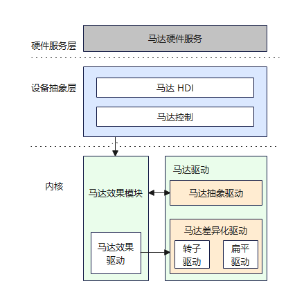
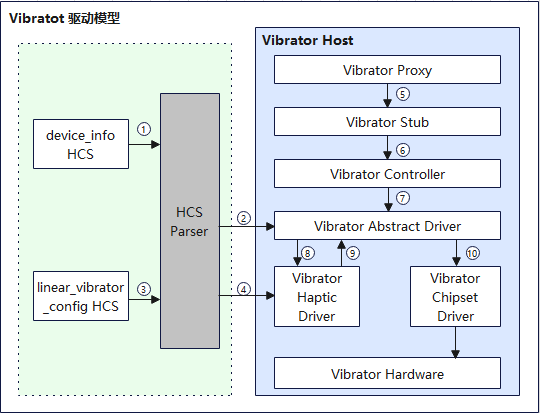

# Vibrator

## 概述

### 功能简介

为了快速开发马达驱动，基于HDF（Hardware Driver Foundation）驱动框架开发了马达（Vibrator）驱动模型。马达驱动模型，屏蔽设备驱动与系统交互的实现，为硬件服务层提供统一稳定的驱动接口能力，为驱动开发者提供开放的接口和解析接口的能力，用于不同操作系统马达设备部件的部署指导和马达设备部件驱动的开发。马达驱动模型如图1所示：

**图 1** 马达驱动模型图



### 基本概念

根据振动原理的不同，目前马达可以分为两种：

- 转子马达

  转子马达依靠旋转带动配重振动，分为普通转子和币型转子两种。转子马达的启停反应慢，并且无法实现多种振动模式，但其优点是成本低且体积小。

- 线性马达

  线性马达依靠磁力快速抖动配重来振动，分为纵向线性马达和横向线性马达两种。线性马达的启停都非常快，可以实现不同振感且具有良好的方向性。

系统通过调用马达驱动接口实现对设备的振动控制。目前，马达只有两种振动方式：

- 单次振动

  单次振动是指按照指定的时间控制振动时长。

- 周期振动

  周期振动是指按照预置的效果模式控制振动。例如：预置效果为“haptic.clock.timer” = [600, 600, 200, 600]，表示等待600ms，振动600ms，等待200ms，振动600ms。

### 运作机制

通过介绍马达驱动模型的加载以及运行流程，对模型内部关键组件以及关联组件之间的关系进行了划分，整体加载流程如图2所示：

**图2** 马达驱动运行图



以标准系统RK3568产品为例，介绍马达模块驱动加载及运行流程：

1. Device Manager从device_info.hcs配置文件中读取Vibrator管理配置信息。
2. HCS Parser解析Vibrator管理配置信息，并加载对应的马达抽象驱动。
3. Device Manager从linear_vibrator_config.hcs配置文件中读取Vibrator数据配置信息。
4. HCS Parser解析Vibrator数据配置信息，并加载对应的Haptic驱动。
5. Vibrator Proxy获取到Vibrator HDI接口服务实例后，通过IPC（Inter-Process Communication）调用到Vibrator Stub。
6. Vibrator Stub主要处理与IPC相关的业务逻辑，完成参数反序列化后调用Vibrator Controller。
7. Vibrator Controller中是HDI接口的真正实现，通过IPC调用Vibrator抽象驱动接口。
8. 在Haptic驱动中起线程，解析效果模块。
9. Haptic驱动调用马达抽象驱动中的Start接口。
10. 马达抽象驱动进一步调用马达差异化驱动中的Start接口，控制马达设备以给定的效果振动。

## 开发指导

### 场景介绍

当设备需要设置不同的振动效果时，可以调用Vibrator模块，例如，设备的按键可以设置不同强度和时长的振动，闹钟和来电可以设置不同强度和时长的单次或周期性振动。

### 接口说明

马达驱动模型支持静态HCS配置和动态参数两种振动效果配置能力。马达硬件服务调用StartOnce接口动态配置持续振动，调用Start接口启动静态配置的振动效果。马达驱动模型对外开放的API接口能力，如下表所示。

**表 1** 马达驱动模型对外API接口能力介绍

注：以下接口列举的为C接口，接口声明见文件[/drivers/peripheral/vibrator/interfaces/include](https://gitee.com/openharmony/drivers_peripheral/tree/master/vibrator/interfaces/include)。

| 接口名                                  | 功能描述                                           |
| -------------------------------------- | ------------------------------------------------ |
| int32_t (*StartOnce)(uint32_t duration)                        | 控制马达以执行给定持续时间的单次振动，duration表示单次振动的持续时间。       |
| int32_t (*Start)(const char *effectType)                        | 控制马达以预置效果执行周期性振动，effectType表示指向预设效果类型的指针。     |
| int32_t (*Stop)(enum VibratorMode mode)                         | 停止马达振动，mode表示振动模式，可以是单次或周期性的。                             |
| int32_t (*EnableVibratorModulation)(uint32_t duration, int32_t intensity, int32_t frequency) | 根据传入的振动效果启动马达，duration表示马达振动的持续时间，intensity表示振动周期内的马达振幅，frequency表示振动周期内的马达频率。 |
| int32_t (*GetVibratorInfo)(struct VibratorInfo **vibratorInfo) | 获取系统中支持设置振幅和频率的所有马达信息，vibratorInfo表示指向马达信息的指针。 |
| int32_t (*EnableCompositeEffect)(struct CompositeEffect *effect); | 控制马达以自定义复合效果进行周期性振动。 |
| int32_t (*GetEffectInfo)(const char *effectType, struct EffectInfo *effectInfo); | 获取指定效果类型的振动效果信息。 |
| int32_t (*IsVibratorRunning)(bool state); | 获取到的马达当前是否正在振动。 |
| int32_t (*PlayHapticPattern)(const HapticPaket& pkg); | 以pkg数据包的形式下发高清振动数据进行振动。 |
| int32_t (*GetHapticCapacity)(HapticCapacity& hapticCapacity); | 获取马达振动能力，包含是否支持高清振动、是否支持预定义波形、是否支持延时振动。 |
| int32_t (*GetHapticStartUpTime)(int32_t mode, int32_t& startUpTime); | 获取起振延时，mode表示振动模式，startUpTime是出参，表示起振延时。 |

### 开发步骤

Vibrator驱动模型为上层马达硬件服务层提供稳定的马达控制能力接口，包括马达一次振动、马达效果配置震动、马达停止。基于HDF驱动框架开发的马达驱动模型，实现跨操作系统迁移、器件差异配置等功能。以线性马达驱动为例介绍马达驱动开发。

1. 开发马达抽象驱动。

   - 马达抽象驱动在Vibrator Host中的配置信息，代码实现路径如下：vendor\hihope\rk3568\hdf_config\khdf\device_info\device_info.hcs。

     具体代码实现如下：

     ```c
     /* 马达设备HCS配置 */
     vibrator :: host {
         hostName = "vibrator_host";
         device_vibrator :: device {
             device0 :: deviceNode {
              policy = 2;                              	 // 驱动服务发布的策略
                 priority = 100;                          // 驱动启动优先级（0-200），值越大优先级越低，建议配置100，优先级相同则不保证device的加载顺序
              preload = 0;                             	 // 驱动按需加载字段，0表示加载，2表示不加载
                 permission = 0664;                       // 驱动创建设备节点权限
                 moduleName = "HDF_VIBRATOR";             // 驱动名称，该字段的值必须和驱动入口结构的moduleName值一致
                 serviceName = "hdf_misc_vibrator";       // 驱动对外发布服务的名称，必须唯一
                 deviceMatchAttr = "hdf_vibrator_driver"; // 驱动私有数据匹配的关键字，必须和驱动私有数据配置表中的match_attr值相等
            }
        }
     }
     ```

   - 创建马达效果模型，解析马达效果HCS配置，代码实现路径：drivers\hdf_core\framework\model\misc\vibrator\driver\src\vibrator_haptic.c。

     具体代码实现如下：

     ```c
     /* 创建马达效果模型 */
     int32_t CreateVibratorHaptic(struct HdfDeviceObject *device)
     {
         struct VibratorHapticData *hapticData = NULL;
         CHECK_VIBRATOR_NULL_PTR_RETURN_VALUE(device, HDF_FAILURE);
     
         hapticData = (struct VibratorHapticData *)OsalMemCalloc(sizeof(*hapticData));
         CHECK_VIBRATOR_NULL_PTR_RETURN_VALUE(hapticData, HDF_ERR_MALLOC_FAIL);
         g_vibratorHapticData = hapticData;
         hapticData->supportHaptic = false;
     
         if (OsalMutexInit(&hapticData->mutex) != HDF_SUCCESS) {
             HDF_LOGE("%s: fail to init mutex", __func__);
             goto EXIT;
         }
     
         DListHeadInit(&hapticData->effectSeqHead);
     
         // get haptic hcs
         if (ParserVibratorHapticConfig(device->property) != HDF_SUCCESS) {
             HDF_LOGE("%s: parser haptic config fail!", __func__);
             goto EXIT;
         }
     
         return HDF_SUCCESS;
     EXIT:
         OsalMemFree(hapticData);
         return HDF_FAILURE;
     }
     ```

   - 马达抽象驱动代码实现路径：drivers\hdf_core\framework\model\misc\vibrator\driver\src\vibrator_driver.c。

     - 马达抽象驱动对应的HdfDriverEntry对象，其中，Driver Entry入口函数定义如下：

       ```c
       /* 注册马达抽象驱动入口数据结构体对象 */
       struct HdfDriverEntry g_vibratorDriverEntry = {
           .moduleVersion = 1,               // 马达模块版本号
           .moduleName = "HDF_VIBRATOR",     // 马达模块名，要与device_info.hcs文件里的马达moduleName字段值一样
           .Bind = BindVibratorDriver,       // 马达绑定函数
           .Init = InitVibratorDriver,       // 马达初始化函数
           .Release = ReleaseVibratorDriver, // 马达资源释放函数
       };
       /* 调用HDF_INIT将驱动入口注册到HDF框架中，在加载驱动时HDF框架会先调用Bind函数，再调用Init函数加载该驱动。当Init调用异常时，HDF框架会调用Release释放驱动资源并退出马达驱动模型 */
       HDF_INIT(g_vibratorDriverEntry);
       ```

     - 马达抽象驱动Bind接口实现如下：

       ```c
       int32_t BindVibratorDriver(struct HdfDeviceObject *device)
       {
           struct VibratorDriverData *drvData = NULL;
           CHECK_VIBRATOR_NULL_PTR_RETURN_VALUE(device, HDF_FAILURE);
       
           drvData = (struct VibratorDriverData *)OsalMemCalloc(sizeof(*drvData));
           CHECK_VIBRATOR_NULL_PTR_RETURN_VALUE(drvData, HDF_ERR_MALLOC_FAIL);
       
           drvData->ioService.Dispatch = DispatchVibrator;
           drvData->device = device;
           device->service = &drvData->ioService;
           g_vibratorDrvData = drvData;
       
           return HDF_SUCCESS;
       }
       ```

     - 马达抽象驱动Init接口实现如下：

       ```c
       int32_t InitVibratorDriver(struct HdfDeviceObject *device)
       {
           struct VibratorDriverData *drvData = NULL;
       
           CHECK_VIBRATOR_NULL_PTR_RETURN_VALUE(device, HDF_FAILURE);
           drvData = (struct VibratorDriverData *)device->service;
           CHECK_VIBRATOR_NULL_PTR_RETURN_VALUE(drvData, HDF_FAILURE);
       
           drvData->mode = VIBRATOR_MODE_BUTT;
           drvData->state = VIBRATOR_STATE_IDLE;
       
           if (OsalMutexInit(&drvData->mutex) != HDF_SUCCESS) {
               HDF_LOGE("%s: init mutex failed!", __func__);
               return HDF_FAILURE;
           }
       	 /* 工作队列资源初始化 */
           if (HdfWorkQueueInit(&drvData->workQueue, VIBRATOR_WORK_QUEUE_NAME) != HDF_SUCCESS) {
               HDF_LOGE("%s: init workQueue failed!", __func__);
               return HDF_FAILURE;
           }
       
           if (HdfWorkInit(&drvData->work, VibratorWorkEntry, (void*)drvData) != HDF_SUCCESS) {
               HDF_LOGE("%s: init workQueue failed!", __func__);
               return HDF_FAILURE;
           }
       	/* 创建马达效果模型初始化 */
           if (CreateVibratorHaptic(device) != HDF_SUCCESS) {
               HDF_LOGE("%s: create vibrator haptic failed!", __func__);
               return HDF_FAILURE;
           }
       
           return HDF_SUCCESS;
       }
       ```

     - 马达抽象驱动Release接口在驱动卸载或者Init执行失败时，会调用此接口释放资源，具体实现如下：

       ```c
       void ReleaseVibratorDriver(struct HdfDeviceObject *device)
       {
           struct VibratorDriverData *drvData = NULL;
       
           if (device == NULL) {
               HDF_LOGE("%s: device is null!", __func__);
               return;
           }
       
           drvData = (struct VibratorDriverData *)device->service;
           if (drvData == NULL) {
               HDF_LOGE("%s: drvData is null!", __func__);
               return;
           }
       
           (void)DestroyVibratorHaptic();
           (void)OsalMutexDestroy(&drvData->mutex);
           OsalMemFree(drvData);
           g_vibratorDrvData = NULL;
       }
       ```

     - 马达抽象驱动内部接口实现了马达信息获取、振动模式设置和停止等功能，并实现根据振动模式创建和销毁定时器。

       - 马达抽象驱动StartOnce接口实现如下：

         ```c
         /* 按照指定持续时间触发振动马达，duration为振动持续时长 */
         static int32_t StartOnce(struct HdfSBuf *data, struct HdfSBuf *reply)
         {
             uint32_t duration;
             int32_t ret;
             struct VibratorEffectCfg config;
             struct VibratorDriverData *drvData = GetVibratorDrvData();
             (void)reply;
         
             CHECK_VIBRATOR_NULL_PTR_RETURN_VALUE(data, HDF_FAILURE);
             CHECK_VIBRATOR_NULL_PTR_RETURN_VALUE(drvData, HDF_FAILURE);
         
             if (!HdfSbufReadUint32(data, &duration)) {
                 HDF_LOGE("%s: sbuf read duration failed!", __func__);
                 return HDF_FAILURE;
             }
         
             if (duration == 0) {
                 HDF_LOGE("%s: vibrator duration invalid para!", __func__);
                 return HDF_ERR_INVALID_PARAM;
             }
         
             if (drvData->mode != VIBRATOR_MODE_BUTT) {
                 HDF_LOGI("%s: vibrater haptic is busy now, please stop first!", __func__);
                 return HDF_ERR_DEVICE_BUSY;
             }
         
             (void)OsalMutexLock(&drvData->mutex);
             drvData->mode = VIBRATOR_MODE_ONCE;
             (void)OsalMutexUnlock(&drvData->mutex);
         
             config.cfgMode = VIBRATOR_MODE_ONCE;
             config.duration = duration;
             config.effect = NULL;
         	/* 根据振动效果的模式开启马达效果模型 */
             ret = StartHaptic(&config);
             if (ret != HDF_SUCCESS) {
                 HDF_LOGE("%s: start haptic failed!", __func__);
                 return ret;
             }
         
             return HDF_SUCCESS;
         }
         ```

       - 马达抽象驱动StartEffect接口实现如下：

         ```c
         /* 按照预置效果启动马达，effect表示预置的振动效果 */
         static int32_t StartEffect(struct HdfSBuf *data, struct HdfSBuf *reply)
         {
             int32_t ret;
             const char *effect = NULL;
             struct VibratorEffectCfg config;
             struct VibratorDriverData *drvData = GetVibratorDrvData();
             (void)reply;
         
             CHECK_VIBRATOR_NULL_PTR_RETURN_VALUE(data, HDF_FAILURE);
             CHECK_VIBRATOR_NULL_PTR_RETURN_VALUE(drvData, HDF_FAILURE);
         	/* 从HdfSBuf中读取出预置的振动效果，进而操作马达振动 */
             effect = HdfSbufReadString(data);
             CHECK_VIBRATOR_NULL_PTR_RETURN_VALUE(effect, HDF_FAILURE);
         
             if (drvData->mode != VIBRATOR_MODE_BUTT) {
                 HDF_LOGI("%s: vibrater haptic is busy now, please stop first!", __func__);
                 return HDF_ERR_DEVICE_BUSY;
             }
         
             (void)OsalMutexLock(&drvData->mutex);
             drvData->mode = VIBRATOR_MODE_PRESET;
             (void)OsalMutexUnlock(&drvData->mutex);
         
             // start once time vibrate
             config.cfgMode = VIBRATOR_MODE_PRESET;
             config.duration = 0;
             config.effect = effect;
         	/* 预置效果启动马达 */
             ret = StartHaptic(&config);
             if (ret != HDF_SUCCESS) {
                 HDF_LOGE("%s: start haptic failed!", __func__);
                 return ret;
             }
         
             return HDF_SUCCESS;
         }
         ```

       - 马达抽象驱动Stop接口实现如下：

         ```c
         /* 按照指定的振动模式停止马达振动 */
         static int32_t Stop(struct HdfSBuf *data, struct HdfSBuf *reply)
         {
             int32_t ret;
             int32_t mode;
             struct VibratorDriverData *drvData = GetVibratorDrvData();
             (void)reply;
         
             CHECK_VIBRATOR_NULL_PTR_RETURN_VALUE(data, HDF_FAILURE);
             CHECK_VIBRATOR_NULL_PTR_RETURN_VALUE(drvData, HDF_FAILURE);
         	/* 从HdfSBuf中读取指定的振动模式，进而操作马达停止振动 */
             if (!HdfSbufReadInt32(data, &mode)) {
                 HDF_LOGE("%s: sbuf read mode failed!", __func__);
                 return HDF_FAILURE;
             }
         
             if ((mode != VIBRATOR_MODE_ONCE) && (mode != VIBRATOR_MODE_PRESET)) {
                 HDF_LOGE("%s: vibrator stop mode failed!", __func__);
                 return HDF_FAILURE;
             }
         
             if (drvData->mode == VIBRATOR_MODE_BUTT) {
                 HDF_LOGD("%s: vibrater haptic had stopped!", __func__);
                 return HDF_SUCCESS;
             }
         	 /* 停止马达效果振动，销毁马达定时器 */
             ret = StopHaptic();
             if (ret != HDF_SUCCESS) {
                 HDF_LOGE("%s: stop haptic failed!", __func__);
                 return ret;
             }
         
             (void)OsalMutexLock(&drvData->mutex);
             drvData->mode = VIBRATOR_MODE_BUTT;
             (void)OsalMutexUnlock(&drvData->mutex);
         
             return HDF_SUCCESS;
         }
         ```

       - 马达抽象驱动GetVibratorInfo接口实现如下：

         ```c
         /* 获取马达信息，包括是否支持振幅和频率的设置及振幅和频率的设置范围 */
         static int32_t GetVibratorInfo(struct HdfSBuf *data, struct HdfSBuf *reply)
         {
             (void)data;
             struct VibratorDriverData *drvData;
         
             drvData = GetVibratorDrvData();
             CHECK_VIBRATOR_NULL_PTR_RETURN_VALUE(drvData, HDF_ERR_INVALID_PARAM);
             CHECK_VIBRATOR_NULL_PTR_RETURN_VALUE(reply, HDF_ERR_INVALID_PARAM);
         
             if (!HdfSbufWriteBuffer(reply, &drvData->vibratorInfo, sizeof(drvData->vibratorInfo))) {
                 HDF_LOGE("%s: write sbuf failed!", __func__);
                 return HDF_FAILURE;
             }
         
             return HDF_SUCCESS;
         }
         ```

       - 马达抽象驱动EnableModulationParameter接口实现如下：

         ```c
         /* 按照指定振幅、频率、持续时间触发振动马达。duration为振动持续时长，intensity为振动强度，frequency为振动频率 */
         static int32_t EnableModulationParameter(struct HdfSBuf *data, struct HdfSBuf *reply)
         {
             (void)reply;
             struct VibratorEffectCfg config;
             struct VibratorDriverData *drvData;
             uint32_t duration;
             uint16_t intensity;
             int16_t frequency;
             int32_t ret;
         
             drvData = GetVibratorDrvData();
             CHECK_VIBRATOR_NULL_PTR_RETURN_VALUE(drvData, HDF_ERR_INVALID_PARAM);
             CHECK_VIBRATOR_NULL_PTR_RETURN_VALUE(drvData->ops.SetParameter, HDF_ERR_INVALID_PARAM);
             CHECK_VIBRATOR_NULL_PTR_RETURN_VALUE(data, HDF_ERR_INVALID_PARAM);
         
             if (drvData->mode != VIBRATOR_MODE_BUTT) {
                 HDF_LOGE("%s: vibrater is busy now, please stop first!", __func__);
                 return HDF_ERR_DEVICE_BUSY;
             }
         
             if (!HdfSbufReadUint32(data, &duration)) {
                 HDF_LOGE("%s: sbuf read vibration period failed!", __func__);
                 return HDF_FAILURE;
             }
         
             if (!HdfSbufReadUint16(data, &intensity)) {
                 HDF_LOGE("%s: sbuf read intensity failed!", __func__);
                 return HDF_FAILURE;
             }
         
             if (!HdfSbufReadInt16(data, &frequency)) {
                 HDF_LOGE("%s: sbuf read frequency failed!", __func__);
                 return HDF_FAILURE;
             }
         
             (void)OsalMutexLock(&drvData->mutex);
             drvData->mode = VIBRATOR_MODE_ONCE;
             (void)OsalMutexUnlock(&drvData->mutex);
         
             ret = drvData->ops.SetParameter(intensity, frequency);
             if (ret != HDF_SUCCESS) {
                 HDF_LOGE("%s: set parameter failed!", __func__);
                 return HDF_FAILURE;
             }
         
             config.cfgMode = VIBRATOR_MODE_ONCE;
             config.duration = duration;
             config.effect = NULL;
         	/* 预置效果启动马达 */
             ret = StartHaptic(&config);
             if (ret != HDF_SUCCESS) {
                 HDF_LOGE("%s: start haptic failed!", __func__);
                 return HDF_FAILURE;
             }
         
             return HDF_SUCCESS;
         }
         ```

       - 在马达差异化器件驱动初始化成功时，注册差异化接口，方便实现马达器件差异化驱动接口，具体实现如下：

         ```c
         /* 注册马达差异化实现接口 */
         int32_t RegisterVibrator(struct VibratorOps *ops)
         {
             struct VibratorDriverData *drvData = GetVibratorDrvData();
         
             CHECK_VIBRATOR_NULL_PTR_RETURN_VALUE(ops, HDF_FAILURE);
             CHECK_VIBRATOR_NULL_PTR_RETURN_VALUE(drvData, HDF_FAILURE);
         
             (void)OsalMutexLock(&drvData->mutex);
             drvData->ops.Start = ops->Start;
             drvData->ops.StartEffect = ops->StartEffect;
             drvData->ops.Stop = ops->Stop;
             drvData->ops.SetParameter = ops->SetParameter;
             (void)OsalMutexUnlock(&drvData->mutex);
         
             return HDF_SUCCESS;
         }
         
         /* 注册马达信息接口 */
         int32_t RegisterVibratorInfo(struct VibratorInfo *vibratorInfo)
         {
             struct VibratorDriverData *drvData = GetVibratorDrvData();
         
             CHECK_VIBRATOR_NULL_PTR_RETURN_VALUE(vibratorInfo, HDF_FAILURE);
             CHECK_VIBRATOR_NULL_PTR_RETURN_VALUE(drvData, HDF_FAILURE);
         
             (void)OsalMutexLock(&drvData->mutex);
             if (memcpy_s(&drvData->vibratorInfo, sizeof(drvData->vibratorInfo), vibratorInfo, sizeof(*vibratorInfo)) != EOK) {
                 HDF_LOGE("%s: Memcpy vibrator config failed", __func__);
                 return HDF_FAILURE;
             }
             (void)OsalMutexUnlock(&drvData->mutex);
         
             return HDF_SUCCESS;
         }
         ```

1. 开发马达差异化驱动。

   - 马达差异化驱动在Vibrator Host中的配置信息，代码实现路径如下：vendor\hihope\rk3568\hdf_config\khdf\device_info\device_info.hcs。

     具体代码实现如下：

     ```c
     device_linear_vibrator :: device {
     	device0 :: deviceNode {
     		policy = 1;                             		// 驱动服务发布的策略
     		priority = 105;                         		// 驱动启动优先级（0-200），值越大优先级越低，建议配置100，优先级相同则不保证device的加载顺序
             preload = 0;                            		// 驱动按需加载字段，0表示加载，2表示不加载
             permission = 0664;  							// 驱动创建设备节点权限
             moduleName = "HDF_LINEAR_VIBRATOR";             // 驱动名称，该字段的值必须和驱动入口结构的moduleName值一致 
            serviceName = "hdf_misc_linear_vibrator";        // 线性马达对外发布服务的名称，必须唯一
             deviceMatchAttr = "hdf_linear_vibrator_driver"; // 马达差异化驱动私有数据匹配的关键字，必须和驱动私有数据配置表中的match_attr值相等
         }
     }
     ```

   - 马达差异化驱动私有HCS配置：

     - 代码实现路径：vendor\hihope\rk3568\hdf_config\khdf\vibrator\linear_vibrator_config.hcs。

     - 具体代码实现如下：

       ```c
       root {
           linearVibratorConfig {
               boardConfig {
                   match_attr = "hdf_linear_vibrator_driver"; // 需要和马达设备配置文件中的match_attr字段保持一致
                   VibratorBusConfig {
                       busType = 1;    // 0:i2c 1:gpio
                       busNum = 154;
                   }
                   VibratorChipConfig {
                       isSupportIntensity = 0;    // 设置马达振幅能力。1表示支持，0表示不支持。
                       isSupportFrequency = 0;    // 设置马达振动频率能力。1表示支持，0表示不支持。
                       intensityMaxValue = 0;     // 马达振动支持的最大振幅
                       intensityMinValue = 0;     // 马达振动支持的最小振幅
                       frequencyMaxValue = 0;     // 马达振动支持的最大频率
                       frequencyMinValue = 0;     // 马达振动支持的最小频率
                   }
               }
           }
       }
       ```

   - 马达差异化驱动代码实现路径为：drivers\peripheral\vibrator\chipset\linear\vibrator_linear_driver.c。

     - 马达差异化驱动对应的HdfDriverEntry对象，其中，Driver Entry入口函数定义如下：

       ```c
       struct HdfDriverEntry g_linearVibratorDriverEntry = {
           .moduleVersion = 1,
           .moduleName = "HDF_LINEAR_VIBRATOR",
           .Bind = BindLinearVibratorDriver,
           .Init = InitLinearVibratorDriver,
           .Release = ReleaseLinearVibratorDriver,
       };
       
       HDF_INIT(g_linearVibratorDriverEntry);
       ```

     - 马达差异化驱动Bind接口实现如下：

       ```c
       int32_t BindLinearVibratorDriver(struct HdfDeviceObject *device)
       {
           struct VibratorLinearDriverData *drvData = NULL;
       
           CHECK_VIBRATOR_NULL_PTR_RETURN_VALUE(device, HDF_FAILURE);
       
           drvData = (struct VibratorLinearDriverData *)OsalMemCalloc(sizeof(*drvData));
           CHECK_VIBRATOR_NULL_PTR_RETURN_VALUE(drvData, HDF_ERR_MALLOC_FAIL);
       
           drvData->ioService.Dispatch = DispatchLinearVibrator;
           drvData->device = device;
           device->service = &drvData->ioService;
           g_linearVibratorData = drvData;
       
           return HDF_SUCCESS;
       }
       ```

     - 马达差异化驱动Init接口实现如下：

       ```c
       int32_t InitLinearVibratorDriver(struct HdfDeviceObject *device)
       {
           static struct VibratorOps ops;
           struct VibratorLinearDriverData *drvData = NULL;
       
           CHECK_VIBRATOR_NULL_PTR_RETURN_VALUE(device, HDF_FAILURE);
       
           drvData = (struct VibratorLinearDriverData *)device->service;
           CHECK_VIBRATOR_NULL_PTR_RETURN_VALUE(drvData, HDF_FAILURE);
       
           ops.Start = StartLinearVibrator;
           ops.StartEffect = StartEffectLinearVibrator;
           ops.Stop = StopLinearVibrator;
           ops.SetParameter = NULL;
       	
           if (RegisterVibratorOps(&ops) != HDF_SUCCESS) {
               HDF_LOGE("%s: register vibrator ops fail", __func__);
               return HDF_FAILURE;
           }
       
           drvData->linearCfgData = (struct VibratorCfgData *)OsalMemCalloc(sizeof(*drvData->linearCfgData));
           CHECK_VIBRATOR_NULL_PTR_RETURN_VALUE(drvData->linearCfgData, HDF_ERR_MALLOC_FAIL);
       	/* 解析马达寄存器初始化 */
           if (GetVibratorBaseConfigData(device->property, drvData->linearCfgData) != HDF_SUCCESS) {
               HDF_LOGE("%s: parser vibrator cfg fail", __func__);
               return HDF_FAILURE;
           }
       	/* 注册马达Info信息初始化 */
           if (RegisterVibratorInfo(&drvData->linearCfgData->vibratorInfo) != HDF_SUCCESS) {
               HDF_LOGE("%s: register vibrator info fail", __func__);
               return HDF_FAILURE;
           }
       
           if (GpioSetDir(drvData->linearCfgData->vibratorBus.GpioNum, GPIO_DIR_OUT) != HDF_SUCCESS) {
               HDF_LOGE("%s: set vibrator gpio fail", __func__);
               return HDF_FAILURE;
           }
           return HDF_SUCCESS;
       }
       ```

     - 马达差异化驱动Release接口实现如下：

       ```c
       void ReleaseLinearVibratorDriver(struct HdfDeviceObject *device)
       {
           struct VibratorLinearDriverData *drvData = NULL;
       
           if (device == NULL) {
               HDF_LOGE("%s: Device is null", __func__);
               return;
           }
           drvData = (struct VibratorLinearDriverData *)device->service;
           if (drvData == NULL) {
               HDF_LOGE("%s: DrvData pointer is null", __func__);
               return;
           }
       
           OsalMemFree(drvData->linearCfgData);
           OsalMemFree(drvData);
           g_linearVibratorData = NULL;
       }
       ```
       
     - 马达差异化驱动内部接口实现如下：

       ```c
       /* 触发振动马达 */
       static int32_t StartLinearVibrator(void)
       {
           int32_t ret;
           struct VibratorLinearDriverData *drvData = GetLinearVibratorData();
           CHECK_VIBRATOR_NULL_PTR_RETURN_VALUE(drvData, HDF_FAILURE);
       
           if (drvData->linearCfgData->vibratorBus.busType != VIBRATOR_BUS_GPIO) {
               HDF_LOGE("%s: vibrator bus type not gpio", __func__);
               return HDF_FAILURE;
           }
       
           ret = GpioWrite(drvData->linearCfgData->vibratorBus.GpioNum, GPIO_VAL_HIGH);
           if (ret != HDF_SUCCESS) {
               HDF_LOGE("%s: pull gpio%d to %d level failed", __func__,
                   drvData->linearCfgData->vibratorBus.GpioNum, GPIO_VAL_HIGH);
               return ret;
           }
           return HDF_SUCCESS;
       }
       /* 按照指定效果触发振动马达 */
       static int32_t StartEffectLinearVibrator(uint32_t effectType)
       {
           (void)effectType;
           HDF_LOGE("%s: vibrator set built-in effect no support!", __func__);
           return HDF_SUCCESS;
       }
       /* 停止振动马达 */
       static int32_t StopLinearVibrator(void)
       {
           int32_t ret;
           struct VibratorLinearDriverData *drvData = GetLinearVibratorData();
           CHECK_VIBRATOR_NULL_PTR_RETURN_VALUE(drvData, HDF_FAILURE);
       
           if (drvData->linearCfgData->vibratorBus.busType != VIBRATOR_BUS_GPIO) {
               HDF_LOGE("%s: vibrator bus type not gpio", __func__);
               return HDF_FAILURE;
           }
       
           ret = GpioWrite(drvData->linearCfgData->vibratorBus.GpioNum, GPIO_VAL_LOW);
           if (ret != HDF_SUCCESS) {
               HDF_LOGE("%s: pull gpio%d to %d level failed", __func__,
                   drvData->linearCfgData->vibratorBus.GpioNum, GPIO_VAL_LOW);
               return ret;
           }
           return HDF_SUCCESS;
       }
       ```


### 调测验证

驱动开发完成后，在马达单元测试里面开发自测试用例，验证驱动基本功能。测试环境采用开发者自测试平台。

- 参考测试代码如下：

  ```c
  #include <cmath>
  #include <cstdio>
  #include <gtest/gtest.h>
  #include <securec.h>
  #include "hdf_base.h"
  #include "osal_time.h"
  #include "vibrator_if.h"
  #include "vibrator_type.h"
  
  using namespace testing::ext;
  const struct VibratorInterface *g_vibratorDev = nullptr;
  static struct VibratorInfo *g_vibratorInfo = nullptr;
  
  class HdfVibratorTest : public testing::Test {
  public:
      static void SetUpTestCase();
      static void TearDownTestCase();
      void SetUp();
      void TearDown();
  };
  /* 用例执行前，初始化马达接口实例。 */
  void HdfVibratorTest::SetUpTestCase()
  {
      g_vibratorDev = NewVibratorInterfaceInstance();
  }
  /* 用例资源释放 */
  void HdfVibratorTest::TearDownTestCase()
  {
      if(g_vibratorDev != nullptr){
          FreeVibratorInterfaceInstance();
          g_vibratorDev = nullptr;
      }
  }
  
  void HdfVibratorTest::SetUp()
  {
  }
  
  void HdfVibratorTest::TearDown()
  {
  }
  
  /* 测试单次振动 */
  HWTEST_F(HdfVibratorTest, PerformOneShotVibratorDuration_001, TestSize.Level1)
  {
      uint32_t duration = 1000;
      uint32_t sleepTime = 2000;
      
      ASSERT_NE(nullptr, g_vibratorDev);
  
      int32_t startRet = g_vibratorDev->StartOnce(duration);
      EXPECT_EQ(startRet, HDF_SUCCESS);
  
      OsalMSleep(sleepTime);
  
      int32_t endRet = g_vibratorDev->Stop(VIBRATOR_MODE_ONCE);
      EXPECT_EQ(endRet, HDF_SUCCESS);
  }
  /* 测试预置效果振动 */
  HWTEST_F(HdfVibratorTest, ExecuteVibratorEffect_001, TestSize.Level1)
  {
      uint32_t sleepTime = 5000;
      const char *timeSequence = "haptic.clock.timer";
  
      ASSERT_NE(nullptr, g_vibratorDev);
  
      int32_t startRet = g_vibratorDev->Start(timeSequence);
      EXPECT_EQ(startRet, HDF_SUCCESS);
  
      OsalMSleep(sleepTime);
  
      int32_t endRet = g_vibratorDev->Stop(VIBRATOR_MODE_PRESET);
      EXPECT_EQ(endRet, HDF_SUCCESS);
  }
  /* 获取马达信息，包括是否支持振幅和频率的设置及振幅和频率的设置范围。 */
  HWTEST_F(HdfVibratorTest, GetVibratorInfo_001, TestSize.Level1)
  {
      ASSERT_NE(nullptr, g_vibratorDev);
  
      int32_t startRet = g_vibratorDev->GetVibratorInfo(&g_vibratorInfo);
      EXPECT_EQ(startRet, HDF_SUCCESS);
      EXPECT_NE(g_vibratorInfo, nullptr);
  
      printf("intensity = %d, intensityMaxValue = %d, intensityMinValue = %d\n\t",
      g_vibratorInfo->isSupportIntensity, g_vibratorInfo->intensityMaxValue, g_vibratorInfo->intensityMinValue);
      printf("frequency = %d, frequencyMaxValue = %d, frequencyMinValue = %d\n\t",
      g_vibratorInfo->isSupportFrequency, g_vibratorInfo->frequencyMaxValue, g_vibratorInfo->frequencyMinValue);
  }
  /* 按照指定振幅、频率、持续时间触发振动马达。duration为振动持续时长，intensity为振动强度，frequency为振动频率。 */
  HWTEST_F(HdfVibratorTest, EnableVibratorModulation_001, TestSize.Level1)
  {
      int32_t startRet;
      int32_t intensity = 30;
      int32_t frequency = 200;
      uint32_t duration = 1000;
      uint32_t sleepTime = 2000;
   
      ASSERT_NE(nullptr, g_vibratorDev);
  
      if ((g_vibratorInfo->isSupportIntensity == 1) || (g_vibratorInfo->isSupportFrequency == 1)) {
          EXPECT_GE(intensity, g_vibratorInfo->intensityMinValue);
       EXPECT_LE(intensity, g_vibratorInfo->intensityMaxValue);
          EXPECT_GE(frequency, g_vibratorInfo->frequencyMinValue);
       EXPECT_LE(frequency, g_vibratorInfo->frequencyMaxValue);
  
          startRet = g_vibratorDev->EnableVibratorModulation(duration, intensity, duration);
          EXPECT_EQ(startRet, HDF_SUCCESS);
          OsalMSleep(sleepTime);
          startRet = g_vibratorDev->Stop(VIBRATOR_MODE_ONCE);
          EXPECT_EQ(startRet, HDF_SUCCESS);
      }
  }
  ```

- 编译文件gn参考代码如下：

  ```c++
  import("//build/ohos.gni")
  import("//build/test.gni")
  import("//drivers/hdf_core/adapter/uhdf2/uhdf.gni")
  
  module_output_path = "drivers_peripheral_vibrator/vibrator"
  ohos_unittest("vibrator_test") {
    module_out_path = module_output_path
    sources = [ "vibrator_test.cpp" ]
    include_dirs = [
      "//drivers/peripheral/vibrator/interfaces/include",
    ]
    deps = [ "//drivers/peripheral/vibrator/hal:hdi_vibrator" ]
  
    external_deps = [
      "c_utils:utils",
      "hdf_core:libhdf_utils",
      "hiviewdfx_hilog_native:libhilog",
    ]
  
    cflags = [
   "-Wall",
      "-Wextra",
      "-Werror",
      "-Wno-format",
      "-Wno-format-extra-args",
    ]
  
    install_enable = true
    install_images = [ "vendor" ]
    module_install_dir = "bin"
    part_name = "unionman_products"
  }
  ```

