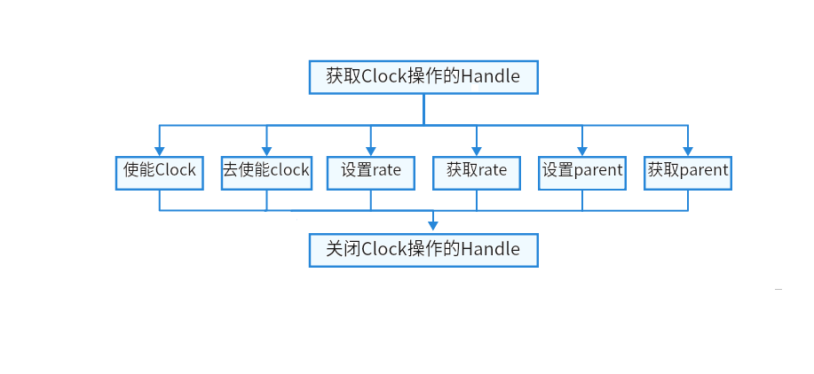

# CLOCK<a name="1"></a>

## 概述<a name="section1"></a>

### 功能简介<a name="section2"></a>

CLOCK，时钟是系统各个部件运行的基础，以CPU时钟举例，CPU 时钟是指 CPU 内部的时钟发生器，它以频率的形式工作，用来同步和控制 CPU 内部的各个操作。

CLOCK接口定义了完成CLOCK操作的通用方法集合，包括：

-  CLOCK设备管理：打开或关闭时钟设备。

-  CLOCK速率控制：读取或设置时钟速率。

-  CLOCK门控：使能或去使能时钟。

-  CLOCK父时钟管理：获取或者设置父时钟。

### 基本概念<a name="section3"></a>

设备的时钟信号是指在电子设备中用于同步和控制各个模块或组件操作的信号。它是设备内部的一个基本信号源，用于确保设备的正常运行和数据传输的准确性。

### 运作机制<a name="section4"></a>

在HDF框架中，同类型设备对象较多时（可能同时存在十几个同类型配置器），如果采用独立服务模式则需要配置更多的设备节点，且相关服务会占据更多的内存资源。相反，采用统一服务模式可以使用一个设备服务作为管理器，统一处理所有同类型对象的外部访问（这会在配置文件中有所体现），实现便捷管理和节约资源的目的。CLOCK模块接口适配模式采用统一服务模式。

## 使用指导<a name="section5"></a>

### 场景介绍<a name="section6"></a>

CLOCK提供芯片级别的时钟管理：时钟功能可用于控制芯片内部的时钟分频、时钟倍频、时钟源选择和时钟门控等操作。通过合理的时钟管理，可以提高芯片的能效，并确保各个功能部件的正确协调和协同工作。

### 接口说明<a name="section7"></a>

CLOCK模块提供的主要接口如表1所示，具体API详见//drivers/hdf_core/framework/include/platform/clock_if.h。

**表 1**  CLOCK驱动API接口功能介绍

<a name="table1"></a>

| **接口名**                                                 | **接口描述**  | 返回值描述                          | 特殊情况说明                            |
| ---------------------------------------------------------- | ------------- | ----------------------------------- | --------------------------------------- |
| DevHandle ClockOpen(uint32_t number);                      | 打开Clock设备 | NULL：获取失败，设备句柄：获取成功  |                                         |
| int32_t ClockClose(DevHandle handle);                      | 关闭Clock设备 | 零:关闭成功，非零：关闭失败         |                                         |
| int32_t ClockEnable(DevHandle handle);                     | 使能Clock     | 零:使能成功，非零：使能失败         |                                         |
| int32_t ClockDisable(DevHandle handle);                    | 去使能Clock   | 零:去使能成功，非零：去使能失败     |                                         |
| int32_t ClockSetRate(DevHandle handle, uint32_t rate);     | 设置时钟速率  | 零:设置时钟速率成功，非零：设置失败 | 失败请检查传入的rate对应的Clock是否支持 |
| int32_t ClockGetRate(DevHandle handle, uint32_t *rate);    | 获取时钟速率  | 零:获取成功，非零：获取失败         |                                         |
| int32_t ClockSetParent(DevHandle child, DevHandle parent); | 设置父时钟    | 零:设置父成功，非零：设置父失败     | 父时钟重复设置时不报错，直接返回成功    |
| DevHandle ClockGetParent(DevHandle handle);                | 获取父时钟    | 零:获取父成功，非零：获取父失败     |                                         |

### 开发步骤<a name="section8"></a>

使用CLOCK设备的一般流程如图2所示。

**图 2**  CLOCK使用流程图<a name="fig2"></a>  
 

### 使用实例<a name="section9"></a>

本例拟对RK3568开发板上CLOCK设备进行简单的读取操作，基本硬件信息如下：

-   SOC：RK3568。

本例程对各个接口进行调用测试

示例如下：

```c
#include "clock_if.h"          // CLOCK标准接口头文件
#include "hdf_log.h"         // 标准日志打印头文件
#define CLOCK_NUM 1

static int32_t TestCaseClock(void)
{
    int ret = 0;
    DevHandle handle = NULL;
    DevHandle parent = NULL;
    uint32_t rate = 0;
 
    handle = ClockOpen(CLOCK_NUM);
    if (handle == NULL) {
        HDF_LOGE("Failed to open CLOCK_NUM %d \n", CLOCK_NUM);
        return HDF_FAILURE;
    }

    ret = ClockEnable(handle);
    if (ret != HDF_SUCCESS) {
        HDF_LOGE("Failed to ClockEnable ret = %d \n",ret);
        return ret;
    }
   

    ret = ClockGetRate(handle, &rate);
    if (ret != HDF_SUCCESS) {
        HDF_LOGE("Failed to ClockGetRate ret = %d \n",ret);
        return ret;
    }
    
    ret = ClockSetRate(handle, set_rate);
    if (ret != HDF_SUCCESS) {
        HDF_LOGE("Failed to ClockSetRate ret = %d \n",ret);
        return ret;
    }

    ret = ClockDisable(handle);
    if (ret != HDF_SUCCESS) {
        HDF_LOGE("Failed to ClockDisable ret = %d \n",ret);
        return ret;
    }

    parent = ClockGetParent(handle);    
    if (parent != NULL) {
        ret = ClockSetParent(handle, parent);
        ClockClose(parent);
    } else {
        HDF_LOGE("Failed to ClockGetParent ret = %d \n",ret);
    }
    
    ret = ClockClose(handle);
    return ret;
}
```