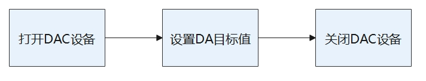

# DAC

## 概述

### 功能简介

DAC（Digital to Analog Converter）是一种通过电流、电压或电荷的形式将数字信号转换为模拟信号的设备，主要用于：

- 作为过程控制计算机系统的输出通道，与执行器相连，实现对生产过程的自动控制。

- 在利用反馈技术的模数转换器设计中，作为重要的功能模块呈现。

DAC接口定义了完成DAC传输的通用方法集合，包括：

- DAC设备管理：打开或关闭DAC设备。

- DAC设置目标值：设置DAC设备需要将数字信号转成模拟信号的目标值。

### 基本概念

- 分辨率

    分辨率指的是DAC模块能够转换的二进制位数，位数越多分辨率越高。

- 转换精度

    精度是指输入端加有最大数值时，DAC的实际输出值和理论计算值之差，DAC转换器的转换精度与DAC转换器的集成芯片结构和接口电路配置有关。理想情况下，DAC的转换精度越小越好，因此为了获得更高精度的DAC转换结果，首先要保证选择的DAC转换器具备足够高的分辨率。其次，接口电路的器件或电源存在误差时，会造成DAC转换的误差，若这些误差超过一定程度，就会导致DAC转换错误。

- 转换速度

    转换速度一般由建立时间决定。从输入由全0突变为全1时开始，到输出电压稳定在FSR±½LSB范围（或以FSR±x%FSR指明范围）内为止，这段时间称为建立时间，它是DAC的最大响应时间，所以用它衡量转换速度的快慢。
  
    满量程范围FSR（Full Scale Range），是指DAC输出信号幅度的最大范围，不同的DAC有不同的满量程范围，该范围可以用正、负电流或者正、负电压来限制。
  
    最低有效位LSB（Least Significant Byte），指的是一个二进制数字中的第0位（即最低位）。

### 运作机制

在HDF框架中，同类型设备对象较多时（可能同时存在十几个同类型配置器），如果采用独立服务模式，则需要配置更多的设备节点，且相关服务会占据更多的内存资源。相反，采用统一服务模式可以使用一个设备服务作为管理器，统一处理所有同类型对象的外部访问（这会在配置文件中有所体现）,实现便捷管理和节约资源的目的。DAC模块接口适配模式采用统一服务模式（如图1）。

DAC模块各分层的作用为：接口层提供打开设备、写入数据和关闭设备的接口。核心层主要提供绑定设备、初始化设备以及释放设备的能力。适配层实现其它具体的功能。

 说明：<br>核心层可以调用接口层的函数，核心层通过钩子函数调用适配层函数，从而适配层可以间接的调用接口层函数，但是不可逆转接口层调用适配层函数。

**图 1**  DAC统一服务模式


### 约束与限制

DAC模块当前仅支持轻量和小型系统内核（LiteOS-A）。

## 使用指导

### 场景介绍

DAC模块的主要工作是以电流、电压或电荷的形式将数字信号转换为模拟信号，主要应用于音频设备中。日常所见的音响、耳机等，均使用DAC模块作为数模转换的通道。

### 接口说明

DAC模块提供的主要接口如下所示，具体API[详见](https://gitee.com/openharmony/drivers_hdf_core/blob/master/framework/include/platform/dac_if.h)。

**表 1**  DAC驱动API接口功能介绍

| 接口名 | 接口描述 |
| ------------------------------------------------------------------ | ------------ |
| DevHandle DacOpen(uint32_t number) | 打开DAC设备。|
| void DacClose(DevHandle handle) | 关闭DAC设备。|
| int32_t DacWrite(DevHandle handle, uint32_t channel, uint32_t val) | 设置DA目标值。 |

### 开发步骤

使用DAC设备的一般流程如图2所示。

**图 2**  DAC使用流程图  
 

#### 打开DAC设备

在进行DA转换之前，首先要调用DacOpen打开DAC设备，打开函数如下所示：

```c
DevHandle DacOpen(uint32_t number);
```

**表 2**  DacOpen参数和返回值描述

| 参数 | 参数描述 |
| --------- | ---------------- |
| number | uint32_t类型，DAC设备号。 |
| **返回值** | **返回值描述** |
| NULL | 打开DAC设备失败。 |
| 设备句柄 | 打开的DAC设备句柄。 |

假设系统中存在2个DAC设备，编号从0到1，现在打开1号设备。

```c
DevHandle dacHandle = NULL;    // DAC设备句柄

// 打开DAC设备
dacHandle = DacOpen(1);
if (dacHandle == NULL) {
    HDF_LOGE("DacOpen: open dac fail.\n");
    return NULL;
}
```

#### 设置DA目标值

```c
int32_t DacWrite(DevHandle handle, uint32_t channel, uint32_t val);
```

**表 3**  DacWrite参数和返回值描述

| 参数 | 参数描述 |
| --------- | ------------ |
| handle | DevHandle类型，DAC设备句柄。 |
| channel | uint32_t类型，DAC设备通道号。 |
| val | uint32_t类型，设置DA的值。 |
| **返回值** | **返回值描述** |
| HDF_SUCCESS | 写入DA目标值成功 |
| 负数 | 写入DA目标值失败 |

```c
// 通过DAC_CHANNEL_NUM设备通道写入目标val值
int32_t ret;
ret = DacWrite(dacHandle, DAC_CHANNEL_NUM, val);
if (ret != HDF_SUCCESS) {
    HDF_LOGE("DacWrite: tp DAC write reg fail!,ret:%d", ret);
    DacClose(dacHandle);
    return ret;
}
```

#### 关闭DAC设备

DAC通信完成之后，需要关闭DAC设备，关闭函数如下所示：

```c
void DacClose(DevHandle handle);
```

**表 4**  DacClose参数和返回值描述

| 参数 | 参数描述 |
| --------- | ------------ |
| handle | DAC设备句柄。 |
| **返回值** | **返回值描述** |
| 无 | 无 |

关闭DAC设备示例：

```c
DacClose(dacHandle);    // 关闭DAC设备
```

## 使用实例

DAC设备的具体使用方式可以参考如下示例代码，示例代码步骤主要如下：

1. 根据设备号DAC_DEVICE_NUM打开DAC设备得到设备句柄。

2. 通过DAC的设备号以及设备通道设置val的值，如果写入失败则关闭设备句柄。

3. 访问完毕DAC设备后，则关闭该设备句柄。

运行结果：根据输入的val通过打印日志得到输出的结果。

```c
#include "dac_if.h"          // DAC标准接口头文件
#include "hdf_log.h"         // 标准日志打印头文件

// 设备号0，通道号1 
#define DAC_DEVICE_NUM 0
#define DAC_CHANNEL_NUM 1

// DAC例程总入口 
static int32_t TestCaseDac(void)
{
    // 设置要写入的val值
    uint32_t val = 2;
    int32_t ret;
    DevHandle dacHandle;

    // 打开DAC设备 
    dacHandle = DacOpen(DAC_DEVICE_NUM);
    if (dacHandle == NULL) {
        HDF_LOGE("%s: Open DAC%u fail!", __func__, DAC_DEVICE_NUM);
        return -1;
    }

    // 写入数据 
    ret = DacWrite(dacHandle, DAC_CHANNEL_NUM, val);
    if (ret != HDF_SUCCESS) {
        HDF_LOGE("%s: tp DAC write reg fail!:%d", __func__, ret);
        DacClose(dacHandle);
        return -1;
    }

    // 访问完毕关闭DAC设备 
    DacClose(dacHandle);
    HDF_LOGI("%s: function tests end.", __func__);
    return 0;
}
```
