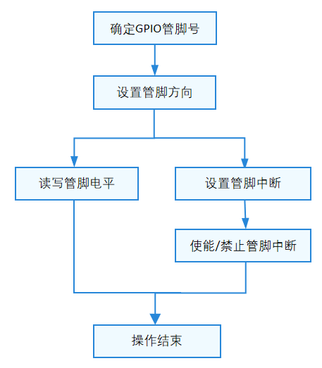

# GPIO

## 概述

### 功能简介

GPIO（General-purpose input/output）即通用型输入输出。通常，GPIO控制器通过分组的方式管理所有GPIO管脚，每组GPIO有一个或多个寄存器与之关联，通过读写寄存器完成对GPIO管脚的操作。

GPIO接口定义了操作GPIO管脚的标准方法集合，包括：

- 设置、获取管脚方向：方向可以是输入或者输出（暂不支持高阻态）。

- 读、写管脚电平值：电平值可以是低电平或高电平。

- 设置、取消管脚中断服务函数：设置一个管脚的中断响应函数，以及中断触发方式。取消一个管脚的中断服务函数。

- 使能、禁止管脚中断：禁止或使能管脚中断。

### 基本概念

GPIO又俗称为I/O口，I指的是输入(in），O指的是输出（out）。可以通过软件来控制其输入和输出，即I/O控制。

- GPIO输入

    输入是检测各个引脚上的电平状态，高电平或者低电平状态。常见的输入模式有：模拟输入、浮空输入、上拉输入、下拉输入。

- GPIO输出

    输出是当需要控制引脚电平的高低时需要用到输出功能。常见的输出模式有：开漏输出、推挽输出、复用开漏输出、复用推挽输出。

### 运作机制

在HDF框架中，同类型设备对象较多时（可能同时存在十几个同类型配置器），若采用独立服务模式，则需要配置更多的设备节点，且相关服务会占据更多的内存资源。相反，采用统一服务模式可以使用一个设备服务作为管理器，统一处理所有同类型对象的外部访问（这会在配置文件中有所体现），实现便捷管理和节约资源的目的。GPIO模块接口适配模式采用统一服务模式（如图1所示）。

在统一模式下，所有的控制器都被核心层统一管理，并由核心层统一发布一个服务供接口层，因此这种模式下驱动无需再为每个控制器发布服务。

GPIO模块各分层作用：

- 接口层提供操作GPIO管脚的标准方法。

- 核心层主要提供GPIO管脚资源匹配，GPIO管脚控制器的添加、移除以及管理的能力，通过钩子函数与适配层交互，供芯片厂家快速接入HDF框架。

- 适配层主要是将钩子函数的功能实例化，实现具体的功能。

**图 1**  GPIO统一服务模式结构图


## 使用指导

### 场景介绍

GPIO主要是对GPIO管脚资源进行管理。开发者可以使用提供的GPIO操作接口，实现对管脚控制的具体控制。

### 接口说明

GPIO模块提供的主要接口如表1所示。具体API[详见](https://gitee.com/openharmony/drivers_hdf_core/blob/master/framework/include/platform/gpio_if.h)。

**表 1** GPIO驱动API接口功能介绍

| 接口名 | 描述 |
| ------------------------------------------------------------ | ------------------------------ |
| GpioGetByName(const char \*gpioName) | 获取GPIO管脚ID |
| int32_t GpioRead(uint16_t gpio, uint16_t \*val) | 读GPIO管脚电平值 |
| int32_t GpioWrite(uint16_t gpio, uint16_t val) | 写GPIO管脚电平值 |
| int32_t GpioGetDir(uint16_t gpio, uint16_t \*dir) | 获取GPIO管脚方向 |
| int32_t GpioSetDir(uint16_t gpio, uint16_t dir) | 设置GPIO管脚方向 |
| int32_t GpioUnsetIrq(uint16_t gpio, void \*arg) | 取消GPIO管脚对应的中断服务函数 |
| int32_t GpioSetIrq(uint16_t gpio, uint16_t mode, GpioIrqFunc func, void \*arg) | 设置GPIO管脚对应的中断服务函数 |
| int32_t GpioEnableIrq(uint16_t gpio) | 使能GPIO管脚中断 |
| int32_t GpioDisableIrq(uint16_t gpio) | 禁止GPIO管脚中断 |

> **说明：**<br>
>本文涉及GPIO的所有接口，支持内核态及用户态使用。

### 开发步骤

GPIO标准API通过GPIO管脚号来操作指定管脚，使用GPIO的一般流程如图2所示。

**图 2** GPIO使用流程图



#### 确定GPIO管脚号

两种方式获取管脚号：根据SOC芯片规则进行计算、通过管脚别名获取

- 根据SOC芯片规则进行计算

    不同SOC芯片由于其GPIO控制器型号、参数、以及控制器驱动的不同，GPIO管脚号的换算方式不一样。

    - Hi3516DV300

        控制器管理12组GPIO管脚，每组8个。

        GPIO号 = GPIO组索引 (0~11) \* 每组GPIO管脚数(8) + 组内偏移

        举例：GPIO10_3的GPIO号 = 10 \* 8 + 3 = 83

    - Hi3518EV300

        控制器管理10组GPIO管脚，每组10个。

        GPIO号 = GPIO组索引 (0~9) \* 每组GPIO管脚数(10) + 组内偏移

        举例：GPIO7_3的GPIO管脚号 = 7 \* 10 + 3 = 73

- 通过管脚别名获取

    调用接口GpioGetByName进行获取，入参是该管脚的别名，接口返回值是管脚的全局ID。

    ```c
    GpioGetByName(const char *gpioName);
    ```

#### 设置GPIO管脚方向

在进行GPIO管脚读写前，需要先通过如下函数设置GPIO管脚方向：

```c
int32_t GpioSetDir(uint16_t gpio, uint16_t dir);
```

**表 2** GpioSetDir参数和返回值描述

| **参数** | **参数描述** |
| ---------- | ------------------ |
| gpio | uint16_t类型，GPIO管脚号 |
| dir | uint16_t类型，待设置的方向值 |
| **返回值** | **返回值描述** |
| HDF_SUCCESS | 设置GPIO管脚方向成功 |
| 负数 | 设置GPIO管脚方向失败 |

假设需要将GPIO管脚3的方向配置为输出，其使用示例如下：

```c
int32_t ret;

ret = GpioSetDir(3, GPIO_DIR_OUT);    // 将3号GPIO管脚配置为输出
if (ret != HDF_SUCCESS) {
    HDF_LOGE("GpioSetDir: gpio set dir fail, ret:%d\n", ret);
    return ret;
}
```

#### 获取GPIO管脚方向

可以通过如下函数获取GPIO管脚方向：

```c
int32_t GpioGetDir(uint16_t gpio, uint16_t *dir);
```

**表 3** GpioGetDir参数和返回值描述

| **参数** | **参数描述** |
| ---------- | ------------------ |
| gpio | uint16_t类型，GPIO管脚号 |
| dir | uint16_t类型指针，获取到的方向值 |
| **返回值** | **返回值描述** |
| HDF_SUCCESS | 获取GPIO管脚方向成功 |
| 负数 | 获取GPIO管脚方向失败 |

假设需要获取GPIO管脚3的方向，其使用示例如下：

```c
int32_t ret;
uin16_t dir;

ret = GpioGetDir(3, &dir);    // 获取3号GPIO管脚方向
if (ret != HDF_SUCCESS) {
    HDF_LOGE("GpioGetDir: gpio get dir fail, ret:%d\n", ret);
    return ret;
}
```

#### 读取GPIO管脚电平值

如果要读取一个GPIO管脚电平，通过以下函数完成：

```c
int32_t GpioRead(uint16_t gpio, uint16_t *val);
```

**表 4** GpioRead参数和返回值描述

| **参数** | **参数描述** |
| ---------- | -------------------- |
| gpio | uint16_t类型，GPIO管脚号 |
| val | uint16_t类型指针，接收读取电平值 |
| **返回值** | **返回值描述** |
| HDF_SUCCESS | 读取GPIO管脚电平值成功 |
| 负数 | 读取GPIO管脚电平值失败 |

假设需要读取GPIO管脚3的电平值，其使用示例如下：

```c
int32_t ret;
uint16_t val;

ret = GpioRead(3, &val);    // 读取3号GPIO管脚电平值
if (ret != HDF_SUCCESS) {
    HDF_LOGE("GpioRead: gpio read fail, ret:%d\n", ret);
    return ret;
}
```

#### 写入GPIO管脚电平值

如果要向GPIO管脚写入电平值，通过以下函数完成：

```c
int32_t GpioWrite(uint16_t gpio, uint16_t val);
```

**表 5** GpioWrite参数和返回值描述

| **参数** | **参数描述** |
| ---------- | ------------------ |
| gpio | uint16_t类型，GPIO管脚号 |
| val | uint16_t类型，待写入的电平值 |
| **返回值** | **返回值描述** |
| HDF_SUCCESS | 写入GPIO管脚电平值成功 |
| 负数 | 写入GPIO管脚电平值失败 |

假设需要给GPIO管脚3写入低电平值，其使用示例如下：

```c
int32_t ret;

ret = GpioWrite(3, GPIO_VAL_LOW);    // 给3号GPIO管脚写入低电平值
if (ret != HDF_SUCCESS) {
    HDF_LOGE("GpioWrite: gpio write fail, ret:%d\n", ret);
    return ret;
}
```

#### 设置GPIO管脚中断

如果要为一个GPIO管脚设置中断响应程序，使用如下函数：

```c
int32_t GpioSetIrq(uint16_t gpio, uint16_t mode, GpioIrqFunc func, void *arg);
```

**表 6** GpioSetIrq参数和返回值描述

| **参数** | **参数描述** |
| ---------- | ------------------------ |
| gpio | uint16_t类型，GPIO管脚号 |
| mode | uint16_t类型，中断触发模式 |
| func | 函数指针，中断服务程序 |
| arg | 无类型指针，传递给中断服务程序的入参 |
| **返回值** | **返回值描述** |
| HDF_SUCCESS | 设置GPIO管脚中断成功 |
| 负数 | 设置GPIO管脚中断失败 |

>  **注意：**<br>
> 同一时间，只能为某个GPIO管脚设置一个中断服务函数，如果重复调用GpioSetIrq函数，则之前设置的中断服务函数会被取代。

#### 取消GPIO管脚中断

当不再需要响应中断服务函数时，使用如下函数取消中断设置：

```c
int32_t GpioUnsetIrq(uint16_t gpio, void *arg);
```

**表 7** GpioUnsetIrq参数和返回值描述

| **参数** | **参数描述** |
| ---------- | -------------- |
| gpio | uint16_t类型，GPIO管脚号 |
| arg | 无类型指针，GPIO中断数据 |
| **返回值** | **返回值描述** |
| HDF_SUCCESS | 取消GPIO管脚中断成功 |
| 负数 | 取消GPIO管脚中断失败 |

#### 使能GPIO管脚中断

在中断服务程序设置完成后，还需要先通过如下函数使能GPIO管脚的中断：

```c
int32_t GpioEnableIrq(uint16_t gpio);
```

**表 8** GpioEnableIrq参数和返回值描述

| **参数** | **参数描述** |
| ---------- | -------------- |
| gpio | uint16_t类型，GPIO管脚号 |
| **返回值** | **返回值描述** |
| HDF_SUCCESS | 使能GPIO管脚中断成功 |
| 负数 | 使能GPIO管脚中断失败 |

>  **注意：**<br>
> 必须通过此函数使能管脚中断，之前设置的中断服务函数才能被正确响应。

#### 禁止GPIO管脚中断

如果要临时屏蔽此中断，可以通过如下函数禁止GPIO管脚中断：

```c
int32_t GpioDisableIrq(uint16_t gpio);
```
**表 9** GpioDisableIrq参数和返回值描述

| **参数** | **参数描述**|
| ---------- | -------------- |
| gpio | uint16_t类型，GPIO管脚号 |
| **返回值** | **返回值描述** |
| HDF_SUCCESS | 禁止GPIO管脚中断成功 |
| 负数 | 禁止GPIO管脚中断失败 |

中断相关操作示例：
 
```c
// 中断服务函数
int32_t MyCallBackFunc(uint16_t gpio, void *data)
{
    HDF_LOGI("MyCallBackFunc: gpio:%u interrupt service in data.\n", gpio);
    return HDF_SUCCESS;
}

int32_t ret;
// 设置中断服务程序为MyCallBackFunc，入参为NULL，中断触发模式为上升沿触发
ret = GpioSetIrq(3, OSAL_IRQF_TRIGGER_RISING, MyCallBackFunc, NULL);
if (ret != HDF_SUCCESS) {
    HDF_LOGE("GpioSetIrq: gpio set irq fail, ret:%d\n", ret);
    return ret;
}

// 使能3号GPIO管脚中断
ret = GpioEnableIrq(3);
if (ret != HDF_SUCCESS) {
    HDF_LOGE("GpioEnableIrq: gpio enable irq fail, ret:%d\n", ret);
    return ret;
}

// 禁止3号GPIO管脚中断
ret = GpioDisableIrq(3);
if (ret != HDF_SUCCESS) {
    HDF_LOGE("GpioDisableIrq: gpio disable irqfail, ret:%d\n", ret);
    return ret;
}

// 取消3号GPIO管脚中断服务程序
ret = GpioUnsetIrq(3, NULL);
if (ret != HDF_SUCCESS) {
    HDF_LOGE("GpioUnSetIrq: gpio unset irq fail, ret:%d\n", ret);
    return ret;
}
```

## 使用实例

本实例程序中，我们将测试一个GPIO管脚的中断触发：为管脚设置中断服务函数，触发方式为边沿触发，然后通过交替写高低电平到管脚，产生电平波动，制造触发条件，观察中断服务函数的执行。

首先需要选取一个空闲的GPIO管脚，本例程基于Hi3516DV300开发板，GPIO管脚选择GPIO10_3，换算成GPIO号为83。

读者可以根据自己使用的开发板，参考其原理图，选择一个空闲的GPIO管脚即可。

```c
#include "gpio_if.h"
#include "hdf_log.h"
#include "osal_irq.h"
#include "osal_time.h"

static uint32_t g_irqCnt;

// 中断服务函数
static int32_t TestCaseGpioIrqHandler(uint16_t gpio, void *data)
{
    HDF_LOGE("TestCaseGpioIrqHandler: irq triggered! on gpio:%u, in data", gpio);
    g_irqCnt++;          // 如果中断服务函数触发执行，则将全局中断计数加1
    return GpioDisableIrq(gpio);
}

// 测试用例函数
static int32_t TestCaseGpioIrqEdge(void)
{
    int32_t ret;
    uint16_t valRead;
    uint16_t mode;
    uint16_t gpio = 84;  // 待测试的GPIO管脚号
    uint32_t timeout;

    // 将管脚方向设置为输出
    ret = GpioSetDir(gpio, GPIO_DIR_OUT);
    if (ret != HDF_SUCCESS) {
        HDF_LOGE("TestCaseGpioIrqEdge: set dir fail! ret:%d\n", ret);
        return ret;
    }

    // 先禁止该管脚中断
    ret = GpioDisableIrq(gpio);
    if (ret != HDF_SUCCESS) {
        HDF_LOGE("TestCaseGpioIrqEdge: disable irq fail! ret:%d\n", ret);
        return ret;
    }

    // 为管脚设置中断服务函数，触发模式为上升沿和下降沿共同触发
    mode = OSAL_IRQF_TRIGGER_RISING | OSAL_IRQF_TRIGGER_FALLING;
    HDF_LOGE("TestCaseGpioIrqEdge: mode:%0x\n", mode);
    ret = GpioSetIrq(gpio, mode, TestCaseGpioIrqHandler, NULL);
    if (ret != HDF_SUCCESS) {
        HDF_LOGE("TestCaseGpioIrqEdge: set irq fail! ret:%d\n", ret);
        return ret;
    }

    // 使能此管脚中断
    ret = GpioEnableIrq(gpio);
    if (ret != HDF_SUCCESS) {
        HDF_LOGE("TestCaseGpioIrqEdge: enable irq fail! ret:%d\n", ret);
        (void)GpioUnsetIrq(gpio, NULL);
        return ret;
    }

    g_irqCnt = 0;        // 清除全局计数器
    timeout = 0;         // 等待时间清零
    // 等待此管脚中断服务函数触发，等待超时时间为1000毫秒
    while (g_irqCnt <= 0 && timeout < 1000) {
        (void)GpioRead(gpio, &valRead);
        (void)GpioWrite(gpio, (valRead == GPIO_VAL_LOW) ? GPIO_VAL_HIGH : GPIO_VAL_LOW);
        HDF_LOGE("TestCaseGpioIrqEdge: wait irq timeout:%u\n", timeout);
        OsalMDelay(200); // 等待中断触发
        timeout += 200;
    }
    (void)GpioUnsetIrq(gpio, NULL);
    HDF_LOGI("TestCaseGpioIrqEdge: function tests end, g_irqCnt:%u", g_irqCnt);
    return (g_irqCnt > 0) ? HDF_SUCCESS : HDF_FAILURE;
}
```
