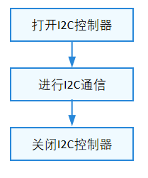

# I2C

## 概述

### 功能简介

I2C（Inter Integrated Circuit）总线是由Philips公司开发的一种简单、双向二线制同步串行总线。由于其硬件连接简单、成本低廉，因此被广泛应用于各种短距离通信的场景。

### 运作机制

I2C以主从方式工作，通常有一个主设备和一个或者多个从设备，主从设备通过SDA（SerialData）串行数据线以及SCL（SerialClock）串行时钟线两根线相连（如图1）。

I2C数据的传输必须以一个起始信号作为开始条件，以一个结束信号作为传输的停止条件。数据传输以字节为单位，高位在前，逐个bit进行传输。

I2C总线上的每一个设备都可以作为主设备或者从设备，而且每一个设备都会对应一个唯一的地址，当主设备需要和某一个从设备通信时，通过广播的方式，将从设备地址写到总线上，如果某个从设备符合此地址，将会发出应答信号，建立传输。

I2C接口定义了完成I2C传输的通用方法集合，包括：

- I2C控制器管理：打开或关闭I2C控制器

- I2C消息传输：通过消息传输结构体数组进行自定义传输

**图 1** I2C物理连线示意图


## 使用指导

### 场景介绍

I2C通常用于与各类支持I2C协议的传感器、执行器或输入输出设备进行通信。

### 接口说明

I2C模块提供的主要接口如表1所示，具体API[详见](https://gitee.com/openharmony/drivers_hdf_core/blob/master/framework/include/platform/i2c_if.h)。

**表 1** I2C驱动API接口功能介绍

| 接口名 | 接口描述 |
| -------- | -------- |
| DevHandle I2cOpen(int16_t number) | 打开I2C控制器。 |
| void I2cClose(DevHandle handle) | 关闭I2C控制器。 |
| int32_t I2cTransfer(DevHandle handle, struct I2cMsg \*msgs, int16_t count) | 自定义传输。 |

### 使用流程

使用I2C设备的一般流程如下图所示。

**图 2** I2C设备使用流程图




#### 打开I2C控制器

在进行I2C通信前，首先要调用I2cOpen打开I2C控制器。

```c
DevHandle I2cOpen(int16_t number);
```

**表 2** I2cOpen参数和返回值描述

| **参数** | **参数描述** | 
| -------- | -------- |
| number | int16_t类型，I2C控制器号。 | 
| **返回值** | **返回值描述** | 
| NULL | 打开I2C控制器失败。 | 
| 设备句柄 | 打开的I2C控制器设备句柄。 | 

假设系统中存在8个I2C控制器，编号从0到7，以下代码示例为获取3号控制器：

```c
DevHandle i2cHandle = NULL;  // I2C控制器句柄。

// 打开I2C控制器。
i2cHandle = I2cOpen(3);
if (i2cHandle == NULL) {
    HDF_LOGE("I2cOpen: i2c open fail.\n");
    return NULL;
}
```

#### 进行I2C通信

消息传输

```c
int32_t I2cTransfer(DevHandle handle, struct I2cMsg *msgs, int16_t count);
```

**表 3** I2cTransfer参数和返回值描述

| **参数** | **参数描述** | 
| -------- | -------- |
| handle | DevHandle类型，I2C控制器设备句柄。 | 
| msgs | 结构体指针，待传输数据的消息结构体数组。 | 
| count | int16_t类型，消息数组长度。 | 
| **返回值** | **返回值描述** | 
| 正整数 | 成功传输的消息结构体数目。 | 
| 负数 | 执行失败。 | 

I2C传输消息类型为I2cMsg，每个传输消息结构体表示一次读或写，通过一个消息数组，可以执行若干次的读写组合操作。组合读写示例：

```c
int32_t ret;
uint8_t wbuff[2] = { 0x12, 0x13 };
uint8_t rbuff[2] = { 0 };
struct I2cMsg msgs[2];        // 自定义传输的消息结构体数组。
msgs[0].buf = wbuff;          // 写入的数据。
msgs[0].len = 2;              // 写入数据长度为2。
msgs[0].addr = 0x5A;          // 写入设备地址为0x5A。
msgs[0].flags = 0;            // 传输标记为0，默认为写。
msgs[1].buf = rbuff;          // 要读取的数据。
msgs[1].len = 2;              // 读取数据长度为2。
msgs[1].addr = 0x5A;          // 读取设备地址为0x5A。
msgs[1].flags = I2C_FLAG_READ // I2C_FLAG_READ置位。
// 进行一次自定义传输，传输的消息个数为2。 
ret = I2cTransfer(i2cHandle, msgs, 2);
if (ret != 2) {
    HDF_LOGE("I2cTransfer: i2c transfer fail, ret:%d\n", ret);
    return HDF_FAILURE;
}
```

>  **注意：**
> - I2cMsg结构体中的设备地址不包含读写标志位，读写信息由flags成员变量的读写控制位传递。
> 
> - 本函数不对消息结构体个数count做限制，其最大个数度由具体I2C控制器决定。
> 
> - 本函数也不对每个消息结构体中的数据长度做限制，同样由具体I2C控制器决定。
> 
> - 本函数可能会引起系统休眠，不允许在中断上下文调用。


#### 关闭I2C控制器

I2C通信完成之后，需要关闭I2C控制器，关闭函数如下所述：

```c
void I2cClose(DevHandle handle); 
```

**表 4** I2cClose参数和返回值描述

| 参数 | 参数描述 | 
| -------- | -------- |
| handle | DevHandle类型，I2C控制器设备句柄。 | 

关闭I2C控制器示例：

```c
I2cClose(i2cHandle); // 关闭I2C控制器。
```

### 使用示例

本例程以操作开发板上的I2C设备为例，详细展示I2C接口的完整使用流程。

本例拟对Hi3516DV300开发板上TouchPad设备进行简单的寄存器读写访问，基本硬件信息如下：

- SOC：hi3516dv300。

- Touch IC：I2C地址为0x38，IC内部寄存器位宽为1字节。

- 硬件连接：TouchPad设备挂接在3号I2C控制器下；IC的复位管脚为3号GPIO。

本例程首先对Touch IC进行复位操作（开发板上电默认会给TouchIC供电，本例程不考虑供电），然后对其内部寄存器进行随机读写，测试I2C通路是否正常。

>  **说明：**<br>
> 本示例重点在于展示I2C设备访问流程，并验证I2C通路，所以对于设备寄存器读写值不做关注，读写寄存器导致的行为由设备自身决定。

示例如下：

```c
#include "i2c_if.h"          /* I2C标准接口头文件 */
#include "gpio_if.h"         /* GPIO标准接口头文件 */
#include "hdf_log.h"         /* 标准日志打印头文件 */
#include "osal_io.h"         /* 标准IO读写接口头文件 */
#include "osal_time.h"       /* 标准延迟&睡眠接口头文件 */

/* 定义一个表示TP设备的结构体，存储i2c及gpio相关硬件信息 */
struct TpI2cDevice {
    uint16_t rstGpio;             /* 复位管脚 */
    uint16_t busId;               /* I2C总线号 */ 
    uint16_t addr;                /* I2C设备地址 */ 
    uint16_t regLen;              /* 寄存器字节宽度 */ 
    DevHandle i2cHandle;  /* I2C控制器句柄 */ 
};

/* I2C管脚io配置，需要查阅SOC寄存器手册  */
#define I2C3_DATA_REG_ADDR 0x112f008c /* 3号I2C控制器SDA管脚配置寄存器地址 */
#define I2C3_CLK_REG_ADDR 0x112f0090  /* 3号I2C控制器SCL管脚配置寄存器地址 */
#define I2C_REG_CFG 0x5f1             /* 3号I2C控制器SDA及SCL管脚配置值 */

static void TpSocIoCfg(void)
{
    /* 将3号I2C控制器对应两个管脚的IO功能设置为I2C */
    OSAL_WRITEL(I2C_REG_CFG, IO_DEVICE_ADDR(I2C3_DATA_REG_ADDR));
    OSAL_WRITEL(I2C_REG_CFG, IO_DEVICE_ADDR(I2C3_CLK_REG_ADDR));
}

/* 对TP的复位管脚进行初始化， 拉高维持20ms, 再拉底维持50ms，最后再拉高维持20ms， 完成复位动作 */
static int32_t TestCaseGpioInit(struct TpI2cDevice *tpDevice)
{
    int32_t ret;

    /* 设置复位管脚方向为输出 */ 
    ret = GpioSetDir(tpDevice->rstGpio, GPIO_DIR_OUT);
    if (ret != HDF_SUCCESS) {
        HDF_LOGE("%s: set rst dir fail!:%d", __func__, ret);
        return ret;
    }

    ret = GpioWrite(tpDevice->rstGpio, GPIO_VAL_HIGH);
    if (ret != HDF_SUCCESS) {
        HDF_LOGE("%s: set rst hight fail!:%d", __func__, ret);
        return ret;
    }
    OsalMSleep(20);

    ret = GpioWrite(tpDevice->rstGpio, GPIO_VAL_LOW);
    if (ret != HDF_SUCCESS) {
        HDF_LOGE("%s: set rst low fail!:%d", __func__, ret);
        return ret;
    }
    OsalMSleep(50);

    ret = GpioWrite(tpDevice->rstGpio, GPIO_VAL_HIGH);
    if (ret != HDF_SUCCESS) {
        HDF_LOGE("%s: set rst high fail!:%d", __func__, ret);
        return ret;
    }
    OsalMSleep(20);

    return HDF_SUCCESS;
}

/* 基于I2cTransfer方法封装一个寄存器读写的辅助函数， 通过flag表示读或写 */
static int TpI2cReadWrite(struct TpI2cDevice *tpDevice, unsigned int regAddr,
    unsigned char *regData, unsigned int dataLen, uint8_t flag)
{
    int index = 0;
    unsigned char regBuf[4] = {0};
    struct I2cMsg msgs[2] = {0};

    /* 单双字节寄存器长度适配 */
    if (tpDevice->regLen == 1) { 
        regBuf[index++] = regAddr & 0xFF;
    } else {
        regBuf[index++] = (regAddr >> 8) & 0xFF;
        regBuf[index++] = regAddr & 0xFF;
    }

    /* 填充I2cMsg消息结构 */ 
    msgs[0].addr = tpDevice->addr;
    msgs[0].flags = 0; /* 标记为0，表示写入 */ 
    msgs[0].len = tpDevice->regLen;
    msgs[0].buf = regBuf;

    msgs[1].addr = tpDevice->addr;
    msgs[1].flags = (flag == 1) ? I2C_FLAG_READ : 0; /* 添加读标记位，表示读取 */ 
    msgs[1].len = dataLen;
    msgs[1].buf = regData;

    if (I2cTransfer(tpDevice->i2cHandle, msgs, 2) != 2) {
        HDF_LOGE("%s: i2c read err", __func__);
        return HDF_FAILURE;
    }
    return HDF_SUCCESS;
}

/* TP寄存器读函数 */ 
static inline int TpI2cReadReg(struct TpI2cDevice *tpDevice, unsigned int regAddr,
    unsigned char *regData, unsigned int dataLen)
{
    return TpI2cReadWrite(tpDevice, regAddr, regData, dataLen, 1);
}

/* TP寄存器写函数 */ 
static inline int TpI2cWriteReg(struct TpI2cDevice *tpDevice, unsigned int regAddr,
    unsigned char *regData, unsigned int dataLen)
{
    return TpI2cReadWrite(tpDevice, regAddr, regData, dataLen, 0);
}

/* I2C例程总入口 */ 
static int32_t TestCaseI2c(void)
{
    int32_t i;
    int32_t ret;
    unsigned char bufWrite[7] = { 0xFF, 0xFF, 0xFF, 0xFF, 0xA, 0xB, 0xC };
    unsigned char bufRead[7] = {0};
    static struct TpI2cDevice tpDevice;

    /* IO管脚功能配置 */
    TpSocIoCfg();

    /* TP设备信息初始化 */ 
    tpDevice.rstGpio = 3;
    tpDevice.busId = 3;
    tpDevice.addr = 0x38;
    tpDevice.regLen = 1;
    tpDevice.i2cHandle = NULL;

    /* GPIO管脚初始化 */ 
    ret = TestCaseGpioInit(&tpDevice);
    if (ret != HDF_SUCCESS) {
        HDF_LOGE("%s: gpio init fail!:%d", __func__, ret);
        return ret;
    }

    /* 打开I2C控制器 */ 
    tpDevice.i2cHandle = I2cOpen(tpDevice.busId);
    if (tpDevice.i2cHandle == NULL) {
        HDF_LOGE("%s: Open I2c:%u fail!", __func__, tpDevice.busId);
        return -1;
    }

    /* 向TP-IC的0xD5寄存器连续写7字节数据 */ 
    ret = TpI2cWriteReg(&tpDevice, 0xD5, bufWrite, 7);
    if (ret != HDF_SUCCESS) {
        HDF_LOGE("%s: tp i2c write reg fail!:%d", __func__, ret);
        I2cClose(tpDevice.i2cHandle);
        return -1;
    }
    OsalMSleep(10);

    /* 从TP-IC的0xD5寄存器连续读7字节数据 */ 
    ret = TpI2cReadReg(&tpDevice, 0xD5, bufRead, 7);
    if (ret != HDF_SUCCESS) {
        HDF_LOGE("%s: tp i2c read reg fail!:%d", __func__, ret);
        I2cClose(tpDevice.i2cHandle);
        return -1;
    }

    HDF_LOGE("%s: tp i2c write&read reg success!", __func__);
    for (i = 0; i < 7; i++) {
        HDF_LOGE("%s: bufRead[%d] = 0x%x", __func__, i, bufRead[i]);
    }

    /* 访问完毕关闭I2C控制器 */ 
    I2cClose(tpDevice.i2cHandle);
    return ret;
}
```
