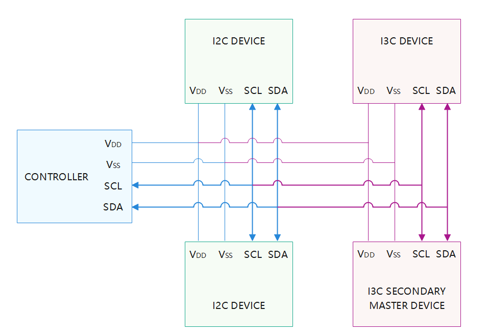
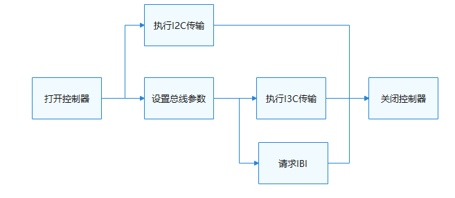

# I3C<a name="1"></a>

## 概述<a name="section1"></a>

### 功能简介<a name="section2"></a>

I3C（Improved Inter Integrated Circuit）总线是由MIPI Alliance开发的一种简单、低成本的双向二线制同步串行总线。

I3C是两线双向串行总线，针对多个传感器从设备进行了优化，并且一次只能由一个I3C主设备控制。相比于I2C，I3C总线拥有更高的速度、更低的功耗，支持带内中断、从设备热接入以及切换当前主设备，同时向后兼容I2C从设备。I3C增加了带内中断（In-Bind Interrupt）功能，支持I3C设备进行热接入操作，弥补了I2C总线需要额外增加中断线来完成中断的不足。I3C总线上允许同时存在I2C设备、I3C从设备和I3C次级主设备。

I3C接口定义了完成I3C传输的通用方法集合，包括：

- I3C控制器管理：打开或关闭I3C控制器。

- I3C控制器配置：获取或配置I3C控制器参数。

- I3C消息传输：通过消息传输结构体数组进行自定义传输。

- I3C带内中断：请求或释放带内中断。

### 基本概念<a name="section3"></a>

- IBI（In-Band Interrupt）<br>

    带内中断。在SCL线没有启动信号时，I3C从设备可以通过拉低SDA线使主设备发出SCL启动信号，从而发出带内中断请求。若有多个从机同时发出中断请求，I3C主机则通过从机地址进行仲裁，低地址优先相应。

- DAA（Dynamic Address Assignment）<br>

    动态地址分配。I3C支持对从设备地址进行动态分配从而避免地址冲突。在分配动态地址之前，连接到I3C总线上的每个I3C设备都应以两种方式之一来唯一标识：

    1）设备可能有一个符合I2C规范的静态地址，主机可以使用此静态地址；

    2）在任何情况下，设备均应具有48位的临时ID。 除非设备具有静态地址且主机使用静态地址，否则主机应使用此48位临时ID。

- CCC（Common Command Code）<br>

    通用命令代码，所有I3C设备均支持CCC，可以直接将其传输到特定的I3C从设备，也可以同时传输到所有I3C从设备。

- BCR（Bus Characteristic Register）<br>

    总线特性寄存器，每个连接到 I3C 总线的 I3C 设备都应具有相关的只读总线特性寄存器 （BCR），该寄存器描述了I3C兼容设备在动态地址分配和通用命令代码中的作用和功能。

- DCR（Device Characteristic Register）<br>

    设备特性寄存器，连接到 I3C 总线的每个 I3C 设备都应具有相关的只读设备特性寄存器 (DCR)。 该寄存器描述了用于动态地址分配和通用命令代码的 I3C 兼容设备类型（例如，加速度计、陀螺仪等）。

### 运作机制<a name="section4"></a>

在HDF框架中，I3C模块接口适配模式采用统一服务模式，这需要一个设备服务来作为I3C模块的管理器，统一处理外部访问，这会在配置文件中有所体现。统一服务模式适合于同类型设备对象较多的情况，如I3C可能同时具备十几个控制器，采用独立服务模式需要配置更多的设备节点，且服务会占据内存资源。相反，采用统一服务模式可以使用一个设备服务作为管理器，统一处理所有同类型对象的外部访问（这会在配置文件中有所体现），实现便捷管理和节约资源的目的。

相比于I2C，I3C总线拥有更高的速度、更低的功耗，支持带内中断、从设备热接入以及切换当前主设备，同时向后兼容I2C从设备。一路I3C总线上，可以连接多个设备，这些设备可以是I2C从设备、I3C从设备和I3C次级主设备，但只能同时存在一个主设备，一般为控制器本身。

**图 1** I3C物理连线示意图<a name="fig1"></a>  


### 约束与限制<a name="section5"></a>

I3C模块当前仅支持轻量和小型系统内核（LiteOS-A），不支持在用户态使用。

## 使用指导<a name="section6"></a>

### 场景介绍<a name="section7"></a>

I3C可连接单个或多个I3C、I2C从器件，它主要用于：

- 与传感器通信，如陀螺仪、气压计或支持I3C协议的图像传感器等；

- 通过软件或硬件协议转换，与其他接口（如 UART 串口等）的设备进行通信。

### 接口说明<a name="section8"></a>

I3C模块提供的主要接口如表1所示，具体API详见//drivers/hdf_core/framework/include/platform/i3c_if.h。

**表 1** I3C驱动API接口功能介绍

<a name="table1"></a>

| 接口名 | 接口描述 |
| ------------- | ----------------- |
| DevHandle I3cOpen(int16_t number) | 打开I3C控制器 |
| void I3cClose(DevHandle handle) | 关闭I3C控制器 |
| int32_t I3cTransfer(DevHandle handle, struct I3cMsg \*msg, int16_t count, enum TransMode mode) | 自定义传输 |
| int32_t I3cSetConfig(DevHandle handle, struct I3cConfig \*config) | 配置I3C控制器 |
| int32_t I3cGetConfig(DevHandle handle, struct I3cConfig \*config) | 获取I3C控制器配置 |
| int32_t I3cRequestIbi(DevHandle handle, uint16_t addr, I3cIbiFunc func, uint32_t payload) | 请求带内中断 |
| int32_t I3cFreeIbi(DevHandle handle, uint16_t addr) | 释放带内中断 |

> **说明：**<br>
>本文涉及的所有接口，仅限内核态使用，不支持在用户态使用。

### 开发步骤<a name="section9"></a>

I3C的使用流程如图2所示。

**图 2** I3C使用流程图<a name="fig2"></a>  


#### 打开I3C控制器<a name="section5"></a>

在进行I3C通信前，首先要调用I3cOpen打开I3C控制器。
```c
DevHandle I3cOpen(int16_t number);
```

**表 2** I3cOpen参数和返回值描述

<a name="table2"></a>

| 参数 | 参数描述 |
| ---------- | ------------------- |
| number | int16_t类型，I3C控制器号 |
| **返回值** | **返回值描述** |
| NULL | 打开I3C控制器失败 |
| 控制器句柄 | 打开的I3C控制器句柄 |

假设系统中存在8个I3C控制器，编号从0到7，以下示例代码为打开1号控制器：

```c
DevHandle i3cHandle = NULL;  // I3C控制器句柄

// 打开I3C控制器
i3cHandle = I3cOpen(1);
if (i3cHandle == NULL) {
    HDF_LOGE("I3cOpen: i3c open fail.\n");
    return NULL;
}
```

#### 获取I3C控制器配置<a name="section7"></a>

```c
int32_t I3cGetConfig(DevHandle handle, struct I3cConfig *config);
```

**表 3** I3cGetConfig参数和返回值描述

<a name="table3"></a>

| 参数 | 参数描述 |
| ---------- | -------------- |
| handle | DevHandle类型，I3C控制器句柄  |
| config | 结构体指针，I3C控制器配置  |
| **返回值** | **返回值描述** |
| HDF_SUCCESS | 获取成功 |
| 负数 | 获取失败 |

获取I3C控制器配置示例：

```c
struct I3cConfig config;

int32_t ret = I3cGetConfig(i3cHandle, &config);
if (ret != HDF_SUCCESS) {
    HDF_LOGE("I3cGetConfig: get config fail, ret:%d", ret);
    return ret;
}
```

#### 配置I3C控制器<a name="section8"></a>

```c
int32_t I3cSetConfig(DevHandle handle, struct I3cConfig *config);
```

**表 4** I3cSetConfig参数和返回值描述

<a name="table4"></a>

| 参数 | 参数描述 |
| ---------- | -------------- |
| handle | DevHandle类型，I3C控制器句柄 |
| config | 结构体指针，I3C控制器配置 |
| **返回值** | **返回值描述** |
| HDF_SUCCESS | 配置成功 |
| 负数 | 配置失败 |

配置I3C控制器示例：

```c
struct I3cConfig config;

config->busMode = I3C_BUS_HDR_MODE;
config->curMaster = NULL;
int32_t ret = I3cSetConfig(i3cHandle, &config);
if (ret != HDF_SUCCESS) {
    HDF_LOGE("I3cSetConfig: set config fail, ret:%d", ret);
    return ret;
}
```

#### 进行I3C通信<a name="section6"></a>

消息传输
```c
int32_t I3cTransfer(DevHandle handle, struct I3cMsg *msgs, int16_t count, enum TransMode mode);
```

**表 5** I3cTransfer参数和返回值描述

<a name="table5"></a>

| 参数 | 参数描述 |
| ---------- | -------------------------------------------- |
| handle | DevHandle类型，I3C控制器句柄 |
| msgs | 结构体指针，待传输数据的消息结构体数组 |
| count | int16_t类型，消息数组长度 |
| mode | 枚举类型，传输模式，0：I2C模式；1：I3C模式；2：发送CCC |
| **返回值** | **返回值描述** |
| 正整数 | 成功传输的消息结构体数目 |
| 负数 | 执行失败 |

I3C传输消息类型为I3cMsg，每个传输消息结构体表示一次读或写，通过一个消息数组，可以执行若干次的读写组合操作。

```c
int32_t ret;
uint8_t wbuff[2] = { 0x12, 0x13 };
uint8_t rbuff[2] = { 0 };
struct I3cMsg msgs[2];        // 自定义传输的消息结构体数组
msgs[0].buf = wbuff;          // 写入的数据
msgs[0].len = 2;              // 写入数据长度为2
msgs[0].addr = 0x3F;          // 写入设备地址为0x3F
msgs[0].flags = 0;            // 传输标记为0，默认为写
msgs[1].buf = rbuff;          // 要读取的数据
msgs[1].len = 2;              // 读取数据长度为2
msgs[1].addr = 0x3F;          // 读取设备地址为0x3F
msgs[1].flags = I3C_FLAG_READ // I3C_FLAG_READ置位
// 进行一次I2C模式自定义传输，传输的消息个数为2
ret = I3cTransfer(i3cHandle, msgs, 2, I2C_MODE);
if (ret != 2) {
    HDF_LOGE("I3cTransfer: transfer fail, ret:%d\n", ret);
    return HDF_FAILURE;
}
```

> **注意：** 
>-   I3cMsg结构体中的设备地址不包含读写标志位，读写信息由flags成员变量的读写控制位传递。
>-   本函数不对消息结构体个数做限制，其最大个数度由具体I3C控制器决定。
>-   本函数不对每个消息结构体中的数据长度做限制，同样由具体I3C控制器决定。
>-   本函数可能会引起系统休眠，禁止在中断上下文调用。

#### 请求IBI（带内中断）<a name="section9"></a>

```c
int32_t I3cRequestIbi(DevHandle handle, uint16_t addr, I3cIbiFunc func, uint32_t payload);
```

**表 6** I3cRequestIbi参数和返回值描述

<a name="table6"></a>

| 参数 | 参数描述 |
| ---------- | -------------- |
| handle | DevHandle类型，I3C控制器句柄  |
| addr | uint16_t类型，I3C设备地址 |
| func | 函数指针，IBI回调函数 |
| payload | IBI有效载荷 |
| **返回值** | **返回值描述** |
| HDF_SUCCESS | 请求成功 |
| 负数 | 请求失败 |

请求带内中断示例：

```c
static int32_t TestI3cIbiFunc(DevHandle handle, uint16_t addr, struct I3cIbiData data)
{
    (void)handle;
    (void)addr;
    HDF_LOGD("TestI3cIbiFunc: %.16s", (char *)data.buf);

    return HDF_SUCCESS;
}

int32_t I3cTestRequestIbi(void)
{
    DevHandle i3cHandle = NULL;
    int32_t ret;

    // 打开I3C控制器
    i3cHandle = I3cOpen(1);
    if (i3cHandle == NULL) {
        HDF_LOGE("I3cOpen: i3c open fail.\n");
        return;
    }
    ret = I3cRequestIbi(i3cHandle, 0x3F, TestI3cIbiFunc, 16);
    if (ret != HDF_SUCCESS) {
        HDF_LOGE("%s: Request IBI failed!", __func__);
        return ret;
    }

    I3cClose(i3cHandle);
    HDF_LOGD("I3cTestRequestIbi: done");

    return HDF_SUCCESS;
}
```

#### 释放IBI（带内中断）<a name="section10"></a>

```c
int32_t I3cFreeIbi(DevHandle handle, uint16_t addr);
```

**表 7** I3cFreeIbi参数和返回值描述

<a name="table7"></a>

| 参数 | 参数描述 |
| ---------- | -------------- |
| handle | DevHandle类型，I3C控制器句柄  |
| addr | uint16_t类型，I3C设备地址 |
| **返回值** | **返回值描述** |
| HDF_SUCCESS | 释放成功 |
| 负数 | 释放失败 |

释放带内中断示例：

```c
I3cFreeIbi(i3cHandle, 0x3F); // 释放带内中断
```

#### 关闭I3C控制器<a name="section11"></a>

I3C通信完成之后，需要关闭I3C控制器，关闭函数如下所示：
```c
void I3cClose(DevHandle handle); 
```

**表 8** I3cClose参数和返回值描述

<a name="table8"></a>

| 参数 | 参数描述 |
| ---------- | -------------- |
| handle | DevHandle类型，I3C控制器句柄 |

关闭I3C控制器实例：

```c
I3cClose(i3cHandle); // 关闭I3C控制器
```

## 使用实例<a name="section10"></a>

本例程以操作Hi3516DV300开发板上的I3C虚拟设备为例，详细展示I3C接口的完整使用流程，基本硬件信息如下。

- SOC：hi3516dv300。

- 虚拟I3C设备：I3C地址为0x3f, 寄存器位宽为1字节。

- 硬件连接：虚拟I3C设备挂接在18号和19号I3C控制器下。

本例程进行简单的I3C传输，测试I3C通路是否正常。

示例如下：

```c
#include "i3c_if.h"               // I3C标准接口头文件
#include "hdf_log.h"              // 标准日志打印头文件
#include "osal_io.h"              // 标准IO读写接口头文件
#include "osal_time.h"            // 标准延迟&睡眠接口头文件

// 定义一个表示设备的结构体，存储信息 
struct TestI3cDevice {
    uint16_t busNum;              // I3C总线号
    uint16_t addr;                // I3C设备地址 
    uint16_t regLen;              // 寄存器字节宽度 
    DevHandle i3cHandle;          // I3C控制器句柄 
};

// 基于I3cTransfer方法封装一个寄存器读写的辅助函数，通过flag表示读或写
static int32_t TestI3cReadWrite(struct TestI3cDevice *testDevice, unsigned int regAddr,
    unsigned char *regData, unsigned int dataLen, uint8_t flag)
{
    int index = 0;
    unsigned char regBuf[4] = {0};
    struct I3cMsg msgs[2] = {0};

    // 单双字节寄存器长度适配
    if (testDevice->regLen == 1) { 
        regBuf[index++] = regAddr & 0xFF;
    } else {
        regBuf[index++] = (regAddr >> 8) & 0xFF;
        regBuf[index++] = regAddr & 0xFF;
    }

    // 填充I3cMsg消息结构 
    msgs[0].addr = testDevice->addr;
    msgs[0].flags = 0;                               // 标记为0，表示写入
    msgs[0].len = testDevice->regLen;
    msgs[0].buf = regBuf;

    msgs[1].addr = testDevice->addr;
    msgs[1].flags = (flag == 1) ? I3C_FLAG_READ : 0; // 添加读标记位，表示读取
    msgs[1].len = dataLen;
    msgs[1].buf = regData;

    if (I3cTransfer(testDevice->i3cHandle, msgs, 2, I2C_MODE) != 2) {
        HDF_LOGE("TestI3cReadWrite: i3c transfer err.");
        return HDF_FAILURE;
    }
    return HDF_SUCCESS;
}

// 寄存器读函数
static inline int32_t TestI3cReadReg(struct TestI3cDevice *testDevice, unsigned int regAddr,
    unsigned char *regData, unsigned int dataLen)
{
    return TestI3cReadWrite(testDevice, regAddr, regData, dataLen, 1);
}

// 寄存器写函数
static inline int32_t TestI3cWriteReg(struct TestI3cDevice *testDevice, unsigned int regAddr,
    unsigned char *regData, unsigned int dataLen)
{
    return TestI3cReadWrite(testDevice, regAddr, regData, dataLen, 0);
}

// I3C例程总入口
static int32_t TestCaseI3c(void)
{
    int32_t ret;
    unsigned char bufWrite[7] = { 0xFF, 0xFF, 0xFF, 0xFF, 0xA, 0xB, 0xC };
    unsigned char bufRead[7] = {0};
    static struct TestI3cDevice testDevice;

    // 设备信息初始化
    testDevice.busNum = 18;
    testDevice.addr = 0x3F;
    testDevice.regLen = 2;
    testDevice.i3cHandle = NULL;

    // 打开I3C控制器 
    testDevice.i3cHandle = I3cOpen(testDevice.busNum);
    if (testDevice.i3cHandle == NULL) {
        HDF_LOGE("TestCaseI3c: open I3c:%u fail!", testDevice.busNum);
        return HDF_FAILURE;
    }

    // 向地址为0x3F的设备连续写7字节数据
    ret = TestI3cWriteReg(&testDevice, 0x3F, bufWrite, 7);
    if (ret != HDF_SUCCESS) {
        HDF_LOGE("TestCaseI3c: test i3c write reg fail, ret:%d", ret);
        I3cClose(testDevice.i3cHandle);
        return ret;
    }
    OsalMSleep(10);

    // 从地址为0x3F的设备连续读7字节数据
    ret = TestI3cReadReg(&testDevice, 0x3F, bufRead, 7);
    if (ret != HDF_SUCCESS) {
        HDF_LOGE("TestCaseI3c: test i3c read reg fail, ret:%d", ret);
        I3cClose(testDevice.i3cHandle);
        return ret;
    }
    HDF_LOGD("TestCaseI3c: test i3c write&read reg success!");
    HDF_LOGD("TestCaseI3c: function tests end.");
    // 访问完毕关闭I3C控制器
    I3cClose(testDevice.i3cHandle);

    return HDF_SUCCESS;
}
```
