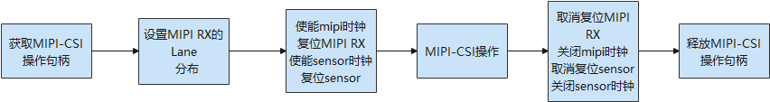

# MIPI CSI

## 概述

### 功能简介

CSI（Camera Serial Interface）是由MIPI联盟下Camera工作组指定的接口标准。CSI-2是MIPI CSI第二版，主要由应用层、协议层、物理层组成，最大支持4通道数据传输、单线传输速度高达1Gb/s。

物理层支持HS（High Speed）和LP（Low Speed）两种工作模式。HS模式下采用低压差分信号，功耗较大，但数据传输速率可以很高（数据速率为80M～1Gbps）；LP模式下采用单端信号，数据速率很低（<10Mbps），但是相应的功耗也很低。两种模式的结合保证了MIPI总线在需要传输大量数据（如图像）时可以高速传输，而在不需要传输大数据量时又能够减少功耗。

图1显示了简化的CSI接口。D-PHY采用1对源同步的差分时钟和1～4对差分数据线来进行数据传输。数据传输采用DDR方式，即在时钟的上下边沿都有数据传输。

**图1**  CSI发送、接收接口<a name="fig1_MIPI_CSIDes"></a>  


MIPI CSI标准分为应用层、协议层与物理层，协议层又细分为像素字节转换层、低级协议层、Lane管理层。

- 物理层（PHY Layer）

  PHY层指定了传输媒介，在电气层面从串行bit流中捕捉“0”与“1”，同时生成SoT与EoT等信号。

- 协议层（Protocol Layer）

  协议层由三个子层组成，每个子层有不同的职责。CSI-2协议能够在host侧处理器上用一个单独的接口处理多条数据流。协议层规定了多条数据流该如何标记和交织起来，以便每条数据流能够被正确地恢复出来。

  - 像素字节转换层（Pixel/Byte Packing/Unpacking Layer）

    CSI-2规范支持多种不同像素格式的图像应用。在发送方中，本层在发送数据到Low Level Protocol层之前，将来自应用层的像素封包为字节数据。在接收方中，本层在发送数据到应用层之前，将来自Low Level Protocol层的字节数据解包为像素。8位的像素数据在本层中传输时保持不变。

  - 低级协议层（Low Level Protocol）

    LLP主要包含了在SoT和EoT事件之间的bit和byte级别的同步方法，以及和下一层传递数据的方法。LLP最小数据粒度是1个字节。LLP也包含了一个字节内的bit值解析，即Endian(大小端里的Endian的意思)的处理。

  - Lane管理层（Lane Management）

    CSI-2的Lane是可扩展的。具体的数据Lane的数量规范并没有给出限制，具体根据应用的带宽需求而定。发送侧分发（distributor功能）来自出口方向数据流的字节到1条或多条Lane上。接收侧则从一条或多条Lane中收集字节并合并（merge功能）到一个数据流上，复原出原始流的字节顺序。对于C-PHY物理层来说，本层专门分发字节对（16 bits）到数据Lane或从数据Lane中收集字节对。基于每Lane的扰码功能是可选特性。

    协议层的数据组织形式是包（packet）。接口的发送侧会增加包头（header）和错误校验（error-checking）信息到即将被LLP发送的数据上。接收侧在LLP将包头剥掉，包头会被接收器中对应的逻辑所解析。错误校验信息可以用来做入口数据的完整性检查。

- 应用层（Application Layer）

  本层描述了更高层级的应用对于数据中的数据的处理，规范并不涵盖应用层。CSI-2规范只给出了像素值和字节的映射关系。

### 运作机制

MIPI CSI模块各分层的作用为：接口层提供打开设备、写入数据和关闭设备的接口。核心层主要提供绑定设备、初始化设备以及释放设备的能力。适配层实现其它具体的功能。

 **说明：**<br>核心层可以调用接口层的函数，核心层通过钩子函数调用适配层函数，从而适配层可以间接的调用接口层函数，但是不可逆转接口层调用适配层函数。

**图2**CSI无服务模式结构图


### 约束与限制

由于使用无服务模式，MIPI_CSI接口暂不支持用户态使用。

## 使用指导

### 场景介绍

MIPI CSI主要用于连接摄像头组件。

### 接口说明

MIPI CSI模块提供的主要接口如表1所示，具体API详见//drivers/hdf_core/framework/include/platform/mipi_csi_if.h。

**表1** ComboDevAttr结构体介绍

<a name="table1_MIPI_CSIDes"></a>

| 名称      | 描述                                                  |
| --------- | ----------------------------------------------------- |
| devno     | 设备号                                                |
| inputMode | 输入模式：MIPI/LVDS/SUBSLVDS/HISPI/DC                 |
| dataRate  | Mipi Rx，SLVS输入速率                                 |
| imgRect   | MIPI Rx设备裁剪区域（与原始传感器输入图像大小相对应） |
| MIPIAttr  | Mipi设备属性                                          |
| lvdsAttr  | LVDS/SubLVDS/HiSPi设备属性                            |

**表2** ExtDataType结构体介绍

<a name="table2_MIPI_CSIDes"></a>

| 名称            | 描述                            |
| --------------- | ------------------------------- |
| devno           | 设备号                          |
| num             | Sensor号                        |
| extDataBitWidth | 图片的位深                      |
| extDataType     | 定义YUV和原始数据格式以及位深度 |

**表3**  MIPI CSI API接口功能介绍

<a name="table3_MIPI_CSIDes"></a>

| 接口名 | 接口描述 |
| -------- | -------- |
| DevHandle MipiCsiOpen(uint8_t id) | 获取MIPI_CSI控制器操作句柄 |
| void MipiCsiClose(DevHandle handle) | 释放MIPI_CSI控制器操作句柄 |
| int32_t MipiCsiSetComboDevAttr(DevHandle handle, ComboDevAttr \*pAttr) | 设置MIPI，CMOS或者LVDS相机的参数给控制器，参数包括工作模式，图像区域，图像深度，数据速率和物理通道等 |
| int32_t MipiCsiSetExtDataType(DevHandle handle, ExtDataType \*dataType) | 设置YUV和RAW数据格式和位深（可选） |
| int32_t MipiCsiSetHsMode(DevHandle handle, LaneDivideMode laneDivideMode) | 设置MIPI&nbsp;RX的Lane分布。根据硬件连接的形式选择具体的mode |
| int32_t MipiCsiSetPhyCmvmode(DevHandle handle, uint8_t devno, PhyCmvMode cmvMode) | 设置共模电压模式 |
| int32_t MipiCsiResetSensor(DevHandle handle, uint8_t snsResetSource) | 复位Sensor |
| int32_t MipiCsiUnresetSensor(DevHandle handle, uint8_t snsResetSource) | 撤销复位Sensor |
| int32_t MipiCsiResetRx(DevHandle handle, uint8_t comboDev) | 复位MIPI&nbsp;RX。不同的s32WorkingViNum有不同的enSnsType |
| int32_t MipiCsiUnresetRx(DevHandle handle, uint8_t comboDev) | 撤销复位MIPI&nbsp;RX |
| int32_t MipiCsiEnableClock(DevHandle handle, uint8_t comboDev) | 使能MIPI的时钟。根据上层函数电泳传递的enSnsType参数决定是用MIPI还是LVDS |
| int32_t MipiCsiDisableClock(DevHandle handle, uint8_t comboDev) | 关闭MIPI设备的时钟 |
| int32_t MipiCsiEnableSensorClock(DevHandle handle, uint8_t snsClkSource) | 使能MIPI上的Sensor时钟 |
| int32_t MipiCsiDisableSensorClock(DevHandle handle, uint8_t snsClkSource) | 关闭Sensor的时钟 |


## 开发步骤

#### 使用流程

使用MIPI CSI的一般流程如图3所示。

**图3**  MIPI CSI使用流程图




#### 获取MIPI CSI控制器操作句柄

在进行MIPI CSI进行通信前，首先要调用MipiCsiOpen获取控制器操作句柄，该函数会返回指定通道ID的控制器操作句柄。

```c
DevHandle MipiCsiOpen(uint8_t id);
```

**表4**  MipiCsiOpen的参数和返回值描述

| 参数       | 参数描述                                        |
| ---------- | ----------------------------------------------- |
| id         | MIPI CSI通道ID                                  |
| **返回值** | **返回值描述**                                  |
| NULL       | 获取失败                                        |
| 设备句柄   | 获取到指令通道的控制器操作句柄，类型为DevHandle |

假设系统中的MIPI CSI通道为0，获取该通道控制器操作句柄的示例如下：

```c
DevHandle MipiCsiHandle = NULL;  /* 设备句柄 */
id = 0;      /* MIPI CSI通道ID */

/* 获取控制器操作句柄 */
MipiCsiHandle = MipiCsiOpen(id);
if (MipiCsiHandle == NULL) {
    HDF_LOGE("MipiCsiOpen: failed\n");
    return;
}
```

#### 进行MIPI CSI相应配置

-   写入MIPI CSI配置

    ```c
    int32_t MipiCsiSetComboDevAttr(DevHandle handle, ComboDevAttr *pAttr);
    ```

    **表5**  MipiCsiSetComboDevAttr的参数和返回值描述

    <a name="table5_MIPI_CSIDes"></a>

    | 参数       | 参数描述                   |
    | ---------- | -------------------------- |
    | handle     | 控制器操作句柄             |
    | pAttr      | MIPI CSI相应配置结构体指针 |
    | **返回值** | **返回值描述**             |
    | 0          | 设置成功                   |
    | 负数       | 设置失败                   |

    ```c
    int32_t ret;
    struct ComboDevAttr attr;

    /* 当前配置如下 */
    (void)memset_s(&attr, sizeof(ComboDevAttr), 0, sizeof(ComboDevAttr));
    attr.devno = 0; /* 设备0 */
    attr.inputMode = INPUT_MODE_MIPI; /* 输入模式为MIPI */
    attr.dataRate = MIPI_DATA_RATE_X1; /* 每时钟输出1像素 */
    attr.imgRect.x = 0; /* 0: 图像传感器左上位置 */
    attr.imgRect.y = 0; /* 0: 图像传感器右上位置 */
    attr.imgRect.width = 2592; /* 2592: 图像传感器宽度大小 */
    attr.imgRect.height = 1944; /* 1944: 图像传感器高度尺寸 */
    /* 写入配置数据 */
    ret = MipiCsiSetComboDevAttr(MipiCsiHandle, &attr);
    if (ret != 0) {
        HDF_LOGE("%s: MipiCsiSetComboDevAttr fail! ret=%d\n", __func__, ret);
        return -1;
    }
    ```

-   设置YUV和RAW数据格式和位深

    ```c
    int32_t MipiCsiSetExtDataType(DevHandle handle, ExtDataType* dataType);
    ```

    **表6**  MipiCsiSetExtDataType的参数和返回值描述

    <a name="table6_MIPI_CSIDes"></a>

    | 参数       | 参数描述                        |
    | ---------- | ------------------------------- |
    | handle     | 控制器操作句柄                  |
    | dataType   | 定义YUV和原始数据格式以及位深度 |
    | **返回值** | **返回值描述**                  |
    | 0          | 设置成功                        |
    | 负数       | 设置失败                        |

    ```c
    int32_t ret;
    struct ExtDataType dataType;

    /* 配置YUV和RAW数据格式和位深参数 */
    dataType.devno = 0; /* 设备0 */
    dataType.num = 0;   /* Sensor 0 */
    dataType.extDataBitWidth[0] = 12; /* 位深数组元素0 */
    dataType.extDataBitWidth[1] = 12; /* 位深数组元素1 */
    dataType.extDataBitWidth[2] = 12; /* 位深数组元素2 */

    dataType.extDataType[0] = 0x39; /* 定义YUV和原始数据格式以及位深度元素0 */
    dataType.extDataType[1] = 0x39; /* 定义YUV和原始数据格式以及位深度元素1 */
    dataType.extDataType[2] = 0x39; /* 定义YUV和原始数据格式以及位深度元素2 */
    /* 设置YUV和RAW数据格式和位深 */
    ret = MipiCsiSetExtDataType(MipiCsiHandle, &dataType);
    if (ret != 0) {
        HDF_LOGE("%s: MipiCsiSetExtDataType fail! ret=%d\n", __func__, ret);
        return -1;
    }
    ```

-   设置MIPI RX的Lane分布

    ```c
    int32_t MipiCsiSetHsMode(DevHandle handle, LaneDivideMode laneDivideMode);
    ```

    **表7**  MipiCsiSetHsMode的参数和返回值描述

    | 参数           | 参数描述       |
    | -------------- | -------------- |
    | handle         | 控制器操作句柄 |
    | laneDivideMode | Lane模式参数   |
    | **返回值**     | **返回值描述** |
    | 0              | 设置成功       |
    | 负数           | 设置失败       |
    
    ```c
    int32_t ret;
    enum LaneDivideMode mode;
    
    /* Lane模式参数为0 */
    mode = LANE_DIVIDE_MODE_0;
    /* 设置MIPI RX的 Lane分布 */
    ret = MipiCsiSetHsMode(MipiCsiHandle, mode);
    if (ret != 0) {
        HDF_LOGE("%s: MipiCsiSetHsMode fail! ret=%d\n", __func__, ret);
        return -1;
    }
    ```
    
-   设置共模电压模式

    ```c
    int32_t MipiCsiSetPhyCmvmode(DevHandle handle, uint8_t devno, PhyCmvMode cmvMode);
    ```

    **表8**  MipiCsiSetPhyCmvmode的参数和返回值描述

    | 参数       | 参数描述         |
    | ---------- | ---------------- |
    | handle     | 控制器操作句柄   |
    | cmvMode    | 共模电压模式参数 |
    | devno      | 设备编号         |
    | **返回值** | **返回值描述**   |
    | 0          | 设置成功         |
    | 负数       | 设置失败         |
    
    ```c
    int32_t ret;
    enum PhyCmvMode mode;
    uint8_t devno;
    
    /* 共模电压模式参数为0 */
    mode = PHY_CMV_GE1200MV;
    /* 设备编号为0 */
    devno = 0;
    /* 设置共模电压模式 */
    ret = MipiCsiSetPhyCmvmode(MipiCsiHandle, devno, mode);
    if (ret != 0) {
        HDF_LOGE("%s: MipiCsiSetPhyCmvmode fail! ret=%d\n", __func__, ret);
        return -1;
    }
    ```

#### 复位/撤销复位Sensor

-   复位Sensor

    ```c
    int32_t MipiCsiResetSensor(DevHandle handle, uint8_t snsResetSource);
    ```

    **表9**  MipiCsiResetSensor的参数和返回值描述

    | 参数           | 参数描述                                         |
    | -------------- | ------------------------------------------------ |
    | handle         | 控制器操作句柄                                   |
    | snsResetSource | 传感器的复位信号线号，在软件中称为传感器的复位源 |
    | **返回值**     | **返回值描述**                                   |
    | 0              | 复位成功                                         |
    | 负数           | 复位失败                                         |
    
    ```c
    int32_t ret;
    uint8_t snsResetSource;
    
    /* 传感器复位信号线号为0 */
    snsResetSource = 0;
    /* 复位Sensor */
    ret = MipiCsiResetSensor(MipiCsiHandle, snsResetSource);
    if (ret != 0) {
        HDF_LOGE("%s: MipiCsiResetSensor fail! ret=%d\n", __func__, ret);
        return -1;
    }
    ```
    
-   撤销复位Sensor

    ```c
    int32_t MipiCsiUnresetSensor(DevHandle handle, uint8_t snsResetSource);
    ```

    **表10**  MipiCsiUnresetSensor的参数和返回值描述

    | 参数           | 参数描述                                         |
    | -------------- | ------------------------------------------------ |
    | handle         | 控制器操作句柄                                   |
    | snsResetSource | 传感器的复位信号线号，在软件中称为传感器的复位源 |
    | **返回值**     | **返回值描述**                                   |
    | 0              | 撤销复位成功                                     |
    | 负数           | 撤销复位失败                                     |
    
    ```c
    int32_t ret;
    uint8_t snsResetSource;
    
    /* 传感器撤销复位信号线号为0 */
    snsResetSource = 0;
    /* 撤销复位Sensor */
    ret = MipiCsiUnresetSensor(MipiCsiHandle, snsResetSource);
    if (ret != 0) {
        HDF_LOGE("%s: MipiCsiUnresetSensor fail! ret=%d\n", __func__, ret);
        return -1;
    }
    ```

#### 复位/撤销复位MIPI RX

-   复位MIPI RX

    ```c
    int32_t MipiCsiResetRx(DevHandle handle, uint8_t comboDev);
    ```

    **表11**  MipiCsiResetRx的参数和返回值描述

    | 参数       | 参数描述              |
    | ---------- | --------------------- |
    | handle     | 控制器操作句柄        |
    | comboDev   | MIPI RX或LVDS通路序号 |
    | **返回值** | **返回值描述**        |
    | 0          | 复位成功              |
    | 负数       | 复位失败              |
    
    ```c
    int32_t ret;
    uint8_t comboDev;
    
    /* 通路序号为0 */
    comboDev = 0;
    /* 复位MIPI RX */
    ret = MipiCsiResetRx(MipiCsiHandle, comboDev);
    if (ret != 0) {
        HDF_LOGE("%s: MipiCsiResetRx fail! ret=%d\n", __func__, ret);
        return -1;
    }
    ```
    
-   撤销复位MIPI RX

    ```c
    int32_t MipiCsiUnresetRx(DevHandle handle, uint8_t comboDev);
    ```

    **表12**  MipiCsiUnresetRx的参数和返回值描述

    | 参数       | 参数描述              |
    | ---------- | --------------------- |
    | handle     | 控制器操作句柄        |
    | comboDev   | MIPI RX或LVDS通路序号 |
    | **返回值** | **返回值描述**        |
    | 0          | 撤销复位成功          |
    | 负数       | 撤销复位失败          |
    
    ```c
    int32_t ret;
    uint8_t comboDev;
    
    /* 通路序号为0 */
    comboDev = 0;
    /* 撤销复位MIPI RX */
    ret = MipiCsiUnresetRx(MipiCsiHandle, comboDev);
    if (ret != 0) {
        HDF_LOGE("%s: MipiCsiUnresetRx fail! ret=%d\n", __func__, ret);
        return -1;
    }
    ```

#### 使能/关闭MIPI的时钟

-   使能MIPI的时钟

    ```c
    int32_t MipiCsiEnableClock(DevHandle handle, uint8_t comboDev);
    ```

    **表13**  MipiCsiEnableClock的参数和返回值描述

    <a name="table13_MIPI_CSIDes"></a>

    | 参数       | 参数描述       |
    | ---------- | -------------- |
    | handle     | 控制器操作句柄 |
    | comboDev   | 通路序号       |
    | **返回值** | **返回值描述** |
    | 0          | 使能成功       |
    | 负数       | 使能失败       |

    ```c
    int32_t ret;
    uint8_t comboDev;

    /* 通路序号为0 */
    comboDev = 0;
    /* 使能MIPI的时钟 */
    ret = MipiCsiEnableClock(MipiCsiHandle, comboDev);
    if (ret != 0) {
        HDF_LOGE("%s: MipiCsiEnableClock fail! ret=%d\n", __func__, ret);
        return -1;
    }
    ```

-   关闭MIPI的时钟

    ```c
    int32_t MipiCsiDisableClock(DevHandle handle, uint8_t comboDev);
    ```

    **表14**  MipiCsiDisableClock的参数和返回值描述

    <a name="table14_MIPI_CSIDes"></a>

    | 参数       | 参数描述       |
    | ---------- | -------------- |
    | handle     | 控制器操作句柄 |
    | comboDev   | 通路序号       |
    | **返回值** | **返回值描述** |
    | 0          | 关闭成功       |
    | 负数       | 关闭失败       |

    ```c
    int32_t ret;
    uint8_t comboDev;
    
    /* 通路序号为0 */
    comboDev = 0;
    /* 关闭MIPI的时钟 */
    ret = MipiCsiDisableClock(MipiCsiHandle, comboDev);
    if (ret != 0) {
        HDF_LOGE("%s: MipiCsiDisableClock fail! ret=%d\n", __func__, ret);
        return -1;
    }
    ```

#### 使能/关闭MIPI上的Sensor时钟<a name="section2.7_MIPI_CSIDes"></a>

-   使能MIPI上的Sensor时钟

    ```c
    int32_t MipiCsiEnableSensorClock(DevHandle handle, uint8_t snsClkSource);
    ```

    **表15**  MipiCsiEnableSensorClock的参数和返回值描述

    <a name="table15_MIPI_CSIDes"></a>

    | 参数         | 参数描述                                         |
    | ------------ | ------------------------------------------------ |
    | handle       | 控制器操作句柄                                   |
    | snsClkSource | 传感器的时钟信号线号，在软件中称为传感器的时钟源 |
    | **返回值**   | **返回值描述**                                   |
    | 0            | 使能成功                                         |
    | 负数         | 使能失败                                         |

    ```c
    int32_t ret;
    uint8_t snsClkSource;

    /* 传感器的时钟信号线号为0 */
    snsClkSource = 0;
    /* 使能MIPI上的Sensor时钟 */
    ret = MipiCsiEnableSensorClock(MipiCsiHandle, snsClkSource);
    if (ret != 0) {
        HDF_LOGE("%s: MipiCsiEnableSensorClock fail! ret=%d\n", __func__, ret);
        return -1;
    }
    ```

-   关闭MIPI上的Sensor时钟

    ```c
    int32_t MipiCsiDisableSensorClock(DevHandle handle, uint8_t snsClkSource);
    ```

    **表16**  MipiCsiDisableSensorClock的参数和返回值描述

    <a name="table16_MIPI_CSIDes"></a>

    | 参数         | 参数描述                                         |
    | ------------ | ------------------------------------------------ |
    | handle       | 控制器操作句柄                                   |
    | snsClkSource | 传感器的时钟信号线号，在软件中称为传感器的时钟源 |
    | **返回值**   | **返回值描述**                                   |
    | 0            | 关闭成功                                         |
    | 负数         | 关闭失败                                         |

    ```c
    int32_t ret;
    uint8_t snsClkSource;
    
    /* 传感器的时钟信号线号为0 */
    snsClkSource = 0;
    /* 关闭MIPI上的Sensor时钟 */
    ret = MipiCsiDisableSensorClock(MipiCsiHandle, snsClkSource);
    if (ret != 0) {
        HDF_LOGE("%s: MipiCsiDisableSensorClock fail! ret=%d\n", __func__, ret);
        return -1;
    }
    ```

#### 释放MIPI CSI控制器操作句柄<a name="section2.8_MIPI_CSIDes"></a>

MIPI CSI使用完成之后，需要释放控制器操作句柄，释放句柄的函数如下所示：

```c
void MipiCsiClose(DevHandle handle);
```

该函数会释放掉由MipiCsiOpen申请的资源。

**表17**  MipiCsiClose的参数和返回值描述

<a name="table17_MIPI_CSIDes"></a>

| 参数         | 参数描述                                         |
| ------------ | ------------------------------------------------ |
| handle       | MIPI CSI控制器操作句柄                                  |

```c
MipiCsiClose(MIPIHandle); /* 释放掉MIPI CSI控制器操作句柄 */
```

## 使用实例<a name="section3_MIPI_CSIDes"></a>

本例拟对Hi3516DV300开发板上MIPI CSI设备进行操作。

MIPI CSI完整的使用示例如下所示：

```c
#include "hdf.h"
#include "MIPI_csi_if.h"

void PalMipiCsiTestSample(void)
{
    uint8_t id;
    int32_t ret;
    uint8_t comboDev;
    uint8_t snsClkSource;
    uint8_t devno;
    enum LaneDivideMode mode;
    enum PhyCmvMode mode;
    struct ComboDevAttr attr;
    struct ExtDataType dataType;
    DevHandle MipiCsiHandle = NULL;
    
    /* 控制器ID号 */
    id = 0; 
    /* 获取控制器操作句柄 */
    MipiCsiHandle = MipiCsiOpen(id);
    if (MipiCsiHandle == NULL) {
        HDF_LOGE("MipiCsiOpen: failed!\n");
        return;
    }
    
    /* Lane模式参数为0 */
    mode = LANE_DIVIDE_MODE_0;
    /* 设置MIPI RX的Lane分布 */
    ret = MipiCsiSetHsMode(MipiCsiHandle, mode);
    if (ret != 0) {
        HDF_LOGE("%s: MipiCsiSetHsMode fail! ret=%d\n", __func__, ret);
        return;
    }

    /* 通路序号为0 */
    comboDev = 0;
    /* 使能MIPI的时钟 */
    ret = MipiCsiEnableClock(MipiCsiHandle, comboDev);
    if (ret != 0) {
        HDF_LOGE("%s: MipiCsiEnableClock fail! ret=%d\n", __func__, ret);
        return;
    }
    
    /* 复位MIPI RX */
    ret = MipiCsiResetRx(MipiCsiHandle, comboDev);
    if (ret != 0) {
        HDF_LOGE("%s: MipiCsiResetRx fail! ret=%d\n", __func__, ret);
        return;
    }

    /* 传感器的时钟信号线号为0 */
    snsClkSource = 0;
    /* 使能MIPI上的Sensor时钟 */
    ret = MipiCsiEnableSensorClock(MipiCsiHandle, snsClkSource);
    if (ret != 0) {
        HDF_LOGE("%s: MipiCsiEnableSensorClock fail! ret=%d\n", __func__, ret);
        return;
    }
    
    /* 复位Sensor */
    ret = MipiCsiResetSensor(MipiCsiHandle, snsResetSource);
    if (ret != 0) {
        HDF_LOGE("%s: MipiCsiResetSensor fail! ret=%d\n", __func__, ret);
        return;
    }
    
    /* MIPI参数配置如下 */
    (void)memset_s(&attr, sizeof(ComboDevAttr), 0, sizeof(ComboDevAttr));
    attr.devno = 0; /* 设备0 */
    attr.inputMode = INPUT_MODE_MIPI; /* 输入模式为MIPI */
    attr.dataRate = MIPI_DATA_RATE_X1; /* 每时钟输出1像素 */
    attr.imgRect.x = 0; /* 0: 图像传感器左上位置 */
    attr.imgRect.y = 0; /* 0: 图像传感器右上位置 */
    attr.imgRect.width = 2592; /* 2592: 图像传感器宽度大小 */
    attr.imgRect.height = 1944; /* 1944: 图像传感器高度尺寸 */
    /* 写入配置数据 */
    ret = MipiCsiSetComboDevAttr(MipiCsiHandle, &attr);
    if (ret != 0) {
        HDF_LOGE("%s: MipiCsiSetComboDevAttr fail! ret=%d\n", __func__, ret);
        return;
    }
    
    /* 共模电压模式参数为0 */
    mode = PHY_CMV_GE1200MV;
    /* 设备编号为0 */
    devno = 0;
    /* 设置共模电压模式 */
    ret = MipiCsiSetPhyCmvmode(MipiCsiHandle, devno, mode);
    if (ret != 0) {
        HDF_LOGE("%s: MipiCsiSetPhyCmvmode fail! ret=%d\n", __func__, ret);
        return;
    }
    
    /* 通路序号为0 */
    comboDev = 0;
    /* 撤销复位MIPI RX */
    ret = MipiCsiUnresetRx(MipiCsiHandle, comboDev);
    if (ret != 0) {
        HDF_LOGE("%s: MipiCsiUnresetRx fail! ret=%d\n", __func__, ret);
        return;
    }
    
    /* 关闭MIPI的时钟 */
    ret = MipiCsiDisableClock(MipiCsiHandle, comboDev);
    if (ret != 0) {
        HDF_LOGE("%s: MipiCsiDisableClock fail! ret=%d\n", __func__, ret);
        return;
    }
    
    /* 传感器撤销复位信号线号为0 */
    snsResetSource = 0;
    /* 撤销复位Sensor */
    ret = MipiCsiUnresetSensor(MipiCsiHandle, snsResetSource);
    if (ret != 0) {
        HDF_LOGE("%s: MipiCsiUnresetSensor fail! ret=%d\n", __func__, ret);
        return;
    }
    
    /* 关闭MIPI上的Sensor时钟 */
    ret = MipiCsiDisableSensorClock(MipiCsiHandle, snsClkSource);
    if (ret != 0) {
        HDF_LOGE("%s: MipiCsiDisableSensorClock fail! ret=%d\n", __func__, ret);
        return;
    }
    
    /* 释放MIPI DSI设备句柄 */
    MipiCsiClose(MipiCsiHandle); 
}
```

