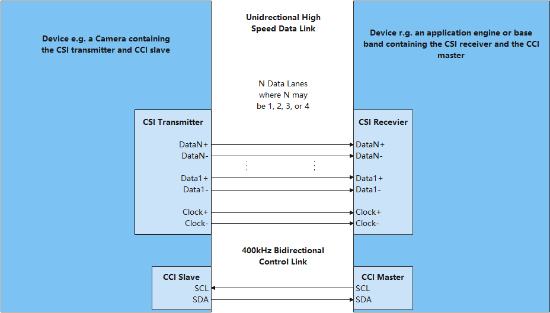

# MIPI CSI

## 概述

### 功能简介

CSI（Camera Serial Interface）是由MIPI联盟下Camera工作组指定的接口标准。CSI-2是MIPI CSI第二版，主要由应用层、协议层、物理层组成，最大支持4通道数据传输、单线传输速度高达1Gb/s。

物理层支持HS（High Speed）和LP（Low Speed）两种工作模式。HS模式下采用低压差分信号，功耗较大，但数据传输速率可以很高（数据速率为80M～1Gbps）；LP模式下采用单端信号，数据速率很低（<10Mbps），但是相应的功耗也很低。两种模式的结合保证了MIPI总线在需要传输大量数据（如图像）时可以高速传输，而在不需要传输大数据量时又能够减少功耗。

图1显示了简化的CSI接口。D-PHY采用1对源同步的差分时钟和1～4对差分数据线来进行数据传输。数据传输采用DDR方式，即在时钟的上下边沿都有数据传输。

**图 1** CSI发送、接收接口



MIPI CSI标准分为应用层、协议层与物理层，协议层又细分为像素字节转换层、低级协议层、Lane管理层。

- 物理层（PHY Layer）

  PHY层指定了传输媒介，在电气层面从串行bit流中捕捉“0”与“1”，同时生成SoT与EoT等信号。

- 协议层（Protocol Layer）

  协议层由三个子层组成，每个子层有不同的职责。CSI-2协议能够在host侧处理器上用一个单独的接口处理多条数据流。协议层规定了多条数据流该如何标记和交织起来，以便每条数据流能够被正确地恢复出来。

  - 像素字节转换层（Pixel/Byte Packing/Unpacking Layer）

    CSI-2规范支持多种不同像素格式的图像应用。在发送方中，本层在发送数据到Low Level Protocol层之前，将来自应用层的像素封包为字节数据。在接收方中，本层在发送数据到应用层之前，将来自Low Level Protocol层的字节数据解包为像素。8位的像素数据在本层中传输时保持不变。

  - 低级协议层（Low Level Protocol）

    LLP主要包含了在SoT和EoT事件之间的bit和byte级别的同步方法，以及和下一层传递数据的方法。LLP最小数据粒度是1个字节。LLP也包含了一个字节内的bit值解析，即Endian(大小端里的Endian的意思)的处理。

  - Lane管理层（Lane Management）

    CSI-2的Lane是可扩展的。具体的数据Lane的数量规范并没有给出限制，具体根据应用的带宽需求而定。发送侧分发（distributor功能）来自出口方向数据流的字节到1条或多条Lane上。接收侧则从一条或多条Lane中收集字节并合并（merge功能）到一个数据流上，复原出原始流的字节顺序。对于C-PHY物理层来说，本层专门分发字节对（16 bits）到数据Lane或从数据Lane中收集字节对。基于每Lane的扰码功能是可选特性。
    协议层的数据组织形式是包（packet）。接口的发送侧会增加包头（header）和错误校验（error-checking）信息到即将被LLP发送的数据上。接收侧在LLP将包头剥掉，包头会被接收器中对应的逻辑所解析。错误校验信息可以用来做入口数据的完整性检查。

- 应用层（Application Layer）

  本层描述了更高层级的应用对于数据中的数据的处理，规范并不涵盖应用层。CSI-2规范只给出了像素值和字节的映射关系。

### 运作机制

MIPI CSI模块各分层的作用为：

- 接口层提供打开设备、写入数据和关闭设备的接口。

- 核心层主要提供绑定设备、初始化设备以及释放设备的能力。

- 适配层实现其它具体的功能。

 **说明：**<br>核心层可以调用接口层的函数，核心层通过钩子函数调用适配层函数，从而适配层可以间接的调用接口层函数，但是不可逆转接口层调用适配层函数。

**图 2** CSI无服务模式结构图


## 开发指导

### 场景介绍

MIPI CSI仅是一个软件层面的概念，主要工作是CSI资源管理。开发者可以通过使用提供的CSI操作接口，实现对CSI资源管理。当驱动开发者需要将MIPI CSI设备适配到OpenHarmony时，需要进行MIPI CSI驱动适配，下文将介绍如何进行MIPI CSI驱动适配。

### 接口说明

为了保证上层在调用MIPI CSI接口时能够正确的操作硬件，核心层在//drivers/hdf_core/framework/support/platform/include/mipi/mipi_csi_core.h中定义了以下钩子函数。驱动适配者需要在适配层实现这些函数的具体功能，并与这些钩子函数挂接，从而完成接口层与核心层的交互。

MipiCsiCntlrMethod定义：

```c
struct MipiCsiCntlrMethod {
    int32_t (*setComboDevAttr)(struct MipiCsiCntlr *cntlr, ComboDevAttr *pAttr);
    int32_t (*setPhyCmvmode)(struct MipiCsiCntlr *cntlr, uint8_t devno, PhyCmvMode cmvMode);
    int32_t (*setExtDataType)(struct MipiCsiCntlr *cntlr, ExtDataType* dataType);
    int32_t (*setHsMode)(struct MipiCsiCntlr *cntlr, LaneDivideMode laneDivideMode);
    int32_t (*enableClock)(struct MipiCsiCntlr *cntlr, uint8_t comboDev);
    int32_t (*disableClock)(struct MipiCsiCntlr *cntlr, uint8_t comboDev);
    int32_t (*resetRx)(struct MipiCsiCntlr *cntlr, uint8_t comboDev);
    int32_t (*unresetRx)(struct MipiCsiCntlr *cntlr, uint8_t comboDev);
    int32_t (*enableSensorClock)(struct MipiCsiCntlr *cntlr, uint8_t snsClkSource);
    int32_t (*disableSensorClock)(struct MipiCsiCntlr *cntlr, uint8_t snsClkSource);
    int32_t (*resetSensor)(struct MipiCsiCntlr *cntlr, uint8_t snsResetSource);
    int32_t (*unresetSensor)(struct MipiCsiCntlr *cntlr, uint8_t snsResetSource);
};
```

**表 1** MipiCsiCntlrMethod成员的钩子函数功能说明
| 成员函数 | 入参 | 出参 | 返回状态 | 功能 |
| ------------------ | ------------------------------------------------------------ | ---- | ------------------ | -------------------------- |
| setComboDevAttr | **cntlr**：结构体指针，MipiCsi控制器 ;<br>**pAttr**：结构体指针，MIPI CSI相应配置结构体指针。 | 无 | HDF_STATUS相关状态 | 写入MIPI CSI配置 |
| setPhyCmvmode | **cntlr**：结构体指针，MipiCsi控制器 ;<br>**devno**：uint8_t类型，设备编号;<br>**cmvMode**：枚举类型，共模电压模式参数。 | 无 | HDF_STATUS相关状态 | 设置共模电压模式           |
| setExtDataType | **cntlr**：结构体指针，MipiCsi控制器 ;<br>**dataType**：结构体指针，定义YUV和原始数据格式以及位深度。 | 无 | HDF_STATUS相关状态 | 设置YUV和RAW数据格式和位深 |
| setHsMode | **cntlr**：结构体指针，MipiCsi控制器 ;<br>**laneDivideMode**：枚举类型，Lane模式参数。 | 无 | HDF_STATUS相关状态 | 设置MIPI RX的Lane分布 |
| enableClock | **cntlr**：结构体指针，MipiCsi控制器 ;<br>**comboDev**：uint8_t类型，通路序号。 | 无 | HDF_STATUS相关状态 | 使能MIPI的时钟 |
| disableClock | **cntlr**：结构体指针，MipiCsi控制器 ;<br/>**comboDev**：uint8_t类型，通路序号。 | 无 | HDF_STATUS相关状态 | 关闭MIPI的时钟 |
| resetRx | **cntlr**：结构体指针，MipiCsi控制器 ;<br/>**comboDev**：uint8_t类型，通路序号。 | 无 | HDF_STATUS相关状态 | 复位MIPI RX |
| unresetRx | **cntlr**：结构体指针，MipiCsi控制器 ;<br/>**comboDev**：uint8_t类型，通路序号。 | 无 | HDF_STATUS相关状态 | 撤销复位MIPI RX |
| enableSensorClock | **cntlr**：结构体指针，MipiCsi控制器 ;<br/>**snsClkSource**：uint8_t类型，传感器的时钟信号线号。 | 无 | HDF_STATUS相关状态 | 使能MIPI上的Sensor时钟 |
| disableSensorClock | **cntlr**：结构体指针，MipiCsi控制器 ;<br/>**snsClkSource**：uint8_t类型，传感器的时钟信号线号。 | 无 | HDF_STATUS相关状态 | 关闭MIPI上的Sensor时钟 |
| resetSensor | **cntlr**：结构体指针，MipiCsi控制器 ;<br/>**snsClkSource**：uint8_t类型，传感器的时钟信号线号。 | 无 | HDF_STATUS相关状态 | 复位Sensor |
| unresetSensor | **cntlr**：结构体指针，MipiCsi控制器 ;<br/>**snsClkSource**：uint8_t类型，传感器的时钟信号线号。 | 无 | HDF_STATUS相关状态 | 撤销复位Sensor |   

### 开发步骤

MIPI CSI模块适配包含以下四个步骤：

1. 实例化驱动入口

    - 实例化HdfDriverEntry结构体成员。

    - 调用HDF_INIT将HdfDriverEntry实例化对象注册到HDF框架中。

2. 配置属性文件

    - 在device_info.hcs文件中添加deviceNode描述。

    - 【可选】添加mipi_csi_config.hcs器件属性文件。

3. 实例化MIPI CSI控制器对象
   
    - 初始化MipiCsiCntlr成员。

    - 实例化MipiCsiCntlr成员MipiCsiCntlrMethod。

        > **说明：**<br>
        >实例化MipiCsiCntlr成员MipiCsiCntlrMethod，其定义和成员说明见[接口说明](#接口说明)。
   
4. 驱动调试

    【可选】针对新增驱动程序，建议验证驱动基本功能，例如挂载后的信息反馈，数据传输的成功与否等。


### 开发实例 

下方将基于Hi3516DV300开发板以//device/soc/hisilicon/common/platform/mipi_csi/mipi_csi_hi35xx.c驱动为示例，展示需要厂商提供哪些内容来完整实现设备功能。

1. 实例化驱动入口 

    驱动入口必须为HdfDriverEntry（在hdf_device_desc.h中定义）类型的全局变量，且moduleName要和device_info.hcs中保持一致。HdfDriverEntry结构体的函数指针成员需要被驱动适配者操作函数填充，HDF框架会将所有加载的驱动的HdfDriverEntry对象首地址汇总，形成一个类似数组，方便调用。

    一般在加载驱动时HDF框架会先调用Bind函数，再调用Init函数加载该驱动。当Init调用异常时，HDF框架会调用Release释放驱动资源并退出。

    MIPI CSI驱动入口参考

    ```c
    struct HdfDriverEntry g_mipiCsiDriverEntry = {
        .moduleVersion = 1,
        .Init = Hi35xxMipiCsiInit,          // 挂接MIPI CSI模块Init实例化
        .Release = Hi35xxMipiCsiRelease,    // 挂接MIPI CSI模块Release实例化
        .moduleName = "HDF_MIPI_RX",        // 【必要且与HCS文件中里面的moduleName匹配】
    };
    HDF_INIT(g_mipiCsiDriverEntry);         // 调用HDF_INIT将驱动入口注册到HDF框架中
    ```

2. 配置属性文件
    一般来说，驱动开发首先需要新增mipi_csi_config.hcs配置文件，在其中配置器件属性，并在//vendor/hisilicon/hispark_taurus/hdf_config/device_info/device_info.hcs文件中添加deviceNode描述。deviceNode与配置属性的对应关系是依靠deviceMatchAttr字段来完成的。只有当deviceNode下的deviceMatchAttr字段与配置属性文件中的match_attr字段完全相同时，驱动才能正确读取配置数据。器件属性值与核心层MipiCsiCntlr成员的默认值或限制范围有密切关系，deviceNode信息与驱动入口注册相关。

    > **说明：**<br>
    >本例中MIPI控制器配置属性在源文件中，没有新增配置文件，驱动适配者如有需要，可在device_info.hcs文件的deviceNode增加deviceMatchAttr字段，同时新增mipi_csi_config.hcs文件，并使其match_attr字段与之相同。

    无服务模式device_info.hcs文件中设备节点也代表着一个设备对象，如果存在多个设备对象，则按需添加，注意服务名与驱动私有数据匹配的关键字名称必须唯一。其中各项参数如表2所示：

    **表 2** device_info.hcs节点参数说明

    | 成员名 | 值 |
    | -------- | -------- |
    | policy | 驱动服务发布的策略，MIPI CSI控制器具体配置为0，表示驱动不需要发布服务 |
    | priority | 驱动启动优先级（0-200），值越大优先级越低。MIPI CSI控制器具体配置为160 |
    | permission | 驱动创建设备节点权限，MIPI CSI控制器具体配置为0664 |
    | moduleName | 驱动名称，MIPI CSI控制器固定为HDF_MIPI_RX |
    | serviceName | 驱动对外发布服务的名称，MIPI CSI控制器服务名设置为HDF_MIPI_RX |
    | deviceMatchAttr | 驱动私有数据匹配的关键字，MIPI CSI控制器没有使用，可忽略 |

    device_info.hcs配置参考

    ```c
    root {
         device_info {
             match_attr = "hdf_manager";
             platform :: host {
                 hostName = "platform_host";
                 priority = 50;
                 device_mipi_csi:: device {
                     device0 :: deviceNode {
                         policy = 0;
                         priority = 160;
                         permission = 0644;
                         moduleName = "HDF_MIPI_RX";  // 【必要】用于指定驱动名称，需要与期望的驱动Entry中的moduleName一致。
                         serviceName = "HDF_MIPI_RX"; // 【必要且唯一】驱动对外发布服务的名称
                     }
                 }
             }
         }
    }
    ```

3. 实例化MIPI CSI控制器对象

    完成驱动入口注册之后，最后一步就是以核心层MipiCsiCntlr对象的初始化为核心，实现HdfDriverEntry成员函数（Bind，Init，Release）。

    MipiCsiCntlr对象的初始化包括驱动适配者自定义结构体（用于传递参数和数据）和实例化MipiCsiCntlr成员MipiCsiCntlrMethod（让用户可以通过接口来调用驱动底层函数）。

    - 自定义结构体参考 

        从驱动的角度看，自定义结构体是参数和数据的载体，一般来说，config文件中的数值也会用来初始化结构体成员，本例的mipicsi器件属性在源文件中，故基本成员结构与MipiCsiCntlr无太大差异。

        ```c
        typedef struct {
            // 数据类型：8/10/12/14/16位
            DataType inputDataType;
            // MIPI波分复用模式
            MipiWdrMode wdrMode;
            // laneId: -1 - 禁用 
            short laneId[MIPI_LANE_NUM];

            union {
                // 用于 HI_MIPI_WDR_MODE_DT
                short dataType[WDR_VC_NUM];
            };
        } MipiDevAttr;

        typedef struct {
            // 设备号
            uint8_t devno;
            // 输入模式: MIPI/LVDS/SUBLVDS/HISPI/DC
            InputMode inputMode;
            MipiDataRate dataRate;
            // MIPI Rx设备裁剪区域（与原始传感器输入图像大小相对应）
            ImgRect imgRect;

            union {
                MipiDevAttr mipiAttr;
                LvdsDevAttr lvdsAttr;
            };
        } ComboDevAttr;

        // MipiCsiCntlr是核心层控制器结构体，其中的成员在Init函数中会被赋值。
        struct MipiCsiCntlr {
            // 当驱动程序绑定到HDF框架时，将发送此控制器提供的服务。
            struct IDeviceIoService service;
            // 当驱动程序绑定到HDF框架时，将传入设备端指针。
            struct HdfDeviceObject *device;
            // 设备号
            unsigned int devNo;
            // 控制器提供的所有接口
            struct MipiCsiCntlrMethod *ops;
            // 对于控制器调试的所有接口，如果未实现驱动程序，则需要null。
            struct MipiCsiCntlrDebugMethod *debugs;
            // 控制器上下文参数变量
            MipiDevCtx ctx;
            // 访问控制器上下文参数变量时锁定
            OsalSpinlock ctxLock;
            // 操作控制器时锁定方法
            struct OsalMutex lock;
            // 匿名数据指针，用于存储csi设备结构。
            void *priv;
        };
        ```

    - MipiCsiCntlr成员钩子函数结构体MipiCsiCntlrMethod的实例化

        > **说明：**<br>
        >其他成员在Init函数中初始化。

        ```c
        static struct MipiCsiCntlrMethod g_method = {
            .setComboDevAttr = Hi35xxSetComboDevAttr,
            .setPhyCmvmode = Hi35xxSetPhyCmvmode,
            .setExtDataType = Hi35xxSetExtDataType,
            .setHsMode = Hi35xxSetHsMode,
            .enableClock = Hi35xxEnableClock,
            .disableClock = Hi35xxDisableClock,
            .resetRx = Hi35xxResetRx,
            .unresetRx = Hi35xxUnresetRx,
            .enableSensorClock = Hi35xxEnableSensorClock,
            .disableSensorClock = Hi35xxDisableSensorClock,
            .resetSensor = Hi35xxResetSensor,
            .unresetSensor = Hi35xxUnresetSensor
        };
        ```

    - Init函数开发参考

        入参：

        HdfDeviceObject是整个驱动对外暴露的接口参数，具备HCS配置文件的信息。

        返回值：

        HDF_STATUS相关状态 （表3为部分展示，如需使用其他状态，可参考//drivers/hdf_core/interfaces/inner_api/utils/hdf_base.h中HDF_STATUS的定义）。

        **表 3** HDF_STATUS相关状态说明

        | 状态(值) | 问题描述 |
        | -------- | -------- |
        | HDF_ERR_INVALID_OBJECT | 控制器对象非法 |
        | HDF_ERR_MALLOC_FAIL | 内存分配失败 |
        | HDF_ERR_IO | I/O&nbsp;错误 |
        | HDF_SUCCESS | 初始化成功 |
        | HDF_FAILURE | 初始化失败 |

        函数说明：

        MipiCsiCntlrMethod的实例化对象的挂载，调用MipiCsiRegisterCntlr，以及其他驱动适配者自定义初始化操作。

        ```c
        static int32_t Hi35xxMipiCsiInit(struct HdfDeviceObject *device)
        {
            int32_t ret;

            HDF_LOGI("%s: enter!", __func__);
            g_mipiCsi.priv = NULL;                             // g_mipiTx是定义的全局变量
                                                               // static struct MipiCsiCntlr g_mipiCsi = {
                                                               //     .devNo = 0
                                                               // };
            g_mipiCsi.ops = &g_method;                         // MipiCsiCntlrMethod的实例化对象的挂载
        #ifdef CONFIG_HI_PROC_SHOW_SUPPORT
            g_mipiCsi.debugs = &g_debugMethod;
        #endif
            ret = MipiCsiRegisterCntlr(&g_mipiCsi, device);    // 【必要】调用核心层函数和g_mipiTx初始化核心层全局变量
            if (ret != HDF_SUCCESS) {
                HDF_LOGE("%s: [MipiCsiRegisterCntlr] failed!", __func__);
                return ret;
            }

            ret = MipiRxDrvInit();                             // 【必要】驱动适配者对设备的初始化，形式不限。
            if (ret != HDF_SUCCESS) {
                HDF_LOGE("%s: [MipiRxDrvInit] failed.", __func__);
                return ret;
            }
        #ifdef MIPICSI_VFS_SUPPORT
            ret = MipiCsiDevModuleInit(g_mipiCsi.devNo);
            if (ret != HDF_SUCCESS) {
                HDF_LOGE("%s: [MipiCsiDevModuleInit] failed!", __func__);
                return ret;
            }
        #endif

            OsalSpinInit(&g_mipiCsi.ctxLock);
            HDF_LOGI("%s: load mipi csi driver success!", __func__);

            return ret;
        }

        // mipi_csi_core.c核心层
        int32_t MipiCsiRegisterCntlr(struct MipiCsiCntlr *cntlr, struct HdfDeviceObject *device)
        {
            ......
            // 定义的全局变量：static struct MipiCsiHandle g_mipiCsihandle[MAX_CNTLR_CNT];
            if (g_mipiCsihandle[cntlr->devNo].cntlr == NULL) {
                (void)OsalMutexInit(&g_mipiCsihandle[cntlr->devNo].lock);
                (void)OsalMutexInit(&(cntlr->lock));
        
                g_mipiCsihandle[cntlr->devNo].cntlr = cntlr;   // 初始化MipiCsiHandle成员
                g_mipiCsihandle[cntlr->devNo].priv = NULL;
                cntlr->device = device;                        // 使HdfDeviceObject与MipiCsiHandle可以相互转化的前提
                device->service = &(cntlr->service);           // 使HdfDeviceObject与MipiCsiHandle可以相互转化的前提
                cntlr->priv = NULL;
                HDF_LOGI("%s: success.", __func__);
        
                return HDF_SUCCESS;
            }

            HDF_LOGE("%s: cntlr already exists.", __func__);
            return HDF_FAILURE;
        }
        ```

    - Release函数开发参考

        入参：

        HdfDeviceObject是整个驱动对外暴露的接口参数，具备HCS配置文件的信息。

        返回值：

        无

        函数说明：

        该函数需要在驱动入口结构体中赋值给Release接口，当HDF框架调用Init函数初始化驱动失败时，可以调用Release释放驱动资源，该函数中需包含释放内存和删除控制器等操作。

        > **说明：**<br>
        >所有强制转换获取相应对象的操作前提是在Init函数中具备对应赋值的操作。

        ```c
        static void Hi35xxMipiCsiRelease(struct HdfDeviceObject *device)
        {
            struct MipiCsiCntlr *cntlr = NULL;
            ......
            cntlr = MipiCsiCntlrFromDevice(device);     // 这里有HdfDeviceObject到MipiCsiCntlr的强制转化
                                                        // return (device == NULL) ? NULL : (struct MipiCsiCntlr *)device->service;
            ......
        
            OsalSpinDestroy(&cntlr->ctxLock);
        #ifdef MIPICSI_VFS_SUPPORT
            MipiCsiDevModuleExit(cntlr->devNo);
        #endif
            MipiRxDrvExit();                            // 【必要】对设备所占资源的释放
            MipiCsiUnregisterCntlr(&g_mipiCsi);         // 空函数
            g_mipiCsi.priv = NULL;
        
            HDF_LOGI("%s: unload mipi csi driver success!", __func__);
        }
        ```

4. 驱动调试

    【可选】针对新增驱动程序，建议验证驱动基本功能，例如挂载后的信息反馈。
