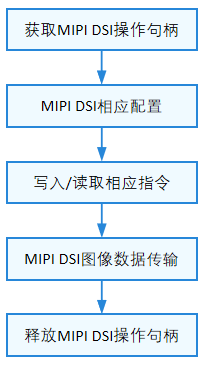

# MIPI DSI

## 概述

### 功能简介

DSI（Display Serial Interface）是由移动行业处理器接口联盟（Mobile Industry Processor Interface (MIPI) Alliance）制定的规范，旨在降低移动设备中显示控制器的成本。它以串行的方式发送像素数据或指令给外设（通常是LCD或者类似的显示设备），或从外设中读取状态信息或像素信息；它定义了主机、图像数据源和目标设备之间的串行总线和通信协议。

MIPI DSI具备高速模式和低速模式两种工作模式，全部数据通道都可以用于单向的高速传输，但只有第一个数据通道才可用于低速双向传输，从属端的状态信息、像素等是通过该数据通道返回。时钟通道专用于在高速传输数据的过程中传输同步时钟信号。

图1显示了简化的DSI接口。从概念上看，符合DSI的接口与基于DBI-2和DPI-2标准的接口具有相同的功能。它向外围设备传输像素或命令数据，并且可以从外围设备读取状态或像素信息。主要区别在于，DSI对所有像素数据、命令和事件进行序列化，而在传统接口中，这些像素数据、命令和事件通常需要附加控制信号才能在并行数据总线上传输。

**图 1** DSI发送、接收接口


DSI标准对应D-PHY、DSI、DCS规范，可分为四层：

- PHY Layer

    PHY层指定传输介质(电导体)、输入/输出电路和从串行比特流中捕获“1”和“0”的时钟机制。这一部分的规范记录了传输介质的特性、信号的电气参数以及时钟与数据通道之间的时序关系。在DSI链路的发送端，并行数据、信号事件和命令按照包组织在协议层转换为包。协议层附加包协议信息和报头，然后通过Lane Management层向PHY发送完整的字节。数据由PHY进行序列化，并通过串行链路发送。DSI链路的接收端执行与发送端相反的操作，将数据包分解为并行的数据、信号事件和命令。如果有多个Lane, Lane管理层将字节分配给单独的物理层，每个Lane一个PHY。

- Lane Management层

    负责发送和收集数据流到每条Lane。数据Lane的三种操作模式 ：espace mode，High-Speed(Burst) mode，Control mode。

- Low Level Protocol层

    定义了如何组帧和解析以及错误检测等。

- Application层

    描述高层编码和解析数据流。这一层描述了数据流中包含的数据的更高级的编码和解释。根据显示子系统架构的不同，它可能由具有指定格式的像素或编码的位流组成，或者由显示模块内的显示控制器解释的命令组成。DSI规范描述了像素值、位流、命令和命令参数到包集合中的字节的映射。 

### 运作机制

MIPI DSI软件模块各分层的作用为：

- 接口层：提供打开设备、写入数据和关闭设备的接口。

- 核心层：主要提供绑定设备、初始化设备以及释放设备的能力。

- 适配层：实现其它具体的功能。

 **说明：**<br>核心层可以调用接口层的函数，核心层通过钩子函数调用适配层函数，从而适配层可以间接的调用接口层函数，但是不可逆转接口层调用适配层函数。

**图 2** DSI无服务模式结构图


### 约束与限制

由于使用无服务模式，MIPI_DSI接口暂不支持用户态使用。

## 使用指导

### 场景介绍

MIPI DSI主要用于连接显示屏。

### 接口说明

MIPI DSI模块提供的主要接口如表1所示，具体API详见//drivers/hdf_core/framework/include/platform/mipi_dsi_if.h。

**表1** MIPI DSI API接口功能介绍

| 功能分类 | 接口名 |
| -------- | -------- |
| DevHandle MipiDsiOpen(uint8_t id) | 获取MIPI&nbsp;DSI操作句柄 |
| void MipiDsiClose(DevHandle handle) | 释放MIPI&nbsp;DSI操作句柄 |
| int32_t MipiDsiSetCfg(DevHandle handle, struct MipiCfg \*cfg) | 设置MIPI&nbsp;DSI相关配置 |
| int32_t MipiDsiGetCfg(DevHandle handle, struct MipiCfg \*cfg) | 获取当前MIPI&nbsp;DSI相关配置 |
| void MipiDsiSetLpMode(DevHandle handle) | 设置MIPI&nbsp;DSI进入Low&nbsp;power模式 |
| void MipiDsiSetHsMode(DevHandle handle) | 设置MIPI&nbsp;DSI进入High&nbsp;speed模式 |
| int32_t MipiDsiTx(DevHandle handle, struct DsiCmdDesc \*cmd) | DSI发送指令 |
| int32_t MipiDsiRx(DevHandle handle, struct DsiCmdDesc \*cmd, int32_t readLen, uint8_t \*out) | MIPI&nbsp;DSI按期望长度回读数据 |

### 开发步骤

使用MIPI DSI的一般流程如下图所示。

**图 3** MIPI DSI使用流程图



#### 获取MIPI DSI操作句柄

在进行MIPI DSI进行通信前，首先要调用MipiDsiOpen获取操作句柄，该函数会返回指定通道ID的操作句柄。

```c
DevHandle MipiDsiOpen(uint8_t id);
```

**表 2** MipiDsiOpen的参数和返回值描述

| **参数** | **参数描述** | 
| -------- | -------- |
| id | uint8_t类型，MIPI&nbsp;DSI通道ID | 
| **返回值** | **返回值描述** | 
| NULL | 获取失败 | 
| 设备句柄 | 获取到指令通道的操作句柄,&nbsp;类型为DevHandle | 

假设系统中的MIPI DSI通道为0，获取该通道操作句柄的示例如下：


```c
DevHandle mipiDsiHandle = NULL;  // 设备句柄
chnId = 0;                       // MIPI DSI通道ID

// 获取操作句柄
mipiDsiHandle = MipiDsiOpen(chnId);
if (mipiDsiHandle == NULL) {
    HDF_LOGE("MipiDsiOpen: mipi dsi open fail.\n");
    return NULL;
}
```

#### MIPI DSI相应配置

- 写入MIPI DSI配置

    ```c
    int32_t MipiDsiSetCfg(DevHandle handle, struct MipiCfg *cfg);
    ```

    **表 3** MipiDsiSetCfg的参数和返回值描述
  
    | **参数** | **参数描述** | 
    | -------- | -------- |
    | handle | DevHandle类型，操作句柄 | 
    | cfg | 结构体指针类型，MIPI&nbsp;DSI相应配置buf&nbsp;指针 | 
    | **返回值** | **返回值描述** | 
    | HDF_SUCCESS | 设置MIPI DSI配置成功 | 
    | 负数 | 设置MIPI DSI配置失败 | 

    ```c
    int32_t ret;
    struct MipiCfg cfg = {0};

    // 当前对接的屏幕配置如下
    cfg.lane = DSI_4_LANES;
    cfg.mode = DSI_CMD_MODE;
    cfg.burstMode = VIDEO_NON_BURST_MODE_SYNC_EVENTS;
    cfg.format = FORMAT_RGB_24_BIT;
    cfg.pixelClk = 174;
    cfg.phyDataRate = 384;
    cfg.timingInfo.hsaPixels = 50;
    cfg.timingInfo.hbpPixels = 55;
    cfg.timingInfo.hlinePixels = 1200;
    cfg.timingInfo.yResLines = 1800;
    cfg.timingInfo.vbpLines = 33;
    cfg.timingInfo.vsaLines = 76;
    cfg.timingInfo.vfpLines = 120;
    cfg.timingInfo.xResPixels = 1342;
    // 写入配置数据
    ret = MipiDsiSetCfg(mipiDsiHandle, &cfg);
    if (ret != HDF_SUCCESS) {
        HDF_LOGE("MipiDsiSetCfg: set mipi cfg fail, ret:%d\n", ret);
        return ret;
    }
    ```

- 获取当前MIPI DSI的配置

    ```c
    int32_t MipiDsiGetCfg(DevHandle handle, struct MipiCfg *cfg);
    ```

    **表 4** MipiDsiGetCfg的参数和返回值描述

    | **参数** | **参数描述** | 
    | -------- | -------- |
    | handle | DevHandle类型，操作句柄 | 
    | cfg | 结构体指针，MIPI&nbsp;DSI相应配置buf&nbsp;指针 | 
    | **返回值** | **返回值描述** | 
    | HDF_SUCCESS | 获取当前MIPI DSI的配置成功 | 
    | 负数 | 获取当前MIPI DSI的配置失败 | 

    ```c
    int32_t ret;
    struct MipiCfg cfg;
    memset(&cfg, 0, sizeof(struct MipiCfg));
    ret = MipiDsiGetCfg(mipiDsiHandle, &cfg);
    if (ret != HDF_SUCCESS) {
        HDF_LOGEMipiDsiGetCfg: get mipi cfg fail, ret:%d!\n", ret);
        return ret;
    }
    ```

#### 发送/回读控制指令

- 发送指令

    ```c
    int32_t MipiDsiTx(PalHandle handle, struct DsiCmdDesc *cmd);
    ```

    **表 5** MipiDsiTx的参数和返回值描述

    | **参数** | **参数描述** | 
    | -------- | -------- |
    | handle | DevHandle类型，操作句柄 | 
    | cmd | 结构体指针类型，需要发送的指令数据指针 | 
    | **返回值** | **返回值描述** | 
    | HDF_SUCCESS | 发送成功 | 
    | 负数 | 发送失败 | 

    ```c
    int32_t ret;
    struct DsiCmdDesc *cmd = OsalMemCalloc(sizeof(struct DsiCmdDesc));
    if (cmd == NULL) {
        return HDF_FAILURE;
    }
    cmd->dtype = DTYPE_DCS_WRITE;
    cmd->dlen = 1;
    cmd->payload = OsalMemCalloc(sizeof(uint8_t));
    if (cmd->payload == NULL) {
        HdfFree(cmd);
        return HDF_FAILURE;
    }
    *(cmd->payload) = DTYPE_GEN_LWRITE;
    MipiDsiSetLpMode(mipiHandle);
    ret = MipiDsiTx(mipiHandle, cmd);
    MipiDsiSetHsMode(mipiHandle);
    if (ret != HDF_SUCCESS) {
        HDF_LOGE("MipiDsiTx: mipi dsi tx fail, ret:%d\n", ret);
        HdfFree(cmd->payload);
        HdfFree(cmd);
        return ret;
    }
    HdfFree(cmd->payload);
    HdfFree(cmd);
    ```

- 回读指令
  
    ```c
    int32_t MipiDsiRx(DevHandle handle, struct DsiCmdDesc *cmd, uint32_t readLen, uint8_t *out);
    ```

    **表 6** MipiDsiRx的参数和返回值描述
  
    | **参数** | **参数描述** | 
    | -------- | -------- |
    | handle | DevHandle类型，操作句柄 | 
    | cmd | 结构体指针类型，需要回读的指令数据指针 | 
    | readLen | uint32_t类型，期望回读的数据长度 | 
    | out | uint8_t类型指针，回读的数据 | 
    | **返回值** | **返回值描述** | 
    | HDF_SUCCESS | 获取成功 | 
    | 负数 | 获取失败 | 
  
    ```c
    int32_t ret;
    uint8_t readVal = 0;

    struct DsiCmdDesc *cmdRead = OsalMemCalloc(sizeof(struct DsiCmdDesc));
    if (cmdRead == NULL) {
        return HDF_FAILURE;
    }
    cmdRead->dtype = DTYPE_DCS_READ;
    cmdRead->dlen = 1;
    cmdRead->payload = OsalMemCalloc(sizeof(uint8_t));
    if (cmdRead->payload == NULL) {
        HdfFree(cmdRead);
        return HDF_FAILURE;
    }
    *(cmdRead->payload) = DDIC_REG_STATUS;
    MipiDsiSetLpMode(mipiDsiHandle);
    ret = MipiDsiRx(mipiDsiHandle, cmdRead, sizeof(readVal), &readVal);
    MipiDsiSetHsMode(mipiDsiHandle);
    if (ret != HDF_SUCCESS) {
        HDF_LOGE("MipiDsiRx: mipi dsi rx fail, ret:%d\n", ret);
        HdfFree(cmdRead->payload);
        HdfFree(cmdRead);
        return HDF_FAILURE;
    }
    HdfFree(cmdRead->payload);
    HdfFree(cmdRead);
    ```


#### 释放MIPI DSI操作句柄

MIPI DSI使用完成之后，需要释放操作句柄，释放句柄的函数如下所示：

```c
void MipiDsiClose(DevHandle handle);
```

该函数会释放掉由MipiDsiOpen申请的资源。

**表 7** MipiDsiClose的参数和返回值描述

| 参数 | 参数描述 | 
| -------- | -------- |
| handle | DevHandle类型，MIPI&nbsp;DSI操作句柄 | 

```c
MipiDsiClose(mipiHandle); // 释放掉MIPI DSI操作句柄
```

## 使用实例

本例拟对Hi3516DV300开发板上MIPI DSI设备进行操作。

MIPI DSI完整的使用示例如下所示：

```c
#include "hdf_log.h"
#include "mipi_dsi_if.h"
#include "osal_mem.h"

#define DTYPE_DCS_WRITE 0x05
#define DTYPE_DCS_READ 0x06
#define DTYPE_GEN_LWRITE 0x29
#define DDIC_REG_STATUS 0x0A


int32_t PalMipiDsiTestSample(void)
{
    uint8_t chnId;
    int32_t ret;  
    DevHandle mipiDsiHandle = NULL;
    
    // 设备通道编号
    chnId = 0; 
    // 获取操作句柄
    mipiDsiHandle = MipiDsiOpen(chnId);
    if (mipiDsiHandle == NULL) {
        HDF_LOGE("MipiDsiOpen: failed!\n");
        return HDF_FAILURE;
    }
    // 配置相应参数 
    struct MipiCfg cfg = {0};
    cfg.lane = DSI_2_LANES;
    cfg.mode = DSI_VIDEO_MODE;
    cfg.format = FORMAT_RGB_24_BIT;
    cfg.burstMode = VIDEO_BURST_MODE;
    cfg.timing.xPixels = 480;           // 480: width 
    cfg.timing.hsaPixels = 10;          // 10: horizontal sync porch 
    cfg.timing.hbpPixels = 20;          // 20: horizontal back porch 
    cfg.timing.hlinePixels = 530;       // 530: horizontal total width 
    cfg.timing.vsaLines = 2;            // 2: vertiacl sync width 
    cfg.timing.vbpLines = 14;           // 14: vertiacl back porch 
    cfg.timing.vfpLines = 16;           // 16: vertiacl front porch 
    cfg.timing.ylines = 960;            // 960: height 
    cfg.timing.edpiCmdSize = 0;         // 0 : no care 
    cfg.pixelClk = 31546;               // 31546: pixel clk   
    cfg.phyDataRate = 379;              // 379: mipi clk 
    // 写入配置数据 
    ret = MipiDsiSetCfg(mipiDsiHandle, &cfg);
    if (ret != 0) {
        HDF_LOGE("PalMipiDsiTestSample: set mipi dsi cfg fail, ret:%d\n", ret);
        return ret;
    }
    // 发送PANEL初始化指令 
    struct DsiCmdDesc *cmd = OsalMemCalloc(sizeof(struct DsiCmdDesc));
    if (cmd == NULL) {
        return -1;
    }
    cmd->dataType = DTYPE_DCS_WRITE;
    cmd->dataLen = 1;
    cmd->payload = OsalMemCalloc(sizeof(uint8_t));
    if (cmd->payload == NULL) {
        OsalMemFree(cmd);
        return -1;
    }
    *(cmd->payload) = DTYPE_GEN_LWRITE;
    MipiDsiSetLpMode(mipiDsiHandle);
    ret = MipiDsiTx(mipiDsiHandle, cmd);
    MipiDsiSetHsMode(mipiDsiHandle);
    if (ret != HDF_SUCCESS) {
        HDF_LOGE("PalMipiDsiTestSample: mipi dsi tx fail, ret:%d\n", ret);
        OsalMemFree(cmd->payload);
        OsalMemFree(cmd);
        return ret;
    }
    OsalMemFree(cmd->payload);
    OsalMemFree(cmd);
    // 回读panel状态寄存器 
    uint8_t readVal = 0;
    struct DsiCmdDesc *cmdRead = OsalMemCalloc(sizeof(struct DsiCmdDesc));
    if (cmdRead == NULL) {
        return -1;
    }
    cmdRead->dataType = DTYPE_DCS_READ;
    cmdRead->dataLen = 1;
    cmdRead->payload = OsalMemCalloc(sizeof(uint8_t));
    if (cmdRead->payload == NULL) {
        OsalMemFree(cmdRead);
        return -1;
    }
    *(cmdRead->payload) = DDIC_REG_STATUS;
    MipiDsiSetLpMode(mipiDsiHandle);
    ret = MipiDsiRx(mipiDsiHandle, cmdRead, sizeof(readVal), &readVal);
    MipiDsiSetHsMode(mipiDsiHandle);
    if (ret != HDF_SUCCESS) {
        HDF_LOGE("PalMipiDsiTestSample: mipi dsi rx fail, ret:%d\n", ret);
        OsalMemFree(cmdRead->payload);
        OsalMemFree(cmdRead);
        return ret;
    }
    OsalMemFree(cmdRead->payload);
    OsalMemFree(cmdRead);
    HDF_LOGD("PalMipiDsiTestSample: mipi dsi tests end");
    // 释放MIPI DSI设备句柄 
    MipiDsiClose(mipiDsiHandle);
    return ret;
}
```
