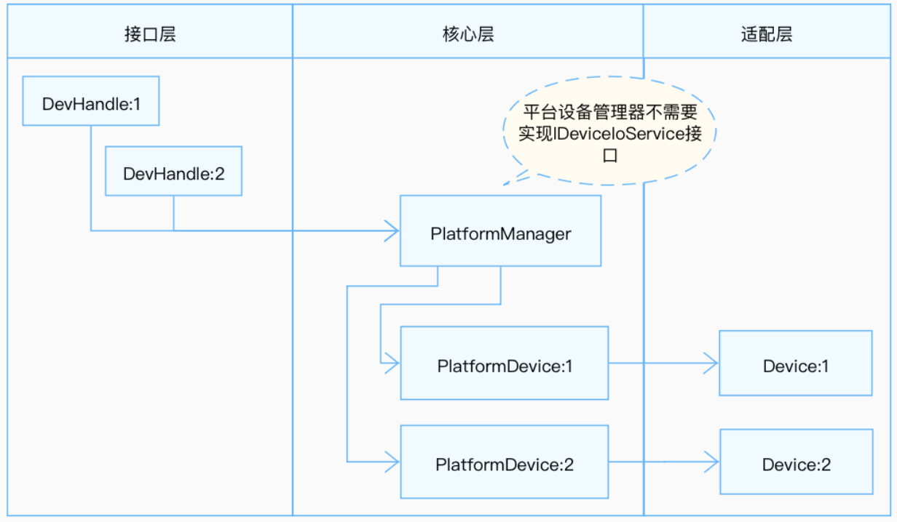

# MIPI DSI

## 概述

### 功能简介

DSI（Display Serial Interface）是由移动行业处理器接口联盟（Mobile Industry Processor Interface (MIPI) Alliance）制定的规范，旨在降低移动设备中显示控制器的成本。它以串行的方式发送像素数据或指令给外设（通常是LCD或者类似的显示设备），或从外设中读取状态信息或像素信息；它定义了主机、图像数据源和目标设备之间的串行总线和通信协议。

MIPI DSI具备高速模式和低速模式两种工作模式，全部数据通道都可以用于单向的高速传输，但只有第一个数据通道才可用于低速双向传输，从属端的状态信息、像素等是通过该数据通道返回。时钟通道专用于在高速传输数据的过程中传输同步时钟信号。

图1显示了简化的DSI接口。从概念上看，符合DSI的接口与基于DBI-2和DPI-2标准的接口具有相同的功能。它向外围设备传输像素或命令数据，并且可以从外围设备读取状态或像素信息。主要区别在于，DSI对所有像素数据、命令和事件进行序列化，而在传统接口中，这些像素数据、命令和事件通常需要附加控制信号才能在并行数据总线上传输。

**图 1** DSI发送、接收接口


DSI标准对应D-PHY、DSI、DCS规范，可分为四层：

- PHY Layer

    PHY层指定传输介质(电导体)、输入/输出电路和从串行比特流中捕获“1”和“0”的时钟机制。这一部分的规范记录了传输介质的特性、信号的电气参数以及时钟与数据通道之间的时序关系。在DSI链路的发送端，并行数据、信号事件和命令按照包组织在协议层转换为包。协议层附加包协议信息和报头，然后通过Lane Management层向PHY发送完整的字节。数据由PHY进行序列化，并通过串行链路发送。DSI链路的接收端执行与发送端相反的操作，将数据包分解为并行的数据、信号事件和命令。如果有多个Lane, Lane管理层将字节分配给单独的物理层，每个Lane一个PHY。

- Lane Management层

    负责发送和收集数据流到每条Lane。数据Lane的三种操作模式 ：espace mode, High-Speed(Burst) mode, Control mode 。

- Low Level Protocol层

    定义了如何组帧和解析以及错误检测等。

- Application层

    描述高层编码和解析数据流。这一层描述了数据流中包含的数据的更高级的编码和解释。根据显示子系统架构的不同，它可能由具有指定格式的像素或编码的位流组成，或者由显示模块内的显示控制器解释的命令组成。DSI规范描述了像素值、位流、命令和命令参数到包集合中的字节的映射。 

### 运作机制

MIPI DSI软件模块各分层的作用为：

- 接口层：提供打开设备、写入数据和关闭设备的接口。

- 核心层：主要提供绑定设备、初始化设备以及释放设备的能力。

- 适配层：实现其它具体的功能。

 **说明：**<br>核心层可以调用接口层的函数，核心层通过钩子函数调用适配层函数，从而适配层可以间接的调用接口层函数，但是不可逆转接口层调用适配层函数。

**图 2** DSI无服务模式结构图



## 开发指导

### 场景介绍

MIPI DSI仅是一个软件层面的概念，主要工作是MIPI DSI资源管理。开发者可以通过使用提供的提供的操作接口，实现DSI资源管理。当驱动开发者需要将MIPI DSI设备适配到OpenHarmony时，需要进行MIPI DSI驱动适配，下文将介绍如何进行MIPI DSI驱动适配。

### 接口说明

为了保证上层在调用MIPI DSI接口时能够正确的操作硬件，核心层在//drivers/hdf_core/framework/support/platform/include/mipi/mipi_dsi_core.h中定义了以下钩子函数。驱动适配者需要在适配层实现这些函数的具体功能，并与这些钩子函数挂接，从而完成接口层与核心层的交互。

MipiDsiCntlrMethod定义：

```c
struct MipiDsiCntlrMethod { // 核心层结构体的成员函数
    int32_t (*setCntlrCfg)(struct MipiDsiCntlr *cntlr);
    int32_t (*setCmd)(struct MipiDsiCntlr *cntlr, struct DsiCmdDesc *cmd);
    int32_t (*getCmd)(struct MipiDsiCntlr *cntlr, struct DsiCmdDesc *cmd, uint32_t readLen, uint8_t *out);
    void (*toHs)(struct MipiDsiCntlr *cntlr);
    void (*toLp)(struct MipiDsiCntlr *cntlr);
    void (*enterUlps)(struct MipiDsiCntlr *cntlr);                       //【可选】进入超低功耗模式
    void (*exitUlps)(struct MipiDsiCntlr *cntlr);                        //【可选】退出超低功耗模式
    int32_t (*powerControl)(struct MipiDsiCntlr *cntlr, uint8_t enable); //【可选】使能/去使能功耗控制
    int32_t (*attach)(struct MipiDsiCntlr *cntlr);                       //【可选】将一个DSI设备连接上host
};
```

**表 1** MipiDsiCntlrMethod成员的钩子函数功能说明

| 成员函数 | 入参 | 出参 | 返回状态 | 功能 | 
| -------- | -------- | -------- | -------- | -------- |
| setCntlrCfg | cntlr：结构体指针，MipiDsi控制器 | 无 | HDF_STATUS相关状态 | 设置控制器参数 | 
| setCmd | cntlr：结构体指针，MipiDsi控制器<br>cmd：结构体指针，指令传入值 | 无 | HDF_STATUS相关状态 | 向显示设备发送指令 | 
| getCmd | cntlr：结构体指针，MipiDsi控制器<br>cmd：传入的命令描述结构体指针<br>readLen：读取的数据大小 | out：uint8_t类型指针，用于存储读取的数据 | HDF_STATUS相关状态 | 通过发送指令读取数据 | 
| toHs | cntlr：结构体指针，MipiDsi控制器 | 无 | HDF_STATUS相关状态 | 设置为高速模式 | 
| toLp | cntlr：结构体指针，MipiDsi控制器 | 无 | HDF_STATUS相关状态 | 设置为低电模式 | 


### 开发步骤

MIPI DSI模块适配包含以下四个步骤：

1. 实例化驱动入口

    - 实例化HdfDriverEntry结构体成员。

    - 调用HDF_INIT将HdfDriverEntry实例化对象注册到HDF框架中。

2. 配置属性文件

    - 在device_info.hcs文件中添加deviceNode描述。

    - 【可选】添加mipi_dsi_config.hcs器件属性文件。

3. 实例化MIPI DSI控制器对象

    - 初始化MipiDsiCntlr成员。

    - 实例化MipiDsiCntlr成员MipiDsiCntlrMethod。

        >  **说明：**<br>
        > 实例化MipiDsiCntlr成员MipiDsiCntlrMethod，其定义和成员说明见[接口说明](#接口说明)。

4. 驱动调试

    【可选】针对新增驱动程序，建议验证驱动基本功能，例如挂载后的信息反馈，数据传输的成功与否等。


### 开发实例

下方将基于Hi3516DV300开发板以//device/soc/hisilicon/common/platform/mipi_dsi/mipi_tx_hi35xx.c驱动为示例，展示需要厂商提供哪些内容来完整实现设备功能。

1. 实例化驱动入口 

    驱动入口必须为HdfDriverEntry（在hdf_device_desc.h中定义）类型的全局变量，且moduleName要和device_info.hcs中保持一致。HdfDriverEntry结构体的函数指针成员需要被驱动适配者操作函数填充，HDF框架会将所有加载的驱动的HdfDriverEntry对象首地址汇总，形成一个类似数组，方便调用。

    一般在加载驱动时HDF框架会先调用Bind函数，再调用Init函数加载该驱动。当Init调用异常时，HDF框架会调用Release释放驱动资源并退出。

    MIPI DSI驱动入口参考：
        
    ```c
    struct HdfDriverEntry g_mipiTxDriverEntry = {
        .moduleVersion = 1,
        .Init = Hi35xxMipiTxInit,          // 挂接MIPI DSI模块Init实例化
        .Release = Hi35xxMipiTxRelease,    // 挂接MIPI DSI模块Release实例化
        .moduleName = "HDF_MIPI_TX",       // 【必要且与HCS文件中里面的moduleName匹配】
    };
    HDF_INIT(g_mipiTxDriverEntry);         // 调用HDF_INIT将驱动入口注册到HDF框架中
    ```

2. 配置属性文件
    一般来说，驱动开发首先需要mipi_dsi_config.hcs配置文件，在其中配置器件属性，并在//vendor/hisilicon/hispark_taurus/hdf_config/device_info/device_info.hcs文件中添加deviceNode描述。deviceNode与配置属性的对应关系是依靠deviceMatchAttr字段来完成的。只有当deviceNode下的deviceMatchAttr字段与配置属性文件中的match_attr字段完全相同时，驱动才能正确读取配置数据。器件属性值与核心层MipiDsiCntlr成员的默认值或限制范围有密切关系，deviceNode信息与驱动入口注册相关。但本例中MIPI DSI控制器无需配置额外属性，驱动适配者如有需要，则需要在device_info.hcs文件的deviceNode增加deviceMatchAttr信息，以及增加mipi_dsi_config.hcs文件。

    无服务模式device_info.hcs文件中设备节点也代表着一个设备对象，如果存在多个设备对象，则按需添加，注意服务名与驱动私有数据匹配的关键字名称必须唯一。其中各项参数如表2所示：

    **表 2** device_info.hcs节点参数说明

    | 成员名 | 值 |
    | -------- | -------- |
    | policy | 驱动服务发布的策略，MIPI DSI控制器具体配置为0，表示驱动不需要发布服务 |
    | priority | 驱动启动优先级（0-200），值越大优先级越低。MIPI DSI控制器具体配置为150 |
    | permission | 驱动创建设备节点权限，MIPI DSI控制器具体配置为0664 |
    | moduleName | 驱动名称，MIPI DSI控制器固定为HDF_MIPI_TX |
    | serviceName | 驱动对外发布服务的名称，MIPI DSI控制器服务名设置为HDF_MIPI_TX |
    | deviceMatchAttr | 驱动私有数据匹配的关键字，MIPI DSI控制器没有使用，可忽略 |

    device_info.hcs 配置参考：
   
    ```c
    root {
        device_info {
            match_attr = "hdf_manager";
            platform :: host {
                hostName = "platform_host";
                priority = 50;
                device_mipi_dsi:: device {
                    device0 :: deviceNode {
                    policy = 0;
                    priority = 150;
                    permission = 0644;
                    moduleName = "HDF_MIPI_TX";   // 【必要】用于指定驱动名称，需要与期望的驱动Entry中的moduleName一致。
                    serviceName = "HDF_MIPI_TX";  // 【必要且唯一】驱动对外发布服务的名称。
                    }
                }
            }
        }
    }
    ```

3. 实例化MIPI DSI控制器对象

    完成驱动入口注册之后，下一步就是以核心层MipiDsiCntlr对象的初始化为核心，包括驱动适配者自定义结构体（传递参数和数据），实例化MipiDsiCntlr成员MipiDsiCntlrMethod（让用户可以通过接口来调用驱动底层函数），实现HdfDriverEntry成员函数（Bind、Init、Release）。

    - 自定义结构体参考。

        从驱动的角度看，自定义结构体是参数和数据的载体，一般来说，config文件中的数值也会用来初始化结构体成员，但本例的MIPI DSI无器件属性文件，故基本成员结构与MipiDsiCntlr无太大差异。

        ```c
        typedef struct {
            unsigned int devno;                // 设备号
            short laneId[LANE_MAX_NUM];        // Lane号
            OutPutModeTag outputMode;          // 输出模式选择：刷新模式，命令行模式或视频流模式
            VideoModeTag videoMode;            // 显示设备的同步模式
            OutputFormatTag outputFormat;      // 输出DSI图像数据格式：RGB或YUV
            SyncInfoTag syncInfo;              // 时序相关的设置
            unsigned int phyDataRate;          // 数据速率，单位Mbps
            unsigned int pixelClk;             // 时钟，单位KHz
        } ComboDevCfgTag;

        struct MipiDsiCntlr {
            struct IDeviceIoService service;
            struct HdfDeviceObject *device;
            unsigned int devNo;                // 设备号
            struct MipiCfg cfg;
            struct MipiDsiCntlrMethod *ops;
            struct OsalMutex  lock;
            void *priv;
        };
        ```

    - MipiDsiCntlr成员钩子函数结构体MipiDsiCntlrMethod的实例化。
     
        ```c
        static struct MipiDsiCntlrMethod g_method = {
            .setCntlrCfg = Hi35xxSetCntlrCfg,
            .setCmd = Hi35xxSetCmd,
            .getCmd = Hi35xxGetCmd,
            .toHs = Hi35xxToHs,
            .toLp = Hi35xxToLp,
        };
        ```

    - Init函数开发参考。

        入参：

        HdfDeviceObject是整个驱动对外暴露的接口参数，具备HCS配置文件的信息。

        返回值：

        HDF_STATUS相关状态 （表3为部分展示，如需使用其他状态，可参考//drivers/hdf_core/interfaces/inner_api/utils/hdf_base.h中HDF_STATUS的定义）。

        **表 3** HDF_STATUS相关状态说明

        | 状态(值) | 问题描述 |
        | -------- | -------- |
        | HDF_ERR_INVALID_OBJECT | 控制器对象非法 |
        | HDF_ERR_MALLOC_FAIL | 内存分配失败 |
        | HDF_ERR_IO | I/O&nbsp;错误 |
        | HDF_SUCCESS | 初始化成功 |
        | HDF_FAILURE | 初始化失败 |

        函数说明：

        MipiDsiCntlrMethod的实例化对象的挂载，调用MipiDsiRegisterCntlr，以及其他驱动适配者自定义初始化操作。

        ```c
        static int32_t Hi35xxMipiTxInit(struct HdfDeviceObject *device)
        {
            int32_t ret;
            g_mipiTx.priv = NULL;                            // g_mipiTx是定义的全局变量
                                                             // static struct MipiDsiCntlr g_mipiTx {
                                                             //     .devNo=0
                                                             // };
            g_mipiTx.ops = &g_method;                        // MipiDsiCntlrMethod的实例化对象的挂载
            ret = MipiDsiRegisterCntlr(&g_mipiTx, device);   // 【必要】调用核心层函数和g_mipiTx初始化核心层全局变量
            ......
            return MipiTxDrvInit(0);                         // 【必要】驱动适配者对设备的初始化，形式不限
        }

        // mipi_dsi_core.c核心层
        int32_t MipiDsiRegisterCntlr(struct MipiDsiCntlr *cntlr, struct HdfDeviceObject *device)
        {
            ......
            // 定义的全局变量：static struct MipiDsiHandle g_mipiDsihandle[MAX_CNTLR_CNT];
            if (g_mipiDsihandle[cntlr->devNo].cntlr == NULL) {
                (void)OsalMutexInit(&g_mipiDsihandle[cntlr->devNo].lock);
                (void)OsalMutexInit(&(cntlr->lock));

                g_mipiDsihandle[cntlr->devNo].cntlr = cntlr; // 初始化MipiDsiHandle成员
                g_mipiDsihandle[cntlr->devNo].priv = NULL;
                cntlr->device = device;                      // 使HdfDeviceObject与MipiDsiHandle可以相互转化的前提
                device->service = &(cntlr->service);         // 使HdfDeviceObject与MipiDsiHandle可以相互转化的前提
                cntlr->priv = NULL;
                ......
                return HDF_SUCCESS;
            }
            ......
            return HDF_FAILURE;
        }
        ```

    - Release函数开发参考。

        入参：

        HdfDeviceObject是整个驱动对外暴露的接口参数，具备HCS配置文件的信息。

        返回值：

        无。

        函数说明：

        该函数需要在驱动入口结构体中赋值给Release接口，当HDF框架调用Init函数初始化驱动失败时，可以调用Release释放驱动资源，该函数中需包含释放内存和删除控制器等操作。

        >  **说明：**<br>
        > 所有强制转换获取相应对象的操作前提是在Init函数中具备对应赋值的操作。
      
        ```c
        static void Hi35xxMipiTxRelease(struct HdfDeviceObject *device)
        {
            struct MipiDsiCntlr *cntlr = NULL;
            ......
            cntlr = MipiDsiCntlrFromDevice(device); // 这里有HdfDeviceObject到MipiDsiCntlr的强制转化
                                                    // return (device == NULL) ? NULL : (struct MipiDsiCntlr *)device->service;
            ......
            MipiTxDrvExit();                        // 【必要】对设备所占资源的释放
            MipiDsiUnregisterCntlr(&g_mipiTx);      // 空函数
            g_mipiTx.priv = NULL;
            HDF_LOGI("%s: unload mipi_tx driver 1212!", __func__);
        }
        ```

4. 驱动调试

    【可选】针对新增驱动程序，建议验证驱动基本功能，例如挂载后的信息反馈。
