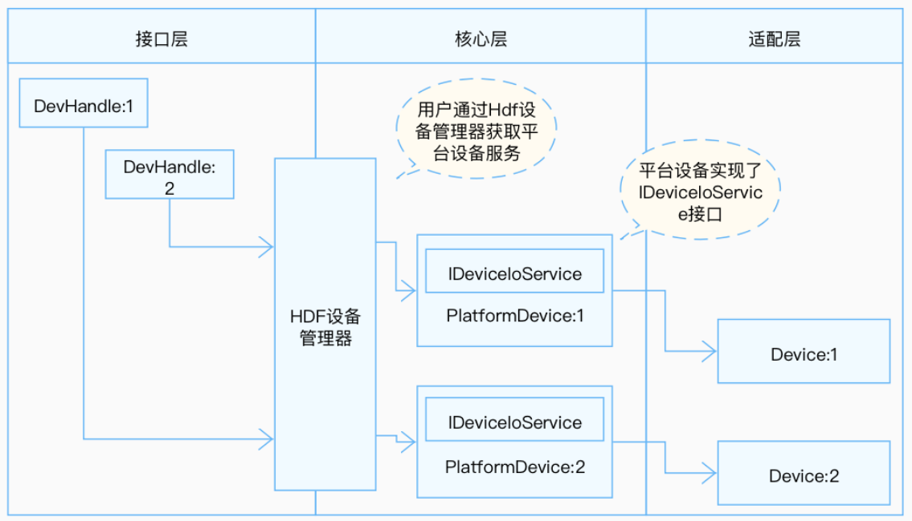

# MMC

## 概述

### 功能简介

MMC（MultiMedia Card）即多媒体卡，是一种用于固态非易失性存储的小体积大容量的快闪存储卡。

MMC后续泛指一个接口协定（一种卡式），能符合这种接口的内存器都可称作MMC储存体。主要包括几个部分：MMC控制器、MMC总线、存储卡（包括MMC卡、SD卡、SDIO卡、TF卡）。

MMC、SD、SDIO总线，其总线规范类似，都是从MMC总线规范演化而来的。MMC强调的是多媒体存储；SD强调的是安全和数据保护；SDIO是从SD演化出来的，强调的是接口，不再关注另一端的具体形态（可以是WIFI设备、Bluetooth设备、GPS等等）。

### 基本概念

- SD卡（Secure Digital Memory Card）

    SD卡即安全数码卡。它是在MMC的基础上发展而来，SD卡强调数据的安全安全，可以设定存储内容的使用权限，防止数据被他人复制。在数据传输和物理规范上，SD卡（24mm\*32mm\*2.1mm，比MMC卡更厚一点），向前兼容了MMC卡。所有支持SD卡的设备也支持MMC卡。

- SDIO（Secure Digital Input and Output）

    即安全数字输入输出接口。SDIO是在SD规范的标准上定义的一种外设接口，它相较于SD规范增加了低速标准，可以用最小的硬件开销支持低速I/O。SDIO接口兼容以前的SD内存卡，也可以连接SDIO接口的设备。

### 运作机制

在HDF框架中，MMC的接口适配模式采用独立服务模式（如图1所示）。在这种模式下，每一个设备对象会独立发布一个设备服务来处理外部访问，设备管理器收到API的访问请求之后，通过提取该请求的参数，达到调用实际设备对象的相应内部方法的目的。独立服务模式可以直接借助HDFDeviceManager的服务管理能力，但需要为每个设备单独配置设备节点，增加内存占用。

独立服务模式下，核心层不会统一发布一个服务供上层使用，因此这种模式下驱动要为每个控制器发布一个服务，具体表现为：

- 驱动适配者需要实现HdfDriverEntry的Bind钩子函数以绑定服务。

- device_info.hcs文件中deviceNode的policy字段为1或2，不能为0。

MMC模块各分层作用：

- 接口层提供打开MMC设备、检查MMC控制器是否存在设备、关闭MMC设备的接口。

- 核心层主要提供MMC控制器、移除和管理的能力，还有公共控制器业务。通过钩子函数与适配层交互。

- 适配层主要是将钩子函数的功能实例化，实现具体的功能。

**图 1** MMC独立服务模式结构图



## 开发指导

### 场景介绍

MMC用于多媒体文件的存储，当驱动开发者需要将MMC设备适配到OpenHarmony时，需要进行MMC驱动适配。下文将介绍如何进行MMC驱动适配。

### 接口说明

为了保证上层在调用MMC接口时能够正确的操作MMC控制器，核心层在//drivers/hdf_core/framework/model/storage/include/mmc/mmc_corex.h中定义了以下钩子函数，驱动适配者需要在适配层实现这些函数的具体功能，并与钩子函数挂接，从而完成适配层与核心层的交互。

MmcCntlrOps定义：

```c
struct MmcCntlrOps {
    int32_t (*request)(struct MmcCntlr *cntlr, struct MmcCmd *cmd);
    int32_t (*setClock)(struct MmcCntlr *cntlr, uint32_t clock);
    int32_t (*setPowerMode)(struct MmcCntlr *cntlr, enum MmcPowerMode mode);
    int32_t (*setBusWidth)(struct MmcCntlr *cntlr, enum MmcBusWidth width);
    int32_t (*setBusTiming)(struct MmcCntlr *cntlr, enum MmcBusTiming timing);
    int32_t (*setSdioIrq)(struct MmcCntlr *cntlr, bool enable);
    int32_t (*hardwareReset)(struct MmcCntlr *cntlr);
    int32_t (*systemInit)(struct MmcCntlr *cntlr);
    int32_t (*setEnhanceStrobe)(struct MmcCntlr *cntlr, bool enable);
    int32_t (*switchVoltage)(struct MmcCntlr *cntlr, enum MmcVolt volt);
    bool (*devReadOnly)(struct MmcCntlr *cntlr);
    bool (*devPlugged)(struct MmcCntlr *cntlr);
    bool (*devBusy)(struct MmcCntlr *cntlr);
    int32_t (*tune)(struct MmcCntlr *cntlr, uint32_t cmdCode);
    int32_t (*rescanSdioDev)(struct MmcCntlr *cntlr);
};
```

**表 1** MmcCntlrOps结构体成员的钩子函数功能说明

| 成员函数 | 入参 | 返回值 | 功能 |
| -------- | -------- | -------- | -------- |
| doRequest | cntlr：结构体指针，核心层MMC控制器<br>cmd：结构体指针,传入命令值 | HDF_STATUS相关状态 | request相应处理 |
| setClock | cntlr：结构体指针，核心层MMC控制器<br>clock：uint32_t类型，时钟传入值 | HDF_STATUS相关状态 | 设置时钟频率 |
| setPowerMode | cntlr：结构体指针，核心层MMC控制器<br>mode：枚举值（见MmcPowerMode定义），功耗模式 | HDF_STATUS相关状态 | 设置功耗模式 |
| setBusWidth | cntlr：核心层结构体指针，核心层MMMC控制器<br>width：枚举类型（见MmcBusWidth定义），总线带宽 | HDF_STATUS相关状态 | 设置总线带宽 |
| setBusTiming | cntlr：结构体指针，核心层MMC控制器<br>timing：枚举类型（见MmcBusTiming定义），总线时序 | HDF_STATUS相关状态 | 设置总线时序 |
| setSdioIrq | cntlr：结构体指针，核心层MMC控制器<br>enable：布尔值，控制中断 | HDF_STATUS相关状态 | 使能/去使能SDIO中断 |
| hardwareReset | cntlr：结构体指针，核心层MMC控制器 | HDF_STATUS相关状态 | 复位硬件 |
| systemInit | cntlr：结构体指针，核心层MMC控制器 | HDF_STATUS相关状态 | 系统初始化 |
| setEnhanceStrobe | cntlr：结构体指针，核心层MMC控制器<br>enable：布尔值，设置功能 | HDF_STATUS相关状态 | 设置增强选通 |
| switchVoltage | cntlr：结构体指针，核心层MMC控制器<br>volt：枚举值，电压值（3.3,1.8,1.2V） | HDF_STATUS相关状态 | 设置电压值 |
| devReadOnly | cntlr：结构体指针，核心层MMC控制器 | 布尔值 | 检验设备是否只读 |
| cardPlugged | cntlr：结构体指针，核心层MMC控制器 | 布尔值 | 检验设备是否拔出 |
| devBusy | cntlr：结构体指针，核心层MMC控制器 | 布尔值 | 检验设备是否忙碌 |
| tune | cntlr：结构体指针，核心层MMC控制器<br>cmdCode：uint32_t类型，命令代码 | HDF_STATUS相关状态 | 调谐 |
| rescanSdioDev | cntlr：结构体指针，核心层MMC控制器 | HDF_STATUS相关状态 | 扫描并添加SDIO设备 |

### 开发步骤

MMC模块适配包含以下四个步骤：

- 实例化驱动入口

- 配置属性文件

- 实例化MMC控制器对象

- 驱动调试

### 开发实例

下方将基于Hi3516DV300开发板以//device/soc/hisilicon/common/platform/mmc/himci_v200/himci.c驱动为示例，展示需要驱动适配者提供哪些内容来完整实现设备功能。

1. 实例化驱动入口

    驱动入口必须为HdfDriverEntry（在hdf_device_desc.h中定义）类型的全局变量，且moduleName要和device_info.hcs中保持一致。HDF框架会将所有加载的驱动的HdfDriverEntry对象首地址汇总，形成一个类似数组的段地址空间，方便上层调用。

    一般在加载驱动时HDF会先调用Bind函数，再调用Init函数加载该驱动。当Init调用异常时，HDF框架会调用Release释放驱动资源并退出。

    MMC驱动入口开发参考：

    ```c
    struct HdfDriverEntry g_mmcDriverEntry = {
        .moduleVersion = 1,
        .Bind = HimciMmcBind,                 // 见Bind参考
        .Init = HimciMmcInit,                 // 见Init参考
        .Release = HimciMmcRelease,           // 见Release参考
        .moduleName = "hi3516_mmc_driver",    // 【必要且与HCS文件中里面的moduleName匹配】
    };
    HDF_INIT(g_mmcDriverEntry);               // 调用HDF_INIT将驱动入口注册到HDF框架中
    ```

2. 配置属性文件

    完成驱动入口注册之后，需要在device_info.hcs文件中添加deviceNode信息，deviceNode信息与驱动入口注册相关。本例以三个MMC控制器为例，如有多个器件信息，则需要在device_info.hcs文件增加对应的deviceNode信息，以及在mmc_config.hcs文件中增加对应的器件属性。器件属性值与核心层MmcCntlr成员的默认值或限制范围有密切关系，需要在mmc_config.hcs中配置器件属性。

    独立服务模式的特点是device_info.hcs文件中设备节点代表着一个设备对象，如果存在多个设备对象，则按需添加，注意服务名与驱动私有数据匹配的关键字名称必须唯一。其中各项参数如表2所示：

    **表 2** device_info.hcs节点参数说明

    | 成员名 | 值 |
    | -------- | -------- |
    | policy | 驱动服务发布的策略，MMC控制器具体配置为2，表示驱动对内核态和用户态都发布服务 |
    | priority | 驱动启动优先级（0-200），值越大优先级越低。MMC控制器控制器具体配置为10 |
    | permission | 驱动创建设备节点权限，MMC控制器控制器具体配置为0664 |
    | moduleName | 驱动名称，MMC控制器控制器固定为hi3516_mmc_driver |
    | serviceName | 驱动对外发布服务的名称，MMC控制器控制器服务名设置为HDF_PLATFORM_MMC_X，X代表MMC控制器号|
    | deviceMatchAttr | 驱动私有数据匹配的关键字，MMC控制器控制器设置为hi3516_mmc_X，X代表控制器类型名 |

    - device_info.hcs 配置参考：

        在//vendor/hisilicon/hispark_taurus/hdf_config/device_info/device_info.hcs文件中添加deviceNode描述。

        ```c
        root {
            device_info {
                match_attr = "hdf_manager";
                platform :: host {
                    hostName = "platform_host";
                    priority = 50;
                    device_mmc:: device {
                        device0 :: deviceNode {                     // 驱动的DeviceNode节点
                            policy = 2;                             // policy字段是驱动服务发布的策略,如果需要面向用户态，则为2
                            priority = 10;                          // 驱动启动优先级
                            permission = 0644;                      // 驱动创建设备节点权限
                            moduleName = "hi3516_mmc_driver";       // 【必要】用于指定驱动名称，需要与驱动Entry中的moduleName一致。
                            serviceName = "HDF_PLATFORM_MMC_0";     // 【必要】驱动对外发布服务的名称，必须唯一。
                            deviceMatchAttr = "hi3516_mmc_emmc";    // 【必要】用于配置控制器私有数据，要与mmc_config.hcs中对应控制器保持一致。emmc类型。
                        }
                        device1 :: deviceNode {
                            policy = 1;
                            priority = 20;
                            permission = 0644;
                            moduleName = "hi3516_mmc_driver";
                            serviceName = "HDF_PLATFORM_MMC_1";
                            deviceMatchAttr = "hi3516_mmc_sd";      // SD类型
                        }
                        device2 :: deviceNode {
                            policy = 1;
                            priority = 30;
                            permission = 0644;
                            moduleName = "hi3516_mmc_driver";
                            serviceName = "HDF_PLATFORM_MMC_2";
                            deviceMatchAttr = "hi3516_mmc_sdio";    // SDIO类型
                        }
                        ......
                    }
                }
            }
        }
        ```

    - mmc_config.hcs配置参考：

        在//device/soc/hisilicon/hi3516dv300/sdk_liteos/hdf_config/mmc/mmc_config.hcs文件配置器件属性，其中配置参数如下：

        ```c
        root {
            platform {
                mmc_config {
                    template mmc_controller {                     // 配置模板，如果下面节点使用时继承该模板，则节点中未声明的字段会使用该模板中的默认值。
                        match_attr = "";
                        voltDef = 0;                              // MMC默认电压，0代表3.3V，1代表1.8V，2代表1.2V
                        freqMin = 50000;                          // 【必要】最小频率值
                        freqMax = 100000000;                      // 【必要】最大频率值
                        freqDef = 400000;                         // 【必要】默认频率值
                        maxBlkNum = 2048;                         // 【必要】最大的block号
                        maxBlkSize = 512;                         // 【必要】最大block大小
                        ocrDef = 0x300000;                        // 【必要】工作电压设置相关
                        caps2 = 0;                                // 【必要】属性寄存器相关，见mmc_caps.h中MmcCaps2定义。
                        regSize = 0x118;                          // 【必要】寄存器位宽
                        hostId = 0;                               // 【必要】主机号
                        regBasePhy = 0x10020000;                  // 【必要】寄存器物理基地址
                        irqNum = 63;                              // 【必要】中断号
                        devType = 2;                              // 【必要】模式选择：EMMC、SD、SDIO、COMBO
                        caps = 0x0001e045;                        // 【必要】属性寄存器相关，见mmc_caps.h中MmcCaps定义。
                    }
                    controller_0x10100000 :: mmc_controller {
                        match_attr = "hi3516_mmc_emmc";           // 【必要】需要和device_info.hcs中的deviceMatchAttr值一致
                        hostId = 0;
                        regBasePhy = 0x10100000;
                        irqNum = 96;
                        devType = 0;                              // eMMC类型
                        caps = 0xd001e045;
                        caps2 = 0x60;
                    }
                    controller_0x100f0000 :: mmc_controller {
                        match_attr = "hi3516_mmc_sd";
                        hostId = 1;
                        regBasePhy = 0x100f0000;
                        irqNum = 62;
                        devType = 1;                              // SD类型
                        caps = 0xd001e005;
                    }
                    controller_0x10020000 :: mmc_controller {
                        match_attr = "hi3516_mmc_sdio";
                        hostId = 2;
                        regBasePhy = 0x10020000;
                        irqNum = 63;
                        devType = 2;                              // SDIO类型
                        caps = 0x0001e04d;
                    }
                }
            }
        }
        ```

        需要注意的是，新增mmc_config.hcs配置文件后，必须在产品对应的hdf.hcs文件中将其包含如下语句所示，否则配置文件无法生效。

        ```c
        #include "../../../../device/soc/hisilicon/hi3516dv300/sdk_liteos/hdf_config/mmc/mmc_config.hcs" // 配置文件相对路径
        ```

3. 实例化MMC控制器对象

    完成配置属性文件之后，下一步就是以核心层MmcCntlr对象的初始化为核心，包括驱动适配自定义结构体（传递参数和数据），实例化MmcCntlr成员MmcCntlrOps（让用户可以通过接口来调用驱动底层函数），实现HdfDriverEntry成员函数（Bind、Init、Release）。

    - 驱动适配者自定义结构体参考

        从驱动的角度看，自定义结构体是参数和数据的载体，而且mmc_config.hcs文件中的数值会被HDF读入并通过DeviceResourceIface来初始化结构体成员，一些重要数值也会传递给核心层对象。

        ```c
        struct HimciHost {
            struct MmcCntlr *mmc;                              // 【必要】核心层控制对象
            struct MmcCmd *cmd;                                // 【必要】核心层结构体，传递命令，相关命令见枚举量MmcCmdCode
            void *base;                                        // 地址映射需要，寄存器基地址
            enum HimciPowerStatus powerStatus;
            uint8_t *alignedBuff;
            uint32_t buffLen;
            struct scatterlist dmaSg;
            struct scatterlist *sg;
            uint32_t dmaSgNum;
            DMA_ADDR_T dmaPaddr;
            uint32_t *dmaVaddr;
            uint32_t irqNum;
            bool isTuning;
            uint32_t id;
            struct OsalMutex mutex;
            bool waitForEvent;
            HIMCI_EVENT himciEvent;
        };
        // MmcCntlr是核心层控制器结构体，其中的成员在Bind函数中会被赋值。
        struct MmcCntlr {
            struct IDeviceIoService service;
            struct HdfDeviceObject *hdfDevObj;
            struct PlatformDevice device;
            struct OsalMutex mutex;
            struct OsalSem released;
            uint32_t devType;
            struct MmcDevice *curDev;
            struct MmcCntlrOps *ops;
            struct PlatformQueue *msgQueue;
            uint16_t index;
            uint16_t voltDef;
            uint32_t vddBit;
            uint32_t freqMin;
            uint32_t freqMax;
            uint32_t freqDef;
            union MmcOcr ocrDef;
            union MmcCaps caps;
            union MmcCaps2 caps2;
            uint32_t maxBlkNum;
            uint32_t maxBlkSize;
            uint32_t maxReqSize;
            bool devPlugged;
            bool detecting;
            void *priv;
        };
        ```

    - MmcCntlr成员钩子函数结构体MmcCntlrOps的实例化。

        ```c
        static struct MmcCntlrOps g_himciHostOps = {
            .request = HimciDoRequest,
            .setClock = HimciSetClock,
            .setPowerMode = HimciSetPowerMode,
            .setBusWidth = HimciSetBusWidth,
            .setBusTiming = HimciSetBusTiming,
            .setSdioIrq = HimciSetSdioIrq,
            .hardwareReset = HimciHardwareReset,
            .systemInit = HimciSystemInit,
            .setEnhanceStrobe = HimciSetEnhanceStrobe,
            .switchVoltage = HimciSwitchVoltage,
            .devReadOnly = HimciDevReadOnly,
            .devPlugged = HimciCardPlugged,
            .devBusy = HimciDevBusy,
            .tune = HimciTune,
            .rescanSdioDev = HimciRescanSdioDev,
        };
        ```

    - Bind函数开发参考

        入参：

        HdfDeviceObject：HDF框架给每一个驱动创建的设备对象，用来保存设备相关的私有数据和服务接口。

        返回值：

        HDF_STATUS相关状态（表3为部分展示，如需使用其他状态，可参考//drivers/hdf_core/interfaces/inner_api/utils/hdf_base.h中HDF_STATUS的定义）。

        **表 3** HDF_STATUS相关状态说明

        | 状态(值) | 问题描述 |
        | -------- | -------- |
        | HDF_ERR_INVALID_OBJECT | 控制器对象非法 |
        | HDF_ERR_MALLOC_FAIL | 内存分配失败 |
        | HDF_ERR_INVALID_PARAM | 参数非法 |
        | HDF_ERR_IO | I/O&nbsp;错误 |
        | HDF_SUCCESS | 初始化成功 |
        | HDF_FAILURE | 初始化失败 |

        函数说明：
        MmcCntlr、HimciHost、HdfDeviceObject之间互相赋值，方便其他函数可以相互转化，初始化自定义结构体HimciHost对象，初始化MmcCntlr成员，调用核心层MmcCntlrAdd函数，完成MMC控制器的添加。

        ```c
        static int32_t HimciMmcBind(struct HdfDeviceObject *obj)
        {
            struct MmcCntlr *cntlr = NULL;
            struct HimciHost *host = NULL;
            int32_t ret;
            cntlr = (struct MmcCntlr *)OsalMemCalloc(sizeof(struct MmcCntlr));
            host = (struct HimciHost *)OsalMemCalloc(sizeof(struct HimciHost));
            
            host->mmc = cntlr;                              // 【必要】使HimciHost与MmcCntlr可以相互转化的前提
            cntlr->priv = (void *)host;                     // 【必要】使HimciHost与MmcCntlr可以相互转化的前提
            cntlr->ops = &g_himciHostOps;                   // 【必要】MmcCntlrOps的实例化对象的挂载
            cntlr->hdfDevObj = obj;                         // 【必要】使HdfDeviceObject与MmcCntlr可以相互转化的前提
            obj->service = &cntlr->service;                 // 【必要】使HdfDeviceObject与MmcCntlr可以相互转化的前提
            ret = MmcCntlrParse(cntlr, obj);                // 【必要】 初始化cntlr，失败就goto _ERR。
            ......
            ret = HimciHostParse(host, obj);                // 【必要】 初始化host对象的相关属性，失败就goto _ERR。
            ......
            ret = HimciHostInit(host, cntlr);               // 驱动适配者自定义的初始化，失败就goto _ERR。
            ......
            ret = MmcCntlrAdd(cntlr);                       // 调用核心层函数，失败就goto _ERR。
            ......
            (void)MmcCntlrAddDetectMsgToQueue(cntlr);       // 将卡检测消息添加到队列中。
            HDF_LOGD("HimciMmcBind: success.");
            return HDF_SUCCESS;
        ERR:
            HimciDeleteHost(host);
            HDF_LOGD("HimciMmcBind: fail, err = %d.", ret);
            return ret;
        }
        ```

    - Init函数开发参考

        入参：

        HdfDeviceObject：HDF框架给每一个驱动创建的设备对象，用来保存设备相关的私有数据和服务接口。

        返回值：

        HDF_STATUS相关状态。

        函数说明：

        实现ProcMciInit。

        ```c
        static int32_t HimciMmcInit(struct HdfDeviceObject *obj)
        {
            static bool procInit = false;
            (void)obj;
            if (procInit == false) {
                if (ProcMciInit() == HDF_SUCCESS) {
                    procInit = true;
                    HDF_LOGD("HimciMmcInit: proc init success.");
                }
            }
            HDF_LOGD("HimciMmcInit: success.");
            return HDF_SUCCESS;
        }
        ```

    - Release函数开发参考

        入参：

        HdfDeviceObject：HDF框架给每一个驱动创建的设备对象，用来保存设备相关的私有数据和服务接口。

        返回值：

        无。

        函数说明：

        释放内存和删除控制器等操作，该函数需要在驱动入口结构体中赋值给Release接口，当HDF框架调用Init函数初始化驱动失败时，可以调用Release释放驱动资源。

        >  **说明：**<br>
        > 所有强制转换获取相应对象的操作前提是在Init函数中具备对应赋值的操作。

        ```c
        static void HimciMmcRelease(struct HdfDeviceObject *obj)
        {
            struct MmcCntlr *cntlr = NULL;
            ......
            cntlr = (struct MmcCntlr *)obj->service;             // 这里有HdfDeviceObject到MmcCntlr的强制转化，通过service成员，赋值见Bind函数。
            ......
            HimciDeleteHost((struct HimciHost *)cntlr->priv);    // 驱动适配者自定义的内存释放函数，这里有MmcCntlr到HimciHost的强制转化。
        }
        ```

4. 驱动调试

    【可选】针对新增驱动程序，建议验证驱动基本功能，例如挂载后的信息反馈，数据读写成功与否等。
