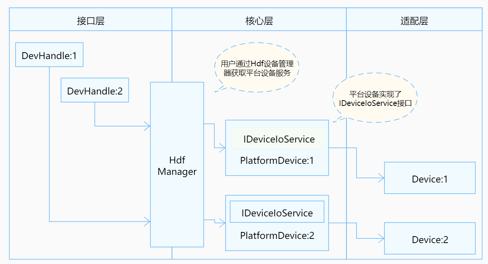

# MMC<a name="ZH-CN_TOPIC_0000001222282171"></a>

-   [概述](#section1846388309162704)
-   [接口说明](#section752964871810)
-   [开发步骤](#section1617495117162704)
-   [开发实例](#section1220893490162704)

## 概述<a name="section1846388309162704"></a>

MMC（MultiMedia Card），即多媒体卡，在HDF框架中，MMC的接口适配模式采用独立服务模式，在这种模式下，每一个设备对象会独立发布一个设备服务来处理外部访问，设备管理器收到API的访问请求之后，通过提取该请求的参数，达到调用实际设备对象的相应内部方法的目的。独立服务模式可以直接借助HDFDeviceManager的服务管理能力，但需要为每个设备单独配置设备节点，增加内存占用。

**图 1**  MMC独立服务模式结构图<a name="fig19517114132810"></a>  


## 接口说明<a name="section752964871810"></a>

MmcCntlrOps定义：

```
struct MmcCntlrOps {
  int32_t (*request)(struct MmcCntlr *cntlr, struct MmcCmd *cmd);
  int32_t (*setClock)(struct MmcCntlr *cntlr, uint32_t clock);
  int32_t (*setPowerMode)(struct MmcCntlr *cntlr, enum MmcPowerMode mode);
  int32_t (*setBusWidth)(struct MmcCntlr *cntlr, enum MmcBusWidth width);
  int32_t (*setBusTiming)(struct MmcCntlr *cntlr, enum MmcBusTiming timing);
  int32_t (*setSdioIrq)(struct MmcCntlr *cntlr, bool enable);
  int32_t (*hardwareReset)(struct MmcCntlr *cntlr);
  int32_t (*systemInit)(struct MmcCntlr *cntlr);
  int32_t (*setEnhanceSrobe)(struct MmcCntlr *cntlr, bool enable);
  int32_t (*switchVoltage)(struct MmcCntlr *cntlr, enum MmcVolt volt);
  bool (*devReadOnly)(struct MmcCntlr *cntlr);
  bool (*devPluged)(struct MmcCntlr *cntlr);
  bool (*devBusy)(struct MmcCntlr *cntlr);
  int32_t  (*tune)(struct MmcCntlr *cntlr, uint32_t cmdCode);
  int32_t (*rescanSdioDev)(struct MmcCntlr *cntlr);
};
```

**表 1**  MmcCntlrOps结构体成员的回调函数功能说明

<a name="table99129433019"></a>
<table><thead align="left"><tr id="row1891214163012"><th class="cellrowborder" valign="top" width="25%" id="mcps1.2.5.1.1"><p id="p79129483017"><a name="p79129483017"></a><a name="p79129483017"></a>成员函数</p>
</th>
<th class="cellrowborder" valign="top" width="25%" id="mcps1.2.5.1.2"><p id="p1591213403019"><a name="p1591213403019"></a><a name="p1591213403019"></a>入参</p>
</th>
<th class="cellrowborder" valign="top" width="25%" id="mcps1.2.5.1.3"><p id="p491312483012"><a name="p491312483012"></a><a name="p491312483012"></a>返回值</p>
</th>
<th class="cellrowborder" valign="top" width="25%" id="mcps1.2.5.1.4"><p id="p8913144203017"><a name="p8913144203017"></a><a name="p8913144203017"></a>功能</p>
</th>
</tr>
</thead>
<tbody><tr id="row4913844307"><td class="cellrowborder" valign="top" width="25%" headers="mcps1.2.5.1.1 "><p id="p17913149309"><a name="p17913149309"></a><a name="p17913149309"></a>doRequest</p>
</td>
<td class="cellrowborder" valign="top" width="25%" headers="mcps1.2.5.1.2 "><p id="p159131449308"><a name="p159131449308"></a><a name="p159131449308"></a>cntlr: 核心层结构体指针；mmc控制器 ;cmd: 结构体指针,传入命令值</p>
</td>
<td class="cellrowborder" valign="top" width="25%" headers="mcps1.2.5.1.3 "><p id="p1291519413308"><a name="p1291519413308"></a><a name="p1291519413308"></a>HDF_STATUS相关状态</p>
</td>
<td class="cellrowborder" valign="top" width="25%" headers="mcps1.2.5.1.4 "><p id="p3915048309"><a name="p3915048309"></a><a name="p3915048309"></a>request相应处理</p>
</td>
</tr>
<tr id="row17915124113014"><td class="cellrowborder" valign="top" width="25%" headers="mcps1.2.5.1.1 "><p id="p69152416307"><a name="p69152416307"></a><a name="p69152416307"></a>setClock</p>
</td>
<td class="cellrowborder" valign="top" width="25%" headers="mcps1.2.5.1.2 "><p id="p119153413013"><a name="p119153413013"></a><a name="p119153413013"></a>cntlr: 核心层结构体指针；mmc控制器 ;clock: 时钟传入值</p>
</td>
<td class="cellrowborder" valign="top" width="25%" headers="mcps1.2.5.1.3 "><p id="p79153417302"><a name="p79153417302"></a><a name="p79153417302"></a>HDF_STATUS相关状态</p>
</td>
<td class="cellrowborder" valign="top" width="25%" headers="mcps1.2.5.1.4 "><p id="p1291614183010"><a name="p1291614183010"></a><a name="p1291614183010"></a>设置时钟频率</p>
</td>
</tr>
<tr id="row19168433011"><td class="cellrowborder" valign="top" width="25%" headers="mcps1.2.5.1.1 "><p id="p1391614416305"><a name="p1391614416305"></a><a name="p1391614416305"></a>setPowerMode</p>
</td>
<td class="cellrowborder" valign="top" width="25%" headers="mcps1.2.5.1.2 "><p id="p99161341305"><a name="p99161341305"></a><a name="p99161341305"></a>cntlr: 核心层结构体指针；mmc控制器 ;mode: 枚举值（见MmcPowerMode定义）,功耗模式</p>
</td>
<td class="cellrowborder" valign="top" width="25%" headers="mcps1.2.5.1.3 "><p id="p1091674183020"><a name="p1091674183020"></a><a name="p1091674183020"></a>HDF_STATUS相关状态</p>
</td>
<td class="cellrowborder" valign="top" width="25%" headers="mcps1.2.5.1.4 "><p id="p1191617420307"><a name="p1191617420307"></a><a name="p1191617420307"></a>设置功耗模式</p>
</td>
</tr>
<tr id="row291620463018"><td class="cellrowborder" valign="top" width="25%" headers="mcps1.2.5.1.1 "><p id="p291612453018"><a name="p291612453018"></a><a name="p291612453018"></a>setBusWidth</p>
</td>
<td class="cellrowborder" valign="top" width="25%" headers="mcps1.2.5.1.2 "><p id="p11916245309"><a name="p11916245309"></a><a name="p11916245309"></a>cntlr: 核心层结构体指针；mmc控制器 ;width: 枚举值（见MmcBusWidth定义）,总线带宽</p>
</td>
<td class="cellrowborder" valign="top" width="25%" headers="mcps1.2.5.1.3 "><p id="p1491610415305"><a name="p1491610415305"></a><a name="p1491610415305"></a>HDF_STATUS相关状态</p>
</td>
<td class="cellrowborder" valign="top" width="25%" headers="mcps1.2.5.1.4 "><p id="p19916147304"><a name="p19916147304"></a><a name="p19916147304"></a>设置总线带宽</p>
</td>
</tr>
<tr id="row1916742301"><td class="cellrowborder" valign="top" width="25%" headers="mcps1.2.5.1.1 "><p id="p3916104143014"><a name="p3916104143014"></a><a name="p3916104143014"></a>setBusTiming</p>
</td>
<td class="cellrowborder" valign="top" width="25%" headers="mcps1.2.5.1.2 "><p id="p591710419302"><a name="p591710419302"></a><a name="p591710419302"></a>cntlr: 核心层结构体指针；mmc控制器 ;timing: 枚举值（见MmcBusTiming定义）,总线时序</p>
</td>
<td class="cellrowborder" valign="top" width="25%" headers="mcps1.2.5.1.3 "><p id="p14917154123017"><a name="p14917154123017"></a><a name="p14917154123017"></a>HDF_STATUS相关状态</p>
</td>
<td class="cellrowborder" valign="top" width="25%" headers="mcps1.2.5.1.4 "><p id="p1991814443016"><a name="p1991814443016"></a><a name="p1991814443016"></a>设置总线时序</p>
</td>
</tr>
<tr id="row199186423012"><td class="cellrowborder" valign="top" width="25%" headers="mcps1.2.5.1.1 "><p id="p991810414305"><a name="p991810414305"></a><a name="p991810414305"></a>setSdioIrq</p>
</td>
<td class="cellrowborder" valign="top" width="25%" headers="mcps1.2.5.1.2 "><p id="p16918844305"><a name="p16918844305"></a><a name="p16918844305"></a>cntlr: 核心层结构体指针；mmc控制器 ;enable: 布尔值,控制中断</p>
</td>
<td class="cellrowborder" valign="top" width="25%" headers="mcps1.2.5.1.3 "><p id="p17918204193011"><a name="p17918204193011"></a><a name="p17918204193011"></a>HDF_STATUS相关状态</p>
</td>
<td class="cellrowborder" valign="top" width="25%" headers="mcps1.2.5.1.4 "><p id="p1191813416305"><a name="p1191813416305"></a><a name="p1191813416305"></a>使能/去使能SDIO中断</p>
</td>
</tr>
<tr id="row139181453012"><td class="cellrowborder" valign="top" width="25%" headers="mcps1.2.5.1.1 "><p id="p491874193011"><a name="p491874193011"></a><a name="p491874193011"></a>hardwareReset</p>
</td>
<td class="cellrowborder" valign="top" width="25%" headers="mcps1.2.5.1.2 "><p id="p12918114163011"><a name="p12918114163011"></a><a name="p12918114163011"></a>cntlr: 核心层结构体指针；mmc控制器 ;</p>
</td>
<td class="cellrowborder" valign="top" width="25%" headers="mcps1.2.5.1.3 "><p id="p4918244309"><a name="p4918244309"></a><a name="p4918244309"></a>HDF_STATUS相关状态</p>
</td>
<td class="cellrowborder" valign="top" width="25%" headers="mcps1.2.5.1.4 "><p id="p11919243306"><a name="p11919243306"></a><a name="p11919243306"></a>复位硬件</p>
</td>
</tr>
<tr id="row169195410309"><td class="cellrowborder" valign="top" width="25%" headers="mcps1.2.5.1.1 "><p id="p89191746303"><a name="p89191746303"></a><a name="p89191746303"></a>systemInit</p>
</td>
<td class="cellrowborder" valign="top" width="25%" headers="mcps1.2.5.1.2 "><p id="p8919441302"><a name="p8919441302"></a><a name="p8919441302"></a>cntlr: 核心层结构体指针；mmc控制器 ;</p>
</td>
<td class="cellrowborder" valign="top" width="25%" headers="mcps1.2.5.1.3 "><p id="p199191941307"><a name="p199191941307"></a><a name="p199191941307"></a>HDF_STATUS相关状态</p>
</td>
<td class="cellrowborder" valign="top" width="25%" headers="mcps1.2.5.1.4 "><p id="p391919473014"><a name="p391919473014"></a><a name="p391919473014"></a>系统初始化</p>
</td>
</tr>
<tr id="row159191423012"><td class="cellrowborder" valign="top" width="25%" headers="mcps1.2.5.1.1 "><p id="p189194417307"><a name="p189194417307"></a><a name="p189194417307"></a>setEnhanceSrobe</p>
</td>
<td class="cellrowborder" valign="top" width="25%" headers="mcps1.2.5.1.2 "><p id="p1191910419304"><a name="p1191910419304"></a><a name="p1191910419304"></a>cntlr: 核心层结构体指针,mmc控制器 ;enable: 布尔值,设置功能</p>
</td>
<td class="cellrowborder" valign="top" width="25%" headers="mcps1.2.5.1.3 "><p id="p69194473011"><a name="p69194473011"></a><a name="p69194473011"></a>HDF_STATUS相关状态</p>
</td>
<td class="cellrowborder" valign="top" width="25%" headers="mcps1.2.5.1.4 "><p id="p091904143019"><a name="p091904143019"></a><a name="p091904143019"></a>设置增强选通</p>
</td>
</tr>
<tr id="row109197416305"><td class="cellrowborder" valign="top" width="25%" headers="mcps1.2.5.1.1 "><p id="p791917443010"><a name="p791917443010"></a><a name="p791917443010"></a>switchVoltage</p>
</td>
<td class="cellrowborder" valign="top" width="25%" headers="mcps1.2.5.1.2 "><p id="p1591912415304"><a name="p1591912415304"></a><a name="p1591912415304"></a>cntlr: 核心层结构体指针；mmc控制器 ;volt: 枚举值,电压值（3.3,1.8,1.2V）;</p>
</td>
<td class="cellrowborder" valign="top" width="25%" headers="mcps1.2.5.1.3 "><p id="p59196416307"><a name="p59196416307"></a><a name="p59196416307"></a>HDF_STATUS相关状态</p>
</td>
<td class="cellrowborder" valign="top" width="25%" headers="mcps1.2.5.1.4 "><p id="p169207416301"><a name="p169207416301"></a><a name="p169207416301"></a>设置电压值</p>
</td>
</tr>
<tr id="row1992015417301"><td class="cellrowborder" valign="top" width="25%" headers="mcps1.2.5.1.1 "><p id="p1892014463010"><a name="p1892014463010"></a><a name="p1892014463010"></a>devReadOnly</p>
</td>
<td class="cellrowborder" valign="top" width="25%" headers="mcps1.2.5.1.2 "><p id="p1392011411309"><a name="p1392011411309"></a><a name="p1392011411309"></a>cntlr: 核心层结构体指针；mmc控制器 ;</p>
</td>
<td class="cellrowborder" valign="top" width="25%" headers="mcps1.2.5.1.3 "><p id="p89207418304"><a name="p89207418304"></a><a name="p89207418304"></a>布尔值</p>
</td>
<td class="cellrowborder" valign="top" width="25%" headers="mcps1.2.5.1.4 "><p id="p7920847301"><a name="p7920847301"></a><a name="p7920847301"></a>检验设备是否只读</p>
</td>
</tr>
<tr id="row1092019483018"><td class="cellrowborder" valign="top" width="25%" headers="mcps1.2.5.1.1 "><p id="p1092034103011"><a name="p1092034103011"></a><a name="p1092034103011"></a>cardPluged</p>
</td>
<td class="cellrowborder" valign="top" width="25%" headers="mcps1.2.5.1.2 "><p id="p2920144123010"><a name="p2920144123010"></a><a name="p2920144123010"></a>cntlr: 核心层结构体指针；mmc控制器 ;</p>
</td>
<td class="cellrowborder" valign="top" width="25%" headers="mcps1.2.5.1.3 "><p id="p2092014411305"><a name="p2092014411305"></a><a name="p2092014411305"></a>布尔值</p>
</td>
<td class="cellrowborder" valign="top" width="25%" headers="mcps1.2.5.1.4 "><p id="p1892094153017"><a name="p1892094153017"></a><a name="p1892094153017"></a>检验设备是否拔出</p>
</td>
</tr>
<tr id="row892018413013"><td class="cellrowborder" valign="top" width="25%" headers="mcps1.2.5.1.1 "><p id="p39201146309"><a name="p39201146309"></a><a name="p39201146309"></a>devBusy</p>
</td>
<td class="cellrowborder" valign="top" width="25%" headers="mcps1.2.5.1.2 "><p id="p9920124193013"><a name="p9920124193013"></a><a name="p9920124193013"></a>cntlr: 核心层结构体指针；mmc控制器 ;</p>
</td>
<td class="cellrowborder" valign="top" width="25%" headers="mcps1.2.5.1.3 "><p id="p1992112419305"><a name="p1992112419305"></a><a name="p1992112419305"></a>布尔值</p>
</td>
<td class="cellrowborder" valign="top" width="25%" headers="mcps1.2.5.1.4 "><p id="p69211417302"><a name="p69211417302"></a><a name="p69211417302"></a>检验设备是否忙碌</p>
</td>
</tr>
<tr id="row71064053613"><td class="cellrowborder" valign="top" width="25%" headers="mcps1.2.5.1.1 "><p id="p1511114015361"><a name="p1511114015361"></a><a name="p1511114015361"></a>tune</p>
</td>
<td class="cellrowborder" valign="top" width="25%" headers="mcps1.2.5.1.2 "><p id="p5116409364"><a name="p5116409364"></a><a name="p5116409364"></a>cntlr: 核心层结构体指针；mmc控制器 ;cmdCode: uint32_t,命令代码;</p>
</td>
<td class="cellrowborder" valign="top" width="25%" headers="mcps1.2.5.1.3 "><p id="p711440123610"><a name="p711440123610"></a><a name="p711440123610"></a>HDF_STATUS相关状态</p>
</td>
<td class="cellrowborder" valign="top" width="25%" headers="mcps1.2.5.1.4 "><p id="p1411184011368"><a name="p1411184011368"></a><a name="p1411184011368"></a>调谐</p>
</td>
</tr>
<tr id="row1559214410366"><td class="cellrowborder" valign="top" width="25%" headers="mcps1.2.5.1.1 "><p id="p1559364493618"><a name="p1559364493618"></a><a name="p1559364493618"></a>rescanSdioDev</p>
</td>
<td class="cellrowborder" valign="top" width="25%" headers="mcps1.2.5.1.2 "><p id="p165931944133618"><a name="p165931944133618"></a><a name="p165931944133618"></a>cntlr: 核心层结构体指针；mmc控制器 ;</p>
</td>
<td class="cellrowborder" valign="top" width="25%" headers="mcps1.2.5.1.3 "><p id="p15593184493610"><a name="p15593184493610"></a><a name="p15593184493610"></a>HDF_STATUS相关状态</p>
</td>
<td class="cellrowborder" valign="top" width="25%" headers="mcps1.2.5.1.4 "><p id="p359384473615"><a name="p359384473615"></a><a name="p359384473615"></a>扫描并添加SDIO设备</p>
</td>
</tr>
</tbody>
</table>

## 开发步骤<a name="section1617495117162704"></a>

MMC模块适配的三个环节是配置属性文件，实例化驱动入口，以及实例化核心层接口函数。

1.  **实例化驱动入口：**
    -   实例化HdfDriverEntry结构体成员。
    -   调用HDF\_INIT将HdfDriverEntry实例化对象注册到HDF框架中。

2.  **配置属性文件：**
    -   在device\_info.hcs文件中添加deviceNode描述。
    -   【可选】添加mmc\_config.hcs器件属性文件。

3.  **实例化MMC控制器对象：**
    -   初始化MmcCntlr成员。
    -   实例化MmcCntlr成员MmcCntlrOps。

        > **说明：** 
        >实例化MmcCntlr成员MmcCntlrOps，其定义和成员说明见[接口说明](#section752964871810)。


4.  **驱动调试：**

    【可选】针对新增驱动程序，建议验证驱动基本功能，例如挂载后的信息反馈，设备启动是否成功等。


## 开发实例<a name="section1220893490162704"></a>

下方将以himci.c为示例，展示需要厂商提供哪些内容来完整实现设备功能。

1.  驱动开发首先需要实例化驱动入口，驱动入口必须为HdfDriverEntry（在 hdf\_device\_desc.h 中定义）类型的全局变量，且moduleName要和device\_info.hcs中保持一致。HDF框架会将所有加载的驱动的HdfDriverEntry对象首地址汇总，形成一个类似数组的段地址空间，方便上层调用。

    一般在加载驱动时HDF会先调用Bind函数，再调用Init函数加载该驱动。当Init调用异常时，HDF框架会调用Release释放驱动资源并退出。

    MMC驱动入口参考：

    ```
    struct HdfDriverEntry g_mmcDriverEntry = {
        .moduleVersion = 1,
        .Bind = HimciMmcBind,             //见Bind参考
        .Init = HimciMmcInit,             //见Init参考
        .Release = HimciMmcRelease,       //见Release参考
        .moduleName = "hi3516_mmc_driver",//【必要且与HCS文件中里面的moduleName匹配】
    };
    HDF_INIT(g_mmcDriverEntry);           //调用HDF_INIT将驱动入口注册到HDF框架中
    ```

2.  完成驱动入口注册之后，下一步请在device\_info.hcs文件中添加deviceNode信息，并在mmc\_config.hcs中配置器件属性。deviceNode信息与驱动入口注册相关，器件属性值与核心层MmcCntlr成员的默认值或限制范围有密切关系。

    如有多个器件信息，则需要在device\_info文件增加deviceNode信息，以及在mmc\_config文件中增加对应的器件属性**。**

    -   device\_info.hcs 配置参考。

        ```
        root {
          device_info {
            match_attr = "hdf_manager";
            platform :: host {
              hostName = "platform_host";
              priority = 50;
              device_mmc:: device {
                device0 :: deviceNode {
                  policy = 2;
                  priority = 10;
                  permission = 0644;
                  moduleName = "hi3516_mmc_driver";   //【必要】用于指定驱动名称，需要与驱动Entry中的moduleName一致；
                  serviceName = "HDF_PLATFORM_MMC_0"; //【必要】驱动对外发布服务的名称，必须唯一
                  deviceMatchAttr = "hi3516_mmc_emmc";//【必要】用于配置控制器私有数据，要与 mmc_config.hcs 中对应控制器保持一致
                }
                device1 :: deviceNode {
                  policy = 1;
                  priority = 20;
                  permission = 0644;
                  moduleName = "hi3516_mmc_driver";
                  serviceName = "HDF_PLATFORM_MMC_1";
                  deviceMatchAttr = "hi3516_mmc_sd"; //SD类型
                }
                device2 :: deviceNode {
                  policy = 1;
                  priority = 30;
                  permission = 0644;
                  moduleName = "hi3516_mmc_driver";
                  serviceName = "HDF_PLATFORM_MMC_2";
                  deviceMatchAttr = "hi3516_mmc_sdio";//SDIO类型
                }
              }
            }
          }
        }
        ```

    -   mmc\_config.hcs 配置参考。

        ```
        root {
          platform {
            mmc_config {
              template mmc_controller {//模板公共参数，继承该模板的节点如果使用模板中的默认值，则节点字段可以缺省
                match_attr = "";
                voltDef = 0;            // 3.3V
                freqMin = 50000;        //【必要】最小频率值
                freqMax = 100000000;    //【必要】最大频率值
                freqDef = 400000;       //【必要】默认频率值
                maxBlkNum = 2048;       //【必要】最大的block号
                maxBlkSize = 512;       //【必要】最大的block个数
                ocrDef = 0x300000;      //【必要】工作电压设置相关
                caps2 = 0;              //【必要】属性寄存器相关,见mmc_caps.h 中 MmcCaps2 定义
                regSize = 0x118;        //【必要】寄存器位宽
                hostId = 0;             //【必要】主机号
                regBasePhy = 0x10020000;//【必要】寄存器物理基地址
                irqNum = 63;            //【必要】中断号
                devType = 2;            //【必要】模式选择：emmc, SD, SDIO ,COMBO
                caps = 0x0001e045;      //【必要】属性寄存器相关,见mmc_caps.h 中 MmcCaps 定义
              }
              controller_0x10100000 :: mmc_controller {
                match_attr = "hi3516_mmc_emmc";//【必要】需要和device_info.hcs中的deviceMatchAttr值一致
                hostId = 0;
                regBasePhy = 0x10100000;
                irqNum = 96;
                devType = 0;            // emmc类型
                caps = 0xd001e045;
                caps2 = 0x60;
              }
              controller_0x100f0000 :: mmc_controller {
                match_attr = "hi3516_mmc_sd";
                hostId = 1;
                regBasePhy = 0x100f0000;
                irqNum = 62;
                devType = 1;            // sd类型
                caps = 0xd001e005;
              }
              controller_0x10020000 :: mmc_controller {
                match_attr = "hi3516_mmc_sdio";
                hostId = 2;
                regBasePhy = 0x10020000;
                irqNum = 63;
                devType = 2;            // sdio类型
                caps = 0x0001e04d;
              }
            }
          }
        }
        ```

3.  完成驱动入口注册之后，最后一步就是以核心层MmcCntlr对象的初始化为核心，包括厂商自定义结构体（传递参数和数据），实例化MmcCntlr成员MmcCntlrOps（让用户可以通过接口来调用驱动底层函数），实现HdfDriverEntry成员函数（Bind，Init，Release）。
    -   自定义结构体参考。

        从驱动的角度看，自定义结构体是参数和数据的载体，而且mmc\_config.hcs文件中的数值会被HDF读入通过DeviceResourceIface来初始化结构体成员 ，一些重要数值也会传递给核心层对象。

        ```
        struct HimciHost {
            struct MmcCntlr *mmc;//【必要】核心层结构体
            struct MmcCmd *cmd;  //【必要】核心层结构体，传递命令的，相关命令见枚举量 MmcCmdCode
            //【可选】根据厂商驱动需要添加
            void *base;
            enum HimciPowerStatus powerStatus;
            uint8_t *alignedBuff;
            uint32_t buffLen;
            struct scatterlist dmaSg;
            struct scatterlist *sg;
            uint32_t dmaSgNum;
            DMA_ADDR_T dmaPaddr;
            uint32_t *dmaVaddr;
            uint32_t irqNum;
            bool isTuning;
            uint32_t id;
            struct OsalMutex mutex;
            bool waitForEvent;
            HIMCI_EVENT himciEvent;
        };
        //MmcCntlr是核心层控制器结构体，其中的成员在bind函数中会被赋值
        struct MmcCntlr {
            struct IDeviceIoService service;
            struct HdfDeviceObject *hdfDevObj;
            struct PlatformDevice device;
            struct OsalMutex mutex;
            struct OsalSem released;
            uint32_t devType;
            struct MmcDevice *curDev;
            struct MmcCntlrOps *ops;
            struct PlatformQueue *msgQueue;
            uint16_t index;
            uint16_t voltDef;
            uint32_t vddBit;
            uint32_t freqMin;
            uint32_t freqMax;
            uint32_t freqDef;
            union MmcOcr ocrDef;
            union MmcCaps caps;
            union MmcCaps2 caps2;
            uint32_t maxBlkNum;
            uint32_t maxBlkSize;
            uint32_t maxReqSize;
            bool devPluged;
            bool detecting;
            void *priv;
        };
        ```

    -   MmcCntlr成员回调函数结构体MmcCntlrOps的实例化，其他成员在Bind函数中初始化。

        ```
        static struct MmcCntlrOps g_himciHostOps = {
            .request        = HimciDoRequest,
            .setClock       = HimciSetClock,
            .setPowerMode   = HimciSetPowerMode,
            .setBusWidth    = HimciSetBusWidth,
            .setBusTiming   = HimciSetBusTiming,
            .setSdioIrq     = HimciSetSdioIrq,
            .hardwareReset  = HimciHardwareReset,
            .systemInit     = HimciSystemInit,
            .setEnhanceSrobe= HimciSetEnhanceSrobe,
            .switchVoltage  = HimciSwitchVoltage,
            .devReadOnly    = HimciDevReadOnly,
            .devPluged      = HimciCardPluged,
            .devBusy        = HimciDevBusy,
            .tune           = HimciTune,
            .rescanSdioDev  = HimciRescanSdioDev,
        };
        ```

    -   Bind函数参考

        入参**：**

        HdfDeviceObject 是整个驱动对外暴露的接口参数，具备 HCS 配置文件的信息。

        返回值：

        HDF\_STATUS相关状态 （下表为部分展示，如需使用其他状态，可见//drivers/framework/include/utils/hdf\_base.h中HDF\_STATUS 定义）。

        <a name="table1428218958162704"></a>
        <table><thead align="left"><tr id="row1723943104162704"><th class="cellrowborder" valign="top" width="50%" id="mcps1.1.3.1.1"><p id="entry136979408162704p0"><a name="entry136979408162704p0"></a><a name="entry136979408162704p0"></a>状态(值)</p>
        </th>
        <th class="cellrowborder" valign="top" width="50%" id="mcps1.1.3.1.2"><p id="entry1590766658162704p0"><a name="entry1590766658162704p0"></a><a name="entry1590766658162704p0"></a>问题描述</p>
        </th>
        </tr>
        </thead>
        <tbody><tr id="row408410040162704"><td class="cellrowborder" valign="top" width="50%" headers="mcps1.1.3.1.1 "><p id="entry1337150412162704p0"><a name="entry1337150412162704p0"></a><a name="entry1337150412162704p0"></a>HDF_ERR_INVALID_OBJECT</p>
        </td>
        <td class="cellrowborder" valign="top" width="50%" headers="mcps1.1.3.1.2 "><p id="entry2061632106162704p0"><a name="entry2061632106162704p0"></a><a name="entry2061632106162704p0"></a>控制器对象非法</p>
        </td>
        </tr>
        <tr id="row160841211162704"><td class="cellrowborder" valign="top" width="50%" headers="mcps1.1.3.1.1 "><p id="entry1173668571162704p0"><a name="entry1173668571162704p0"></a><a name="entry1173668571162704p0"></a>HDF_ERR_MALLOC_FAIL</p>
        </td>
        <td class="cellrowborder" valign="top" width="50%" headers="mcps1.1.3.1.2 "><p id="entry74350097162704p0"><a name="entry74350097162704p0"></a><a name="entry74350097162704p0"></a>内存分配失败</p>
        </td>
        </tr>
        <tr id="row1596857798162704"><td class="cellrowborder" valign="top" width="50%" headers="mcps1.1.3.1.1 "><p id="entry190784255162704p0"><a name="entry190784255162704p0"></a><a name="entry190784255162704p0"></a>HDF_ERR_INVALID_PARAM</p>
        </td>
        <td class="cellrowborder" valign="top" width="50%" headers="mcps1.1.3.1.2 "><p id="entry1070501269162704p0"><a name="entry1070501269162704p0"></a><a name="entry1070501269162704p0"></a>参数非法</p>
        </td>
        </tr>
        <tr id="row1645995958162704"><td class="cellrowborder" valign="top" width="50%" headers="mcps1.1.3.1.1 "><p id="entry741922133162704p0"><a name="entry741922133162704p0"></a><a name="entry741922133162704p0"></a>HDF_ERR_IO</p>
        </td>
        <td class="cellrowborder" valign="top" width="50%" headers="mcps1.1.3.1.2 "><p id="entry2094504256162704p0"><a name="entry2094504256162704p0"></a><a name="entry2094504256162704p0"></a>I/O 错误</p>
        </td>
        </tr>
        <tr id="row733220922162704"><td class="cellrowborder" valign="top" width="50%" headers="mcps1.1.3.1.1 "><p id="entry1177794681162704p0"><a name="entry1177794681162704p0"></a><a name="entry1177794681162704p0"></a>HDF_SUCCESS</p>
        </td>
        <td class="cellrowborder" valign="top" width="50%" headers="mcps1.1.3.1.2 "><p id="entry540896959162704p0"><a name="entry540896959162704p0"></a><a name="entry540896959162704p0"></a>初始化成功</p>
        </td>
        </tr>
        <tr id="row1890064939162704"><td class="cellrowborder" valign="top" width="50%" headers="mcps1.1.3.1.1 "><p id="entry118676812162704p0"><a name="entry118676812162704p0"></a><a name="entry118676812162704p0"></a>HDF_FAILURE</p>
        </td>
        <td class="cellrowborder" valign="top" width="50%" headers="mcps1.1.3.1.2 "><p id="entry2078272728162704p0"><a name="entry2078272728162704p0"></a><a name="entry2078272728162704p0"></a>初始化失败</p>
        </td>
        </tr>
        </tbody>
        </table>

        函数说明：

        MmcCntlr，HimciHost，HdfDeviceObject之间互相赋值，方便其他函数可以相互转化，初始化自定义结构体HimciHost对象，初始化MmcCntlr成员，调用核心层MmcCntlrAdd函数。

        ```
        static int32_t HimciMmcBind(struct HdfDeviceObject *obj)
        {
            struct MmcCntlr *cntlr = NULL;
            struct HimciHost *host = NULL;
            int32_t ret;
            cntlr = (struct MmcCntlr *)OsalMemCalloc(sizeof(struct MmcCntlr));
            host = (struct HimciHost *)OsalMemCalloc(sizeof(struct HimciHost));
            
            host->mmc = cntlr;               //【必要】使HimciHost与MmcCntlr可以相互转化的前提
            cntlr->priv = (void *)host;      //【必要】使HimciHost与MmcCntlr可以相互转化的前提
            cntlr->ops = &g_himciHostOps;    //【必要】MmcCntlrOps的实例化对象的挂载
            cntlr->hdfDevObj = obj;          //【必要】使HdfDeviceObject与MmcCntlr可以相互转化的前提
            obj->service = &cntlr->service;  //【必要】使HdfDeviceObject与MmcCntlr可以相互转化的前提
            ret = MmcCntlrParse(cntlr, obj); //【必要】 初始化 cntlr. 失败就 goto _ERR;
            ... 
            ret = HimciHostParse(host, obj); //【必要】 初始化 host对象的相关属性，失败就 goto _ERR;
            ...
            ret = HimciHostInit(host, cntlr);//厂商自定义的初始化，失败就 goto _ERR;
            ...
            ret = MmcCntlrAdd(cntlr);         //调用核心层函数 失败就 goto _ERR;
            ...
            (void)MmcCntlrAddDetectMsgToQueue(cntlr);//将卡检测消息添加到队列中。
            HDF_LOGD("HimciMmcBind: success.");
            return HDF_SUCCESS;
        _ERR:
            HimciDeleteHost(host);
            HDF_LOGD("HimciMmcBind: fail, err = %d.", ret);
            return ret;
        }
        ```

    -   Init函数参考

        入参：

        HdfDeviceObject是整个驱动对外暴露的接口参数，具备HCS配置文件的信息。

        返回值：

        HDF\_STATUS相关状态。

        函数说明：

        实现ProcMciInit。

        ```
        static int32_t HimciMmcInit(struct HdfDeviceObject *obj)
        {
            static bool procInit = false;
            (void)obj;
            if (procInit == false) {
                if (ProcMciInit() == HDF_SUCCESS) {
                    procInit = true;
                    HDF_LOGD("HimciMmcInit: proc init success.");
                }
            }
            HDF_LOGD("HimciMmcInit: success.");
            return HDF_SUCCESS;
        }
        ```

    -   Release函数参考

        入参：

        HdfDeviceObject 是整个驱动对外暴露的接口参数，具备 HCS 配置文件的信息。

        返回值：

        无。

        函数说明：

        释放内存和删除控制器等操作，该函数需要在驱动入口结构体中赋值给Release接口，当HDF框架调用Init函数初始化驱动失败时，可以调用 Release释放驱动资源。所有强制转换获取相应对象的操作**前提**是在Init函数中具备对应赋值的操作。

        ```
        static void HimciMmcRelease(struct HdfDeviceObject *obj)
        {
            struct MmcCntlr *cntlr = NULL;
            ...
            cntlr = (struct MmcCntlr *)obj->service;//这里有HdfDeviceObject到MmcCntlr的强制转化，通过service成员，赋值见Bind函数
            ...
            HimciDeleteHost((struct HimciHost *)cntlr->priv);//厂商自定义的内存释放函数,这里有MmcCntlr到HimciHost的强制转化
        }
        ```


