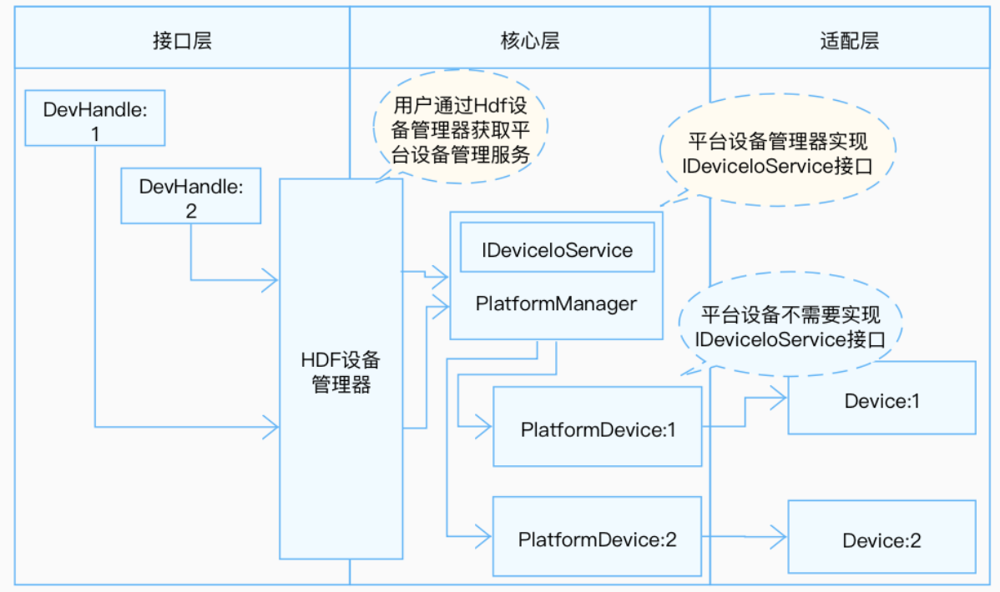
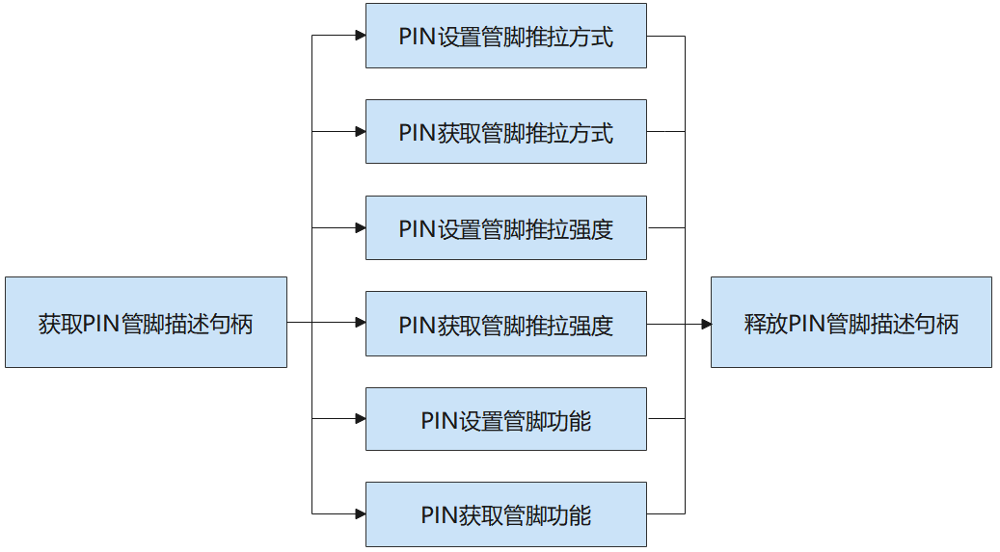

# PIN

## 概述<a name="section1"></a>

### 功能简介<a name="section2"></a>

PIN即管脚控制器，用于统一管理各SoC的管脚资源，对外提供管脚复用功能：包括管脚推拉方式、管脚推拉强度以及管脚功能。

PIN接口定义了操作PIN管脚的通用方法集合，包括：

- 获取/释放管脚描述句柄：传入管脚名与链表中每个控制器下管脚名进行匹配，匹配则会获取一个管脚描述句柄，操作完PIN管脚后释放该管脚描述句柄。

- 设置/获取管脚推拉方式：推拉方式可以是上拉、下拉以及悬空。

- 设置/获取管脚推拉强度：用户可根据实际设置管脚推拉强度大小。

- 设置/获取管脚功能：通过管脚功能名设置/获取管脚功能，实现管脚复用。

### 基本概念<a name="section3"></a>

PIN是一个软件层面的概念，目的是为了统一各SoC的PIN管脚管理，对外提供管脚复用功能，配置PIN管脚的电气特性。

- SoC（System on Chip）

    系统级芯片，也有称作片上系统，通常是面向特定用途将微处理器、模拟IP核、数字IP核和存储器集成在单一芯片的标准产品。

- 管脚复用

    由于芯片自身的引脚数量有限，无法满足日益增多的外接需求。此时可以通过软件层面的寄存器设置，让引脚工作在不同的状态，从而实现相同引脚完成不同功能的目的。

### 运作机制<a name="section4"></a>

在HDF框架中，同类型设备对象较多时（可能同时存在十几个同类型配置器），若采用独立服务模式，则需要配置更多的设备节点，且相关服务会占据更多的内存资源。相反，采用统一服务模式可以使用一个设备服务作为管理器，统一处理所有同类型对象的外部访问（这会在配置文件中有所体现），实现便捷管理和节约资源的目的。PIN模块接口适配模式采用统一服务模式。

在统一模式下，所有的控制器都被核心层统一管理，并由核心层统一发布一个服务供接口层，因此这种模式下驱动无需再为每个控制器发布服务。

PIN模块各分层作用：

- 接口层提供获取PIN管脚、设置PIN管脚推拉方式、获取PIN管脚推拉方式、设置PIN管脚推拉强度、获取PIN管脚推拉强度、设置PIN管脚功能、获取PIN管脚功能、释放PIN管脚的接口。

- 核心层主要提供PIN管脚资源匹配，PIN管脚控制器的添加、移除以及管理的能力，通过钩子函数与适配层交互。

- 适配层主要是将钩子函数的功能实例化，实现具体的功能。

**图 1**  PIN统一服务模式


### 约束与限制<a name="section5"></a>

PIN模块目前只支持小型系统LiteOS-A内核。

## 使用指导<a name="section6"></a>

### 场景介绍<a name="section7"></a>

PIN模块仅是一个软件层面的概念，主要工作是管脚资源管理。使用复用管脚时，通过设置管脚功能、设置管脚推拉方式、设置管脚推拉强度来适配指定场景的需求。

### 接口说明<a name="section8"></a>

PIN模块提供的主要接口如表1所示，具体API[详见](https://gitee.com/openharmony/drivers_hdf_core/blob/master/framework/include/platform/pin_if.h)。

**表 1**  PIN驱动API接口功能介绍
<a name="table1"></a>

| **接口名** | **描述** |
| ------------------------------------------------------------ | ---------------- |
| DevHandle PinGet(const char \*pinName) | 获取管脚描述句柄 |
| void PinPut(DevHandle handle) | 释放管脚描述句柄 |
| int32_t PinSetPull(DevHandle handle, enum PinPullType pullType) | 设置管脚推拉方式 |
| int32_t PinGetPull(DevHandle handle, enum PinPullType \*pullType) | 获取管脚推拉方式 |
| int32_t PinSetStrength(DevHandle handle, uint32_t strength) | 设置管脚推拉强度 |
| int32_t PinGetStrength(DevHandle handle, uint32_t \*strength) | 获取管脚推拉强度 |
| int32_t PinSetFunc(DevHandle handle, const char \*funcName) | 设置管脚功能 |
| int32_t PinGetFunc(DevHandle handle, const char \**funcName) | 获取管脚功能 |

> **说明：**<br>
>本文涉及PIN的所有接口，支持内核态及用户态使用。

### 开发步骤<a name="section9"></a>

使用PIN设备的一般流程如图2所示。

**图 2** PIN使用流程图<a name="fig2"></a>  
 

#### 获取PIN管脚描述句柄

在使用PIN进行管脚操作时，首先要调用PinGet获取管脚描述句柄，该函数会返回匹配传入管脚名的管脚描述句柄。

```c
DevHandle PinGet(const char *pinName);
```

**表 2**  PinGet参数和描述

<a name="table2"></a>

| 参数 | 描述 |
| ---------- | ----------------------- |
| pinName | 字符指针类型，管脚名 |
| **返回值** | **描述** |
| NULL | 获取PIN管脚描述句柄失败 |
| handle | PIN管脚描述句柄 |

假设PIN需要操作的管脚名为P18，获取其管脚描述句柄的示例如下：

```c
DevHandle handle = NULL;    // PIN管脚描述句柄

char pinName = "P18";       // PIN管脚名
handle = PinGet(pinName);
if (handle == NULL) {
    HDF_LOGE("PinGet: get handle failed!\n");
    return HDF_FAILURE;
}
```

#### PIN设置管脚推拉方式

PIN设置管脚推拉方式的函数如下所示：

```c
int32_t PinSetPull(DevHandle handle, enum PinPullType pullType);
```

**表 3**  参数和描述

<a name="table3"></a>

| 参数 | 描述 |
| ---------- | ----------------------- |
| handle | DevHandle类型，PIN管脚描述句柄 |
| pullType | 枚举类型，PIN管脚推拉方式 |
| **返回值** | **描述**          |
| HDF_SUCCESS | PIN设置管脚推拉方式成功 |
| 负数 | PIN设置管脚推拉方式失败 |

假设PIN要设置的管脚推拉方式为上拉，其实例如下：

```c
int32_t ret;
enum PinPullType pullTypeNum;

// PIN设置管脚推拉方式
pullTypeNum = 1;
ret = PinSetPull(handle, pullTypeNum);
if (ret != HDF_SUCCESS) {
    HDF_LOGE("PinSetPull: failed, ret %d\n", ret);
    return ret;
}
```

#### PIN获取管脚推拉方式

PIN获取管脚推拉方式的函数如下所示：

```c
int32_t PinGetPull(DevHandle handle, enum PinPullType *pullType);
```

**表 4**  PinGetPull参数和描述

<a name="table4"></a>

| 参数 | 描述 |
| ---------- | ------------------------- |
| handle | DevHandle类型，PIN管脚描述句柄 |
| pullType | 枚举类型指针，接收PIN管脚推拉方式 |
| **返回值** | **描述**            |
| HDF_SUCCESS | PIN获取管脚推拉方式成功 |
| 负数 | PIN获取管脚推拉方式失败 |

PIN获取管脚推拉方式的实例如下：

```c
int32_t ret;
enum PinPullType pullTypeNum;

// PIN获取管脚推拉方式
ret = PinGetPull(handle, &pullTypeNum);
if (ret != HDF_SUCCESS) {
    HDF_LOGE("PinGetPull: failed, ret %d\n", ret);
    return ret;
}
```

#### PIN设置管脚推拉强度

PIN设置管脚推拉强度函数如下所示：

```c
int32_t PinSetStrength(DevHandle handle, uint32_t strength);
```

**表 5**  PinSetStrength参数和描述

<a name="table5"></a>

| 参数 | 描述 |
| ---------- | ----------------------- |
| handle | DevHandle类型，管脚描述句柄 |
| strength | uint32_t类型，PIN管脚推拉强度 |
| **返回值** | **描述**          |
| HDF_SUCCESS | PIN设置管脚推拉强度成功 |
| 负数 | PIN设置管脚推拉强度失败 |

假设PIN要设置的管脚推拉强度为2，其实例如下：

```c
int32_t ret;
uint32_t strengthNum;
// PIN设置管脚推拉强度
strengthNum = 2;
ret = PinSetStrength(handle, strengthNum);
if (ret != HDF_SUCCESS) {
    HDF_LOGE("PinSetStrength: failed, ret %d\n", ret);
    return ret;
}
```

#### PIN获取管脚推拉强度

PIN设置管脚推拉强度后，可以通过PIN获取管脚推拉强度接口来查看PIN管脚推拉强度，PIN获取管脚推拉强度的函数如下所示：

```c
int32_t PinGetStrength(DevHandle handle, uint32_t *strength);
```

**表 6**  PinGetStrength参数和描述

<a name="table6"></a>

| 参数 | 描述 |
| ---------- | ------------------------- |
| handle | DevHandle类型，管脚描述句柄 |
| strength | uint32_t类型指针，接收PIN管脚推拉强度 
| **返回值** | **描述**            |
| HDF_SUCCESS | PIN获取管脚推拉强度成功 |
| 负数 | PIN获取管脚推拉强度失败 |

PIN获取管脚推拉强度的实例如下：

```c
int32_t ret;
uint32_t strengthNum;

// PIN获取管脚推拉强度
ret = PinGetStrength(handle, &strengthNum);
if (ret != HDF_SUCCESS) {
    HDF_LOGE("PinGetStrength: failed, ret %d\n", ret);
    return ret;
}
```

#### PIN设置管脚功能

管脚功能特指的是管脚复用的功能，每个管脚功能都不相同，管脚功能名详细可以参考//device/soc/hisilicon/hi3516dv300/sdk_liteos/hdf_config/pin/pin_config.hcs。

PIN设置管脚功能函数如下所示：

```c
int32_t PinSetFunc(DevHandle handle, const char *funcName);
```

**表 7**  PinSetFunc参数和描述

<a name="table7"></a>

| 参数 | 描述 |
| ---------- | ------------------- |
| handle | DevHandle类型，管脚描述句柄 |
| funcName | 字符指针类型，PIN管脚功能名 |
| **返回值** | **描述**      |
| HDF_SUCCESS | PIN设置管脚功能成功 |
| 负数 | PIN设置管脚功能失败 |

假设PIN需要设置的管脚功能为LSADC_CH1（ADC通道1），其实例如下：

```c
int32_t ret;
char funcName = "LSADC_CH1";

// PIN设置管脚功能
ret = PinSetFunc(handle, funcName);
if (ret != HDF_SUCCESS) {
    HDF_LOGE("PinSetFunc: failed, ret %d\n", ret);
    return ret;
}
```

#### PIN获取管脚功能

PIN设置管脚功能后，可以通过PIN获取管脚功能接口来查看PIN管脚功能，PIN获取管脚功能的函数如下所示：

```c
int32_t PinGetFunc(DevHandle handle, const char **funcName);
```

**表 8**  PinGetFunc参数和描述

<a name="table8"></a>

| 参数 | 描述 |
| ---------- | --------------------- |
| handle | DevHandle类型，管脚描述句柄 |
| funcName | 字符类型双指针，接收PIN管脚功能 |
| **返回值** | **描述**        |
| HDF_SUCCESS | PIN获取管脚功能成功 |
| 负数 | PIN获取管脚功能失败 |

PIN获取管脚功能的实例如下：

```c
int32_t ret;
char *funcName = NULL;

// PIN获取管脚功能
ret = PinGetFunc(handle, &funcName);
if (ret != HDF_SUCCESS) {
    HDF_LOGE("PinGetFunc: failed, ret %d\n", ret);
    return ret;
}
```

####  释放PIN管脚描述句柄

PIN不再进行任何操作后，需要释放PIN管脚描述管脚句柄，函数如下所示：

```c
void PinPut(DevHandle handle);
```

**表 9**  PinPut参数和描述

<a name="table9"></a>

| 参数 | 描述 |
| ---------- | -------------- |
| handle | DevHandle类型，管脚描述句柄 |
| **返回值** | **描述** |
| NA | 无返回值 |

PIN销毁管脚描述句柄实例如下：

```c
PinPut(handle);
```

## 使用实例<a name="section10"></a>

下面将基于Hi3516DV300开发板展示使用PIN设置管脚相关属性完整操作，步骤主要如下：

1. 传入要设置的管脚名，获取PIN管脚描述句柄。

2. 通过PIN管脚描述句柄以及推拉方式pullTypeNum设置管脚推拉方式，如果操作失败则释放PIN管脚描述句柄。

3. 通过PIN管脚描述句柄，并用pullTypeNum承接获取的管脚推拉方式，如果操作失败则释放PIN管脚描述句柄。

4. 通过PIN管脚描述句柄以及推拉强度strengthNum设置管脚推拉强度，如果操作失败则释放PIN管脚描述句柄。

5. 通过PIN管脚描述句柄，并用strengthNum承接获取的管脚推拉强度，如果操作失败则释放PIN管脚描述句柄。

5. 通过PIN管脚描述句柄以及管脚功能名funName设置管脚功能，如果操作失败则释放PIN管脚描述句柄。

6. 通过PIN管脚描述句柄，并用funName承接获取的管脚功能名，如果操作失败则释放PIN管脚描述句柄。

7. 使用完PIN后，不再对管脚进行操作，释放PIN管脚描述句柄。

```c
#include "hdf_log.h"                              // 标准日志打印头文件
#include "pin_if.h"                               // PIN标准接口头文件

int32_t PinTestSample(void)
{
    int32_t ret;
    uint32_t strengthNum;
    enum PinPullType pullTypeNum;
    char *pinName = NULL;
    const char *funcName = NULL;
    DevHandle handle = NULL;

    // PIN管脚名，要填写实际要设置的管脚名
    pinName = "P18"; 
    // PIN获取管脚描述句柄
    handle = PinGet(pinName);
    if (handle == NULL) {
        HDF_LOGE("PinTestSample: pin get fail!\n");
        return -1;
    }
    // PIN设置管脚推拉方式为上拉 
    pullTypeNum = 1;
    ret = PinSetPull(handle, pullTypeNum);
    if (ret != HDF_SUCCESS) {
        HDF_LOGE("PinTestSample: pin set pull fail, ret:%d\n", ret);
        goto ERR;
    }
    // PIN获取管脚推拉方式 
    ret = PinGetPull(handle, &pullTypeNum);
    if (ret != HDF_SUCCESS) {
        HDF_LOGE("PinTestSample: pin get pull fail, ret:%d\n", ret);
        goto ERR;
    }
    // PIN设置管脚推拉强度为2 
    strengthNum = 2;
    ret = PinSetStrength(handle, strengthNum);
    if (ret != HDF_SUCCESS) {
        HDF_LOGE("PinTestSample: pin set strength fail, ret:%d\n", ret);
        goto ERR;
    }
    // PIN获取管脚推拉强度 
    ret = PinGetStrength(handle, &strengthNum);
    if (ret != HDF_SUCCESS) {
        HDF_LOGE("PinTestSample: pin get strength fail, ret:%d\n", ret);
        goto ERR;
    }
    // PIN设置管脚功能为LSADC_CH1 
    funcName = "LSADC_CH1";
    ret = PinSetFunc(handle, funcName);
    if (ret != HDF_SUCCESS) {
        HDF_LOGE("PinTestSample: pin set func fail, ret:%d\n", ret);
        goto ERR;
    }
    // PIN获取管脚功能 
    ret = PinGetFunc(handle, &funcName);
    if (ret != HDF_SUCCESS) {
        HDF_LOGE("PinTestSample: pin get func fail, ret:%d\n", ret);
        goto ERR;
    }
    HDF_LOGD("PinTestSample: function tests end.", __func__);
ERR:
    // 释放PIN管脚描述句柄 
    PinPut(handle); 
    return ret;
}
```
