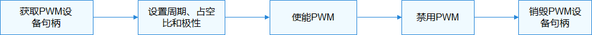

# PWM<a name="ZH-CN_TOPIC_0000001160812684"></a>

-   [概述](#section1043395117296)
-   [接口说明](#section3939192652418)
-   [使用指导](#section435718267334)
    -   [使用流程](#section113655616347)
    -   [获取PWM设备句柄](#section17816586359)
    -   [设置PWM周期](#section920214812397)
    -   [设置PWM占空比](#section519712820405)
    -   [设置PWM极性](#section12383334115)
    -   [使能PWM](#section382684811414)
    -   [禁用PWM](#section16545114404218)
    -   [获取PWM设备配置信息](#section117101243144311)
    -   [设置PWM设备配置信息](#section13834163604414)
    -   [释放PWM设备句柄](#section12987111511450)

-   [使用实例](#section138636719469)

## 概述<a name="section1043395117296"></a>

PWM是脉冲宽度调制（Pulse Width Modulation）的缩写，是一种对模拟信号电平进行数字编码并将其转换为脉冲的技术。常用于马达控制、背光亮度调节等。

PWM接口定义了操作PWM设备的通用方法集合，包括：

-   PWM设备句柄获取和释放。
-   PWM周期、占空比、极性的设置。
-   PWM使能和关闭。
-   PWM配置信息的获取和设置

## 接口说明<a name="section3939192652418"></a>

**表 1**  PWM驱动API接口功能介绍

<a name="table1731550155318"></a>
<table><thead align="left"><tr id="row4419501537"><th class="cellrowborder" align="left" valign="top" width="20.857914208579142%" id="mcps1.2.4.1.1"><p id="p641050105320"><a name="p641050105320"></a><a name="p641050105320"></a>功能分类</p>
</th>
<th class="cellrowborder" align="left" valign="top" width="23.36766323367663%" id="mcps1.2.4.1.2"><p id="p54150165315"><a name="p54150165315"></a><a name="p54150165315"></a>接口名</p>
</th>
<th class="cellrowborder" align="left" valign="top" width="55.77442255774422%" id="mcps1.2.4.1.3"><p id="p941150145313"><a name="p941150145313"></a><a name="p941150145313"></a>描述</p>
</th>
</tr>
</thead>
<tbody><tr id="row1651292212306"><td class="cellrowborder" rowspan="2" valign="top" width="20.857914208579142%" headers="mcps1.2.4.1.1 "><p id="p1387414255305"><a name="p1387414255305"></a><a name="p1387414255305"></a>PWM设备句柄获取和释放</p>
</td>
<td class="cellrowborder" valign="top" width="23.36766323367663%" headers="mcps1.2.4.1.2 "><p id="p8874825143014"><a name="p8874825143014"></a><a name="p8874825143014"></a>PwmOpen</p>
</td>
<td class="cellrowborder" valign="top" width="55.77442255774422%" headers="mcps1.2.4.1.3 "><p id="p1087432513307"><a name="p1087432513307"></a><a name="p1087432513307"></a>获取PWM设备句柄</p>
</td>
</tr>
<tr id="row1429083612305"><td class="cellrowborder" valign="top" headers="mcps1.2.4.1.1 "><p id="p1956614106311"><a name="p1956614106311"></a><a name="p1956614106311"></a>PwmClose</p>
</td>
<td class="cellrowborder" valign="top" headers="mcps1.2.4.1.2 "><p id="p829111362306"><a name="p829111362306"></a><a name="p829111362306"></a>释放PWM设备句柄</p>
</td>
</tr>
<tr id="row34145016535"><td class="cellrowborder" rowspan="3" valign="top" width="20.857914208579142%" headers="mcps1.2.4.1.1 "><p id="p229610227124"><a name="p229610227124"></a><a name="p229610227124"></a>PWM周期、占空比、极性的设置</p>
</td>
<td class="cellrowborder" valign="top" width="23.36766323367663%" headers="mcps1.2.4.1.2 "><p id="p19389143041518"><a name="p19389143041518"></a><a name="p19389143041518"></a>PwmSetPeriod</p>
</td>
<td class="cellrowborder" valign="top" width="55.77442255774422%" headers="mcps1.2.4.1.3 "><p id="p1360544321811"><a name="p1360544321811"></a><a name="p1360544321811"></a>设置PWM周期</p>
</td>
</tr>
<tr id="row5632152611414"><td class="cellrowborder" valign="top" headers="mcps1.2.4.1.1 "><p id="p1392810111722"><a name="p1392810111722"></a><a name="p1392810111722"></a>PwmSetDuty</p>
</td>
<td class="cellrowborder" valign="top" headers="mcps1.2.4.1.2 "><p id="p10448193611188"><a name="p10448193611188"></a><a name="p10448193611188"></a>设置PWM占空比</p>
</td>
</tr>
<tr id="row1766145611414"><td class="cellrowborder" valign="top" headers="mcps1.2.4.1.1 "><p id="p10445141911213"><a name="p10445141911213"></a><a name="p10445141911213"></a>PwmSetPolarity</p>
</td>
<td class="cellrowborder" valign="top" headers="mcps1.2.4.1.2 "><p id="p448643019188"><a name="p448643019188"></a><a name="p448643019188"></a>设置PWM极性</p>
</td>
</tr>
<tr id="row195531331436"><td class="cellrowborder" rowspan="2" valign="top" width="20.857914208579142%" headers="mcps1.2.4.1.1 "><p id="p166091535331"><a name="p166091535331"></a><a name="p166091535331"></a>PWM使能和关闭</p>
</td>
<td class="cellrowborder" valign="top" width="23.36766323367663%" headers="mcps1.2.4.1.2 "><p id="p85533315315"><a name="p85533315315"></a><a name="p85533315315"></a>PwmEnable</p>
</td>
<td class="cellrowborder" valign="top" width="55.77442255774422%" headers="mcps1.2.4.1.3 "><p id="p855303118314"><a name="p855303118314"></a><a name="p855303118314"></a>使能PWM</p>
</td>
</tr>
<tr id="row96141928233"><td class="cellrowborder" valign="top" headers="mcps1.2.4.1.1 "><p id="p66151828330"><a name="p66151828330"></a><a name="p66151828330"></a>PwmDisable</p>
</td>
<td class="cellrowborder" valign="top" headers="mcps1.2.4.1.2 "><p id="p261518281139"><a name="p261518281139"></a><a name="p261518281139"></a>禁用PWM</p>
</td>
</tr>
<tr id="row1020919129159"><td class="cellrowborder" rowspan="2" valign="top" width="20.857914208579142%" headers="mcps1.2.4.1.1 "><p id="p82092126154"><a name="p82092126154"></a><a name="p82092126154"></a>PWM配置信息的获取和设置</p>
<p id="p6794153701111"><a name="p6794153701111"></a><a name="p6794153701111"></a></p>
</td>
<td class="cellrowborder" valign="top" width="23.36766323367663%" headers="mcps1.2.4.1.2 "><p id="p1739013012154"><a name="p1739013012154"></a><a name="p1739013012154"></a>PwmSetConfig</p>
</td>
<td class="cellrowborder" valign="top" width="55.77442255774422%" headers="mcps1.2.4.1.3 "><p id="p1152912417189"><a name="p1152912417189"></a><a name="p1152912417189"></a>设置PWM设备配置信息</p>
</td>
</tr>
<tr id="row379443710118"><td class="cellrowborder" valign="top" headers="mcps1.2.4.1.1 "><p id="p4333154919111"><a name="p4333154919111"></a><a name="p4333154919111"></a>PwmGetConfig</p>
</td>
<td class="cellrowborder" valign="top" headers="mcps1.2.4.1.2 "><p id="p19575195601711"><a name="p19575195601711"></a><a name="p19575195601711"></a>获取PWM设备配置信息</p>
</td>
</tr>
</tbody>
</table>

> **说明：** 
>本文涉及的所有接口，仅限内核态使用，不支持在用户态使用。

## 使用指导<a name="section435718267334"></a>

### 使用流程<a name="section113655616347"></a>

使用PWM的一般流程如[图1](#fig23885455594)所示。

**图 1**  PWM使用流程图<a name="fig23885455594"></a>  




### 获取PWM设备句柄<a name="section17816586359"></a>

在操作PWM设备时，首先要调用PwmOpen获取PWM设备句柄，该函数会返回指定设备号的PWM设备句柄。

DevHandle PwmOpen\(uint32\_t num\);

**表 2**  PwmOpen参数和返回值描述

<a name="table7603619123820"></a>
<table><tbody><tr id="row1060351914386"><td class="cellrowborder" valign="top" width="50%"><p id="p14603181917382"><a name="p14603181917382"></a><a name="p14603181917382"></a><strong id="b743851872411"><a name="b743851872411"></a><a name="b743851872411"></a>参数</strong></p>
</td>
<td class="cellrowborder" valign="top" width="50%"><p id="p36031519183819"><a name="p36031519183819"></a><a name="p36031519183819"></a><strong id="b545016183242"><a name="b545016183242"></a><a name="b545016183242"></a>参数描述</strong></p>
</td>
</tr>
<tr id="row1960431983813"><td class="cellrowborder" valign="top" width="50%"><p id="p1114111239269"><a name="p1114111239269"></a><a name="p1114111239269"></a>num</p>
</td>
<td class="cellrowborder" valign="top" width="50%"><p id="p1560441923818"><a name="p1560441923818"></a><a name="p1560441923818"></a>PWM设备号</p>
</td>
</tr>
<tr id="row380484160"><td class="cellrowborder" valign="top" width="50%"><p id="p460381915385"><a name="p460381915385"></a><a name="p460381915385"></a><strong id="b209091422131617"><a name="b209091422131617"></a><a name="b209091422131617"></a>返回值</strong></p>
</td>
<td class="cellrowborder" valign="top" width="50%"><p id="p96031619153812"><a name="p96031619153812"></a><a name="p96031619153812"></a><strong id="b126401632121619"><a name="b126401632121619"></a><a name="b126401632121619"></a>返回值描述</strong></p>
</td>
</tr>
<tr id="row5793818161"><td class="cellrowborder" valign="top" width="50%"><p id="p1060418195389"><a name="p1060418195389"></a><a name="p1060418195389"></a>NULL</p>
</td>
<td class="cellrowborder" valign="top" width="50%"><p id="p760471912388"><a name="p760471912388"></a><a name="p760471912388"></a>获取PWM设备句柄失败</p>
</td>
</tr>
<tr id="row187914871618"><td class="cellrowborder" valign="top" width="50%"><p id="p5604719133811"><a name="p5604719133811"></a><a name="p5604719133811"></a>设备句柄</p>
</td>
<td class="cellrowborder" valign="top" width="50%"><p id="p3604181933818"><a name="p3604181933818"></a><a name="p3604181933818"></a>对应的PWM设备句柄</p>
</td>
</tr>
</tbody>
</table>

假设系统中的PWM设备号为0，获取该PWM设备句柄的示例如下：

```
uint32_t num = 0;             /* PWM设备号 */
DevHandle pwm = NULL; /* PWM设备句柄 /

/* 获取PWM设备句柄 */
pwm = PwmOpen(num);
if (pwm == NULL) {
    HDF_LOGE("PwmOpen: pwm%d failed", num);
    return;
}
```

### 设置PWM周期<a name="section920214812397"></a>

int32\_t PwmSetPeriod\(DevHandle handle, uint32\_t period\);

**表 3**  PwmSetPeriod参数和返回值描述

<a name="table16124612193214"></a>
<table><tbody><tr id="row4124212123217"><td class="cellrowborder" valign="top" width="50%"><p id="p11124131243218"><a name="p11124131243218"></a><a name="p11124131243218"></a><strong id="b6124201293218"><a name="b6124201293218"></a><a name="b6124201293218"></a>参数</strong></p>
</td>
<td class="cellrowborder" valign="top" width="50%"><p id="p14124191263210"><a name="p14124191263210"></a><a name="p14124191263210"></a><strong id="b1712481273218"><a name="b1712481273218"></a><a name="b1712481273218"></a>参数描述</strong></p>
</td>
</tr>
<tr id="row111241012133210"><td class="cellrowborder" valign="top" width="50%"><p id="p18124201220324"><a name="p18124201220324"></a><a name="p18124201220324"></a>handle</p>
</td>
<td class="cellrowborder" valign="top" width="50%"><p id="p20124191210321"><a name="p20124191210321"></a><a name="p20124191210321"></a>PWM设备句柄</p>
</td>
</tr>
<tr id="row151241112163216"><td class="cellrowborder" valign="top" width="50%"><p id="p712481223212"><a name="p712481223212"></a><a name="p712481223212"></a>period</p>
</td>
<td class="cellrowborder" valign="top" width="50%"><p id="p1312411126320"><a name="p1312411126320"></a><a name="p1312411126320"></a>周期，单位纳秒</p>
</td>
</tr>
<tr id="row712471214320"><td class="cellrowborder" valign="top" width="50%"><p id="p1612421233217"><a name="p1612421233217"></a><a name="p1612421233217"></a><strong id="b1512411293212"><a name="b1512411293212"></a><a name="b1512411293212"></a>返回值</strong></p>
</td>
<td class="cellrowborder" valign="top" width="50%"><p id="p1712591211327"><a name="p1712591211327"></a><a name="p1712591211327"></a><strong id="b121252012153217"><a name="b121252012153217"></a><a name="b121252012153217"></a>返回值描述</strong></p>
</td>
</tr>
<tr id="row812581214326"><td class="cellrowborder" valign="top" width="50%"><p id="p13125812183214"><a name="p13125812183214"></a><a name="p13125812183214"></a>0</p>
</td>
<td class="cellrowborder" valign="top" width="50%"><p id="p15125812193212"><a name="p15125812193212"></a><a name="p15125812193212"></a>设置周期成功</p>
</td>
</tr>
<tr id="row2012571273216"><td class="cellrowborder" valign="top" width="50%"><p id="p17125181215327"><a name="p17125181215327"></a><a name="p17125181215327"></a>负数</p>
</td>
<td class="cellrowborder" valign="top" width="50%"><p id="p81251512143217"><a name="p81251512143217"></a><a name="p81251512143217"></a>设置周期失败</p>
</td>
</tr>
</tbody>
</table>

```
int32_t ret;
uint32_t period = 1000;          /* 周期1000纳秒 */
ret = PwmSetPeriod(pwm, period); /* 设置PWM周期 */
if (ret != 0) {
    HDF_LOGE("PwmSetPeriod: failed, ret %d", ret);
}
```

### 设置PWM占空比<a name="section519712820405"></a>

int32\_t PwmSetDuty\(DevHandle handle, uint32\_t duty\);

**表 4**  PwmSetDuty参数和返回值描述

<a name="table2010731215368"></a>
<table><tbody><tr id="row51071812163614"><td class="cellrowborder" valign="top" width="50%"><p id="p21071412123617"><a name="p21071412123617"></a><a name="p21071412123617"></a><strong id="b1710731216361"><a name="b1710731216361"></a><a name="b1710731216361"></a>参数</strong></p>
</td>
<td class="cellrowborder" valign="top" width="50%"><p id="p910715125363"><a name="p910715125363"></a><a name="p910715125363"></a><strong id="b7107212113610"><a name="b7107212113610"></a><a name="b7107212113610"></a>参数描述</strong></p>
</td>
</tr>
<tr id="row5107912193611"><td class="cellrowborder" valign="top" width="50%"><p id="p15107141223618"><a name="p15107141223618"></a><a name="p15107141223618"></a>handle</p>
</td>
<td class="cellrowborder" valign="top" width="50%"><p id="p16107151293612"><a name="p16107151293612"></a><a name="p16107151293612"></a>PWM设备句柄</p>
</td>
</tr>
<tr id="row131077122364"><td class="cellrowborder" valign="top" width="50%"><p id="p4107161218361"><a name="p4107161218361"></a><a name="p4107161218361"></a>duty</p>
</td>
<td class="cellrowborder" valign="top" width="50%"><p id="p13107201263620"><a name="p13107201263620"></a><a name="p13107201263620"></a>占空比，单位纳秒</p>
</td>
</tr>
<tr id="row161071512143618"><td class="cellrowborder" valign="top" width="50%"><p id="p01071012123617"><a name="p01071012123617"></a><a name="p01071012123617"></a><strong id="b11076127365"><a name="b11076127365"></a><a name="b11076127365"></a>返回值</strong></p>
</td>
<td class="cellrowborder" valign="top" width="50%"><p id="p10107111273619"><a name="p10107111273619"></a><a name="p10107111273619"></a><strong id="b5108312123619"><a name="b5108312123619"></a><a name="b5108312123619"></a>返回值描述</strong></p>
</td>
</tr>
<tr id="row15108101217363"><td class="cellrowborder" valign="top" width="50%"><p id="p1110811263616"><a name="p1110811263616"></a><a name="p1110811263616"></a>0</p>
</td>
<td class="cellrowborder" valign="top" width="50%"><p id="p61081712203612"><a name="p61081712203612"></a><a name="p61081712203612"></a>设置占空比成功</p>
</td>
</tr>
<tr id="row171081012183618"><td class="cellrowborder" valign="top" width="50%"><p id="p610816120365"><a name="p610816120365"></a><a name="p610816120365"></a>负数</p>
</td>
<td class="cellrowborder" valign="top" width="50%"><p id="p10108012143617"><a name="p10108012143617"></a><a name="p10108012143617"></a>设置占空比失败</p>
</td>
</tr>
</tbody>
</table>

```
int32_t ret;
uint32_t duty = 500;        /* 占空比500纳秒 */
ret = PwmSetDuty(pwm, duty); /* 设置PWM占空比 */
if (ret != 0) {
    HDF_LOGE("PwmSetDuty: failed, ret %d", ret);
}
```

### 设置PWM极性<a name="section12383334115"></a>

int32\_t PwmSetPolarity\(DevHandle handle, uint8\_t polarity\);

**表 5**  PwmSetPolarity参数和返回值描述

<a name="table141853773813"></a>
<table><tbody><tr id="row6418837183810"><td class="cellrowborder" valign="top" width="50%"><p id="p14181637103817"><a name="p14181637103817"></a><a name="p14181637103817"></a><strong id="b4418537123810"><a name="b4418537123810"></a><a name="b4418537123810"></a>参数</strong></p>
</td>
<td class="cellrowborder" valign="top" width="50%"><p id="p74181375386"><a name="p74181375386"></a><a name="p74181375386"></a><strong id="b1541810373380"><a name="b1541810373380"></a><a name="b1541810373380"></a>参数描述</strong></p>
</td>
</tr>
<tr id="row84181437163812"><td class="cellrowborder" valign="top" width="50%"><p id="p1141823715384"><a name="p1141823715384"></a><a name="p1141823715384"></a>handle</p>
</td>
<td class="cellrowborder" valign="top" width="50%"><p id="p7418143718385"><a name="p7418143718385"></a><a name="p7418143718385"></a>PWM设备句柄</p>
</td>
</tr>
<tr id="row5418123711387"><td class="cellrowborder" valign="top" width="50%"><p id="p241893773817"><a name="p241893773817"></a><a name="p241893773817"></a>polarity</p>
</td>
<td class="cellrowborder" valign="top" width="50%"><p id="p184181937123811"><a name="p184181937123811"></a><a name="p184181937123811"></a>极性，PWM_NORMAL_POLARITY为正常极性，PWM_INVERTED_POLARITY为反转极性。</p>
</td>
</tr>
<tr id="row841883773819"><td class="cellrowborder" valign="top" width="50%"><p id="p11418193763820"><a name="p11418193763820"></a><a name="p11418193763820"></a><strong id="b3418123713810"><a name="b3418123713810"></a><a name="b3418123713810"></a>返回值</strong></p>
</td>
<td class="cellrowborder" valign="top" width="50%"><p id="p164185378387"><a name="p164185378387"></a><a name="p164185378387"></a><strong id="b341816371384"><a name="b341816371384"></a><a name="b341816371384"></a>返回值描述</strong></p>
</td>
</tr>
<tr id="row1741919372382"><td class="cellrowborder" valign="top" width="50%"><p id="p2419103718389"><a name="p2419103718389"></a><a name="p2419103718389"></a>0</p>
</td>
<td class="cellrowborder" valign="top" width="50%"><p id="p241993723818"><a name="p241993723818"></a><a name="p241993723818"></a>设置极性成功</p>
</td>
</tr>
<tr id="row1441983711384"><td class="cellrowborder" valign="top" width="50%"><p id="p1441903793817"><a name="p1441903793817"></a><a name="p1441903793817"></a>负数</p>
</td>
<td class="cellrowborder" valign="top" width="50%"><p id="p84191237193817"><a name="p84191237193817"></a><a name="p84191237193817"></a>设置极性失败</p>
</td>
</tr>
</tbody>
</table>

```
int32_t ret;
uint8_t polarity = PWM_INVERTED_POLARITY; /* 反转极性 */
ret = PwmSetPolarity(pwm, polarity);      /* 设置PWM反转极性 */
if (ret != 0) {
    HDF_LOGE("PwmSetPolarity: failed, ret %d", ret);
}
```

### 使能PWM<a name="section382684811414"></a>

int32\_t PwmEnable\(DevHandle handle\);

**表 6**  PwmEnable参数和返回值描述

<a name="table785385210447"></a>
<table><tbody><tr id="row9853185234417"><td class="cellrowborder" valign="top" width="50%"><p id="p7853195215444"><a name="p7853195215444"></a><a name="p7853195215444"></a><strong id="b685318525446"><a name="b685318525446"></a><a name="b685318525446"></a>参数</strong></p>
</td>
<td class="cellrowborder" valign="top" width="50%"><p id="p4853352104417"><a name="p4853352104417"></a><a name="p4853352104417"></a><strong id="b19853752174418"><a name="b19853752174418"></a><a name="b19853752174418"></a>参数描述</strong></p>
</td>
</tr>
<tr id="row6853165254419"><td class="cellrowborder" valign="top" width="50%"><p id="p085313525446"><a name="p085313525446"></a><a name="p085313525446"></a>handle</p>
</td>
<td class="cellrowborder" valign="top" width="50%"><p id="p185319529444"><a name="p185319529444"></a><a name="p185319529444"></a>PWM设备句柄</p>
</td>
</tr>
<tr id="row585313527443"><td class="cellrowborder" valign="top" width="50%"><p id="p15853652174416"><a name="p15853652174416"></a><a name="p15853652174416"></a><strong id="b17853252124418"><a name="b17853252124418"></a><a name="b17853252124418"></a>返回值</strong></p>
</td>
<td class="cellrowborder" valign="top" width="50%"><p id="p1385310525444"><a name="p1385310525444"></a><a name="p1385310525444"></a><strong id="b78541952104416"><a name="b78541952104416"></a><a name="b78541952104416"></a>返回值描述</strong></p>
</td>
</tr>
<tr id="row9854252134410"><td class="cellrowborder" valign="top" width="50%"><p id="p13854155214416"><a name="p13854155214416"></a><a name="p13854155214416"></a>0</p>
</td>
<td class="cellrowborder" valign="top" width="50%"><p id="p6854452114416"><a name="p6854452114416"></a><a name="p6854452114416"></a>使能PWM成功</p>
</td>
</tr>
<tr id="row58545526443"><td class="cellrowborder" valign="top" width="50%"><p id="p1085412522449"><a name="p1085412522449"></a><a name="p1085412522449"></a>负数</p>
</td>
<td class="cellrowborder" valign="top" width="50%"><p id="p2854052124416"><a name="p2854052124416"></a><a name="p2854052124416"></a>使能PWM失败</p>
</td>
</tr>
</tbody>
</table>

```
int32_t ret;
ret = PwmEnable(pwm); /* 使能PWM */
if (ret != 0) {
    HDF_LOGE("PwmEnable: failed, ret %d", ret);
}
```

### 禁用PWM<a name="section16545114404218"></a>

int32\_t PwmDisable\(DevHandle handle\);

**表 7**  PwmDisable参数和返回值描述

<a name="table1354973912475"></a>
<table><tbody><tr id="row115499392478"><td class="cellrowborder" valign="top" width="50%"><p id="p1554993912474"><a name="p1554993912474"></a><a name="p1554993912474"></a><strong id="b655018395479"><a name="b655018395479"></a><a name="b655018395479"></a>参数</strong></p>
</td>
<td class="cellrowborder" valign="top" width="50%"><p id="p055083915471"><a name="p055083915471"></a><a name="p055083915471"></a><strong id="b185507390472"><a name="b185507390472"></a><a name="b185507390472"></a>参数描述</strong></p>
</td>
</tr>
<tr id="row1855093974715"><td class="cellrowborder" valign="top" width="50%"><p id="p2550739114717"><a name="p2550739114717"></a><a name="p2550739114717"></a>handle</p>
</td>
<td class="cellrowborder" valign="top" width="50%"><p id="p1755018397479"><a name="p1755018397479"></a><a name="p1755018397479"></a>PWM设备句柄</p>
</td>
</tr>
<tr id="row355043910472"><td class="cellrowborder" valign="top" width="50%"><p id="p1655053984714"><a name="p1655053984714"></a><a name="p1655053984714"></a><strong id="b755043920479"><a name="b755043920479"></a><a name="b755043920479"></a>返回值</strong></p>
</td>
<td class="cellrowborder" valign="top" width="50%"><p id="p16550439154720"><a name="p16550439154720"></a><a name="p16550439154720"></a><strong id="b1055053918475"><a name="b1055053918475"></a><a name="b1055053918475"></a>返回值描述</strong></p>
</td>
</tr>
<tr id="row25507391479"><td class="cellrowborder" valign="top" width="50%"><p id="p1555014394473"><a name="p1555014394473"></a><a name="p1555014394473"></a>0</p>
</td>
<td class="cellrowborder" valign="top" width="50%"><p id="p15550839174713"><a name="p15550839174713"></a><a name="p15550839174713"></a>关闭PWM成功</p>
</td>
</tr>
<tr id="row1155093913470"><td class="cellrowborder" valign="top" width="50%"><p id="p1655015398476"><a name="p1655015398476"></a><a name="p1655015398476"></a>负数</p>
</td>
<td class="cellrowborder" valign="top" width="50%"><p id="p4550143919471"><a name="p4550143919471"></a><a name="p4550143919471"></a>关闭PWM失败</p>
</td>
</tr>
</tbody>
</table>

```
int32_t ret;
ret = PwmDisable(pwm); /* 禁用PWM */
if (ret != 0) {
    HDF_LOGE("PwmDisable: failed, ret %d", ret);
}
```

### 获取PWM设备配置信息<a name="section117101243144311"></a>

int32\_t PwmGetConfig\(DevHandle handle, struct PwmConfig \*config\);

**表 8**  PwmGetConfig参数和返回值描述

<a name="table14209152141313"></a>
<table><tbody><tr id="row1420918529133"><td class="cellrowborder" valign="top" width="50%"><p id="p42091852141314"><a name="p42091852141314"></a><a name="p42091852141314"></a><strong id="b2209135217139"><a name="b2209135217139"></a><a name="b2209135217139"></a>参数</strong></p>
</td>
<td class="cellrowborder" valign="top" width="50%"><p id="p202099523137"><a name="p202099523137"></a><a name="p202099523137"></a><strong id="b16209195201319"><a name="b16209195201319"></a><a name="b16209195201319"></a>参数描述</strong></p>
</td>
</tr>
<tr id="row142091352171310"><td class="cellrowborder" valign="top" width="50%"><p id="p1520915529131"><a name="p1520915529131"></a><a name="p1520915529131"></a>handle</p>
</td>
<td class="cellrowborder" valign="top" width="50%"><p id="p720995291310"><a name="p720995291310"></a><a name="p720995291310"></a>PWM设备句柄</p>
</td>
</tr>
<tr id="row6209152161314"><td class="cellrowborder" valign="top" width="50%"><p id="p720916522139"><a name="p720916522139"></a><a name="p720916522139"></a>config</p>
</td>
<td class="cellrowborder" valign="top" width="50%"><p id="p172091452131319"><a name="p172091452131319"></a><a name="p172091452131319"></a>PWM设备配置信息</p>
</td>
</tr>
<tr id="row12092522139"><td class="cellrowborder" valign="top" width="50%"><p id="p18209125211134"><a name="p18209125211134"></a><a name="p18209125211134"></a><strong id="b2209155219132"><a name="b2209155219132"></a><a name="b2209155219132"></a>返回值</strong></p>
</td>
<td class="cellrowborder" valign="top" width="50%"><p id="p420975231318"><a name="p420975231318"></a><a name="p420975231318"></a><strong id="b4209165210132"><a name="b4209165210132"></a><a name="b4209165210132"></a>返回值描述</strong></p>
</td>
</tr>
<tr id="row8209155251310"><td class="cellrowborder" valign="top" width="50%"><p id="p13210145291312"><a name="p13210145291312"></a><a name="p13210145291312"></a>0</p>
</td>
<td class="cellrowborder" valign="top" width="50%"><p id="p152101952141315"><a name="p152101952141315"></a><a name="p152101952141315"></a>获取配置成功</p>
</td>
</tr>
<tr id="row102101452121320"><td class="cellrowborder" valign="top" width="50%"><p id="p10210175219134"><a name="p10210175219134"></a><a name="p10210175219134"></a>负数</p>
</td>
<td class="cellrowborder" valign="top" width="50%"><p id="p72101252101312"><a name="p72101252101312"></a><a name="p72101252101312"></a>获取配置失败</p>
</td>
</tr>
</tbody>
</table>

```
int32_t ret;
struct PwmConfig config= {0};     /* PWM配置信息 */
ret = PwmGetConfig(pwm, &config); /* 获取PWM设备配置信息 */
if (ret != 0) {
    HDF_LOGE("PwmGetConfig: failed, ret %d", ret);
}
```

### 设置PWM设备配置信息<a name="section13834163604414"></a>

int32\_t PwmSetConfig\(DevHandle handle, struct PwmConfig \*config\);

**表 9**  PwmSetConfig参数和返回值描述

<a name="table1836117542321"></a>
<table><tbody><tr id="row20361165453211"><td class="cellrowborder" valign="top" width="50%"><p id="p1736135418323"><a name="p1736135418323"></a><a name="p1736135418323"></a><strong id="b236115412323"><a name="b236115412323"></a><a name="b236115412323"></a>参数</strong></p>
</td>
<td class="cellrowborder" valign="top" width="50%"><p id="p13361954103214"><a name="p13361954103214"></a><a name="p13361954103214"></a><strong id="b16361185433217"><a name="b16361185433217"></a><a name="b16361185433217"></a>参数描述</strong></p>
</td>
</tr>
<tr id="row336185416328"><td class="cellrowborder" valign="top" width="50%"><p id="p3361454153218"><a name="p3361454153218"></a><a name="p3361454153218"></a>handle</p>
</td>
<td class="cellrowborder" valign="top" width="50%"><p id="p836175418328"><a name="p836175418328"></a><a name="p836175418328"></a>PWM设备句柄</p>
</td>
</tr>
<tr id="row18361135411322"><td class="cellrowborder" valign="top" width="50%"><p id="p2036175403217"><a name="p2036175403217"></a><a name="p2036175403217"></a>config</p>
</td>
<td class="cellrowborder" valign="top" width="50%"><p id="p1736120541323"><a name="p1736120541323"></a><a name="p1736120541323"></a>PWM设备配置信息</p>
</td>
</tr>
<tr id="row2361254133217"><td class="cellrowborder" valign="top" width="50%"><p id="p1636295463212"><a name="p1636295463212"></a><a name="p1636295463212"></a><strong id="b13622054133219"><a name="b13622054133219"></a><a name="b13622054133219"></a>返回值</strong></p>
</td>
<td class="cellrowborder" valign="top" width="50%"><p id="p173621854153217"><a name="p173621854153217"></a><a name="p173621854153217"></a><strong id="b15362195410326"><a name="b15362195410326"></a><a name="b15362195410326"></a>返回值描述</strong></p>
</td>
</tr>
<tr id="row73628543328"><td class="cellrowborder" valign="top" width="50%"><p id="p15362205417325"><a name="p15362205417325"></a><a name="p15362205417325"></a>0</p>
</td>
<td class="cellrowborder" valign="top" width="50%"><p id="p436285433211"><a name="p436285433211"></a><a name="p436285433211"></a>设置配置成功</p>
</td>
</tr>
<tr id="row23621154153220"><td class="cellrowborder" valign="top" width="50%"><p id="p13362954113214"><a name="p13362954113214"></a><a name="p13362954113214"></a>负数</p>
</td>
<td class="cellrowborder" valign="top" width="50%"><p id="p83629546325"><a name="p83629546325"></a><a name="p83629546325"></a>设置配置失败</p>
</td>
</tr>
</tbody>
</table>

```
int32_t ret;
struct PwmConfig config= {0};          /* PWM配置信息 */
config.duty = 500;                     /* 占空比500纳秒 */
config.period = 1000;                  /* 周期1000纳秒 */
config.number = 0;                     /* 一直输出方波 */ 
config.polarity = PWM_NORMAL_POLARITY; /* 正常极性 */
ret = PwmSetConfig(pwm, &config);      /* 设置PWM设备配置信息 */
if (ret != 0) {
    HDF_LOGE("PwmSetConfig: failed, ret %d\n", ret);
}
```

### 释放PWM设备句柄<a name="section12987111511450"></a>

void PwmClose\(DevHandle handle\);

该函数会释放掉由PwmClose申请的资源。

**表 10**  PwmClose参数描述

<a name="table72517953115"></a>
<table><tbody><tr id="row1525793312"><td class="cellrowborder" valign="top" width="50%"><p id="p115402031153111"><a name="p115402031153111"></a><a name="p115402031153111"></a><strong id="b691142582513"><a name="b691142582513"></a><a name="b691142582513"></a>参数</strong></p>
</td>
<td class="cellrowborder" valign="top" width="50%"><p id="p65406313319"><a name="p65406313319"></a><a name="p65406313319"></a><strong id="b1892414252254"><a name="b1892414252254"></a><a name="b1892414252254"></a>参数描述</strong></p>
</td>
</tr>
<tr id="row1926109193116"><td class="cellrowborder" valign="top" width="50%"><p id="p105419317318"><a name="p105419317318"></a><a name="p105419317318"></a>handle</p>
</td>
<td class="cellrowborder" valign="top" width="50%"><p id="p16541153110317"><a name="p16541153110317"></a><a name="p16541153110317"></a>PWM设备句柄</p>
</td>
</tr>
</tbody>
</table>

```
PwmClose(pwm); /* 释放PWM设备句柄 */
```

## 使用实例<a name="section138636719469"></a>

PWM设备完整的使用示例如下所示，首先获取PWM设备句柄，然后设置PWM设备配置信息，使能PWM，最后释放PWM设备句柄。

```
#include "hdf_log.h"
#include "osal_time.h"
#include "pwm_if.h"

void PwmTestSample(void)
{
    int32_t ret;
    struct PwmConfig config;      /* PWM配置信息 */
    DevHandle pwm = NULL;         /* PWM设备句柄 */
  
    pwm = PwmOpen(0);             /* 获取PWM设备句柄 */
    if (pwm == NULL) {
        HDF_LOGE("PwmOpen: pwm0 failed");
        return;
    }
    /* 获取PWM设备配置信息 */
    ret = PwmGetConfig(pwm, &config);
    if (ret != 0) {
        HDF_LOGE("PwmGetConfig: failed, ret %d\n", ret);
        goto err;
    }
    config.duty = 500;            /* 占空比500纳秒 */
    config.period = 1000;         /* 周期1000纳秒 */
    /* 设置PWM设备配置信息 */
    ret = PwmSetConfig(pwm, &config);
    if (ret != 0) {
        HDF_LOGE("PwmSetConfig: failed, ret %d\n", ret);
        goto err;
    }
    /* 使能PWM */
    ret = PwmEnable(pwm);
    if (ret != 0) {
        HDF_LOGE("PwmEnable: failed, ret %d\n", ret);
        goto err;
    }
    /* 睡眠10秒 */
    OsalSleep(10);
    /* 禁用PWM */
    ret = PwmDisable(pwm);
    if (ret != 0) {
        HDF_LOGE("PwmDisable: failed, ret %d\n", ret);
        goto err;
    }
err:
    /* 释放PWM设备句柄 */
    PwmClose(pwm);
}
```

