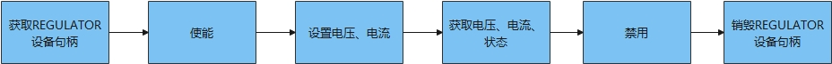

# Regulator

## 概述

### 功能简介

Regulator模块用于控制系统中某些设备的电压/电流供应。在嵌入式系统（尤其是手机）中，控制耗电量很重要，直接影响到电池的续航时间。所以，如果系统中某一个模块暂时不需要使用，就可以通过Regulator关闭其电源供应；或者降低提供给该模块的电压、电流大小。

Regulator接口定义了操作Regulator设备的通用方法集合，包括：

- Regulator设备句柄获取和销毁。

- Regulator设备电压、电流的设置。

- Regulator设备使能和关闭。

- Regulator设备电压、电流和状态的获取。


### 基本概念 

-  校准器 

    当输入电压和输出负载发生变化时可以通过软件调整，使其能够提供稳定的输出电压。 

- Consumer

    由Regulator供电的设备统称为Consumer， 其可分为静态和动态两类：

    * 静态：不需要改变电压电流，只需要开关电源，通常在bootloader、firmware、kernel board阶段被设置。

    * 动态：根据操作需求改变电压电流。

- PMIC（Power Management IC）

    电源管理芯片，内含多个电源甚至其他子系统。 

### 运作机制

在HDF框架中，Regulator模块接口适配模式采用统一服务模式（如图1所示），这需要一个设备服务来作为Regulator模块的管理器，统一处理外部访问，这会在配置文件中有所体现。统一服务模式适合于同类型设备对象较多的情况，如Regulator可能同时具备十几个控制器，采用独立服务模式需要配置更多的设备节点，且服务会占据内存资源。相反，采用统一服务模式可以使用一个设备服务作为管理器，统一处理所有同类型对象的外部访问，实现便捷管理和节约资源的目的。

Regulator模块各分层的作用为：

- 接口层：提供打开设备，操作Regulator，关闭设备的能力。

- 核心层：主要负责服务绑定、初始化以及释放管理器，并提供添加、删除以及获取Regulator设备的能力。

- 适配层：由驱动适配者实现与硬件相关的具体功能，如设备的初始化等。

**图 1** Regulator统一服务模式结构图<a name="fig1"></a>  


### 约束与限制

Regulator模块API当前仅支持内核态调用。

## 使用指导

### 场景介绍

Regulator主要用于：

1. 用于控制系统中某些设备的电压/电流供应。

2. 用于稳压电源的管理。

### 接口说明

Regulator模块提供的主要接口如表1所示，具体API详见//drivers/hdf_core/framework/include/platform/regulator_if.h。

**表 1**  Regulator设备API接口说明

| 接口名 | 接口描述 |
| --------------------- | ------------------------- |
| DevHandle RegulatorOpen(const char \*name) | 获取Regulator设备驱动句柄 |
| void RegulatorClose(DevHandle handle) | 销毁Regulator设备驱动句柄 |
| int32_t RegulatorEnable(DevHandle handle) | 使能Regulator |
| int32_t RegulatorDisable(DevHandle handle) | 禁用Regulator |
| int32_t RegulatorForceDisable(DevHandle handle) | 强制禁用Regulator |
| int32_t RegulatorSetVoltage(DevHandle handle, uint32_t minUv, uint32_t maxUv) | 设置Regulator输出电压 |
| int32_t RegulatorGetVoltage(DevHandle handle, uint32_t \*voltage) | 获取Regulator输出电压 |
| int32_t RegulatorSetCurrent(DevHandle handle, uint32_t minUa, uint32_t maxUa) | 设置Regulator输出电流 |
| int32_t RegulatorGetCurrent(DevHandle handle, uint32_t \*regCurrent) | 获取Regulator输出电流 |
| int32_t RegulatorGetStatus(DevHandle handle, uint32_t \*status) | 获取Regulator状态 |

### 开发步骤

使用Regulator设备的一般流程如图2所示。

**图 2** Regulator设备使用流程图  



#### 获取Regulator设备句柄

在操作Regulator设备时，首先要调用RegulatorOpen获取Regulator设备句柄，该函数会返回指定设备名称的Regulator设备句柄。

```c
DevHandle RegulatorOpen(const char *name);
```

**表 2** RegulatorOpen参数和返回值描述

| 参数 | 参数描述 |
| ---------- | ----------------------------- |
| name | 字符指针，Regulator设备名称 |
| **返回值** | **返回值描述** |
| handle | 获取成功返回Regulator设备句柄 |
| NULL | 获取失败 |

```c
// Regulator设备名称
const char *name = "regulator_virtual_1";
DevHandle handle = NULL;

// 获取Regulator设备句柄
handle = RegulatorOpen(name);
if (handle == NULL) {
    // 错误处理
    HDF_LOGE("RegulatorOpen: open regulator fail.\n");
    return HDF_FAILURE;
}
```

#### 销毁Regulator设备句柄

关闭Regulator设备，系统释放对应的资源。

```c
void RegulatorClose(DevHandle handle);
```

**表 3** RegulatorClose参数描述

| 参数 | 参数描述 |
| ------ | ----------------- |
| handle | DevHandle类型，Regulator设备句柄 |

```c
// 销毁Regulator设备句柄
RegulatorClose(handle);
```

#### 使能

启用Regulator设备。

```c
int32_t RegulatorEnable(DevHandle handle);
```

**表 4** RegulatorEnable参数描述

| 参数 | 参数描述 |
| ---------- | ----------------- |
| handle | DevHandle类型，Regulator设备句柄 |
| **返回值** | **返回值描述** |
| HDF_SUCCESS | 使能Regulator设备成功 |
| 负数 | 使能Regulator设备失败 |

```c
int32_t ret;

// 启用Regulator设备
ret = RegulatorEnable(handle);
if (ret != HDF_SUCCESS) {
	// 错误处理
    HDF_LOGE("RegulatorEnable: enable regulator fail, ret:%d\n", ret);
    return ret;
}
```

#### 禁用

禁用Regulator设备。如果Regulator设备状态为常开，或存在Regulator设备子节点未禁用，则禁用失败。

```c
int32_t RegulatorDisable(DevHandle handle);
```

**表 5** RegulatorDisable参数描述

| 参数 | 参数描述 |
| ---------- | ----------------- |
| handle | DevHandle类型，Regulator设备句柄 |
| **返回值** | **返回值描述** |
| HDF_SUCCESS | 禁用Regulator设备成功 |
| 负数 | 禁用Regulator设备失败 |

```c
int32_t ret;

// 禁用Regulator设备
ret = RegulatorDisable(handle);
if (ret != HDF_SUCCESS) {
	// 错误处理
    HDF_LOGE("RegulatorDisable: disable regulator fail, ret:%d\n", ret);
    return ret;
}
```

#### 强制禁用

强制禁用Regulator设备。无论Regulator设备的状态是常开还是子节点已使能，Regulator设备都会被禁用。

```c
int32_t RegulatorForceDisable(DevHandle handle);
```

**表 6** RegulatorForceDisable参数描述


| 参数 | 参数描述 |
| ---------- | ----------------- |
| handle | DevHandle类型，Regulator设备句柄 |
| **返回值** | **返回值描述** |
| HDF_SUCCESS | 强制禁用Regulator设备成功 |
| 负数 | 强制禁用Regulator设备失败 |

```c
int32_t ret;

// 强制禁用Regulator设备
ret = RegulatorForceDisable(handle);
if (ret != HDF_SUCCESS) {
	// 错误处理
    HDF_LOGE("RegulatorForceDisable: force disable regulator fail, ret:%d\n", ret);
    return ret;
}
```

#### 设置Regulator输出电压范围

```c
int32_t RegulatorSetVoltage(DevHandle handle, uint32_t minUv, uint32_t maxUv);
```

**表 7** RegulatorSetVoltage参数描述

| 参数 | 参数描述 |
| ---------- | ----------------- |
| handle | DevHandle类型，Regulator设备句柄 |
| minUv | uint32_t类型，最小电压 |
| maxUv | uint32_t类型，最大电压 |
| **返回值** | **返回值描述** |
| HDF_SUCCESS | 设置Regulator输出电压范围成功 |
| 负数 | 设置Regulator输出电压范围失败 |

```c
int32_t ret;
int32_t minUv = 0;        // 最小电压为0µV
int32_t maxUv = 20000;    // 最大电压为20000µV

// 设置Regulator电压输出电压范围
ret = RegulatorSetVoltage(handle, minUv, maxUv);
if (ret != HDF_SUCCESS) {
	// 错误处理
    HDF_LOGE("RegulatorSetVoltage: regulator set Voltage fail, ret:%d\n", ret);
    return ret;
}
```

#### 获取Regulator电压

```c
int32_t RegulatorGetVoltage(DevHandle handle, uint32_t *voltage);
```

**表 8** RegulatorGetVoltage参数描述


| 参数 | 参数描述 |
| ---------- | ----------------- |
| handle | DevHandle类型，Regulator设备句柄 |
| voltage | uint32_t类型指针，待获取的Regulator电压 |
| **返回值** | **返回值描述** |
| HDF_SUCCESS | 获取Regulator电压成功 |
| 负数 | 获取Regulator电压失败 |

```c
int32_t ret;
uint32_t voltage;

// 获取Regulator电压
ret = RegulatorGetVoltage(handle, &voltage);
if (ret != HDF_SUCCESS) {
	// 错误处理
    HDF_LOGE("RegulatorGetVoltage: regulator get Voltage fail, ret:%d\n", ret);
    return ret;
}
```

#### 设置Regulator输出电流范围

```c
int32_t RegulatorSetCurrent(DevHandle handle, uint32_t minUa, uint32_t maxUa);
```

**表 9** RegulatorSetCurrent参数描述

| 参数 | 参数描述 |
| ---------- | ----------------- |
| handle | DevHandle类型，Regulator设备句柄 |
| minUa | uint32_t类型，最小电流 |
| maxUa | uint32_t类型，最大电流 |
| **返回值** | **返回值描述** |
| HDF_SUCCESS | 设置Regulator输出电流范围成功 |
| 负数 | 设置Regulator输出电流范围失败 |

```c
int32_t ret;
int32_t minUa = 0;	    // 最小电流为0μA
int32_t maxUa = 200;    // 最大电流为200μA

// 设置Regulator输出电流范围
ret = RegulatorSetCurrent(handle, minUa, maxUa);
if (ret != HDF_SUCCESS) {
	// 错误处理
    HDF_LOGE("RegulatorSetCurrent: regulator set current fail, ret:%d\n", ret);
    return ret;
}
```

#### 获取Regulator电流

```c
int32_t RegulatorGetCurrent(DevHandle handle, uint32_t *regCurrent);
```

**表 10** RegulatorGetCurrent参数描述

| 参数 | 参数描述 |
| ----------- | ----------------- |
| handle | DevHandle类型，Regulator设备句柄 |
| regCurrent | uint32_t类型指针，待获取的Regulator电流 |
| **返回值** | **返回值描述** |
| HDF_SUCCESS | 获取成功 |
| 负数 | 获取失败 |

```c
int32_t ret;
uint32_t regCurrent;

// 获取Regulator电流
ret = RegulatorGetCurrent(handle, &regCurrent);
if (ret != HDF_SUCCESS) {
	// 错误处理
    HDF_LOGE("RegulatorGetCurrent: regulator get current fail, ret:%d\n", ret);
    return ret;
}
```

#### 获取Regulator状态

```c
int32_t RegulatorGetStatus(DevHandle handle, uint32_t *status);
```

**表 11** RegulatorGetStatus参数描述

| 参数 | 参数描述 |
| ---------- | ----------------- |
| handle | DevHandle类型，Regulator设备句柄 |
| status | uint32_t类型指针，待获取Regulator状态 |
| **返回值** | **返回值描述** |
| HDF_SUCCESS | 获取成功 |
| 负数 | 获取失败 |

```c
int32_t ret;
uint32_t status;

// 获取Regulator状态
ret = RegulatorGetStatus(handle, &status);
if (ret != HDF_SUCCESS) {
	// 错误处理
    HDF_LOGE("RegulatorGetStatus: regulator get status fail, ret:%d\n", ret);
    return ret;
}
```

## 使用实例

本例拟对Hi3516DV300开发板上Regulator设备进行简单的读取操作。

Regulator设备完整的使用示例如下所示，首先获取Regulator设备句柄，然后使能，设置电压，获取电压、状态，禁用，最后销毁Regulator设备句柄。

```c
void RegulatorTestSample(void)
{
    int32_t ret;
     
    /* Regulator设备名称 */
	const char *name = "regulator_virtual_1";
	DevHandle handle = NULL;

	/* 获取Regulator设备句柄 */
	handle = RegulatorOpen(name);
	if (handle  == NULL) {
    	HDF_LOGE("RegulatorOpen: failed!\n");
        return;
	}

	/* 启用Regulator设备 */
	ret = RegulatorEnable(handle);
	if (ret != 0) {
		HDF_LOGE("RegulatorEnable: failed, ret %d\n", ret);
        goto _ERR;
	}
    
    int32_t minUv = 0;		// 最小电压为0µV
	int32_t maxUv = 20000;  // 最大电压为20000µV

	/* 设置Regulator输出电压范围 */
	ret = RegulatorSetVoltage(handle, minUv, maxUv);
	if (ret != 0) {
		HDF_LOGE("RegulatorSetVoltage: failed, ret %d\n", ret);
        goto _ERR;
	}
    
    uint32_t voltage;

    /* 获取Regulator电压 */
    ret = RegulatorGetVoltage(handle, &voltage);
    if (ret != 0) {
        HDF_LOGE("RegulatorGetVoltage: failed, ret %d\n", ret);
        goto _ERR;
    }
    
    uint32_t status;

    /* 获取Regulator状态 */
    ret = RegulatorGetStatus(handle, &status);
    if (ret != 0) {
        HDF_LOGE("RegulatorGetStatus: failed, ret %d\n", ret);
        goto _ERR;
    }

   /* 禁用Regulator设备 */
    ret = RegulatorDisable(handle);
    if (ret != 0) {
        HDF_LOGE("RegulatorDisable: failed, ret %d\n", ret);
        goto _ERR;
    }
    
_ERR:
    /* 销毁Regulator设备句柄 */
    RegulatorClose(handle); 
}
```
