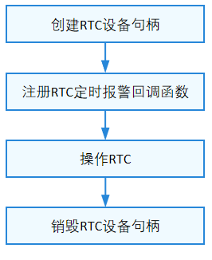

# RTC

## 概述

### 功能简介

RTC（real-time clock）为操作系统中的实时时钟设备，为操作系统提供精准的实时时间和定时报警功能。当设备下电后，通过外置电池供电，RTC继续记录操作系统时间；设备上电后，RTC提供实时时钟给操作系统，确保断电后系统时间的连续性。

### 运作机制

在HDF框架中，RTC模块采用独立服务模式，在这种模式下，每一个设备对象会独立发布一个设备服务来处理外部访问，设备管理器收到API的访问请求之后，通过提取该请求的参数，达到调用实际设备对象的相应内部方法的目的。独立服务模式可以直接借助HDFDeviceManager的服务管理能力，但需要为每个设备单独配置设备节点，若设备过多会增加内存占用。通常，一个硬件系统中只需要一个RTC设备，因此RTC模块采用独立服务模式较为合适。

独立服务模式下，核心层不会统一发布一个服务供上层使用，因此这种模式下驱动要为每个控制器发布一个服务，具体表现为：

- 驱动适配者需要实现HdfDriverEntry的Bind钩子函数以绑定服务。

- device_info.hcs文件中deviceNode的policy字段为1或2，不能为0。

**图 1** RTC独立服务模式结构图<a name="fig1"></a>  


RTC模块各分层作用：

- 接口层提供打开RTC设备、RTC设备读取时间、RTC设备设置时间、RTC设备读取警报时间、RTC设备设置警报时间、RTC设备定时报警回调函数、RTC设备设置定时报警中断使能去使能、RTC设备设置RTC外频、RTC设备读取RTC外频、复位RTC、设置RTC自定义寄存器配置，读取RTC自定义寄存器配置以及关闭RTC设备的接口。

- 核心层主要提供RTC控制器的创建、销毁，通过钩子函数与适配层交互。

- 适配层主要是将钩子函数的功能实例化，实现具体的功能。

## 使用指导

### 场景介绍

RTC主要用于提供实时时间和定时报警功能。

### 接口说明

RTC模块提供的主要接口如表1所示，具体API[详见](https://gitee.com/openharmony/drivers_hdf_core/blob/master/framework/include/platform/rtc_if.h)。

**表 1** RTC设备API接口功能介绍

|  接口名  | 接口描述 |
| -------- | -------- |
| DevHandle RtcOpen(void) | 获取RTC设备驱动句柄 |
| void RtcClose(DevHandle handle) | 释放RTC设备驱动句柄 |
| int32_t RtcReadTime(DevHandle handle, struct RtcTime \*time) | 读RTC时间信息 |
| int32_t RtcWriteTime(DevHandle handle, const struct RtcTime \*time) | 写RTC时间信息，包括年、月、星期、日、时、分、秒、毫秒 |
| int32_t RtcReadAlarm(DevHandle handle, enum RtcAlarmIndex alarmIndex, struct RtcTime \*time) | 读RTC报警时间信息 |
| int32_t RtcWriteAlarm(DevHandle handle, enum RtcAlarmIndex alarmIndex, const struct RtcTime \*time) | 写RTC报警时间信息 |
| int32_t RtcRegisterAlarmCallback(DevHandle handle, enum RtcAlarmIndex alarmIndex, RtcAlarmCallback cb) | 注册报警超时回调函数 |
| int32_t RtcAlarmInterruptEnable(DevHandle handle, enum RtcAlarmIndex alarmIndex, uint8_t enable) | 使能/去使能RTC报警中断 |
| int32_t RtcGetFreq(DevHandle handle, uint32_t \*freq) | 读RTC外接晶振频率 |
| int32_t RtcSetFreq(DevHandle handle, uint32_t freq) | 配置RTC外接晶振频率 |
| int32_t RtcReset(DevHandle handle) | RTC复位 |
| int32_t RtcReadReg(DevHandle handle, uint8_t usrDefIndex, uint8_t \*value) | 读用户自定义寄存器 |
| int32_t RtcWriteReg(DevHandle handle, uint8_t usrDefIndex, uint8_t value) | 写用户自定义寄存器 |

### 使用流程

使用RTC设备的一般流程如图2所示。

**图 2** RTC设备使用流程图



#### 创建RTC设备句柄

RTC驱动加载成功后，使用驱动框架提供的查询接口并调用RTC设备驱动接口。

>  **说明：**<br>
> 当前操作系统仅支持一个RTC设备。本文涉及的RTC的所有接口，支持内核态及用户态使用。

```c
DevHandle RtcOpen(void);
```

**表 2** RtcOpen参数和返回值描述

| **参数** | **描述** |
| -------- | -------- |
| void | NA |
| **返回值** | **描述** |
| handle | 获取对应的RTC设备句柄成功 |
| NULL | 获取对应的RTC设备句柄成功失败 |


```c
DevHandle handle = NULL;

// 获取RTC句柄
handle = RtcOpen();
if (handle == NULL) {
    // 错误处理
    HDF_LOGE("open rtc fail!");
    return HDF_FAILURE;
}
```

#### 注册RTC定时报警回调函数

系统启动后需要注册RTC定时报警回调函数，报警超时后触发回调函数。

```c
int32_t RtcRegisterAlarmCallback(DevHandle handle, enum RtcAlarmIndex alarmIndex, RtcAlarmCallback cb);
```

**表 3** RtcRegisterAlarmCallback参数和返回值描述

| **参数** | **描述** | 
| -------- | -------- |
| handle | DevHandle类型，RTC设备句柄 | 
| alarmIndex | 枚举类型，报警索引 | 
| cb | 定时报警回调函数 | 
| **返回值** | **描述** | 
| HDF_SUCCESS | 操作成功 | 
| 负数 | 操作失败 | 

注册RTC_ALARM_INDEX_A的定时报警处理函数， 示例如下：

```c
// 用户注册RTC定时报警回调函数的方法
int32_t RtcAlarmACallback(enum RtcAlarmIndex alarmIndex)
{
    if (alarmIndex == RTC_ALARM_INDEX_A) {
        // 报警A的处理
        HDF_LOGD("RTC Alarm A callback function\n\r");
        return HDF_SUCCESS;
    } else if (alarmIndex == RTC_ALARM_INDEX_B) {
        // 报警B的处理
        HDF_LOGD("RTC Alarm B callback function\n\r");
        return HDF_SUCCESS;
    } else {
        // 错误处理
        HDF_LOGE("RTC Alarm callback function fail!\n");
        return HDF_FAILURE;
    }
    return HDF_SUCCESS;
}
int32_t ret;
// 注册报警A的定时回调函数
ret = RtcRegisterAlarmCallback(handle, RTC_ALARM_INDEX_A, RtcAlarmACallback);
if (ret != HDF_SUCCESS) {
    // 错误处理
    HDF_LOGE("register alarm callback fail, ret:%d", ret);
    return ret;
}
```


#### 操作RTC

- 读取RTC时间。

    系统从RTC读取时间信息，包括年、月、星期、日、时、分、秒、毫秒，则可以通过以下函数完成：

    ```c
    int32_t RtcReadTime(DevHandle handle, struct RtcTime *time);
    ```

    **表 4** RtcReadTime参数和返回值描述

    | **参数** | **描述** |
    | -------- | -------- |
    | handle | DevHandle类型，RTC设备句柄 |
    | time | 结构体指针类型，RTC读取时间信息，包括年、月、星期、日、时、分、秒、毫秒 |
    | **返回值** | **描述** |
    | HDF_SUCCESS | 读取RTC时间成功 |
    | 负数 | 读取RTC时间失败 |

    ```c
    int32_t ret;
    struct RtcTime tm;
    
    // 系统从RTC读取时间信息
    ret = RtcReadTime(handle, &tm);
    if (ret != HDF_SUCCESS) {
        // 错误处理
        HDF_LOGE("%s:read time fail, ret:%d", __func__, ret);
        return ret;
    }
    ```

- 设置RTC时间

    设置RTC时间，则可以通过以下函数完成:

    ```c
    int32_t RtcWriteTime(DevHandle handle, struct RtcTime *time);
    ```

    **表 5** RtcWriteTime参数和返回值描述

    | **参数** | **描述** |
    | -------- | -------- |
    | handle | DevHandle类型，RTC设备句柄 |
    | time | 结构体指针类型，写RTC时间信息，包括年、月、星期、日、时、分、秒、毫秒 |
    | **返回值** | **描述** |
    | HDF_SUCCESS | 设置RTC时间成功 |
    | 负数 | 设置RTC时间失败 |

    >  **说明：**<br>
    > RTC起始时间为UTC 1970/01/01 Thursday 00:00:00，年的最大取值按照用户器件手册要求计算配置，星期不用配置。

    ```c
    int32_t ret;
    struct RtcTime tm;
    
    // 设置RTC时间为 UTC 2020/01/01 00:59:00 .000
    tm.year = 2020;
    tm.month = 01;
    tm.day = 01;
    tm.hour= 00;
    tm.minute = 59;
    tm.second = 00;
    tm.millisecond = 0;
    // 写RTC时间信息
    ret = RtcWriteTime(handle, &tm);
    if (ret != HDF_SUCCESS) {
        // 错误处理
        HDF_LOGE("write time fail, ret:%d", ret);
        return ret;
    }
    ```

- 读取RTC报警时间

    如果需要读取定时报警时间，则可以通过以下函数完成：

    ```c
    int32_t RtcReadAlarm(DevHandle handle, enum RtcAlarmIndex alarmIndex, struct RtcTime *time);
    ```

    **表 6** RtcReadAlarm参数和返回值描述

    | **参数** | **描述** |
    | -------- | -------- |
    | handle | DevHandle类型，RTC设备句柄 |
    | alarmIndex | 枚举类型，报警索引 |
    | time | 结构体指针类型，RTC报警时间信息，包括年、月、星期、日、时、分、秒、毫秒 |
    | **返回值** | **描述** |
    | HDF_SUCCESS | 读取RTC报警时间成功 |
    | 负数 | 读取RTC报警时间失败 |

    ```c
    int32_t ret;
    struct RtcTime alarmTime;
    
    // 读RTC_ALARM_INDEX_A索引的RTC定时报警时间信息 
    ret = RtcReadAlarm(handle, RTC_ALARM_INDEX_A, &alarmTime);
    if (ret != HDF_SUCCESS) {
        // 错误处理
        HDF_LOGE("read alarm fail, ret:%d", ret);
        return ret;
    }
    ```

- 设置RTC报警时间

    根据报警索引设置RTC报警时间，通过以下函数完成：

    ```c
    int32_t RtcWriteAlarm(DevHandle handle, enum RtcAlarmIndex alarmIndex, struct RtcTime *time);
    ```

    **表 7** RtcWriteAlarm参数和返回值描述

    | **参数** | **描述** |
    | -------- | -------- |
    | handle | DevHandle类型，RTC设备句柄 |
    | alarmIndex | 枚举类型，报警索引 |
    | time | 结构体指针类型，RTC报警时间信息，包括年、月、星期、日、时、分、秒、毫秒 |
    | **返回值** | **描述** |
    | HDF_SUCCESS | 设置RTC报警时间成功 |
    | 负数 | 设置RTC报警时间失败 |

    >  **说明：**</br>
    > RTC起始时间为UTC 1970/01/01 Thursday 00:00:00，年的最大取值按照用户器件手册要求计算配置，星期不用配置。

    ```c
    int32_t ret;
    struct RtcTime alarmTime;
    
    // 设置RTC报警时间为2020/01/01 00:59:59 .000 
    alarmTime.year = 2020;
    alarmTime.month = 01;
    alarmTime.day = 01;
    alarmTime.hour = 00;
    alarmTime.minute = 59;
    alarmTime.second = 59;
    alarmTime.millisecond = 0;
    // 设置RTC_ALARM_INDEX_A索引的定时报警时间 
    ret = RtcWriteAlarm(handle, RTC_ALARM_INDEX_A, &alarmTime);
    if (ret != HDF_SUCCESS) {
        // 错误处理 
        HDF_LOGE("write alarm fail, ret:%d", ret);
        return ret;
    }
    ```

- 设置定时报警中断使能或去使能

    在启动报警操作前，需要先设置报警中断使能，报警超时后会触发告警回调函数，可以通过以下函数完成：

    ```c
    int32_t RtcAlarmInterruptEnable(DevHandle handle, enum RtcAlarmIndex alarmIndex, uint8_t enable);
    ```

    **表 8** RtcAlarmInterruptEnable参数和返回值描述

    | **参数** | **描述** |
    | -------- | -------- |
    | handle | DevHandle类型，RTC设备句柄 |
    | alarmIndex | 枚举类型，报警索引 |
    | enable | uint8_t类型，RTC报警中断配置，1：使能，0：去使能 |
    | **返回值** | **描述** |
    | HDF_SUCCESS | 设置定时报警中断使能或去使能成功 |
    | 负数 | 设置定时报警中断使能或去使能失败 |

    ```c
    int32_t ret;
    
    // 设置RTC报警中断使能 
    ret = RtcAlarmInterruptEnable(handle, RTC_ALARM_INDEX_A, 1);
    if (ret != HDF_SUCCESS) {
        // 错误处理
        HDF_LOGE("alarm interrupt enable fail, ret:%d", ret);
        return ret;
    }
    ```

- 读取RTC外频

    读取RTC外接晶体振荡频率，可以通过以下函数完成：

    ```c
    int32_t RtcGetFreq(DevHandle handle, uint32_t *freq);
    ```

    **表 9** RtcGetFreq参数和返回值描述

    | **参数** | **描述** |
    | -------- | -------- |
    | handle | DevHandle类型，RTC设备句柄 |
    | freq | uint32_t类型指针，RTC的外接晶体振荡频率，单位（HZ） |
    | **返回值** | **描述** |
    | HDF_SUCCESS | 读取RTC外频成功 |
    | 负数 | 读取RTC外频失败 |

    ```c
    int32_t ret;
    uint32_t freq = 0;
    
    // 读取RTC外接晶体振荡频率 
    ret = RtcGetFreq(handle, &freq);
    if (ret != HDF_SUCCESS) {
        // 错误处理
        HDF_LOGE("get freq fail, ret:%d", ret);
    }
    ```

- 配置RTC外频

    配置RTC外接晶体振荡频率，可以通过以下函数完成：

    ```c
    int32_t RtcSetFreq(DevHandle handle, uint32_t freq);
    ```

    **表 10** RtcSetFreq参数和返回值描述

    | **参数** | **描述** |
    | -------- | -------- |
    | handle | DevHandle类型，RTC设备句柄 |
    | freq | uint32_t类型，RTC的外接晶体振荡频率，单位（HZ） |
    | **返回值** | **描述** |
    | HDF_SUCCESS | 配置RTC外频成功 |
    | 负数 | 配置RTC外频失败 |

    ```c
    int32_t ret;
    uint32_t freq = 32768; // 32768 Hz 
    
    // 设置RTC外接晶体振荡频率，注意按照器件手册要求配置RTC外频 
    ret = RtcSetFreq(handle, freq);
    if (ret != HDF_SUCCESS) {
        // 错误处理
        HDF_LOGE("set freq fail, ret:%d", ret);
        return ret;
    }
    ```

- 复位RTC

    复位RTC，复位RTC后各配置寄存器恢复默认值，可以通过以下函数完成：

    ```c
    int32_t RtcReset(DevHandle handle);
    ```

    **表 11** RtcReset参数和返回值描述

    | **参数** | **描述** |
    | -------- | -------- |
    | handle | DevHandle类型，RTC设备句柄 |
    | **返回值** | **描述** |
    | HDF_SUCCESS | 复位RTC成功 |
    | 负数 | 复位RTC失败 |

    ```c
    int32_t ret;
    
    // 复位RTC，各配置寄存器恢复默认值 
    ret = RtcReset(handle);
    if (ret != HDF_SUCCESS) {
        // 错误处理
        HDF_LOGE("reset fail, ret:%d", ret);
        return ret;
    }
    ```

- 读取RTC自定义寄存器配置

    按照用户定义的寄存器索引，读取对应的寄存器配置，一个索引对应一字节的配置值，通过以下函数完成：

    ```c
    int32_t RtcReadReg(DevHandle handle, uint8_t usrDefIndex, uint8_t *value);
    ```

    **表 12** RtcReadReg参数和返回值描述

    | **参数** | **描述** |
    | -------- | -------- |
    | handle | DevHandle类型，RTC设备句柄 |
    | usrDefIndex | uint8_t类型，用户定义的寄存器对应索引 |
    | value | uint8_t类型指针，待读取寄存器值 |
    | **返回值** | **描述** |
    | HDF_SUCCESS | 读取RTC自定义寄存器配置成功 |
    | 负数 | 读取RTC自定义寄存器配置失败 |

    ```c
    int32_t ret;
    uint8_t usrDefIndex = 0; // 定义0索引对应用户定义的第一个寄存器
    uint8_t value = 0;
    
    // 按照用户定义的寄存器索引，读取对应的寄存器配置，一个索引对应一字节的配置值 
    ret = RtcReadReg(handle, usrDefIndex, &value);
    if (ret != HDF_SUCCESS) {
        // 错误处理
        HDF_LOGE("read reg fail, ret:%d", ret);
        return ret;
    }
    ```

- 设置RTC自定义寄存器配置

    按照用户定义的寄存器索引，设置对应的寄存器配置，一个索引对应一字节的配置值，通过以下函数完成：

    ```c
    int32_t RtcWriteReg(DevHandle handle, uint8_t usrDefIndex, uint8_t value);
    ```

    **表 13** RtcWriteReg参数和返回值描述

    | **参数** | **描述** |
    | -------- | -------- |
    | handle | DevHandle类型，RTC设备句柄 |
    | usrDefIndex | uint8_t类型，用户定义的寄存器对应索引 |
    | value |  uint8_t类型，寄存器值 |
    | **返回值** | **描述** |
    | HDF_SUCCESS | 设置RTC自定义寄存器配置成功 |
    | 负数 | 设置RTC自定义寄存器配置失败 |

    ```c
    int32_t ret;
    uint8_t usrDefIndex = 0; // 定义0索引对应用户定义第一个寄存器
    uint8_t value = 0x10;
    
    // 按照用户的定义的寄存器索引，设置对应的寄存器配置，一个索引对应一字节的配置值 
    ret = RtcWriteReg(handle, usrDefIndex, value);
    if (ret != HDF_SUCCESS) {
        // 错误处理
        HDF_LOGE("write reg fail, ret:%d", ret);
        return ret;
    }
    ```

#### 销毁RTC设备句柄

销毁RTC设备句柄，系统释放对应的资源。

```c
void RtcClose(DevHandle handle);
```

**表 14** RtcClose参数描述

| **参数** | **描述** |
| -------- | -------- |
| handle | DevHandle类型，RTC设备句柄 |

```c
// 销毁RTC句柄 
RtcClose(handle);
```

### 使用实例

本例基于Hi3516DV300开发板，提供RTC接口的完整使用流程：

1. 系统启动，驱动管理模块会识别系统当前的RTC器件;

2. 驱动管理模块完成RTC设备的初始化和设备创建；

3. 用户通过不同API，对该RTC设备进行对应的操作；

4. 关闭RTC设备，释放设备资源。

示例如下：

```c有问题
#include "hdf_log.h"                  // 标准日志打印头文件
#include "osal_time.h"                // 标准延迟&睡眠接口头文件
#include "rtc_if.h"

int32_t RtcAlarmACallback(enum RtcAlarmIndex alarmIndex)
{
    if (alarmIndex == RTC_ALARM_INDEX_A) {
        // 报警A的处理 
        HDF_LOGD("RtcAlarmACallback: RTC Alarm A callback function\n\r");
        return HDF_SUCCESS;
    } else if (alarmIndex == RTC_ALARM_INDEX_B) {
        // 报警B的处理 
        HDF_LOGD("RtcAlarmACallback:RTC Alarm B callback function\n\r");
        return HDF_SUCCESS;
    } else {
        // 错误处理 
        HDF_LOGE("RtcAlarmACallback:RTC Alarm callback function fail!\n\r");
        return HDF_FAILURE;
    }
    return HDF_SUCCESS;
}

int32_t RtcTestSample(void)
{
    int32_t ret;
    struct RtcTime tm;
    struct RtcTime alarmTime;
    uint32_t freq;
    uint8_t usrDefIndex = 0;
    uint8_t value = 0;
    DevHandle handle = NULL;

    // 获取RTC设备句柄 
    handle = RtcOpen();
    if (handle == NULL) {
        HDF_LOGE("RtcTestSample:open rtc fail!");
        return HDF_FAILURE;
    }
    // 注册报警A的定时回调函数 
    ret = RtcRegisterAlarmCallback(handle, RTC_ALARM_INDEX_A, RtcAlarmACallback);
    if (ret != HDF_SUCCESS) {
        HDF_LOGE("RtcTestSample:register alarm callback fail, ret:%d", ret);
        goto ERR;
    }
    // 设置RTC外接晶体振荡频率，注意按照器件手册要求配置RTC外频 
    freq = 32768; // 32768 Hz 
    ret = RtcSetFreq(handle, freq);
    if (ret != HDF_SUCCESS) {
        HDF_LOGE("RtcTestSample:set freq fail, ret:%d", ret);
        goto ERR;
    }

    freq = 0;
    ret = RtcGetFreq(handle, &freq);
    if (ret != HDF_SUCCESS) {
        HDF_LOGE("RtcTestSample:get freq fail, ret:%d", ret);
        goto ERR;
    }

    // 设置RTC报警中断使能 
    ret = RtcAlarmInterruptEnable(handle, RTC_ALARM_INDEX_A, 1);
    if (ret != HDF_SUCCESS) {
        HDF_LOGE("RtcTestSample:alarm interrupt enable fail, ret:%d", ret);
        goto ERR;
    }
    // 设置RTC时间为2020/01/01 00:00:10 .990 
    tm.year = 2020;
    tm.month = 01;
    tm.day = 01;
    tm.hour= 0;
    tm.minute = 0;
    tm.second = 10;
    tm.millisecond = 990;
    // 写RTC时间信息 
    ret = RtcWriteTime(handle, &tm);
    if (ret != HDF_SUCCESS) {
        HDF_LOGE("RtcTestSample:write time fail, ret:%d", ret);
        goto ERR;
    }
    // 设置RTC报警时间为2020/01/01 00:00:30 .100 
    alarmTime.year = 2020;
    alarmTime.month = 01;
    alarmTime.day = 01;
    alarmTime.hour = 0;
    alarmTime.minute = 0;
    alarmTime.second = 30;
    alarmTime.millisecond = 100;
    // 设置RTC_ALARM_INDEX_A索引定时报警时间信息, 定时时间到后会打印"RTC Alarm A callback function" 
    ret = RtcWriteAlarm(handle, RTC_ALARM_INDEX_A, &alarmTime);
    if (ret != HDF_SUCCESS) {
        HDF_LOGE("RtcTestSample:write alarm fail, ret:%d", ret);
        goto ERR;
    }
    OsalSleep(5);

    ret = RtcReadAlarm(handle, RTC_ALARM_INDEX_A, &alarmTime);
    if (ret != HDF_SUCCESS) {
        HDF_LOGE("RtcTestSample: read alarm fail, ret: %d!", ret);
        goto ERR;
    }
    // 读取RTC实时时间 
    ret = RtcReadTime(handle, &tm);
    if (ret != HDF_SUCCESS) {
        HDF_LOGE("RtcTestSample:read time fail, ret:%d", ret);
        goto ERR;
    }

    ret = RtcWriteReg(handle, usrDefIndex, value);
    if (ret != HDF_SUCCESS) {
        HDF_LOGE("RtcTestSample: write reg fail, ret: %d!", ret);
        return ret;
    }

    ret = RtcReadReg(handle, usrDefIndex, &value);
    if (ret != HDF_SUCCESS) {
        HDF_LOGE("RtcTestSample: read reg fail, ret :%d!", ret);
        return ret;
    }

    HDF_LOGD("RtcTestSample: RTC read time:\n\r");
    HDF_LOGD("RtcTestSample: year-month-date-weekday hour:minute:second .millisecond %04u-%02u-%02u-%u %02u:%02u:%02u .%03u",
        tm.year, tm.month, tm.day, tm.weekday, tm.hour, tm.minute, tm.second, tm.millisecond);
    HDF_LOGD("RtcTestSample: all test end.");

ERR:
    // 销毁RTC设备句柄 
    RtcClose(handle);
    return ret;
}
```
