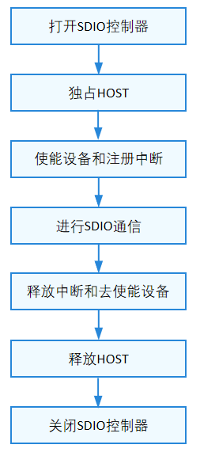

# SDIO

## 概述

### 功能简介

SDIO是安全数字输入输出接口（Secure Digital Input and Output）的缩写，是从SD内存卡接口的基础上演化出来的一种外设接口。SDIO接口兼容以前的SD卡，并且可以连接支持SDIO接口的其他设备。

SDIO接口定义了操作SDIO的通用方法集合，包括：

- 打开/关闭SDIO控制器

- 独占/释放HOST

- 使能/去使能设备

- 申请/释放中断

- 读写、获取/设置公共信息

### 运作机制

在HDF框架中，SDIO的接口适配模式采用独立服务模式。在这种模式下，每一个设备对象会独立发布一个设备服务来处理外部访问，设备管理器收到API的访问请求之后，通过提取该请求的参数，达到调用实际设备对象的相应内部方法的目的。独立服务模式可以直接借助HDFDeviceManager的服务管理能力，但需要为每个设备单独配置设备节点，若设备过多可能增加内存占用。

独立服务模式下，核心层不会统一发布一个服务供上层使用，因此这种模式下驱动要为每个控制器发布一个服务，具体表现为：

- 驱动适配者需要实现HdfDriverEntry的Bind钩子函数以绑定服务。

- device_info.hcs文件中deviceNode的policy字段为1或2，不能为0。

SDIO模块各分层作用：

- 接口层提供打开SDIO设备、设置块的大小、读取数据、写数据、设置公共信息、获取公共信息、刷新数据、独占HOST、释放Host、使能SDIO功能设备、去使能SDIO功能设备、申请中断、释放中断关闭SDIO设备的接口。

- 核心层主要提供SDIO控制器的添加、移除及管理的能力，通过钩子函数与适配层交互。

- 适配层主要是将钩子函数的功能实例化，实现具体的功能。

**图 1** SDIO独立服务模式结构图


SDIO总线有两端，其中一端是主机端（HOST），另一端是设备端（DEVICE）。所有的通信都是由HOST端发出命令开始的，在DEVICE端只要能解析HOST的命令，就可以同HOST进行通信了。SDIO的HOST可以连接多个DEVICE，如图2所示：

- CLK信号：HOST给DEVICE的时钟信号。

- VDD信号：电源信号。

- VSS信号：Ground信号。

- D0-3信号：4条数据线，其中，DAT1信号线复用为中断线，在1BIT模式下DAT0用来传输数据，在4BIT模式下DAT0-DAT3用来传输数据。

- CMD信号：用于HOST发送命令和DEVICE回复响应。

**图 2** SDIO的HOST-DEVICE连接示意图


### 约束与限制

SDIO模块API当前仅支持内核态调用。

## 使用指导

### 场景介绍

SDIO的应用比较广泛，目前，有许多手机都支持SDIO功能，并且很多SDIO外设也被开发出来，使得手机外接外设更加容易。常见的SDIO外设有WLAN、GPS、CAMERA、蓝牙等。

### 接口说明

SDIO模块提供的主要接口如表1所示，具体API[详见](https://gitee.com/openharmony/drivers_hdf_core/blob/master/framework/include/platform/sdio_if.h)。

**表 1** SDIO驱动API接口功能介绍

| 接口名 | 接口描述 |
| -------- | -------- |
| DevHandle SdioOpen(int16_t mmcBusNum, struct SdioFunctionConfig \*config) | 打开指定总线号的SDIO控制器 |
| void SdioClose(DevHandle handle) | 关闭SDIO控制器 |
| int32_t SdioReadBytes(DevHandle handle, uint8_t \*data, uint32_t addr, uint32_t size) | 从指定地址开始，增量读取指定长度的数据 |
| int32_t SdioWriteBytes(DevHandle handle, uint8_t \*data, uint32_t addr, uint32_t size) | 从指定地址开始，增量写入指定长度的数据 |
| int32_t SdioReadBytesFromFixedAddr(DevHandle handle, uint8_t \*data, uint32_t addr, uint32_t size, uint32_t scatterLen) | 从固定地址读取指定长度的数据 |
| int32_t SdioWriteBytesToFixedAddr(DevHandle handle, uint8_t \*data, uint32_t addr, uint32_t size, uint32_t scatterLen) | 向固定地址写入指定长度的数据 |
| int32_t SdioReadBytesFromFunc0(DevHandle handle, uint8_t \*data, uint32_t addr, uint32_t size) | 从SDIO&nbsp;function&nbsp;0的指定地址空间读取指定长度的数据 |
| int32_t SdioWriteBytesToFunc0(DevHandle handle, uint8_t \*data, uint32_t addr, uint32_t size) | 向SDIO&nbsp;function&nbsp;0的指定地址空间写入指定长度的数据 |
| int32_t SdioSetBlockSize(DevHandle handle, uint32_t blockSize) | 设置块的大小 |
| int32_t SdioGetCommonInfo(DevHandle handle, SdioCommonInfo \*info, SdioCommonInfoType infoType) | 获取公共信息 |
| int32_t SdioSetCommonInfo(DevHandle handle, SdioCommonInfo \*info, SdioCommonInfoType infoType) | 设置公共信息 |
| int32_t SdioFlushData(DevHandle handle) | 刷新数据 |
| void SdioClaimHost(DevHandle handle) | 独占Host |
| void SdioReleaseHost(DevHandle handle) | 释放Host |
| int32_t SdioEnableFunc(DevHandle handle) | 使能SDIO功能设备 |
| int32_t SdioDisableFunc(DevHandle handle) | 去使能SDIO功能设备 |
| int32_t SdioClaimIrq(DevHandle handle, SdioIrqHandler \*irqHandler) | 申请中断 |
| int32_t SdioReleaseIrq(DevHandle handle) | 释放中断 |

### 使用流程

使用SDIO的一般流程如图3所示。

**图 3** SDIO使用流程图



#### 打开SDIO控制器

在使用SDIO进行通信前，首先要调用SdioOpen获取SDIO控制器的设备句柄，该函数会返回指定总线号的SDIO控制器的设备句柄。

```c
DevHandle SdioOpen(int16_t mmcBusNum, struct SdioFunctionConfig *config);
```

**表 2** SdioOpen函数的参数和返回值描述

| 参数 | 参数描述 | 
| -------- | -------- |
| mmcBusNum | int16_t类型，总线号 | 
| config | 结构体指针，SDIO功能配置信息 | 
| **返回值** | **返回值描述** | 
| NULL | 获取SDIO控制器的设备句柄失败 | 
| 设备句柄 | SDIO控制器的设备句柄 | 

打开SDIO控制器的示例如下：

```c
DevHandle handle = NULL;
struct SdioFunctionConfig config;
config.funcNr = 1;
config.vendorId = 0x123;
config.deviceId = 0x456;
// 打开总线号为1的SDIO控制器
handle = SdioOpen(1, &config);
if (handle == NULL) {
    HDF_LOGE("SdioOpen: open sdio fail!\n");
	return NULL;
}
```

#### 独占HOST

获取到SDIO控制器的设备句柄之后，需要先独占HOST才能进行SDIO后续的一系列操作，独占HOST函数如下所示：

```c
void SdioClaimHost(DevHandle handle);
```

**表 3** SdioClaimHost函数的参数描述

| 参数 | 参数描述 | 
| -------- | -------- |
| handle | DevHandle类型，SDIO控制器的设备句柄 | 

独占HOST示例如下：

```c
SdioClaimHost(handle); // 独占HOST
```

#### 使能SDIO设备

在访问寄存器之前，需要先使能SDIO设备，使能SDIO设备的函数如下所示：

```c
int32_t SdioEnableFunc(DevHandle handle);
```

**表 4** SdioEnableFunc函数的参数和返回值描述

| 参数 | 参数描述 | 
| -------- | -------- |
| handle | DevHandle类型，SDIO控制器的设备句柄 | 
| **返回值** | **返回值描述** | 
| HDF_SUCCESS | SDIO使能成功 | 
| 负数 | SDIO使能失败 | 

使能SDIO设备的示例如下：

```c
int32_t ret;
// 使能SDIO设备
ret = SdioEnableFunc(handle);
if (ret != HDF_SUCCESS) {
    HDF_LOGE("SdioEnableFunc: sdio enable func fail, ret:%d\n", ret);
	return ret;
}
```

#### 注册SDIO中断

在通信之前，还需要注册SDIO中断，注册SDIO中断函数如下所示：

```c
int32_t SdioClaimIrq(DevHandle handle, SdioIrqHandler *handler);
```

**表 5** SdioClaimIrq函数的参数和返回值描述

| 参数 | 参数描述 | 
| -------- | -------- |
| handle | DevHandle类型，SDIO控制器的设备句柄 | 
| handler | 函数指针，中断服务函数 | 
| **返回值** | **返回值描述** | 
| HDF_SUCCESS | 注册SDIO中断成功 | 
| 负数 | 注册SDIO中断失败 | 

  注册SDIO中的示例如下：

```c
// 中断服务函数需要根据各自平台的情况去实现
static void SdioIrqFunc(void *data)
{
    if (data == NULL) {
        HDF_LOGE("SdioIrqFunc: data is NULL.\n");
        return;
    }
    // 需要开发者自行添加具体实现
}

int32_t ret;
// 注册SDIO中断
ret = SdioClaimIrq(handle, SdioIrqFunc);
if (ret != HDF_SUCCESS) {
    HDF_LOGE("SdioClaimIrq: sdio claim irq fail, ret:%d\n", ret);
    return ret;
}
```

#### 进行SDIO通信

- 向SDIO设备增量写入指定长度的数据

    对应的接口函数如下所示：

    ```c
    int32_t SdioWriteBytes(DevHandle handle, uint8_t *data, uint32_t addr, uint32_t size);
    ```

    **表 6** SdioWriteBytes函数的参数和返回值描述

    | 参数 | 参数描述 | 
    | -------- | -------- |
    | handle | DevHandle类型，SDIO控制器的设备句柄 | 
    | data | uint8_t类型指针，待写入数据 | 
    | addr | uint32_t类型，待写入数据的起始地址 | 
    | size | uint32_t类型，待写入数据的长度 | 
    | **返回值** | **返回值描述** | 
    | HDF_SUCCESS | SDIO写数据成功 | 
    | 负数 | SDIO写数据失败 | 

    向SDIO设备增量写入指定长度的数据的示例如下：

    ```c
    int32_t ret;
    uint8_t wbuff[] = {1,2,3,4,5};
    uint32_t addr = 0x100 + 0x09;
    // 向SDIO设备起始地址0x109，增量写入5个字节的数据
    ret = SdioWriteBytes(handle, wbuff, addr, sizeof(wbuff) / sizeof(wbuff[0]));
    if (ret != HDF_SUCCESS) {
        HDF_LOGE("SdioWriteBytes: sdio write bytes fail, ret:%d\n", ret);
        return ret;
    }
    ```

- 从SDIO设备增量读取指定长度的数据

    对应的接口函数如下所示：

    ```c
    int32_t SdioReadBytes(DevHandle handle, uint8_t *data, uint32_t addr, uint32_t size);
    ```

    **表 7** SdioReadBytes函数的参数和返回值描述

    | 参数 | 参数描述 | 
    | -------- | -------- |
    | handle | DevHandle类型，SDIO控制器的设备句柄 | 
    | data | uint8_t类型指针，接收读取数据 | 
    | addr | uint32_t类型，待读取数据的起始地址 | 
    | size | uint32_t类型，待读取数据的长度 | 
    | **返回值** | **返回值描述** | 
    | HDF_SUCCESS | SDIO读数据成功 | 
    | 负数 | SDIO读数据失败 | 

    从SDIO设备增量读取指定长度的数据的示例如下：

    ```c
    int32_t ret;
    uint8_t rbuff[5] = {0};
    uint32_t addr = 0x100 + 0x09;
    // 从SDIO设备起始地址0x109，增量读取5个字节的数据
    ret = SdioReadBytes(handle, rbuff, addr, 5);
    if (ret != HDF_SUCCESS) {
        HDF_LOGE("SdioReadBytes: sdio read bytes fail, ret:%d\n", ret);
        return ret;
    }
    ```

- 向SDIO设备的固定地址写入指定长度的数据

    对应的接口函数如下所示：

    ```c
    int32_t SdioWriteBytesToFixedAddr(DevHandle handle, uint8_t *data, uint32_t addr, uint32_t size, uint32_t scatterLen);
    ```

    **表 8** SdioWriteBytesToFixedAddr函数的参数和返回值描述
  
    | 参数 | 参数描述 | 
    | -------- | -------- |
    | handle | DevHandle类型，SDIO控制器的设备句柄。 | 
    | data | uint8_t类型指针，待写入数据。 | 
    | addr | uint32_t类型，待写入数据的固定地址。 | 
    | size | uint32_t类型，待写入数据的长度。 | 
    | scatterLen | uint32_t类型，集散表的长度。如果该字段不为0，则data为集散表类型。 | 
    | **返回值** | **返回值描述** | 
    | HDF_SUCCESS | SDIO写数据成功。 | 
    | 负数 | SDIO写数据失败。 | 

    向SDIO设备的固定地址写入指定长度的数据的示例如下：

    ```c
    int32_t ret;
    uint8_t wbuff[] = {1, 2, 3, 4, 5};
    uint32_t addr = 0x100 + 0x09;
    // 向SDIO设备固定地址0x109写入5个字节的数据
    ret = SdioWriteBytesToFixedAddr(handle, wbuff, addr, sizeof(wbuff) / sizeof(wbuff[0]), 0);
    if (ret != HDF_SUCCESS) {
        HDF_LOGE("SdioWriteBytesToFixedAddr: sdio write bytes to fixed addr fail, ret:%d\n", ret);
        return ret;
    }
    ```

- 从SDIO设备的固定地址读取指定长度的数据

    对应的接口函数如下所示：

    ```c
    int32_t SdioReadBytesFromFixedAddr(DevHandle handle, uint8_t *data, uint32_t addr, uint32_t size, uint32_t scatterLen);
    ```

    **表 9** SdioReadBytesFromFixedAddr函数的参数和返回值描述
  
    | 参数 | 参数描述 | 
    | -------- | -------- |
    | handle | DevHandle类型，SDIO控制器的设备句柄。 | 
    | data | uint8_t类型指针，接收读取数据。 | 
    | addr | uint32_t类型，待读取数据的起始地址。 | 
    | size | uint32_t类型，待读取数据的长度。 | 
    | scatterLen | uint32_t类型，集散表的长度。如果该字段不为0，则data为集散表类型。 | 
    | **返回值** | **返回值描述** | 
    | HDF_SUCCESS | SDIO读数据成功。 | 
    | 负数 | SDIO读数据失败。 | 

    从SDIO设备的固定地址读取指定长度的数据的示例如下：

    ```c
    int32_t ret;
    uint8_t rbuff[5] = {0};
    uint32_t addr = 0x100 + 0x09;
    // 从SDIO设备固定地址0x109中读取5个字节的数据 
    ret = SdioReadBytesFromFixedAddr(handle, rbuff, addr, 5, 0);
    if (ret != HDF_SUCCESS) {
        HDF_LOGE("SdioReadBytesFromFixedAddr: sdio read bytes from fixed addr fail, ret:%d\n", ret);
        return ret;
    }
    ```

- 向SDIO function 0的指定地址空间写入指定长度的数据

    当前只支持写入一个字节的数据，对应的接口函数如下所示：

    ```c
    int32_t SdioWriteBytesToFunc0(DevHandle handle, uint8_t *data, uint32_t addr, uint32_t size);
    ```

    **表 10** SdioWriteBytesToFunc0函数的参数和返回值描述

    | 参数 | 参数描述 | 
    | -------- | -------- |
    | handle | DevHandle类型，SDIO控制器的设备句柄 | 
    | data | uint8_t类型指针，待写入数据 | 
    | addr | uint32_t类型，待写入数据的起始地址 | 
    | size | uint32_t类型，待写入数据的长度 | 
    | **返回值** | **返回值描述** | 
    | HDF_SUCCESS | SDIO写数据成功 | 
    | 负数 | SDIO写数据失败 | 

    向SDIO function 0的指定地址空间写入指定长度的数据的示例如下：

    ```c
    int32_t ret;
    uint8_t wbuff = 1;
    // 向SDIO function 0地址0x2中写入1字节的数据
    ret = SdioWriteBytesToFunc0(handle, &wbuff, 0x2, 1);
    if (ret != HDF_SUCCESS) {
        HDF_LOGE("SdioWriteBytesToFunc0: sdio write bytes to func0 fail, ret:%d\n", ret);
        return ret;
    }
    ```

- 从SDIO function 0的指定地址空间读取指定长度的数据

    当前只支持读取一个字节的数据，对应的接口函数如下所示：

    ```c
    int32_t SdioReadBytesFromFunc0(DevHandle handle, uint8_t *data, uint32_t addr, uint32_t size);
    ```

    **表 11** SdioReadBytesFromFunc0函数的参数和返回值描述

    | 参数 | 参数描述 | 
    | -------- | -------- |
    | handle | DevHandle类型，SDIO控制器的设备句柄 | 
    | data | uint8_t类型指针，接收读取数据 | 
    | addr | uint32_t类型，待读取数据的起始地址 | 
    | size | uint32_t类型，待读取数据的长度 | 
    | **返回值** | **返回值描述** | 
    | HDF_SUCCESS | SDIO读数据成功 | 
    | 负数 | SDIO读数据失败 | 

    从SDIO function 0的指定地址空间读取指定长度的数据的示例如下：

    ```c
    int32_t ret;
    uint8_t rbuff;
    /* 从SDIO function 0设备地址0x2中读取1字节的数据 */
    ret = SdioReadBytesFromFunc0(handle, &rbuff, 0x2, 1);
    if (ret != 0) {
        HDF_LOGE("SdioReadBytesFromFunc0: sdio read bytes from func0 fail, ret:%d\n", ret);
        return ret;
    }
    ```

#### 释放SDIO中断

通信完成之后，需要释放SDIO中断，函数如下所示：

int32_t SdioReleaseIrq(DevHandle handle);

**表 12** SdioReleaseIrq函数的参数和返回值描述

| 参数 | 参数描述 | 
| -------- | -------- |
| handle | DevHandle类型，SDIO控制器的设备句柄 | 
| **返回值** | **返回值描述** | 
| HDF_SUCCESS | 释放SDIO中断成功 | 
| 负数 | 释放SDIO中断失败 | 

释放SDIO中断的示例如下：

```c
int32_t ret;
// 释放SDIO中断
ret = SdioReleaseIrq(handle);
if (ret != HDF_SUCCESS) {
    HDF_LOGE("SdioReleaseIrq: sdio release irq fail, ret:%d\n", ret);
    return ret;
}
```

#### 去使能SDIO设备

通信完成之后，还需要去使能SDIO设备，函数如下所示：

int32_t SdioDisableFunc(DevHandle handle);

**表 13** SdioDisableFunc函数的参数和返回值描述

| 参数 | 参数描述 | 
| -------- | -------- |
| handle | DevHandle类型，SDIO控制器的设备句柄 | 
| **返回值** | **返回值描述** | 
| HDF_SUCCESS | 去使能SDIO设备成功 | 
| 负数 | 去使能SDIO设备失败 | 

去使能SDIO设备的示例如下：

```c
int32_t ret;
// 去使能SDIO设备
ret = SdioDisableFunc(handle);
if (ret != HDF_SUCCESS) {
    HDF_LOGE("SdioDisableFunc: sdio disable func fail, ret:%d\n", ret);
    return ret;
}
```

#### 释放HOST

通信完成之后，还需要释放去HOST，函数如下所示：

```c
void SdioReleaseHost(DevHandle handle);
```

**表 14** SdioReleaseHost函数的参数描述

| 参数 | 参数描述 | 
| -------- | -------- |
| handle | DevHandle类型，SDIO控制器的设备句柄 | 

释放HOST的示例如下：

```c
SdioReleaseHost(handle); // 释放HOST
```

#### 关闭SDIO控制器

SDIO通信完成之后，最后需要关闭SDIO控制器，函数如下所示：

```c
void SdioClose(DevHandle handle);
```

该函数会释放掉申请的资源。

**表 15** SdioClose函数的参数描述

| 参数 | 参数描述 | 
| -------- | -------- |
| handle | DevHandle类型，SDIO控制器的设备句柄 | 

关闭SDIO控制器的示例如下：

```c
SdioClose(handle); // 关闭SDIO控制器
```

### 使用实例

本例拟对Hi3516DV300开发板上SDIO设备进行操作。

SDIO设备完整的使用示例如下所示，首先打开总线号为1的SDIO控制器，然后独占HOST、使能设备、注册中断，接着进行SDIO通信（读写等），通信完成之后，释放中断、去使能设备、释放HOST，最后关闭SDIO控制器。
  
```c
#include "hdf_log.h"
#include "sdio_if.h"

#define TEST_FUNC_NUM 1              /* 本测试用例中，使用编号为1的I/O function */
#define TEST_FBR_BASE_ADDR 0x100     /* 编号为1的I/O function的FBR基地址 */
#define TEST_ADDR_OFFSET 9           /* 本测试用例中，需要读写的寄存器的地址偏移 */
#define TEST_DATA_LEN 3              /* 本测试用例中，读写数据的长度 */
#define TEST_BLOCKSIZE 2             /* 本测试用例中，数据块的大小，单位字节 */

/* 中断服务函数，需要根据各自平台的情况去实现 */
static void SdioIrqFunc(void *data)
{
    if (data == NULL) {
        HDF_LOGE("SdioIrqFunc: data is NULL.\n");
        return;
    }
    /* 需要开发者自行添加具体的实现 */
}

void SdioTestSample(void)
{
    int32_t ret;  
    DevHandle handle = NULL;
    uint8_t data[TEST_DATA_LEN] = {0};
    struct SdioFunctionConfig config = {1, 0x123, 0x456};
    uint8_t val;
    uint32_t addr;

    /* 打开总线号为1的SDIO设备 */
    handle = SdioOpen(1, &config);
    if (handle == NULL) {
        HDF_LOGE("SdioOpen: failed!\n");
        return;
    }
    /* 独占HOST */
    SdioClaimHost(handle);
    /* 使能SDIO设备 */
    ret = SdioEnableFunc(handle);
    if (ret != 0) {
        HDF_LOGE("SdioEnableFunc: failed, ret %d\n", ret);
        goto ENABLE_ERR;
    }
    /* 注册中断 */
    ret = SdioClaimIrq(handle, SdioIrqFunc);
    if (ret != 0) {
        HDF_LOGE("SdioClaimIrq: failed, ret %d\n", ret);
        goto CLAIM_IRQ_ERR;
    }
    /* 设置块大小为2字节 */
    ret = SdioSetBlockSize(handle, TEST_BLOCKSIZE);
    if (ret != 0) {
        HDF_LOGE("SdioSetBlockSize: failed, ret %d\n", ret);
        goto COMM_ERR;
    }
    /* 从SDIO设备增量地址读取3字节的数据 */
    addr = TEST_FBR_BASE_ADDR * TEST_FUNC_NUM + TEST_ADDR_OFFSET;
    ret = SdioReadBytes(handle, data, addr, TEST_DATA_LEN);
    if (ret != 0) {
        HDF_LOGE("SdioReadBytes: failed, ret %d\n", ret);
        goto COMM_ERR;
    }
    /* 向SDIO设备增量地址写入3字节的数据 */
    ret = SdioWriteBytes(handle, data, addr, TEST_DATA_LEN);
    if (ret != 0) {
        HDF_LOGE("SdioWriteBytes: failed, ret %d\n", ret);
        goto COMM_ERR;
    }
    /* 从SDIO设备读取1字节的数据 */
    ret = SdioReadBytes(handle, &val, addr, 1);
    if (ret != 0) {
        HDF_LOGE("SdioReadBytes: failed, ret %d\n", ret);
        goto COMM_ERR;
    }
    /* 向SDIO设备写入1字节的数据 */
    ret = SdioWriteBytes(handle, &val, addr, 1);
    if (ret != 0) {
        HDF_LOGE("SdioWriteBytes: failed, ret %d\n", ret);
        goto COMM_ERR;
    }
    /* 从SDIO设备固定地址读取3字节的数据 */
    ret = SdioReadBytesFromFixedAddr(handle, data, addr, TEST_DATA_LEN, 0);
    if (ret != 0) {
        HDF_LOGE("SdioReadBytesFromFixedAddr: failed, ret %d\n", ret);
        goto COMM_ERR;
    }
    /* 向SDIO设备固定地址写入1字节的数据 */
    ret = SdioWriteBytesToFixedAddr(handle, data, addr, 1, 0);
    if (ret != 0) {
        HDF_LOGE("SdioWriteBytesToFixedAddr: failed, ret %d\n", ret);
        goto COMM_ERR;
    }
    /* 从SDIO function 0读取1字节的数据 */
    addr = 0x02;
    ret = SdioReadBytesFromFunc0(handle, &val, addr, 1);
    if (ret != 0) {
        HDF_LOGE("SdioReadBytesFromFunc0: failed, ret %d\n", ret);
        goto COMM_ERR;
    }
    /* 向SDIO function 0写入1字节的数据 */
    ret = SdioWriteBytesToFunc0(handle, &val, addr, 1);
    if (ret != 0) {
        HDF_LOGE("SdioWriteBytesToFunc0: failed, ret %d\n", ret);
        goto COMM_ERR;
    }
COMM_ERR:
    /* 释放中断 */
    ret = SdioReleaseIrq(handle);
    if (ret != 0) {
        HDF_LOGE("SdioReleaseIrq: failed, ret %d\n", ret);
    }
CLAIM_IRQ_ERR:
    /* 去使能SDIO设备 */
    ret = SdioDisableFunc(handle);
    if (ret != 0) {
        HDF_LOGE("SdioDisableFunc: failed, ret %d\n", ret);
    }
ENABLE_ERR:
    /* 释放HOST */
    SdioReleaseHost(handle);
    /* 关闭SDIO设备 */
    SdioClose(handle); 
}
```
