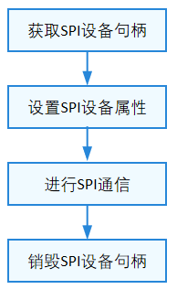

# SPI

## 概述

### 功能简介

SPI指串行外设接口（Serial Peripheral Interface），是一种高速的，全双工，同步的通信总线。SPI是由Motorola公司开发，用于在主设备和从设备之间进行通信。

SPI接口定义了操作SPI设备的通用方法集合，包括：

- SPI设备句柄获取和释放。
  
- SPI读写：从SPI设备读取或写入指定长度数据。
 
- SPI自定义传输：通过消息传输结构体执行任意读写组合过程。

- SPI设备配置：获取和设置SPI设备属性。

### 运作机制

在HDF框架中，SPI的接口适配模式采用独立服务模式，在这种模式下，每一个设备对象会独立发布一个设备服务来处理外部访问，设备管理器收到API的访问请求之后，通过提取该请求的参数，达到调用实际设备对象的相应内部方法的目的。独立服务模式可以直接借助HDFDeviceManager的服务管理能力，但需要为每个设备单独配置设备节点，若设备过多可能增加内存占用。

独立服务模式下，核心层不会统一发布一个服务供上层使用，因此这种模式下驱动要为每个控制器发布一个服务，具体表现为：

- 驱动适配者需要实现HdfDriverEntry的Bind钩子函数以绑定服务。

- device_info.hcs文件中deviceNode的policy字段为1或2，不能为0。

**图 1** SPI独立服务模式结构图<a name="fig1"></a>  


SPI模块各分层作用：

- 接口层提供打开SPI设备、SPI写数据、SPI读数据、SPI传输、配置SPI设备属性、获取SPI设备属性、关闭SPI设备的接口。

- 核心层主要提供SPI控制器的添加、移除以及管理的能力，通过钩子函数与适配层交互。

- 适配层主要是将钩子函数的功能实例化，实现具体的功能。

SPI以主从方式工作，通常有一个主设备和一个或者多个从设备。主设备和从设备之间一般用4根线相连，它们分别是：

- SCLK：时钟信号，由主设备产生；

- MOSI：主设备数据输出，从设备数据输入；

- MISO：主设备数据输入，从设备数据输出；

- CS：片选，从设备使能信号，由主设备控制。

一个主设备和两个从设备的连接示意图如图2所示，Device A和Device B共享主设备的SCLK、MISO和MOSI三根引脚，Device A的片选CS0连接主设备的CS0，Device B的片选CS1连接主设备的CS1。

**图 2** SPI主从设备连接示意图


- SPI通信通常由主设备发起，通过以下步骤完成一次通信：

    1. 通过CS选中要通信的从设备，在任意时刻，一个主设备上最多只能有一个从设备被选中。

    2. 通过SCLK给选中的从设备提供时钟信号。

    3. 基于SCLK时钟信号，主设备数据通过MOSI发送给从设备，同时通过MISO接收从设备发送的数据，完成通信。

- 根据SCLK时钟信号的CPOL（Clock Polarity，时钟极性）和CPHA（Clock Phase，时钟相位）的不同组合，SPI有以下四种工作模式：

    - CPOL=0，CPHA=0 时钟信号idle状态为低电平，第一个时钟边沿采样数据。

    - CPOL=0，CPHA=1 时钟信号idle状态为低电平，第二个时钟边沿采样数据。

    - CPOL=1，CPHA=0 时钟信号idle状态为高电平，第一个时钟边沿采样数据。

    - CPOL=1，CPHA=1 时钟信号idle状态为高电平，第二个时钟边沿采样数据。

### 约束与限制

SPI模块当前只支持主机模式，不支持从机模式。

## 使用指导

### 场景介绍

SPI通常用于与闪存、实时时钟、传感器以及模数/数模转换器等支持SPI协议的设备进行通信。

### 接口说明

SPI模块提供的主要接口如表1所示，具体API[详见](https://gitee.com/openharmony/drivers_hdf_core/blob/master/framework/include/platform/spi_if.h)。

**表 1** SPI驱动API接口功能介绍

| 接口名 | 接口描述 |
| -------- | -------- |
| DevHandle SpiOpen(const struct SpiDevInfo \*info) | 获取SPI设备句柄 |
| void SpiClose(DevHandle handle) | 释放SPI设备句柄 |
| int32_t SpiRead(DevHandle handle, uint8_t \*buf, uint32_t len) | 读取指定长度的数据 |
| int32_t SpiWrite(DevHandle handle, uint8_t \*buf, uint32_t len) | 写入指定长度的数据 |
| int32_t SpiTransfer(DevHandle handle, struct SpiMsg \*msgs, uint32_t count) | SPI数据传输接口 |
| int32_t SpiSetCfg(DevHandle handle, struct SpiCfg \*cfg) | 根据指定参数，配置SPI设备 |
| int32_t SpiGetCfg(DevHandle handle, struct SpiCfg \*cfg) | 获取SPI设备配置参数 |

### 使用流程

使用SPI的一般流程如下图所示。

**图 3** SPI使用流程图



#### 获取SPI设备句柄

在使用SPI进行通信时，首先要调用SpiOpen获取SPI设备句柄，该函数会返回指定总线号和片选号的SPI设备句柄。

```c
DevHandle SpiOpen(const struct SpiDevInfo *info); 
```

**表 2** SpiOpen参数和返回值描述

| **参数** | **参数描述** |
| -------- | -------- |
| info | 结构体类型，SPI设备描述符 |
| **返回值** | **返回值描述** |
| NULL | 获取SPI设备句柄失败 |
| 设备句柄 | 获取对应的SPI设备句柄成功 |

假设系统中的SPI设备总线号为0，片选号为0，获取该SPI设备句柄的示例如下：

```c
struct SpiDevInfo spiDevinfo;       // SPI设备描述符
DevHandle spiHandle = NULL;         // SPI设备句柄
spiDevinfo.busNum = 0;              // SPI设备总线号
spiDevinfo.csNum = 0;               // SPI设备片选号

// 获取SPI设备句柄
spiHandle = SpiOpen(&spiDevinfo);
if (spiHandle == NULL) {
    HDF_LOGE("SpiOpen: spi open fail!\n");
    return HDF_FAILURE;
}
```

#### 获取SPI设备属性

在获取到SPI设备句柄之后，需要配置SPI设备属性。配置SPI设备属性之前，可以先获取SPI设备属性，获取SPI设备属性的函数如下所示：

```c
int32_t SpiGetCfg(DevHandle handle, struct SpiCfg *cfg);
```

**表 3** SpiGetCfg参数和返回值描述

| **参数** | **参数描述** |
| -------- | -------- |
| handle | DevHandle类型，SPI设备句柄 |
| cfg | 结构体指针类型，SPI设备配置参数 |
| **返回值** | **返回值描述** |
| HDF_SUCCESS | 获取设备属性成功 |
| 负数 | 获取设备属性失败 |

```c
int32_t ret;
struct SpiCfg cfg = {0};                // SPI配置信息
ret = SpiGetCfg(spiHandle, &cfg);       // 获取SPI设备属性
if (ret != HDF_SUCCESS) {
    HDF_LOGE("SpiGetCfg: failed, ret %d\n", ret);
    return ret;
}
```

#### 配置SPI设备属性

在获取到SPI设备句柄之后，需要配置SPI设备属性，配置SPI设备属性的函数如下所示：

```c
int32_t SpiSetCfg(DevHandle handle, struct SpiCfg *cfg);
```

**表 4** SpiSetCfg参数和返回值描述

| **参数** | **参数描述** |
| -------- | -------- |
| handle | DevHandle类型，SPI设备句柄 |
| cfg | 结构体指针类型，SPI设备配置参数 |
| **返回值** | **返回值描述** |
| HDF_SUCCESS | 配置设备属性成功 |
| 负数 | 配置设备属性失败 |

```c
int32_t ret;
struct SpiCfg cfg = {0};                     // SPI配置信息
cfg.mode = SPI_MODE_LOOP;                    // 以回环模式进行通信
cfg.transferMode = PAL_SPI_POLLING_TRANSFER; // 以轮询的方式进行通信
cfg.maxSpeedHz = 115200;                     // 最大传输频率
cfg.bitsPerWord = 8;                         // 读写位宽为8比特
ret = SpiSetCfg(spiHandle, &cfg);            // 配置SPI设备属性
if (ret != HDF_SUCCESS) {
    HDF_LOGE("SpiSetCfg: failed, ret %d\n", ret);
    return ret;
}
```

#### 进行SPI通信

- 向SPI设备写入指定长度的数据

    如果只向SPI设备写一次数据，则可以通过以下函数完成：

    ```c
    int32_t SpiWrite(DevHandle handle, uint8_t *buf, uint32_t len);
    ```

    **表 5** SpiWrite参数和返回值描述

    | **参数** | **参数描述** |
    | -------- | -------- |
    | handle | DevHandle类型，SPI设备句柄 |
    | buf | uint8_t类型指针，待写入数据 |
    | len | uint32_t类型，待写入的数据长度 |
    | **返回值** | **返回值描述** |
    | HDF_SUCCESS | 写入成功 |
    | 负数 | 写入失败 |

    ```c
    int32_t ret;
    uint8_t wbuff[4] = {0x12, 0x34, 0x56, 0x78};
    // 向SPI设备写入指定长度的数据
    ret = SpiWrite(spiHandle, wbuff, 4);
    if (ret != HDF_SUCCESS) {
        HDF_LOGE("SpiWrite: failed, ret %d\n", ret);
        return ret;
    }
    ```

- 从SPI设备读取指定长度的数据

    如果只读取一次数据，则可以通过以下函数完成：

    ```c
    int32_t SpiRead(DevHandle handle, uint8_t *buf, uint32_t len); 
    ```

    **表 6** SpiRead参数和返回值描述

    | **参数** | **参数描述** |
    | -------- | -------- |
    | handle | DevHandle类型，SPI设备句柄 |
    | buf | uint8_t类型指针，待读取数据 |
    | len | uint32_t类型，待读取的数据长度 |
    | **返回值** | **返回值描述** |
    | HDF_SUCCESS | 读取成功 |
    | 负数 | 读取失败 |

    ```c
    int32_t ret;
    uint8_t rbuff[4] = {0};
    // 从SPI设备读取指定长度的数据
    ret = SpiRead(spiHandle, rbuff, 4);
    if (ret != HDF_SUCCESS) {
        HDF_LOGE("SpiRead: failed, ret %d\n", ret);
        return ret;
    }
    ```

- 自定义传输

    如果需要发起一次自定义传输，则可以通过以下函数完成：

    ```c
    int32_t SpiTransfer(DevHandle handle, struct SpiMsg *msgs, uint32_t count);
    ```

    **表 7** SpiTransfer参数和返回值描述

    | **参数** | **参数描述** |
    | -------- | -------- |
    | handle | DevHandle类型，SPI设备句柄 |
    | msgs | 结构体指针，待传输数据的数组 |
    | count | uint32_t类型，msgs数组长度 |
    | **返回值** | **返回值描述** |
    | HDF_SUCCESS | 传输执行成功 |
    | 负数 | 传输执行失败 |

    ```c
    int32_t ret;
    uint8_t wbuff[1] = {0x12};
    uint8_t rbuff[1] = {0};
    struct SpiMsg msg;        // 自定义传输的消息
    msg.wbuf = wbuff;         // 写入的数据
    msg.rbuf = rbuff;         // 读取的数据
    msg.len = 1;              // 读取、写入数据的长度都是1
    msg.csChange = 1;         // 进行下一次传输前关闭片选
    msg.delayUs = 0;          // 进行下一次传输前不进行延时
    msg.speed = 115200;       // 本次传输的速度
    // 进行一次自定义传输，传输的msg个数为1
    ret = SpiTransfer(spiHandle, &msg, 1);
    if (ret != HDF_SUCCESS) {
        HDF_LOGE("SpiTransfer: failed, ret %d\n", ret);
        return ret;
    }
    ```

#### 销毁SPI设备句柄

SPI通信完成之后，需要销毁SPI设备句柄，销毁SPI设备句柄的函数如下所示：

```c
void SpiClose(DevHandle handle);
```

该函数会释放掉申请的资源。

**表 8** SpiClose参数描述

| **参数** | **参数描述** |
| -------- | -------- |
| handle | DevHandle类型，SPI设备句柄 |

```c
SpiClose(spiHandle); // 销毁SPI设备句柄
```

### 使用实例

本例拟对Hi3516DV300开发板上SPI设备进行操作。

SPI设备完整的使用示例如下所示，首先获取SPI设备句柄，然后配置SPI设备属性，接着调用读写接口进行数据传输，最后销毁SPI设备句柄。

```c
#include "hdf_log.h"
#include "spi_if.h"

void SpiTestSample(void)
{
    int32_t ret;
    struct SpiCfg cfg;                      // SPI配置信息
    struct SpiDevInfo spiDevinfo;           // SPI设备描述符
    DevHandle spiHandle = NULL;             // SPI设备句柄
    struct SpiMsg msg;                      // 自定义传输的消息
    uint8_t rbuff[4] = { 0 };
    uint8_t wbuff[4] = { 0x12, 0x34, 0x56, 0x78 };
    uint8_t wbuff2[4] = { 0xa1, 0xb2, 0xc3, 0xd4 };

    spiDevinfo.busNum = 0;                  // SPI设备总线号
    spiDevinfo.csNum = 0;                   // SPI设备片选号
    spiHandle = SpiOpen(&spiDevinfo);       // 根据spiDevinfo获取SPI设备句柄
    if (spiHandle == NULL) {
        HDF_LOGE("SpiTestSample: spi open fail!\n");
        return;
    }
    // 获取SPI设备属性
    ret = SpiGetCfg(spiHandle, &cfg);
    if (ret != HDF_SUCCESS) {
        HDF_LOGE("SpiTestSample: spi get cfg fail, ret:%d!\n", ret);
        goto err;
    }
    cfg.maxSpeedHz = 115200;                // 将最大时钟频率改为115200
    cfg.bitsPerWord = 8;                    // 传输位宽改为8比特
    // 配置SPI设备属性
    ret = SpiSetCfg(spiHandle, &cfg);
    if (ret != HDF_SUCCESS) {
        HDF_LOGE("SpiTestSample: spi set cfg fail, ret:%d!\n", ret);
        goto err;
    }
    /* 向SPI设备写入指定长度的数据 */
    ret = SpiWrite(spiHandle, wbuff, 4);
    if (ret != HDF_SUCCESS) {
        HDF_LOGE("SpiTestSample: spi write fail, ret:%d!\n", ret);
        goto err;
    }
    /* 从SPI设备读取指定长度的数据 */
    ret = SpiRead(spiHandle, rbuff, 4);
    if (ret != HDF_SUCCESS) {
        HDF_LOGE("SpiTestSample: spi read fail, ret:%d!\n", ret);
        goto err;
    }
    msg.wbuf = wbuff2;                      // 写入的数据
    msg.rbuf = rbuff;                       // 读取的数据
    msg.len = 4;                            // 读取写入数据的长度为4
    msg.keepCs = 0;                         // 当前传输完成后是否保持CS活动，1表述保持，0表示关闭CS
    msg.delayUs = 0;                        // 进行下一次传输前不进行延时
    msg.speed = 115200;                     // 本次传输的速度
    // 进行一次自定义传输，传输的msg个数为1
    ret = SpiTransfer(spiHandle, &msg, 1);
    if (ret != HDF_SUCCESS) {
        HDF_LOGE("SpiTestSample: spi transfer fail, ret:%d!\n", ret);
        goto err;
    }
    HDF_LOGD("SpiTestSample: function tests end!");
err:
    // 销毁SPI设备句柄
    SpiClose(spiHandle);
}
```
